# KAKOA — Complete Database ERD

Canonical entity-relationship documentation for the KAKOA store, transcribed from **PROJECT_PLAN.md §3.0 — The Contract (v1.0.0)**. Conventions that apply everywhere: every table uses `uuid PRIMARY KEY DEFAULT gen_random_uuid()` (human-facing identifiers like `order_number`, `sku`, `slug` are separate `text UNIQUE` columns); all money is `integer` **paise** with a `_paise` suffix (no floats, no `numeric`); every timestamp is `timestamptz` with DB and app servers on UTC (display is always Asia/Kolkata via `formatIST()`); order and order-item rows carry **snapshot columns** copied at placement so catalog/settings/address edits are never retroactive; catalog entities are soft-deleted only (`is_active` / archived flags) — hard deletes are allowed only for `cart_items`, `wishlist_items`, `customer_addresses`, and expired `otp_challenges`. Extensions: `pgcrypto`, `citext`, `pg_trgm`. 29 tables, 21 enum types.

---

## 1. Full ER diagram

```mermaid
erDiagram
    categories ||--o{ products : contains
    products ||--o{ product_variants : has
    products ||--o{ product_images : has
    product_variants |o--o{ product_images : pins
    product_variants ||--o{ cart_items : referenced
    product_variants ||--o{ order_items : referenced
    product_variants ||--o{ inventory_adjustments : ledger

    customers ||--o{ customer_sessions : authenticates
    customers ||--o{ customer_addresses : saves
    customers |o--o{ carts : owns
    customers |o--o{ orders : places
    customers |o--o{ coupon_redemptions : redeems
    customers ||--o{ reviews : writes
    customers ||--o{ wishlist_items : hearts
    customers |o--o{ return_requests : requests

    carts ||--o{ cart_items : holds
    carts |o--o{ carts : merges
    carts |o--o{ orders : converts
    coupons |o--o{ carts : applied
    coupons |o--o{ orders : discounts
    coupons ||--o{ coupon_redemptions : tracked
    orders ||--o{ coupon_redemptions : records

    orders ||--|{ order_items : contains
    orders ||--o{ order_status_history : logs
    orders ||--o{ payments : attempts
    orders ||--o{ refunds : refunded
    orders ||--o{ shipments : ships
    orders |o--o{ inventory_adjustments : causes
    orders ||--o{ return_requests : returned

    payments |o--o{ refunds : sourced
    return_requests |o--o{ refunds : triggers
    return_requests ||--|{ return_request_items : itemizes
    order_items |o--o{ return_request_items : returned
    order_items ||--o| reviews : proves

    shipments ||--o{ shipment_events : scans

    products ||--o{ reviews : rated
    products ||--o{ wishlist_items : wanted

    admin_users ||--o{ admin_sessions : authenticates
    admin_users |o--o{ admin_audit_log : acts
    admin_users |o--o{ store_settings : updates
    admin_users |o--o{ coupons : creates
    admin_users |o--o{ refunds : initiates
    admin_users |o--o{ reviews : moderates
    admin_users |o--o{ return_requests : decides
    admin_users |o--o{ inventory_adjustments : adjusts

    store_settings {
        text key PK
        jsonb value
        uuid updated_by FK
        timestamptz updated_at
    }
    categories {
        uuid id PK
        text slug UK
        text name
        integer position
        boolean is_active
    }
    products {
        uuid id PK
        text slug UK
        text name
        uuid category_id FK
        boolean is_veg
        numeric rating_avg
        boolean is_active
    }
    product_variants {
        uuid id PK
        uuid product_id FK
        text sku UK
        integer price_paise
        integer gst_rate_bp
        integer stock_quantity
        boolean is_default
    }
    product_images {
        uuid id PK
        uuid product_id FK
        uuid variant_id FK
        text url
        integer position
    }
    customers {
        uuid id PK
        text phone UK
        citext email UK
        text name
        boolean is_blocked
    }
    customer_sessions {
        uuid id PK
        uuid customer_id FK
        text token_hash UK
        timestamptz expires_at
        timestamptz revoked_at
    }
    otp_challenges {
        uuid id PK
        otp_channel channel
        text destination
        otp_purpose purpose
        text code_hash
        integer attempts
        timestamptz expires_at
    }
    customer_addresses {
        uuid id PK
        uuid customer_id FK
        text full_name
        text phone
        char pincode
        char state_code
        boolean is_default
    }
    carts {
        uuid id PK
        uuid token UK
        uuid customer_id FK
        cart_status status
        uuid coupon_id FK
        uuid merged_into_cart_id FK
        timestamptz expires_at
    }
    cart_items {
        uuid id PK
        uuid cart_id FK
        uuid variant_id FK
        integer quantity
        boolean gift_wrap
        text gift_message
    }
    coupons {
        uuid id PK
        citext code UK
        integer percent_bp
        integer flat_paise
        integer usage_limit
        integer redemption_count
        boolean is_active
    }
    coupon_redemptions {
        uuid id PK
        uuid coupon_id FK
        uuid order_id FK
        uuid customer_id FK
        text contact_phone
        integer discount_paise
    }
    orders {
        uuid id PK
        text order_number UK
        uuid customer_id FK
        order_status status
        payment_mode payment_mode
        jsonb shipping_address
        integer total_paise
        text idempotency_key UK
    }
    order_items {
        uuid id PK
        uuid order_id FK
        uuid variant_id FK
        text product_name
        text sku
        integer unit_price_paise
        integer quantity
    }
    order_status_history {
        uuid id PK
        uuid order_id FK
        order_status from_status
        order_status to_status
        actor_type actor_type
        uuid actor_id
    }
    payments {
        uuid id PK
        uuid order_id FK
        payment_provider provider
        text provider_payment_id
        payment_status status
        integer amount_paise
    }
    refunds {
        uuid id PK
        uuid order_id FK
        uuid payment_id FK
        uuid return_request_id FK
        refund_destination destination
        integer amount_paise
        refund_status status
    }
    shipments {
        uuid id PK
        uuid order_id FK
        text awb_code UK
        shipment_status status
        boolean cod
        timestamptz superseded_at
    }
    shipment_events {
        uuid id PK
        uuid shipment_id FK
        shipment_status status
        text sr_status_code
        timestamptz occurred_at
        text source
    }
    webhook_events {
        uuid id PK
        webhook_provider provider
        text event_id
        text event_type
        jsonb payload
        webhook_status status
    }
    inventory_adjustments {
        uuid id PK
        uuid variant_id FK
        integer delta
        inventory_reason reason
        uuid order_id FK
        integer stock_after
    }
    reviews {
        uuid id PK
        uuid product_id FK
        uuid customer_id FK
        uuid order_item_id FK
        integer rating
        review_status status
    }
    wishlist_items {
        uuid customer_id PK
        uuid product_id PK
        timestamptz created_at
    }
    return_requests {
        uuid id PK
        uuid order_id FK
        uuid customer_id FK
        return_status status
        return_reason reason
        return_resolution resolution
    }
    return_request_items {
        uuid id PK
        uuid return_request_id FK
        uuid order_item_id FK
        integer quantity
    }
    admin_users {
        uuid id PK
        citext email UK
        text name
        admin_role role
        boolean is_active
    }
    admin_sessions {
        uuid id PK
        uuid admin_user_id FK
        text token_hash UK
        timestamptz expires_at
        timestamptz revoked_at
    }
    admin_audit_log {
        uuid id PK
        uuid admin_user_id FK
        text action
        text entity_type
        uuid entity_id
        jsonb before
        jsonb after
    }
```



> Note: `webhook_events` and `otp_challenges` deliberately have **no foreign keys** — webhooks are correlated to orders/shipments via payload lookup (`awb_code`, `provider_payment_id`), and OTP challenges are keyed by `destination` + `purpose`.

---

## 2. Enum types

```sql
CREATE TYPE order_status AS ENUM (
  'pending_payment','payment_failed','cod_pending_confirmation','confirmed',
  'packed','shipped','out_for_delivery','delivered',
  'cancelled','rto_initiated','rto_delivered');

CREATE TYPE payment_mode      AS ENUM ('prepaid','cod');
CREATE TYPE payment_provider  AS ENUM ('razorpay','cod');           -- 'stripe' added later via migration
CREATE TYPE payment_status    AS ENUM (
  'created','authorized','captured','failed',
  'partially_refunded','refunded',
  'cod_pending_collection','cod_collected','cod_pending_remittance','cod_remitted');
CREATE TYPE payment_method    AS ENUM ('card','upi','netbanking','wallet','emi','cod','unknown');

CREATE TYPE refund_status      AS ENUM ('initiated','processed','failed');
CREATE TYPE refund_destination AS ENUM ('original_method','bank_transfer','upi');

CREATE TYPE shipment_status AS ENUM (
  'pending','awb_assigned','pickup_scheduled','picked_up','in_transit',
  'out_for_delivery','delivered','rto_initiated','rto_in_transit','rto_delivered',
  'cancelled','lost');

CREATE TYPE webhook_provider AS ENUM ('razorpay','shiprocket');
CREATE TYPE webhook_status   AS ENUM ('received','processing','processed','failed','skipped');

CREATE TYPE otp_channel  AS ENUM ('sms','email');
CREATE TYPE otp_purpose  AS ENUM ('customer_login','cod_verification','order_lookup','admin_login');

CREATE TYPE cart_status     AS ENUM ('active','merged','converted','abandoned');
CREATE TYPE delivery_option AS ENUM ('standard','express');

CREATE TYPE review_status  AS ENUM ('pending','approved','rejected');
CREATE TYPE return_status  AS ENUM ('requested','approved','rejected','pickup_scheduled','received','refunded','closed','cancelled');
CREATE TYPE return_reason  AS ENUM ('damaged_or_melted','wrong_item','quality_issue','changed_mind','other');
CREATE TYPE return_resolution AS ENUM ('refund','replacement');

CREATE TYPE admin_role AS ENUM ('owner','staff');
CREATE TYPE actor_type AS ENUM ('system','customer','admin','webhook');

CREATE TYPE inventory_reason AS ENUM (
  'initial_stock','order_placed','order_cancelled','payment_expired',
  'rto_restock','return_restock','manual_adjustment','stock_correction','damage_writeoff');
```

The canonical string lists live in `packages/core/src/enums.ts`; `packages/db` builds `pgEnum` from them so DB and zod can never drift.

---

## 3. Per-table reference

### 3.1 `store_settings` (Contract §1.1)

Singleton key/value config for legally required display data and fee policy — changing a fee must not require a deploy, and orders snapshot fees anyway.

| Column | Type | Constraints | Notes |
|---|---|---|---|
| `key` | `text` | `PRIMARY KEY` | e.g. `'fssai_license_number'`, `'seller_gstin'`, `'seller_state_code'`, `'seller_legal_name'`, `'seller_address'`, `'origin_pincode'`, `'shipping_fee_standard_paise'`, `'shipping_fee_express_paise'`, `'free_shipping_threshold_paise'`, `'cod_fee_paise'`, `'gift_wrap_fee_paise'`, `'payment_expiry_minutes'`, `'support_phone'`, `'support_email'` |
| `value` | `jsonb` | `NOT NULL` | |
| `updated_by` | `uuid` | `REFERENCES admin_users(id) ON DELETE SET NULL` | |
| `updated_at` | `timestamptz` | `NOT NULL DEFAULT now()` | |

Seed values (v1 policy, snapshot onto every order): standard ₹4900 paise, free ≥ ₹99900; express ₹14900 flat; COD fee ₹4900; gift wrap ₹4900/line; payment expiry 30 min. FSSAI license number and Legal Metrology seller details render in the footer and on invoices from here.

### 3.2 `categories` (Contract §1.2)

Table, not enum: admin adds seasonal collections without a migration; carries display order and copy. Seeds: Bars, Pralines, Signature, Gifts.

| Column | Type | Constraints | Notes |
|---|---|---|---|
| `id` | `uuid` | `PRIMARY KEY DEFAULT gen_random_uuid()` | |
| `slug` | `text` | `NOT NULL UNIQUE CHECK (slug ~ '^[a-z0-9-]+$')` | |
| `name` | `text` | `NOT NULL` | |
| `description` | `text` | | |
| `position` | `integer` | `NOT NULL DEFAULT 0` | display order |
| `is_active` | `boolean` | `NOT NULL DEFAULT true` | soft delete |
| `created_at` | `timestamptz` | `NOT NULL DEFAULT now()` | |
| `updated_at` | `timestamptz` | `NOT NULL DEFAULT now()` | |

### 3.3 `products` (Contract §1.3)

The sellable concept (Truffle Noir); price/stock/GST live on variants. Carries FSSAI/Legal-Metrology copy (ingredients, allergens, shelf life) and denormalized rating aggregates for list pages.

| Column | Type | Constraints | Notes |
|---|---|---|---|
| `id` | `uuid` | `PRIMARY KEY DEFAULT gen_random_uuid()` | |
| `slug` | `text` | `NOT NULL UNIQUE CHECK (slug ~ '^[a-z0-9-]+$')` | |
| `name` | `text` | `NOT NULL` | |
| `category_id` | `uuid` | `NOT NULL REFERENCES categories(id) ON DELETE RESTRICT` | |
| `blurb` | `text` | `NOT NULL DEFAULT ''` | card one-liner |
| `description` | `text` | `NOT NULL DEFAULT ''` | PDP "Description" tab (markdown) |
| `tasting_notes` | `text[]` | `NOT NULL DEFAULT '{}'` | `['Cocoa','Caramel',...]` |
| `ingredients` | `text` | `NOT NULL DEFAULT ''` | FSSAI: full ingredient list |
| `allergens` | `text` | `NOT NULL DEFAULT ''` | FSSAI: "Contains milk, soy. May contain nuts." |
| `nutrition_facts` | `jsonb` | | per-100g table |
| `shelf_life_days` | `integer` | `CHECK (shelf_life_days > 0)` | |
| `storage_instructions` | `text` | | |
| `is_veg` | `boolean` | `NOT NULL DEFAULT true` | FSSAI green/brown dot mark |
| `badge` | `text` | | `'Best seller'` \| `'New'` \| `'Limited'` \| `'Vegan'` \| `'Seasonal'` |
| `tone` | `text` | `NOT NULL DEFAULT 'dark'` | design-system placeholder tone |
| `rating_avg` | `numeric(3,2)` | `NOT NULL DEFAULT 0` | DENORMALIZED: recomputed on review approve/reject |
| `rating_count` | `integer` | `NOT NULL DEFAULT 0` | DENORMALIZED |
| `is_active` | `boolean` | `NOT NULL DEFAULT true` | soft delete |
| `created_at` | `timestamptz` | `NOT NULL DEFAULT now()` | |
| `updated_at` | `timestamptz` | `NOT NULL DEFAULT now()` | |

**Indexes**

```sql
CREATE INDEX products_category_active_idx ON products (category_id) WHERE is_active;
CREATE INDEX products_search_idx ON products USING gin ((name || ' ' || blurb) gin_trgm_ops);
```

### 3.4 `product_variants` (Contract §1.4)

The purchasable SKU (70g bar / 16-pc box). Owns price, MRP compare-at, GST rate **as data**, HSN, physicals for Shiprocket, and the authoritative stock counter (oversell prevention in §1.28).

| Column | Type | Constraints | Notes |
|---|---|---|---|
| `id` | `uuid` | `PRIMARY KEY DEFAULT gen_random_uuid()` | |
| `product_id` | `uuid` | `NOT NULL REFERENCES products(id) ON DELETE CASCADE` | |
| `sku` | `text` | `NOT NULL UNIQUE` | `'KK-TRN-16PC'` |
| `name` | `text` | `NOT NULL` | `'16-piece box'`, `'70g bar'` |
| `price_paise` | `integer` | `NOT NULL CHECK (price_paise > 0)` | MRP, GST-inclusive |
| `compare_at_price_paise` | `integer` | `CHECK (compare_at_price_paise > price_paise)` | |
| `gst_rate_bp` | `integer` | `NOT NULL DEFAULT 500 CHECK (gst_rate_bp BETWEEN 0 AND 2800)` | |
| `hsn_code` | `text` | `NOT NULL DEFAULT '1806'` | |
| `weight_grams` | `integer` | `NOT NULL CHECK (weight_grams > 0)` | net quantity (Legal Metrology) |
| `ship_weight_grams` | `integer` | `NOT NULL` | packed weight for courier rating |
| `length_cm` | `numeric(6,2)` | | |
| `breadth_cm` | `numeric(6,2)` | | |
| `height_cm` | `numeric(6,2)` | | |
| `stock_quantity` | `integer` | `NOT NULL DEFAULT 0 CHECK (stock_quantity >= 0)` | authoritative on-hand |
| `low_stock_threshold` | `integer` | `NOT NULL DEFAULT 10` | |
| `position` | `integer` | `NOT NULL DEFAULT 0` | |
| `is_default` | `boolean` | `NOT NULL DEFAULT false` | |
| `is_active` | `boolean` | `NOT NULL DEFAULT true` | soft delete |
| `created_at` | `timestamptz` | `NOT NULL DEFAULT now()` | |
| `updated_at` | `timestamptz` | `NOT NULL DEFAULT now()` | |

**Indexes**

```sql
CREATE INDEX product_variants_product_idx ON product_variants (product_id);
CREATE UNIQUE INDEX product_variants_one_default_idx
  ON product_variants (product_id) WHERE is_default;             -- exactly one default per product
CREATE INDEX product_variants_low_stock_idx
  ON product_variants (stock_quantity) WHERE is_active AND stock_quantity <= 10;  -- admin low-stock list
```

### 3.5 `product_images` (Contract §1.5)

Gallery per product, optionally pinned to a variant (small vs large box shots). Files live in Supabase Storage; DB stores the public URL.

| Column | Type | Constraints | Notes |
|---|---|---|---|
| `id` | `uuid` | `PRIMARY KEY DEFAULT gen_random_uuid()` | |
| `product_id` | `uuid` | `NOT NULL REFERENCES products(id) ON DELETE CASCADE` | |
| `variant_id` | `uuid` | `REFERENCES product_variants(id) ON DELETE SET NULL` | optional pin |
| `url` | `text` | `NOT NULL` | |
| `alt` | `text` | `NOT NULL DEFAULT ''` | |
| `position` | `integer` | `NOT NULL DEFAULT 0` | |
| `created_at` | `timestamptz` | `NOT NULL DEFAULT now()` | |

**Indexes**

```sql
CREATE INDEX product_images_product_pos_idx ON product_images (product_id, position);
```

### 3.6 `customers` (Contract §1.6)

Passwordless identities. Phone is the primary key in practice (OTP + COD India norm); email optional. A row is created on first successful OTP verification.

| Column | Type | Constraints | Notes |
|---|---|---|---|
| `id` | `uuid` | `PRIMARY KEY DEFAULT gen_random_uuid()` | |
| `phone` | `text` | `UNIQUE CHECK (phone ~ '^\+91[6-9][0-9]{9}$')` | |
| `email` | `citext` | `UNIQUE` | |
| `phone_verified_at` | `timestamptz` | | |
| `email_verified_at` | `timestamptz` | | |
| `name` | `text` | | |
| `is_blocked` | `boolean` | `NOT NULL DEFAULT false` | serial-RTO abusers |
| `created_at` | `timestamptz` | `NOT NULL DEFAULT now()` | |
| `updated_at` | `timestamptz` | `NOT NULL DEFAULT now()` | |

**Table CHECK constraints**

```sql
CHECK (phone IS NOT NULL OR email IS NOT NULL)
```

### 3.7 `customer_sessions` (Contract §1.7)

Opaque revocable sessions (httpOnly cookie stores the raw token; DB stores only its SHA-256). 30-day rolling expiry.

| Column | Type | Constraints | Notes |
|---|---|---|---|
| `id` | `uuid` | `PRIMARY KEY DEFAULT gen_random_uuid()` | |
| `customer_id` | `uuid` | `NOT NULL REFERENCES customers(id) ON DELETE CASCADE` | |
| `token_hash` | `text` | `NOT NULL UNIQUE` | SHA-256 of raw token |
| `expires_at` | `timestamptz` | `NOT NULL` | |
| `revoked_at` | `timestamptz` | | |
| `user_agent` | `text` | | |
| `ip` | `inet` | | |
| `created_at` | `timestamptz` | `NOT NULL DEFAULT now()` | |

**Indexes**

```sql
CREATE INDEX customer_sessions_customer_idx ON customer_sessions (customer_id) WHERE revoked_at IS NULL;
```

### 3.8 `otp_challenges` (Contract §1.8)

One row per issued code, all purposes (login, COD verify, guest order lookup, admin login). Codes are 6 digits, TTL 10 min, hashed with a server pepper; attempts capped at 5. Rate limits are enforced by counting rows here — the DB is the authority, not Redis.

| Column | Type | Constraints | Notes |
|---|---|---|---|
| `id` | `uuid` | `PRIMARY KEY DEFAULT gen_random_uuid()` | |
| `channel` | `otp_channel` | `NOT NULL` | |
| `destination` | `text` | `NOT NULL` | E.164 phone or lowercased email |
| `purpose` | `otp_purpose` | `NOT NULL` | |
| `code_hash` | `text` | `NOT NULL` | `sha256(code || pepper)` |
| `context` | `jsonb` | | e.g. `{"order_number":"KK-48210"}` for order_lookup |
| `attempts` | `integer` | `NOT NULL DEFAULT 0 CHECK (attempts <= 5)` | |
| `expires_at` | `timestamptz` | `NOT NULL` | |
| `consumed_at` | `timestamptz` | | |
| `created_at` | `timestamptz` | `NOT NULL DEFAULT now()` | |
| `ip` | `inet` | | |

**Indexes**

```sql
CREATE INDEX otp_open_idx ON otp_challenges (destination, purpose, created_at DESC)
  WHERE consumed_at IS NULL;                 -- partial: hot path only scans open challenges
CREATE INDEX otp_rate_idx ON otp_challenges (destination, created_at);  -- send-rate window counts
```

### 3.9 `customer_addresses` (Contract §1.9)

Saved address book. Orders never reference these rows — they snapshot (§1.14) — so deletes are safe.

| Column | Type | Constraints | Notes |
|---|---|---|---|
| `id` | `uuid` | `PRIMARY KEY DEFAULT gen_random_uuid()` | |
| `customer_id` | `uuid` | `NOT NULL REFERENCES customers(id) ON DELETE CASCADE` | |
| `label` | `text` | `NOT NULL DEFAULT 'Home'` | |
| `full_name` | `text` | `NOT NULL` | |
| `phone` | `text` | `NOT NULL CHECK (phone ~ '^\+91[6-9][0-9]{9}$')` | |
| `line1` | `text` | `NOT NULL` | |
| `line2` | `text` | | |
| `landmark` | `text` | | |
| `city` | `text` | `NOT NULL` | |
| `state` | `text` | `NOT NULL` | |
| `state_code` | `char(2)` | `NOT NULL` | GST state code, e.g. `'27'` |
| `pincode` | `char(6)` | `NOT NULL CHECK (pincode ~ '^[1-9][0-9]{5}$')` | |
| `is_default` | `boolean` | `NOT NULL DEFAULT false` | |
| `created_at` | `timestamptz` | `NOT NULL DEFAULT now()` | |
| `updated_at` | `timestamptz` | `NOT NULL DEFAULT now()` | |

**Indexes**

```sql
CREATE UNIQUE INDEX customer_addresses_one_default_idx
  ON customer_addresses (customer_id) WHERE is_default;
```

### 3.10 `carts` (Contract §1.10)

Guest carts keyed by an httpOnly cookie token; owned carts keyed by customer. Merge on login marks the guest cart `merged`. Cart lines are **never** price snapshots — pricing is always live.

| Column | Type | Constraints | Notes |
|---|---|---|---|
| `id` | `uuid` | `PRIMARY KEY DEFAULT gen_random_uuid()` | |
| `token` | `uuid` | `NOT NULL UNIQUE DEFAULT gen_random_uuid()` | cookie value for guests |
| `customer_id` | `uuid` | `REFERENCES customers(id) ON DELETE CASCADE` | |
| `status` | `cart_status` | `NOT NULL DEFAULT 'active'` | |
| `coupon_id` | `uuid` | `REFERENCES coupons(id) ON DELETE SET NULL` | applied pre-checkout, revalidated at quote/place |
| `merged_into_cart_id` | `uuid` | `REFERENCES carts(id)` | self-reference |
| `expires_at` | `timestamptz` | `NOT NULL DEFAULT now() + interval '30 days'` | |
| `created_at` | `timestamptz` | `NOT NULL DEFAULT now()` | |
| `updated_at` | `timestamptz` | `NOT NULL DEFAULT now()` | |

**Indexes**

```sql
CREATE UNIQUE INDEX carts_one_active_per_customer_idx
  ON carts (customer_id) WHERE status = 'active' AND customer_id IS NOT NULL;
CREATE INDEX carts_abandoned_sweep_idx ON carts (updated_at) WHERE status = 'active';
```

### 3.11 `cart_items` (Contract §1.11)

One line per variant per cart (`UNIQUE (cart_id, variant_id)`); gift wrap/message attach to the line, matching the prototype's per-item gift customization.

| Column | Type | Constraints | Notes |
|---|---|---|---|
| `id` | `uuid` | `PRIMARY KEY DEFAULT gen_random_uuid()` | |
| `cart_id` | `uuid` | `NOT NULL REFERENCES carts(id) ON DELETE CASCADE` | |
| `variant_id` | `uuid` | `NOT NULL REFERENCES product_variants(id) ON DELETE CASCADE` | |
| `quantity` | `integer` | `NOT NULL CHECK (quantity BETWEEN 1 AND 20)` | |
| `gift_wrap` | `boolean` | `NOT NULL DEFAULT false` | |
| `gift_message` | `text` | `CHECK (char_length(gift_message) <= 300)` | |
| `created_at` | `timestamptz` | `NOT NULL DEFAULT now()` | |
| `updated_at` | `timestamptz` | `NOT NULL DEFAULT now()` | |

**Table constraints**

```sql
UNIQUE (cart_id, variant_id)
```

### 3.12 `coupons` (Contract §1.12)

Percent or flat discounts with windows, caps, and usage limits. `redemption_count` enables the atomic exhaustion check (§1.28). Codes stored uppercase.

| Column | Type | Constraints | Notes |
|---|---|---|---|
| `id` | `uuid` | `PRIMARY KEY DEFAULT gen_random_uuid()` | |
| `code` | `citext` | `NOT NULL UNIQUE CHECK (char_length(code) BETWEEN 3 AND 24)` | |
| `description` | `text` | `NOT NULL DEFAULT ''` | |
| `percent_bp` | `integer` | `CHECK (percent_bp BETWEEN 1 AND 10000)` | `1000` = 10% |
| `flat_paise` | `integer` | `CHECK (flat_paise > 0)` | |
| `max_discount_paise` | `integer` | `CHECK (max_discount_paise > 0)` | cap for percent coupons |
| `min_subtotal_paise` | `integer` | `NOT NULL DEFAULT 0` | |
| `starts_at` | `timestamptz` | `NOT NULL DEFAULT now()` | |
| `ends_at` | `timestamptz` | | |
| `usage_limit` | `integer` | `CHECK (usage_limit > 0)` | global |
| `per_customer_limit` | `integer` | `NOT NULL DEFAULT 1` | |
| `first_order_only` | `boolean` | `NOT NULL DEFAULT false` | |
| `redemption_count` | `integer` | `NOT NULL DEFAULT 0` | atomic exhaustion counter |
| `is_active` | `boolean` | `NOT NULL DEFAULT true` | soft delete |
| `created_by` | `uuid` | `REFERENCES admin_users(id) ON DELETE SET NULL` | |
| `created_at` | `timestamptz` | `NOT NULL DEFAULT now()` | |
| `updated_at` | `timestamptz` | `NOT NULL DEFAULT now()` | |

**Table CHECK constraints**

```sql
CHECK (num_nonnulls(percent_bp, flat_paise) = 1)
```

### 3.13 `coupon_redemptions` (Contract §1.13)

Per-order audit + per-customer/per-phone limit enforcement (guests tracked by phone so limits survive account-less checkouts).

| Column | Type | Constraints | Notes |
|---|---|---|---|
| `id` | `uuid` | `PRIMARY KEY DEFAULT gen_random_uuid()` | |
| `coupon_id` | `uuid` | `NOT NULL REFERENCES coupons(id) ON DELETE RESTRICT` | |
| `order_id` | `uuid` | `NOT NULL REFERENCES orders(id) ON DELETE CASCADE` | |
| `customer_id` | `uuid` | `REFERENCES customers(id) ON DELETE SET NULL` | |
| `contact_phone` | `text` | `NOT NULL` | guest limit tracking |
| `discount_paise` | `integer` | `NOT NULL CHECK (discount_paise >= 0)` | |
| `created_at` | `timestamptz` | `NOT NULL DEFAULT now()` | |

**Table constraints & indexes**

```sql
UNIQUE (coupon_id, order_id)
CREATE INDEX coupon_redemptions_phone_idx ON coupon_redemptions (coupon_id, contact_phone);
```

### 3.14 `orders` (Contract §1.14)

The aggregate root. Guest-first (`customer_id` nullable, contact fields NOT NULL). Every money figure and the address are **snapshots** — catalog, settings, and address-book changes must never mutate a placed order. `idempotency_key` makes placement retry-safe; `access_token` authorizes the guest success page.

| Column | Type | Constraints | Notes |
|---|---|---|---|
| `id` | `uuid` | `PRIMARY KEY DEFAULT gen_random_uuid()` | |
| `order_number` | `text` | `NOT NULL UNIQUE` | `'KK-48210'`; `'KK-' || lpad(nextval('order_number_seq'),5,'0')` |
| `invoice_number` | `text` | `UNIQUE` | GST invoice serial `'KK/25-26/00042'`; assigned at `packed` |
| `customer_id` | `uuid` | `REFERENCES customers(id) ON DELETE SET NULL` | NULL = guest |
| `cart_id` | `uuid` | `REFERENCES carts(id) ON DELETE SET NULL` | |
| `status` | `order_status` | `NOT NULL` | |
| `payment_mode` | `payment_mode` | `NOT NULL` | |
| `currency` | `char(3)` | `NOT NULL DEFAULT 'INR'` | |
| `contact_phone` | `text` | `NOT NULL CHECK (contact_phone ~ '^\+91[6-9][0-9]{9}$')` | |
| `contact_email` | `citext` | | |
| `cod_phone_verified_at` | `timestamptz` | | set when COD OTP passed at placement |
| `shipping_address` | `jsonb` | `NOT NULL` | SNAPSHOT `{fullName,phone,line1,line2,landmark,city,state,stateCode,pincode}` |
| `billing_address` | `jsonb` | | NULL = same as shipping |
| `ship_to_state_code` | `char(2)` | `NOT NULL` | drives CGST/SGST vs IGST split |
| `delivery_opt` | `delivery_option` | `NOT NULL` | |
| `subtotal_paise` | `integer` | `NOT NULL CHECK (subtotal_paise >= 0)` | sum of line totals (GST-incl) |
| `discount_paise` | `integer` | `NOT NULL DEFAULT 0 CHECK (discount_paise >= 0)` | |
| `shipping_fee_paise` | `integer` | `NOT NULL DEFAULT 0 CHECK (shipping_fee_paise >= 0)` | SNAPSHOT of settings |
| `cod_fee_paise` | `integer` | `NOT NULL DEFAULT 0 CHECK (cod_fee_paise >= 0)` | SNAPSHOT |
| `gift_wrap_total_paise` | `integer` | `NOT NULL DEFAULT 0 CHECK (gift_wrap_total_paise >= 0)` | |
| `total_paise` | `integer` | `NOT NULL CHECK (total_paise >= 0)` | |
| `cgst_paise` | `integer` | `NOT NULL DEFAULT 0` | informational extraction from inclusive prices |
| `sgst_paise` | `integer` | `NOT NULL DEFAULT 0` | |
| `igst_paise` | `integer` | `NOT NULL DEFAULT 0` | |
| `coupon_id` | `uuid` | `REFERENCES coupons(id) ON DELETE SET NULL` | |
| `coupon_code` | `text` | | SNAPSHOT: survives coupon edits/deletes |
| `idempotency_key` | `text` | `UNIQUE` | client-generated per placement attempt |
| `access_token` | `uuid` | `NOT NULL UNIQUE DEFAULT gen_random_uuid()` | guest success-page auth, 24h honored |
| `customer_note` | `text` | | |
| `cancel_reason` | `text` | | |
| `placed_at` | `timestamptz` | `NOT NULL DEFAULT now()` | |
| `confirmed_at` | `timestamptz` | | |
| `packed_at` | `timestamptz` | | |
| `shipped_at` | `timestamptz` | | |
| `delivered_at` | `timestamptz` | | |
| `cancelled_at` | `timestamptz` | | |
| `rto_delivered_at` | `timestamptz` | | |
| `created_at` | `timestamptz` | `NOT NULL DEFAULT now()` | |
| `updated_at` | `timestamptz` | `NOT NULL DEFAULT now()` | |

**Table CHECK constraints**

```sql
CHECK (total_paise = subtotal_paise - discount_paise + shipping_fee_paise
                    + cod_fee_paise + gift_wrap_total_paise)
```

**Indexes**

```sql
CREATE INDEX orders_customer_idx ON orders (customer_id, placed_at DESC) WHERE customer_id IS NOT NULL;
CREATE INDEX orders_status_idx   ON orders (status, placed_at DESC);
CREATE INDEX orders_open_ops_idx ON orders (placed_at)                   -- admin ops queue: partial, tiny & hot
  WHERE status IN ('cod_pending_confirmation','confirmed','packed');
CREATE INDEX orders_phone_idx    ON orders (contact_phone);              -- guest lookup + COD abuse checks
CREATE INDEX orders_pending_expiry_idx ON orders (placed_at) WHERE status = 'pending_payment';  -- expiry sweep
```

### 3.15 `order_items` (Contract §1.15)

Immutable invoice lines. Everything the invoice needs is denormalized here (name, SKU, HSN, GST rate, unit price, per-line tax split) so GST invoices and order history render identically forever, regardless of catalog edits. `variant_id` is `RESTRICT` — variants are archived, never deleted.

| Column | Type | Constraints | Notes |
|---|---|---|---|
| `id` | `uuid` | `PRIMARY KEY DEFAULT gen_random_uuid()` | |
| `order_id` | `uuid` | `NOT NULL REFERENCES orders(id) ON DELETE CASCADE` | |
| `variant_id` | `uuid` | `NOT NULL REFERENCES product_variants(id) ON DELETE RESTRICT` | |
| `product_name` | `text` | `NOT NULL` | SNAPSHOT |
| `variant_name` | `text` | `NOT NULL` | SNAPSHOT |
| `sku` | `text` | `NOT NULL` | SNAPSHOT |
| `image_url` | `text` | | SNAPSHOT |
| `hsn_code` | `text` | `NOT NULL` | SNAPSHOT |
| `gst_rate_bp` | `integer` | `NOT NULL` | SNAPSHOT |
| `unit_price_paise` | `integer` | `NOT NULL CHECK (unit_price_paise > 0)` | SNAPSHOT (GST-inclusive) |
| `quantity` | `integer` | `NOT NULL CHECK (quantity > 0)` | |
| `line_total_paise` | `integer` | `NOT NULL` | `unit*qty + gift_wrap_fee` |
| `taxable_value_paise` | `integer` | `NOT NULL` | extracted: line_total − line tax |
| `cgst_paise` | `integer` | `NOT NULL DEFAULT 0` | |
| `sgst_paise` | `integer` | `NOT NULL DEFAULT 0` | |
| `igst_paise` | `integer` | `NOT NULL DEFAULT 0` | |
| `gift_wrap` | `boolean` | `NOT NULL DEFAULT false` | |
| `gift_wrap_fee_paise` | `integer` | `NOT NULL DEFAULT 0` | SNAPSHOT of settings at placement |
| `gift_message` | `text` | `CHECK (char_length(gift_message) <= 300)` | |
| `created_at` | `timestamptz` | `NOT NULL DEFAULT now()` | |

**Indexes**

```sql
CREATE INDEX order_items_order_idx   ON order_items (order_id);
CREATE INDEX order_items_variant_idx ON order_items (variant_id);   -- "customers also bought" + sales-by-SKU
```

### 3.16 `order_status_history` (Contract §1.16)

Append-only transition log: every state change with actor and cause. This is what renders the tracking timeline and settles COD/RTO disputes.

| Column | Type | Constraints | Notes |
|---|---|---|---|
| `id` | `uuid` | `PRIMARY KEY DEFAULT gen_random_uuid()` | |
| `order_id` | `uuid` | `NOT NULL REFERENCES orders(id) ON DELETE CASCADE` | |
| `from_status` | `order_status` | | NULL for creation |
| `to_status` | `order_status` | `NOT NULL` | |
| `actor_type` | `actor_type` | `NOT NULL` | |
| `actor_id` | `uuid` | | `admin_users.id` / `customers.id` / NULL |
| `note` | `text` | | |
| `created_at` | `timestamptz` | `NOT NULL DEFAULT now()` | |

**Indexes**

```sql
CREATE INDEX osh_order_idx ON order_status_history (order_id, created_at);
```

### 3.17 `payments` (Contract §1.17)

One row per payment attempt (retries create new rows). Razorpay ids are unique where present. COD money is tracked through the collection → remittance lifecycle so "cash with courier" is never invisible.

| Column | Type | Constraints | Notes |
|---|---|---|---|
| `id` | `uuid` | `PRIMARY KEY DEFAULT gen_random_uuid()` | |
| `order_id` | `uuid` | `NOT NULL REFERENCES orders(id) ON DELETE CASCADE` | |
| `provider` | `payment_provider` | `NOT NULL` | |
| `provider_order_id` | `text` | | razorpay_order_id (`'order_xxx'`) |
| `provider_payment_id` | `text` | | razorpay_payment_id (`'pay_xxx'`) |
| `method` | `payment_method` | `NOT NULL DEFAULT 'unknown'` | |
| `status` | `payment_status` | `NOT NULL DEFAULT 'created'` | |
| `amount_paise` | `integer` | `NOT NULL CHECK (amount_paise > 0)` | |
| `amount_refunded_paise` | `integer` | `NOT NULL DEFAULT 0 CHECK (amount_refunded_paise <= amount_paise)` | |
| `signature_verified` | `boolean` | `NOT NULL DEFAULT false` | checkout HMAC verified (webhook may also confirm) |
| `failure_code` | `text` | | |
| `failure_reason` | `text` | | |
| `cod_remitted_at` | `timestamptz` | | |
| `cod_remittance_ref` | `text` | | Shiprocket COD remittance batch id |
| `raw_payload` | `jsonb` | | last provider payload for debugging |
| `created_at` | `timestamptz` | `NOT NULL DEFAULT now()` | |
| `updated_at` | `timestamptz` | `NOT NULL DEFAULT now()` | |

**Indexes**

```sql
CREATE UNIQUE INDEX payments_provider_payment_idx ON payments (provider, provider_payment_id)
  WHERE provider_payment_id IS NOT NULL;
CREATE UNIQUE INDEX payments_provider_order_idx ON payments (provider, provider_order_id)
  WHERE provider_order_id IS NOT NULL;
CREATE INDEX payments_order_idx ON payments (order_id);
CREATE INDEX payments_cod_remit_idx ON payments (status) WHERE status IN ('cod_collected','cod_pending_remittance');
```

**Payment state machine.** Prepaid: `created → authorized → captured`; `created|authorized → failed`; `captured → partially_refunded → refunded`. COD: `cod_pending_collection` (set at order confirm) `→ cod_collected` (delivered) `→ cod_pending_remittance → cod_remitted`; RTO ⇒ `failed`.

### 3.18 `refunds` (Contract §1.18)

One row per refund instruction. Prepaid refunds go through Razorpay (`provider_refund_id`); COD refunds (return after delivery) are manual bank/UPI payouts with an operator-entered reference.

| Column | Type | Constraints | Notes |
|---|---|---|---|
| `id` | `uuid` | `PRIMARY KEY DEFAULT gen_random_uuid()` | |
| `order_id` | `uuid` | `NOT NULL REFERENCES orders(id) ON DELETE CASCADE` | |
| `payment_id` | `uuid` | `REFERENCES payments(id) ON DELETE SET NULL` | |
| `return_request_id` | `uuid` | `REFERENCES return_requests(id) ON DELETE SET NULL` | |
| `provider_refund_id` | `text` | | `'rfnd_xxx'` |
| `destination` | `refund_destination` | `NOT NULL` | |
| `amount_paise` | `integer` | `NOT NULL CHECK (amount_paise > 0)` | |
| `status` | `refund_status` | `NOT NULL DEFAULT 'initiated'` | |
| `reason` | `text` | `NOT NULL` | |
| `payout_reference` | `text` | | UTR / UPI ref for manual COD refunds |
| `initiated_by` | `uuid` | `REFERENCES admin_users(id) ON DELETE SET NULL` | |
| `processed_at` | `timestamptz` | | |
| `created_at` | `timestamptz` | `NOT NULL DEFAULT now()` | |
| `updated_at` | `timestamptz` | `NOT NULL DEFAULT now()` | |

**Indexes**

```sql
CREATE UNIQUE INDEX refunds_provider_idx ON refunds (provider_refund_id) WHERE provider_refund_id IS NOT NULL;
CREATE INDEX refunds_order_idx ON refunds (order_id);
```

### 3.19 `shipments` (Contract §1.19)

One active shipment per order (partial unique on `superseded_at IS NULL` — an RTO'd or cancelled shipment gets superseded when the order is reshipped). Holds all Shiprocket handles: SR order/shipment ids, AWB, courier, label.

| Column | Type | Constraints | Notes |
|---|---|---|---|
| `id` | `uuid` | `PRIMARY KEY DEFAULT gen_random_uuid()` | |
| `order_id` | `uuid` | `NOT NULL REFERENCES orders(id) ON DELETE CASCADE` | |
| `shiprocket_order_id` | `text` | | |
| `shiprocket_shipment_id` | `text` | | |
| `awb_code` | `text` | `UNIQUE` | courier tracking number; webhook correlation key |
| `courier_company_id` | `integer` | | |
| `courier_name` | `text` | | |
| `label_url` | `text` | | |
| `manifest_url` | `text` | | |
| `status` | `shipment_status` | `NOT NULL DEFAULT 'pending'` | |
| `cod` | `boolean` | `NOT NULL DEFAULT false` | |
| `pickup_scheduled_at` | `timestamptz` | | |
| `expected_delivery_at` | `timestamptz` | | courier ETD; feeds "Expected Jul 4" in timeline |
| `last_synced_at` | `timestamptz` | | polling reconciliation watermark |
| `superseded_at` | `timestamptz` | | |
| `created_at` | `timestamptz` | `NOT NULL DEFAULT now()` | |
| `updated_at` | `timestamptz` | `NOT NULL DEFAULT now()` | |

**Indexes**

```sql
CREATE UNIQUE INDEX shipments_one_active_idx ON shipments (order_id) WHERE superseded_at IS NULL;
CREATE INDEX shipments_stale_poll_idx ON shipments (last_synced_at)  -- Inngest 30-min reconciliation cron scans this
  WHERE superseded_at IS NULL
    AND status IN ('awb_assigned','pickup_scheduled','picked_up','in_transit','out_for_delivery','rto_initiated','rto_in_transit');
```

### 3.20 `shipment_events` (Contract §1.20)

Append-only courier scan log from webhooks *and* polling; `source` disambiguates. Dedup by natural key so retried webhooks and poll overlap don't double-insert.

| Column | Type | Constraints | Notes |
|---|---|---|---|
| `id` | `uuid` | `PRIMARY KEY DEFAULT gen_random_uuid()` | |
| `shipment_id` | `uuid` | `NOT NULL REFERENCES shipments(id) ON DELETE CASCADE` | |
| `status` | `shipment_status` | `NOT NULL` | mapped from SR status code |
| `sr_status_code` | `text` | | raw Shiprocket code, e.g. `'17'` |
| `activity` | `text` | | |
| `location` | `text` | | |
| `occurred_at` | `timestamptz` | `NOT NULL` | |
| `source` | `text` | `NOT NULL CHECK (source IN ('webhook','poll','manual'))` | |
| `raw` | `jsonb` | | |
| `created_at` | `timestamptz` | `NOT NULL DEFAULT now()` | |

**Table constraints & indexes**

```sql
UNIQUE (shipment_id, status, occurred_at)
CREATE INDEX shipment_events_shipment_idx ON shipment_events (shipment_id, occurred_at);
```

### 3.21 `webhook_events` (Contract §1.21)

The idempotency ledger for all inbound webhooks — the "persist" half of persist-then-ack. `UNIQUE (provider, event_id)` is the dedupe gate. Razorpay `event_id` = `x-razorpay-event-id` header. Shiprocket sends no event id, so `event_id = sha256(awb || '|' || current_status || '|' || current_timestamp)` computed from the payload.

| Column | Type | Constraints | Notes |
|---|---|---|---|
| `id` | `uuid` | `PRIMARY KEY DEFAULT gen_random_uuid()` | |
| `provider` | `webhook_provider` | `NOT NULL` | |
| `event_id` | `text` | `NOT NULL` | |
| `event_type` | `text` | `NOT NULL` | `'payment.captured'` / SR status label |
| `payload` | `jsonb` | `NOT NULL` | raw body, verbatim |
| `headers` | `jsonb` | | |
| `status` | `webhook_status` | `NOT NULL DEFAULT 'received'` | |
| `error` | `text` | | |
| `attempts` | `integer` | `NOT NULL DEFAULT 0` | |
| `received_at` | `timestamptz` | `NOT NULL DEFAULT now()` | |
| `processed_at` | `timestamptz` | | |

**Table constraints & indexes**

```sql
UNIQUE (provider, event_id)
CREATE INDEX webhook_events_pending_idx ON webhook_events (received_at)
  WHERE status IN ('received','failed');      -- partial: worker + ops dashboard only see unfinished
```

### 3.22 `inventory_adjustments` (Contract §1.22)

Append-only stock ledger. `stock_quantity` on the variant is the authoritative counter; every change writes a ledger row *in the same transaction* with the resulting balance. The partial unique index makes cancel/RTO restocks idempotent — a webhook replay can never restock twice.

| Column | Type | Constraints | Notes |
|---|---|---|---|
| `id` | `uuid` | `PRIMARY KEY DEFAULT gen_random_uuid()` | |
| `variant_id` | `uuid` | `NOT NULL REFERENCES product_variants(id) ON DELETE RESTRICT` | |
| `delta` | `integer` | `NOT NULL CHECK (delta <> 0)` | |
| `reason` | `inventory_reason` | `NOT NULL` | |
| `order_id` | `uuid` | `REFERENCES orders(id) ON DELETE SET NULL` | |
| `admin_user_id` | `uuid` | `REFERENCES admin_users(id) ON DELETE SET NULL` | |
| `note` | `text` | | |
| `stock_after` | `integer` | `NOT NULL CHECK (stock_after >= 0)` | resulting balance |
| `created_at` | `timestamptz` | `NOT NULL DEFAULT now()` | |

**Indexes**

```sql
CREATE INDEX inv_adj_variant_idx ON inventory_adjustments (variant_id, created_at DESC);
CREATE UNIQUE INDEX inv_adj_once_per_cause_idx ON inventory_adjustments (order_id, variant_id, reason)
  WHERE reason IN ('order_placed','order_cancelled','payment_expired','rto_restock','return_restock');
```

### 3.23 `reviews` (Contract §1.23)

Post-purchase only: `order_item_id UNIQUE` is both the proof-of-purchase and the one-review-per-purchase constraint. Moderated (`pending` by default). Approve/reject recomputes `products.rating_avg/rating_count` in the same transaction.

| Column | Type | Constraints | Notes |
|---|---|---|---|
| `id` | `uuid` | `PRIMARY KEY DEFAULT gen_random_uuid()` | |
| `product_id` | `uuid` | `NOT NULL REFERENCES products(id) ON DELETE CASCADE` | |
| `customer_id` | `uuid` | `NOT NULL REFERENCES customers(id) ON DELETE CASCADE` | |
| `order_item_id` | `uuid` | `NOT NULL UNIQUE REFERENCES order_items(id) ON DELETE CASCADE` | proof of purchase |
| `rating` | `integer` | `NOT NULL CHECK (rating BETWEEN 1 AND 5)` | |
| `title` | `text` | `CHECK (char_length(title) <= 120)` | |
| `body` | `text` | `NOT NULL CHECK (char_length(body) BETWEEN 10 AND 2000)` | |
| `status` | `review_status` | `NOT NULL DEFAULT 'pending'` | |
| `moderated_by` | `uuid` | `REFERENCES admin_users(id) ON DELETE SET NULL` | |
| `moderated_at` | `timestamptz` | | |
| `moderation_note` | `text` | | |
| `created_at` | `timestamptz` | `NOT NULL DEFAULT now()` | |
| `updated_at` | `timestamptz` | `NOT NULL DEFAULT now()` | |

**Indexes**

```sql
CREATE INDEX reviews_product_approved_idx ON reviews (product_id, created_at DESC)
  WHERE status = 'approved';                  -- partial: PDP only ever reads approved
CREATE INDEX reviews_moderation_queue_idx ON reviews (created_at) WHERE status = 'pending';
```

### 3.24 `wishlist_items` (Contract §1.24)

Product-level (matches prototype hearts). Composite PK — no surrogate needed.

| Column | Type | Constraints | Notes |
|---|---|---|---|
| `customer_id` | `uuid` | `NOT NULL REFERENCES customers(id) ON DELETE CASCADE` | composite PK part |
| `product_id` | `uuid` | `NOT NULL REFERENCES products(id) ON DELETE CASCADE` | composite PK part |
| `created_at` | `timestamptz` | `NOT NULL DEFAULT now()` | |

**Table constraints**

```sql
PRIMARY KEY (customer_id, product_id)
```

### 3.25 `return_requests` (Contract §1.25)

Item-level returns with photo evidence (perishable goods: 7-day window post-delivery, damaged/melted is the dominant case). Links forward to `refunds`. One open request per order enforced by partial unique.

| Column | Type | Constraints | Notes |
|---|---|---|---|
| `id` | `uuid` | `PRIMARY KEY DEFAULT gen_random_uuid()` | |
| `order_id` | `uuid` | `NOT NULL REFERENCES orders(id) ON DELETE CASCADE` | |
| `customer_id` | `uuid` | `REFERENCES customers(id) ON DELETE SET NULL` | NULL = guest via OTP token |
| `status` | `return_status` | `NOT NULL DEFAULT 'requested'` | |
| `reason` | `return_reason` | `NOT NULL` | |
| `resolution` | `return_resolution` | `NOT NULL DEFAULT 'refund'` | |
| `comment` | `text` | `CHECK (char_length(comment) <= 1000)` | |
| `photo_urls` | `text[]` | `NOT NULL DEFAULT '{}'` | |
| `decided_by` | `uuid` | `REFERENCES admin_users(id) ON DELETE SET NULL` | |
| `decided_at` | `timestamptz` | | |
| `decision_note` | `text` | | |
| `received_at` | `timestamptz` | | |
| `created_at` | `timestamptz` | `NOT NULL DEFAULT now()` | |
| `updated_at` | `timestamptz` | `NOT NULL DEFAULT now()` | |

**Indexes**

```sql
CREATE UNIQUE INDEX return_requests_one_open_idx ON return_requests (order_id)
  WHERE status IN ('requested','approved','pickup_scheduled');
CREATE INDEX return_requests_queue_idx ON return_requests (created_at) WHERE status = 'requested';
```

### 3.26 `return_request_items` (Contract §1.25)

| Column | Type | Constraints | Notes |
|---|---|---|---|
| `id` | `uuid` | `PRIMARY KEY DEFAULT gen_random_uuid()` | |
| `return_request_id` | `uuid` | `NOT NULL REFERENCES return_requests(id) ON DELETE CASCADE` | |
| `order_item_id` | `uuid` | `NOT NULL REFERENCES order_items(id) ON DELETE CASCADE` | |
| `quantity` | `integer` | `NOT NULL CHECK (quantity > 0)` | |

**Table constraints**

```sql
UNIQUE (return_request_id, order_item_id)
```

### 3.27 `admin_users` (Contract §1.26)

Passwordless admin (email OTP, purpose `admin_login`) with two roles.

| Column | Type | Constraints | Notes |
|---|---|---|---|
| `id` | `uuid` | `PRIMARY KEY DEFAULT gen_random_uuid()` | |
| `email` | `citext` | `NOT NULL UNIQUE` | |
| `name` | `text` | `NOT NULL` | |
| `role` | `admin_role` | `NOT NULL DEFAULT 'staff'` | |
| `is_active` | `boolean` | `NOT NULL DEFAULT true` | |
| `last_login_at` | `timestamptz` | | |
| `created_at` | `timestamptz` | `NOT NULL DEFAULT now()` | |
| `updated_at` | `timestamptz` | `NOT NULL DEFAULT now()` | |

### 3.28 `admin_sessions` (Contract §1.26)

Separate session table from customers — different cookie, different lifetime (12h).

| Column | Type | Constraints | Notes |
|---|---|---|---|
| `id` | `uuid` | `PRIMARY KEY DEFAULT gen_random_uuid()` | |
| `admin_user_id` | `uuid` | `NOT NULL REFERENCES admin_users(id) ON DELETE CASCADE` | |
| `token_hash` | `text` | `NOT NULL UNIQUE` | |
| `expires_at` | `timestamptz` | `NOT NULL` | |
| `revoked_at` | `timestamptz` | | |
| `ip` | `inet` | | |
| `user_agent` | `text` | | |
| `created_at` | `timestamptz` | `NOT NULL DEFAULT now()` | |

### 3.29 `admin_audit_log` (Contract §1.26)

Audit log records every mutating admin action for a 5-person team's accountability.

| Column | Type | Constraints | Notes |
|---|---|---|---|
| `id` | `uuid` | `PRIMARY KEY DEFAULT gen_random_uuid()` | |
| `admin_user_id` | `uuid` | `REFERENCES admin_users(id) ON DELETE SET NULL` | |
| `action` | `text` | `NOT NULL` | `'order.transition'`, `'refund.initiate'`, `'product.update'`, ... |
| `entity_type` | `text` | `NOT NULL` | |
| `entity_id` | `uuid` | | |
| `before` | `jsonb` | | |
| `after` | `jsonb` | | |
| `created_at` | `timestamptz` | `NOT NULL DEFAULT now()` | |

**Indexes**

```sql
CREATE INDEX admin_audit_entity_idx ON admin_audit_log (entity_type, entity_id, created_at DESC);
```

---

## 4. Denormalized snapshot register (Contract §1.29)

| Location | Snapshotted from | Why |
|---|---|---|
| `order_items.product_name/variant_name/sku/image_url` | products/variants | catalog edits must not rewrite invoices/history |
| `order_items.hsn_code/gst_rate_bp/unit_price_paise/tax splits` | variants + tax calc | GST invoice immutability; rate changes (5%→x%) apply only to new orders |
| `orders.shipping_address/billing_address` (jsonb) | customer_addresses / checkout form | address-book edits/deletes must not affect placed orders |
| `orders.coupon_code/discount_paise` | coupons | coupon rules mutate; the granted discount is a fact |
| `orders.shipping_fee/cod_fee/gift_wrap` fees | store_settings | fee policy changes are not retroactive |

Cart prices are deliberately **not** snapshotted — every cart read reprices against live `product_variants` data; drift is surfaced as 409 `PRICE_CHANGED` at placement against `expectedTotalPaise`.

---

## 5. Concurrency & integrity patterns (Contract §1.28, normative)

1. **Oversell prevention — atomic conditional decrement, not FOR UPDATE:**
   ```sql
   UPDATE product_variants SET stock_quantity = stock_quantity - $qty
   WHERE id = $id AND stock_quantity >= $qty AND is_active
   RETURNING stock_quantity;
   ```
   Zero rows ⇒ abort the placement transaction ⇒ API 409 `OUT_OF_STOCK` with per-variant availability. Ledger row inserted in the same tx.
2. **Coupon exhaustion:** `UPDATE coupons SET redemption_count = redemption_count + 1 WHERE id = $1 AND is_active AND (usage_limit IS NULL OR redemption_count < usage_limit) RETURNING id` — zero rows ⇒ 422 `COUPON_EXHAUSTED`. Runs inside the placement tx so a failed placement rolls the count back.
3. **Order transitions:** `SELECT ... FOR UPDATE` on `orders` (single row, short tx) — serializes webhook vs admin vs poller races.
4. **Webhook workers:** Inngest functions claim `webhook_events` rows with `UPDATE ... SET status='processing' WHERE id=$1 AND status IN ('received','failed')`; concurrency capped per provider by Inngest config; out-of-order Shiprocket events are tolerated because order transitions validate against the map and stale statuses are skipped (`skipped`).
5. **Idempotent placement:** `orders.idempotency_key UNIQUE`; on conflict return the original placement response (200, `IDEMPOTENCY_REPLAY` flag in meta).

**Stock lifecycle:** decrement at placement (both modes); restock on `cancelled`, `payment_expired`, `rto_delivered` (after QC), and return `received` — each idempotent via `inv_adj_once_per_cause_idx`.
