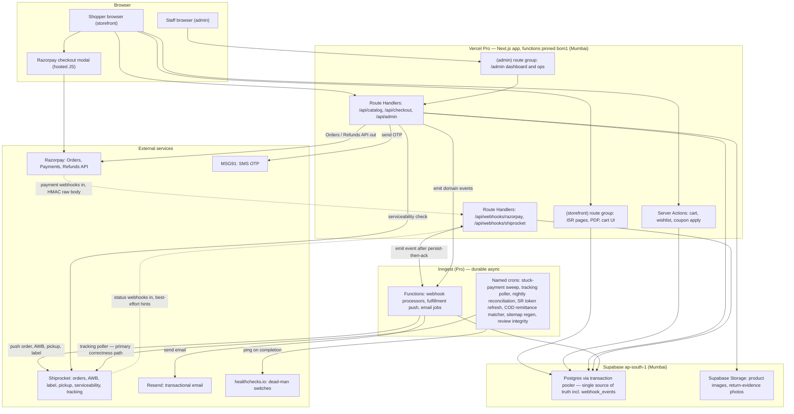
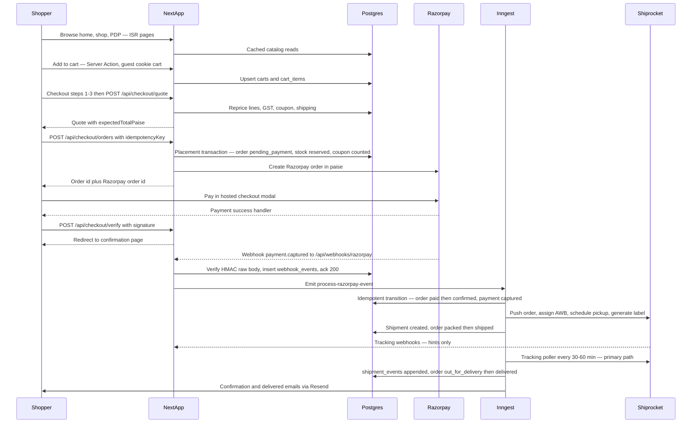

# KAKOA — System Architecture

> **Master architecture document.** One deployable, one database, one async backbone. Sources of truth: `PROJECT_PLAN.md` §1 (Stack & Decision Record), §2 (Team Structure), §3.0 (Contract v1.0.0), §4 (Cross-Cutting Concerns); table-level detail in [DATABASE_ERD.md](DATABASE_ERD.md); module-level specs in [modules/README.md](modules/README.md).
> Conventions everywhere: money is INR **integer paise**, timestamps `timestamptz` UTC displayed IST, API envelope + error codes per Contract §2.1.

---

## 1. System Topology (master diagram)

**Arrow legend:** solid `-->` = synchronous API call **out** from our code · dashed `-.->` = webhook/event **in** from an external system.



Reading notes:

- **Webhook discipline (the load-bearing pattern, PROJECT_PLAN §1):** verify HMAC over the **raw body** → `INSERT INTO webhook_events` with UNIQUE `(provider, event_id)` → ack 200 in < 1 s → process asynchronously via Inngest, idempotently. Shiprocket webhooks are hints; the 30–60 min **poller is the primary correctness path**.
- The Razorpay checkout modal is loaded in the shopper's browser (hosted checkout) — card data never touches our servers. CSP allowlists the Razorpay domains.
- All crons ping healthchecks.io **on completion**; a missed ping (absence of success) pages.

---

## 2. Golden Path — Guest Prepaid Order, End to End



---

## 3. Runtime Topology — One Deployable

There is exactly **one deployed application**: the Next.js App Router app on Vercel Pro, functions pinned to `bom1`, `output: 'standalone'` kept as the DO App Platform escape hatch (PROJECT_PLAN §1). A **modular monolith** — no microservices, no Kafka/Redis/event buses. Its surfaces:

| Surface | What runs there |
|---|---|
| `(storefront)` route group | ISR/SSG pages (Home, Shop, PDP, Journal, legal), SEO-critical server rendering |
| `(admin)` route group | Admin panel behind session middleware; unauthenticated probes get 404, not 403 |
| Server Actions | Cart mutations, wishlist toggle, coupon apply — session-scoped writes |
| Route Handlers `/api/*` | Public catalog reads (cached), checkout/quote/placement, auth OTP, admin API |
| Route Handlers `/api/webhooks/*` | Raw-body HMAC verification, persist-then-ack; exempt from session middleware, `Cache-Control: no-store` |
| Inngest functions | Same codebase, invoked by Inngest — webhook processors, fulfillment pipeline, emails, all named crons |

State lives in exactly two places: **Supabase Postgres** (ap-south-1, transaction pooler — single-digit ms from `bom1`) and **Supabase Storage** (images, evidence photos). `webhook_events` in Postgres is the async source of truth; Inngest provides durability/retries but never holds authoritative state.

## 4. Package Dependency Rule (web → db → core)

Turborepo + pnpm monorepo: `apps/web` + `packages/{db,core,integrations,ui,config,jobs}`. The import-boundary lint (CI gate, PROJECT_PLAN §2.4) enforces a strict downward flow:

```
apps/web ──► packages/db ──► packages/core
   │              (only designated data layers import db)
   ├──► packages/integrations (razorpay, shiprocket, resend, msg91 clients)
   ├──► packages/ui   (presentational only; may import core; never db, never app code)
   └──► packages/config (zod env schema, parsed at boot — missing var = crash at startup)
```

Binding rules:

- `packages/core` imports **nothing app-side** — money-as-paise, GST, the order state machine, zod contracts, fixtures. Pure domain.
- Only designated data layers import `packages/db`; storefront components never import admin code and vice versa.
- `packages/ui` is presentational-only: may import `core` (enums, `formatPaise()`, `formatIST()`), never `db`, zero data fetching.
- TS types are `z.infer` from `packages/core/src/contracts/` only; hand-written duplicates fail lint. Floats in money code fail lint.

## 5. Data-Flow Narratives — the Four Money-Critical Flows

### 5.1 Prepaid (Razorpay)

The golden path in §2. Key invariants: placement is one transaction (order `pending_payment` + stock reservation + coupon redemption count, guarded by `idempotencyKey` UNIQUE); server recomputes the total and 409s on `PRICE_CHANGED`; the **webhook — not the browser redirect — is the truth** for `paid`. If the webhook never arrives, the **stuck-payment sweep** (15–30 min cadence) queries the Razorpay API for orders sitting in `pending_payment` and repairs state; the nightly reconciliation asserts Razorpay = DB for the day. Both crons ping dead-man switches.

### 5.2 COD

Placement requires phone OTP (challenge purpose `cod_verification`), pincode COD-serviceability, order total ≤ COD cap, and no RTO flag on the phone — re-checked at placement. Order lands `cod_pending_confirmation` and enters the **admin COD confirmation queue** (claiming, attempt logging, auto-cancel on no-contact). Staff confirm → order `confirmed` → same Shiprocket pipeline as prepaid, with COD flag so the courier collects cash. Post-delivery, the **COD remittance matcher** cron reconciles Shiprocket remittance reports against expected COD amounts; unmatched remittances and RTO losses surface in admin. The COD queue must be live and staff-tested **before any paid marketing spend** (PROJECT_PLAN §2.5 gate 3).

### 5.3 Refund

Sources: customer cancellation (pre-dispatch), admin-initiated, or an approved return request. Prepaid: a `refunds` row is created, then `POST /v1/payments/:id/refund` (full or partial with line-level coupon-discount allocation and snapshot GST from `order_items`); Razorpay's `refund.processed` webhook — backstopped by reconciliation — flips the row terminal. COD refunds are **manual bank/UPI payouts** recorded against the same `refunds` table with evidence. Refund math is validated against hand-computed fixtures in CI; refund paths carry the bus-factor review rule (Dev C + B/E).

### 5.4 RTO (return to origin)

The 20–30 % COD RTO risk is the #1 unit-economics threat (PROJECT_PLAN §1). NDR events arrive via Shiprocket webhook and, authoritatively, the poller. Failed delivery → NDR view in admin (reattempt/instruct) → courier exhausts attempts → shipment enters RTO states → order reaches its RTO terminal state; stock is restocked on RTO receipt via delta inventory adjustments, the loss is recorded, and the customer phone accrues an RTO flag that future COD placement checks. Shipment states are **monotonic** — out-of-order webhook delivery can never move a shipment backwards.

## 6. Failure-Mode Table

Behavior when each external dependency is down. Design stance: **the DB is the source of truth; webhooks are accelerators; reconciliation is the correctness path** — so most outages degrade to "slower, not wrong."

| Service down | Immediate behavior | Recovery path |
|---|---|---|
| **Razorpay** | Prepaid order-create fails → checkout shows retry; COD unaffected. In-flight payments missing webhooks sit in `pending_payment`. Refund API calls fail. | Stuck-payment sweep (15–30 min) + nightly reconciliation repair state from Razorpay API once it returns; refunds retry via Inngest with backoff. |
| **Shiprocket** | Checkout unaffected (orders still place and confirm). Fulfillment pushes, AWB/label/pickup calls fail; tracking goes stale. Serviceability check degrades per checkout spec. | Inngest retries push jobs durably; poller back-fills tracking on recovery; token refresh cron + token-age > 9 days alert guard the auth root cause. Orders queue in `confirmed`/fulfillment-blocked, nothing is lost. |
| **MSG91** | SMS OTP fails → blocked: OTP login, COD placement verification, guest order lookup. **Guest prepaid checkout unaffected** (no OTP required). | Retry/resend paths; OTP verify-success-rate < 70 % business alert fires. Email OTP unaffected via Resend where applicable. |
| **Resend** | Transactional emails fail. **Never blocks an order flow** — email jobs are fire-and-forget Inngest functions; failures log structured `email.*` errors and retry. Guests with no email are skipped by design, never crash. | Inngest retries with backoff; the confirmation page compensates for missing confirmation email. |
| **Inngest** | Webhooks still **persist-then-ack** into `webhook_events` (the route handler needs only Postgres). Async processing and crons pause; orders freeze mid-lifecycle. | On recovery, processors drain unprocessed `webhook_events` idempotently; missed cron pings trip healthchecks.io dead-man pages so the outage is noticed within one cadence. |
| **Supabase Postgres** | Full outage — storefront, admin, webhooks all fail (webhook senders retry on non-200). | Razorpay/Shiprocket redeliver + reconciliation replays the gap window. Prod has PITR (RPO ≤ 5 min, RTO ≤ 2 h) + post-restore reconciliation runbook (PROJECT_PLAN §4.6). |
| **healthchecks.io** | Zero runtime impact — monitoring blind spot only. Crons run normally; missed-ping paging is unavailable. | Sentry + Inngest per-function failure alerts remain as the second layer; uptime checker on `/api/health` is independent. |

## 7. Environment Matrix (summary)

Four environments; the full truth table is **PROJECT_PLAN.md §4.2** — this is the orientation view. Env-var validation is a single `packages/config` zod schema parsed at boot in every runtime: missing var = crash at startup, never at request time.

| | Local | Preview (per-PR) | Staging | Production |
|---|---|---|---|---|
| DB | Docker Postgres / Supabase branch | Supabase branch, CI-migrated | Dedicated Supabase project | Supabase ap-south-1, PITR on |
| Razorpay | Test keys | Test keys + replay fixtures | Test keys + real webhook subscription | **Live keys**, distinct webhook secret |
| Shiprocket | In-repo mock | In-repo mock (no sandbox exists) | Mock default; `SHIPROCKET_LIVE=1` drill | Real API, DB-cached 240 h token |
| SMS / Email | Console log / Mailpit | Test code `000000` / capture | Real, team-scoped | Real, spend alerts + DMARC verified |
| Indexing | n/a | noindex | noindex | Indexable, sitemap live |

---

## Related documents

- [DATABASE_ERD.md](DATABASE_ERD.md) — full ERD and per-table specs
- [modules/README.md](modules/README.md) — index of all 24 module specs
- `PROJECT_PLAN.md` — §1 decisions, §2 team/lanes, §3.0 Contract v1.0.0, §4 cross-cutting (CI/CD, environments, monitoring, security, backup, launch gates)
