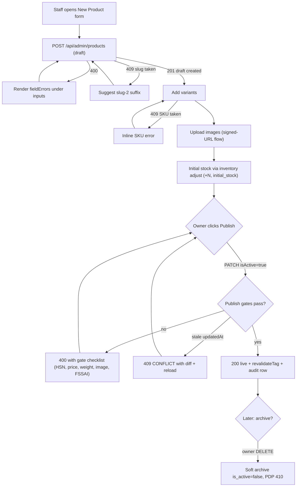
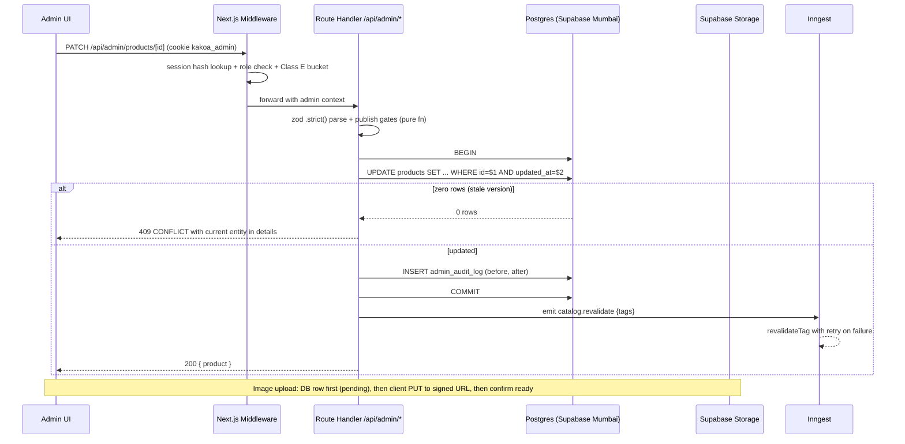
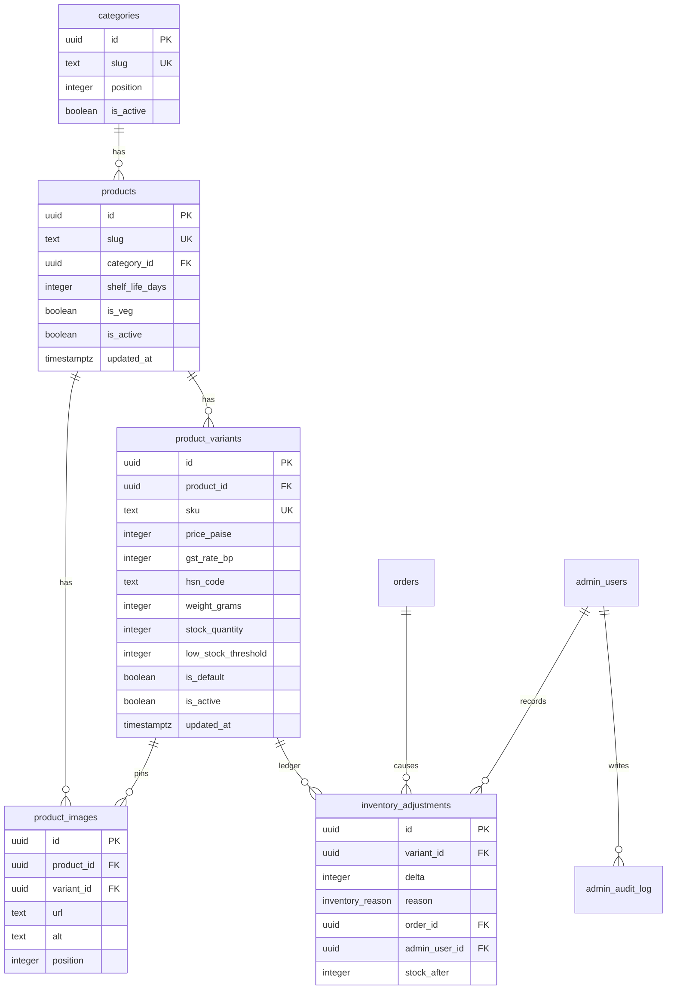
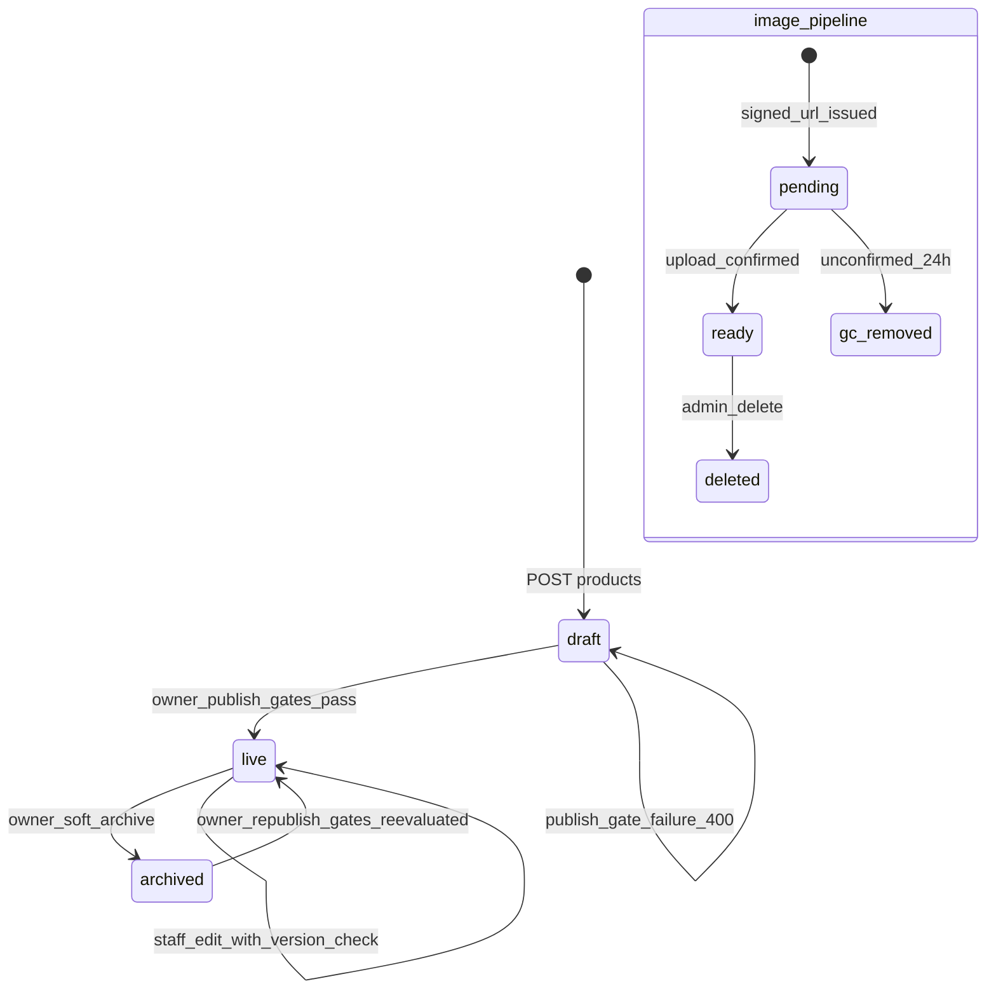

# Module Spec — Admin: Catalog & Inventory Management (Phase 1)

> Sources of truth: `docs/DATABASE_ERD.md` (§3.2–3.5, §3.22), `PROJECT_PLAN.md` §3.0 (Contract v1.0.0), §3.3 (Catalog), §3.14 (Admin Panel), risk-engineering Modules 1 & 10.
> Owner: **Dev D** (admin routes + UI), **Dev B** (schema/migrations/core contracts). Phase 1, Weeks 3–5.
> Scope: admin-side products / variants / images CRUD, soft archive, publish validation, delta-only inventory adjustments + ledger, low-stock list, optimistic-version conflict handling, bulk CSV import. Storefront read endpoints are specced in the Catalog storefront module doc.

> **Admin UI stack (decision 2026-07-02):** this module's screens are built with **shadcn/ui (new-york, CLI v4) + TanStack Table** — owned source in `apps/web/src/components/ui/`, themed to KAKOA tokens via CSS variables. Standard patterns: TanStack-powered `Table` for lists (server-driven pagination/sort/filter), `DropdownMenu` row actions, `Sheet` for edit panels, **`AlertDialog` (never `Dialog`) for destructive confirmations**, `Command` palette for quick-nav, `Badge` for enum statuses. See PROJECT_PLAN §4.4 and design-system.md for the surface boundary.

---

## 1. Field-Level Specification

All admin mutations validate through zod schemas in `packages/core/src/contracts/admin/catalog.ts` with `.strict()` — unknown keys are rejected with 400 `VALIDATION_ERROR` and `fieldErrors` from `flatten()`. Money is entered in ₹ in the UI and converted to integer paise before submission; the API accepts **paise integers only**.

### 1.1 Product (`POST /api/admin/products`, `PATCH /api/admin/products/[id]`)

| Field | Type | Required | Max length | Validation rule (exact) | User-facing error message |
|---|---|---|---|---|---|
| `slug` | string | yes (create) | 80 | `^[a-z0-9-]+$`; no leading/trailing/double hyphen: `^[a-z0-9]+(-[a-z0-9]+)*$`; unique across `products` | "Slug can only contain lowercase letters, numbers and hyphens." / on 409: "This slug is already in use — try 'truffle-noir-2'." |
| `name` | string | yes | 120 | trimmed, length 2–120 | "Product name must be 2–120 characters." |
| `categoryId` | uuid | yes | — | zod `.uuid()`; must reference an existing `categories.id` | "Choose a valid category." |
| `blurb` | string | no (default `''`) | 200 | trimmed, ≤ 200 chars | "Card blurb must be 200 characters or fewer." |
| `description` | string | no (default `''`) | 10000 | markdown; sanitized at save through the allowlist sanitizer (no `<script>`, no event handlers) | "Description contains disallowed HTML." |
| `tastingNotes` | string[] | no (default `[]`) | 8 items × 30 chars | each item trimmed, 1–30 chars, max 8 items | "Tasting notes: up to 8 entries, 30 characters each." |
| `ingredients` | string | required for publish | 2000 | non-empty (post-trim) when `isActive=true` (publish gate) | "Ingredient list is required before publishing (FSSAI)." |
| `allergens` | string | required for publish | 500 | non-empty when `isActive=true` | "Allergen declaration is required before publishing (FSSAI)." |
| `nutritionFacts` | jsonb object | no | 20 keys | `Record<string, string>` with numeric-with-unit values, e.g. `^\d+(\.\d+)?\s?(g|mg|kcal|kJ|%)$` | "Nutrition values must be a number with a unit (g, mg, kcal)." |
| `shelfLifeDays` | integer | required for publish | — | int, `> 0`, ≤ 3650 (DB CHECK `shelf_life_days > 0`) | "Shelf life must be a positive number of days." |
| `storageInstructions` | string | no | 500 | trimmed | "Storage instructions must be 500 characters or fewer." |
| `isVeg` | boolean | yes (default `true`) | — | boolean | — |
| `badge` | string \| null | no | — | enum: `'Best seller' \| 'New' \| 'Limited' \| 'Vegan' \| 'Seasonal'` or null | "Badge must be one of the allowed labels." |
| `tone` | string | yes (default `'dark'`) | — | enum from design system (`dark`, `milk`, `berry`, `pistachio`, `caramel`, `classic`) | "Pick a valid tone." |
| `isActive` | boolean | no | — | publish gates apply on `false → true` (see §1.4); **owner-only** on flip | "Publish blocked — fix the items below." / 403: "Only the owner can publish or archive products." |
| `updatedAt` | ISO timestamptz | yes (PATCH only) | — | must equal the row's current `updated_at` (optimistic version) | "This product changed since you loaded it. Review the differences and retry." |

`rating_avg` / `rating_count` are **never writable** through this API (Reviews module recomputes them); any attempt is rejected by `.strict()`.

### 1.2 Variant (`POST /api/admin/products/[id]/variants`, `PATCH /api/admin/variants/[id]`)

| Field | Type | Required | Max length | Validation rule (exact) | User-facing error message |
|---|---|---|---|---|---|
| `sku` | string | yes (create) | 40 | `^[A-Z0-9]+(-[A-Z0-9]+)*$` (uppercase alphanumeric segments, hyphen-separated, e.g. `KK-TRN-16PC`); unique across `product_variants` | "SKU may use uppercase letters, numbers and hyphens (e.g. KK-TRN-16PC)." / 409: "This SKU already exists on another variant." |
| `name` | string | yes | 60 | trimmed, 2–60 chars | "Variant name must be 2–60 characters." |
| `pricePaise` | integer | yes | — | int, `> 0`, ≤ 10_000_000 (₹1,00,000 sanity cap); DB CHECK `price_paise > 0` | "Price must be greater than ₹0." |
| `compareAtPricePaise` | integer \| null | no | — | int, must satisfy `compareAtPricePaise > pricePaise` (DB CHECK) | "Compare-at price must be higher than the selling price." |
| `gstRateBp` | integer | yes (default 500) | — | int, `0 <= gstRateBp <= 2800` (DB CHECK), **owner-only** to change on a live variant | "GST rate must be between 0 and 2800 basis points." |
| `hsnCode` | string | yes (default `'1806'`) | 8 | `^\d{4}(\d{2})?(\d{2})?$` (4/6/8-digit HSN) AND in the HSN whitelist (`1806`, `180631`, `180632`, `180690`) | "HSN code must be a valid 4/6/8-digit code from the approved list." |
| `weightGrams` | integer | yes | — | int, `> 0`, ≤ 50000 (DB CHECK `weight_grams > 0`) | "Net weight must be greater than 0 grams." |
| `shipWeightGrams` | integer | yes | — | int, `>= weightGrams` | "Packed weight can't be less than net weight." |
| `lengthCm` / `breadthCm` / `heightCm` | numeric(6,2) | no | — | `> 0`, ≤ 200.00, max 2 decimals | "Dimensions must be positive, up to 200 cm." |
| `lowStockThreshold` | integer | no (default 10) | — | int, `0 <= n <= 1000` | "Low-stock threshold must be 0–1000." |
| `position` | integer | no (default 0) | — | int ≥ 0 | — |
| `isDefault` | boolean | no | — | setting `true` transactionally clears the previous default (partial unique index `product_variants_one_default_idx` is the backstop) | "Couldn't set default — reload and retry." |
| `isActive` | boolean | no | — | archive/unarchive is **owner-only** | 403: "Only the owner can archive or restore variants." |
| `updatedAt` | ISO timestamptz | yes (PATCH) | — | optimistic version check | "This variant changed since you loaded it." |

`stockQuantity` is **NOT writable** via product/variant endpoints — it only moves through `/api/admin/inventory/adjust` (relative deltas) and checkout's atomic decrement. `.strict()` rejects it: "Stock can't be edited here — use an inventory adjustment."

### 1.3 Image (`POST /api/admin/products/[id]/images`, `PATCH` reorder, `DELETE`)

| Field | Type | Required | Max length | Validation rule (exact) | User-facing error message |
|---|---|---|---|---|---|
| `fileName` | string | yes | 128 | `^[A-Za-z0-9._-]+\.(jpg|jpeg|png|webp|avif)$` (case-insensitive extension); no path separators | "File must be a JPG, PNG, WebP or AVIF image." |
| `contentType` | string | yes | — | enum: `image/jpeg \| image/png \| image/webp \| image/avif`; must agree with extension | "Unsupported image type." |
| `sizeBytes` | integer | yes | — | `0 < sizeBytes <= 5_242_880` (5 MB) | "Images must be 5 MB or smaller." |
| `variantId` | uuid \| null | no | — | must belong to the same product | "That variant doesn't belong to this product." |
| `alt` | string | yes (before product publish) | 160 | trimmed, 3–160 chars; required non-empty for save in admin UI | "Alt text is required (3–160 characters)." |
| `order` | uuid[] (reorder) | yes | 12 | array of image ids; must be exactly the set of this product's images (a permutation) | "Reorder list doesn't match this product's images — reload." |

Max **12 images per product**; the 13th upload returns 400 `VALIDATION_ERROR`: "A product can have up to 12 images."

### 1.4 Publish validation gates (product `isActive: false → true`)

Publish is a pure function `validatePublish(product, variants, images)` in `packages/core`, unit-tested; ALL failures returned together in `fieldErrors`:

| Gate | Rule | Error message |
|---|---|---|
| HSN present | every active variant has whitelisted `hsn_code` | "Variant {sku}: HSN code missing or invalid — never publish untaxed." |
| Price valid | every active variant `price_paise > 0` | "Variant {sku}: price must be greater than ₹0." |
| Weight present | every active variant `weight_grams > 0` and `ship_weight_grams` set | "Variant {sku}: net and packed weight are required." |
| ≥ 1 image | at least one `product_images` row with non-empty `alt` | "Add at least one image with alt text before publishing." |
| ≥ 1 active variant | at least one variant with `is_active=true` | "Add at least one active variant before publishing." |
| Exactly one default | one variant has `is_default=true` | "Choose a default variant." |
| FSSAI copy | `ingredients` and `allergens` non-empty, `shelf_life_days > 0` | "Complete FSSAI details: ingredients, allergens and shelf life." |

### 1.5 Inventory adjustment (`POST /api/admin/inventory/adjust`)

| Field | Type | Required | Validation rule (exact) | User-facing error message |
|---|---|---|---|---|
| `variantId` | uuid | yes | `.uuid()`; must exist (archived variants ARE adjustable — write-offs on archived stock are legitimate) | "Variant not found." |
| `delta` | integer | yes | int, `delta !== 0`, `-100000 <= delta <= 100000` (DB CHECK `delta <> 0`) | "Adjustment can't be zero." / "Adjustment out of range." |
| `reason` | enum | yes | one of `'manual_adjustment' \| 'stock_correction' \| 'damage_writeoff' \| 'initial_stock'` (the admin-permitted subset of `inventory_reason`; order-driven reasons are reserved for system writes) | "Pick a valid reason." |
| `note` | string | no | trimmed, ≤ 300 chars; **required when `reason='damage_writeoff'`** | "A note is required for damage write-offs." |
| `clientOpId` | uuid | yes | idempotency key generated per form submission; duplicate within 24h returns the original result (409 `DUPLICATE_REQUEST` semantics → replayed 200 body) | — |

There is **no absolute "set stock" field anywhere** — relative deltas only (risk Module 10 #4).

### 1.6 Bulk CSV import (`POST /api/admin/catalog/import`)

| Field | Type | Required | Validation rule (exact) | User-facing error message |
|---|---|---|---|---|
| `importId` | uuid | yes | client-generated per file selection; re-upload with the same `importId` no-ops and replays the original result | — |
| `file` | multipart CSV | yes | ≤ 1 MB, ≤ 500 data rows, UTF-8, header row exactly: `sku,price_paise,compare_at_price_paise,gst_rate_bp,hsn_code,low_stock_threshold` | "CSV header must be exactly: sku,price_paise,…" / "Imports are limited to 500 rows." |
| per-row `sku` | string | yes | `^[A-Z0-9]+(-[A-Z0-9]+)*$`, must exist in `product_variants` | "Row {n}: SKU '{sku}' not found." |
| per-row `price_paise` | integer | yes | digits only `^\d+$`, `> 0` | "Row {n}: price_paise must be a positive integer (paise)." |
| per-row `compare_at_price_paise` | integer \| empty | no | empty or `^\d+$` and `> price_paise` | "Row {n}: compare_at must exceed price." |
| per-row `gst_rate_bp` | integer | yes | `^\d+$`, 0–2800 | "Row {n}: gst_rate_bp must be 0–2800." |
| per-row `hsn_code` | string | yes | HSN whitelist regex per §1.2 | "Row {n}: invalid HSN code." |
| per-row `low_stock_threshold` | integer \| empty | no | empty or `^\d+$`, 0–1000 | "Row {n}: threshold must be 0–1000." |
| any cell | — | — | **formula-injection guard**: cells beginning with `=`, `+`, `-`, or `@` are rejected on import (and prefixed with `'` on every export) | "Row {n}, column {c}: value looks like a spreadsheet formula and was rejected." |

Duplicate SKU within the file → "Row {n}: duplicate SKU '{sku}' (first seen at row {m})." Every row is zod-validated **before** the transaction begins; any failure → nothing applied, full per-row error report returned. Import is **owner-only** (it mutates prices/GST on live variants).

---

## 2. Workflow / User Flow

### 2.1 Product creation → publish (Dev D admin UI)

1. Staff opens `/admin/products` → "New product". Fills §1.1 fields; slug auto-generated from name (`slugify`, deterministic `-2` suffix on collision), editable.
2. `POST /api/admin/products` → 201 draft (`is_active=false`). Failure: 400 renders `fieldErrors` per field; 409 slug-taken shows suffix suggestion.
3. Staff adds variants (§1.2). SKU 409 → inline error, form retained. First variant auto-checks `isDefault`.
4. Staff uploads images: request signed URL (DB row created first, `pending`), browser PUTs to Supabase Storage, client confirms → row flips ready. Drag-reorder → `PATCH` with the full `order` array.
5. Staff records opening stock: `POST /api/admin/inventory/adjust` `{delta: +N, reason: 'initial_stock'}`.
6. Owner opens the publish panel → all §1.4 gates evaluated server-side on `PATCH { isActive: true, updatedAt }`.
   - All green → 200; `revalidateTag('product:{slug}')`, `('category:{slug}')`, `('catalog')` fired; audit row written; product live.
   - Any gate red → 400 `VALIDATION_ERROR` with the aggregated gate list; UI shows the publish-blocker checklist.
   - Stale `updatedAt` → 409 `CONFLICT` with current entity in `details`; UI renders the before/after diff + "Reload & reapply".
7. Archive: `DELETE /api/admin/products/[id]` (owner) → soft `is_active=false`; never a hard delete; PDP returns 410; storefront search excludes it in-query.



### 2.2 Inventory adjustment flow

1. Staff opens `/admin/inventory` (optionally `?lowStock=true` — backed by `product_variants_low_stock_idx`).
2. Picks a variant → delta-only form: signed delta, reason enum, note.
3. Submit → single transaction: guarded `UPDATE product_variants SET stock_quantity = stock_quantity + $delta WHERE id = $id AND stock_quantity + $delta >= 0 RETURNING stock_quantity` + `INSERT inventory_adjustments (variant_id, delta, reason, admin_user_id, note, stock_after)` + `admin_audit_log` row.
4. Zero rows updated (would go negative) → 409 `CONFLICT`: "This would take stock below zero — current stock is {n}." Nothing written.
5. Success toast: "Stock {+delta} → {stock_after}". Ledger view refreshes; `revalidateTag` for the product fires (stock badge freshness; PDP live-stock endpoint is authoritative regardless).

---

## 3. System Design



**External service dependencies and failure behavior:**

| Dependency | Used for | When down / timing out (exact behavior) |
|---|---|---|
| Supabase Postgres | everything | Route returns 500 `INTERNAL` with `requestId`; no partial writes (single-transaction rule). Admin UI shows full-width retry banner. |
| Supabase Storage | image signed-URL upload | Signed-URL create fails → 502 `UPSTREAM_ERROR`, the `pending` DB row remains and is garbage-collected by the nightly Inngest job if `pending > 24h`. Client PUT fails → row stays `pending`, UI shows "Upload failed — retry" and re-requests a URL. Never a dangling public URL. |
| Vercel revalidation (`revalidateTag`) | ISR freshness after mutations | Failure is **non-blocking**: mutation still commits; `catalog.revalidate_failed {tag, error}` logged; Inngest retries (backoff, max 5); alert when failure rate > 5% over 15 min. Storefront stock truth is unaffected (uncached `GET /api/stock/[variantId]`). |
| Inngest | revalidation retry, nightly image GC, nightly HSN/GST integrity check | Down → retries queue when it recovers; the 15-minute time-based ISR fallback bounds staleness; integrity check has a dead-man ping. |

**Caching strategy:** admin reads are **uncached** (`Cache-Control: no-store`) — admins must always see live truth, especially stock and version timestamps. Storefront catalog GETs are cached (`s-maxage=60, stale-while-revalidate=300`) + ISR with tags `product:{slug}`, `category:{slug}`, `catalog`; **invalidation trigger** = every admin catalog mutation calls `revalidateTag` for the affected product + category + `catalog` (retried via Inngest). Stock is never trusted from cache anywhere.

---

## 4. Database Schema

DDL reproduced verbatim from `docs/DATABASE_ERD.md` §3.2–3.5, §3.22. This module owns full CRUD on the catalog tables and admin-reason writes to `inventory_adjustments`; order-driven ledger writes belong to Checkout/Fulfillment.

### `categories` (Contract §1.2)

| Column | Type | Constraints |
|---|---|---|
| `id` | `uuid` | `PRIMARY KEY DEFAULT gen_random_uuid()` |
| `slug` | `text` | `NOT NULL UNIQUE CHECK (slug ~ '^[a-z0-9-]+$')` |
| `name` | `text` | `NOT NULL` |
| `description` | `text` | |
| `position` | `integer` | `NOT NULL DEFAULT 0` |
| `is_active` | `boolean` | `NOT NULL DEFAULT true` |
| `created_at` | `timestamptz` | `NOT NULL DEFAULT now()` |
| `updated_at` | `timestamptz` | `NOT NULL DEFAULT now()` |

### `products` (Contract §1.3)

| Column | Type | Constraints |
|---|---|---|
| `id` | `uuid` | `PRIMARY KEY DEFAULT gen_random_uuid()` |
| `slug` | `text` | `NOT NULL UNIQUE CHECK (slug ~ '^[a-z0-9-]+$')` |
| `name` | `text` | `NOT NULL` |
| `category_id` | `uuid` | `NOT NULL REFERENCES categories(id) ON DELETE RESTRICT` |
| `blurb` | `text` | `NOT NULL DEFAULT ''` |
| `description` | `text` | `NOT NULL DEFAULT ''` |
| `tasting_notes` | `text[]` | `NOT NULL DEFAULT '{}'` |
| `ingredients` | `text` | `NOT NULL DEFAULT ''` |
| `allergens` | `text` | `NOT NULL DEFAULT ''` |
| `nutrition_facts` | `jsonb` | |
| `shelf_life_days` | `integer` | `CHECK (shelf_life_days > 0)` |
| `storage_instructions` | `text` | |
| `is_veg` | `boolean` | `NOT NULL DEFAULT true` |
| `badge` | `text` | |
| `tone` | `text` | `NOT NULL DEFAULT 'dark'` |
| `rating_avg` | `numeric(3,2)` | `NOT NULL DEFAULT 0` |
| `rating_count` | `integer` | `NOT NULL DEFAULT 0` |
| `is_active` | `boolean` | `NOT NULL DEFAULT true` |
| `created_at` | `timestamptz` | `NOT NULL DEFAULT now()` |
| `updated_at` | `timestamptz` | `NOT NULL DEFAULT now()` |

```sql
CREATE INDEX products_category_active_idx ON products (category_id) WHERE is_active;
CREATE INDEX products_search_idx ON products USING gin ((name || ' ' || blurb) gin_trgm_ops);
```

### `product_variants` (Contract §1.4)

| Column | Type | Constraints |
|---|---|---|
| `id` | `uuid` | `PRIMARY KEY DEFAULT gen_random_uuid()` |
| `product_id` | `uuid` | `NOT NULL REFERENCES products(id) ON DELETE CASCADE` |
| `sku` | `text` | `NOT NULL UNIQUE` |
| `name` | `text` | `NOT NULL` |
| `price_paise` | `integer` | `NOT NULL CHECK (price_paise > 0)` |
| `compare_at_price_paise` | `integer` | `CHECK (compare_at_price_paise > price_paise)` |
| `gst_rate_bp` | `integer` | `NOT NULL DEFAULT 500 CHECK (gst_rate_bp BETWEEN 0 AND 2800)` |
| `hsn_code` | `text` | `NOT NULL DEFAULT '1806'` |
| `weight_grams` | `integer` | `NOT NULL CHECK (weight_grams > 0)` |
| `ship_weight_grams` | `integer` | `NOT NULL` |
| `length_cm` | `numeric(6,2)` | |
| `breadth_cm` | `numeric(6,2)` | |
| `height_cm` | `numeric(6,2)` | |
| `stock_quantity` | `integer` | `NOT NULL DEFAULT 0 CHECK (stock_quantity >= 0)` |
| `low_stock_threshold` | `integer` | `NOT NULL DEFAULT 10` |
| `position` | `integer` | `NOT NULL DEFAULT 0` |
| `is_default` | `boolean` | `NOT NULL DEFAULT false` |
| `is_active` | `boolean` | `NOT NULL DEFAULT true` |
| `created_at` | `timestamptz` | `NOT NULL DEFAULT now()` |
| `updated_at` | `timestamptz` | `NOT NULL DEFAULT now()` |

```sql
CREATE INDEX product_variants_product_idx ON product_variants (product_id);
CREATE UNIQUE INDEX product_variants_one_default_idx
  ON product_variants (product_id) WHERE is_default;
CREATE INDEX product_variants_low_stock_idx
  ON product_variants (stock_quantity) WHERE is_active AND stock_quantity <= 10;
```

### `product_images` (Contract §1.5)

| Column | Type | Constraints |
|---|---|---|
| `id` | `uuid` | `PRIMARY KEY DEFAULT gen_random_uuid()` |
| `product_id` | `uuid` | `NOT NULL REFERENCES products(id) ON DELETE CASCADE` |
| `variant_id` | `uuid` | `REFERENCES product_variants(id) ON DELETE SET NULL` |
| `url` | `text` | `NOT NULL` |
| `alt` | `text` | `NOT NULL DEFAULT ''` |
| `position` | `integer` | `NOT NULL DEFAULT 0` |
| `created_at` | `timestamptz` | `NOT NULL DEFAULT now()` |

```sql
CREATE INDEX product_images_product_pos_idx ON product_images (product_id, position);
```

### `inventory_adjustments` (Contract §1.22)

| Column | Type | Constraints |
|---|---|---|
| `id` | `uuid` | `PRIMARY KEY DEFAULT gen_random_uuid()` |
| `variant_id` | `uuid` | `NOT NULL REFERENCES product_variants(id) ON DELETE RESTRICT` |
| `delta` | `integer` | `NOT NULL CHECK (delta <> 0)` |
| `reason` | `inventory_reason` | `NOT NULL` |
| `order_id` | `uuid` | `REFERENCES orders(id) ON DELETE SET NULL` |
| `admin_user_id` | `uuid` | `REFERENCES admin_users(id) ON DELETE SET NULL` |
| `note` | `text` | |
| `stock_after` | `integer` | `NOT NULL CHECK (stock_after >= 0)` |
| `created_at` | `timestamptz` | `NOT NULL DEFAULT now()` |

```sql
CREATE INDEX inv_adj_variant_idx ON inventory_adjustments (variant_id, created_at DESC);
CREATE UNIQUE INDEX inv_adj_once_per_cause_idx ON inventory_adjustments (order_id, variant_id, reason)
  WHERE reason IN ('order_placed','order_cancelled','payment_expired','rto_restock','return_restock');
```

`inventory_reason` enum (Contract, ERD §2): `'initial_stock','order_placed','order_cancelled','payment_expired','rto_restock','return_restock','manual_adjustment','stock_correction','damage_writeoff'` — this module may write only `initial_stock`, `manual_adjustment`, `stock_correction`, `damage_writeoff`.



---

## 5. API Design

All endpoints: Route Handlers under `/api/admin/*`, envelope per Contract §2.1 (`ApiResult<T>` with `requestId`), rate class **E (600/min per admin session)**, auth tier `admin:staff` unless marked **owner**. Every mutation writes an `admin_audit_log` row in the same transaction. Common codes apply everywhere and are not repeated per row: 400 `VALIDATION_ERROR`, 401 `UNAUTHORIZED`, 403 `FORBIDDEN`, 429 `RATE_LIMITED`, 500 `INTERNAL`.

| # | Method + Route | Auth | Request → Response | Endpoint-specific errors |
|---|---|---|---|---|
| 1 | `GET /api/admin/products` | staff | `?q=&category=&active=&page=&pageSize=20` → `{ products: AdminProductRow[] }` + `meta.total` (row: id, slug, name, category, defaultVariantPricePaise, stockRollup, ratingAvg, isActive, updatedAt) | — |
| 2 | `POST /api/admin/products` | staff | `ProductInput` (§1.1) → 201 `{ product }` (draft, `is_active=false`) | 409 `CONFLICT` (slug taken, `details: { suggestedSlug }`) |
| 3 | `GET /api/admin/products/[id]` | staff | → `{ product: AdminProductDetail }` (incl. variants, images, publish-gate status) | 404 `NOT_FOUND` |
| 4 | `PATCH /api/admin/products/[id]` | staff; `isActive` flip **owner** | `Partial<ProductInput>` + `updatedAt` → `{ product }` | 404; 409 `CONFLICT` (stale `updatedAt`, `details: { current }`); 400 publish-gate failures aggregated in `fieldErrors` |
| 5 | `DELETE /api/admin/products/[id]` | **owner** | soft archive `is_active=false` → `{ product }`; idempotent (already-archived → same 200) | 404 |
| 6 | `POST /api/admin/products/[id]/variants` | staff | `VariantInput` (§1.2) → 201 `{ variant }` | 404 (product); 409 `CONFLICT` (SKU taken) |
| 7 | `PATCH /api/admin/variants/[id]` | staff; price/`gstRateBp` on live product + `isActive` flip **owner** | `Partial<VariantInput>` + `updatedAt` → `{ variant }`; price/GST changes affect **future orders only** (snapshot rule §1.29) | 404; 409 (stale version) |
| 8 | `DELETE /api/admin/variants/[id]` | **owner** | soft archive → `{ variant }`; blocked if it is the product's only active variant on a live product → 409 `CONFLICT` "Archive the product instead." | 404; 409 |
| 9 | `POST /api/admin/products/[id]/images` | staff | `{ fileName, contentType, sizeBytes, variantId?, alt }` → 201 `{ uploadUrl, image }` — DB row first (`pending`), signed URL TTL 10 min, then client PUT, then `POST /api/admin/images/[id]/confirm` → `{ image }` (ready) | 404; 400 (13th image); 502 `UPSTREAM_ERROR` (Storage signed-URL failure) |
| 10 | `PATCH /api/admin/products/[id]/images` | staff | `{ order: uuid[] }` (full permutation) → `{ images }` | 404; 400 (not a permutation) |
| 11 | `DELETE /api/admin/images/[id]` | staff | hard delete row + async blob delete → `{}` | 404 |
| 12 | `GET /api/admin/inventory` | staff | `?lowStock=true&page=` → `{ rows: { variant, stockQuantity, threshold }[] }` (lowStock via partial index) | — |
| 13 | `POST /api/admin/inventory/adjust` | staff | `{ variantId, delta, reason, note?, clientOpId }` (§1.5) → `{ variant, adjustment }` — atomic guarded update + ledger row in one tx | 404; 409 `CONFLICT` (would go negative, `details: { currentStock }`); duplicate `clientOpId` → replayed original 200 |
| 14 | `GET /api/admin/inventory/ledger` | staff | `?variantId=&page=&pageSize=50` → `{ adjustments: InventoryAdjustment[] }` (delta, reason, note, actor, orderId, stockAfter, createdAt DESC via `inv_adj_variant_idx`) | — |
| 15 | `POST /api/admin/catalog/import` | **owner** | multipart `{ importId, file }` (§1.6) → 200 `{ applied: n, importId }` or 400 `{ fieldErrors: rowErrors[] }` (all-or-nothing) | 400 (per-row report); 409 `DUPLICATE_REQUEST` (same `importId` re-upload → replays original result body) |
| 16 | `GET /api/admin/categories` / `POST` / `PATCH /api/admin/categories/[id]` | staff (POST/PATCH **owner**) | CRUD per §1.1 slug/name/position rules; DELETE is `is_active=false`; deactivation blocked-by-RESTRICT UX requires product reassignment | 409 (slug taken); 409 `CONFLICT` (active products still assigned) |

**Idempotency summary:** GETs trivially; archive endpoints idempotent (repeat → same state, 200); adjust guarded by `clientOpId`; CSV import keyed by `importId`; order-driven restocks (not this module's writes) by `inv_adj_once_per_cause_idx`; `revalidateTag` naturally idempotent with Inngest retry.

---

## 6. Security Standards

- **Rate limits (Contract §2.1):** Class **E — 600/min per admin session** on all `/api/admin/*` routes; CSV import additionally capped at **10 imports/hour/owner** (bulk price mutation is high-blast-radius); every 429 sends `Retry-After` + `X-RateLimit-Limit/Remaining/Reset`. (Storefront reads: Class A 120/min/IP — other doc.)
- **Authz:** cookie `kakoa_admin` (httpOnly, Secure, SameSite=Lax, path-scoped to `/admin` + `/api/admin`), 12h `admin_sessions` lifetime, session-store check per request (revocation immediate). Per-route role assertion server-side; UI hiding is cosmetic. **Owner-only:** publish/archive (product, variant, category), price/`gst_rate_bp` changes on live variants, CSV import. **Staff:** draft create/edit, images, inventory adjustments. Every route is enumerated in the exhaustive authz checklist test (route × {unauthenticated, staff, owner}); adding a route without extending the test fails CI.
- **Input sanitization:** zod `.strict()` on every body (unknown keys rejected); Drizzle parameterized queries only — no string-built SQL anywhere; `description` markdown run through the allowlist sanitizer at save (no script tags, no event handlers, no `javascript:` URLs) AND React-encoded at render; `alt`, `note`, CSV cells stored raw and always output-encoded.
- **CSV injection:** import rejects cells starting with `=`, `+`, `-`, `@` (§1.6); every CSV **export** prefixes `'` on such cells (Contract §3.14 §8).
- **Upload security:** signed URLs are single-object, content-type-pinned, 10-min TTL; `fileName` regex forbids path separators (no traversal into other keys); size capped at 5 MB server-side by Storage policy, not just client checks; bucket public-read but write only via signed URLs.
- **Encryption at rest:** Supabase-managed disk encryption suffices — this module stores no customer PII and no secrets. `admin_audit_log` is append-only (app DB role has no UPDATE/DELETE grants).
- **Never log:** admin session tokens (only SHA-256 hashes exist server-side), signed upload URLs, raw CSV file contents (log row counts + error summaries only), Supabase service-role key.
- **OWASP risks specific to this module:** A01 Broken Access Control → per-route owner gates + exhaustive checklist test; A03 Injection → parameterized Drizzle + CSV formula guard + markdown sanitizer; A04 Insecure Design → delta-only stock (no absolute SET), all-or-nothing imports; A05 Security Misconfiguration → Storage bucket write-locked to signed URLs; A08 Data Integrity → optimistic versioning + append-only ledger/audit; A09 Logging Failures → audit-write failure fails the mutation (never a silent unaudited change).

---

## 7. Edge Cases

(Sourced from risk-engineering Modules 1 & 10 and PROJECT_PLAN §3.3/§3.14; all binding.)

1. **Manual adjustment races the checkout decrement.** Admin records `-2 damage_writeoff` while orders decrement the same variant concurrently. Because adjustments are relative deltas through the same guarded `UPDATE ... WHERE stock_quantity + $delta >= 0`, no sale is ever silently swallowed; a delta that would go negative gets 409 with the live count. Absolute SET does not exist anywhere in API or UI.
2. **Staff edits product while owner archives it concurrently.** Staff save must not resurrect the archived row: `updated_at` optimistic check in the UPDATE WHERE clause; zero rows → 409 `CONFLICT` with the current entity (now `is_active=false`) in `details`; UI shows the diff and a reload path. Never last-write-wins on money-bearing fields.
3. **Publish with missing HSN.** A product activated with a blank/invalid `hsn_code` would silently tax at 0%. Publish gates fail loudly (§1.4); a nightly Inngest integrity check additionally alerts on any active variant with a bad HSN/GST mapping.
4. **Image upload orphans.** Storage PUT succeeds but DB confirm fails (or vice versa). Order is enforced: DB row first (`pending`) → signed-URL PUT → confirm flips ready; nightly Inngest job garbage-collects `pending > 24h` rows and their blobs. GC deleting > 100 blobs in one run raises an upload-bug alert.
5. **Duplicate slugs after transliteration.** "Café Mocha" and "Cafe Mocha" both slugify to `cafe-mocha`. The UNIQUE constraint is the backstop; the generator appends `-2` deterministically; a slug **rename** creates a redirect row (old → new, 301) so indexed URLs survive.
6. **Category deactivation/deletion with assigned products.** Hard delete blocked by `ON DELETE RESTRICT` on `products.category_id`; the UI requires explicit reassignment before deactivation; a deactivated category's slug 301s to `/shop`.
7. **Variant archived while sitting in carts and in Google's index.** Soft archive only; cart render flags the line `unavailable` (Cart module), PDP shows remaining variants or 410 when fully archived; storefront search filters `is_active` on both product and variant **in the query** — a draft/archived SKU appearing in search is a data-exposure bug.
8. **Bulk CSV import fails at row 40 of 100.** Every row zod-validated before the transaction opens; any DB failure mid-tx rolls back everything; response is the per-row error report (row number, field, message) with **nothing applied**. Re-upload with the same `importId` no-ops and replays the original result — double-apply is impossible.
9. **Reorder payload drift.** Two admins reorder images simultaneously; the second `order` array no longer matches the image set (one deleted an image). Permutation check fails → 400 "Reorder list doesn't match — reload", never a partial reorder or dangling position.
10. **Default-variant race.** Two PATCHes set `is_default=true` on different variants of one product concurrently. Clear-then-set runs in a transaction; the partial unique index `product_variants_one_default_idx` makes the loser fail cleanly (mapped to 409) rather than leaving two defaults.
11. **Short-dated stock.** Stock with best-before inside `transit_days + safety_buffer` is on hand but not sellable. v1: owner records `damage_writeoff` ledger entries guided by `shelf_life_days`; the sellable-stock cutoff is a unit-tested pure function so batch tracking can slot in later without API change.
12. **Ledger/counter divergence.** `stock_quantity` must always equal `initial + Σ(delta)` per variant. Because counter update and ledger insert share one transaction, divergence is impossible by construction; a nightly integrity job asserts the invariant anyway and pages on mismatch (indicates a code path bypassing the pattern).

---

## 8. State Machine

Products and variants have a two-state publish lifecycle; images have a three-state upload pipeline. (Inventory has no state machine — it is an append-only ledger plus a monotonic-guarded counter.)

**Product/variant:** `draft (is_active=false)` → `live (is_active=true)` via publish (owner, gates §1.4); `live` → `archived (is_active=false)` via soft archive (owner); `archived` → `live` via re-publish (gates re-evaluated). There is no deleted state — ever.

**Image:** `pending` (DB row created, awaiting PUT) → `ready` (confirm after successful upload) → `deleted` (row removed + blob GC). `pending` → `gc_removed` after 24h without confirm.



---

## 9. Testing Requirements

**Unit (`packages/core`, ≥ 90% line coverage on these pure functions):**
- `validatePublish()` — full gate matrix: missing HSN, price ≤ 0, missing weight, zero images, no active variant, no default, empty FSSAI fields; multiple failures aggregate.
- Slug generation: transliteration collisions, deterministic `-2`/`-3` suffixing, `^[a-z0-9]+(-[a-z0-9]+)*$` invariant.
- Sellable-stock computation incl. best-before cutoff and `low_stock_threshold` flags.
- CSV row schema: every §1.6 rule incl. formula-injection rejection (`=`, `+`, `-`, `@` prefixes), duplicate-SKU-in-file detection, header exact-match.
- Zod schemas for every mutation input: paise bounds, `gst_rate_bp` 0–2800, HSN whitelist regex, SKU regex, `.strict()` unknown-key rejection.

**Integration (ephemeral Postgres, migrations applied):**
- Archive-while-editing: concurrent PATCH vs archive → exactly one wins, loser gets 409 with current entity.
- `inventory/adjust` guarded update under concurrency with a simulated checkout decrement — property test: ledger never negative, no lost updates, `stock_after` chain equals running sum.
- Duplicate `clientOpId` adjust → single ledger row, replayed response.
- Bulk import: injected failure at row 40/100 → zero rows changed; same-`importId` re-upload no-ops; valid import updates all rows + one audit entry.
- One-default partial unique: concurrent default flips → single default survives.
- Category delete restriction; slug-rename redirect row creation; search excludes inactive product AND inactive variant in-query.
- Audit meta-test: every mutating route in this module produces an `admin_audit_log` row or the test fails.
- Authz checklist rows for all 16 endpoints × {unauthenticated, staff, owner}.

**E2E (Playwright, Vercel preview + Supabase preview branch):**
1. **Inventory receive flow:** owner records `+50` `initial_stock` with a note → PDP sellable stock reflects it via the live stock endpoint → ledger shows the entry with actor, reason, and `stock_after`.
2. **Publish-gate flow:** staff drafts a product with no HSN → owner's publish blocked with the gate checklist → staff fixes HSN + adds image → owner publishes → product appears on `/shop` after revalidation.
3. **Concurrent-edit conflict:** two admin sessions load the same variant → session A saves a price change → session B's save returns 409 → B sees the field diff, reloads, reapplies successfully; audit log shows both mutations.

---

## 10. Definition of Done

- [ ] zod `.strict()` schemas live on all 16 endpoints; 400 responses carry `fieldErrors` from `flatten()`; responses parsed through core schemas in dev/CI
- [ ] Optimistic version conflict (409 + current-entity `details` + diff UI) on product, variant, and category PATCHes
- [ ] Publish gates enforced server-side (HSN whitelist, price > 0, weight, ≥1 image with alt, ≥1 active variant, one default, FSSAI copy) — pure function unit-tested
- [ ] Delta-only inventory adjustments with same-tx ledger row + `stock_after`; atomic negative guard proven under concurrency with the checkout decrement; no absolute set anywhere in API or UI
- [ ] `clientOpId` dedupe on adjust and `importId` idempotency on CSV import proven by twice-run tests
- [ ] Bulk CSV import all-or-nothing with per-row error report; formula-injection guard on import and every export
- [ ] Image pending → ready pipeline live; nightly orphan GC job wired with dead-man ping; upload URL TTL 10 min
- [ ] Soft archive semantics only (never hard delete); archived entities excluded from storefront queries in-query; slug renames create 301 redirect rows
- [ ] Owner-only gates (publish/archive, live price/GST edits, CSV import) enforced server-side and covered by the exhaustive authz checklist test
- [ ] `admin_audit_log` row on every mutation (meta-test enforced); append-only grants verified
- [ ] `revalidateTag` on every mutation with Inngest retry; `catalog.revalidate_failed` alert at > 5% over 15 min
- [ ] Nightly HSN/GST integrity check and ledger-sum invariant check wired with alerts
- [ ] Class E rate limits + `X-RateLimit-*`/`Retry-After` headers live; import capped 10/hour/owner
- [ ] Low-stock list served from `product_variants_low_stock_idx`; low-stock count on the admin dashboard
- [ ] The 3 E2E scenarios green in CI (merge queue)
