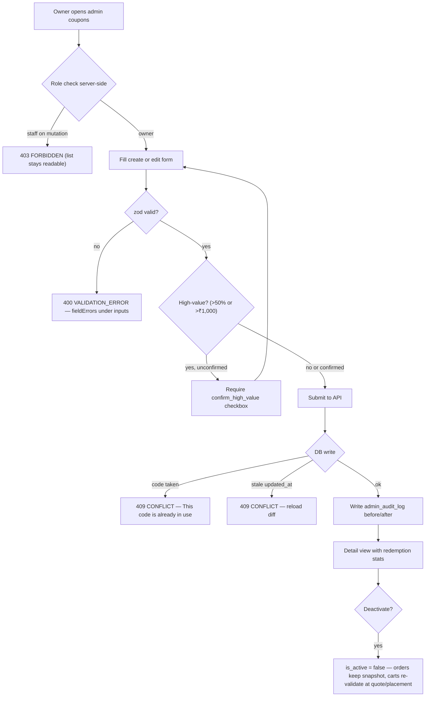
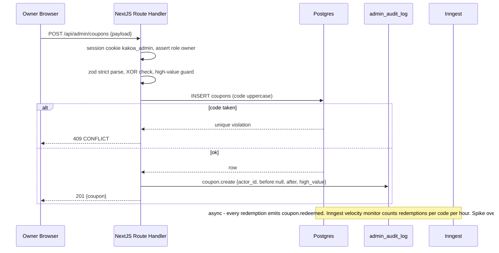
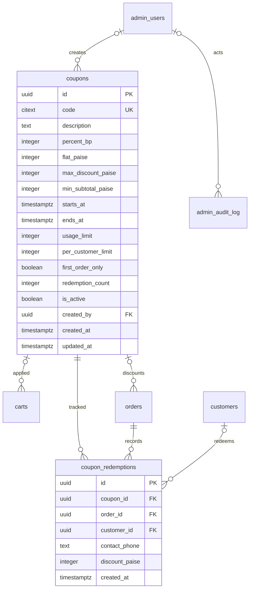

# Module Spec — Admin: Coupon Management (Phase 2, owner-gated)

> **Scope:** the admin CRUD surface for coupons (`/api/admin/coupons`), redemption stats, deactivation semantics, the high-value-coupon owner guard, and the code-leak velocity alert. Owned by **Dev D** (Fulfillment & Admin) per PROJECT_PLAN §3.9. The storefront redemption path (`applyCoupon`, checkout re-validation, atomic exhaustion, discount allocation) is specified in [coupons.md](coupons.md) — this doc references, never re-specifies, that behavior.
>
> Sources: PROJECT_PLAN §3.0 (Contract), §3.9, §3.14; docs/DATABASE_ERD.md §3.12–3.13; risk-engineering.md Module 5 + Admin #1/#2.

> **Admin UI stack (decision 2026-07-02):** this module's screens are built with **shadcn/ui (new-york, CLI v4) + TanStack Table** — owned source in `apps/web/src/components/ui/`, themed to KAKOA tokens via CSS variables. Standard patterns: TanStack-powered `Table` for lists (server-driven pagination/sort/filter), `DropdownMenu` row actions, `Sheet` for edit panels, **`AlertDialog` (never `Dialog`) for destructive confirmations**, `Command` palette for quick-nav, `Badge` for enum statuses. See PROJECT_PLAN §4.4 and design-system.md for the surface boundary.

---

## 1. Field-Level Specification

Create/edit form (`POST /api/admin/coupons`, `PATCH /api/admin/coupons/[id]`). All validation is zod `.strict()` — unknown keys → 400 `VALIDATION_ERROR`. Money fields are integer **paise**. Datetimes entered in IST pickers, converted to UTC `timestamptz` server-side.

| Field | Type | Required | Max | Validation rule (exact) | User-facing error on failure |
|---|---|---|---|---|---|
| `code` | string | yes (create; immutable after first redemption) | 24 | Trim, uppercase, then `^[A-Z0-9-]{3,24}$`. Uniqueness via `citext UNIQUE` (case-insensitive) | "Code must be 3–24 characters using only A–Z, 0–9 and hyphens." / on 409: "This code is already in use." |
| `description` | string | no (default `''`) | 200 | Trimmed; plain text, HTML-encoded on render | "Description must be 200 characters or fewer." |
| `type` | enum | yes | — | `'percent' \| 'flat'` — form control; maps to XOR of `percent_bp`/`flat_paise` | "Choose percent or flat discount." |
| `percent_bp` | integer | iff `type = percent` | — | `Number.isInteger(v) && v >= 1 && v <= 10000` (basis points; `1000` = 10%). Must be `null` when `flat_paise` set | "Percent must be between 0.01% and 100%." |
| `flat_paise` | integer | iff `type = flat` | — | `Number.isInteger(v) && v > 0`. Must be `null` when `percent_bp` set | "Flat discount must be greater than ₹0." |
| `max_discount_paise` | integer | no (percent only) | — | `Number.isInteger(v) && v > 0`; only meaningful with `percent_bp`. Form **warns** (non-blocking) if a percent coupon omits it | "Cap must be greater than ₹0." / warning: "No cap set — a percent coupon without a cap is unbounded on large carts." |
| `min_subtotal_paise` | integer | no (default 0) | — | `Number.isInteger(v) && v >= 0` | "Minimum order value cannot be negative." |
| `starts_at` | datetime (IST input) | no (default now) | — | Valid ISO datetime; stored UTC | "Enter a valid start date/time." |
| `ends_at` | datetime (IST input) | no (null = no expiry) | — | Valid ISO datetime AND `starts_at < ends_at`. "Valid till 30 June" = 23:59:59.999 **IST** via `istDayToUtcRange()` | "End must be after start." |
| `usage_limit` | integer | no (null = unlimited) | — | `Number.isInteger(v) && v > 0`; on PATCH, must be `>= redemption_count` | "Global limit must be at least 1." / "Limit cannot be below redemptions already used (N)." |
| `per_customer_limit` | integer | no (default 1) | — | `Number.isInteger(v) && v >= 1` | "Per-customer limit must be at least 1." |
| `first_order_only` | boolean | no (default false) | — | boolean | — |
| `is_active` | boolean | no (default true) | — | boolean; `false` = deactivated (the soft delete) | — |
| `confirm_high_value` | boolean | conditional | — | Required `true` when the coupon is **high-value**: `percent_bp > 5000` (>50% off) OR `flat_paise > 100000` (>₹1,000) OR `max_discount_paise > 100000`. See §6 guard | "High-value coupon — tick the confirmation to proceed. This will be recorded in the audit log." |

**Cross-field rules (server-enforced, mirrored by DB CHECKs):**
- XOR: exactly one of `percent_bp` / `flat_paise` — DB `CHECK (num_nonnulls(percent_bp, flat_paise) = 1)`. Error: "Set a percent OR a flat amount, not both."
- Code alphabet is restricted at creation to `[A-Z0-9-]` so generated codes never contain ambiguous `O/0` lookalikes (risk Module 5 #8). The `citext` column additionally accepts case-insensitive matching at redemption; admin always stores uppercase.
- Editing `code` after the coupon has any `coupon_redemptions` rows is rejected: "Code cannot be changed after it has been redeemed — deactivate and create a new coupon."

List filters (`GET /api/admin/coupons`): `q` (code substring, ≤ 24 chars, same alphabet after normalization), `active` (`true|false|all`), `page` (`^[1-9]\d*$`, default 1, pageSize 25).

## 2. Workflow / User Flow

**Create (owner):**
1. Owner opens `/admin/coupons` → "New coupon". Staff see the list read-only; the create button is hidden for staff **and** the route rejects staff server-side (403).
2. Owner fills the form; client zod mirrors server rules; IST pickers for window.
3. If percent without `max_discount_paise` → non-blocking warning shown.
4. If high-value (>50% or >₹1,000) → confirmation checkbox required (§6 guard); submission without it → 400 `VALIDATION_ERROR`.
5. Submit → `POST /api/admin/coupons`. Duplicate code → 409 `CONFLICT`, field-level error, form retained. Success → 201, `admin_audit_log` row `coupon.create` (with `high_value: true` flag when applicable), redirect to detail view.

**Edit:** load detail → PATCH with optimistic-concurrency `updated_at` check (risk Admin #1: never last-write-wins on money-bearing fields) → stale → 409 `CONFLICT` "changed since you loaded it" + reload path. Placed orders are never touched (snapshot, §7 #1).

**Deactivate:** DELETE = `is_active = false`. Confirmation dialog states the semantics: "Existing placed orders keep their discount. Carts that currently have this coupon attached will lose it at their next quote or at order placement." Never a hard delete; `coupon_redemptions.coupon_id` is `ON DELETE RESTRICT` so audit rows can never orphan. Idempotent — deactivating an already-inactive coupon returns 200, no second audit row.

**Stats review:** detail view shows `redemption_count / usage_limit`, redemption list (order number, phone masked to last 4, `discount_paise`, timestamp IST) — the abuse-review surface.



## 3. System Design

Admin UI (Next.js App Router, `/admin/coupons`) → Route Handlers under `/api/admin/coupons` → Drizzle → Postgres (Supabase Mumbai). No third-party service in the CRUD path.



**External dependencies & failure behavior:**
- **Postgres down/timeout:** 500 `INTERNAL`; admin UI full-width retry banner; no partial writes (single transaction per mutation, audit row in the same tx).
- **Inngest down:** velocity-alert events queue and retry per Inngest semantics; CRUD is unaffected (alerting is fire-and-forget, never in the request path).
- **Resend down:** the velocity alert's email leg fails → Inngest retries with backoff; alert also lands in the admin dashboard notification list, which reads from DB and needs no email.

**Caching:** **none** on admin routes — coupons are money-bearing rules read at low volume by ≤ a handful of admins; correctness beats latency. Storefront redemption reads the row live inside transactions (see coupons.md); there is deliberately no cache layer to invalidate, so a deactivation is honored at the very next quote/placement.

**Velocity alert (code-leak detection, risk Module 5 alerts):** Inngest cron (every 10 min) queries `coupon_redemptions` grouped by `coupon_id` over the trailing 60 min. Threshold: **> 20 redemptions/hour on a single code** OR **> 5× that code's trailing-7-day hourly average** (whichever is lower once history exists) → alert "Coupon KAKAO10 velocity spike — possible leak to an aggregator site" via Resend to owner + dashboard notice, with a one-click deep link to the deactivate action. Companion alert (owned by storefront module, cross-referenced): apply-endpoint miss-rate spike = enumeration in progress.

## 4. Database Schema

DDL verbatim from docs/DATABASE_ERD.md §3.12 (`coupons`) and §3.13 (`coupon_redemptions`). This module writes `coupons` and reads `coupon_redemptions`; it never writes redemptions.

### `coupons` (Contract §1.12)

| Column | Type | Constraints | Notes |
|---|---|---|---|
| `id` | `uuid` | `PRIMARY KEY DEFAULT gen_random_uuid()` | |
| `code` | `citext` | `NOT NULL UNIQUE CHECK (char_length(code) BETWEEN 3 AND 24)` | |
| `description` | `text` | `NOT NULL DEFAULT ''` | |
| `percent_bp` | `integer` | `CHECK (percent_bp BETWEEN 1 AND 10000)` | `1000` = 10% |
| `flat_paise` | `integer` | `CHECK (flat_paise > 0)` | |
| `max_discount_paise` | `integer` | `CHECK (max_discount_paise > 0)` | cap for percent coupons |
| `min_subtotal_paise` | `integer` | `NOT NULL DEFAULT 0` | |
| `starts_at` | `timestamptz` | `NOT NULL DEFAULT now()` | |
| `ends_at` | `timestamptz` | | |
| `usage_limit` | `integer` | `CHECK (usage_limit > 0)` | global |
| `per_customer_limit` | `integer` | `NOT NULL DEFAULT 1` | |
| `first_order_only` | `boolean` | `NOT NULL DEFAULT false` | |
| `redemption_count` | `integer` | `NOT NULL DEFAULT 0` | atomic exhaustion counter |
| `is_active` | `boolean` | `NOT NULL DEFAULT true` | soft delete |
| `created_by` | `uuid` | `REFERENCES admin_users(id) ON DELETE SET NULL` | |
| `created_at` | `timestamptz` | `NOT NULL DEFAULT now()` | |
| `updated_at` | `timestamptz` | `NOT NULL DEFAULT now()` | |

```sql
CHECK (num_nonnulls(percent_bp, flat_paise) = 1)
```

### `coupon_redemptions` (Contract §1.13)

| Column | Type | Constraints | Notes |
|---|---|---|---|
| `id` | `uuid` | `PRIMARY KEY DEFAULT gen_random_uuid()` | |
| `coupon_id` | `uuid` | `NOT NULL REFERENCES coupons(id) ON DELETE RESTRICT` | |
| `order_id` | `uuid` | `NOT NULL REFERENCES orders(id) ON DELETE CASCADE` | |
| `customer_id` | `uuid` | `REFERENCES customers(id) ON DELETE SET NULL` | |
| `contact_phone` | `text` | `NOT NULL` | guest limit tracking |
| `discount_paise` | `integer` | `NOT NULL CHECK (discount_paise >= 0)` | |
| `created_at` | `timestamptz` | `NOT NULL DEFAULT now()` | |

```sql
UNIQUE (coupon_id, order_id)
CREATE INDEX coupon_redemptions_phone_idx ON coupon_redemptions (coupon_id, contact_phone);
```



## 5. API Design

All routes: Route Handlers, auth tier **admin:owner** for mutations (Contract §2.9 "Coupons (owner)"), **admin:staff** may `GET` the list/detail read-only (support lookups, PROJECT_PLAN §3.9.5). Rate class **E (600/min per admin session)**. Common codes per Contract §2.1 apply everywhere and are not repeated: 400 `VALIDATION_ERROR`, 401 `UNAUTHORIZED`, 403 `FORBIDDEN`, 429 `RATE_LIMITED`, 500 `INTERNAL`.

### `GET /api/admin/coupons?q=&active=&page=`
- Auth: `admin:staff` (read-only).
- Response 200: `{ coupons: AdminCouponRow[], page, pageSize: 25, total }` where `AdminCouponRow = { id, code, description, percentBp, flatPaise, maxDiscountPaise, minSubtotalPaise, startsAt, endsAt, usageLimit, perCustomerLimit, firstOrderOnly, redemptionCount, isActive, createdBy, createdAt, updatedAt }` (timestamptz UTC; UI renders IST).
- Errors: common only.

### `POST /api/admin/coupons`
- Auth: `admin:owner`.
- Request (zod `.strict()`): `{ code, description?, percentBp? , flatPaise?, maxDiscountPaise?, minSubtotalPaise?, startsAt?, endsAt?, usageLimit?, perCustomerLimit?, firstOrderOnly?, confirmHighValue? }` — rules per §1.
- Response 201: `{ coupon: AdminCouponRow }`.
- Errors: 409 `CONFLICT` (code taken — citext unique); 400 `VALIDATION_ERROR` (XOR violation, alphabet, window, missing `confirmHighValue` on a high-value coupon — `fieldErrors` via zod `flatten()`).
- Idempotency: double-submit guarded by a client op id in the admin UI (same pattern as inventory adjustments, Contract §2.9 note); a retried create with the same code lands on the 409 anyway.

### `GET /api/admin/coupons/[id]`
- Auth: `admin:staff` (read-only detail + stats).
- Response 200: `{ coupon: AdminCouponRow, redemptions: { orderNumber, phoneMasked, discountPaise, createdAt }[], stats: { redemptionCount, usageLimit, totalDiscountPaise, last24hCount } }`. Phone masked to last 4 digits server-side.
- Errors: 404 `NOT_FOUND`.

### `PATCH /api/admin/coupons/[id]`
- Auth: `admin:owner`.
- Request: `Partial<CouponInput> & { updatedAt }` (optimistic-concurrency token). `code` immutable once redeemed; `usage_limit >= redemption_count`. High-value guard re-applies if the edit crosses a threshold.
- Response 200: `{ coupon: AdminCouponRow }`. Placed orders unaffected (snapshot).
- Errors: 404 `NOT_FOUND`; 409 `CONFLICT` (stale `updatedAt` — "changed since you loaded it" diff); 400 `VALIDATION_ERROR`.

### `DELETE /api/admin/coupons/[id]`
- Auth: `admin:owner`.
- Behavior: soft delete — `is_active = false`. **Never 409** (Contract §2.9): deactivation always succeeds regardless of attached carts or historical orders. In-flight carts holding this `coupon_id` re-validate at next quote and at placement and get the auto-detach notice (see coupons.md §2 and §7 #2 below).
- Response 200: `{ coupon: AdminCouponRow }` (with `isActive: false`). Idempotent.
- Errors: 404 `NOT_FOUND`.

Every mutation writes `admin_audit_log` (`coupon.create` / `coupon.update` / `coupon.deactivate`) with actor, entity, before/after JSON, in the same transaction as the write.

## 6. Security Standards

- **Rate limits:** class **E — 600/min per admin session** on all `/api/admin/coupons*` routes; `X-RateLimit-Limit/Remaining/Reset` headers, 429 + `Retry-After` + body `RATE_LIMITED`. (The storefront apply endpoint's enumeration limits — 10/min/session + 30/hour/IP — belong to coupons.md.)
- **Authz:** route-level middleware asserts `kakoa_admin` session; per-action assertion re-checks role `owner` on every mutation handler (defense in depth — UI hiding is cosmetic, risk Admin #2). Staff hitting any of the four mutation routes → 403 `FORBIDDEN`; these four negative tests are enumerated in the single exhaustive admin authz checklist test.
- **High-value owner guard:** since ALL coupon CRUD is owner-only, the >50%-off (`percent_bp > 5000`) / >₹1,000 (`flat_paise > 100000` or `max_discount_paise > 100000`) rule is trivially satisfied structurally — but the zod schema still classifies these as `high_value`, requires `confirmHighValue: true`, and stamps `high_value: true` into the `admin_audit_log` entry so the audit trail distinguishes routine promos from margin-destroying ones (PROJECT_PLAN §3.9.5; risk Module 5 checklist).
- **Input sanitization:** zod `.strict()` on every payload; Drizzle-parameterized queries (no string SQL); `code` and `description` are user-echoed values → HTML-encoded on every render (admin list, storefront chip, order detail) against stored XSS.
- **Encryption at rest:** Supabase disk encryption suffices; no field-level encryption needed — coupons hold no PII. The redemption detail view masks `contact_phone` to last 4; the full phone is never sent to the browser from this module.
- **Never log:** full customer phone numbers from redemption rows (log masked or hashed); raw spray payloads from failed applies (`code_hash` only, per coupons.md); admin session cookies.
- **OWASP specifics:** A01 Broken Access Control → per-route + per-action owner assertion with negative tests; A03 Injection → Drizzle parameterization; A04 Insecure Design → soft-delete + snapshot semantics prevent retroactive order mutation; A09 Logging failures → audit log in-transaction (a mutation without an audit row is impossible, meta-test enforced).

## 7. Edge Cases

(Sourced from PROJECT_PLAN §3.9.6 and risk-engineering.md Module 5 + Admin.)

1. **Coupon edited/deactivated after orders placed.** `orders.coupon_code` and `discount_paise` are snapshots (Contract §1.29) — admin edits never rewrite placed orders, invoices, or refund math. Test: edit percent from 10%→5% post-placement, order totals byte-identical.
2. **Deactivation with in-flight carts.** Cart holds `coupon_id`, owner deactivates mid-checkout: cart is not mutated; the coupon detaches at the next `/api/checkout/quote` or at placement re-validation with the notice "Coupon X removed" — never a checkout-time 500, never a silent full-price charge (customer must acknowledge the re-price before placing).
3. **Lowering `usage_limit` below `redemption_count`.** PATCH rejects with a field error ("cannot be below redemptions already used") — otherwise the §1.28.2 atomic increment (`WHERE redemption_count < usage_limit`) would behave as instantly exhausted with a confusing count display.
4. **Concurrent owner edits (last-write-wins on money fields).** Two owner tabs PATCH the same coupon: `updated_at` optimistic check → second writer gets 409 `CONFLICT` with a reload/diff path. Coupon terms are money-bearing; last-write-wins is forbidden (risk Admin #1).
5. **Code reuse after deactivation.** `code` is `citext UNIQUE` with no partial index — a deactivated coupon still holds its code, so re-creating "DIWALI25" → 409. Deliberate: prevents a resurrected code from inheriting leaked distribution. Owner must pick a new code (error message says so).
6. **Ambiguous-lookalike codes at creation.** Alphabet `[A-Z0-9-]` permits both `O` and `0`; the admin form warns when a code contains an `O0`/`0O`, `I1`/`1I` adjacent pair; **generated** codes (the "generate" button) exclude `O`, `I`, `0`, `1` entirely (risk Module 5 #8).
7. **IST window boundary.** Owner sets "ends 30 June" — stored as 2026-06-30T23:59:59.999 IST → 18:29:59.999 UTC. List view renders both states correctly at ±1s around the boundary; placement-time validation is authoritative (coupons.md #7).
8. **Editing `code` after redemptions exist.** Rejected — the redemption audit and `orders.coupon_code` snapshots reference the original string; renaming would desynchronize support lookups. Deactivate + create new instead.
9. **Velocity spike on a leaked code.** Code posted to a coupon aggregator: cron detects > 20 redemptions/hour (or > 5× baseline), alerts owner with a one-click deactivate link. Redemptions completed before deactivation stand (snapshots); the leak is stanched at the next quote/placement for everyone else.
10. **Staff privilege escalation via direct API calls.** Staff crafts `POST /api/admin/coupons` with curl bypassing the hidden UI: per-route middleware + per-action owner assertion returns 403; covered by the enumerated authz checklist test (risk Admin #2).
11. **Deactivate replay.** Owner double-clicks Deactivate or a retry fires: second DELETE finds `is_active` already false → 200, no state change, **no duplicate audit row** (audit written only on actual transition).

## 8. State Machine

**Not applicable (per Contract §3.9.2):** coupons have no state machine — eligibility is the conjunction of `is_active` + time window (`starts_at`/`ends_at`) + limits, evaluated live at every quote/placement; the only persisted flag is the reversible boolean `is_active`.

## 9. Testing Requirements

**Unit:**
- zod create/edit schema: code regex `^[A-Z0-9-]{3,24}$` (accept `KAKAO-10`; reject `kakao 10` pre-normalization miss, `AB`, 25 chars, `WELCOME_10`); XOR percent/flat (both set, neither set → fail); `percent_bp` bounds 0/1/10000/10001; `starts_at < ends_at`; `usage_limit >= redemption_count` on PATCH; `.strict()` unknown-key rejection.
- High-value classifier: `percent_bp = 5000` → not high-value; `5001` → high-value; `flat_paise = 100000` → not; `100001` → high-value; `max_discount_paise` same boundary; missing `confirmHighValue` → `VALIDATION_ERROR` with the exact message.
- IST→UTC window conversion round-trip (`istDayToUtcRange` boundary ±1s).
- Phone masking helper (last 4 only) for the redemption list serializer.

**Integration (ephemeral Postgres, migrations from zero):**
- Create → 201; duplicate code (different case, `citext`) → 409 `CONFLICT`.
- PATCH with stale `updated_at` → 409; fresh → 200 and `admin_audit_log` row with before/after.
- DELETE → `is_active = false`; repeat DELETE → 200 idempotent, single audit row; a cart holding the `coupon_id` then fails placement re-validation with 422 `COUPON_INVALID` (cross-module fixture shared with coupons.md).
- Edit coupon after an order is placed → `orders.coupon_code`/`discount_paise` unchanged (snapshot assertion).
- **Authz checklist:** staff session against all four mutation routes → 403 `FORBIDDEN`; staff GET list/detail → 200.
- Velocity cron query: seed 25 redemptions in 1h on one code → alert event emitted; 15 → none.

**E2E (Playwright, named):**
1. *Owner creates a high-value coupon:* build a 60%-off coupon, assert the confirmation checkbox gate, submit, verify audit-log entry flagged `high_value`, apply it on the storefront and see the capped discount.
2. *Deactivate with an in-flight cart:* customer applies coupon and reaches review; owner deactivates in a second context; customer's placement attempt re-prices with the detach notice and only places at full price after explicit confirmation (risk E2E #2 analogue).
3. *Staff lockout:* staff logs in, sees the read-only list without mutation affordances, and a direct API POST returns 403.

## 10. Definition of Done

- [ ] All four routes live under `/api/admin/coupons*`, class E rate-limited, zod `.strict()` validated with the §1 field rules and exact error copy
- [ ] Mutations owner-gated at middleware AND per-action; staff-403 negative tests for all four routes in the exhaustive admin authz checklist test — green
- [ ] High-value guard (>50% bp / >₹1,000 paise thresholds) enforced with `confirmHighValue` and `high_value` flag stamped in `admin_audit_log`
- [ ] `admin_audit_log` row (before/after, in-transaction) on every create/update/deactivate; meta-test proves no mutation path skips it
- [ ] Deactivation semantics verified end-to-end: soft delete, in-flight cart re-validates at quote/placement with detach notice, placed orders untouched (snapshot test green)
- [ ] Optimistic concurrency (`updated_at`) on PATCH with 409 + reload path; no last-write-wins on coupon terms
- [ ] Code immutability after first redemption enforced and tested; deactivated codes remain reserved (409 on reuse)
- [ ] Redemption stats detail view ships with phone masked to last 4; full phone never serialized to the browser
- [ ] Velocity alert cron deployed (Inngest): threshold query tested, alert delivers via Resend + dashboard with deactivate deep link
- [ ] All money fields integer paise; all timestamps `timestamptz` UTC with IST rendering in the admin UI
- [ ] E2E scenarios 1–3 green in CI; storefront redemption DoD tracked separately in [coupons.md](coupons.md)
