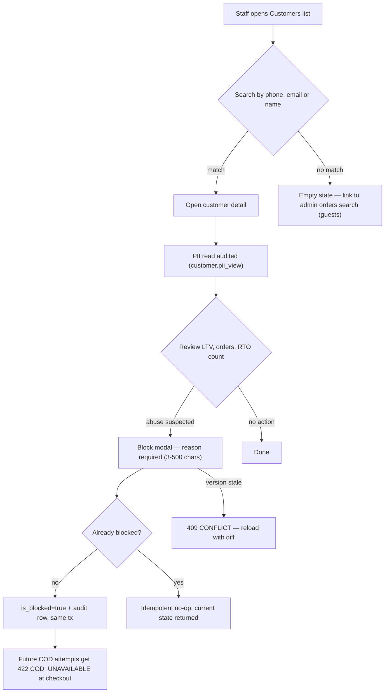
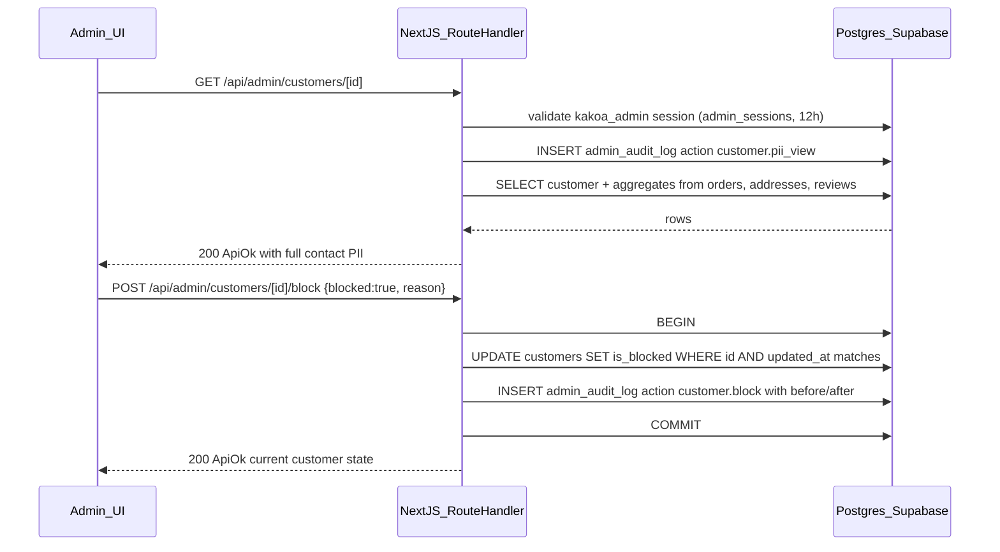
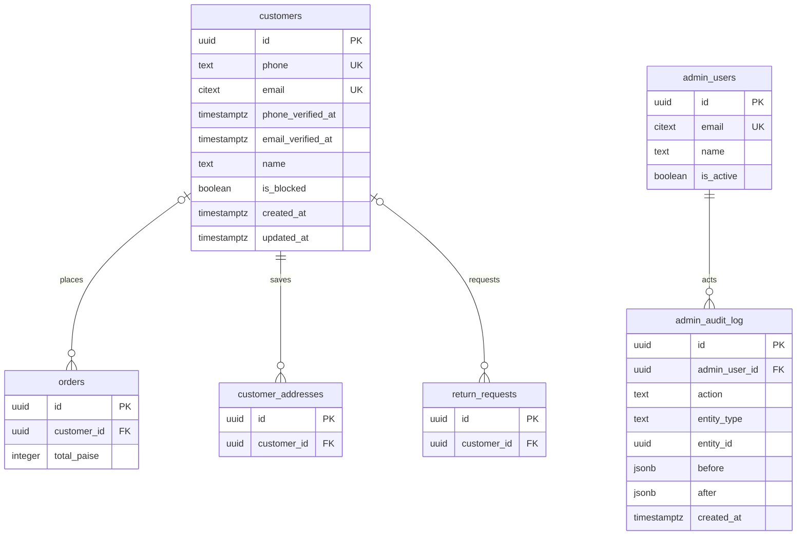

# Module Spec — Admin: Customer Management (Phase 2)

> Part of §3.14 (Admin Panel, full ops). Owning lane: **Dev D** (`apps/web/app/(admin)/customers/**`, `/api/admin/customers/*`). Light spec: three endpoints — customer search list, customer detail, block/unblock — plus the PII-access audit discipline and the DPDP export/delete runbook hooks. Sources of truth: `docs/DATABASE_ERD.md` §3.6/§3.27–3.29, PROJECT_PLAN.md §3.0 Contract + §3.14, risk-engineering Modules 7 & 10.

> **Admin UI stack (decision 2026-07-02):** this module's screens are built with **shadcn/ui (new-york, CLI v4) + TanStack Table** — owned source in `apps/web/src/components/ui/`, themed to KAKOA tokens via CSS variables. Standard patterns: TanStack-powered `Table` for lists (server-driven pagination/sort/filter), `DropdownMenu` row actions, `Sheet` for edit panels, **`AlertDialog` (never `Dialog`) for destructive confirmations**, `Command` palette for quick-nav, `Badge` for enum statuses. See PROJECT_PLAN §4.4 and design-system.md for the surface boundary.

---

## 1. Field-Level Specification

### 1.1 Customer list query params (`GET /api/admin/customers`)

| Field | Type | Required | Max length | Format / validation rule | User-facing error message |
|---|---|---|---|---|---|
| `q` | string | no | 100 | Trimmed. Interpreted by shape: `^[6-9]\d{9}$` or `^\+91[6-9]\d{9}$` → normalized to `+91XXXXXXXXXX` exact phone match; contains `@` → lowercased exact/prefix email match on `citext`; otherwise `ILIKE '%q%'` on `name` (min 2 chars for name search). Always bound as a Drizzle parameter — never interpolated. | "Enter at least 2 characters to search by name." |
| `blocked` | string | no | 5 | `^(true\|false)$` — filters on `customers.is_blocked` | "Invalid filter value." |
| `sort` | string | no | 20 | Enum: `created_desc` (default) \| `ltv_desc` \| `orders_desc` \| `rto_desc` | "Invalid sort option." |
| `page` | integer | no | — | `^[1-9]\d{0,4}$`, default 1 | "Invalid page number." |
| `pageSize` | integer | no | — | Integer 1–100, default 25 | "Page size must be between 1 and 100." |

All violations → 400 `VALIDATION_ERROR` with zod `fieldErrors` (rendered under the matching admin input per the shared error-display map).

### 1.2 Block/unblock body (`POST /api/admin/customers/[id]/block`)

| Field | Type | Required | Max length | Format / validation rule | User-facing error message |
|---|---|---|---|---|---|
| `blocked` | boolean | yes | — | Strict boolean (zod `.strict()` schema — unknown keys rejected) | "Invalid request: blocked must be true or false." |
| `reason` | string | yes when `blocked=true`; optional on unblock | 500 | Trimmed, 3–500 chars. Free text; encoded on every render (admin renders admin-authored text too). | "A reason is required to block a customer (3–500 characters)." |

### 1.3 Route param

| Field | Type | Required | Format / validation rule | User-facing error message |
|---|---|---|---|---|
| `id` | uuid | yes | `^[0-9a-f]{8}-[0-9a-f]{4}-[0-9a-f]{4}-[0-9a-f]{4}-[0-9a-f]{12}$` | "Customer not found." (400 on malformed uuid, 404 on unknown) |

---

## 2. Workflow / User Flow

### 2.1 Search → detail → block (staff handling a suspected serial-RTO abuser)

1. Staff opens **Customers** in the admin panel; list loads page 1 sorted `created_desc` with per-row `orderCount`, `ltvPaise`, `rtoCount`, `isBlocked` badges.
2. Staff types a phone number into search. Client debounces 300 ms; server normalizes `9876543210` → `+919876543210` and does an exact match.
   - **No match:** empty state "No customers match" + one-click filter reset. Guests who never verified OTP have no `customers` row — the empty state links to admin **orders** search (`GET /api/admin/orders?q=`), which matches `contact_phone` on guest orders.
3. Staff opens the customer detail. The server logs a PII-read audit row (`customer.pii_view`) **before** returning the payload.
4. Detail shows: full contact (phone, email, name), verification timestamps, block status + history, saved addresses, order list with statuses, computed LTV / order count / RTO count, review count, open return requests.
5. Staff sees `rtoCount = 3` and clicks **Block** → modal requires a reason (e.g. "3 consecutive COD RTOs, ₹0 collected").
   - **Success:** `is_blocked=true` written + `admin_audit_log` row in the same transaction; toast "Customer blocked — new COD orders will be refused"; badge flips.
   - **Already blocked (raced another admin):** 200 idempotent no-op returning current state; UI re-renders with the existing state — no error.
6. Effect of block (enforced by the **checkout module**, not here): blocked customer placing a COD order gets 422 `COD_UNAVAILABLE` ("COD is unavailable for this account. Prepaid options are available."); prepaid remains allowed at launch. Existing in-flight orders are untouched.
7. Unblock is the same endpoint with `blocked=false`; reason optional; audited identically.

### 2.2 DPDP export / delete runbook hooks (manual, owner-run — no self-serve endpoint at launch)

1. Data-principal request arrives (email/support). Owner verifies identity **via OTP to the phone/email on the account** — never by "they emailed us from a similar address."
2. **Export:** owner runs the documented runbook query set (customer row, addresses, orders + items, payments, refunds, reviews, return requests, wishlist) → CSV via the owner-only export pipeline (short-lived signed URL, formula-injection guard, audited with row count, rate class: 5/hour).
3. **Delete/erasure:** runbook anonymizes rather than hard-deletes where financial law wins: `customers` row PII nulled (`name`, `email`) + phone replaced with a tombstone marker, sessions revoked, addresses deleted, wishlist deleted, reviews anonymized; **orders/payments/invoices retained** (GST record-keeping obligation) with `customer_id` kept but contact snapshots redacted per runbook. Every step writes `admin_audit_log` rows (`customer.dpdp_export` / `customer.dpdp_delete`).
4. The one-page **data map** (which PII lives in which table/log/vendor) is the DPDP artifact and must stay current — it is referenced by both runbooks.



---

## 3. System Design

### 3.1 Core action sequence (customer detail read + block)



### 3.2 External service dependencies

| Dependency | Used for | Behavior when down / timing out |
|---|---|---|
| Postgres (Supabase Mumbai) | Everything | 500 `INTERNAL`; admin UI shows retry banner. No degraded mode — this module is DB-only. |
| Razorpay / Shiprocket / MSG91 / Resend | **None directly.** | n/a — this module never calls a third party. Block enforcement at checkout is a local DB read. |

If the audit-log INSERT fails, the mutation fails (§3.14 alerting rule: any mutation path that can't write audit must fail the mutation). PII-view audit failure → the detail read returns 500 rather than serving unaudited PII.

### 3.3 Aggregate computation

`orderCount`, `ltvPaise`, `rtoCount` are computed live per request via a lateral aggregate over `orders` (no denormalized counters at this scale — 5-person team, low order volume):

- `orderCount` = count of orders with `status NOT IN ('pending_payment','payment_failed','cancelled')`
- `ltvPaise` = `COALESCE(SUM(total_paise),0)` over orders with `status = 'delivered'` (money actually realized; COD RTOs contribute ₹0)
- `rtoCount` = count of orders with `status IN ('rto_initiated','rto_delivered')`

List queries sort on these via the same lateral join; `orders_customer_idx` keeps it cheap.

### 3.4 Caching strategy

**None.** Admin reads must reflect live state (a stale `is_blocked` badge while checkout already refuses COD is a support-ticket generator), volume is tiny (class E internal traffic), and every detail read is individually audited — caching would suppress audit rows. All responses send `Cache-Control: no-store`.

---

## 4. Database Schema

This module **owns no tables**. It reads/writes `customers.is_blocked` (owned by Auth/Accounts, Contract §1.6) and writes `admin_audit_log` (Contract §1.26). DDL reproduced verbatim from `docs/DATABASE_ERD.md`.

### `customers` (ERD §3.6, Contract §1.6)

| Column | Type | Constraints | Notes |
|---|---|---|---|
| `id` | `uuid` | `PRIMARY KEY DEFAULT gen_random_uuid()` | |
| `phone` | `text` | `UNIQUE CHECK (phone ~ '^\+91[6-9][0-9]{9}$')` | |
| `email` | `citext` | `UNIQUE` | |
| `phone_verified_at` | `timestamptz` | | |
| `email_verified_at` | `timestamptz` | | |
| `name` | `text` | | |
| `is_blocked` | `boolean` | `NOT NULL DEFAULT false` | serial-RTO abusers |
| `created_at` | `timestamptz` | `NOT NULL DEFAULT now()` | |
| `updated_at` | `timestamptz` | `NOT NULL DEFAULT now()` | |

```sql
CHECK (phone IS NOT NULL OR email IS NOT NULL)
```

### `admin_audit_log` (ERD §3.29, Contract §1.26)

| Column | Type | Constraints | Notes |
|---|---|---|---|
| `id` | `uuid` | `PRIMARY KEY DEFAULT gen_random_uuid()` | |
| `admin_user_id` | `uuid` | `REFERENCES admin_users(id) ON DELETE SET NULL` | |
| `action` | `text` | `NOT NULL` | `'order.transition'`, `'refund.initiate'`, `'product.update'`, ... |
| `entity_type` | `text` | `NOT NULL` | |
| `entity_id` | `uuid` | | |
| `before` | `jsonb` | | |
| `after` | `jsonb` | | |
| `created_at` | `timestamptz` | `NOT NULL DEFAULT now()` | |

```sql
CREATE INDEX admin_audit_entity_idx ON admin_audit_log (entity_type, entity_id, created_at DESC);
```

Append-only: the app DB role has no UPDATE/DELETE grants on `admin_audit_log`.

Actions written by this module: `customer.pii_view`, `customer.block`, `customer.unblock`, `customer.dpdp_export`, `customer.dpdp_delete` — all with `entity_type = 'customer'`, `entity_id = customers.id`.



---

## 5. API Design

Route Handlers, envelope per Contract §2.1. Auth tier **`admin:staff`** on all three (customers view/block is a staff capability per §3.14 permission matrix). Rate class **E: 600/min per admin session**. Common codes (400 `VALIDATION_ERROR`, 401 `UNAUTHORIZED`, 403 `FORBIDDEN`, 429 `RATE_LIMITED`, 500 `INTERNAL`) apply everywhere and are not repeated.

### 5.1 `GET /api/admin/customers`

Query: `q?`, `blocked?`, `sort?`, `page?`, `pageSize?` (§1.1).

Response `200 ApiOk`:
```ts
{ customers: Array<{
    id: string; phone: string | null; email: string | null; name: string | null;
    isBlocked: boolean; orderCount: number; ltvPaise: number; rtoCount: number;
    createdAt: string;  // ISO UTC; UI renders via formatIST()
  }>,
  meta: { page: number; pageSize: number; total: number; requestId: string } }
```

Errors: none beyond common. Empty result is `200` with `customers: []`, never 404.

### 5.2 `GET /api/admin/customers/[id]`

Response `200 ApiOk`:
```ts
{ customer: {
    id, phone, email, name, isBlocked,
    phoneVerifiedAt, emailVerifiedAt, createdAt, updatedAt,   // updatedAt doubles as optimistic version
    orderCount: number; ltvPaise: number; rtoCount: number;
    addresses: Address[];
    orders: Array<{ id; orderNumber; status: OrderStatus; paymentMode; totalPaise; placedAt }>; // newest first, capped 50
    reviewCount: number; openReturnCount: number;
    blockHistory: Array<{ action: 'customer.block'|'customer.unblock'; adminUserId; adminName; reason; createdAt }>; // from admin_audit_log
} }
```

| Error | Status | Code |
|---|---|---|
| Unknown id | 404 | `NOT_FOUND` |

Side effect: writes `customer.pii_view` audit row before responding; write failure → 500 `INTERNAL` (unaudited PII is never served).

### 5.3 `POST /api/admin/customers/[id]/block`

Request:
```ts
{ blocked: boolean; reason?: string; updatedAt: string }  // reason required when blocked=true; updatedAt = optimistic version from the loaded detail
```

Response `200 ApiOk`: `{ customer: { id, isBlocked, updatedAt } }`

| Error | Status | Code | Notes |
|---|---|---|---|
| Unknown id | 404 | `NOT_FOUND` | |
| `updatedAt` stale (concurrent edit) | 409 | `CONFLICT` | `details` carries current entity for the reload-with-diff UI |
| Same state replay (`blocked` already equals target) | 200 | — | Idempotent no-op returning current state; no duplicate audit row |

Idempotency: state-targeted (`blocked: true` twice = one transition, one audit row). Optimistic versioning via `updated_at` in the UPDATE's WHERE clause — never last-write-wins.

### 5.4 DPDP hooks (runbook, not endpoints)

No self-serve DPDP endpoints at launch. Export rides the owner-only export pipeline (§3.14: signed URL, **5/hour**, audited, formula-injection guarded). Erasure is a reviewed runbook script writing `customer.dpdp_delete` audit rows. Both are **`admin:owner`** activities.

---

## 6. Security Standards

- **Rate limits:** class **E — 600/min per admin session** on all three routes; DPDP/CSV exports **5/hour per owner** with `X-RateLimit-*` + `Retry-After` headers on 429.
- **Authz:** per-route server-side check `admin:staff` (session row in `admin_sessions`, checked per request — revocation effective within one request, never JWT-only). These routes are rows in the exhaustive authz checklist test (every route × {unauthenticated, staff, owner} → expected status). DPDP export/delete: owner-only.
- **Input sanitization:** zod `.strict()` on every input; search `q` always a bound Drizzle parameter; `ILIKE` metacharacters `%`, `_`, `\` escaped in the name-search term so a `q` of `%` cannot become a full-table PII dump via wildcard.
- **Stored XSS:** customer detail renders customer-authored strings (name, addresses, notes) — every render encoded; the customer name field is an explicit XSS-fixture test target (risk-engineering Module 10 #11: the admin browser is the attack surface).
- **PII access discipline:** staff see full contact PII (5-person team decision) but **every detail read writes a `customer.pii_view` audit row** — access is accountable, not restricted. List view exposes contact fields only in result rows actually returned by a search (no "browse all phone numbers" bulk affordance beyond paginated list, which is still class-E limited and session-attributed).
- **Never logged:** raw phone/email/address in application logs (hashed identifiers only, per §4.3); OTP codes; session tokens; full customer PII in Sentry (scrubbing rules for phone/email/address configured before launch). The `admin_audit_log.before/after` jsonb for `customer.block` carries only `{is_blocked, reason}` — not the full PII row.
- **Encryption at rest:** Supabase-managed disk encryption; no additional column-level encryption at launch (documented in the DPDP data map). Exports never land in a public bucket — short-lived signed URLs only.
- **OWASP specifics:** A01 broken access control → authz checklist test + 404-not-403 on unknown ids; A03 injection → parameterized queries + ILIKE escaping + CSV formula-injection guard (`'` prefix on cells starting `=`, `+`, `-`, `@`) on any customer export; A09 logging failures → audit-write failure fails the mutation and alerts.

---

## 7. Edge Cases

1. **Guest orders don't appear under any customer.** Orders with `customer_id NULL` (guest checkout, never OTP-verified) are invisible in customer detail. A serial-RTO abuser can stay "guest" forever — the real abuse control is the COD-attempts-per-**phone** table at checkout (per-phone limits survive account-less checkouts, ERD §3.13). Customer search empty state links to admin orders search which matches `orders.contact_phone`.
2. **Block races an in-flight COD order.** Customer places a COD order at 12:00:00; staff blocks at 12:00:01. The placed order proceeds — block gates **future** placements only (checked inside the placement transaction). The COD confirmation queue shows the "blocked" badge so staff can cancel manually if warranted.
3. **Two admins block/unblock concurrently.** Optimistic `updatedAt` versioning: second writer gets 409 `CONFLICT` with current entity for the reload-with-diff UI. Same-state replay (both clicked "block") is a 200 no-op with a single audit row — no error, no duplicate history.
4. **Blocked customer creates a "new" identity with the same phone.** Impossible — `customers.phone` is UNIQUE and OTP login resolves to the existing (blocked) row. New phone number = genuinely new identity; per-phone COD limits are the second fence.
5. **Customer with email only, no phone** (edge of `CHECK (phone IS NOT NULL OR email IS NOT NULL)`). List/detail render "—" for phone; phone-shaped searches never match them; block works identically (block is identity-level, not channel-level).
6. **RTO count vs LTV mislead together.** A customer with `rtoCount 2` but `ltvPaise ₹40,000` delivered is a VIP with two bad courier days, not an abuser. Detail view shows both side by side plus the order list; the block modal reason field forces staff to articulate the actual grounds — no auto-block on any threshold at launch.
7. **DPDP erasure vs GST retention conflict.** Runbook anonymizes the `customers` row and deletes addresses/wishlist/sessions, but orders, payments and invoices are retained (legal obligation wins) with contact snapshots redacted per runbook. The audit row `customer.dpdp_delete` records exactly what was nulled — the answer to "did we actually erase it."
8. **Audit write fails mid-block.** Block UPDATE and audit INSERT share one transaction — if audit can't be written the block does not happen (500, alert). Never a silent unaudited PII-affecting mutation.
9. **Staff member deactivated after viewing PII.** `admin_audit_log.admin_user_id` is `ON DELETE SET NULL` and admins are soft-deactivated, never deleted — the trail of who viewed which customer survives offboarding.
10. **`q` of `%%%` or a 100-char emoji string.** ILIKE-escaped and length-capped; worst case an empty result, never a slow full-scan wildcard dump; name search requires ≥ 2 chars.

---

## 8. State Machine

**Not applicable.** `is_blocked` is a single audited boolean toggle (two states, symmetric transitions), not a lifecycle worth a state machine; order/payment lifecycles referenced here are owned by §3.6/§3.8.

---

## 9. Testing Requirements

**Unit (`packages/core` + admin lib):**
- Search-term classifier: `9876543210` / `+919876543210` → phone-normalized exact; `a@b.co` → email; `Ravi` → name ILIKE; `R` → validation error; `%_\` escaped in name terms.
- Aggregate definitions: `ltvPaise` counts only `delivered`; `rtoCount` counts `rto_initiated` + `rto_delivered`; `orderCount` excludes `pending_payment`/`payment_failed`/`cancelled` — table-driven over all 11 `order_status` values.
- Block input schema: reason required iff `blocked=true`; unknown keys rejected (`.strict()`).

**Integration (ephemeral Postgres):**
- Authz checklist rows: all three routes × {unauthenticated → 401, staff → 2xx, owner → 2xx}; malformed uuid → 400; unknown uuid → 404.
- Detail read writes exactly one `customer.pii_view` audit row; injected audit-insert failure → 500 and no PII payload.
- Block happy path: `is_blocked` flips + `customer.block` audit row with `{before, after, reason}` in one tx; injected audit failure rolls back the flip.
- Concurrency: two simultaneous block requests with the same loaded `updatedAt` → one 200, one 409 `CONFLICT`; same-state replay → 200 no-op, single audit row (audit meta-test compatible).
- Blocked customer + COD placement → 422 `COD_UNAVAILABLE` (cross-module assertion with §3.6 checkout); prepaid placement still succeeds.
- Email-only customer (phone NULL) renders in list/detail and blocks cleanly.

**E2E (Playwright):**
1. **Block the serial-RTO abuser:** seed a customer with 3 RTO orders → staff searches by phone → detail shows `rtoCount 3`, LTV ₹0 → block with reason → badge flips → the same customer's COD checkout attempt shows "COD is unavailable for this account" → audit log shows `pii_view` + `block` rows with actor.
2. **Concurrent admin conflict:** two staff sessions open the same customer → one blocks → the other's block attempt renders the 409 "changed since you loaded it" diff + reload → after reload, action resolves as a no-op.
3. **XSS fixture render:** seed a customer named `` with a matching address → list, detail and block-history render it inert (encoded), no dialog fires.

---

## 10. Definition of Done

- [ ] All three routes live under `/api/admin/*` with the Contract envelope, class-E rate limiting, and `Cache-Control: no-store`
- [ ] Routes present in the exhaustive authz checklist test (route × role × unauthenticated) — CI route-manifest diff includes them
- [ ] `customer.pii_view` audited on every detail read; audit-write failure blocks the response (proven by injected-failure test)
- [ ] Block/unblock transactional with audit row; optimistic-version 409 + diff UI; same-state replay idempotent (audit meta-test green)
- [ ] Blocked-customer COD refusal (422 `COD_UNAVAILABLE`) verified end-to-end against checkout; prepaid unaffected
- [ ] Search classifier + ILIKE escaping unit tests green; no unparameterized query anywhere (lint/review)
- [ ] Aggregates (`orderCount`, `ltvPaise`, `rtoCount`) match their status-set definitions across all 11 `order_status` values (table-driven test)
- [ ] XSS fixture suite green on list, detail, and block-history renders
- [ ] DPDP export + erasure runbooks written, dry-run once against staging, both writing `customer.dpdp_export`/`customer.dpdp_delete` audit rows; exports owner-only, signed-URL, 5/hour, formula-injection guarded
- [ ] One-page DPDP data map updated to cover `customers`, `customer_addresses`, order contact snapshots, and this module's audit actions
- [ ] No raw phone/email/address in logs or Sentry (scrubbing rules verified); timestamps stored UTC, rendered via `formatIST()`
- [ ] The 3 E2E scenarios green in CI
