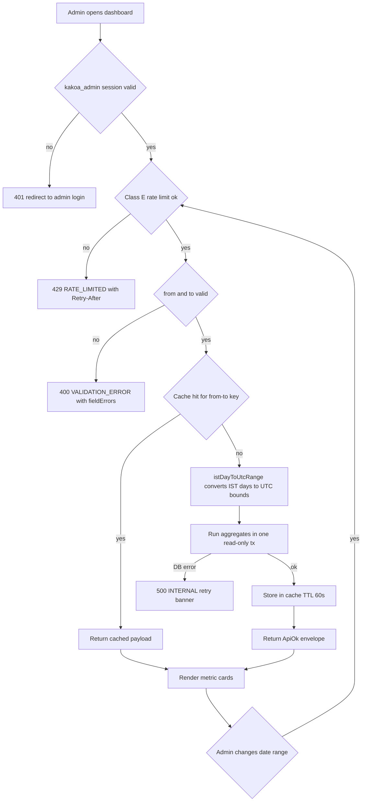
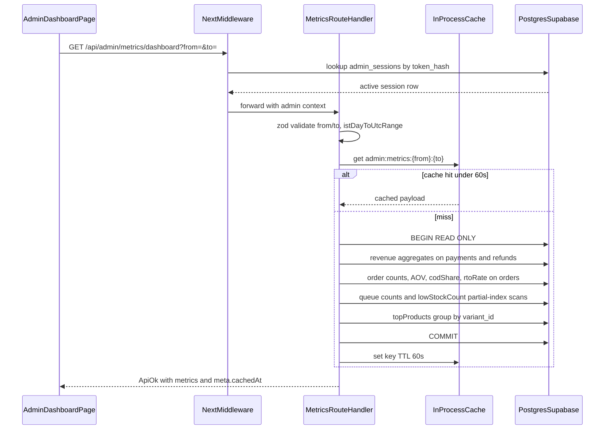
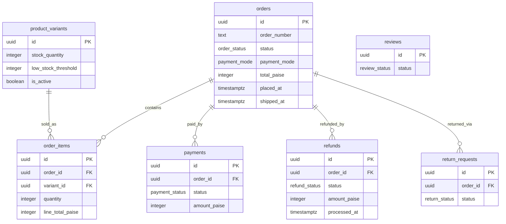

# Admin — Dashboard & Metrics (Phase 2)

> **Module owner:** Dev D (admin panel lane). **Phase:** 2 (Weeks 6–8), part of "full ops" per PROJECT_PLAN §3.14.
> **Scope:** the single read-only metrics endpoint `GET /api/admin/metrics/dashboard`, its IST-calendar → UTC range conversion, the query patterns and indexes behind every metric card, the 60-second cache, and the zero-orders business alert.
> **Auth is NOT specced here** — admin OTP login, `admin_sessions`, and the owner/staff role model live in [admin-staff-roles.md](admin-staff-roles.md). This endpoint requires tier `admin:staff` (owner ⊇ staff).
> Conventions: money is INR **integer paise** (`*_paise`), DB timestamps are `timestamptz` UTC, display is IST via `formatIST()`. Error codes come only from the Contract registry (PROJECT_PLAN §2.1).

> **Admin UI stack (decision 2026-07-02):** this module's screens are built with **shadcn/ui (new-york, CLI v4) + TanStack Table** — owned source in `apps/web/src/components/ui/`, themed to KAKOA tokens via CSS variables. Standard patterns: TanStack-powered `Table` for lists (server-driven pagination/sort/filter), `DropdownMenu` row actions, `Sheet` for edit panels, **`AlertDialog` (never `Dialog`) for destructive confirmations**, `Command` palette for quick-nav, `Badge` for enum statuses. See PROJECT_PLAN §4.4 and design-system.md for the surface boundary.

---

## 1. Field-Level Specification

The endpoint takes exactly two optional query parameters. Unknown query keys are rejected (`zod .strict()` on the parsed query object).

| Field | Type | Required | Max length | Format | Validation rule | Error message on failure |
|---|---|---|---|---|---|---|
| `from` | string (query) | No — defaults to 6 IST calendar days before `to` (7-day window inclusive) | 10 | IST calendar date `YYYY-MM-DD` | Regex `^\d{4}-\d{2}-\d{2}$` AND must be a real calendar date (e.g. `2026-02-30` fails `isValidCalendarDate()`); year between 2024 and current IST year + 1 | `"'from' must be a valid date in YYYY-MM-DD format."` |
| `to` | string (query) | No — defaults to today in IST (`Asia/Kolkata`) | 10 | IST calendar date `YYYY-MM-DD` | Same regex + real-date check as `from`; additionally `to` must not be more than 1 IST day in the future | `"'to' must be a valid date in YYYY-MM-DD format."` / `"'to' cannot be in the future."` |
| *(cross-field)* | — | — | — | — | `from <= to` (string comparison is safe for zero-padded ISO dates) | `"'from' must be on or before 'to'."` |
| *(cross-field)* | — | — | — | — | Range span `<= 366` days (guards a full-table aggregate DoS via `?from=2024-01-01&to=2099-12-31`) | `"Date range cannot exceed 366 days."` |

All validation failures return **400 `VALIDATION_ERROR`** with `fieldErrors` (zod `flatten()` output) per the Contract envelope. Messages above are the exact `fieldErrors` strings.

**IST → UTC conversion (normative).** `istDayToUtcRange(from, to)` in `packages/core/src/dates.ts`:

- IST is fixed UTC+05:30, **no DST** — the conversion is pure arithmetic, no tz database edge cases.
- `fromUtc = Date(from + 'T00:00:00+05:30')` → e.g. `from=2026-07-01` ⇒ `2026-06-30T18:30:00Z`.
- `toUtcExclusive = Date(to + 'T00:00:00+05:30') + 24h` → e.g. `to=2026-07-01` ⇒ `2026-07-01T18:30:00Z`.
- Every range predicate in SQL is **half-open**: `placed_at >= $fromUtc AND placed_at < $toUtcExclusive`. An order placed at 11:59 PM IST on `to` is inside; midnight IST of `to+1` is outside. The 11:30 PM IST boundary case is a named unit test (PROJECT_PLAN §3.14.7).

**Response fields** (all computed, never client-supplied — full schema in §5):

| Field | Type | Definition (exact) |
|---|---|---|
| `revenuePaise.captured` | integer | `SUM(payments.amount_paise)` where `payments.status IN ('captured','partially_refunded','refunded')` joined to orders with `placed_at` in range |
| `revenuePaise.codCollected` | integer | `SUM(payments.amount_paise)` where `payments.status IN ('cod_collected','cod_pending_remittance','cod_remitted')` joined to orders in range |
| `revenuePaise.refunded` | integer | `SUM(refunds.amount_paise)` where `refunds.status = 'processed'` and `refunds.processed_at` in range (refund date, not order date — a July refund of a June order counts in July) |
| `orderCounts` | object | `COUNT(*)` grouped by `orders.status` over orders in range; **every one of the 11 `order_status` enum values is present**, zero-filled |
| `aovPaise` | integer | `FLOOR(SUM(total_paise) / COUNT(*))` over "real" orders in range — status NOT IN `('pending_payment','payment_failed','cancelled')`; `0` when the denominator is 0 (never `NaN`/`null`) |
| `codShare` | number | real COD orders ÷ all real orders in range (same "real" filter), rounded to 4 decimals; `0` when denominator is 0 |
| `rtoRate` | number | orders in range with status IN `('rto_initiated','rto_delivered')` ÷ orders in range with `shipped_at IS NOT NULL`, rounded to 4 decimals; `0` when denominator is 0 |
| `pendingCodConfirmations` | integer | point-in-time `COUNT(*)` of `orders` with `status = 'cod_pending_confirmation'` (NOT range-filtered — a queue is a now-fact) |
| `pendingReviews` | integer | point-in-time `COUNT(*)` of `reviews` with `status = 'pending'` |
| `openReturns` | integer | point-in-time `COUNT(*)` of `return_requests` with `status = 'requested'` |
| `topProducts` | array (≤ 5) | top 5 by units from `order_items` of real orders in range, grouped by `variant_id`; ties broken by revenue desc |
| `lowStockCount` | integer | point-in-time `COUNT(*)` of `product_variants` where `is_active AND stock_quantity <= low_stock_threshold` |

---

## 2. Workflow / User Flow

1. Admin (staff or owner) opens `/admin` dashboard. Server component reads the default range (last 7 IST days) and fetches metrics; metric cards render **shimmer skeletons, never `₹0` placeholders** — a shimmering zero and a real zero must be distinguishable (PROJECT_PLAN §3.14.4).
2. Middleware validates the `kakoa_admin` session cookie against `admin_sessions` (see admin-staff-roles.md). Fail → 401, UI redirects to `/admin/login`. Unauthenticated probes of `/admin` pages get **404, not 403** (risk-engineering hardening).
3. Rate limiter checks Class E bucket (600/min per admin session). Exceeded → 429 `RATE_LIMITED` with `Retry-After`; UI shows countdown toast, never auto-retries.
4. Query params validated per §1. Invalid → 400 `VALIDATION_ERROR`; UI shows field error under the date-range picker and keeps the last good data on screen.
5. Cache check: key `admin:metrics:{from}:{to}`, TTL 60 s. Hit → return cached payload with `meta.cachedAt`; skip to step 8.
6. On miss: `istDayToUtcRange()` computes UTC bounds; the handler runs the aggregate queries of §3 in a single read-only transaction (one consistent snapshot — order counts and revenue never disagree mid-write).
7. Result stored in cache (60 s), returned in the `ApiOk` envelope.
8. UI renders cards: revenue trio, order-status breakdown, AOV, COD share %, RTO rate %, queue badges (COD confirmations / pending reviews / open returns) each deep-linking to its queue page, top-products table, low-stock badge linking to `GET /api/admin/inventory?lowStock=1`.
9. Admin changes the date range → client re-fetches with new `from`/`to`; cards show shimmer over stale values until the new payload lands.
10. Failure at step 6 (DB error) → 500 `INTERNAL`; UI shows a full-width retry banner. Metrics are read-only — retry is always safe.



---

## 3. System Design



**Query patterns and the index that serves each (all indexes exist in DATABASE_ERD.md — none invented here):**

| Metric | Query shape | Index used |
|---|---|---|
| `orderCounts`, `aovPaise`, `codShare`, `rtoRate` | `SELECT status, payment_mode, COUNT(*), SUM(total_paise), COUNT(*) FILTER (WHERE shipped_at IS NOT NULL) FROM orders WHERE placed_at >= $1 AND placed_at < $2 GROUP BY status, payment_mode` — one pass computes all four | `orders_status_idx (status, placed_at DESC)` / seq-scan on the range for small tables; planner's call |
| `revenuePaise.captured` / `.codCollected` | `payments JOIN orders ON payments.order_id = orders.id WHERE orders.placed_at` in range, `payments.status = ANY(...)` | `orders` range scan + `payments_order_idx (order_id)` |
| `revenuePaise.refunded` | `refunds WHERE status = 'processed' AND processed_at >= $1 AND processed_at < $2` | `refunds_order_idx` not applicable; small table, filter scan (add a `processed_at` index only if EXPLAIN on real data demands it — do not pre-invent schema) |
| `pendingCodConfirmations` | `COUNT(*) FROM orders WHERE status = 'cod_pending_confirmation'` | **`orders_open_ops_idx`** — partial index `(placed_at) WHERE status IN ('cod_pending_confirmation','confirmed','packed')`; tiny & hot, index-only scan |
| `pendingReviews` | `COUNT(*) FROM reviews WHERE status = 'pending'` | `reviews_moderation_queue_idx (created_at) WHERE status = 'pending'` |
| `openReturns` | `COUNT(*) FROM return_requests WHERE status = 'requested'` | `return_requests_queue_idx (created_at) WHERE status = 'requested'` |
| `topProducts` | `order_items JOIN orders` (real orders in range) `GROUP BY variant_id ORDER BY SUM(quantity) DESC, SUM(line_total_paise) DESC LIMIT 5`, then join `product_variants`/`products` for names | `order_items_order_idx` for the join; `order_items_variant_idx` documented for sales-by-SKU |
| `lowStockCount` | `COUNT(*) FROM product_variants WHERE is_active AND stock_quantity <= low_stock_threshold` | `product_variants_low_stock_idx (stock_quantity) WHERE is_active AND stock_quantity <= 10` serves the common case (default threshold 10); rows with a custom higher threshold are few — acceptable filter scan |

**External service dependencies:** **none.** This endpoint talks only to Postgres. No Razorpay, Shiprocket, MSG91, or Resend calls — metrics must load during a provider outage (that is exactly when the owner is staring at the dashboard). If **Postgres** itself is down or the read transaction exceeds the 5 s statement timeout: return 500 `INTERNAL` (`"Could not load metrics. Retry in a moment."`); the UI keeps the last rendered values greyed with a retry banner. Never partially render fresh + stale numbers in one payload.

**Caching strategy:**

- **What:** the full computed response object, keyed `admin:metrics:{from}:{to}` (normalized post-default dates, so "today, no params" and explicit today share one entry).
- **Where:** in-process module-scope Map (single Vercel region, per-instance; a cold instance just recomputes — the queries are cheap at this order volume). Documented future extraction point: Redis, same key contract.
- **TTL:** **60 seconds**, hard. No stale-while-revalidate — an ops dashboard showing 60 s-old numbers is fine; 10-minute-old numbers during a COD rush are not.
- **Invalidation trigger:** TTL expiry only. No event-driven invalidation — orders mutate constantly and per-order busting would defeat the cache. `meta.cachedAt` is returned so the UI can display "as of 14:32:05 IST".
- **Shared across admins:** the payload contains no admin-specific data, so all staff/owner sessions share one cache entry per range.

**Zero-orders business alert (they catch bugs monitors miss — PROJECT_PLAN §4.3):** an Inngest cron `metrics/zero-orders-check` runs every 30 min. Between **09:00 and 21:00 IST**, it counts orders with `placed_at` in the trailing 3 h UTC window; if the count is 0, it fires the team alert (`"Zero orders placed in the last 3 business hours — storefront/checkout may be broken."`), deduped to at most one alert per 3 h. Companions from the same spec: payment success rate < 70 %, COD share > 60 % (prepaid flow broken?), and the ₹0-revenue day rollup computed at 23:59 IST. The cron pings healthchecks.io on completion (dead-man switch: a silently dead alert job is the worst failure mode).

---

## 4. Database Schema

**This module owns no tables.** It is a pure read model over tables owned by orders/payments/refunds/catalog/reviews/returns modules — see their specs for full DDL. Nothing here may write. The DDL fragments this module's queries depend on, **verbatim from docs/DATABASE_ERD.md**:

```sql
-- orders (Contract §1.14) — indexes
CREATE INDEX orders_customer_idx ON orders (customer_id, placed_at DESC) WHERE customer_id IS NOT NULL;
CREATE INDEX orders_status_idx   ON orders (status, placed_at DESC);
CREATE INDEX orders_open_ops_idx ON orders (placed_at)                   -- admin ops queue: partial, tiny & hot
  WHERE status IN ('cod_pending_confirmation','confirmed','packed');
CREATE INDEX orders_phone_idx    ON orders (contact_phone);              -- guest lookup + COD abuse checks
CREATE INDEX orders_pending_expiry_idx ON orders (placed_at) WHERE status = 'pending_payment';  -- expiry sweep

-- order_items (Contract §1.15) — indexes
CREATE INDEX order_items_order_idx   ON order_items (order_id);
CREATE INDEX order_items_variant_idx ON order_items (variant_id);   -- "customers also bought" + sales-by-SKU

-- payments (Contract §1.17) — indexes
CREATE INDEX payments_order_idx ON payments (order_id);
CREATE INDEX payments_cod_remit_idx ON payments (status) WHERE status IN ('cod_collected','cod_pending_remittance');

-- refunds (Contract §1.18) — indexes
CREATE INDEX refunds_order_idx ON refunds (order_id);

-- product_variants (Contract §1.4) — index
CREATE INDEX product_variants_low_stock_idx
  ON product_variants (stock_quantity) WHERE is_active AND stock_quantity <= 10;  -- admin low-stock list

-- reviews (Contract §1.23) — index
CREATE INDEX reviews_moderation_queue_idx ON reviews (created_at) WHERE status = 'pending';

-- return_requests (Contract §1.25) — index
CREATE INDEX return_requests_queue_idx ON return_requests (created_at) WHERE status = 'requested';
```

Columns read (names verbatim from the ERD): `orders (id, status, payment_mode, total_paise, placed_at, shipped_at)` · `order_items (order_id, variant_id, product_name, variant_name, sku, quantity, line_total_paise)` · `payments (order_id, status, amount_paise)` · `refunds (status, amount_paise, processed_at)` · `product_variants (is_active, stock_quantity, low_stock_threshold)` · `reviews (status)` · `return_requests (status)`.

`order_status` enum values (verbatim): `'pending_payment','payment_failed','cod_pending_confirmation','confirmed','packed','shipped','out_for_delivery','delivered','cancelled','rto_initiated','rto_delivered'`.



---

## 5. API Design

### `GET /api/admin/metrics/dashboard`

- **Auth tier:** `admin:staff` (owner ⊇ staff; both roles see identical data — no owner-only metrics in v1). Session mechanics per [admin-staff-roles.md](admin-staff-roles.md).
- **Rate limit:** Class **E** — 600/min per admin session. Headers `X-RateLimit-Limit`, `X-RateLimit-Remaining`, `X-RateLimit-Reset` on every response; 429 adds `Retry-After`.
- **Idempotency:** trivially idempotent (pure read). Safe to retry on any failure.
- **Route Handler** (the entire admin API is Route Handlers — Contract §2.1: uniform, testable, curl-able).

**Request:** query string only.

```
GET /api/admin/metrics/dashboard?from=2026-06-26&to=2026-07-02
Cookie: kakoa_admin=<session token>
```

**Response 200 (`ApiOk<DashboardMetrics>`):**

```ts
type DashboardMetrics = {
  range: { from: string; to: string };                       // echoed IST calendar dates post-default
  revenuePaise: {
    captured: number;                                        // prepaid money actually captured
    codCollected: number;                                    // COD cash collected/remitting/remitted
    refunded: number;                                        // refunds processed in range (by processed_at)
  };
  orderCounts: Record<
    'pending_payment' | 'payment_failed' | 'cod_pending_confirmation' | 'confirmed' |
    'packed' | 'shipped' | 'out_for_delivery' | 'delivered' |
    'cancelled' | 'rto_initiated' | 'rto_delivered', number>; // all 11 keys always present, zero-filled
  aovPaise: number;                                           // 0 when no real orders
  codShare: number;                                           // 0..1, 4 decimals
  rtoRate: number;                                            // 0..1, 4 decimals
  pendingCodConfirmations: number;                            // point-in-time queue depths
  pendingReviews: number;
  openReturns: number;
  topProducts: {
    variantId: string; productName: string; variantName: string; sku: string;
    unitsSold: number; revenuePaise: number;
  }[];                                                        // length <= 5
  lowStockCount: number;
  computedAt: string;                                         // ISO UTC instant of computation
};
// envelope: { ok: true, data: DashboardMetrics, meta: { requestId, cachedAt } }
```

**Error cases (registry codes only; common codes per Contract §2.1 convention listed here in full because this is the module's only endpoint):**

| Status | Code | When | Notes |
|---|---|---|---|
| 400 | `VALIDATION_ERROR` | `from`/`to` fail any §1 rule | `fieldErrors` carries the exact per-field messages from §1 |
| 401 | `UNAUTHORIZED` | Missing/expired/revoked `kakoa_admin` session | Revocation effective within one request — session store checked, never JWT-only |
| 403 | `FORBIDDEN` | Valid session but `admin_users.is_active = false` race | Deactivation revokes sessions; this is the belt-and-braces check |
| 429 | `RATE_LIMITED` | Class E bucket exhausted | `Retry-After` header; UI countdown, no auto-retry |
| 500 | `INTERNAL` | DB unreachable / statement timeout | Message: `"Could not load metrics. Retry in a moment."` |

No 404, no 409, no 422, no 502 — there is no resource id, no mutation, and no upstream provider.

**Response headers:** `Cache-Control: private, no-store` (the server-side 60 s cache is authoritative; browsers and any intermediary must never cache an admin payload).

---

## 6. Security Standards

- **Rate limiting:** Class **E — 600/min per admin session** (Contract §2.1). The 366-day range cap is the second DoS guard: the worst legal request aggregates ~1 year of a small shop's orders, bounded by the 5 s statement timeout on the read transaction.
- **Authz:** tier `admin:staff` enforced per-route server-side (UI hiding is cosmetic — risk-engineering Module 10 #2). This route appears in the **exhaustive authz checklist test**: `{unauthenticated → 401, staff → 200, owner → 200}`; adding an admin route without extending that test fails CI. Middleware 404s (not 403s) unauthenticated probes of admin pages.
- **Input sanitization:** both params pass `^\d{4}-\d{2}-\d{2}$` before any use; all SQL via Drizzle parameterized queries — the date strings never touch SQL text. `.strict()` zod schema rejects unknown query keys.
- **Output encoding:** `topProducts` carries `product_name`/`variant_name` snapshots which are admin-authored — still React-encoded on render (the admin panel renders customer-authored content elsewhere; one encoding discipline everywhere, tested with XSS fixtures per §3.14.6 #11).
- **Encryption at rest:** none beyond Supabase's default disk encryption — this module stores nothing; it reads aggregates only. No PII appears in the response payload (counts, sums, SKUs — no names, phones, addresses).
- **NEVER logged:** the `kakoa_admin` cookie/raw session token; any customer PII (none flows through here); full query results. Logged (structured JSON): `{request_id, module: 'admin-metrics', event: 'dashboard.read', admin_user_id, from, to, cache: 'hit'|'miss', duration_ms}`. Metrics reads are **not** written to `admin_audit_log` — the audit table is for mutations (PROJECT_PLAN §3.14.8); flooding it with reads would bury the signal.
- **OWASP risks specific to this module:**
  - **A01 Broken Access Control:** a staff-cookie-less request or storefront session hitting the route → 401; covered by the checklist test. Cookie is path-scoped (`/admin` + `/api/admin`), `HttpOnly, Secure, SameSite=Lax`.
  - **A04 Insecure Design / resource exhaustion:** unbounded date ranges → 366-day cap + statement timeout + 60 s cache absorbing dashboard polling.
  - **A09 Logging failures:** the zero-orders alert cron pings healthchecks.io on completion — absence of the ping pages; the alert that silently dies is itself alerted on.
  - **Business-intel leakage:** revenue data is sensitive. `Cache-Control: private, no-store`; the shared server-side cache is keyed only by range and served only after session validation.

---

## 7. Edge Cases

1. **The 11:30 PM IST boundary.** An order placed 2026-07-01 23:30 IST is `2026-07-01T18:00:00Z` — a naive UTC date bucket calls it July 1 UTC but so does IST here; the killer case is 12:30 AM IST July 2 = `18:00Z July 1`, which naive UTC grouping puts in the wrong IST day. `istDayToUtcRange()` half-open bounds make `?from=2026-07-02&to=2026-07-02` include it and `?to=2026-07-01` exclude it. Named unit test (PROJECT_PLAN §3.14.7).
2. **Zero orders in range.** New store, or a filter on a dead week: `aovPaise = 0`, `codShare = 0`, `rtoRate = 0` — explicit zero-guards, never `NaN`, `Infinity`, or a 500 from divide-by-zero. `orderCounts` still returns all 11 keys zero-filled so the UI never key-errors.
3. **Shimmering zero vs real zero.** The dashboard must render skeleton shimmer while loading and a real `₹0` only from a real payload (§3.14.4) — a founder glancing at `₹0` must know whether it's "loading" or "no sales" (the latter is the zero-orders alert condition).
4. **Refund crossing the range boundary.** Order placed June 28, refund processed July 3. `?from=2026-07-01` counts the refund (by `processed_at`) but not the order — so `revenuePaise.refunded` can exceed `captured + codCollected` for a short range. The UI labels the card "Refunds processed" not "Refunds on these orders"; the spec-level definition in §1 is the contract.
5. **Order status moves between cache refreshes.** A `cod_pending_confirmation` order is confirmed 20 s after the cache filled: queue badge says 5, the COD queue page says 4. Acceptable staleness ≤ 60 s by design; `meta.cachedAt` renders "as of HH:MM:SS IST" beside the cards so staff don't file bug reports about it.
6. **Mixed statuses inside one consistent snapshot.** All aggregates run in a single read-only transaction — without it, an order transitioning mid-request could be counted in `confirmed` by one query and `packed` by another, making the status breakdown sum ≠ total. The tx snapshot makes the invariant `sum(orderCounts) == COUNT(orders in range)` testable and true.
7. **RTO rate denominator subtlety.** `rtoRate` divides by orders with `shipped_at IS NOT NULL` in range, not all orders — a week of heavy COD placements with nothing shipped yet must show RTO 0 %, not a misleading spike when the first RTO lands against a tiny "delivered" count. Orders currently `rto_initiated` count in the numerator even before `rto_delivered` (early smoke signal, matches the COD-abuse posture).
8. **Custom `low_stock_threshold` above 10.** `product_variants_low_stock_idx` is partial on `stock_quantity <= 10`; a variant with threshold 25 and stock 20 is low-stock but outside the index. The count query filters on `stock_quantity <= low_stock_threshold` (correct) and merely loses index assist for those few rows — correctness over the index, never the reverse.
9. **`to` = today, day still in progress.** Today's IST bucket is partial by definition. The UI marks today's data point "(so far)"; the ₹0-revenue day rollup alert only evaluates **completed** IST days at 23:59 IST — never fires mid-morning on a slow day.
10. **Range max abuse.** `?from=2024-01-01&to=2099-12-31` → 400 `VALIDATION_ERROR` (`"Date range cannot exceed 366 days."`) before any SQL runs. Combined with Class E limits, an admin session cannot grind the DB with pathological aggregates.
11. **Zero-orders alert vs business hours.** The 3 h zero-orders window only evaluates between 09:00–21:00 IST — 3 AM silence is normal, not an incident; the window straddling 09:00 uses only in-hours minutes. Deduped to one alert per window so a broken checkout doesn't page every 30 min all day.
12. **Deactivated admin mid-session.** Owner deactivates a staff member while their dashboard auto-refreshes: next request hits the revoked-session check → 401 within one request (session store, not JWT) — the belt-and-braces 403 covers the exact race where the session row outlives `is_active=false` by one query.

---

## 8. State Machine

**Not applicable.** This module is a pure read-model endpoint with a TTL cache — it owns no entity that changes state; it only *reports on* the order/payment/refund state machines owned by their respective modules.

---

## 9. Testing Requirements

**Unit (`packages/core` + handler lib):**

- `istDayToUtcRange()`: `('2026-07-01','2026-07-01')` → `[2026-06-30T18:30:00Z, 2026-07-01T18:30:00Z)`; the 11:30 PM IST and 12:30 AM IST boundary orders land in the correct IST day; leap day `2028-02-29` valid, `2026-02-29` → 400; month-end rollover `2026-06-30 → 07-01`.
- Query-param zod schema: regex rejects `2026-7-1`, `01-07-2026`, `2026-07-01T00:00`, SQL-ish garbage; `from > to` → exact message `"'from' must be on or before 'to'."`; 367-day span rejected, 366 accepted; defaults produce a 7-IST-day inclusive window; unknown query key rejected.
- Metric math on fixture rows: `aovPaise` uses FLOOR and excludes `pending_payment`/`payment_failed`/`cancelled`; `codShare`/`rtoRate` zero-guards (0-denominator → 0, never NaN); `orderCounts` zero-fills all 11 enum keys; `topProducts` tie broken by revenue desc, capped at 5.
- Cache: key normalization (defaulted vs explicit today's range share one key); entry expires at 60 s, not before; `meta.cachedAt` reflects computation time, not serve time.

**Integration (ephemeral Postgres, migrations from zero):**

- Seed a fixture set spanning 3 IST days with orders in all 11 statuses, prepaid + COD payments in all revenue-relevant `payment_status` values, one processed and one initiated refund → assert every response field against hand-computed expected values; assert `sum(orderCounts) == total orders in range`.
- Refund `processed_at` in range but order outside → counted in `refunded`, order absent from `orderCounts` (edge #4).
- `EXPLAIN` assertions: `pendingCodConfirmations` uses `orders_open_ops_idx`; `pendingReviews` uses `reviews_moderation_queue_idx`; `openReturns` uses `return_requests_queue_idx` (regression trap for someone "simplifying" the partial indexes away).
- Authz checklist rows for this route: unauthenticated → 401, staff → 200, owner → 200, revoked session → 401 (part of the exhaustive admin route × role matrix that fails CI on route-manifest diff).
- Concurrent write during read: transition an order mid-request in a competing tx → response is internally consistent (single-snapshot invariant, edge #6).
- Zero-orders alert cron: seeded 3 h gap inside business hours fires exactly one alert; same gap at 04:00 IST fires none; dedup suppresses the second evaluation of the same window.

**E2E (Playwright):**

1. **`dashboard_reflects_cod_confirmation`** — place a COD order (storefront) → dashboard shows `pendingCodConfirmations: 1` and the order under `cod_pending_confirmation` in `orderCounts` → staff confirms it in the COD queue → after cache TTL (test hook busts the cache), badge drops to 0 and `confirmed` increments.
2. **`dashboard_ist_range_filter`** — seed orders on two adjacent IST days via test API → set the range picker to day 1 only → counts/revenue match day 1 exactly, including a 23:30 IST boundary order; widen to both days → totals sum.
3. **`dashboard_staff_access_and_shimmer`** — staff (non-owner) logs in via OTP → dashboard loads fully (no owner gate on metrics) → throttled network shows shimmer cards, never a premature `₹0`; API 500 (mocked) shows the retry banner with the last values greyed.

---

## 10. Definition of Done

- [ ] `GET /api/admin/metrics/dashboard` live behind `admin:staff`, Class E (600/min/session), `X-RateLimit-*` headers on every response, `Cache-Control: private, no-store`
- [ ] `from`/`to` validation exact per §1 (regex, real-date, order, 366-day cap, future guard) with the exact `fieldErrors` messages; only registry error codes used (`VALIDATION_ERROR`, `UNAUTHORIZED`, `FORBIDDEN`, `RATE_LIMITED`, `INTERNAL`)
- [ ] `istDayToUtcRange()` in `packages/core` with the IST boundary unit tests green, including 11:30 PM IST and the day-crossing 12:30 AM case (PROJECT_PLAN §3.14 DoD: "IST calendar-day ranges with the boundary test green")
- [ ] All metric definitions implemented exactly per §1 table; all aggregates inside one read-only transaction; `sum(orderCounts)` invariant integration test green
- [ ] Zero-denominator guards proven (`aovPaise`/`codShare`/`rtoRate` → 0, never NaN); `orderCounts` zero-fills all 11 `order_status` values
- [ ] 60 s server-side cache with normalized keys, `meta.cachedAt` surfaced in the UI as "as of HH:MM:SS IST"
- [ ] EXPLAIN-verified index usage: `orders_open_ops_idx`, `reviews_moderation_queue_idx`, `return_requests_queue_idx`, `product_variants_low_stock_idx` paths; no new indexes invented outside DATABASE_ERD.md
- [ ] Dashboard UI: shimmer (never `₹0`) while loading; queue badges deep-link to COD queue / reviews moderation / returns; low-stock badge links to the inventory low-stock filter; every paise value through `formatPaise()`, every timestamp through `formatIST()`
- [ ] This route present in the exhaustive authz checklist test (unauthenticated 401 / staff 200 / owner 200 / revoked 401); CI route-manifest diff covers it
- [ ] Zero-orders business alert live: Inngest cron every 30 min, 09:00–21:00 IST business-hours window, trailing 3 h, deduped, healthchecks.io dead-man ping on completion; ₹0-revenue day rollup at 23:59 IST; payment-success < 70 % and COD share > 60 % companions wired (PROJECT_PLAN §4.3)
- [ ] Structured log line per request (`admin.metrics` event with cache hit/miss + duration); no session tokens or PII in logs; metrics reads NOT written to `admin_audit_log`
- [ ] Statement timeout (5 s) on the read transaction; 500 path renders the retry banner E2E
- [ ] The 3 named E2E scenarios green in CI
