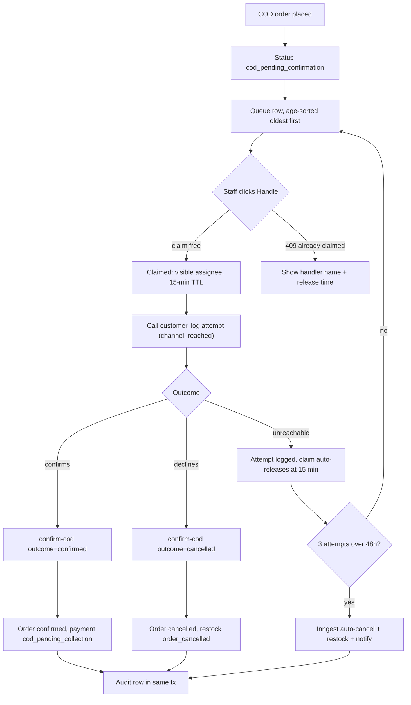
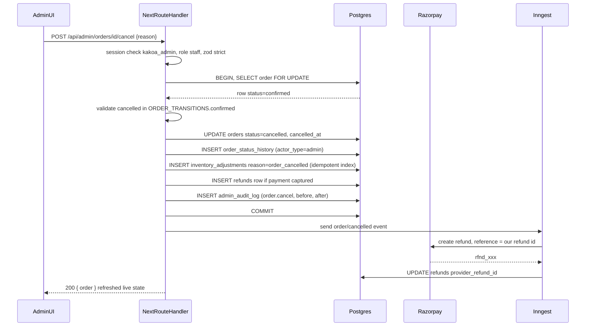
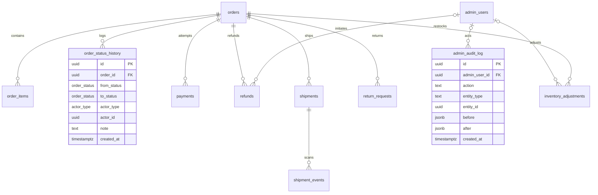
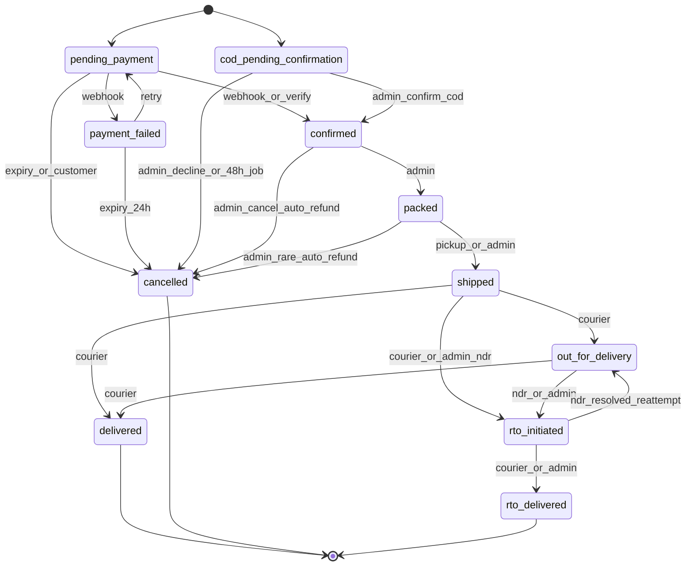

# Admin — Orders Ops, COD Queue, RTO/NDR Views (Phase 2)

> Module owner: **Dev D** (admin surface) · Phase 2 (W6–8) · PROJECT_PLAN §3.14 (orders-ops slice) + §3.8 (COD lifecycle) + §3.10 (RTO/NDR/exceptions)
> All routes are Route Handlers under `/api/admin/*` (Contract §2.1 envelope), auth `admin:staff` unless marked **owner**, rate class **E (600/min per admin session)**. Every mutation writes `admin_audit_log` in the same transaction. Money is integer paise via `formatPaise()`; timestamps are `timestamptz` UTC rendered via `formatIST()`.

> **Admin UI stack (decision 2026-07-02):** this module's screens are built with **shadcn/ui (new-york, CLI v4) + TanStack Table** — owned source in `apps/web/src/components/ui/`, themed to KAKOA tokens via CSS variables. Standard patterns: TanStack-powered `Table` for lists (server-driven pagination/sort/filter), `DropdownMenu` row actions, `Sheet` for edit panels, **`AlertDialog` (never `Dialog`) for destructive confirmations**, `Command` palette for quick-nav, `Badge` for enum statuses. See PROJECT_PLAN §4.4 and design-system.md for the surface boundary.

---

## 1. Field-Level Specification

### 1.1 `GET /api/admin/orders` — list filters (query params)

| Field | Type | Required | Max len | Validation rule (exact) | Error message on failure |
|---|---|---|---|---|---|
| `status` | string enum | no | — | Must be one of the 11 `order_status` values: `pending_payment`, `payment_failed`, `cod_pending_confirmation`, `confirmed`, `packed`, `shipped`, `out_for_delivery`, `delivered`, `cancelled`, `rto_initiated`, `rto_delivered` | "Unknown order status filter." |
| `paymentMode` | string enum | no | — | `^(prepaid\|cod)$` | "Payment mode must be prepaid or cod." |
| `q` | string | no | 100 | Trimmed; 2–100 chars. Matched as: order number if `^KK-\d{5,}$` (exact, case-insensitive); phone if `^(\+91)?[6-9]\d{9}$` (normalized to `+91XXXXXXXXXX` before matching `orders.contact_phone`); otherwise `citext` prefix match on `orders.contact_email`. Never interpolated — Drizzle parameterized only. | "Search must be 2–100 characters." |
| `from` | string (IST date) | no | 10 | `^\d{4}-\d{2}-\d{2}$` and a real calendar date; interpreted as **IST calendar day start** via `istDayToUtcRange()` (00:00:00 IST → UTC) | "From date must be YYYY-MM-DD." |
| `to` | string (IST date) | no | 10 | `^\d{4}-\d{2}-\d{2}$`; IST day **end** (23:59:59.999 IST → UTC). If both present: `from <= to` | "To date must be YYYY-MM-DD." / "From date must not be after to date." |
| `page` | integer | no | — | `^\d+$`, `>= 1`, default `1` | "Page must be a positive integer." |
| `pageSize` | integer | no | — | `^\d+$`, `10 <= pageSize <= 100`, default `25` | "Page size must be between 10 and 100." |
| `sort` | string enum | no | — | `^(placed_at_desc\|placed_at_asc\|age_desc)$`, default `placed_at_desc`. `age_desc` = oldest-first (queue mode). | "Unknown sort option." |

### 1.2 `POST /api/admin/orders/[id]/transition` — body

| Field | Type | Required | Max len | Validation rule (exact) | Error message on failure |
|---|---|---|---|---|---|
| `to` | string enum | yes | — | One of the 11 `order_status` values AND present in `ORDER_TRANSITIONS[current]` (checked server-side under `SELECT ... FOR UPDATE`) | "Target status is not valid." / 422: "This order is now {current}; allowed next states: {details.allowed}." |
| `note` | string | no | 500 | Trimmed, `char_length <= 500`, control chars (U+0000–U+001F except \n) stripped | "Note must be 500 characters or fewer." |

### 1.3 `POST /api/admin/orders/[id]/confirm-cod` — body

| Field | Type | Required | Max len | Validation rule (exact) | Error message on failure |
|---|---|---|---|---|---|
| `outcome` | string enum | yes | — | `^(confirmed\|cancelled)$` | "Outcome must be confirmed or cancelled." |
| `note` | string | no | 500 | Same as 1.2 `note` | "Note must be 500 characters or fewer." |

### 1.4 `POST /api/admin/orders/[id]/claim-cod` — body: none (empty object accepted; `.strict()` rejects any keys).

### 1.5 `POST /api/admin/orders/[id]/cod-attempt` — contact-attempt log (additive v1.1)

| Field | Type | Required | Max len | Validation rule (exact) | Error message on failure |
|---|---|---|---|---|---|
| `channel` | string enum | yes | — | `^(call\|sms\|whatsapp)$` | "Channel must be call, sms, or whatsapp." |
| `reached` | boolean | yes | — | JSON boolean | "Reached must be true or false." |
| `note` | string | no | 500 | Same as 1.2 `note` | "Note must be 500 characters or fewer." |

### 1.6 `POST /api/admin/orders/[id]/cancel` — body

| Field | Type | Required | Max len | Validation rule (exact) | Error message on failure |
|---|---|---|---|---|---|
| `reason` | string | yes | 500 | Trimmed, 3–500 chars | "Cancellation reason is required (3–500 characters)." |

### 1.7 `POST /api/admin/shipments/[id]/ndr` — NDR action (RTO/NDR view)

| Field | Type | Required | Max len | Validation rule (exact) | Error message on failure |
|---|---|---|---|---|---|
| `action` | string enum | yes | — | `^(reattempt\|initiate_rto)$` | "Action must be reattempt or initiate_rto." |
| `note` | string | no | 500 | Same as 1.2 `note` | "Note must be 500 characters or fewer." |

### 1.8 `POST /api/admin/orders/[id]/rto-disposition` — per-line disposition after `rto_delivered`

| Field | Type | Required | Max len | Validation rule (exact) | Error message on failure |
|---|---|---|---|---|---|
| `lines` | array | yes | 50 items | Non-empty; each `{ orderItemId: uuid, disposition: 'restock'\|'destroy' }`; `orderItemId` must belong to this order; no duplicate `orderItemId` | "At least one line disposition is required." / "Duplicate line in disposition." / "Line does not belong to this order." |
| `note` | string | no | 500 | Same as 1.2 `note` | "Note must be 500 characters or fewer." |

All bodies are zod `.strict()` — unknown keys → 400 `VALIDATION_ERROR` with `fieldErrors` (zod `flatten()`).

---

## 2. Workflow / User Flow

**COD confirmation queue (launch gate #3), the core flow:**

1. COD order placed (phone OTP-verified at placement) → order status `cod_pending_confirmation` → appears in `/admin/cod-queue`, **age-sorted oldest first** (fed by partial index `orders_open_ops_idx`).
2. Staff opens the queue; each row shows order number, total (`formatPaise`), age, phone, attempt history (channel, timestamp, count), and claim state (assignee name + claim expiry, if claimed).
3. Staff clicks **Handle** → `POST /claim-cod`. Success: row shows "Handling — {staff name}" to every admin. Failure 409 `CONFLICT`: "Already being handled by {name} (released {time})."
4. Staff calls the customer. Each attempt is logged via `POST /cod-attempt` (channel, reached, note) — visible to all staff so the customer is never called twice in ten minutes.
5. Outcome:
   - Reached, confirms → `POST /confirm-cod {outcome:'confirmed'}` → order → `confirmed`, COD payment row set `cod_pending_collection`, fulfillment can proceed.
   - Reached, declines → `POST /confirm-cod {outcome:'cancelled'}` → order → `cancelled`, stock restocked (reason `order_cancelled`, idempotent).
   - Not reached → attempt logged; claim auto-releases 15 min after claim; **3 attempts over 48h** → Inngest job auto-cancels with stock release + customer notification (§3.8 edge #11).
6. If the claim expires mid-call, UI shows "claim expired, re-claim to continue"; confirm-cod still succeeds if the order is still `cod_pending_confirmation` (claim is UX coordination, the state machine is the guarantee).
7. Every mutation (claim, attempt, confirm, cancel) writes `admin_audit_log` in the same transaction; queue depth > 25 or oldest > 24h fires the launch-gate alert.



---

## 3. System Design



**External dependencies and exact down/timeout behavior:**

| Dependency | Used for | When down / timing out |
|---|---|---|
| Postgres (Supabase Mumbai) | Everything | 500 `INTERNAL`; no partial writes possible (single tx per mutation). If the audit insert fails, the **whole mutation rolls back** — a mutation that cannot be audited must not happen. |
| Razorpay (refund on cancel of a captured prepaid order) | Auto-refund | Refund creation is **asynchronous via Inngest**: cancel commits locally, refund row `initiated`; Razorpay call retried by Inngest with backoff, idempotent via our refund id as the Razorpay reference. Direct owner-initiated refunds (`POST /refunds`) that call Razorpay synchronously surface 502 `UPSTREAM_ERROR` with the upstream message in `details` + retry button. |
| Shiprocket (NDR reattempt, courier data behind RTO/NDR views) | NDR actions, event display | Views render from local `shipments`/`shipment_events` — **Shiprocket down does not blank the views**. `POST /shipments/[id]/ndr` → 502 `UPSTREAM_ERROR`; retryable; the 30-min poller reconciles state later. Timeout budget 10s per SR call. |
| Inngest | Auto-refund, 48h COD auto-cancel, exception detection cron | Enqueue failure → mutation still committed; event re-emitted by the reconciliation sweep. Refunds/auto-cancels delayed, never lost. |
| Resend / MSG91 | Customer notifications on confirm/cancel | Fire-and-forget via Inngest; notification failure never fails the ops mutation. |

**Caching: none.** All ops surfaces read live DB state — a cached order list or COD queue would show staff stale statuses and cause double-handling; the queues are small (partial indexes `orders_open_ops_idx`, `webhook_events_pending_idx`, `shipments_stale_poll_idx` keep scans tiny and hot). `Cache-Control: no-store` on every `/api/admin/*` response.

**COD claim storage (no new schema — Contract-conformant):** a claim is an `admin_audit_log` row `action='order.cod_claim'`; the live claim = the latest claim row for the order with `created_at > now() - interval '15 minutes'` and no newer `order.cod_release` row. Auto-release is therefore pure TTL-by-query — no background job, no race. Attempt history = rows `action='order.cod_attempt'` (channel/reached/note in `after` jsonb). Staff deactivation auto-releases claims by inserting `order.cod_release` rows for that actor.

---

## 4. Database Schema

This module **owns no tables**; it operates on the canonical tables below (DDL per docs/DATABASE_ERD.md — verbatim). Composition source for order detail: `orders` + `order_items` + `payments` + `refunds` + `shipments` + `shipment_events` + `order_status_history` + `return_requests`.

### `order_status_history` (ERD §3.16) — written on every transition

| Column | Type | Constraints | Notes |
|---|---|---|---|
| `id` | `uuid` | `PRIMARY KEY DEFAULT gen_random_uuid()` | |
| `order_id` | `uuid` | `NOT NULL REFERENCES orders(id) ON DELETE CASCADE` | |
| `from_status` | `order_status` | | NULL for creation |
| `to_status` | `order_status` | `NOT NULL` | |
| `actor_type` | `actor_type` | `NOT NULL` | |
| `actor_id` | `uuid` | | `admin_users.id` / `customers.id` / NULL |
| `note` | `text` | | |
| `created_at` | `timestamptz` | `NOT NULL DEFAULT now()` | |

```sql
CREATE INDEX osh_order_idx ON order_status_history (order_id, created_at);
```

### `admin_audit_log` (ERD §3.29) — written on every mutation (append-only; app role has no UPDATE/DELETE grants)

| Column | Type | Constraints | Notes |
|---|---|---|---|
| `id` | `uuid` | `PRIMARY KEY DEFAULT gen_random_uuid()` | |
| `admin_user_id` | `uuid` | `REFERENCES admin_users(id) ON DELETE SET NULL` | |
| `action` | `text` | `NOT NULL` | `'order.transition'`, `'refund.initiate'`, `'product.update'`, ... |
| `entity_type` | `text` | `NOT NULL` | |
| `entity_id` | `uuid` | | |
| `before` | `jsonb` | | |
| `after` | `jsonb` | | |
| `created_at` | `timestamptz` | `NOT NULL DEFAULT now()` | |

```sql
CREATE INDEX admin_audit_entity_idx ON admin_audit_log (entity_type, entity_id, created_at DESC);
```

### `orders` — ops-relevant indexes (ERD §3.14, verbatim)

```sql
CREATE INDEX orders_customer_idx ON orders (customer_id, placed_at DESC) WHERE customer_id IS NOT NULL;
CREATE INDEX orders_status_idx   ON orders (status, placed_at DESC);
CREATE INDEX orders_open_ops_idx ON orders (placed_at)                   -- admin ops queue: partial, tiny & hot
  WHERE status IN ('cod_pending_confirmation','confirmed','packed');
CREATE INDEX orders_phone_idx    ON orders (contact_phone);              -- guest lookup + COD abuse checks
CREATE INDEX orders_pending_expiry_idx ON orders (placed_at) WHERE status = 'pending_payment';  -- expiry sweep
```

Read-composed (full DDL in ERD): `payments` (§3.17, incl. `payments_cod_remit_idx`), `refunds` (§3.18), `shipments` (§3.19, `shipments_one_active_idx`, `shipments_stale_poll_idx`), `shipment_events` (§3.20, `UNIQUE (shipment_id, status, occurred_at)`), `return_requests` (§3.25), `inventory_adjustments` (§3.22, `inv_adj_once_per_cause_idx` guards restock idempotency), `admin_users`/`admin_sessions` (§3.27–3.28).



---

## 5. API Design

Envelope: `ApiOk<T> | ApiErr` per Contract §2.1. Common codes apply everywhere and are not repeated: 400 `VALIDATION_ERROR`, 401 `UNAUTHORIZED`, 403 `FORBIDDEN`, 429 `RATE_LIMITED`, 500 `INTERNAL`. Auth `admin:staff`, rate class **E** unless noted.

| # | Method & route | Request | Response `data` | Endpoint-specific errors |
|---|---|---|---|---|
| 1 | `GET /api/admin/orders` | Query per §1.1 | `{ orders: AdminOrderRow[] }` + `meta {page, pageSize, total}`. Row: `{ id, orderNumber, status, paymentMode, contactPhone, contactEmail, totalPaise, placedAt, ageMinutes, city, codClaim: { adminName, expiresAt } \| null }` | — |
| 2 | `GET /api/admin/orders/[id]` | — | Full composition: `{ order (all money *_paise, addresses jsonb snapshots), items[], payments[] (incl. failure_reason, raw_payload viewer flag), refunds[], shipments[] (+ events[], source badges, superseded history), history: order_status_history[], returns[], codAttempts[], codClaim, allowedTransitions: OrderStatus[] }` — `allowedTransitions` computed from `ORDER_TRANSITIONS[status]`, same map that enables UI buttons | 404 `NOT_FOUND` |
| 3 | `POST /api/admin/orders/[id]/transition` | `{ to, note? }` §1.2 | `{ order, history }` | 404 `NOT_FOUND`; 422 `INVALID_TRANSITION` with `details.allowed: OrderStatus[]` (replay of same target when already in that state → 200 no-op with `meta.noop: true` is NOT provided — repeat = 422 with allowed list; UI refetches) |
| 4 | `POST /api/admin/orders/[id]/claim-cod` | `{}` | `{ claim: { adminUserId, adminName, claimedAt, expiresAt } }` (expiresAt = claimedAt + 15 min) | 404 `NOT_FOUND`; 409 `CONFLICT` `details: { claimedBy, expiresAt }` (actively claimed by another admin); 422 `INVALID_TRANSITION` (order not `cod_pending_confirmation`). Re-claim by the same admin refreshes the TTL (200). |
| 5 | `POST /api/admin/orders/[id]/cod-attempt` | `{ channel, reached, note? }` §1.5 | `{ attempt, attemptCount, windowStartedAt }` | 404 `NOT_FOUND`; 422 `INVALID_TRANSITION` (not `cod_pending_confirmation`) |
| 6 | `POST /api/admin/orders/[id]/confirm-cod` | `{ outcome, note? }` §1.3 | `{ order }` | 404 `NOT_FOUND`; 422 `INVALID_TRANSITION` (not in `cod_pending_confirmation`); **idempotent replay of the same outcome returns current state 200** (order already `confirmed` and outcome=`confirmed` → 200 no-op) |
| 7 | `POST /api/admin/orders/[id]/cancel` | `{ reason }` §1.6 | `{ order, refund: RefundRow \| null }` — restock (reason `order_cancelled`, idempotent via `inv_adj_once_per_cause_idx`) + auto-refund row if a payment is `captured` (Razorpay call async via Inngest, keyed by our refund id) | 404 `NOT_FOUND`; 422 `INVALID_TRANSITION` (`cancelled` not in `ORDER_TRANSITIONS[current]`, e.g. already `shipped`) |
| 8 | `POST /api/admin/orders/[id]/refunds` — **owner** | `{ amountPaise: int > 0, reason: 3–500 chars, destination: 'original_method'\|'bank_transfer'\|'upi', payoutReference?: <=100 chars }` | `{ refund }` | 404 `NOT_FOUND`; 422 `REFUND_EXCEEDS_PAID` `details.refundablePaise`; 409 `CONFLICT` (refund in flight); 502 `UPSTREAM_ERROR` (Razorpay; idempotent via our refund id as the Razorpay reference) |
| 9 | `GET /api/admin/cod-queue` | `?page=&pageSize=` | `{ rows: CodQueueRow[] }` age-sorted oldest first: `{ orderId, orderNumber, totalPaise, contactPhone, ageMinutes, attemptCount, lastAttemptAt, lastAttemptChannel, claim }` + `meta { depth, oldestAgeMinutes }` (alert feed: depth > 25 or oldest > 24h) | — |
| 10 | `GET /api/admin/ndr` | `?page=` | `{ rows: [{ orderId, orderNumber, shipmentId, awbCode, courierName, ndrReasonCode (raw sr_status_code), ndrReason (activity text), attemptCount, lastEventAt, customerNotifiedAt }] }` — NDR events from `shipment_events`; 3 failed attempts auto-RTO (Inngest, §3.10) | — |
| 11 | `POST /api/admin/shipments/[id]/ndr` | `{ action, note? }` §1.7 | `{ shipment }` — `reattempt` calls Shiprocket NDR action API; `initiate_rto` transitions the order `shipped\|out_for_delivery → rto_initiated` through `ORDER_TRANSITIONS` | 404 `NOT_FOUND`; 422 `INVALID_TRANSITION`; 502 `UPSTREAM_ERROR` (SR passthrough in `details`, retryable) |
| 12 | `GET /api/admin/rto` | `?phase=in_flight\|awaiting_qc&page=` | `{ rows: [{ orderId, orderNumber, paymentMode, shipment { awbCode, status, courierName }, rtoInitiatedAt, rtoDeliveredAt, dispositionRecorded: boolean, repeatRtoPhone: boolean }] }` — COD RTOs show payment `failed` (excluded from remittance-overdue alerts); repeat-RTO phones feed COD eligibility | — |
| 13 | `POST /api/admin/orders/[id]/rto-disposition` | `{ lines, note? }` §1.8 | `{ adjustments: InventoryAdjustmentRow[] }` — `restock` → ledger reason `rto_restock` (idempotent via `inv_adj_once_per_cause_idx`); `destroy` → `damage_writeoff` with note referencing the shipment | 404 `NOT_FOUND`; 422 `INVALID_TRANSITION` (order not `rto_delivered`); 409 `CONFLICT` (disposition already recorded for a line) |
| 14 | `GET /api/admin/fulfillment/exceptions` | `?page=` | `{ rows: [{ shipmentId, orderId, orderNumber, stuckStage ('pending'\|'awb_assigned_no_label'\|'pickup_overdue'), stuckSinceMinutes, lastError }], poisonWebhooks: [{ id, provider, eventType, attempts, error }] }` — shipments stuck **> 2h** in an intermediate step; `pickup_scheduled` without `picked_up` in 24–48h; `webhook_events` in `failed` | — |
| 15 | `POST /api/admin/fulfillment/exceptions/[shipmentId]/retry` | `{}` | `{ enqueued: true }` — resumes the step-wise Inngest push pipeline from the last completed step (never restarts from step 1) | 404 `NOT_FOUND`; 409 `CONFLICT` (retry already in flight) |

**Idempotency summary:** transitions are idempotent through the state machine (illegal replay → 422 + allowed list; confirm-cod same-outcome replay → 200 current state); cancel's restock and RTO dispositions are idempotent via `inv_adj_once_per_cause_idx`; refunds keyed by our refund id at Razorpay; exception retries resume, never duplicate (SR create keyed by `order_number` channel reference).

---

## 6. Security Standards

- **Rate limits (Contract classes):** class **E — 600/min per admin session** on every route above; admin login OTP is class **C** (1/60s + 3/10min + 10/day per destination; 20/hr per IP; 5 verify attempts then 410) — owned by admin-auth, not this doc. All 429s send `Retry-After` + `X-RateLimit-Limit/Remaining/Reset`.
- **Authz:** per-route role middleware + per-action assertion. `admin:staff` for list/detail/transition/claim/attempt/confirm-cod/cancel/NDR/RTO/exceptions; **`admin:owner` only** for `POST /orders/[id]/refunds` (all refund initiation is owner per Contract §2.9). Session = `kakoa_admin` cookie (path-scoped to `/admin` + `/api/admin`, `HttpOnly; Secure; SameSite=Lax`), checked against `admin_sessions` **per request** (12h lifetime, revocation effective within one request — never JWT-only). Staff deactivation revokes sessions and auto-releases COD claims. Negative tests for the owner-only refund route live in the exhaustive authz checklist test.
- **Input sanitization:** zod `.strict()` on every body; Drizzle parameterized queries only (the `q` search param is the prime SQLi vector — bound parameter, never string-built); `note`/`reason` control-chars stripped, stored raw, encoded at render.
- **Stored XSS — this module renders customer-authored content** (names, gift messages, addresses, customer notes, return comments) in the admin browser: every render HTML-encoded; the order-detail page is tested with XSS fixtures (`` in gift_message and shipping_address.fullName). The admin panel is itself the attack surface.
- **Never logged:** full `contact_phone`/`contact_email` (hash identifiers in structured logs), address contents, `orders.access_token`, `payments.raw_payload` bodies, admin session tokens. Audit `before/after` jsonb may contain PII by design — the audit table is access-controlled, append-only, and PII reads by admins are themselves audited.
- **Encryption at rest:** Supabase-managed disk encryption suffices; no additional column-level encryption (no card data ever touches our DB — Razorpay holds it).
- **OWASP specifics:** A01 Broken Access Control → the authz checklist test (every route × {unauthenticated, staff, owner}); A03 Injection → parameterized `q`, CSV formula-injection guard (`'` prefix on cells starting `=`, `+`, `-`, `@`) in any export path; A04 Insecure Design → server-side `ORDER_TRANSITIONS` arbiter (UI button enablement is cosmetic); A09 Logging Failures → audit write failure aborts the mutation (same tx).

---

## 7. Edge Cases

1. **Cancel races the `payment.captured` webhook.** Staff clicks Cancel while the webhook is mid-processing. Both funnel through `SELECT ... FOR UPDATE` + `ORDER_TRANSITIONS` — exactly one wins; the loser gets 422 `INVALID_TRANSITION` with `details.allowed`, UI refetches live state and re-renders buttons ("this order is now `confirmed`; allowed: packed, cancelled").
2. **Two staff claim the same COD row.** Second `claim-cod` → 409 `CONFLICT` with `details.claimedBy` + `expiresAt`; queue shows the visible assignee throughout. Claim expiry at exactly 15 min is TTL-by-query (derived from the audit row timestamp) — no cron race window.
3. **Claim expires mid-call.** UI shows "claim expired, re-claim to continue" rather than silently letting a second staffer dial; `confirm-cod` still succeeds if the order remains `cod_pending_confirmation` — the claim is coordination, not authorization.
4. **Confirm-cod double-submit / replay.** Same outcome replayed → 200 with current state (idempotent); opposite outcome after transition → 422 `INVALID_TRANSITION`. Two staff confirming simultaneously serialize on the order row lock; second becomes the replay case.
5. **Cancel of a captured prepaid order with Razorpay down.** Local cancel + restock + refund row (`initiated`) commit; the Razorpay call is async via Inngest with backoff, idempotent by our refund id — money instruction is never lost, never duplicated. `orders.cancel_reason` persisted.
6. **Cancel replay must not double-restock.** Webhook-driven or admin re-cancel attempts hit `inv_adj_once_per_cause_idx` (`(order_id, variant_id, reason='order_cancelled')`) — the ledger row inserts at most once.
7. **IST date-filter boundary.** An order placed 2026-07-01 23:45 IST = 18:15 UTC must appear under `from=2026-07-01&to=2026-07-01`. `istDayToUtcRange()` converts calendar days to UTC bounds; the 11:30 PM IST boundary case is a named unit test.
8. **Search by phone in either format.** `q=9876543210` and `q=+919876543210` must both hit `orders.contact_phone` (stored `^\+91[6-9][0-9]{9}$`) — normalize before the indexed equality on `orders_phone_idx`; never a `LIKE '%…%'` table scan.
9. **NDR reason codes are raw courier codes.** `sr_status_code` (e.g. `'17'`) displays with the mapped label; an unmapped code renders as "Courier code {code}" — never crashes the view, logged for mapping-table extension.
10. **Out-of-order courier events in the detail view.** A late `out_for_delivery` scan after `delivered` exists in `shipment_events` (append-only) but the order status never regressed (monotonic enforcement in §3.10). The events log renders by `occurred_at` with source badges (webhook/poll/manual) — staff can see the anomaly without the state machine having lied.
11. **RTO disposition idempotency and partial entry.** Staff records disposition for 2 of 3 lines, browser crashes, retries with all 3: previously recorded lines → 409 `CONFLICT` per line (ledger unique guard); only the missing line applies. Heat-sensitive chocolate defaults the picker to `destroy`.
12. **Staff deactivated with in-flight claims.** Owner deactivates a staffer: sessions revoked immediately, their COD claims auto-release (release audit rows inserted), audit history keeps `admin_user_id` via `ON DELETE SET NULL` semantics on a soft-deactivated user — never CASCADE.
13. **Fulfillment exception retry storm.** Retry button on a stuck shipment enqueues at most one resume job (409 `CONFLICT` if in flight); the pipeline resumes from the last persisted step — a label-stage failure never re-creates the Shiprocket order (duplicate label + double courier charge).

---

## 8. State Machine

Order status (Contract §1.27) — this module's endpoints drive the **admin-actor** edges; webhook/poll edges shown for completeness because admin buttons must respect them. Transition map = `ORDER_TRANSITIONS` in `packages/core/src/order-state-machine.ts`, imported by both the API and the button-enablement UI. Every transition: `SELECT ... FOR UPDATE` → validate → `UPDATE orders` + `INSERT order_status_history` + side effects, one transaction.



COD claim sub-state (UX coordination only, derived from audit rows): `unclaimed → claimed (15-min TTL) → released (expiry | confirm | staff deactivation) → re-claimable`. It never gates `confirm-cod` — only the order state machine does.

---

## 9. Testing Requirements

**Unit (`packages/core` + admin lib):**
- `ORDER_TRANSITIONS` full matrix — every (from, to) pair, legal and illegal, table-driven (100% branch coverage, CI-gated).
- COD claim/auto-release timing: claim, expiry at exactly 15:00, re-claim by same admin refreshes TTL, release on deactivation.
- `istDayToUtcRange()` including the 23:30 IST boundary case and `from > to` rejection.
- `q` classifier: order-number regex vs phone normalization (`9876543210` ↔ `+919876543210`) vs email prefix.
- Attempt-policy predicate: 3 attempts over 48h → auto-cancel eligible.
- Refundable-balance computation (captured − already refunded) feeding `REFUND_EXCEEDS_PAID`.

**Integration (ephemeral Postgres):**
- Transition endpoint racing a simulated `payment.captured` webhook on the same order — exactly one transition wins, `order_status_history` is linear, loser gets 422 with the correct `details.allowed`.
- Cancel of a captured order: single tx asserts order + history + restock ledger + refund row + audit row; replay does not double-restock (`inv_adj_once_per_cause_idx`).
- Confirm-cod idempotent replay (same outcome → 200 current state; flipped outcome → 422).
- Claim conflict: two concurrent `claim-cod` → one 200, one 409 with claimant details.
- **Audit meta-test:** every mutating route in this doc without an `admin_audit_log` row in the same tx fails the suite; injected audit-insert failure rolls back the mutation.
- **Authz checklist rows:** every route here × {unauthenticated → 401, staff → 2xx (except refunds → 403), owner → 2xx}; route added without a checklist row fails CI (route-manifest diff).
- RTO disposition partial-retry: re-submission applies only unrecorded lines.
- IST filter: orders seeded at 23:45 IST / 00:15 IST land in the correct calendar-day buckets.

**E2E (Playwright — named scenarios):**
1. **COD queue workflow:** COD order lands in the queue → staff A claims → second browser (staff B) sees "Handling — A" throughout → A logs a call attempt → records "confirmed" → order proceeds to fulfillment; queue row disappears for both sessions.
2. **Role enforcement on refunds:** staff attempts a refund via UI (button absent) and direct API (403 `FORBIDDEN`) → owner completes the same refund → `refunds` row + audit row visible on order detail.
3. **NDR to RTO with disposition:** mock courier emits NDR ×3 → order auto-flips `rto_initiated` and appears in the NDR/RTO views with the courier reason code → arrives `rto_delivered` → staff records destroy disposition → `damage_writeoff` ledger row with actor visible in inventory ledger.

---

## 10. Definition of Done

- [ ] All 15 endpoints implemented as Route Handlers with the Contract §2.1 envelope, zod `.strict()` bodies, class-E limits with `X-RateLimit-*` + `Retry-After` headers
- [ ] Every transition path (transition, confirm-cod, cancel, NDR initiate-RTO) goes through `ORDER_TRANSITIONS` under `SELECT ... FOR UPDATE`; the webhook-race integration test is green
- [ ] UI buttons enabled from the same imported `ORDER_TRANSITIONS` map; 422 `INVALID_TRANSITION` renders `details.allowed` with a refetch
- [ ] COD queue live: age-sort oldest-first via `orders_open_ops_idx`, claim with visible assignee, 15-min auto-release, attempt history (channel/timestamp/count), depth + oldest-age on the dashboard
- [ ] COD alerts wired: **queue depth > 25 or oldest unconfirmed > 24h** (launch-gate metric)
- [ ] Cancel performs restock (idempotent ledger) + auto-refund row for captured payments; Razorpay refund async, keyed by our refund id; replay-safe proven by test
- [ ] Refund initiation owner-only, validated against refundable balance (`REFUND_EXCEEDS_PAID` with `details.refundablePaise`); staff negative test in the authz checklist
- [ ] RTO/NDR views render from local shipment data (SR outage does not blank them); reason codes displayed raw+mapped; reattempt/initiate-RTO actions with 502 passthrough + retry
- [ ] RTO disposition writes idempotent `rto_restock` / `damage_writeoff` ledger rows; partial-retry test green
- [ ] Fulfillment-exceptions queue lists shipments stuck > 2h + poison webhooks; retry resumes step-wise (no duplicate SR orders, proven against the mock)
- [ ] Append-only audit on every mutation, proven by the meta-test; audit-write failure aborts the mutation; no UPDATE/DELETE grants on `admin_audit_log`
- [ ] IST date filters via `istDayToUtcRange()` with the boundary unit test green; all money via `formatPaise()`, all timestamps via `formatIST()`
- [ ] Stored-XSS fixtures (gift message, address fullName) pass on order detail; `q` search parameterized; `Cache-Control: no-store` on all admin responses
- [ ] PII hashing in structured logs verified (no raw phone/email/access_token/raw_payload in logs)
- [ ] The 3 named E2E scenarios green in CI
