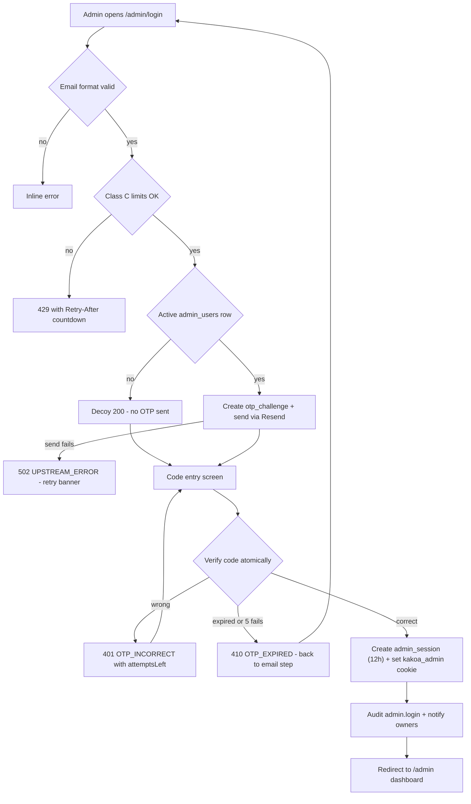
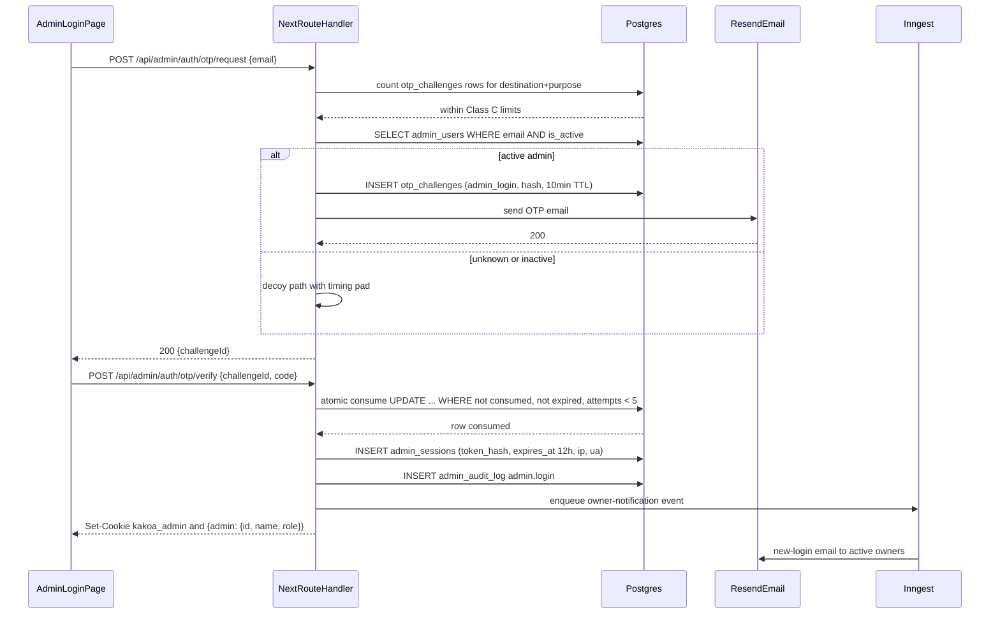
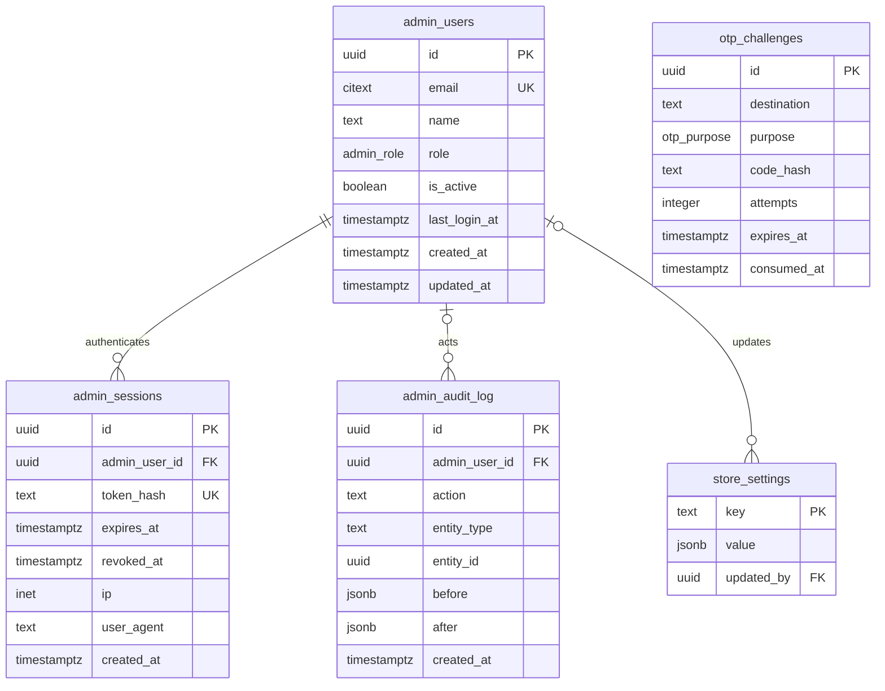
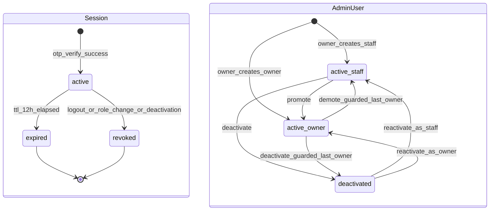

# Module Spec — Admin: Staff, Roles & Audit

> **Scope:** Admin authentication (email OTP, purpose `admin_login`), `admin_sessions` lifecycle (12h, rotation, revocation), the owner⊇staff role matrix, staff management (Phase 2), the append-only `admin_audit_log`, and the exhaustive authz checklist test. Phase 1 (W3–5): admin auth + roles. Phase 2 (W6–8): staff management UI + audit views.
> **Sources of truth:** PROJECT_PLAN.md §3.0 (Contract v1.0.0), §3.14; docs/DATABASE_ERD.md §3.27–3.29; risk-engineering.md Module 10.
> **Owners:** Dev B (admin auth, sessions), Dev D (admin panel routes, staff mgmt UI).

> **Admin UI stack (decision 2026-07-02):** this module's screens are built with **shadcn/ui (new-york, CLI v4) + TanStack Table** — owned source in `apps/web/src/components/ui/`, themed to KAKOA tokens via CSS variables. Standard patterns: TanStack-powered `Table` for lists (server-driven pagination/sort/filter), `DropdownMenu` row actions, `Sheet` for edit panels, **`AlertDialog` (never `Dialog`) for destructive confirmations**, `Command` palette for quick-nav, `Badge` for enum statuses. See PROJECT_PLAN §4.4 and design-system.md for the surface boundary.

---

## 1. Field-Level Specification

### 1.1 Admin OTP request (`POST /api/admin/auth/otp/request`)

| Field | Type | Required | Max length | Format / Validation | Error message on failure |
|---|---|---|---|---|---|
| `email` | string | Yes | 254 | Trim, lowercase, then `^[a-zA-Z0-9._%+-]+@[a-zA-Z0-9.-]+\.[a-zA-Z]{2,}$`. Must be ≤254 chars total, local part ≤64. | "Please enter a valid email address." |

**Anti-enumeration rule:** if the email passes format validation but does not match an **active** `admin_users` row (`is_active = true`), the endpoint still returns a generic `200 { challengeId }` with a decoy `challengeId` (random UUID, no OTP sent, no `otp_challenges` row). Response timing padded to match the send path (constant-time floor ~400ms). The user-facing copy is always: "If this email belongs to an admin account, a code has been sent."

### 1.2 Admin OTP verify (`POST /api/admin/auth/otp/verify`)

| Field | Type | Required | Max length | Format / Validation | Error message on failure |
|---|---|---|---|---|---|
| `challengeId` | string (uuid) | Yes | 36 | `^[0-9a-f]{8}-[0-9a-f]{4}-[0-9a-f]{4}-[0-9a-f]{4}-[0-9a-f]{12}$` | "This code has expired. Request a new one." (never reveal whether the challenge exists) |
| `code` | string | Yes | 6 | `^\d{6}$` — exactly 6 digits, no whitespace (trim before match) | "Incorrect code. {attemptsLeft} attempts remaining." |

Verification logic: `sha256(code || OTP_PEPPER)` compared to `otp_challenges.code_hash` using constant-time comparison; atomic consume (`UPDATE ... SET consumed_at = now() WHERE id = $1 AND consumed_at IS NULL AND expires_at > now() AND attempts < 5 RETURNING *`). Wrong code increments `attempts` atomically. TTL 10 minutes. 5th failed attempt → challenge dead → `410 OTP_EXPIRED`.

### 1.3 Create admin user (`POST /api/admin/users`, owner only)

| Field | Type | Required | Max length | Format / Validation | Error message on failure |
|---|---|---|---|---|---|
| `email` | string | Yes | 254 | Same email regex as §1.1; lowercased; must not already exist (citext unique) | "Please enter a valid email address." / "An admin with this email already exists." |
| `name` | string | Yes | 100 | Trim; 2–100 chars; `^[\p{L}\p{M}][\p{L}\p{M} .'-]{1,99}$` (Unicode letters, spaces, `.`, `'`, `-`); control chars stripped | "Name must be 2–100 characters and contain only letters, spaces, and . ' -" |
| `role` | enum | Yes | — | Exactly `'owner'` or `'staff'` (zod enum, `.strict()` schema rejects unknown keys) | "Role must be either owner or staff." |

### 1.4 Update admin user (`PATCH /api/admin/users/[id]`, owner only)

| Field | Type | Required | Max length | Format / Validation | Error message on failure |
|---|---|---|---|---|---|
| `role` | enum | No | — | `'owner'` \| `'staff'`. Demoting the last active owner blocked (see logic below). | "Cannot demote the last active owner. Promote another owner first." |
| `isActive` | boolean | No | — | `true`/`false` only. Deactivating the last active owner blocked. | "Cannot deactivate the last active owner. Promote another owner first." |
| `name` | string | No | 100 | Same rule as §1.3 | Same as §1.3 |

**Last-owner guard (exact logic, runs inside the update transaction with `SELECT ... FOR UPDATE` on the target row):**

```
IF (request demotes role owner→staff OR sets is_active=false on an owner)
AND (SELECT count(*) FROM admin_users
     WHERE role = 'owner' AND is_active = true AND id <> $target_id) = 0
THEN reject 422 VALIDATION_ERROR "Cannot deactivate or demote the last active owner."
```

### 1.5 Logout-all (`POST /api/admin/users/[id]/logout-all` semantics via PATCH side-effect + explicit action)

| Field | Type | Required | Validation | Error message |
|---|---|---|---|---|
| — (no body) | — | — | Staff may target only their own id; owner may target any admin. | "You can only log out your own sessions." (403 `FORBIDDEN`) |

### 1.6 Audit log query (`GET /api/admin/audit?entityType=&entityId=&actorId=&page=`)

| Field | Type | Required | Validation | Error message |
|---|---|---|---|---|
| `entityType` | string | No | `^[a-z_]{1,50}$` | "Invalid entity type filter." |
| `entityId` | uuid | No | UUID regex (§1.2) | "Invalid entity id." |
| `actorId` | uuid | No | UUID regex | "Invalid actor id." |
| `page` | integer | No | `^\d{1,4}$`, 1–1000, default 1 | "Invalid page number." |

---

## 2. Workflow / User Flow

### 2.1 Admin OTP login

1. Admin opens `/admin/login`, enters email, submits.
2. Server validates format (fail → inline error, no request sent upstream).
3. Server checks Class C limits by counting `otp_challenges` rows for `(destination, purpose='admin_login')`: 1/60s, 3/10min, 10/day per email; 20/hr per IP. Exceeded → `429 RATE_LIMITED` + `Retry-After`; UI shows countdown.
4. If email is an active admin: insert `otp_challenges` row (channel `email`, purpose `admin_login`, 6-digit code, `sha256(code||pepper)`, TTL 10 min), send via Resend. If Resend fails → `502 UPSTREAM_ERROR` ("We couldn't send the code. Try again in a minute."). If email is NOT an active admin: return decoy 200 (§1.1). Either way the UI advances to the code screen.
5. Admin enters 6-digit code. Server atomically consumes the challenge.
   - Wrong code → `401 OTP_INCORRECT` with `details.attemptsLeft`; UI shows "Incorrect code. N attempts remaining."
   - Expired / consumed / 5 attempts spent → `410 OTP_EXPIRED`; UI returns to email step.
6. On success: create `admin_sessions` row — random 256-bit token, store `sha256(token)` in `token_hash`, `expires_at = now() + 12h`, capture `ip` + `user_agent`. Set cookie `kakoa_admin` (HttpOnly, Secure, SameSite=Lax, path-scoped to `/admin` + `/api/admin`, Max-Age 12h). Update `admin_users.last_login_at`.
7. Write `admin_audit_log` row `{action: 'admin.login', entity_type: 'admin_user', entity_id: self}` and enqueue **owner notification email** ("New admin login: {name}, {IST time}, IP {ip}") via Resend/Inngest to all active owners (skipped when the logger-in is the sole owner logging into their own account — still audited).
8. Redirect to `/admin` dashboard.

### 2.2 Staff management (Phase 2)

1. Owner opens Staff settings → list of admins (name, email, role, active, last login IST).
2. Owner invites: POST creates the `admin_users` row (no password — invitee logs in via OTP), audit row `admin_user.create`, notification email to invitee.
3. Owner changes role or deactivates: last-owner guard checked in-tx; on success **all** target's `admin_sessions` are revoked (`revoked_at = now()`) in the same transaction, COD claims held by the target auto-release, audit row written, owner-notification email fired for role changes.
4. Deactivation is soft (`is_active = false`) — never a DELETE; audit rows keep the actor FK.



---

## 3. System Design



**Per-request auth middleware (every `/api/admin/*` request):** read `kakoa_admin` cookie → `sha256(token)` → single indexed lookup on `admin_sessions.token_hash` joined to `admin_users` → reject unless `revoked_at IS NULL AND expires_at > now() AND admin_users.is_active = true`. This is a **DB-backed session check on every request** — never JWT-only — so revocation on role change/deactivation takes effect within one request.

**External dependencies & failure behavior:**

| Dependency | Used for | When down / timing out |
|---|---|---|
| Resend (email) | OTP delivery, owner notifications | OTP request → `502 UPSTREAM_ERROR`, "We couldn't send the code. Try again in a minute."; the `otp_challenges` row is still counted against rate limits only if the send succeeded (insert after send-accept, or delete on synchronous failure). Owner notifications go through Inngest with retries — login itself NEVER blocks on notification delivery. Timeout: 5s on the Resend call. |
| Inngest | Owner-notification fan-out, session-cleanup cron | If Inngest enqueue fails, log structured error + continue (login succeeds); a sweep job retries undelivered notification events. |
| Postgres (Supabase Mumbai) | Everything | Hard dependency — 500 `INTERNAL`; no degraded mode for admin auth. |

**Caching strategy:** **none.** Sessions and roles must be live for immediate revocation (the core security property of this module); audit reads are low-volume admin views. All admin API responses send `Cache-Control: no-store`.

---

## 4. Database Schema

Reproduced verbatim from docs/DATABASE_ERD.md §3.27–3.29 (Contract §1.26). Enum: `admin_role` = `'owner' | 'staff'`.

### `admin_users` (ERD §3.27)

Passwordless admin (email OTP, purpose `admin_login`) with two roles.

| Column | Type | Constraints | Notes |
|---|---|---|---|
| `id` | `uuid` | `PRIMARY KEY DEFAULT gen_random_uuid()` | |
| `email` | `citext` | `NOT NULL UNIQUE` | |
| `name` | `text` | `NOT NULL` | |
| `role` | `admin_role` | `NOT NULL DEFAULT 'staff'` | |
| `is_active` | `boolean` | `NOT NULL DEFAULT true` | |
| `last_login_at` | `timestamptz` | | |
| `created_at` | `timestamptz` | `NOT NULL DEFAULT now()` | |
| `updated_at` | `timestamptz` | `NOT NULL DEFAULT now()` | |

### `admin_sessions` (ERD §3.28)

Separate session table from customers — different cookie, different lifetime (12h).

| Column | Type | Constraints | Notes |
|---|---|---|---|
| `id` | `uuid` | `PRIMARY KEY DEFAULT gen_random_uuid()` | |
| `admin_user_id` | `uuid` | `NOT NULL REFERENCES admin_users(id) ON DELETE CASCADE` | |
| `token_hash` | `text` | `NOT NULL UNIQUE` | |
| `expires_at` | `timestamptz` | `NOT NULL` | |
| `revoked_at` | `timestamptz` | | |
| `ip` | `inet` | | |
| `user_agent` | `text` | | |
| `created_at` | `timestamptz` | `NOT NULL DEFAULT now()` | |

### `admin_audit_log` (ERD §3.29)

Audit log records every mutating admin action for a 5-person team's accountability.

| Column | Type | Constraints | Notes |
|---|---|---|---|
| `id` | `uuid` | `PRIMARY KEY DEFAULT gen_random_uuid()` | |
| `admin_user_id` | `uuid` | `REFERENCES admin_users(id) ON DELETE SET NULL` | |
| `action` | `text` | `NOT NULL` | `'order.transition'`, `'refund.initiate'`, `'product.update'`, ... |
| `entity_type` | `text` | `NOT NULL` | |
| `entity_id` | `uuid` | | |
| `before` | `jsonb` | | |
| `after` | `jsonb` | | |
| `created_at` | `timestamptz` | `NOT NULL DEFAULT now()` | |

```sql
CREATE INDEX admin_audit_entity_idx ON admin_audit_log (entity_type, entity_id, created_at DESC);
```

**Append-only enforcement (migration):** the application DB role is granted `SELECT, INSERT` only on `admin_audit_log` — **no `UPDATE` or `DELETE` grants**. Deactivation of admins is soft; audit rows survive with `admin_user_id` set to NULL only if a row were ever hard-deleted (`ON DELETE SET NULL`, never CASCADE).

Shared infra used (owned by Auth module, ERD §3.8): `otp_challenges` with `purpose = 'admin_login'`, `channel = 'email'` — no FKs by design; rate limits enforced by counting rows there.



---

## 5. API Design

Envelope per Contract §2.1 (`{ ok: true, data } | { ok: false, error: { code, message, details? } }`). Common codes (400 `VALIDATION_ERROR`, 401 `UNAUTHORIZED`, 403 `FORBIDDEN`, 429 `RATE_LIMITED`, 500 `INTERNAL`) apply everywhere and are not repeated. Rate class **E (600/min per admin session)** unless noted.

### `POST /api/admin/auth/otp/request` — public, **Class C**

Request: `{ email: string }`
Response 200: `{ challengeId: string }` (generic 200 even for unknown/inactive emails — anti-enumeration)
Errors: `429 RATE_LIMITED` (Class C breach, `Retry-After`); `502 UPSTREAM_ERROR` (Resend down).
Idempotency: repeat request within the 60s window → 429 (the 1/60s bucket is the dedupe).

### `POST /api/admin/auth/otp/verify` — public

Request: `{ challengeId: string, code: string }`
Response 200: `Set-Cookie: kakoa_admin=...; { admin: { id, name, role } }`
Errors: `401 OTP_INCORRECT` (`details: { attemptsLeft }`); `410 OTP_EXPIRED` (expired, already consumed, or 5 attempts spent).
Idempotency: atomic consume — replay of a correct code after consumption → `410 OTP_EXPIRED` (never a second session from one challenge).

### `POST /api/admin/auth/logout` — auth `admin:staff`

Request: `{}` → Response 200: `{}`. Sets `revoked_at = now()` on the current session, clears cookie. Idempotent (already-revoked → 200).

### `GET /api/admin/users` — auth `admin:owner`

Response 200: `{ admins: { id, email, name, role, isActive, lastLoginAt, createdAt }[] }`
Errors: `403 FORBIDDEN` for staff.

### `POST /api/admin/users` — auth `admin:owner`

Request: `{ email: string, name: string, role: 'owner' | 'staff' }`
Response 201: `{ admin }`
Errors: `409 CONFLICT` (email already exists, incl. deactivated — message points to reactivation); `403 FORBIDDEN` (staff caller).
Side effects: audit `admin_user.create`; invite email to new admin.

### `PATCH /api/admin/users/[id]` — auth `admin:owner`

Request: `{ role?: 'owner' | 'staff', isActive?: boolean, name?: string }` (`.strict()`)
Response 200: `{ admin }`
Errors: `404 NOT_FOUND`; `422 VALIDATION_ERROR` — **cannot deactivate or demote the last active owner** (message per §1.4); `403 FORBIDDEN` (staff caller).
Side effects on role change or deactivation, all in one transaction: revoke ALL target's `admin_sessions` (`revoked_at = now()`), auto-release target's COD claims, audit `admin_user.update` with `before`/`after`, owner-notification email on role changes.
Idempotency: PATCH to current values is a no-op 200 (no audit row for no-diff).

### `POST /api/admin/users/[id]/logout-all` — auth `admin:staff` (own id) / `admin:owner` (any id)

Request: `{}` → Response 200: `{ revokedCount: number }`
Errors: `403 FORBIDDEN` (staff targeting another admin); `404 NOT_FOUND`.
The caller's current session is also revoked when targeting self ("panic button"); audit `admin_user.logout_all`.

### `GET /api/admin/audit?entityType=&entityId=&actorId=&page=` — auth `admin:owner`

Response 200: `{ entries: { id, adminUserId, actorName, action, entityType, entityId, before, after, createdAt }[], page, pageSize: 50, total }`
Errors: `403 FORBIDDEN` (staff — audit reads are owner-only since they include PII-bearing diffs).
There is deliberately **no write API** for the audit log: rows are inserted only by server-side mutation code paths, in the same transaction as the mutation.

### Owner-only route registry (authz reference — enforced per-route server-side)

`admin:owner` required: refunds (`POST /api/admin/orders/[id]/refunds`), coupons CRUD (`GET/POST /api/admin/coupons`, `PATCH/DELETE /api/admin/coupons/[id]`), staff management (`GET/POST /api/admin/users`, `PATCH /api/admin/users/[id]`), store settings edit, CSV exports (`GET /api/admin/orders/export`, 5/hour), above-threshold approvals (refunds > ₹5,000 = 500000 paise, config in `store_settings`; flagged-refund approvals), logout-all for *other* admins, audit-log reads. Everything else is `admin:staff` (owner ⊇ staff).

---

## 6. Security Standards

- **Rate limits (exact):** OTP request = **Class C**: 1/60s + 3/10min + 10/day per destination email; 20/hr per IP; verify capped at 5 attempts per challenge then `410`. All other admin routes = **Class E**: 600/min per admin session. Exports = 5/hour per owner. Headers on every limited response: `X-RateLimit-Limit`, `X-RateLimit-Remaining`, `X-RateLimit-Reset`; 429 adds `Retry-After`. OTP limits are enforced authoritatively by counting `otp_challenges` rows in the DB, not just middleware buckets.
- **Session policy:** 12h absolute lifetime; token = 256-bit CSPRNG, only `sha256(token)` stored; cookie `kakoa_admin` HttpOnly + Secure + SameSite=Lax, path-scoped to `/admin` and `/api/admin`; **session rotation on privilege change** (self role change → new session issued, old revoked); **immediate revocation** on role change/deactivation — DB session check per request, never JWT-only; owner "log out all sessions" panic button.
- **Input sanitization:** zod `.strict()` on every body (unknown keys rejected → 400 `VALIDATION_ERROR` with `fieldErrors`); Drizzle parameterized queries only; emails lowercased/trimmed before citext lookup; names stripped of control characters; all customer-authored content rendered in admin views is output-encoded (the admin browser is a stored-XSS target — risk-engineering Module 10 #11).
- **Authorization:** per-route role middleware + per-action assertion; owner ⊇ staff; UI hiding is cosmetic — the server check is the guarantee. The exhaustive authz checklist test (§9) is the enforcement proof; adding a route without extending it fails CI via route-manifest diff.
- **Encryption at rest:** Supabase disk encryption suffices; no additional column crypto needed here (no card data, no customer bank details in this module). OTP codes stored only as peppered hashes (`OTP_PEPPER` in env, never in DB).
- **NEVER logged:** raw OTP codes, raw session tokens, the `OTP_PEPPER`, full `Set-Cookie` values. Loggable: `admin.login {actor, ip}`, challenge ids, hashed tokens, audit diffs.
- **OWASP risks specific to this module:**
  - *A01 Broken Access Control* — staff calling owner-only routes directly (curl). Mitigation: server-side role check on every route + exhaustive negative-test matrix.
  - *A07 Identification & Auth Failures* — OTP brute force. Mitigation: 5-attempt atomic cap, 10-min TTL, Class C send limits, constant-time hash compare, decoy responses against enumeration.
  - *A09 Logging Failures* — tampered audit trail. Mitigation: append-only grants (no UPDATE/DELETE for the app role), audit insert in the same transaction as the mutation, audit-write failure fails the mutation.
  - *CSRF* — SameSite=Lax cookie + Route Handlers requiring JSON content type + origin check on state-changing admin routes.

---

## 7. Edge Cases

1. **Privilege escalation via direct API.** Staff crafts a `PATCH /api/admin/users/[id]` or refund/coupon/export request with a valid staff session → `403 FORBIDDEN` on every owner-only route; covered by the exhaustive checklist test, not ad-hoc per-route tests.
2. **Last-owner lockout.** `PATCH` deactivating or demoting the only active owner → `422` with "Cannot deactivate or demote the last active owner." Checked under `SELECT ... FOR UPDATE`; two concurrent demotions of the two last owners cannot both succeed — the second sees zero remaining owners and gets 422.
3. **Role change race with an in-flight request.** Owner demotes a staff member while that staff member's browser has a request mid-flight. The demotion transaction revokes sessions first; any request arriving after commit fails the per-request DB session check (401). No JWT grace window exists.
4. **Owner removes a staff member with in-flight COD claims.** Deactivation auto-releases the target's claimed COD queue rows and revokes sessions in the same transaction; audit rows keep the actor id (FK `SET NULL`, user row soft-deactivated, never deleted).
5. **Email enumeration on the login form.** Unknown or deactivated email gets the identical generic 200 + decoy challengeId with padded timing; verify against a decoy challenge always returns `410 OTP_EXPIRED` (indistinguishable from a stale real challenge).
6. **OTP replay / double-verify.** Correct code submitted twice (double-click, retry) — atomic consume guarantees exactly one session; second verify → `410 OTP_EXPIRED`.
7. **Deactivated admin still holding a valid-looking cookie.** `is_active = false` is part of the per-request session join — the very next request is 401 even if `expires_at` and `revoked_at` would pass.
8. **Re-inviting a previously deactivated admin.** `POST /api/admin/users` with an email that exists as a deactivated row → `409 CONFLICT` with guidance to reactivate via PATCH (preserves the audit actor history under one id — no duplicate identities).
9. **Audit write failure mid-mutation.** Any mutation path that cannot write its `admin_audit_log` row must roll back the whole transaction and return 500 — a mutation without an audit row must be impossible (proven by the audit meta-test).
10. **Shared/lost device.** Owner uses "log out all sessions" (all admins); staff can panic-logout their own sessions only; every new admin login triggers an owner-notification email with IST timestamp and IP, so an unexpected login is visible within minutes.
11. **Clock-edge session expiry.** Session with `expires_at` exactly `now()` is invalid (`expires_at > now()` strict); a 12h session issued at 9:00 AM IST dies at 9:00 PM IST regardless of activity — no sliding renewal (deliberate: bounded exposure).
12. **Login-notification spam as harassment.** Attacker repeatedly requests OTPs for a known admin email: Class C caps at 10/day per destination; notification email fires only on *successful* login, so failed floods never spam the owner — they show up in the failed-admin-login-spike alert instead.

---

## 8. State Machine

### Admin session lifecycle

States: `active`, `expired`, `revoked`.

| From | To | Trigger |
|---|---|---|
| (none) | active | Successful OTP verify → session row created, 12h TTL |
| active | expired | `expires_at` passes (12h) — lazy: detected at next request; nightly cron deletes rows expired > 30 days |
| active | revoked | Explicit logout; logout-all; role change on the user; user deactivated; session rotation on privilege change |

`expired` and `revoked` are terminal — a session is never resurrected; re-login creates a new row.

### Admin user lifecycle

States: `active_staff`, `active_owner`, `deactivated`.

| From | To | Trigger | Guard |
|---|---|---|---|
| (none) | active_staff / active_owner | Owner creates via POST /api/admin/users | — |
| active_staff | active_owner | Owner promotes | — |
| active_owner | active_staff | Owner demotes | Not the last active owner (422) |
| active_staff / active_owner | deactivated | Owner sets isActive=false | Owner: not the last active owner (422) |
| deactivated | active_staff / active_owner | Owner reactivates | — |



---

## 9. Testing Requirements

**Unit (`packages/core` + admin lib):**
- Role→permission matrix: table-driven, exhaustive over every defined admin capability × {staff, owner} — the matrix in §5 encoded as data, test asserts every cell.
- Last-owner guard predicate: {1 owner demote, 1 owner deactivate, 2 owners concurrent demote, 0-owner impossible state, deactivated owners don't count}.
- OTP: code regex `^\d{6}$`; peppered hash determinism; attempts cap at exactly 5; TTL boundary (9:59 vs 10:01).
- Email validation regex against fixtures (valid, >254 chars, missing TLD, uppercase → lowercased citext match).
- Session expiry predicate strict at the 12h boundary; token hash uniqueness.

**Integration (ephemeral Postgres):**
- **The exhaustive authz checklist test** — every `/api/admin/*` route × {unauthenticated, staff session, owner session} → exact expected status (401 / 403 / 2xx-or-domain-error). A route manifest is diffed against the test's route list; a new route not present in the checklist fails CI.
- **Audit meta-test** — every admin mutation route invoked once; assert exactly one `admin_audit_log` row with correct `{admin_user_id, action, entity_type, before, after}`; any mutating route with zero audit rows fails.
- Append-only proof: attempt `UPDATE`/`DELETE` on `admin_audit_log` as the app DB role → permission denied.
- Session revocation on role change effective on the *next* request (change role in tx A, request with old session → 401).
- Last-owner deactivation and demotion → 422; concurrent two-owner demotion race → exactly one 422.
- OTP atomic consume under concurrency: two parallel verifies with the correct code → one 200 + one 410.
- Class C limit enforcement by DB row-count (4th request in 10 min → 429 even if middleware bucket was reset).
- Anti-enumeration: unknown email response shape/status identical to known-email response.

**E2E (Playwright):**
1. *Admin login + owner notification:* staff logs in via email OTP → lands on dashboard → owner's mailbox (mock Resend) receives "New admin login" with name, IST time, IP → audit log shows `admin.login`.
2. *Role enforcement:* staff attempts an owner-only refund via UI (button absent) AND via direct API call (403) → owner completes the same refund successfully → audit shows the owner as actor.
3. *Staff offboarding:* owner deactivates a staff member who has an active session and a claimed COD row → staff's very next click lands on the login page (401) → COD claim visibly released in a second session → attempt to deactivate the last owner shows the 422 message inline.

---

## 10. Definition of Done

- [ ] Exhaustive authz checklist test green: every `/api/admin/*` route × {unauthenticated, staff, owner}, with CI route-manifest diff so new routes cannot skip it
- [ ] Append-only audit proven: no UPDATE/DELETE grants on `admin_audit_log` (permission-denied test green); audit meta-test green — every mutation writes its row in-tx; audit-write failure fails the mutation
- [ ] Admin OTP login on Class C limits (1/60s + 3/10min + 10/day per email, 20/hr/IP, 5 verify attempts → 410), anti-enumeration decoy path verified, codes peppered-hashed, never logged
- [ ] Session policy live: 12h lifetime, DB-checked per request, rotation on privilege change, revocation within one request on role change/deactivation, logout-all (staff: own; owner: all)
- [ ] Role matrix enforced server-side per route: owner-only = refunds, coupons CRUD, staff mgmt, store settings, exports, >₹5,000 refund threshold approvals, audit reads
- [ ] Last-owner guard (422) tested including the concurrent-demotion race; staff removal auto-releases COD claims and revokes sessions in one transaction
- [ ] New-admin-login owner notification email firing via Inngest with IST timestamp + IP; failed-login-spike and role-change alerts wired
- [ ] Cookie `kakoa_admin` HttpOnly + Secure + SameSite=Lax, path-scoped to `/admin` + `/api/admin`; only token hashes at rest
- [ ] zod `.strict()` on all bodies; error copy matches §1 exactly; all money as `*_paise` integers; timestamps timestamptz UTC, rendered via `formatIST()`
- [ ] Nightly cleanup cron for long-expired sessions and consumed/expired `otp_challenges` (admin purposes) running
- [ ] The 3 E2E scenarios green in CI
