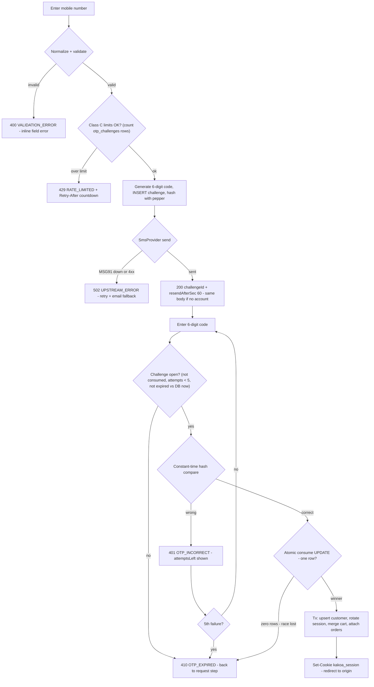
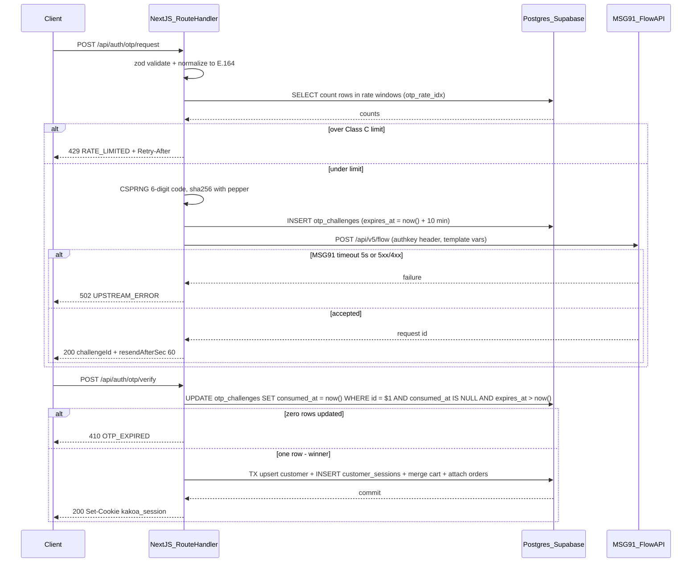
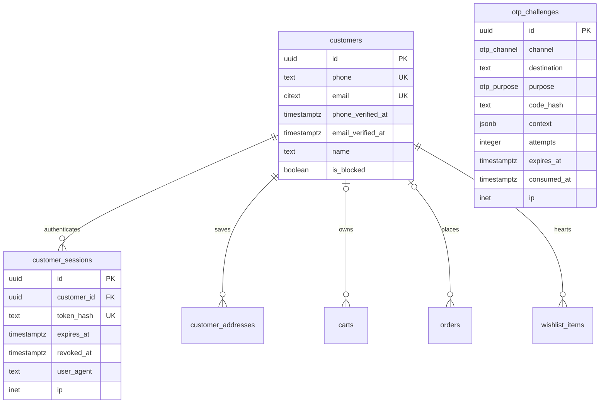
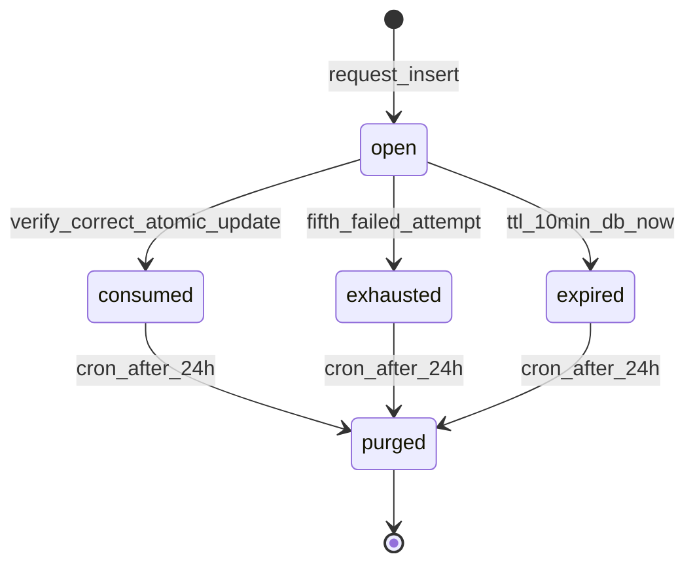

# Module Spec — Customer Authentication: OTP Login (Phase 1)

> **Module owner:** Dev B (Platform, DB & Core Domain) · **Phase:** 1 (W3–5) · **Contract anchors:** §1.6–§1.8, §2.4 · **Plan:** PROJECT_PLAN.md §3.5 · **Risk source:** risk-engineering.md Module 7
>
> Scope of this doc: OTP request/verify, session issue/rotate/revoke, `GET /api/auth/me`, cart merge + guest-order attach on login. Address book, wishlist, and account pages are specced in `accounts.md`; the shared `otp_challenges` infrastructure is reused by COD verification (`cod_verification`), guest order lookup (`order_lookup`), and admin login (`admin_login`) — those purposes are consumed by their own modules but MUST use the same code paths defined here.

---

## 1. Field-Level Specification

### 1.1 `POST /api/auth/otp/request`

| Field | Type | Required | Max length | Format | Validation rule | Error message on failure |
|---|---|---|---|---|---|---|
| `channel` | string enum | yes | 5 | `'sms' \| 'email'` | zod `z.enum(['sms','email'])`; Phase 1 login UI sends `'sms'` only, `'email'` accepted for the email-verify flow | "Choose how you'd like to receive your code." |
| `destination` | string | yes | 254 | phone (sms) or email (email) | See normalization below. After normalization must match `^\+91[6-9][0-9]{9}$` (sms) or `z.string().email().toLowerCase()` ≤254 chars (email) | sms: "Enter a valid 10-digit Indian mobile number." · email: "Enter a valid email address." |
| `purpose` | string enum | yes | 14 | `'customer_login'` | zod `z.literal('customer_login')` on this route — other purposes are rejected here and only accepted by their owning endpoints | "Something went wrong — please refresh and try again." (`VALIDATION_ERROR`; a client never legitimately sends another purpose) |

**Phone normalization (applied before the regex, in `packages/core/src/phone.ts`):**

1. Strip every character matching `[\s\-\(\)\.]` (spaces, dashes, parens, dots).
2. If result matches `^0[6-9][0-9]{9}$` → drop the leading `0`.
3. If result matches `^91[6-9][0-9]{9}$` → prefix `+`.
4. If result matches `^[6-9][0-9]{9}$` → prefix `+91`.
5. Result MUST now match **`^\+91[6-9][0-9]{9}$`** (E.164, Indian mobile: series 6–9 only). Anything else → 400 `VALIDATION_ERROR` with the message above.

Examples: `98765 43210` → `+919876543210` ✓ · `098765-43210` → `+919876543210` ✓ · `+91 5876543210` → ✗ (series 5) · `9876543` → ✗ (short).

The **normalized** value is what is stored in `otp_challenges.destination`, matched against `customers.phone`, and counted for rate limits — so `98765 43210` and `+919876543210` share one rate bucket.

### 1.2 `POST /api/auth/otp/verify`

| Field | Type | Required | Max length | Format | Validation rule | Error message on failure |
|---|---|---|---|---|---|---|
| `challengeId` | string | yes | 36 | uuid | zod `z.string().uuid()` | "This code has expired — request a new one." (treated as unknown challenge → same as 410 path; no oracle for malformed vs missing) |
| `code` | string | yes | 6 | 6 digits | `^[0-9]{6}$` after trimming whitespace; leading zeros significant (`042917` is valid and distinct) | "Enter the 6-digit code we sent you." |

All request schemas use zod `.strict()` — unknown keys are rejected with 400 `VALIDATION_ERROR` and `fieldErrors` from `flatten()`.

### 1.3 OTP code generation (server-side, never a request field)

- 6 decimal digits from CSPRNG (`crypto.randomInt(0, 1000000)` zero-padded to 6 — rejection-sampled by Node, **no modulo bias**). Full space `000000`–`999999`.
- Stored only as `code_hash = sha256(code || OTP_PEPPER)` — hex, lowercase. `OTP_PEPPER` is a ≥32-byte server secret from env, never in the DB, rotated only with a documented dual-check window.
- TTL: `expires_at = now() + interval '10 minutes'` computed **in the INSERT by Postgres**, and checked against DB `now()` at consume — the app clock is never an authority.
- Test mode (`OTP_TEST_MODE=1`, non-prod only): fixed code `000000`, `SmsProvider` is the in-memory fake; Playwright depends on this.

### 1.4 Session token (issued by verify, never a request field)

- 32 random bytes (`crypto.randomBytes(32)`) → base64url = 43-char opaque token. DB stores `sha256(token)` hex in `customer_sessions.token_hash`; raw token exists only in the `Set-Cookie` header.
- Cookie: `kakoa_session=<token>; HttpOnly; Secure; SameSite=Lax; Path=/; Max-Age=2592000` (30 days). Rolling: any authenticated request within 24h of expiry extends `expires_at` by 30 days, capped at `created_at + 90 days` absolute.

---

## 2. Workflow / User Flow

1. Customer opens the login sheet (header account icon, checkout "Log in" link, or wishlist heart while anonymous) and enters a mobile number.
2. Client normalizes for display only; server normalizes authoritatively (§1.1) → invalid → inline field error, no request logged against rate limits.
3. Server checks Class C limits by **counting `otp_challenges` rows** for the normalized destination (and middleware bucket per IP). Over limit → 429 with `Retry-After`; UI shows countdown "Try again in 4:32".
4. Under limit: generate code (§1.3), INSERT `otp_challenges` row, call `SmsProvider.sendOtp()` (MSG91 Flow API, §3). Provider hard-fails → the challenge row is kept (it still counts toward limits — cost was attempted) and the API returns 502 `UPSTREAM_ERROR`; UI offers retry + email fallback.
5. Success → **always** `200 { challengeId, resendAfterSec: 60 }` — identical body whether or not a `customers` row exists for that phone (no enumeration). UI shows 6-box code entry with masked destination ("+91 98•••••210") and a 60s resend countdown.
6. Customer submits the code. Server loads the challenge, checks `consumed_at IS NULL`, `attempts < 5`, `expires_at > now()` (DB time), then compares `sha256(code||pepper)` to `code_hash` in **constant time** (`crypto.timingSafeEqual`).
   - Wrong code → increment `attempts`; 401 `OTP_INCORRECT` with `details: { attemptsLeft }`. 5th failure → challenge dead; all further verifies (even correct) → 410 `OTP_EXPIRED`.
   - Expired / consumed / unknown id → 410 `OTP_EXPIRED`; UI gates back to request step.
7. Correct code → **atomic consume**: `UPDATE otp_challenges SET consumed_at = now() WHERE id = $1 AND consumed_at IS NULL AND expires_at > now()`. Zero rows updated = a racing request won or clock ran out → 410. One row = winner; continue.
8. In one transaction: upsert `customers` by phone (create on first login, set `phone_verified_at = now()`; `isNewCustomer` flag), **rotate session** (INSERT new `customer_sessions` row — never reuse any pre-auth identifier), **merge guest cart** by the §2.3 Contract merge rules (copy-by-value into the customer's active cart; guest cart → `status='merged'`; cookie rotated), and **attach guest orders** whose normalized `contact_phone` equals the now-verified phone (`orders_phone_idx`).
9. Respond `Set-Cookie kakoa_session` + `{ customer, cartMerged, isNewCustomer }`. UI toasts; if `cartMerged`, "Your cart items were saved"; redirect to origin (checkout step or `/account`).
10. Logout: `POST /api/auth/logout` sets `revoked_at`, clears the cookie; idempotent (already-revoked → still 200 `{}`).



---

## 3. System Design



*(Implementation note: the hash comparison + attempts increment happen before the consume UPDATE; the diagram shows the winning path. A wrong code executes `UPDATE otp_challenges SET attempts = attempts + 1 WHERE id = $1 AND consumed_at IS NULL AND attempts < 5 RETURNING attempts` — zero rows returned means the challenge is already dead → 410.)*

### External dependency: MSG91 (SMS delivery only — never verification)

KAKOA generates, stores (hashed), and verifies OTPs **itself**; MSG91 is purely the delivery pipe. We do NOT use MSG91's hosted verify endpoint (`GET /api/v5/otp/verify`) — our Postgres row is the single source of truth, which is what makes atomic consume, attempt caps, and the no-Redis rate limiting possible.

**Verified against MSG91 docs (docs.msg91.com, msg91.com/help — re-verify exact payload at integration):**

| Item | Value | Status |
|---|---|---|
| Send endpoint (Flow/template SMS) | `POST https://control.msg91.com/api/v5/flow` | verified |
| Auth | `authkey: <MSG91_AUTHKEY>` request **header** (not query param); `Content-Type: application/json` | verified |
| Payload shape | `{ "template_id": "<MSG91 template id>", "recipients": [{ "mobiles": "91XXXXXXXXXX", "otp": "042917" }] }` — `mobiles` is country code **without** `+` (strip the `+` from our E.164); variable key must match the `##otp##` variable name in the MSG91 template | shape verified; exact variable key name **verify at integration** against the created template |
| Alternative | MSG91 Send-OTP API `POST https://control.msg91.com/api/v5/otp?template_id=&mobile=` accepts an `otp` param to deliver a self-generated code | verified as fallback option; not the primary path |
| DLT requirements (India, TRAI) | Sender ID (6-char header) + SMS content template must be pre-registered on a DLT portal; the DLT Template ID is mapped onto the MSG91 template; message content must match the approved DLT template **exactly** (DLT variables `{#var#}` ↔ MSG91 `##otp##`) or delivery silently fails even though the API returns success | verified — DLT registration is a **launch blocker**, start in W3 |
| Delivery reports | webhook or polling for DLR | **verify at integration** — used only for the SMS-spend/delivery-rate alerts, not the auth flow |

**Wrapper:** `SmsProvider` interface in `packages/integrations/src/sms/provider.ts` — `sendOtp({ phoneE164, code, purpose }): Promise<{ providerMessageId: string | null }>`. Implementations: `Msg91SmsProvider` (prod), `FakeSmsProvider` (test mode, records calls, delivers nothing). No file outside `packages/integrations/src/msg91/**` may import MSG91 specifics.

**Failure behavior:**

| Failure | Behavior |
|---|---|
| MSG91 timeout (5s connect+response budget) or 5xx | One immediate retry, then 502 `UPSTREAM_ERROR`. Challenge row stays (counts toward limits). Alert on `UPSTREAM_ERROR` rate. |
| MSG91 4xx (bad authkey, template mismatch) | No retry — config bug. 502 `UPSTREAM_ERROR` to client, page-level alert to ops. |
| MSG91 accepts but SMS never delivered (DLT mismatch, telco) | Invisible to the request path. Detected by the *verify-success rate < 70%* alert; customer remedy = resend after 60s cooldown or email fallback. |
| Email channel (Resend) down | Same contract: 502 `UPSTREAM_ERROR`. |

**Caching:** none. Every read in this module is a correctness-critical single-row lookup (challenge, session) and rate-limit counting must be exact — caching would create verify-after-consume and stale-limit bugs. Session lookup on `GET /api/auth/me` is one indexed unique-key hit per request; acceptable at launch scale, Redis extraction documented as the future path.

---

## 4. Database Schema

DDL verbatim from `docs/DATABASE_ERD.md` §3.6–§3.8 (Contract §1.6–§1.8). Enums from Contract §1.0: `CREATE TYPE otp_channel AS ENUM ('sms','email');` · `CREATE TYPE otp_purpose AS ENUM ('customer_login','cod_verification','order_lookup','admin_login');`

```sql
CREATE TABLE customers (
  id                uuid PRIMARY KEY DEFAULT gen_random_uuid(),
  phone             text UNIQUE CHECK (phone ~ '^\+91[6-9][0-9]{9}$'),
  email             citext UNIQUE,
  phone_verified_at timestamptz,
  email_verified_at timestamptz,
  name              text,
  is_blocked        boolean NOT NULL DEFAULT false,   -- serial-RTO abusers
  created_at        timestamptz NOT NULL DEFAULT now(),
  updated_at        timestamptz NOT NULL DEFAULT now(),
  CHECK (phone IS NOT NULL OR email IS NOT NULL)
);

CREATE TABLE customer_sessions (
  id          uuid PRIMARY KEY DEFAULT gen_random_uuid(),
  customer_id uuid NOT NULL REFERENCES customers(id) ON DELETE CASCADE,
  token_hash  text NOT NULL UNIQUE,
  expires_at  timestamptz NOT NULL,
  revoked_at  timestamptz,
  user_agent  text, ip inet,
  created_at  timestamptz NOT NULL DEFAULT now()
);
CREATE INDEX customer_sessions_customer_idx ON customer_sessions (customer_id) WHERE revoked_at IS NULL;

CREATE TABLE otp_challenges (
  id          uuid PRIMARY KEY DEFAULT gen_random_uuid(),
  channel     otp_channel NOT NULL,
  destination text NOT NULL,                 -- E.164 phone or lowercased email
  purpose     otp_purpose NOT NULL,
  code_hash   text NOT NULL,                 -- sha256(code || pepper)
  context     jsonb,                         -- e.g. {"order_number":"KK-48210"} for order_lookup
  attempts    integer NOT NULL DEFAULT 0 CHECK (attempts <= 5),
  expires_at  timestamptz NOT NULL,
  consumed_at timestamptz,
  created_at  timestamptz NOT NULL DEFAULT now(),
  ip          inet
);
CREATE INDEX otp_open_idx ON otp_challenges (destination, purpose, created_at DESC)
  WHERE consumed_at IS NULL;                 -- partial: hot path only scans open challenges
CREATE INDEX otp_rate_idx ON otp_challenges (destination, created_at);  -- send-rate window counts
```

Notes: `otp_challenges` deliberately has **no FKs** — challenges are keyed by `destination` + `purpose` and can exist before the customer does. Expired rows are hard-deleted by the Inngest purge cron (one of the four hard-delete exceptions in ERD §0). `customer_sessions` rows are never hard-deleted at launch (revoked, then swept after `expires_at + 30d`).



---

## 5. API Design

All four are **Route Handlers** (Contract §2.4 rule: OTP endpoints are called by non-React clients and need uniform curl-ability). Every response uses the `ApiResult<T>` envelope; Class C responses carry `X-RateLimit-Limit` / `X-RateLimit-Remaining` / `X-RateLimit-Reset`, and 429 adds `Retry-After`.

### 5.1 `POST /api/auth/otp/request` — public · Class C

Request (zod `.strict()`):
```ts
{ channel: 'sms' | 'email'; destination: string; purpose: 'customer_login' }
```
Response `200` — **byte-identical whether or not an account exists**:
```ts
{ ok: true, data: { challengeId: string; resendAfterSec: 60 } }
```
| Status | Code | When | User-facing `message` |
|---|---|---|---|
| 400 | `VALIDATION_ERROR` | regex/schema failure (per-field messages in §1.1 via `fieldErrors`) | "Enter a valid 10-digit Indian mobile number." |
| 429 | `RATE_LIMITED` | any Class C window exceeded: 1/60s, 3/10min, 10/day per destination; 20/hr per IP | "Too many requests — try again in {Retry-After}." |
| 502 | `UPSTREAM_ERROR` | MSG91/Resend down or rejecting | "Couldn't send the code — try again shortly." |
| 500 | `INTERNAL` | unexpected | "Something went wrong on our side." |

Idempotency: not idempotent by design — each call is a new challenge + SMS. The 1/60s window is the dedupe: a double-tap inside 60s gets 429, and the UI disables the button until `resendAfterSec` elapses. Issuing a new challenge does NOT invalidate the previous one (both remain verifiable until TTL/attempts kill them) — matches `otp_open_idx` supporting multiple open rows.

### 5.2 `POST /api/auth/otp/verify` — public · Class C (attempt-limited)

Request: `{ challengeId: string; code: string }` (zod `.strict()`, `code ^[0-9]{6}$`).

Response `200` (+ `Set-Cookie: kakoa_session=…; HttpOnly; Secure; SameSite=Lax; Path=/; Max-Age=2592000`):
```ts
{ ok: true, data: {
    customer: { id: string; name: string | null; phone: string; email: string | null };
    cartMerged: boolean;      // guest cart lines folded in during this verify
    isNewCustomer: boolean }} // customers row created by this verify
```
| Status | Code | When | `message` / `details` |
|---|---|---|---|
| 400 | `VALIDATION_ERROR` | malformed code (not 6 digits) | "Enter the 6-digit code we sent you." |
| 401 | `OTP_INCORRECT` | hash mismatch, attempts now < 5 | "Incorrect code — {attemptsLeft} attempts left." · `details: { attemptsLeft: number }` |
| 410 | `OTP_EXPIRED` | expired vs DB `now()`, already consumed, 5 attempts exhausted, unknown/malformed challengeId, or atomic-consume race lost | "This code has expired — request a new one." (identical for all five causes — no oracle) |
| 500 | `INTERNAL` | tx failure after consume (see Edge Case 8) | "Something went wrong — request a new code." |

Idempotency: single-winner by construction — the consume UPDATE guarantees at most one session per challenge; a replayed verify gets 410, never a second cookie.

### 5.3 `POST /api/auth/logout` — customer · no rate class

Request: empty body. Response `200 { ok: true, data: {} }` + `Set-Cookie` clearing `kakoa_session` (Max-Age=0). Sets `revoked_at = now()` on the session row. **Idempotent:** revoked/expired/absent session still returns 200 and clears the cookie (logout must never fail visibly).

### 5.4 `GET /api/auth/me` — customer · no rate class

Response `200`:
```ts
{ ok: true, data: { customer: { id: string; name: string | null; phone: string | null;
    email: string | null; phoneVerifiedAt: string | null; emailVerifiedAt: string | null;
    createdAt: string } } }   // timestamps ISO-8601 UTC; UI renders via formatIST()
```
| Status | Code | When |
|---|---|---|
| 401 | `UNAUTHORIZED` | no cookie, token hash not found, `revoked_at` set, or `expires_at <= now()` — all indistinguishable |

Side effect: implements the rolling extension (§1.4) when within 24h of expiry. `is_blocked` customers still authenticate and see their history (block gates COD eligibility, not login).

---

## 6. Security Standards

- **Rate limits (Class C, Contract §2.1):** request — **1/60s + 3/10min + 10/day per destination; 20/hr per IP**. Verify — **5 attempts per challenge, then 410**. Per-destination windows are enforced **authoritatively by counting `otp_challenges` rows** (`otp_rate_idx`) inside the request transaction — the middleware token bucket (per-IP) is the first gate, Postgres is the truth (single deployable, no Redis at launch; extraction point documented). CAPTCHA (Turnstile) escalation once an IP crosses 10 requests/hr — before the hard 20/hr cutoff.
- **Input sanitization:** zod `.strict()` on every body; phone normalized then regex-anchored; email lowercased via `citext` semantics; `code` digits-only. All SQL through Drizzle parameterization — the destination string never enters SQL as text. Customer `name` (set later via profile) is output-encoded everywhere rendered, **including the admin panel** (stored-XSS-via-name targets the admin's browser).
- **Authz:** `customer` tier = cookie → `sha256(token)` lookup in `customer_sessions` with `revoked_at IS NULL AND expires_at > now()` — revocable server-side state, deliberately not JWT-only. Session rotation on **every** auth event; guest cart copied by value, never re-parented (fixation defense). Cookies `HttpOnly; Secure; SameSite=Lax`.
- **Encryption at rest:** Supabase disk encryption covers PII (phone/email). App-level: OTP codes exist only as peppered SHA-256; session tokens only as SHA-256; `OTP_PEPPER` and `MSG91_AUTHKEY` in env secrets only. No column-level encryption needed at launch (documented decision).
- **NEVER logged:** raw OTP codes, raw session tokens/cookie values, `OTP_PEPPER`, `MSG91_AUTHKEY`, raw phone numbers, raw emails. Structured logs use `identifier_hash = sha256(destination)` and `ua_hash`; a CI grep/lint gate fails the build on raw-PII log patterns.
- **No-enumeration invariant:** `otp/request` returns identical 200 bodies for existing vs non-existing customers; all 410 causes on verify share one message; `me` 401s are indistinguishable. Timing: hash comparison is `timingSafeEqual`; request path does not branch on customer existence before responding.
- **OWASP specifics:** A07 Identification/Auth failures → attempt caps + atomic consume + rotation (above). A04 Insecure design / cost abuse → SMS-spend daily alert is the attack detector for resend spray. A01 Broken access control → forged-ID negative-test checklist (§9). A09 Logging failures → hashed-identifier structured events `auth.otp_requested/verified/failed/locked`, `session.created/rotated/revoked`. CSRF: state-changing auth routes accept JSON only (no form content-types), `SameSite=Lax` cookie, and origin-header check in middleware.
- **Residual risks (documented, accepted):** SIM-swap — an attacker controlling the victim's number IS the phone identity in an OTP-only scheme; mitigated at the blast radius (no stored payment instruments, COD abuse gated by `is_blocked`, address changes notify via email when on file). Recycled numbers — >18 months inactivity forces re-verification with masked order history until email co-verification (when email on file); risk register entry AUTH-R1.

---

## 7. Edge Cases

1. **Brute force across the 10⁶ space.** 5 attempts per challenge (410 after), 3 challenges/10min per destination → max 15 guesses per 10 min ≈ 0.0015% success. Constant-time compare; alert fires on distributed spray signature (many destinations, one IP block).
2. **Resend abuse = SMS cost attack.** Attacker sprays random numbers; KAKOA pays MSG91 per SMS. 60s cooldown + 10/day/destination + 20/hr/IP + CAPTCHA escalation; **daily SMS spend > budget pages a human** — cost anomaly is the primary detector. Burns real money on day one if missing.
3. **Clock skew at expiry.** TTL is computed (`now() + interval '10 minutes'` in the INSERT) and enforced (`expires_at > now()` in the consume UPDATE) entirely on DB time — a Vercel function's `Date.now()` is never consulted. Boundary integration tests at expiry ±1s.
4. **Concurrent verify race, both with the correct code.** Both pass the hash check; the atomic consume UPDATE admits exactly one — loser gets zero rows → 410 `OTP_EXPIRED`. Never two sessions from one challenge (integration-tested with parallel requests).
5. **Phone number recycling (real in India).** Telco reassigns the number; the new owner OTPs in and would inherit the previous owner's orders/addresses. Mitigation: >18 months since last session → re-verification flow with masked history until email co-verification (if email on file); otherwise documented residual risk.
6. **Session fixation on login.** A pre-auth token planted in the victim's browser must not survive: verify always INSERTs a fresh session row and a fresh cart cookie; guest cart lines are copied by value into the customer cart (guest row → `status='merged'`), the old guest token yields an empty cart in any other browser context.
7. **Guest orders attaching on signup — verified identifiers only.** OTP verify attaches orders matching the now-verified normalized phone via `orders_phone_idx`. Email-matched orders attach only after a separate email OTP verification — otherwise "sign up with someone's email" becomes an enumerate-and-claim attack on order history.
8. **Post-consume transaction failure.** Challenge consumed, then the customer-upsert/merge tx fails → customer has burned a valid code without a session. Consume happens **inside** the same tx as session creation, so rollback un-consumes; if the response is lost after commit, the replayed verify gets 410 and the customer requests a new code (60s cooldown allows it: 1/60s counts sends, and the prior send was >60s ago in practice; UI copy covers this).
9. **New request does not kill the old code.** Customer requests, SMS is slow, requests again at 61s, then the *first* SMS arrives — the first code still verifies (multiple open challenges allowed until TTL/attempts). Prevents the "resend invalidated my code" support loop.
10. **Blocked customer logs in.** `is_blocked = true` (serial RTO) does not stop OTP login — the customer can see history and use prepaid; the flag gates COD eligibility in checkout. Blocking login would be an enumeration oracle and hurt legitimate remediation.
11. **Same phone, two open tabs, both complete request.** Two challenges open; each verify consumes only its own `challengeId` — no cross-talk. Rate limit (3/10min) bounds tab spam.
12. **MSG91 accepts, DLT rejects silently.** API returns success but the telco drops the SMS because template content drifted from the DLT-approved text. Undetectable per-request; caught by the verify-success-rate < 70% alert. DLT template and MSG91 template are change-controlled together (same PR, checklist item).

---

## 8. State Machine

Entity: `otp_challenges` row (session lifecycle is a simple issued → revoked/expired pair and is covered in §5.3/§1.4).

| State | Meaning | Entered by |
|---|---|---|
| `open` | `consumed_at IS NULL`, `attempts < 5`, `expires_at > now()` | INSERT at request |
| `consumed` | `consumed_at` set — the single winning verify | atomic consume UPDATE |
| `exhausted` | `attempts = 5`, never consumed | 5th failed verify |
| `expired` | `expires_at <= now()`, never consumed | passage of DB time |
| `purged` | row hard-deleted | Inngest cron (expired/exhausted/consumed rows older than 24h) |

Valid transitions: `open → consumed` (correct code wins race) · `open → exhausted` (5th wrong attempt) · `open → expired` (TTL lapse) · `exhausted → purged`, `expired → purged`, `consumed → purged` (cron). Illegal by construction: `consumed → anything` (UPDATE guards `consumed_at IS NULL`), `exhausted → consumed` (attempts CHECK + guard), resurrection of any terminal state.



---

## 9. Testing Requirements

**Unit (`packages/core`, ≥90% on these pure functions):**
- Phone normalization matrix: `98765 43210`, `098765-43210`, `91 9876543210`, `+91(98765)43210` → `+919876543210`; rejects series-5, 9-digit, 11-digit, `+92` numbers.
- OTP generation: 6 digits, zero-padded, CSPRNG, distribution test for modulo bias absence.
- Peppered hash: known-vector test for `sha256(code || pepper)`; comparison uses `timingSafeEqual`.
- Expiry/attempt decision logic: attempts 4→401-with-1-left, 5→410; expiry boundary ±1s (mock DB now).
- Attach-on-verify matching rules: verified-phone-only matrix (unverified email must NOT match).
- Error-mapping: every §5 failure returns the exact registry code + message string (snapshot test).

**Integration (ephemeral Postgres, real migrations):**
- Brute-force lockout: 5 wrong codes, then the **correct** code → 410.
- Rate limits by row counting: 2nd request at t+30s → 429; 4th in 10min → 429; 11th in a day → 429; per-IP 21st/hr → 429; `Retry-After` header correctness.
- Concurrent verify (two parallel requests, correct code): exactly one 200 + one 410; exactly one `customer_sessions` row.
- Session rotation: pre-login token dead after verify; logout idempotent; rolling extension respects the 90-day absolute cap.
- Cart merge inside verify: quantities sum capped at 20/stock, guest gift fields win, guest coupon wins when customer has none, guest cart `status='merged'`, re-run is a no-op.
- No-enumeration: byte-identical request responses for existing vs non-existing phone.
- Purge cron deletes only terminal rows; open challenges untouched.

**E2E (Playwright, `FakeSmsProvider` + fixed code):**
1. *Full auth journey* — guest checkout with phone X → later OTP login with X → order history shows the guest order → adds address → reorders with the saved address.
2. *OTP lockout UX* — 5 wrong codes → clear lockout message → resend blocked until cooldown lapses → resend → correct code logs in.
3. *Guest-to-user merge* — guest carts 2 items with a gift message → logs in mid-session → merged cart with message intact → old guest cookie replayed in a fresh context yields an empty cart.

---

## 10. Definition of Done

- [ ] Lockout (5 attempts → 410), 60s cooldown, 3/10min, 10/day, 20/hr/IP all live, enforced by `otp_challenges` row counts, and covered by integration tests
- [ ] Daily SMS spend alert wired (page-level) + OTP verify-success-rate < 70% alert + `UPSTREAM_ERROR` rate alert + distributed-spray alert
- [ ] Atomic OTP consume proven by the concurrent-verify test (exactly one winner, one session)
- [ ] TTL computed and checked against DB `now()` only; boundary tests at ±1s green
- [ ] Session rotation on login proven (old token dead); cookie flags `HttpOnly; Secure; SameSite=Lax` asserted in a test; 30d rolling / 90d absolute cap tested
- [ ] Cart merge idempotent, triggered inside verify, `cartMerged` surfaced; guest-cart replay yields empty cart
- [ ] Verified-identifier-only guest-order attach, with a negative test for unverified email
- [ ] No-enumeration verified: identical request bodies, single 410 message for all verify-failure causes
- [ ] PII-hashed structured logging (`auth.*`, `session.*`, `cart.merged`, `orders.attached`); CI grep gate proves zero raw phone/email/OTP/token in logs
- [ ] `SmsProvider` interface with `Msg91SmsProvider` (Flow API, authkey header) + `FakeSmsProvider`; MSG91 payload field names re-verified against live docs at integration; no MSG91 import outside `packages/integrations`
- [ ] DLT sender-ID + template registered and mapped to the MSG91 template; template change-control checklist in the repo
- [ ] Expired-OTP Inngest purge cron scheduled, observable, and dead-man monitored
- [ ] Forged-ID negative tests green (session cannot read another customer via `me` or any account resource)
- [ ] Rate-limit headers (`X-RateLimit-*`, `Retry-After`) present on all Class C responses
- [ ] The 3 named E2E scenarios green in CI with the test-mode fixed code
