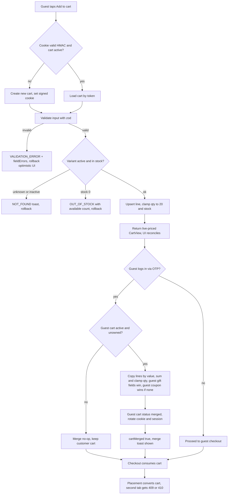
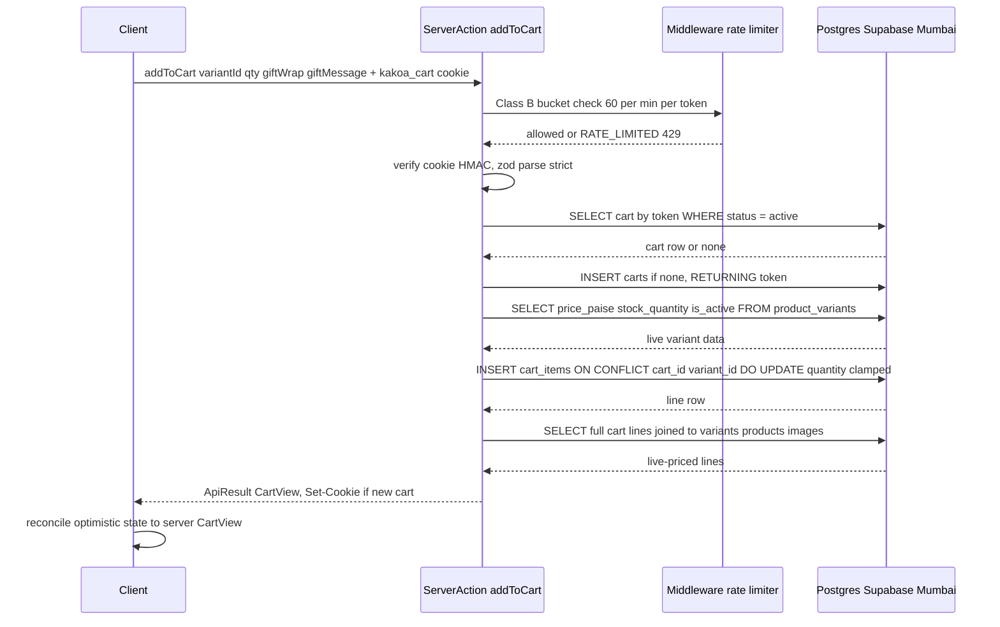
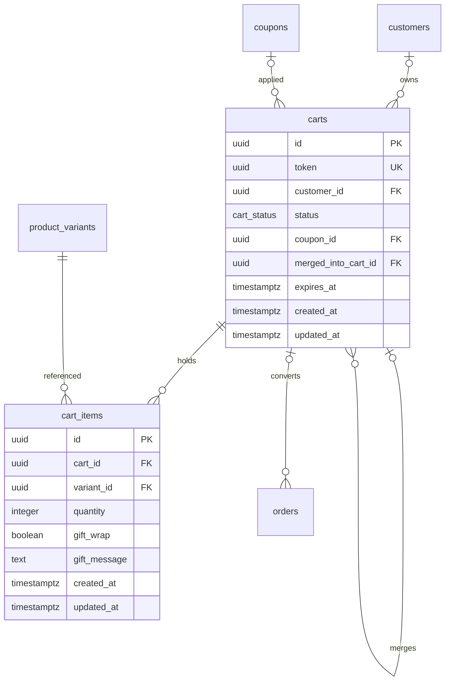
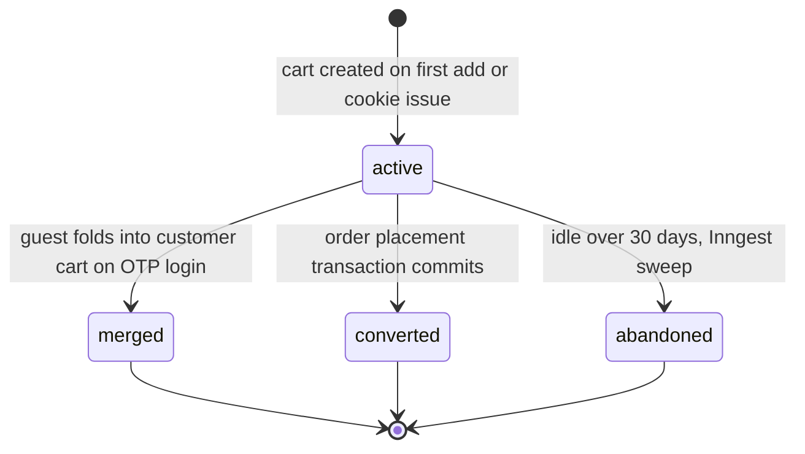

# Module Spec — Cart (Phase 1)

> KAKOA · guest cookie carts, merge on login, optimistic UI · Sources: Contract §1.10–1.11/§2.3, PROJECT_PLAN §3.4, DATABASE_ERD §3.10–3.11, risk-engineering Module 2. Owning lanes: Dev A (UI) + Dev B (data/session); Dev C reviews `applyCoupon`.

Cart lines are **never price snapshots** — every read reprices against live `product_variants`. Money is always integer paise. All timestamps `timestamptz` UTC, displayed IST via `formatIST()`.

---

## 1. Field-Level Specification

All inputs validated with zod (`packages/core/src/contracts/cart.ts`), `.strict()` — unknown keys rejected with `VALIDATION_ERROR` and `fieldErrors` (zod `flatten()`).

| Field | Used by | Type | Required | Max len | Format / Validation rule | Error message on failure |
|---|---|---|---|---|---|---|
| `variantId` | `addToCart` | string | yes | 36 | UUID v4: `^[0-9a-f]{8}-[0-9a-f]{4}-[0-9a-f]{4}-[0-9a-f]{4}-[0-9a-f]{12}$` (case-insensitive) | "Something went wrong adding this item. Please refresh and try again." |
| `qty` | `addToCart` | integer | yes | — | `z.number().int().min(1).max(20)` — matches DB `CHECK (quantity BETWEEN 1 AND 20)` | "Quantity must be between 1 and 20." |
| `qty` | `updateCartItem` | integer | yes | — | `z.number().int().min(0).max(20)` — **0 means remove the line** | "Quantity must be between 0 and 20." |
| `giftWrap` | `addToCart`, `setGiftOptions` | boolean | `setGiftOptions`: yes; `addToCart`: optional (default `false`) | — | `z.boolean()` | "Invalid gift wrap value." |
| `giftMessage` | `addToCart`, `setGiftOptions` | string | no | 300 | `z.string().trim().max(300)` applied **after** trim; empty string after trim stored as `NULL`. Stored raw; rendered React-encoded; sanitized before any email/packing-slip template interpolation. Matches DB `CHECK (char_length(gift_message) <= 300)` | "Gift message can be at most 300 characters." |
| `itemId` | `updateCartItem`, `setGiftOptions`, `removeCartItem` | string | yes | 36 | UUID v4 regex (as above); lookup ALWAYS joined against the resolved cart id — never trusted bare | "This item is no longer in your cart." (`NOT_FOUND`) |
| `code` | `applyCoupon` | string | yes | 24 | `z.string().trim().toUpperCase()` then `^[A-Z0-9]{3,24}$`; stored/compared as `citext` | "This coupon code isn't valid." (identical generic copy for all coupon failures — no enumeration oracle) |
| `clientOpId` | all optimistic mutations | string | yes (client-generated) | 36 | UUID v4; echoed back for optimistic reconciliation, never persisted | "Something went wrong. Please refresh and try again." |
| cart cookie `kakoa_cart` | all | string (header) | no | ~100 | `<uuid>.<base64url HMAC-SHA256>`; signature verified with server secret. Invalid/tampered/absent ⇒ treated as no cookie ⇒ fresh empty cart. **No error is ever surfaced.** | *(none — silent fresh cart)* |

**Client-side mirrors (Dev A):** qty stepper hard-caps at `min(20, stockAvailable)`; gift message textarea `maxLength={300}` with live counter "N/300"; coupon input auto-uppercases on blur.

---

## 2. Workflow / User Flow

### Add-to-cart → login merge → checkout handoff

1. Guest lands on PDP; no `kakoa_cart` cookie exists yet.
2. Guest taps "Add to cart" → client fires `addToCart` optimistically (drawer opens, badge increments, cart-icon pop animation).
3. Server action resolves cart: verify cookie HMAC → load `active` cart by `token`; if absent/tampered/expired/terminal-status ⇒ create a new `carts` row and set a freshly signed `HttpOnly; Secure; SameSite=Lax` cookie.
4. Server validates input (zod), loads live variant (`is_active`, `price_paise`, `stock_quantity`):
   - Unknown/inactive variant → `NOT_FOUND` → toast + optimistic rollback.
   - Requested qty (plus any existing line qty) > stock → clamp to available; if available is 0 → `OUT_OF_STOCK` with `details: { available }` → rollback + notice.
5. Upsert line on `UNIQUE (cart_id, variant_id)` (existing line ⇒ quantities summed, clamped to 20 and stock). Return fresh `CartView` (live-priced); client reconciles — server state always wins.
6. Guest edits qty / gift options / removes lines / applies a coupon — same optimistic pattern; coupon failures return one of the five `COUPON_*` codes with identical generic message copy.
7. Guest starts OTP login mid-session (Module §3.5). On successful verify, the **merge** runs server-side inside the verify handler:
   - Guest cart must be `status='active'` and `customer_id IS NULL`; otherwise merge is a no-op (idempotent).
   - Lines copied **by value** into the customer's active cart (created if none — partial unique index guarantees at most one). Same variant ⇒ quantities summed, capped at 20 and at live stock; guest gift fields win on conflict; guest coupon wins only if the customer cart has none.
   - Guest cart → `status='merged'`, `merged_into_cart_id` set. Cookie rotated to the surviving cart; session identifier rotated (fixation defense).
   - Verify response carries `cartMerged: true` → one-time toast "We combined your cart with your saved one" listing clamps/conflicts.
8. Customer proceeds to checkout; `/checkout/quote` (Module §3.6) is the authoritative pricing point; placement flips the cart to `converted`. Price drift vs. what the user saw triggers a blocking acknowledgment (409 `PRICE_CHANGED` path).
9. A cookie replaying the now-`merged`/`converted` token yields a fresh empty cart.



---

## 3. System Design



**External service dependencies:**

| Dependency | Used for | Behavior when down / timing out |
|---|---|---|
| Postgres (Supabase Mumbai) | everything | Actions return `INTERNAL` (500-equivalent); client rolls back the optimistic change and shows a retry toast. `GET /api/cart` failure renders the inline retry panel; rest of the page stays interactive. No queuing, no local persistence. |
| Inngest (abandonment sweep cron) | flips `active` carts idle > 30 days to `abandoned` | Zero customer-facing impact; sweep is idempotent and re-runs next tick. Dead-man ping alerts if the cron misses its window. |
| Upstash/Redis rate-limit store (middleware token buckets) | Class B enforcement | Fail-open for reads, fail-closed is NOT applied to cart (availability over strictness for a non-OTP surface); a limiter outage is alerted but mutations proceed. |

No third-party calls (Razorpay/Shiprocket/MSG91/Resend) occur in this module. Merge runs inside the OTP verify transaction owned by §3.5.

**Caching: none (deliberate).** `GET /api/cart` sends `Cache-Control: no-store` — cart is per-user, live-priced, live-stocked; any cache would violate the "never lie about price or stock" rule. Header badge uses last-known client state, never a cached server response. Product display data (name/image) rides catalog ISR on other surfaces, but the cart read always joins live rows.

---

## 4. Database Schema

Verbatim from `docs/DATABASE_ERD.md` §3.10–3.11.

**Enum:** `CREATE TYPE cart_status AS ENUM ('active','merged','converted','abandoned');`

### `carts` (Contract §1.10)

Guest carts keyed by an httpOnly cookie token; owned carts keyed by customer. Merge on login marks the guest cart `merged`. Cart lines are **never** price snapshots — pricing is always live.

| Column | Type | Constraints | Notes |
|---|---|---|---|
| `id` | `uuid` | `PRIMARY KEY DEFAULT gen_random_uuid()` | |
| `token` | `uuid` | `NOT NULL UNIQUE DEFAULT gen_random_uuid()` | cookie value for guests |
| `customer_id` | `uuid` | `REFERENCES customers(id) ON DELETE CASCADE` | |
| `status` | `cart_status` | `NOT NULL DEFAULT 'active'` | |
| `coupon_id` | `uuid` | `REFERENCES coupons(id) ON DELETE SET NULL` | applied pre-checkout, revalidated at quote/place |
| `merged_into_cart_id` | `uuid` | `REFERENCES carts(id)` | self-reference |
| `expires_at` | `timestamptz` | `NOT NULL DEFAULT now() + interval '30 days'` | |
| `created_at` | `timestamptz` | `NOT NULL DEFAULT now()` | |
| `updated_at` | `timestamptz` | `NOT NULL DEFAULT now()` | |

```sql
CREATE UNIQUE INDEX carts_one_active_per_customer_idx
  ON carts (customer_id) WHERE status = 'active' AND customer_id IS NOT NULL;
CREATE INDEX carts_abandoned_sweep_idx ON carts (updated_at) WHERE status = 'active';
```

### `cart_items` (Contract §1.11)

One line per variant per cart (`UNIQUE (cart_id, variant_id)`); gift wrap/message attach to the line. Hard deletes permitted (one of only four hard-delete exceptions).

| Column | Type | Constraints | Notes |
|---|---|---|---|
| `id` | `uuid` | `PRIMARY KEY DEFAULT gen_random_uuid()` | |
| `cart_id` | `uuid` | `NOT NULL REFERENCES carts(id) ON DELETE CASCADE` | |
| `variant_id` | `uuid` | `NOT NULL REFERENCES product_variants(id) ON DELETE CASCADE` | |
| `quantity` | `integer` | `NOT NULL CHECK (quantity BETWEEN 1 AND 20)` | |
| `gift_wrap` | `boolean` | `NOT NULL DEFAULT false` | |
| `gift_message` | `text` | `CHECK (char_length(gift_message) <= 300)` | |
| `created_at` | `timestamptz` | `NOT NULL DEFAULT now()` | |
| `updated_at` | `timestamptz` | `NOT NULL DEFAULT now()` | |

```sql
UNIQUE (cart_id, variant_id)
```



---

## 5. API Design

Envelope per Contract §2.1: `ApiResult<CartView>` everywhere. Server Actions never throw for expected failures — they return `ApiErr`. HTTP statuses below apply to the Route Handler; "-equivalent" for actions. Auth tier: **public** (cart cookie / customer session); every `itemId` lookup is joined against the resolved cart id.

```ts
type CartView = { id: string; lines: { itemId: string; variantId: string; productSlug: string; name: string;
    variantName: string; imageUrl: string | null; unitPricePaise: number; qty: number;
    giftWrap: boolean; giftMessage: string | null; lineTotalPaise: number;
    stockState: 'ok' | 'low' | 'out' }[];                    // live-priced, live-stock every read
  subtotalPaise: number; giftWrapTotalPaise: number;
  coupon: { code: string; discountPaise: number } | null;
  freeShippingThresholdPaise: number; count: number };
```

### `GET /api/cart` — Route Handler

- **Auth:** public (cart cookie / session). **Rate limit:** Class B (60/min/session-or-cart-token). `Cache-Control: no-store`.
- **Request:** none (cookie only). **Response:** `200 { ok: true, data: { cart: CartView } }` — **never 404**; no/invalid cookie ⇒ empty `CartView`.
- **Errors:** common set only — 429 `RATE_LIMITED`, 500 `INTERNAL`.
- Lines with archived/dangling variants return `stockState: 'out'` and are excluded from `subtotalPaise`; over-stock lines are auto-clamped in the same read (clamp persisted, `cart.clamped` logged).

### Server Actions (all → `ApiResult<CartView>`, Class B, public)

| Action | Request schema (zod, `.strict()`) | Success | Endpoint-specific errors |
|---|---|---|---|
| `addToCart` | `{ variantId: uuid; qty: int 1–20; giftWrap?: boolean; giftMessage?: string ≤300 trimmed; clientOpId: uuid }` | upsert line; existing line ⇒ qty summed, clamped to 20 and stock | `OUT_OF_STOCK` (409-equiv, `details: { available: number }`); `NOT_FOUND` (404-equiv, unknown/inactive variant) |
| `updateCartItem` | `{ itemId: uuid; qty: int 0–20; clientOpId: uuid }` | set qty; **qty 0 = remove** | `NOT_FOUND` (not this cart's line); `OUT_OF_STOCK` (`details: { available }`) |
| `setGiftOptions` | `{ itemId: uuid; giftWrap: boolean; giftMessage?: string ≤300 trimmed; clientOpId: uuid }` | per-line gift wrap + message | `NOT_FOUND` |
| `removeCartItem` | `{ itemId: uuid; clientOpId: uuid }` | hard-delete line | `NOT_FOUND` |
| `applyCoupon` | `{ code: string 3–24, uppercased+trimmed }` | attach `coupon_id` after full eligibility check; response includes `coupon: { code, discountPaise }` | `COUPON_INVALID` \| `COUPON_EXPIRED` \| `COUPON_MIN_NOT_MET` \| `COUPON_EXHAUSTED` \| `COUPON_LIMIT_REACHED` — all 422-equivalent, **identical generic message text** ("This coupon code isn't valid.") so codes can't be enumerated; the `code` field distinguishes for internal telemetry only |
| `removeCoupon` | `{}` | detach `coupon_id` (SET NULL) | none |

Common to all: `VALIDATION_ERROR` (400-equiv, `fieldErrors`), `RATE_LIMITED` (429 + `Retry-After`), `INTERNAL` (500).

**Idempotency:** add/update are natural upserts against `UNIQUE (cart_id, variant_id)` — a retried action converges to the same row. Every optimistic mutation carries `clientOpId` for UI reconciliation (server truth wins, not the last optimistic guess).

**Merge contract** (executed inside `POST /api/auth/otp/verify`, §3.5; surfaced as `cartMerged: boolean`): guest lines fold into the customer's active cart — same variant ⇒ quantities sum, capped at 20 and at stock; guest gift fields win on conflict; guest coupon wins only if the customer cart has none; guest cart → `status='merged'` + `merged_into_cart_id` set; cookie rotated to the surviving cart. Lines copied **by value** — the guest cart row is never re-parented. Idempotent: re-run against an already-`merged` cart is a no-op.

---

## 6. Security Standards

- **Rate limits (Contract §2.1):** **Class B — 60/min per session/cart-token** on `GET /api/cart` and all six actions. Headers `X-RateLimit-Limit`, `X-RateLimit-Remaining`, `X-RateLimit-Reset` on every response; 429 adds `Retry-After` and body code `RATE_LIMITED`. `applyCoupon` additionally rides the enumeration posture: identical error copy across all five coupon codes + failed-attempt logging `{code_hash, ip, session}`.
- **Cookie integrity:** `kakoa_cart` = `<cart token uuid>.<HMAC-SHA256 base64url>` signed with a server-only secret; `HttpOnly; Secure; SameSite=Lax; Path=/; Max-Age=2592000`. Tampered/invalid signature ⇒ silently treated as no cookie ⇒ fresh empty cart — **never** an error message or stack (no oracle). Cookie holds only the signed token, never lines (4KB limit + tamper surface).
- **Session fixation defense:** on login, rotate the session identifier, copy guest lines by value (never re-parent), invalidate the guest token (`status='merged'`). Old guest cookie replayed anywhere yields an empty cart.
- **Authz:** every mutation resolves the cart from the cookie/session first, then scopes `itemId` with `WHERE cart_items.id = $1 AND cart_items.cart_id = $resolvedCartId`. Forged/foreign `itemId` ⇒ `NOT_FOUND` — indistinguishable from missing. User A can never read or mutate cart B.
- **Input sanitization:** zod `.strict()` on every action; Drizzle parameterized queries everywhere (no string SQL). `gift_message` stored raw, rendered React-encoded on web, and **sanitized before any email/packing-slip template interpolation** (the forgotten sink). Coupon codes rendered encoded (user-echoed input).
- **Encryption at rest:** none beyond Supabase default disk encryption — cart data is low-sensitivity; no PII lives in `carts`/`cart_items` beyond gift messages (free text; treat as user content, exclude from logs).
- **Never log:** raw cookie values or HMAC signatures, gift message contents, raw coupon codes on failed attempts (log `code_hash` only), full `CartView` payloads.
- **Money safety:** all totals `unit_price_paise * qty + wrap_fee_paise` in pure integer math; branded `Paise` TS type + lint rule fail any float in money code.
- **OWASP specifics:** A01 Broken Access Control → forged-itemId negative tests across all six actions (merge gate); A03 Injection → Drizzle params + gift-message sink sanitization; A07 Identification failures → HMAC cookie + rotation-on-login; A04 Insecure Design → coupon enumeration posture + bot add-to-cart velocity alerting (inflated demand signals).

---

## 7. Edge Cases

(From risk-engineering.md Module 2 and PROJECT_PLAN §3.4 — binding.)

1. **Session fixation on cart merge.** Attacker plants a guest cart cookie; victim logs in. Defense: rotate session identifier on login, copy guest lines **by value** into the user cart (never re-parent the guest row), invalidate the guest token. Cookie HMAC-signed so cart IDs can't be forged.
2. **Merge collision — same variant in both carts.** Quantities **summed and clamped** to 20 and available stock; gift message/wrap conflicts resolve in favor of the **guest** (most recent intent) with a UI notice. Pure merge function in `packages/core`, unit-tested against the full collision matrix.
3. **Merge with expired/foreign/already-merged guest cart.** Cookie references a cart that is `merged`, expired (>30 days), or owned by someone else: merge verifies the guest cart is unowned and `active`; merging twice = merging once.
4. **Variant archived/deleted while in cart.** Render must not 500 on a dangling variant: line flagged `unavailable` (`stockState: 'out'`), excluded from totals, checkout blocked until removed, reason visible.
5. **Price changed between add and checkout.** Totals always computed from current `price_paise` server-side; drift triggers a blocking inline "price changed from ₹X to ₹Y" acknowledgment before checkout; placement re-verifies against `expectedTotalPaise` → 409 `PRICE_CHANGED`. Never silently charge more than displayed.
6. **Optimistic UI divergence.** Client shows qty 3, server rejects at stock 2: `clientOpId` reconciliation rolls the line back with a toast; a double-tap "+" race (two increments in flight) must converge to the server-clamped value, not the last optimistic guess.
7. **Someone else bought it — qty > sellable stock at render.** Cart page revalidates stock server-side on every load; over-stock lines auto-clamp with "Only N left — we've updated your cart" rather than failing at payment.
8. **Gift wrap on a changing line.** Wrap fee is per line, flat, in paise, snapshotted only at checkout (`order_items.gift_wrap_fee_paise`); reducing qty must not orphan the fee; removing the line removes its message.
9. **Cookie size blowout.** Cookie holds only the signed cart token — lines never serialized into the cookie; asserted in test.
10. **Two tabs, one cart.** Both submit checkout: the cart converts atomically with placement; the second tab hits the stale cart and gets 410 `CART_EXPIRED` (or 409 on the placement race) with a refresh path — never two orders from one cart absent distinct idempotency keys.
11. **Coupon auto-detach on line removal.** Removing a line drops subtotal below `min_subtotal_paise` → coupon detaches at the next totals computation with notice "Coupon WELCOME10 removed — order is below ₹X minimum"; never a checkout-time 500; re-validated at final submission.
12. **Totals rounding.** `unit_price_paise * qty + wrap_fee_paise` — pure integer math; any float in money code fails lint (branded `Paise` type).

---

## 8. State Machine

`cart_status` is a strict one-way machine. No transitions out of terminal states; a terminal cart's token presented in a cookie yields a fresh empty cart.

| From | To | Trigger |
|---|---|---|
| `active` | `merged` | Guest cart folded into a customer cart inside OTP verify (`merged_into_cart_id` set, cookie rotated) |
| `active` | `converted` | Order placed — flip happens atomically inside the placement transaction (§3.6); this is the two-tab lock |
| `active` | `abandoned` | Inngest sweep: `updated_at` idle > 30 days (via `carts_abandoned_sweep_idx`); idempotent, dead-man-pinged |



---

## 9. Testing Requirements

**Unit (`packages/core`) — ≥ 95% coverage on cart math:**
- Merge function full collision matrix: same variant (sum + clamp to 20/stock), conflicting gift wrap/message (guest wins), unavailable lines, guest-coupon-wins-only-if-none rule.
- Totals in integer paise — property tests: `totals(lines)` associative under line ordering, never negative, never a float.
- Clamp logic: requested vs available vs 20-cap, including the add-again upsert path (existing 15 + add 10 ⇒ 20 or stock, whichever lower).
- Zod schemas for all six action inputs: qty bounds (1–20 add, 0–20 update), uuid formats, gift-message length **post-trim** (301 chars fails, 300 passes, 305 with 6 trailing spaces passes), coupon normalization (` welcome10 ` ⇒ `WELCOME10`), unknown-key rejection.

**Integration (ephemeral Postgres, migrations applied):**
- Merge-on-login idempotency: run merge twice, assert byte-identical end state and a single `merged` guest cart.
- Session rotation on login: pre-login cart/session token invalid afterward.
- Dangling-variant render: archive a variant with an existing line; `GET /api/cart` returns 200 with the line flagged, totals exclude it.
- Cart conversion lock: concurrent placements against one cart ⇒ exactly one converts, second gets 409/410.
- Signed-cookie tamper: mutated cookie value ⇒ fresh empty cart, no error/stack leak, new `Set-Cookie` issued.
- Forged-ID authz: session A calling `updateCartItem` with cart B's `itemId` ⇒ `NOT_FOUND`, zero cross-cart mutation — repeated for all four item-scoped actions.
- Coupon apply/detach: below-minimum auto-detach on line removal; all five `COUPON_*` paths return identical `message` text.
- Class B limiter: 61st mutation in a minute ⇒ 429 with `Retry-After` + `X-RateLimit-*` headers.

**E2E (Playwright, named):**
1. **Guest-to-user merge:** guest adds 2 items with a gift message → logs in via OTP mid-session → cart shows merged state with message intact → replaying the old guest cookie in a fresh browser context yields an empty cart.
2. **Optimistic rollback:** admin sets variant stock to 1 → rapid-click "+" to 3 → UI settles at 1 with a visible notice.
3. **Price-drift acknowledgment:** add to cart → admin raises price → proceed to checkout → blocking "price changed" acknowledgment appears before the payment step.

---

## 10. Definition of Done

- [ ] Signed httpOnly cart cookie (`HttpOnly, Secure, SameSite=Lax`, HMAC-SHA256) live; tamper test green; cookie contains token only (size assertion in test)
- [ ] Session rotation on login proven by integration test — old guest token dead after OTP verify
- [ ] Merge idempotent and by-value (guest cart never re-parented), proven by twice-run test; `cartMerged` flag surfaced in verify response and merge toast rendered
- [ ] Integer-paise-only math enforced by branded `Paise` type + lint rule; property tests green
- [ ] Unavailable-line handling (archived/dangling variant) renders without error, excludes from totals, and blocks checkout
- [ ] Cart conversion lock — concurrent checkout 409/410 (`CART_EXPIRED`) path tested; `active → converted` atomic with placement
- [ ] Forged-ID authz negative tests green across all six actions
- [ ] Class B rate limits (60/min per session/cart-token) + `X-RateLimit-*` headers + 429 `Retry-After` live
- [ ] Coupon apply: all five `COUPON_*` codes wired with identical generic copy; failed attempts logged as `{code_hash, ip, session}`; below-minimum auto-detach with notice
- [ ] Gift message: 300-char post-trim cap enforced in zod + DB CHECK; stored raw, React-encoded on render, sanitized before email/packing-slip interpolation
- [ ] Optimistic UI with `clientOpId` reconciliation — rollback on rejection, convergence to server truth under double-tap races
- [ ] `GET /api/cart` never 404s, sends `Cache-Control: no-store`, auto-clamps over-stock lines with persisted clamp + notice
- [ ] Abandoned-cart Inngest sweep (`active` idle > 30d → `abandoned`) idempotent + dead-man-pinged
- [ ] Structured logs emitting: `cart.merged {customer_id, guest_cart_id, lines_merged, conflicts}`, `cart.clamped {variant_id, requested, granted}`, `coupon.applied/detached {code, cart_id}`; alerts wired (merge failure > 1%/1h, add-to-cart velocity per IP, coupon miss-rate spike)
- [ ] The 3 named E2E scenarios green in CI on the Vercel preview
