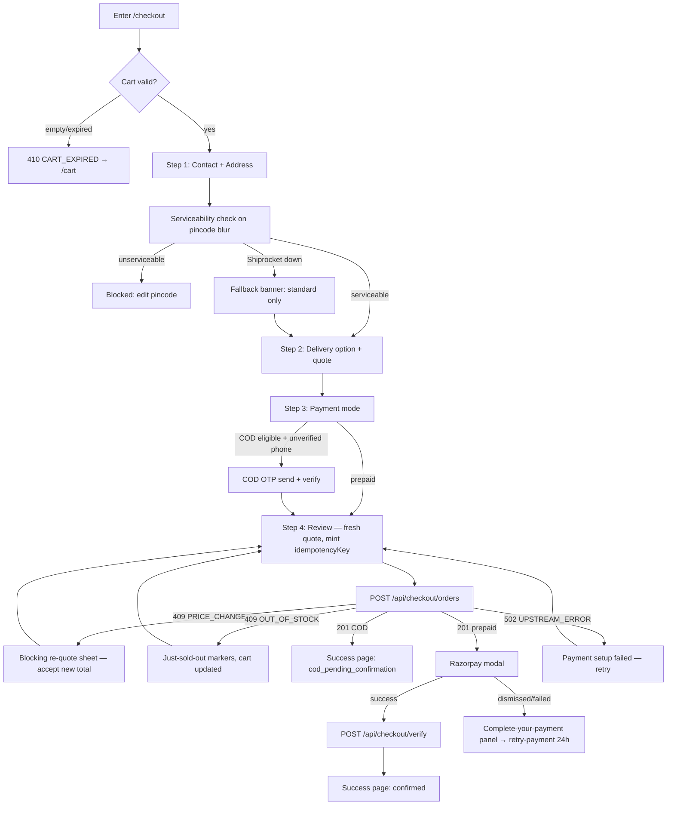
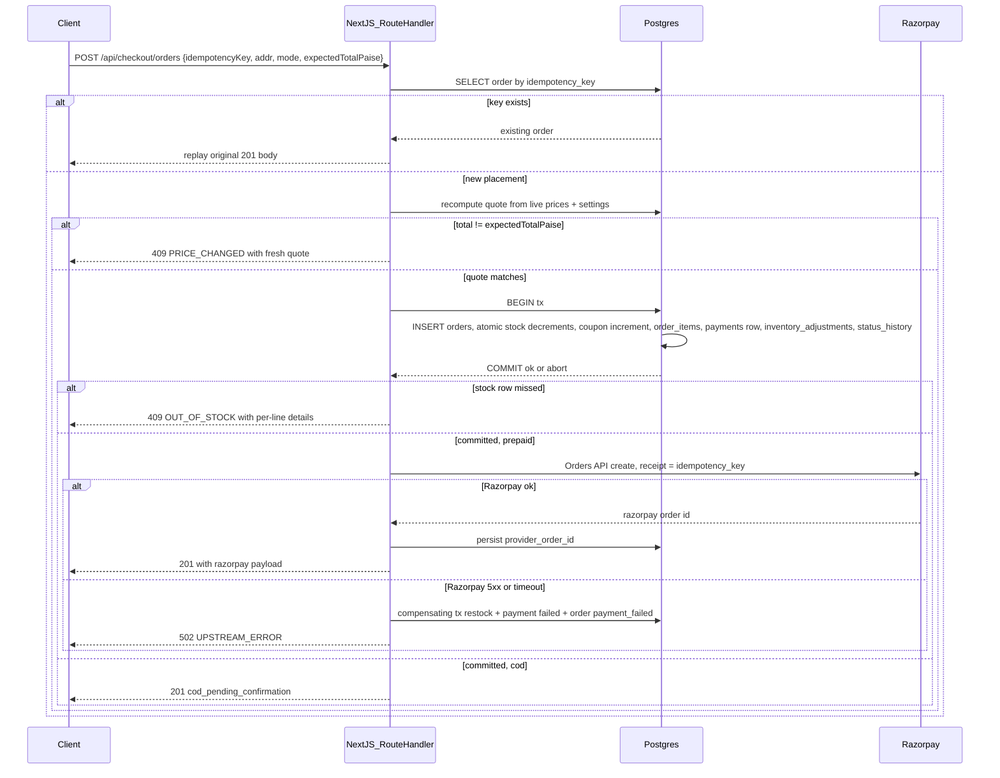
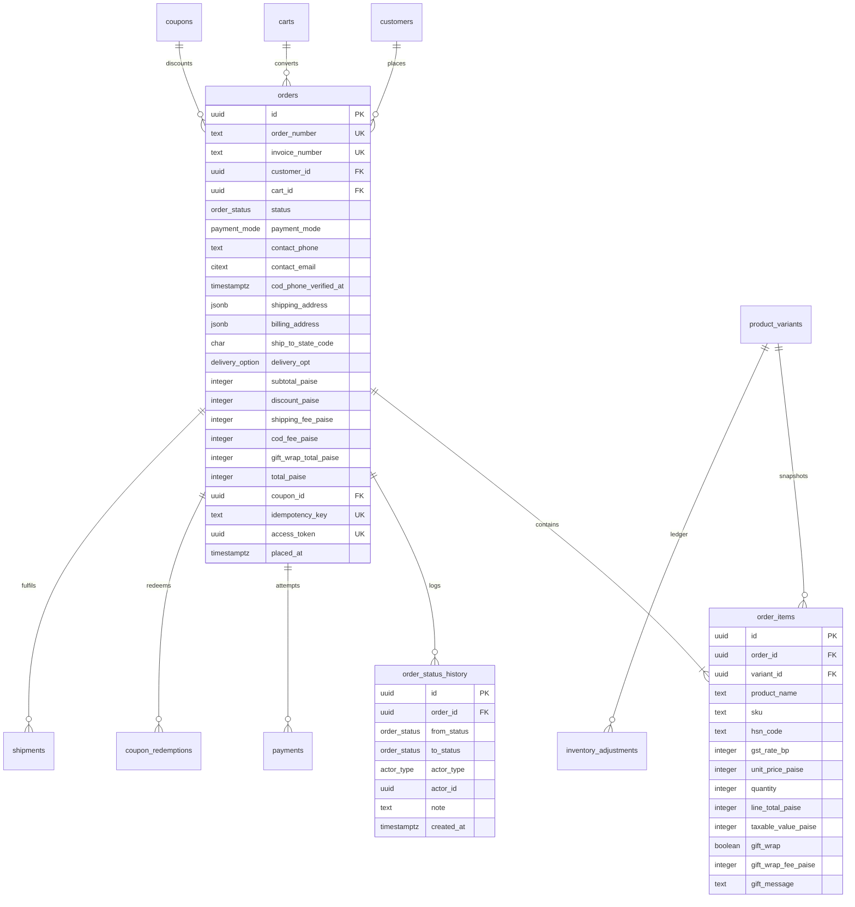
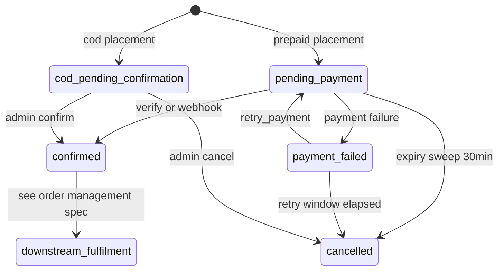

# Module Spec — Checkout: 4-Step Flow, Quote & Placement (Phase 1–2)

> **Module owner:** Dev C (Payments & Checkout). State-machine PRs co-owned with Dev B (+D review).
> **Source of truth:** PROJECT_PLAN.md §3.0 Contract (§2.1, §2.5, §1.27–1.29) and §3.6; docs/DATABASE_ERD.md §3.14–3.16.
> **Scope:** the 4-step checkout (`/checkout`: Address → Delivery → Payment → Review), `/api/shipping/serviceability`, `/api/checkout/quote`, `/api/checkout/orders` (placement transaction), `/api/checkout/verify`, `/api/checkout/orders/[orderId]/retry-payment`. Guest order lookup, tracking, cancellation and the full 11-state lifecycle live in **order-management.md**; payment capture/refunds in **payments.md**; cart mutations in **cart.md**.
> **Conventions:** all money integer paise; all timestamps `timestamptz` UTC, displayed IST (`Asia/Kolkata`); envelope + error codes exactly per Contract §2.1.

---

## 1. Field-Level Specification

All schemas are zod `strict()` objects exported from `packages/core/src/contracts/checkout.ts`. Strings are trimmed before validation; unknown keys are rejected with 400 `VALIDATION_ERROR`. Field errors return via `fieldErrors` (zod `flatten()`), rendered inline.

### 1.1 Contact (Step 1)

| Field | Type | Required | Max len | Format / Validation | Error message on failure |
|---|---|---|---|---|---|
| `contact.phone` | string | yes | 10 (input) | Input `^[6-9]\d{9}$` after stripping spaces, dashes, and a leading `+91`/`91`/`0`. Normalized server-side to `+91XXXXXXXXXX` (stored form must match `^\+91[6-9][0-9]{9}$`) | "Enter a valid 10-digit Indian mobile number starting with 6–9." |
| `contact.email` | string | no | 254 | `^[a-zA-Z0-9._%+-]+@[a-zA-Z0-9.-]+\.[a-zA-Z]{2,}$`, lowercased (stored `citext`) | "Enter a valid email address (e.g., name@example.com)." |

### 1.2 Shipping address (Step 1) — `AddressInput` (also used for `billingAddress`)

Snapshot shape stored on `orders.shipping_address` jsonb: `{fullName, phone, line1, line2, landmark, city, state, stateCode, pincode}`.

| Field | Type | Required | Max len | Format / Validation | Error message on failure |
|---|---|---|---|---|---|
| `fullName` | string | yes | 100 | 2–100 chars after trim; `^[\p{L}][\p{L}\p{M}\s.''-]{1,99}$` (Unicode letters, apostrophes, dots, hyphens — "D'Souza" must pass) | "Enter the recipient's full name (2–100 characters)." |
| `phone` | string | yes | 10 (input) | Same rule as `contact.phone`; may differ from contact phone (gift recipient) | "Enter a valid 10-digit mobile number for delivery updates." |
| `line1` | string | yes | 150 | 3–150 chars; free text — `#`, `/`, commas, floor markers allowed; control chars (`\p{Cc}` except none) stripped | "Address line 1 is required (house/flat, street — min 3 characters)." |
| `line2` | string | no | 150 | 0–150 chars; same sanitization | "Address line 2 must be 150 characters or fewer." |
| `landmark` | string | no | 100 | 0–100 chars | "Landmark must be 100 characters or fewer." |
| `city` | string | yes | 60 | 2–60 chars; `^[\p{L}][\p{L}\s.-]{1,59}$` | "Enter a valid city name." |
| `state` | string | yes | 50 | Must be a display name from the canonical GST state list (`packages/core/src/gst-states.ts`); selected from dropdown, never free-typed | "Select your state from the list." |
| `stateCode` | string | yes | 2 | `^(0[1-9]|[12][0-9]|3[0-8]|97)$` — two-digit GST state code (01 Jammu & Kashmir … 38 Ladakh, 97 Other Territory); must match the selected `state`; drives CGST/SGST vs IGST vs `store_settings.seller_state_code` | "State selection is invalid — please re-select your state." |
| `pincode` | string | yes | 6 | `^[1-9][0-9]{5}$` **AND** present in the bundled India pincode dataset (`000000` passes the regex but not the dataset) **AND** serviceable per §5.1 | Regex/dataset fail: "Enter a valid 6-digit Indian PIN code." · Unserviceable: "Sorry, we can't deliver to PIN code {pincode} yet." |

### 1.3 Delivery & payment (Steps 2–3)

| Field | Type | Required | Format / Validation | Error message on failure |
|---|---|---|---|---|
| `deliveryOption` | enum | yes | `'standard' \| 'express'` (`delivery_option` enum); express only if serviceability returned an express option for the pincode | "Express delivery isn't available for this PIN code — please choose Standard." |
| `paymentMode` | enum | yes | `'prepaid' \| 'cod'` (`payment_mode` enum); COD allowed only when `codAvailable` for the pincode AND order total ≤ COD cap (`store_settings`) AND phone not RTO-flagged — recomputed **on every step render and again at placement** | "Cash on Delivery isn't available for this PIN code or order value. Please pay online." |
| `codOtp.challengeId` | string (uuid) | cond. | `^[0-9a-f]{8}-[0-9a-f]{4}-[0-9a-f]{4}-[0-9a-f]{4}-[0-9a-f]{12}$`; required for COD unless customer session has a verified phone matching `contact.phone`; challenge `purpose='cod_verification'` | "Please verify your phone number to place a COD order." |
| `codOtp.code` | string | cond. | `^\d{6}$`; ≤5 attempts per challenge, 5-min TTL, atomic consume | Wrong: "Incorrect OTP. {attemptsLeft} attempts left." · Expired/exhausted: "This OTP has expired. Request a new one." |
| `couponCode` | string | no | `^[A-Z0-9-]{3,24}$` after trim + uppercase (codes stored uppercase `citext`); revalidated at quote AND placement | "Coupon {code} isn't valid." (specific 422 codes map to: "expired" / "requires a minimum order of ₹{min}" / "has been fully redeemed" / "already used the maximum number of times") |
| `customerNote` | string | no | 0–500 chars after trim; control characters stripped; stored raw, output-encoded everywhere | "Order note must be 500 characters or fewer." |

### 1.4 Gift fields (per cart line — set in cart, revalidated at placement)

| Field | Type | Required | Format / Validation | Error message on failure |
|---|---|---|---|---|
| `giftWrap` | boolean | no (default false) | Per line, flat fee `store_settings.gift_wrap_fee_paise`, snapshotted to `order_items.gift_wrap_fee_paise` | — |
| `giftMessage` | string | no | ≤ **300 grapheme clusters** (`Intl.Segmenter` — emoji/ZWJ count as 1; DB guard `char_length ≤ 300`); control chars stripped; stored raw; output-encoded on web, email HTML, and packing-slip PDF | "Gift message is too long — maximum 300 characters." |

### 1.5 Placement-only fields (Step 4 — Review)

| Field | Type | Required | Format / Validation | Error message on failure |
|---|---|---|---|---|
| `idempotencyKey` | string (uuid) | yes | UUID v4 `^[0-9a-f]{8}-[0-9a-f]{4}-4[0-9a-f]{3}-[89ab][0-9a-f]{3}-[0-9a-f]{12}$`; minted client-side when the Review step renders; UNIQUE in `orders` | (never user-visible — 400 `VALIDATION_ERROR` means a client bug) |
| `expectedTotalPaise` | integer | yes | Positive integer ≤ 10,000,000 (₹1,00,000 sanity cap); the total the UI displayed; server recomputes and compares — mismatch ⇒ 409 `PRICE_CHANGED` | "Prices have changed since you started checkout — please review the updated total." |
| `billingAddress` | AddressInput | no | Same schema as §1.2; omitted = same as shipping (`orders.billing_address` NULL) | (same per-field messages as §1.2) |

**Never trusted from the client:** any price, fee, discount, tax figure, or line total. The client sends line refs (via cart cookie), `couponCode`, and `expectedTotalPaise` only.

---

## 2. Workflow / User Flow

1. Customer clicks "Checkout" from `/cart`. Server loads the active cart (cookie `kakoa_cart` or session-owned). Empty/expired cart → 410 `CART_EXPIRED` → redirect to `/cart` with "Your cart is empty."
2. **Step 1 — Address.** Contact + shipping form (saved-address picker for logged-in customers). On pincode blur → `GET /api/shipping/serviceability?pincode=…&cod=true` (inline spinner). Unserviceable → blocked at this step with edit affordance; Shiprocket 502 → banner "Standard delivery only — final serviceability verified at dispatch," standard-only continue.
3. **Step 2 — Delivery.** Options from serviceability response with fees from `store_settings` (`shipping_fee_standard_paise` / `shipping_fee_express_paise`; free above `free_shipping_threshold_paise`). Each selection re-fires `POST /api/checkout/quote`; totals panel shows skeleton until the fresh quote lands — never stale totals.
4. **Step 3 — Payment mode.** Prepaid (Razorpay) or COD. COD eligibility recomputed on render (pincode COD flag AND total ≤ cap AND phone not RTO-flagged); ineligible → option disabled with reason. COD selected + no verified phone on session → send OTP (`purpose='cod_verification'`, Class C limits) and show 6-digit entry.
5. **Step 4 — Review.** Fresh quote rendered line-by-line (lines, subtotal, discount, shipping, COD fee, gift wrap, informational CGST/SGST/IGST, total, IST ETA). Coupon revalidated — invalid now ⇒ auto-detached with notice. Client mints `idempotencyKey`. "Place Order" → button disabled + spinner → `POST /api/checkout/orders`.
6. **Success (COD):** 201 `status:'cod_pending_confirmation'` → `/order/success?token={accessToken}` — "Order KK-XXXXX placed. We'll call to confirm."
7. **Success (prepaid):** 201 with `razorpay{orderId,keyId,amountPaise,currency,prefill}` → Razorpay Standard Checkout modal mounts. Modal success → `POST /api/checkout/verify` ("Confirming payment…" interstitial) → success page shows confirmed.
8. **Failure branches:** 409 `PRICE_CHANGED` → blocking re-quote sheet diffing old vs new totals; explicit accept required before resubmit. 409 `OUT_OF_STOCK` → per-line "just sold out" markers from `details`, cart auto-updated, no order created. Modal dismissed / payment failed → order stays `pending_payment`/`payment_failed`; "Complete your payment" panel wired to retry-payment (24h window). Razorpay order-create 502 → "Payment setup failed — your card was not charged" + retry.



---

## 3. System Design

Route Handlers (not Server Actions — external calls + non-React callers). Functions pinned `bom1`; DB is Supabase Postgres `ap-south-1` via pooled connections; Drizzle with committed SQL migrations.



**External dependencies and exact failure behavior**

| Service | Used for | When down / timing out |
|---|---|---|
| Shiprocket (serviceability API, no sandbox — in-repo mock in dev) | Pincode serviceability, COD availability, ETA | 3s timeout, 1 retry → 502 `UPSTREAM_ERROR`. UI degrades: "Standard delivery only — verified at dispatch"; checkout proceeds standard-only. Serviceability snapshot (courier, ETD, check timestamp) stored on the order for forensics. Post-placement delisting → order enters the admin fulfillment-blocked queue (see order-management.md), never silently stuck. |
| Razorpay Orders API | Prepaid order create (step 7 of placement, **outside** the DB tx) | 5s timeout → compensating tx (restock via `inventory_adjustments`, payment row `failed`, order `payment_failed`) → 502 with "your card was not charged"; client may retry with a **new** idempotencyKey. Create keyed by `receipt = idempotency_key` so a Vercel kill mid-call is reconcilable by the stuck-payment sweep. |
| Razorpay Checkout JS (client modal) | Payment capture UX | Script blocked/fails to load → prepaid CTA shows "Payment temporarily unavailable — try COD or retry"; order already exists in `pending_payment`, retry-payment path remains. CSP must allowlist Razorpay script/frame domains. |
| MSG91 (via SmsProvider) | COD OTP delivery | OTP request → 502 `UPSTREAM_ERROR`; COD blocked (prepaid still offered). Verify is local (no provider call). |
| Razorpay `payment.captured` webhook + 15–30 min stuck-payment sweep | Truth for confirmation | `/checkout/verify` is only the fast path; webhook + sweep converge idempotently on `confirmed` (payments.md). Sweep also releases 30-min-expired `pending_payment` stock holds. |

**Caching strategy**

| What | TTL | Invalidation |
|---|---|---|
| Serviceability per pincode (`svc:{pincode}` incl. COD flag + options) | 24h | TTL only; placement stores a snapshot, so cache staleness can never mutate a placed order |
| `store_settings` fee/policy row | 60s in-process | TTL + settings-change revalidation tag; every value used is snapshotted onto the order at placement |
| Quote, placement, verify, retry | **none** | Money-truthful paths — always recomputed from live prices/stock/coupons |

---

## 4. Database Schema

Owned tables, verbatim from docs/DATABASE_ERD.md §3.14–3.16. Reads/updates against `carts`, `cart_items`, `product_variants` (atomic decrement), `coupons`/`coupon_redemptions` (atomic exhaustion), `payments` (insert `created` row), `inventory_adjustments` (`order_placed` ledger rows), `otp_challenges` (`cod_verification` consume), `store_settings` (fee snapshots) — DDL for those lives in their owning modules' specs.

### 4.1 `orders` (Contract §1.14)

| Column | Type | Constraints | Notes |
|---|---|---|---|
| `id` | `uuid` | `PRIMARY KEY DEFAULT gen_random_uuid()` | |
| `order_number` | `text` | `NOT NULL UNIQUE` | `'KK-48210'`; `'KK-' || lpad(nextval('order_number_seq'),5,'0')` |
| `invoice_number` | `text` | `UNIQUE` | GST invoice serial `'KK/25-26/00042'`; assigned at `packed` |
| `customer_id` | `uuid` | `REFERENCES customers(id) ON DELETE SET NULL` | NULL = guest |
| `cart_id` | `uuid` | `REFERENCES carts(id) ON DELETE SET NULL` | |
| `status` | `order_status` | `NOT NULL` | |
| `payment_mode` | `payment_mode` | `NOT NULL` | |
| `currency` | `char(3)` | `NOT NULL DEFAULT 'INR'` | |
| `contact_phone` | `text` | `NOT NULL CHECK (contact_phone ~ '^\+91[6-9][0-9]{9}$')` | |
| `contact_email` | `citext` | | |
| `cod_phone_verified_at` | `timestamptz` | | set when COD OTP passed at placement |
| `shipping_address` | `jsonb` | `NOT NULL` | SNAPSHOT `{fullName,phone,line1,line2,landmark,city,state,stateCode,pincode}` |
| `billing_address` | `jsonb` | | NULL = same as shipping |
| `ship_to_state_code` | `char(2)` | `NOT NULL` | drives CGST/SGST vs IGST split |
| `delivery_opt` | `delivery_option` | `NOT NULL` | |
| `subtotal_paise` | `integer` | `NOT NULL CHECK (subtotal_paise >= 0)` | sum of line totals (GST-incl) |
| `discount_paise` | `integer` | `NOT NULL DEFAULT 0 CHECK (discount_paise >= 0)` | |
| `shipping_fee_paise` | `integer` | `NOT NULL DEFAULT 0 CHECK (shipping_fee_paise >= 0)` | SNAPSHOT of settings |
| `cod_fee_paise` | `integer` | `NOT NULL DEFAULT 0 CHECK (cod_fee_paise >= 0)` | SNAPSHOT |
| `gift_wrap_total_paise` | `integer` | `NOT NULL DEFAULT 0 CHECK (gift_wrap_total_paise >= 0)` | |
| `total_paise` | `integer` | `NOT NULL CHECK (total_paise >= 0)` | |
| `cgst_paise` | `integer` | `NOT NULL DEFAULT 0` | informational extraction from inclusive prices |
| `sgst_paise` | `integer` | `NOT NULL DEFAULT 0` | |
| `igst_paise` | `integer` | `NOT NULL DEFAULT 0` | |
| `coupon_id` | `uuid` | `REFERENCES coupons(id) ON DELETE SET NULL` | |
| `coupon_code` | `text` | | SNAPSHOT: survives coupon edits/deletes |
| `idempotency_key` | `text` | `UNIQUE` | client-generated per placement attempt |
| `access_token` | `uuid` | `NOT NULL UNIQUE DEFAULT gen_random_uuid()` | guest success-page auth, 24h honored |
| `customer_note` | `text` | | |
| `cancel_reason` | `text` | | |
| `placed_at` | `timestamptz` | `NOT NULL DEFAULT now()` | |
| `confirmed_at` | `timestamptz` | | |
| `packed_at` | `timestamptz` | | |
| `shipped_at` | `timestamptz` | | |
| `delivered_at` | `timestamptz` | | |
| `cancelled_at` | `timestamptz` | | |
| `rto_delivered_at` | `timestamptz` | | |
| `created_at` | `timestamptz` | `NOT NULL DEFAULT now()` | |
| `updated_at` | `timestamptz` | `NOT NULL DEFAULT now()` | |

```sql
CHECK (total_paise = subtotal_paise - discount_paise + shipping_fee_paise
                    + cod_fee_paise + gift_wrap_total_paise)
```

```sql
CREATE INDEX orders_customer_idx ON orders (customer_id, placed_at DESC) WHERE customer_id IS NOT NULL;
CREATE INDEX orders_status_idx   ON orders (status, placed_at DESC);
CREATE INDEX orders_open_ops_idx ON orders (placed_at)                   -- admin ops queue: partial, tiny & hot
  WHERE status IN ('cod_pending_confirmation','confirmed','packed');
CREATE INDEX orders_phone_idx    ON orders (contact_phone);              -- guest lookup + COD abuse checks
CREATE INDEX orders_pending_expiry_idx ON orders (placed_at) WHERE status = 'pending_payment';  -- expiry sweep
```

### 4.2 `order_items` (Contract §1.15)

| Column | Type | Constraints | Notes |
|---|---|---|---|
| `id` | `uuid` | `PRIMARY KEY DEFAULT gen_random_uuid()` | |
| `order_id` | `uuid` | `NOT NULL REFERENCES orders(id) ON DELETE CASCADE` | |
| `variant_id` | `uuid` | `NOT NULL REFERENCES product_variants(id) ON DELETE RESTRICT` | |
| `product_name` | `text` | `NOT NULL` | SNAPSHOT |
| `variant_name` | `text` | `NOT NULL` | SNAPSHOT |
| `sku` | `text` | `NOT NULL` | SNAPSHOT |
| `image_url` | `text` | | SNAPSHOT |
| `hsn_code` | `text` | `NOT NULL` | SNAPSHOT |
| `gst_rate_bp` | `integer` | `NOT NULL` | SNAPSHOT |
| `unit_price_paise` | `integer` | `NOT NULL CHECK (unit_price_paise > 0)` | SNAPSHOT (GST-inclusive) |
| `quantity` | `integer` | `NOT NULL CHECK (quantity > 0)` | |
| `line_total_paise` | `integer` | `NOT NULL` | `unit*qty + gift_wrap_fee` |
| `taxable_value_paise` | `integer` | `NOT NULL` | extracted: line_total − line tax |
| `cgst_paise` | `integer` | `NOT NULL DEFAULT 0` | |
| `sgst_paise` | `integer` | `NOT NULL DEFAULT 0` | |
| `igst_paise` | `integer` | `NOT NULL DEFAULT 0` | |
| `gift_wrap` | `boolean` | `NOT NULL DEFAULT false` | |
| `gift_wrap_fee_paise` | `integer` | `NOT NULL DEFAULT 0` | SNAPSHOT of settings at placement |
| `gift_message` | `text` | `CHECK (char_length(gift_message) <= 300)` | |
| `created_at` | `timestamptz` | `NOT NULL DEFAULT now()` | |

```sql
CREATE INDEX order_items_order_idx   ON order_items (order_id);
CREATE INDEX order_items_variant_idx ON order_items (variant_id);   -- "customers also bought" + sales-by-SKU
```

### 4.3 `order_status_history` (Contract §1.16)

| Column | Type | Constraints | Notes |
|---|---|---|---|
| `id` | `uuid` | `PRIMARY KEY DEFAULT gen_random_uuid()` | |
| `order_id` | `uuid` | `NOT NULL REFERENCES orders(id) ON DELETE CASCADE` | |
| `from_status` | `order_status` | | NULL for creation |
| `to_status` | `order_status` | `NOT NULL` | |
| `actor_type` | `actor_type` | `NOT NULL` | |
| `actor_id` | `uuid` | | `admin_users.id` / `customers.id` / NULL |
| `note` | `text` | | |
| `created_at` | `timestamptz` | `NOT NULL DEFAULT now()` | |

```sql
CREATE INDEX osh_order_idx ON order_status_history (order_id, created_at);
```



---

## 5. API Design

All Route Handlers, envelope per Contract §2.1 (`ApiOk`/`ApiErr` with `requestId`). Common errors apply everywhere and are not repeated: 400 `VALIDATION_ERROR`, 401 `UNAUTHORIZED`, 403 `FORBIDDEN`, 429 `RATE_LIMITED`, 500 `INTERNAL`. Rate-limit headers `X-RateLimit-Limit/Remaining/Reset` on every class; 429 adds `Retry-After`.

### 5.1 `GET /api/shipping/serviceability?pincode=560001&cod=true` — public, **Class A (120/min/IP)**

Response: `{ serviceable: boolean; codAvailable: boolean; options: { option: 'standard'|'express'; feePaise: number; etaDaysMin: number; etaDaysMax: number }[] }`
Errors: 400 `VALIDATION_ERROR` (pincode fails `^[1-9][0-9]{5}$`); 422 `PINCODE_UNSERVICEABLE`; 502 `UPSTREAM_ERROR` (Shiprocket down — UI falls back "standard only, verified at dispatch"). Cached 24h per pincode (§3).

### 5.2 `POST /api/checkout/quote` — public (cart cookie), **Class D (10/min/session)**

Request: `{ pincode: string; deliveryOption: 'standard'|'express'; paymentMode: 'prepaid'|'cod'; couponCode?: string }`
Response: `{ quote: CheckoutQuote }` where

```ts
type CheckoutQuote = { lines: CartView['lines'];
  subtotalPaise: number; discountPaise: number; shippingFeePaise: number;
  codFeePaise: number; giftWrapTotalPaise: number; totalPaise: number;
  taxIncluded: { cgstPaise: number; sgstPaise: number; igstPaise: number };   // informational (prices are inclusive)
  coupon: { code: string; discountPaise: number } | null;
  etaDaysMin: number; etaDaysMax: number };
```

Errors: 410 `CART_EXPIRED`; 409 `OUT_OF_STOCK` (details: lines); 422 `COUPON_INVALID` / `COUPON_EXPIRED` / `COUPON_MIN_NOT_MET` / `COUPON_EXHAUSTED` / `COUPON_LIMIT_REACHED`; 422 `PINCODE_UNSERVICEABLE` / `COD_UNAVAILABLE`. Never cached; server computes everything from live prices, stock, coupon state, and `store_settings`. Tax split: `ship_to_state_code == seller_state_code` ⇒ CGST+SGST, else IGST; extraction `tax = round(gross * rate_bp / (10000 + rate_bp))` per line.

### 5.3 `POST /api/checkout/orders` — public (cart cookie) | customer, **Class D** — PLACE ORDER

Request:

```ts
{ idempotencyKey: string;                       // uuid, client-generated per attempt
  contact: { phone: string; email?: string };
  shippingAddress: AddressInput; billingAddress?: AddressInput;
  deliveryOption: 'standard'|'express'; paymentMode: 'prepaid'|'cod';
  couponCode?: string; customerNote?: string;
  expectedTotalPaise: number;                   // what the UI displayed — server re-verifies
  codOtp?: { challengeId: string; code: string } }   // REQUIRED for cod unless customer session w/ verified phone
```

Responses (201):
- prepaid: `{ orderId; orderNumber; accessToken; razorpay: { orderId: string; keyId: string; amountPaise: number; currency: 'INR'; prefill: { contact: string; email?: string } } }`
- cod: `{ orderId; orderNumber; accessToken; status: 'cod_pending_confirmation' }`

Errors: 401 `OTP_INCORRECT` / 410 `OTP_EXPIRED` (COD OTP); 409 `OUT_OF_STOCK` (details `[{variantId, requested, available}]`); 409 `PRICE_CHANGED` (details `{ quote: CheckoutQuote }` — the fresh quote); 409 `DUPLICATE_REQUEST` → replays the original 201 body; 410 `CART_EXPIRED`; 422 coupon/serviceability codes; 502 `UPSTREAM_ERROR` (Razorpay create failed — order rolled to `payment_failed`, stock released, client may retry with a **new** idempotencyKey).

**Placement transaction (normative order, Contract §2.5 — implement exactly):**
1. Validate quote server-side (recompute everything; compare against `expectedTotalPaise` → 409 `PRICE_CHANGED` on drift)
2. `INSERT orders` (status `pending_payment` | `cod_pending_confirmation`) + creation `order_status_history` row (`from_status` NULL, `actor_type='customer'`)
3. Atomic stock decrements (§1.28.1: `UPDATE product_variants SET stock_quantity = stock_quantity - $qty WHERE id = $id AND stock_quantity >= $qty`) — zero rows updated on any line ⇒ abort whole tx ⇒ 409 `OUT_OF_STOCK`
4. Coupon increment (§1.28.2: `UPDATE coupons SET redemption_count = redemption_count + 1 WHERE id = $id AND (usage_limit IS NULL OR redemption_count < usage_limit)`) + `coupon_redemptions` row
5. `order_items` snapshot inserts (name/SKU/HSN/`gst_rate_bp`/price/tax split/gift fee)
6. `payments` row (`created`; COD's `cod_pending_collection` is set later at confirm) + `inventory_adjustments` `order_placed` ledger rows
7. Commit → **then** call Razorpay Orders API (prepaid, outside the tx; `receipt = idempotencyKey`)
8. On Razorpay failure: compensating tx (restock, payment `failed`, order `payment_failed`) → 502

**Idempotency lifecycle:** key minted client-side when Review renders → survives resubmits of the *same attempt* (double-click, Vercel timeout, network retry — replay returns the original 201) → a `PRICE_CHANGED` re-accept resubmits with the same key semantics per attempt → after a 502 compensating rollback, the client mints a **new** key (the old one is burned on the `payment_failed` order, which retry-payment resurrects). The key doubles as the Razorpay order `receipt`.

### 5.4 `POST /api/checkout/verify` — public, **Class D** — Razorpay JS success handler

Request: `{ razorpayOrderId: string; razorpayPaymentId: string; razorpaySignature: string }`
Response: `{ orderNumber: string; status: 'confirmed' }`
Errors: 401 `SIGNATURE_INVALID` (HMAC-SHA256 of `razorpayOrderId|razorpayPaymentId` with key secret fails); 404 `NOT_FOUND` (unknown razorpayOrderId); 409 `ALREADY_PROCESSED` (idempotent — returns the confirmed state); 502 `UPSTREAM_ERROR`. Verify also asserts `payment.amount == orders.total_paise` and currency INR (mismatch → hold + alert, never fulfil — payments.md). Converges with the `payment.captured` webhook via shared idempotent `confirmPayment`; the webhook + stuck-payment sweep are the guarantee, this is the fast path.

### 5.5 `POST /api/checkout/orders/[orderId]/retry-payment` — guest-token (`access_token` ≤24h) | customer-owner, **Class D**

Response: `{ razorpay: {...} }` (same shape as 5.3 prepaid) — inserts a **new** `payments` row (`created`), transitions `payment_failed → pending_payment` via the state machine (FOR-UPDATE + history row).
Errors: 404 `NOT_FOUND` (or not the caller's order — indistinguishable); 409 `CONFLICT` (already paid); 410 `GONE` (cancelled/expired — 24h retry window elapsed); 502 `UPSTREAM_ERROR`. Idempotent per payment attempt via the Razorpay receipt.

Guest order lookup (`/api/orders/lookup/*`, Class C), tracking, and cancel endpoints: **see order-management.md**.

---

## 6. Security Standards

- **Rate limits (Contract classes, exact):** serviceability Class **A** — 120/min per IP. Quote, place, verify, retry Class **D** — 10/min per session. COD OTP request Class **C** — 1/60s + 3/10min + 10/day per destination, 20/hr per IP; verify 5 attempts per challenge then 410 (limits enforced authoritatively by counting `otp_challenges` rows, not just middleware buckets). Headers `X-RateLimit-Limit/Remaining/Reset` always; `Retry-After` on 429.
- **Input sanitization:** zod `strict()` on every payload; strings trimmed, control characters stripped; gift message/customer note/address fields stored raw and **output-encoded at every render** (web, email HTML, packing-slip PDF); Drizzle parameterized queries only — zero string-built SQL.
- **Authz:** placement needs only a valid cart (guest-first); order rendering post-placement gated by owning customer session OR `access_token` (≤24h) OR tracking token (order-management.md). Retry-payment enforces ownership; forged-ID probes get 404 (no existence oracle). Guest checkout must never reveal "this email/phone has an account" (enumeration).
- **Payment integrity:** no card data ever touches our servers (Razorpay hosted checkout — SAQ-A posture); verify checks HMAC signature AND amount AND currency; `expectedTotalPaise` prevents paying a stale display price; all amounts recomputed server-side.
- **Encryption at rest:** Supabase disk encryption suffices; no additional column crypto. `access_token` and `idempotency_key` are capability tokens — never emit them in logs, URLs shared cross-origin, or Referer-leaking contexts (success page uses `Referrer-Policy: strict-origin-when-cross-origin`).
- **NEVER logged:** raw phone/email (hash them), full addresses, gift messages, OTP codes, Razorpay key secret, signatures, `access_token`, full request bodies on checkout paths (assert no request-logging middleware captures checkout-adjacent payloads).
- **OWASP specifics:** A01 broken access control → token-scoped order access + negative tests; A03 injection → Drizzle + output encoding (gift message XSS is edge case #4); A04 insecure design → idempotency + atomic decrements against race abuse; A05 misconfig → CSP allowlisting Razorpay script/frame domains, tested against the live modal early; A07 auth failures → COD OTP atomic consume, attempt caps; card-testing fraud → Class D limits, payment-failure-rate alert (>30% over 15 min), CAPTCHA escalation on repeated failures, fingerprint logging (IP, UA hash).

---

## 7. Edge Cases

1. **Concurrent oversell on the last unit:** two buyers pass the stock read; the atomic conditional `UPDATE … WHERE stock_quantity >= $qty` inside the placement tx lets exactly one commit; zero rows = clean "just sold out" at Review. Never check-then-write. Prepaid holds stock 30 min pending payment; expired holds released by the stuck-payment sweep.
2. **Double-click double-submit on "Place Order":** server-side idempotency key (minted at Review render, UNIQUE on `orders`); replay returns the original order and 201 body. Same key = Razorpay receipt.
3. **Vercel timeout mid-placement:** tx committed, response never reached the client; retry with the same key finds the existing order — exactly why the key is client-minted *before* submission.
4. **Pincode serviceable at checkout, delisted at fulfillment:** 24h cache said yes; courier delists later. Order enters the admin fulfillment-blocked queue (alternate courier / refund / hold) — never silently stuck; serviceability snapshot stored for dispute forensics.
5. **Gift message hostile input:** ``, 2000-char paste, ZWJ emoji, RTL/Bengali mix. Capped at 300 grapheme clusters, stored raw, encoded at every render; control chars stripped; packing-slip generator handles non-Latin scripts.
6. **Address edge cases:** `000000` passes `\d{6}` but fails the pincode dataset; `#`/`/`/floor markers in lines; apostrophes in names; `+91`/`91`/`0` prefix normalization; APO-style unserviceable pincodes blocked at the address step, not at payment.
7. **COD offered then ineligible:** eligibility = pincode COD flag AND total ≤ cap AND phone not RTO-flagged, recomputed on every step render and at final submission — cart edits on the Review step must flip it live, and the flip must not strand a stale COD fee in the displayed total (fresh quote required).
8. **COD OTP at placement:** required unless the session already has a verified matching phone; challenge (`purpose='cod_verification'`) consumed atomically (one winner under race); success sets `orders.cod_phone_verified_at`. Wrong code → 401 `OTP_INCORRECT` with `attemptsLeft`; 5 fails/TTL → 410 `OTP_EXPIRED`.
9. **Coupon detaches mid-checkout:** ₹500-min coupon applied, line removed drops subtotal to ₹450 → coupon auto-detaches with notice at the next quote, revalidated again at placement — never a checkout-time 500 or a stale pinned discount.
10. **Mixed heat-sensitive cart to a melt-risk pincode in June:** whole-cart shippability evaluated per catalog gating; **block with explanation**, no auto-split at launch.
11. **Guest contact collides with an existing account:** order created as guest; attaches to the account only after later OTP verification of that phone/email. No "this email has an account" leak.
12. **IST vs UTC boundary:** storage UTC; "orders today" and reconciliation windows are IST calendar days converted server-side. The 11:30 PM IST order landing in "tomorrow" (UTC) is a mandatory boundary test.
13. **GST snapshot immutability:** lines store `{hsn_code, gst_rate_bp, taxable_value_paise, tax split}` from tax-inclusive paise at placement; later rate changes never alter historical orders (refunds use the snapshot too).
14. **Two tabs, one cart:** both submit checkout; the placement tx marks the cart `converted` — the second tab's placement hits a non-active cart → 410 `CART_EXPIRED` with a refresh path (different idempotency keys, so no accidental replay).

---

## 8. State Machine

This module **creates** orders and drives only the pre-fulfilment entry transitions. The full 11-state lifecycle (`packed` → `shipped` → `out_for_delivery` → `delivered`, RTO branch, admin transitions) is normative in Contract §1.27 and specified in **order-management.md**; the transition map is data (`ORDER_TRANSITIONS` in `packages/core/src/order-state-machine.ts`, 100% branch coverage, CI-enforced). Anything off-map → 422 `INVALID_TRANSITION`. Every transition: `SELECT … FOR UPDATE` → validate → `UPDATE orders` + `INSERT order_status_history` + side effects, one tx.

Entry states owned here:

| From | To | Trigger (this module) |
|---|---|---|
| — (creation) | `pending_payment` | Prepaid placement committed; stock decremented; Razorpay order created |
| — (creation) | `cod_pending_confirmation` | COD placement committed; `cod_phone_verified_at` set |
| `pending_payment` | `confirmed` | `/checkout/verify` signature+amount OK, or `payment.captured` webhook (idempotent convergence) |
| `pending_payment` | `payment_failed` | Razorpay create/capture failure, or modal failure recorded |
| `pending_payment` | `cancelled` | 30-min expiry sweep (stock released) or customer cancel |
| `payment_failed` | `pending_payment` | `retry-payment` (new `payments` row, 24h window) |
| `payment_failed` | `cancelled` | 24h retry window elapsed (sweep) |
| `cod_pending_confirmation` | `confirmed` / `cancelled` | Admin COD confirmation queue — see order-management.md |



(`downstream_fulfilment` is a placeholder node — `confirmed → packed → shipped → …` continues in order-management.md.)

---

## 9. Testing Requirements

**Unit (`packages/core`) — the highest-priority suite in the repo:**
- Order state-machine full transition matrix (every state × every event, legal and illegal, table-driven) — **100% branch coverage on `order-state-machine.ts`, CI-enforced**.
- GST extraction from inclusive paise: `tax = round(gross * rate_bp / (10000 + rate_bp))` against hand-computed fixtures incl. rounding boundaries (₹0.01 lines); CGST/SGST vs IGST selection by `ship_to_state_code`.
- Total CHECK invariant (`total = subtotal − discount + shipping + cod_fee + gift_wrap`) as a property test over random quotes.
- COD eligibility (pincode flag × value cap × RTO-flag matrix); pincode regex + dataset check; grapheme-cluster gift-message length (emoji/ZWJ fixtures); delivery-option pricing incl. free-shipping threshold; phone normalization (`+91`/`91`/`0` prefixes); ≥95% coverage on state machine and money/GST math, CI fails below.

**Integration (ephemeral Postgres, migrations applied):**
- **Concurrent-oversell test** — two parallel transactions buying the last unit; exactly one succeeds (non-negotiable, every PR).
- Idempotency-key replay returns the same order and 201 body; stock-hold expiry releases units; compensating tx on simulated Razorpay 5xx (restock + `payment_failed` + payment `failed`).
- `PRICE_CHANGED` when live quote drifts from `expectedTotalPaise`; coupon exhaustion race (two orders at the last redemption — one wins); COD OTP atomic-consume race (one winner); illegal transition rejected at the API layer with 422 `INVALID_TRANSITION`; cart `converted` blocks the second-tab placement with 410.

**E2E (Playwright, named):**
1. *The golden path:* guest buys 2 bars prepaid via Razorpay test card → confirmation page + email → admin sees the order confirmed → mocked Shiprocket push → tracking page shows AWB.
2. *Double-submit:* intercept and replay the place-order request 3× via a Playwright route handler; assert one order in admin and one Razorpay order created.
3. *Sold-out at review:* second browser context buys the last unit while the first sits on Review; first submits, sees "just sold out," cart updated, no order or payment created.

---

## 10. Definition of Done

- [ ] Atomic stock decrement proven by the concurrency test in CI (runs on every PR)
- [ ] Idempotent creation proven by the replay test; key doubles as Razorpay receipt
- [ ] State machine table-driven-tested; `order-state-machine.ts` at 100% branch coverage
- [ ] GST/HSN/price snapshots on every order line; fee snapshots from `store_settings` on every order; totals CHECK holds
- [ ] Placement transaction implements the Contract §2.5 normative order, incl. compensating tx on Razorpay failure (restock + `payment_failed` + 502)
- [ ] COD OTP at placement with atomic consume; `cod_phone_verified_at` set; COD eligibility recomputed per step render and at submission
- [ ] `PRICE_CHANGED` re-quote flow blocking and explicit in the UI (line-by-line diff, user accepts before resubmit)
- [ ] Serviceability cached 24h with 502 standard-only fallback; serviceability snapshot stored on the order
- [ ] `order_status_history` written on every transition, all actor types, incl. the creation row
- [ ] Rate limits live (A on serviceability, D on quote/place/verify/retry, C on COD OTP) with `X-RateLimit-*` headers and `Retry-After` on 429
- [ ] Zod `strict()` on every payload; server recomputes ALL totals; client never sends prices
- [ ] Gift message / note / address output-encoded on web, email, and packing slips; XSS fixture test green
- [ ] PII hashed in logs (`order.created`, `order.oversell_rejected`, `checkout.price_changed {delta_paise}`, `order.fulfillment_blocked {reason}`) — no raw phone/email/address/OTP/token ever logged
- [ ] Alerts wired: `pending_payment` stuck >30 min; fulfillment-blocked queue >0 for >4h; oversell-rejection spike; order-creation error rate >2%; payment-failure-rate >30% over 15 min
- [ ] IST day-boundary test green (11:30 PM IST order)
- [ ] CSP tested against the live Razorpay Standard Checkout modal
- [ ] 3 named E2E scenarios green in CI; MSW fixtures for Phase 1 include `PRICE_CHANGED` quote and `KK-CHAMP-MOCK-OOS`
