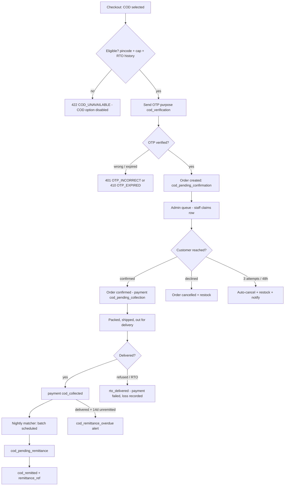
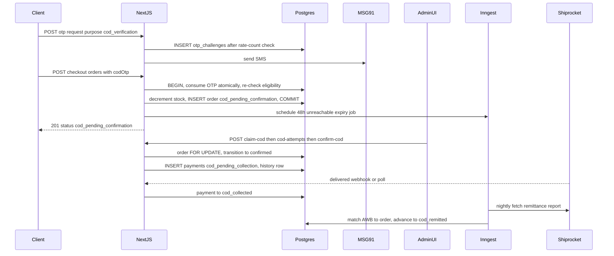
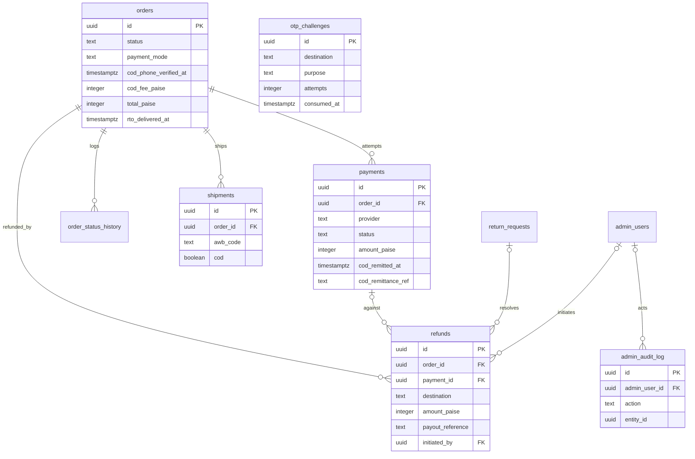
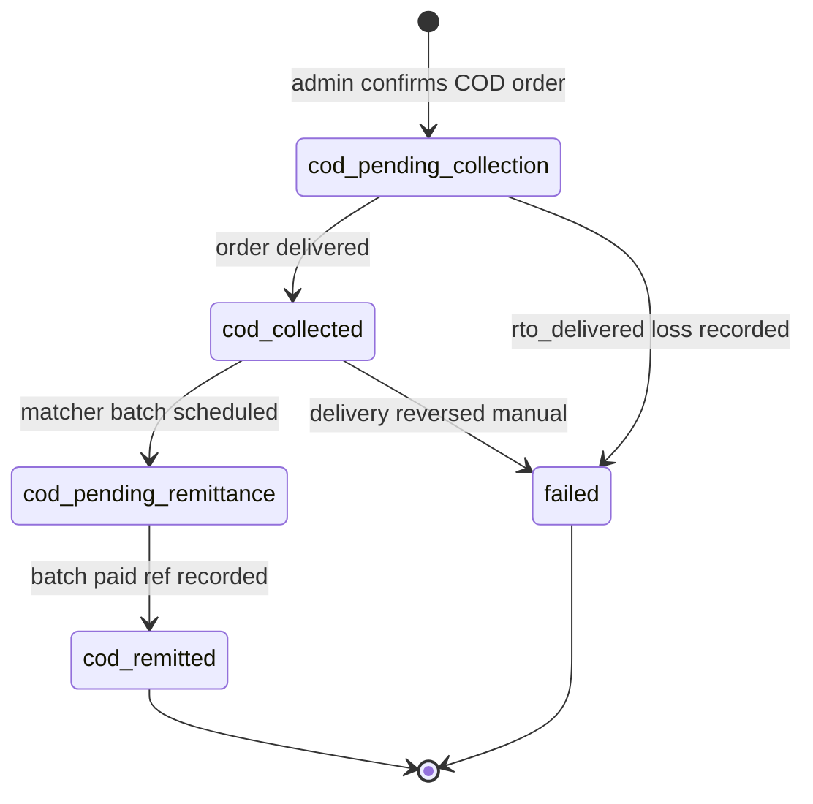

# Cash on Delivery — Lifecycle & Confirmation Queue (Phase 2)

> Module spec for KAKOA's first-class COD path: OTP-verified placement, admin confirmation queue (claiming, attempt logging, auto-cancel), the four-state COD payment lifecycle, Shiprocket remittance matching, RTO loss recording, and manual COD refunds. Sources of truth: `docs/DATABASE_ERD.md`, `PROJECT_PLAN.md` §3.0 Contract + §3.8, risk-engineering Modules 3/4/6/10. Owning lanes: Dev C (lifecycle, crons) + Dev D (queue admin UI, `confirm-cod`). Phase 2 (Weeks 6–8).

---

## 1. Field-Level Specification

### 1.1 COD placement (`POST /api/checkout/orders`, COD branch)

| Field | Type | Required | Max | Format / Validation | Error message on failure |
|---|---|---|---|---|---|
| `paymentMode` | string enum | yes | — | Exactly `'cod'` or `'prepaid'` (zod enum) | "Choose a payment method to continue." |
| `contact.phone` | string | yes | 13 | Normalize to E.164, then `^\+91[6-9][0-9]{9}$` (matches `orders.contact_phone` CHECK) | "Enter a valid 10-digit Indian mobile number." |
| `codOtp.challengeId` | string (uuid) | yes when `paymentMode='cod'` | 36 | `^[0-9a-f]{8}-[0-9a-f]{4}-[0-9a-f]{4}-[0-9a-f]{4}-[0-9a-f]{12}$` | "Please verify your phone number to place a COD order." |
| `codOtp.code` | string | yes when `paymentMode='cod'` | 6 | `^\d{6}$`; verified against `otp_challenges` row with `purpose='cod_verification'`, `destination` = normalized phone, `consumed_at IS NULL`, `expires_at > now()`, `attempts < 5` | Wrong code → "That code isn't right. {attemptsLeft} attempts left." · Expired/exhausted → "This code has expired. Request a new one." |
| `shippingAddress.pincode` | string | yes | 6 | `^[1-9][0-9]{5}$` AND present in the pincode dataset AND COD-serviceable per Shiprocket | "COD isn't available for this pincode. You can pay online instead." |
| `expectedTotalPaise` | integer | yes | — | `> 0`; server recomputes; COD additionally requires recomputed total `<= cod_max_order_paise` (config, default 300000 = ₹3,000) | "Cash on Delivery is available for orders up to ₹3,000. Please pay online for this order." |

**Eligibility predicate (evaluated at every quote AND again inside the placement transaction):**
`codEligible = pincodeCodServiceable(pincode) AND total_paise <= cod_max_order_paise AND NOT rtoBlocked(contact_phone)` where `rtoBlocked(phone)` = count of this phone's COD orders with `rto_delivered_at IS NOT NULL` in the last 180 days `>= cod_rto_block_threshold` (config, default 2), computed via `orders_phone_idx`. Failure of any leg → 422 `COD_UNAVAILABLE`, message: "COD isn't available for this order. Please choose online payment." (identical message for all three legs — no fraud-signal oracle).

### 1.2 Admin: claim (`POST /api/admin/orders/[id]/claim-cod`) — no body

### 1.3 Admin: contact attempt (`POST /api/admin/orders/[id]/cod-attempts`)

| Field | Type | Required | Max | Validation | Error message |
|---|---|---|---|---|---|
| `channel` | string enum | yes | — | One of `'call'`, `'whatsapp'`, `'sms'` | "Select how you contacted the customer." |
| `note` | string | no | 500 | Trimmed; control characters stripped; stored raw, rendered encoded | "Note is too long (max 500 characters)." |

### 1.4 Admin: confirm/decline (`POST /api/admin/orders/[id]/confirm-cod`)

| Field | Type | Required | Max | Validation | Error message |
|---|---|---|---|---|---|
| `outcome` | string enum | yes | — | Exactly `'confirmed'` or `'cancelled'` (zod enum, per §3.8 DoD) | "Outcome must be confirmed or cancelled." |
| `note` | string | no | 500 | As 1.3 `note` | "Note is too long (max 500 characters)." |

### 1.5 Admin: manual COD refund (`POST /api/admin/orders/[id]/refunds`, owner)

| Field | Type | Required | Max | Validation | Error message |
|---|---|---|---|---|---|
| `amountPaise` | integer | yes | — | `> 0` AND `<=` refundable balance (collected − already refunded) | "Refund exceeds the amount collected. Refundable: {formatPaise(refundablePaise)}." |
| `destination` | string enum | yes | — | `'bank_transfer'` or `'upi'` for COD (never `'original_method'` — there is no gateway payment) | "COD refunds must go to a bank account or UPI ID." |
| `payoutReference` | string | yes for COD | 30 | UTR `^[A-Za-z0-9]{12,22}$` or UPI ref `^\d{12}$`; uppercased + trimmed | "Enter the UTR or UPI reference number of the completed payout." |
| `reason` | string | yes | 500 | Non-empty after trim | "A refund reason is required." |
| `returnRequestId` | string (uuid) | no | 36 | Must reference an existing `return_requests` row for this order | "Return request not found for this order." |

### 1.6 Remittance report line (Shiprocket CSV/API, nightly matcher input)

| Field | Type | Required | Validation | On failure |
|---|---|---|---|---|
| `awb_code` | string | yes | Must match a `shipments.awb_code` with `cod = true` | Line logged `unmatched_awb`, surfaced in ops view — never silently dropped |
| `remitted_amount_paise` | integer | yes | Must equal `orders.total_paise` of the matched order | Mismatch → line flagged `amount_mismatch`, payment NOT advanced, alert |
| `remittance_ref` (batch id) | string | yes | Non-empty; stored to `payments.cod_remittance_ref` | Line flagged `missing_ref`, held |

---

## 2. Workflow / User Flow

1. **Checkout, payment step:** client calls `GET /api/shipping/serviceability?pincode=&cod=true`; if `codAvailable=false` the COD radio is disabled with "COD not available for this pincode/order value". Eligibility is recomputed on every step render and again at submission (cart edits on review can flip it).
2. **COD OTP:** customer selects COD → client requests OTP (`purpose='cod_verification'`, Class C limits) → MSG91 SMS → customer enters 6 digits.
3. **Place order:** `POST /api/checkout/orders` with `codOtp`. Server, in one transaction: consume OTP atomically → re-check full eligibility → decrement stock → create order `status='cod_pending_confirmation'` with `cod_phone_verified_at = now()` and `cod_fee_paise` snapshotted from `store_settings.cod_fee_paise` (₹49) → schedule the 48h unreachable-expiry Inngest job. **No `payments` row yet.**
   - OTP wrong → 401 `OTP_INCORRECT`; expired/5th attempt → 410 `OTP_EXPIRED`; eligibility flipped → 422 `COD_UNAVAILABLE`; stock gone → 409 `OUT_OF_STOCK`.
4. **Success page:** "Order placed — we'll confirm by phone before dispatch."
5. **Queue:** order appears in the admin COD confirmation queue (age-sorted, fed by `orders_open_ops_idx`).
6. **Claim:** staff clicks "Handle" → `claim-cod` soft lock (visible assignee, 15-min auto-release). Another admin claiming → 409 `CONFLICT`.
7. **Contact:** staff calls/WhatsApps; every attempt logged via `cod-attempts` (channel, timestamp, actor).
8. **Outcome:**
   - **Confirmed** → `confirm-cod {outcome:'confirmed'}`: order `cod_pending_confirmation → confirmed`, `payments` row created (`provider='cod'`, `method='cod'`, `amount_paise = total_paise`, `status='cod_pending_collection'`), history written, fulfillment push triggered.
   - **Declined** (customer cancels on call) → `{outcome:'cancelled'}`: order → `cancelled`, stock restocked (`inventory_adjustments` reason `order_cancelled`, idempotent via `inv_adj_once_per_cause_idx`), customer notified.
   - **Unreachable** → attempts accumulate; after **3 logged attempts over 48h** (or 48h elapsed with fewer), the Inngest job auto-cancels: restock + SMS/email "we couldn't reach you".
9. **Delivery:** shipment `delivered` (webhook/poll) → order `delivered`, payment `cod_pending_collection → cod_collected` (cash is with the courier).
10. **Remittance (~7–8 days post-delivery):** nightly matcher pulls the Shiprocket remittance report, matches AWB → order → payment: batch scheduled ⇒ `cod_collected → cod_pending_remittance`; batch paid out ⇒ `→ cod_remitted` with `cod_remitted_at` + `cod_remittance_ref`.
11. **Overdue:** `delivered + 14d` and not remitted → `cod_remittance_overdue` alert with amount owed (RTO-closed orders excluded).
12. **RTO:** customer refuses/NDR exhausts → `rto_initiated → rto_delivered`; payment → `failed` (loss recorded), stock disposition `rto_restock` or `damage_writeoff` per heat-sensitivity, phone feeds the repeat-RTO signal.



---

## 3. System Design



**External dependencies and exact failure behavior:**

| Service | Used for | When down / timing out |
|---|---|---|
| MSG91 (SMS OTP) | `cod_verification` OTP at placement | OTP request returns 502 `UPSTREAM_ERROR`; UI: "We couldn't send the code. Try again, or pay online to complete your order now." COD cannot be placed without OTP — prepaid remains available. 5s timeout, no auto-retry (customer-initiated resend under Class C limits). |
| Shiprocket serviceability | pincode COD availability | 502 → UI banner "standard only, verified at dispatch"; **COD is disabled conservatively** (fail-closed) until serviceability is confirmable — never fail-open into an unserviceable COD order. Stale cache (≤24h) is served before erroring. |
| Shiprocket remittance report | nightly matcher | Job retries with Inngest backoff (3 attempts); on final failure marks its run failed and skips the night — the matcher is idempotent, next night catches up. Dead-man switch (healthchecks.io) pages if the cron stops firing. |
| Shiprocket tracking (webhook/poll) | `delivered` → `cod_collected` | Webhook missed ⇒ 30-min poller repairs (Fulfillment module); COD collection state is downstream of order `delivered`, never of the webhook directly. |

**Caching:** (1) serviceability responses keyed `pincode|cod` — 24h TTL, invalidated only by expiry (risk M3 #3 accepts staleness; `fulfillment_blocked` is the safety net). (2) `store_settings` (`cod_fee_paise`, `cod_max_order_paise`, `cod_rto_block_threshold`) — cached per instance 60s, tag-revalidated on admin settings save. (3) Queue/remittance admin views: **no caching** — always dynamic (money truth must be live).

---

## 4. Database Schema

DDL reproduced verbatim from `docs/DATABASE_ERD.md`. This module owns rows in `payments` and `refunds`, consumes `otp_challenges`, and reads/transitions `orders` (COD columns) — no new tables. Claims and contact attempts are recorded in `admin_audit_log` (actions `cod.claim`, `cod.release`, `cod.contact_attempt`) — an active claim is the latest `cod.claim` row for the order within 15 minutes with no later `cod.release`; the DB is the authority, no separate lock table.

### `payments` (ERD §3.17)

| Column | Type | Constraints | Notes |
|---|---|---|---|
| `id` | `uuid` | `PRIMARY KEY DEFAULT gen_random_uuid()` | |
| `order_id` | `uuid` | `NOT NULL REFERENCES orders(id) ON DELETE CASCADE` | |
| `provider` | `payment_provider` | `NOT NULL` | |
| `provider_order_id` | `text` | | razorpay_order_id (`'order_xxx'`) |
| `provider_payment_id` | `text` | | razorpay_payment_id (`'pay_xxx'`) |
| `method` | `payment_method` | `NOT NULL DEFAULT 'unknown'` | |
| `status` | `payment_status` | `NOT NULL DEFAULT 'created'` | |
| `amount_paise` | `integer` | `NOT NULL CHECK (amount_paise > 0)` | |
| `amount_refunded_paise` | `integer` | `NOT NULL DEFAULT 0 CHECK (amount_refunded_paise <= amount_paise)` | |
| `signature_verified` | `boolean` | `NOT NULL DEFAULT false` | checkout HMAC verified (webhook may also confirm) |
| `failure_code` | `text` | | |
| `failure_reason` | `text` | | |
| `cod_remitted_at` | `timestamptz` | | |
| `cod_remittance_ref` | `text` | | Shiprocket COD remittance batch id |
| `raw_payload` | `jsonb` | | last provider payload for debugging |
| `created_at` | `timestamptz` | `NOT NULL DEFAULT now()` | |
| `updated_at` | `timestamptz` | `NOT NULL DEFAULT now()` | |

```sql
CREATE UNIQUE INDEX payments_provider_payment_idx ON payments (provider, provider_payment_id)
  WHERE provider_payment_id IS NOT NULL;
CREATE UNIQUE INDEX payments_provider_order_idx ON payments (provider, provider_order_id)
  WHERE provider_order_id IS NOT NULL;
CREATE INDEX payments_order_idx ON payments (order_id);
CREATE INDEX payments_cod_remit_idx ON payments (status) WHERE status IN ('cod_collected','cod_pending_remittance');
```

### `refunds` (ERD §3.18)

| Column | Type | Constraints | Notes |
|---|---|---|---|
| `id` | `uuid` | `PRIMARY KEY DEFAULT gen_random_uuid()` | |
| `order_id` | `uuid` | `NOT NULL REFERENCES orders(id) ON DELETE CASCADE` | |
| `payment_id` | `uuid` | `REFERENCES payments(id) ON DELETE SET NULL` | |
| `return_request_id` | `uuid` | `REFERENCES return_requests(id) ON DELETE SET NULL` | |
| `provider_refund_id` | `text` | | `'rfnd_xxx'` |
| `destination` | `refund_destination` | `NOT NULL` | |
| `amount_paise` | `integer` | `NOT NULL CHECK (amount_paise > 0)` | |
| `status` | `refund_status` | `NOT NULL DEFAULT 'initiated'` | |
| `reason` | `text` | `NOT NULL` | |
| `payout_reference` | `text` | | UTR / UPI ref for manual COD refunds |
| `initiated_by` | `uuid` | `REFERENCES admin_users(id) ON DELETE SET NULL` | |
| `processed_at` | `timestamptz` | | |
| `created_at` | `timestamptz` | `NOT NULL DEFAULT now()` | |
| `updated_at` | `timestamptz` | `NOT NULL DEFAULT now()` | |

### `orders` — COD-relevant columns (ERD §3.14, excerpt; full table owned by Checkout module)

| Column | Type | Constraints | Notes |
|---|---|---|---|
| `status` | `order_status` | `NOT NULL` | includes `'cod_pending_confirmation'` |
| `payment_mode` | `payment_mode` | `NOT NULL` | |
| `contact_phone` | `text` | `NOT NULL CHECK (contact_phone ~ '^\+91[6-9][0-9]{9}$')` | |
| `cod_phone_verified_at` | `timestamptz` | | set when COD OTP passed at placement |
| `cod_fee_paise` | `integer` | `NOT NULL DEFAULT 0 CHECK (cod_fee_paise >= 0)` | SNAPSHOT |
| `total_paise` | `integer` | `NOT NULL CHECK (total_paise >= 0)` | remittance amount-match reference |
| `rto_delivered_at` | `timestamptz` | | feeds repeat-RTO blocklist |

```sql
CREATE INDEX orders_open_ops_idx ON orders (placed_at)                   -- admin ops queue: partial, tiny & hot
  WHERE status IN ('cod_pending_confirmation','confirmed','packed');
CREATE INDEX orders_phone_idx    ON orders (contact_phone);              -- guest lookup + COD abuse checks
```

### `otp_challenges` (ERD §3.8) — consumed with `purpose='cod_verification'`

| Column | Type | Constraints | Notes |
|---|---|---|---|
| `id` | `uuid` | `PRIMARY KEY DEFAULT gen_random_uuid()` | |
| `channel` | `otp_channel` | `NOT NULL` | |
| `destination` | `text` | `NOT NULL` | E.164 phone or lowercased email |
| `purpose` | `otp_purpose` | `NOT NULL` | |
| `code_hash` | `text` | `NOT NULL` | `sha256(code || pepper)` |
| `context` | `jsonb` | | e.g. `{"order_number":"KK-48210"}` for order_lookup |
| `attempts` | `integer` | `NOT NULL DEFAULT 0 CHECK (attempts <= 5)` | |
| `expires_at` | `timestamptz` | `NOT NULL` | |
| `consumed_at` | `timestamptz` | | |
| `created_at` | `timestamptz` | `NOT NULL DEFAULT now()` | |
| `ip` | `inet` | | |



---

## 5. API Design

Envelope: Contract §2.1 `ApiResult<T>`. Common errors (400 `VALIDATION_ERROR`, 401 `UNAUTHORIZED`, 403 `FORBIDDEN`, 429 `RATE_LIMITED`, 500 `INTERNAL`) apply everywhere and are not repeated.

### `GET /api/shipping/serviceability?pincode=560001&cod=true` — public · Class A (120/min/IP)
Response: `{ serviceable: boolean; codAvailable: boolean; options: [{option, feePaise, etaDaysMin, etaDaysMax}] }`. Errors: 400 (bad pincode), 422 `PINCODE_UNSERVICEABLE`, 502 `UPSTREAM_ERROR` (Shiprocket down — UI falls back "standard only, verified at dispatch", COD disabled).

### `POST /api/checkout/orders` (COD branch) — public (cart cookie) | customer · Class D (10/min/session)
Request: `{ idempotencyKey, contact{phone, email?}, shippingAddress, billingAddress?, deliveryOption, paymentMode:'cod', couponCode?, customerNote?, expectedTotalPaise, codOtp{challengeId, code} }`
Response 201: `{ orderId, orderNumber, accessToken, status: 'cod_pending_confirmation' }`
Errors: 401 `OTP_INCORRECT` (details `{attemptsLeft}`) · 410 `OTP_EXPIRED` · 422 `COD_UNAVAILABLE` · 422 `PINCODE_UNSERVICEABLE` · 409 `OUT_OF_STOCK` (details `[{variantId, requested, available}]`) · 409 `PRICE_CHANGED` (details: fresh quote) · 409 `DUPLICATE_REQUEST` (replays original 201 body via `idempotency_key` UNIQUE) · 410 `CART_EXPIRED` · 422 coupon codes.
**Idempotency:** `orders.idempotency_key UNIQUE`; OTP consumed atomically (`UPDATE otp_challenges SET consumed_at = now() WHERE id = $1 AND consumed_at IS NULL AND expires_at > now()` — zero rows = loser) so a double-submit cannot verify twice.

### `POST /api/admin/orders/[id]/claim-cod` — admin:staff · Class E (600/min) · additive v1.1
No body. Soft-claims a `cod_pending_confirmation` row; writes `admin_audit_log` action `cod.claim`. Response: `{ claimedBy: {adminId, name}, claimExpiresAt }` (now + 15 min). Errors: 404 `NOT_FOUND` · 409 `CONFLICT` (actively claimed by another admin, details `{claimedBy, claimExpiresAt}`) · 422 `INVALID_TRANSITION` (order not in `cod_pending_confirmation`). Re-claim by the same admin refreshes the window (200, not 409).

### `POST /api/admin/orders/[id]/cod-attempts` — admin:staff · Class E · additive v1.1
Request: `{ channel: 'call'|'whatsapp'|'sms', note? }` → 201 `{ attempt: {id, channel, actor, createdAt}, attemptCount }`. Writes `admin_audit_log` action `cod.contact_attempt`. Errors: 404 · 422 `INVALID_TRANSITION` (not in `cod_pending_confirmation`).

### `POST /api/admin/orders/[id]/confirm-cod` — admin:staff · Class E
Request: `{ outcome: 'confirmed'|'cancelled', note? }`.
- `confirmed`: order row `FOR UPDATE` → `cod_pending_confirmation → confirmed` via `ORDER_TRANSITIONS`; INSERT `payments` (`provider='cod'`, `method='cod'`, `status='cod_pending_collection'`, `amount_paise = total_paise`); history row `actor_type='admin'`; cancel the pending 48h expiry job. Response: `{ order: {id, status:'confirmed'}, payment: {id, status:'cod_pending_collection'} }`.
- `cancelled`: order → `cancelled` + restock (`inventory_adjustments` reason `order_cancelled`, idempotent) + customer notification.
Errors: 404 · 422 `INVALID_TRANSITION` (not in `cod_pending_confirmation` — details `{allowed}`). **Idempotent:** repeat call on an already-transitioned order returns 422, never a second payment row (guarded by the state check under the order lock).

### `POST /api/admin/orders/[id]/refunds` (COD manual payout) — **admin:owner** · Class E
Request: `{ amountPaise, reason, destination: 'bank_transfer'|'upi', payoutReference, returnRequestId? }` → 201 `{ refund }` with `status='processed'`, `processed_at=now()` (the payout already happened outside the system; this records it). Updates `payments.amount_refunded_paise`. Errors: 422 `REFUND_EXCEEDS_PAID` (details `{refundablePaise}`) · 422 `VALIDATION_ERROR` (missing `payoutReference` for COD, bad UTR/UPI format) · 409 `CONFLICT` (refund already in flight) · 404.

### Inngest jobs (module contract, not HTTP)

| Job | Schedule | Behavior |
|---|---|---|
| `cod/unreachable-expiry` | per-order, +48h from placement | If order still `cod_pending_confirmation` AND (3 attempts logged OR 48h elapsed): auto-cancel + restock + notify. Cancelled/confirmed orders no-op. |
| `reconcile/cod-remittance` | nightly (IST) | Fetch Shiprocket remittance report → for each line: AWB → `shipments.awb_code` → order → payment (scan via `payments_cod_remit_idx`); amount-match against `total_paise`; advance `cod_collected → cod_pending_remittance → cod_remitted`, set `cod_remitted_at` + `cod_remittance_ref`. Idempotent: already-`cod_remitted` lines skip. Run log `{lines, matched, unmatched_awb, amount_mismatch}`. |
| `alerts/cod-remittance-overdue` | nightly, after matcher | Orders `delivered_at < now() - interval '14 days'` with payment in (`cod_collected`,`cod_pending_remittance`) → `cod_remittance_overdue` alert with summed amount owed. Excludes orders with `rto_delivered_at IS NOT NULL`. |
| `cod/claim-auto-release` | implicit | No cron needed: claim validity is computed (`claimed_at + 15 min > now()`) at read time; expired claims simply stop blocking. |

---

## 6. Security Standards

- **Rate limits (Contract classes):** serviceability Class A (120/min per IP); COD OTP request Class C (1/60s + 3/10min + 10/day per destination; 20/hr per IP; verify 5 attempts per challenge then 410) — enforced authoritatively by counting `otp_challenges` rows; placement Class D (10/min per session); all `/api/admin/*` COD routes Class E (600/min per admin session). 429 responses carry `Retry-After` + code `RATE_LIMITED`.
- **Input sanitization:** zod on every payload; phone normalized to E.164 before any comparison; `note` fields control-char-stripped, stored raw, output-encoded everywhere (admin UI is a stored-XSS target); remittance CSV parsed with a strict schema — AWB values are lookup keys only, never interpolated into SQL (Drizzle parameterized) and never rendered unencoded; CSV formula-injection guarded on any admin export (`=`,`+`,`-`,`@` prefixed cells escaped).
- **Authz:** claim/attempt/confirm = `admin:staff`; refunds route = `admin:owner` (staff hitting it → 403 `FORBIDDEN`, negative-tested); refunds above ₹5,000 (config) require owner regardless; staff cannot approve refunds for flagged serial-refund identities. Customer-facing COD placement requires the OTP-proved phone — `cod_phone_verified_at` is set only by atomic OTP consumption, never by client assertion.
- **Encryption at rest:** Supabase disk encryption baseline; COD refund bank/UPI collection fields (Returns module) encrypted at rest with admin access audited; `payout_reference` itself is non-secret (a UTR) but stored only alongside audited refund rows.
- **NEVER logged:** OTP codes (plain or partial), `code_hash` inputs, full contact phone in payment/queue logs (hash or mask to `+91******1234`), customer bank account/UPI handles, `payout_reference` in structured logs (audit rows only).
- **OWASP specifics:** (A01 broken access control) IDOR on `orders/[id]` admin routes — every handler re-checks admin session + role, order id is uuid; (A04) COD eligibility oracle — one generic `COD_UNAVAILABLE` message for cap/pincode/blocklist so fraudsters can't probe the RTO blocklist; (A07) OTP brute force — 5-attempt cap in the DB CHECK, constant-time hash compare; (A08 integrity) remittance report treated as untrusted input: amount-match against our `total_paise` before any state advance; (business logic) placement double-submit → `idempotency_key` UNIQUE + atomic OTP consume.

---

## 7. Edge Cases

1. **Customer unreachable** — 3 attempts logged (channel, timestamp, actor) over 48h → auto-cancel with stock release + notification; queue age-sorts and shows attempt history (risk M4 #10).
2. **Two staff call the same customer** — row claiming: "handling" soft lock with visible assignee and 15-min auto-release; attempt log prevents a second call within minutes by different staff (risk M10 #5).
3. **Staff member removed with in-flight claims** — deactivation revokes sessions and auto-releases their claimed COD rows; audit rows keep the actor id (SET NULL FK, never CASCADE) (risk M10 #9).
4. **COD offered then ineligible mid-checkout** — cart edits on the review step push total over ₹3,000 or change pincode: eligibility recomputed on every step render AND inside the placement transaction; server is the last word → 422 `COD_UNAVAILABLE` even if the UI showed COD (risk M3 #9).
5. **Exactly ₹3,000.00 order** — cap is inclusive: `total_paise <= 300000` passes at exactly 300000; 300001 fails. Boundary unit-tested; cap read from config at quote time and re-read at placement (no snapshot — policy is live).
6. **OTP race: two placement submits with the correct code** — atomic consume (`WHERE consumed_at IS NULL`); one wins, the loser gets 410 `OTP_EXPIRED`; combined with `idempotency_key` the same client retry replays the original 201 instead (risk M7 #4 pattern).
7. **Delivered but never remitted** — Shiprocket remittance expected ~day 7–8; `delivered + 14d` without remittance → `cod_remittance_overdue` alert with amount owed. Untested reconciliation = silent revenue loss (risk M4 #11).
8. **Remittance line with unknown AWB or wrong amount** — unmatched AWB logged `unmatched_awb` and surfaced in the ops view; amount mismatch flags the line and does NOT advance the payment (partial short-remittance is a dispute, not a state change).
9. **RTO after dispatch (20–30% of COD)** — `rto_delivered`: payment → `failed` (loss recorded, no remittance expected — excluded from overdue alerting); stock disposition `rto_restock` or `damage_writeoff` per heat-sensitivity flag; phone counted toward the repeat-RTO blocklist (risk M6 #7).
10. **Repeat-RTO phone at placement** — ≥2 COD RTOs in 180 days on the phone → COD blocked with the generic message; prepaid always remains available (blocklist is COD-only, never a purchase ban).
11. **Confirm-cod replay / double-click** — second call finds the order already `confirmed` under `FOR UPDATE` → 422 `INVALID_TRANSITION`; exactly one `payments` row ever exists per confirmed COD order.
12. **Claim expiry mid-call** — staff holds the phone past 15 min; UI shows "claim expired, re-claim to continue" rather than silently allowing a second claimer; re-claim by the original admin refreshes the lock.
13. **COD refund (return after delivery)** — no gateway payment to refund against: owner executes a bank/UPI payout outside the system, then records it with `destination` + mandatory validated `payoutReference`; balance-checked against collected amount (risk M9 #4).

---

## 8. State Machine

**COD payment lifecycle** (`payments.status`, COD subset of `payment_status` — Contract §1.17, normative). Entry: row created at `cod_pending_collection` when admin confirms the order. Full matrix table-tested in `packages/core` next to `order-state-machine.ts`; illegal transitions rejected.

| From | To | Trigger |
|---|---|---|
| *(row created)* | `cod_pending_collection` | admin `confirm-cod {outcome:'confirmed'}` |
| `cod_pending_collection` | `cod_collected` | order reaches `delivered` (webhook or poll) |
| `cod_pending_collection` | `failed` | RTO delivered — loss recorded, no cash coming |
| `cod_collected` | `cod_pending_remittance` | nightly matcher: AWB found in a scheduled remittance batch |
| `cod_collected` | `failed` | delivery reversed to RTO after a bad courier scan (manual, admin-audited) |
| `cod_pending_remittance` | `cod_remitted` | batch paid out — `cod_remitted_at` + `cod_remittance_ref` set |

Terminal: `cod_remitted`, `failed`. The order-side gate (`cod_pending_confirmation → confirmed | cancelled`) lives in the order state machine (Checkout module) and is referenced, not redefined, here.



---

## 9. Testing Requirements

**Unit (`packages/core`, ≥95% coverage on state machine + money math — CI-gated):**
- COD payment state machine: full matrix, every state × every event, legal and illegal, table-driven.
- Eligibility predicate: pincode leg, cap boundary (299999 / 300000 / 300001 paise), RTO-blocklist leg (1 vs 2 RTOs, 179 vs 181 days), and the generic-error property (all failures produce identical code + message).
- Confirmation-attempt policy: 3 attempts/48h — 2 attempts at 47h (no cancel), 3rd attempt triggers, 48h elapsed with 1 attempt triggers.
- Claim/auto-release timing: claim, expiry at exactly 15 min, re-claim, same-admin refresh.
- Remittance amount-match: exact match advances, ±1 paisa flags.
- `payout_reference` regex fixtures (valid UTR, 12-digit UPI ref, lowercase input uppercased, 11-char reject).

**Integration (ephemeral Postgres):**
- Placement: OTP consumed atomically under two concurrent submits — one order, one consumption, loser 410.
- `confirm-cod` called twice concurrently → one transition, one `payments` row (order `FOR UPDATE` proof).
- Claim race: two admins claim simultaneously → one 200, one 409 with `claimedBy` details.
- Unreachable-expiry job vs. admin confirm race → single winner via the order lock; confirmed order is never auto-cancelled.
- Remittance matcher replayed on the same report file twice → zero additional state changes (idempotency proof); unknown-AWB and amount-mismatch fixture lines land in the flag log, payments untouched.
- Overdue alert query excludes an `rto_delivered` COD order seeded at delivered+20d.
- Staff hits the refunds route → 403; owner refund exceeding collected balance → 422 `REFUND_EXCEEDS_PAID` with `refundablePaise`.

**E2E (Playwright):**
1. *COD queue workflow* — COD order placed with test-mode OTP → lands in queue → staff claims → logs a call attempt → confirms → order `confirmed`, payment `cod_pending_collection`; a second staff session sees the claimed state throughout.
2. *COD full lifecycle to remitted* — confirmed COD order → mocked Shiprocket delivered event → payment `cod_collected` → seeded remittance report run → `cod_remitted` with `cod_remittance_ref` visible in the admin remittance view.
3. *COD unreachable auto-cancel* — placed COD order, 3 attempts logged, clock advanced past 48h → auto-cancelled, stock restored, notification fired, queue row gone.

---

## 10. Definition of Done

- [ ] COD placement requires atomic OTP consume; `cod_phone_verified_at` set in the placement transaction, never by a separate write
- [ ] Eligibility (pincode COD serviceability + `cod_max_order_paise` cap + repeat-RTO blocklist) enforced at quote AND inside placement; single generic `COD_UNAVAILABLE` message; fail-closed when Shiprocket serviceability is down
- [ ] `cod_fee_paise` snapshotted from `store_settings` onto every COD order; participates in the `total_paise` CHECK
- [ ] Confirmation queue live: age-sorted list off `orders_open_ops_idx`, claim/15-min auto-release/visible assignee, attempt logging (channel + timestamp + actor), `pendingCodConfirmations` on the admin dashboard
- [ ] 3-attempts/48h auto-cancel job scheduled per order, cancelled on confirm, restock idempotent via `inv_adj_once_per_cause_idx`
- [ ] `confirm-cod` transitions under `FOR UPDATE`; exactly one `payments` row per confirmed COD order; replay returns 422, never duplicates
- [ ] Full COD payment lifecycle (`cod_pending_collection → cod_collected → cod_pending_remittance → cod_remitted`; RTO ⇒ `failed`) table-tested in `packages/core`, illegal transitions rejected
- [ ] Nightly remittance matcher (AWB → order, amount-matched) idempotent, run-logged `{lines, matched, unmatched_awb, amount_mismatch}`, dead-man switch wired
- [ ] `cod_remittance_overdue` alert at delivered+14d with amount owed; RTO-closed orders excluded — verified by test
- [ ] RTO loss recording: payment `failed`, disposition ledger row (`rto_restock`/`damage_writeoff`), phone feeds the blocklist
- [ ] Manual COD refunds owner-only with mandatory validated `payout_reference`, balance-checked (`REFUND_EXCEEDS_PAID`), written to `admin_audit_log`
- [ ] No OTP codes, full phones, or payout references in structured logs (masking asserted by a log-scrub test)
- [ ] Rate limits A/C/D/E wired with `X-RateLimit-*` headers; staff-vs-owner negative authz tests green
- [ ] 3 E2E scenarios green in CI; bus-factor review rule (Dev C/D + B/E) enforced on every PR
