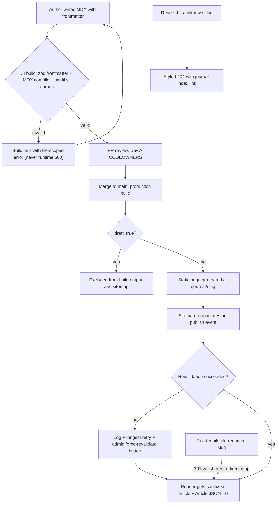
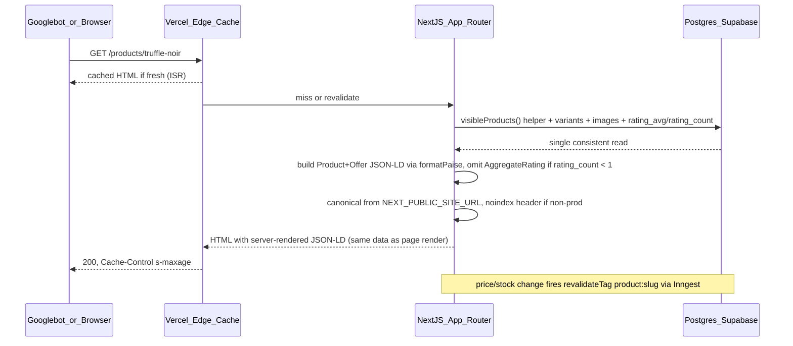
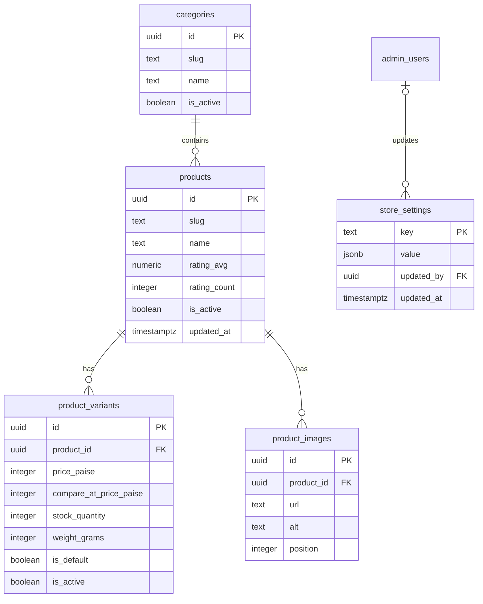

# Module Spec — Content, Blog & SEO (Phase 1)

> Source of truth: PROJECT_PLAN.md §3.7 (Module 24), Contract §3.0 (v1.0.0), docs/DATABASE_ERD.md, risk-engineering Module 12.
> Owning lane: **Dev A** (Storefront & SEO). Phase 1 (W3–5) static pages/journal/legal; Phase 2 (W6–8) dedicated SEO pass (JSON-LD, sitemap, OG). All money `*_paise` integers; all timestamps `timestamptz` UTC (IST display).

---

## 1. Field-Level Specification

### 1.1 MDX journal frontmatter (zod-validated at build; invalid frontmatter **fails `next build`** — never a runtime 500)

Files: `apps/web/content/journal/*.mdx` (6 articles carried from the prototype).

| Field | Type | Required | Max length | Format / validation rule | Build-time error message (fails `next build`) |
|---|---|---|---|---|---|
| `title` | string | yes | 120 | `.trim().min(3).max(120)` | `journal/<file>: "title" must be 3–120 characters` |
| `slug` | string | yes | 80 | `^[a-z0-9]+(?:-[a-z0-9]+)*$` (same class as `products.slug` CHECK `^[a-z0-9-]+$`, tightened to forbid leading/trailing/double hyphens); must be unique across all journal files | `journal/<file>: "slug" must match ^[a-z0-9]+(?:-[a-z0-9]+)*$` / `journal/<file>: duplicate slug "<slug>" also used by <other-file>` |
| `description` | string | yes | 160 | `.trim().min(20).max(160)` (meta description + `Article` JSON-LD `description`) | `journal/<file>: "description" must be 20–160 characters (it becomes the meta description)` |
| `publishedAt` | string | yes | 10 | `^\d{4}-\d{2}-\d{2}$` AND a real calendar date AND not in the future (compared in UTC) | `journal/<file>: "publishedAt" must be a valid past-or-today date in YYYY-MM-DD format` |
| `updatedAt` | string | no | 10 | Same rule as `publishedAt`; must be `>= publishedAt` | `journal/<file>: "updatedAt" must be a valid date >= publishedAt` |
| `heroImage` | string | yes | 300 | Root-relative path `^\/images\/journal\/[a-z0-9\/._-]+\.(jpg|jpeg|png|webp|avif)$`; file must exist in `apps/web/public` at build | `journal/<file>: "heroImage" must be a root-relative path under /images/journal/ pointing to an existing file` |
| `heroAlt` | string | yes | 200 | `.trim().min(5).max(200)` | `journal/<file>: "heroAlt" is required (5–200 chars) — accessibility budget is CI-blocking` |
| `author` | string | no | 60 | `.trim().max(60)`, default `"KAKOA"` | `journal/<file>: "author" must be at most 60 characters` |
| `tags` | string[] | no | 6 items | Each `^[a-z0-9-]{2,24}$`; max 6; deduped | `journal/<file>: "tags" — each tag must match ^[a-z0-9-]{2,24}$, max 6 tags` |
| `draft` | boolean | no | — | strict boolean, default `false`; `draft: true` posts are excluded from build output AND sitemap | `journal/<file>: "draft" must be true or false (unquoted)` |

Schema is `.strict()` — unknown frontmatter keys fail the build: `journal/<file>: unknown frontmatter key "<key>"`.

### 1.2 Contact form (`/contact` — server action → Resend to `store_settings.support_email`)

| Field | Type | Required | Max length | Validation rule (zod, `.strict()`) | User-facing error message |
|---|---|---|---|---|---|
| `name` | text | yes | 80 | `.trim().min(2).max(80)`, regex `^[\p{L}\p{M}'. -]+$` (Unicode letters, spaces, apostrophes, dots, hyphens) | "Please enter your name (2–80 characters, letters only)." |
| `email` | email | yes | 254 | `z.string().trim().toLowerCase().email().max(254)` | "Please enter a valid email address." |
| `phone` | text | no | 13 | If present: `^(\+91)?[6-9]\d{9}$` (normalized to `+91XXXXXXXXXX` before sending) | "Please enter a valid 10-digit Indian mobile number starting with 6–9." |
| `topic` | select | yes | — | Enum: `order`, `product`, `wholesale`, `feedback`, `other` | "Please choose a topic." |
| `orderNumber` | text | no | 20 | If present: `^KK-\d{4,10}$` (order-number display format) | "That doesn't look like a KAKOA order number (e.g. KK-100042)." |
| `message` | textarea | yes | 2000 | `.trim().min(10).max(2000)`; control characters other than `\n`/`\t` stripped | "Please write a message between 10 and 2,000 characters." |
| `website` | hidden | no | 0 | Honeypot — must be empty string; non-empty → silently accept (return ok, send nothing) | (none — bot trap, no error shown) |

Server-side failure (Resend down/timeout): form keeps the user's text intact and shows: **"We couldn't send your message right now. Please retry, or reach us at {support_phone} / {support_email}."** (values read from `store_settings` so the page still fulfills its purpose).

### 1.3 `POST /api/revalidate` body

| Field | Type | Required | Validation rule | Error |
|---|---|---|---|---|
| `tag` | string | yes | Allowlist regex union: `^(product:[a-z0-9-]{1,80}|journal|settings|sitemap)$` — nothing else | 400 `VALIDATION_ERROR`, message: "Unknown revalidation tag." |

### 1.4 Environment (validated by `packages/config` zod boot schema — **build fails**, not runtime)

| Var | Required | Rule | Build failure message |
|---|---|---|---|
| `NEXT_PUBLIC_SITE_URL` | yes | `z.string().url()` AND `^https:\/\/[a-z0-9.-]+$` (https, no trailing slash, no path/query); in `VERCEL_ENV=production` must equal the canonical prod origin | `NEXT_PUBLIC_SITE_URL missing or malformed — canonical URLs cannot be built. Refusing to build.` |
| `VERCEL_ENV` / `NODE_ENV` | yes | Enum `production` \| `preview` \| `development`; non-`production` ⇒ middleware sends `X-Robots-Tag: noindex` and sitemap route returns 404 | `VERCEL_ENV has unexpected value "<v>"` |

### 1.5 Shared formatter contract — `formatPaise()` (`packages/core/src/money.ts`)

| Input (integer paise) | Output (string) | Rule |
|---|---|---|
| `49900` | `"499.00"` | `(paise / 100)` rendered with exactly 2 decimals via integer math: `` `${Math.trunc(p/100)}.${String(p%100).padStart(2,'0')}` `` — never floating point |
| `50` | `"0.50"` | sub-rupee values zero-padded |
| `5` | `"0.05"` | single-digit paise padded |
| `0` | `"0.00"` | zero valid |
| negative / non-integer / `NaN` | **throws** `TypeError("formatPaise requires a non-negative integer")` | JSON-LD builders never emit a price from an invalid input |

Used identically by JSON-LD `offers.price`, OG image text (prefixed `₹`), and UI. One export; string-template duplicates fail code review.

---

## 2. Workflow / User Flow

Primary editorial flow — **publish a journal article** (content is in-repo MDX; "publishing" = merged PR, Dev A is CODEOWNER on `apps/web/content/**`):

1. Author writes `apps/web/content/journal/<slug>.mdx` with frontmatter per §1.1 (optionally `draft: true` while iterating).
2. PR opened → CI runs frontmatter zod validation, MDX compile, rehype-sanitize pipeline, XSS fixture corpus, Lighthouse budgets. **Failure branch:** any invalid frontmatter or MDX compile error fails the build with the exact file-scoped message — nothing broken can reach production.
3. PR reviewed (Dev A CODEOWNERS) and merged → production build statically generates `/journal/[slug]`, excluding `draft: true` posts from output and sitemap.
4. Deploy completes → sitemap regenerates (publish event) → new URL present in the journal chunk with `lastModified` from frontmatter.
5. If ISR/revalidation of `/journal` index fails: failure logged, Inngest retries; **manual escape hatch:** admin "force revalidate" button → `POST /api/revalidate {tag:"journal"}`.
6. Slug rename: author adds an entry to the shared slug-redirect map (same infra as Catalog) → old URL 301s to new; canonicals remain self-referencing absolute on the new URL.
7. Reader visits `/journal/<slug>` → success: sanitized article, hero image, reading time, `Article` + `BreadcrumbList` JSON-LD, prev/next links. Unknown slug → styled 404 (`NOT_FOUND`) with journal-index link; renamed slug → 301.

---

## 3. System Design

Core action — PDP render with structured data (the highest-stakes emission in the module):

**External service dependencies & down/timeout behavior:**

| Dependency | Used for | When down / times out |
|---|---|---|
| Postgres (Supabase Mumbai) | sitemap queries, PDP/JSON-LD data, `store_settings` on Legal/Contact/footer | PDP/sitemap: stale ISR copy keeps serving (never 500 a cached page). `store_settings` read failure on Legal pages: render page with a "details temporarily unavailable" block for the FSSAI/seller section, log at **error** level (missing FSSAI display is a compliance bug) — never 500 a legally required page. Sitemap regeneration failure: alert; previous sitemap keeps serving from cache. |
| Resend | contact form delivery | Server action returns `ApiErr` (`UPSTREAM_ERROR` semantics); UI keeps user text, shows inline retry + `support_phone`/`support_email` fallback from `store_settings`. |
| Inngest | revalidation retry, daily sitemap cron | Publish-revalidation simply not retried automatically → admin force-revalidate button is the manual path; daily cron miss trips the healthchecks.io dead-man switch → alert. |
| healthchecks.io | dead-man switch for daily sitemap cron | If unreachable, cron still runs; ping failure logged (monitoring degraded, function intact). |
| Vercel ImageResponse (OG) | `opengraph-image.tsx` per PDP/journal/category | Render failure falls back to the static brand OG card — never a broken image in a share preview. |

**Caching strategy:**

| What | Mechanism | TTL | Invalidation trigger |
|---|---|---|---|
| `/sitemap.xml` + chunks | edge, `Cache-Control: s-maxage=3600` | 1h | publish events + daily Inngest cron regen |
| Journal pages | SSG at build | build-lifetime | new deploy (content is in-repo) |
| PDP/category metadata + JSON-LD | ISR | route ISR window | `revalidateTag('product:{slug}')` on price/stock/copy change |
| Legal/Contact/footer (`store_settings`) | ISR | route ISR window | `revalidateTag('settings')` on admin settings change — re-render within one ISR window is this module's obligation |
| `/robots.txt` | edge, static per env | deploy-lifetime | deploy |
| Contact form action | none | — | mutation; caching would be wrong |

---

## 4. Database Schema

**This module owns zero tables** (Contract decision §1: blog is MDX in `apps/web/content/journal/**` — no CMS until a non-developer writes content; store locator is static typed data in `apps/web/content/stores.ts`, real India locations TBD by owner — fictional prototype US addresses must not ship). All access below is **read-only**.

Read tables (columns as consumed; DDL verbatim from docs/DATABASE_ERD.md §3.1–3.5):

`store_settings` (ERD §3.1) — full table read for legal display keys:

| Column | Type | Constraints |
|---|---|---|
| `key` | `text` | `PRIMARY KEY` — reads `'fssai_license_number'`, `'seller_gstin'`, `'seller_legal_name'`, `'seller_address'`, `'support_phone'`, `'support_email'` |
| `value` | `jsonb` | `NOT NULL` |
| `updated_by` | `uuid` | `REFERENCES admin_users(id) ON DELETE SET NULL` |
| `updated_at` | `timestamptz` | `NOT NULL DEFAULT now()` |

Columns read from the catalog tables (types verbatim from ERD):

| Table | Columns read | Purpose here |
|---|---|---|
| `products` (§3.3) | `slug text NOT NULL UNIQUE CHECK (slug ~ '^[a-z0-9-]+$')`, `name text NOT NULL`, `blurb`, `description`, `rating_avg numeric(3,2) NOT NULL DEFAULT 0`, `rating_count integer NOT NULL DEFAULT 0`, `is_active boolean NOT NULL DEFAULT true`, `updated_at timestamptz` | sitemap `lastModified`, `Product` JSON-LD, OG text; `AggregateRating` gate |
| `product_variants` (§3.4) | `price_paise integer NOT NULL CHECK (price_paise > 0)` (MRP, GST-inclusive), `compare_at_price_paise`, `stock_quantity integer NOT NULL DEFAULT 0 CHECK (stock_quantity >= 0)`, `weight_grams integer NOT NULL CHECK (weight_grams > 0)`, `is_default`, `is_active` | `Offer` price/availability; Legal Metrology net quantity |
| `product_images` (§3.5) | `url text NOT NULL`, `alt text NOT NULL DEFAULT ''`, `position integer NOT NULL DEFAULT 0` (index `product_images_product_pos_idx (product_id, position)`) | JSON-LD `image`, OG fallback |
| `categories` (§3.2) | `slug text NOT NULL UNIQUE CHECK (slug ~ '^[a-z0-9-]+$')`, `name text NOT NULL`, `is_active boolean NOT NULL DEFAULT true` | sitemap, `BreadcrumbList` |

**Shared visibility predicate (load-bearing):** one exported helper `visibleProducts()` — `products.is_active = true` AND ≥1 active variant (aligned with the `products_category_active_idx` partial index `ON products (category_id) WHERE is_active`) — imported by storefront search, catalog routes, **and** the sitemap generator. The sitemap must never hand-roll its own WHERE clause; a test asserts all three consumers import the literal same export.

---

## 5. API Design

No JSON API surface beyond one revalidation hook; the rest are file-convention routes. All public routes sit behind global Class A (120/min/IP) middleware and edge caching. Common failures (400 `VALIDATION_ERROR`, 401 `UNAUTHORIZED`, 403 `FORBIDDEN`, 429 `RATE_LIMITED`, 500 `INTERNAL`) apply per Contract §2.1 and are not repeated.

### 5.1 `GET /sitemap.xml` (`app/sitemap.ts`) — public, Class A
Index + chunk structure (<50k URLs/file from day one): home, shop, active category pages, PDPs via `visibleProducts()`, published (non-draft) journal posts, static pages. `lastModified` from `products.updated_at`/frontmatter `updatedAt ?? publishedAt`. Response `application/xml`, `Cache-Control: s-maxage=3600`. Non-prod: route not served (404). No custom error codes — generation failure alerts and the cached copy keeps serving.

### 5.2 `GET /robots.txt` (`app/robots.ts`) — public, Class A
Prod: `Allow: /`, `Disallow: /admin`, `/api`, `/checkout`, `/account`, plus `Sitemap: {NEXT_PUBLIC_SITE_URL}/sitemap.xml`. Non-prod: `Disallow: /` and no sitemap line.

### 5.3 `GET /journal`, `GET /journal/[slug]` — public, Class A
SSG from MDX. Unknown slug → 404 `NOT_FOUND` (styled page, journal-index link). Renamed slug → 301 via shared redirect map. Draft posts absent from output.

### 5.4 `GET /about`, `/help`, `/contact`, `/stores`, `/legal/*` — public, Class A
Static/ISR. Legal + footer render FSSAI license and Legal Metrology seller details from `store_settings` (revalidated on `settings` tag). Degraded block on read failure (see §3).

### 5.5 `GET opengraph-image` per PDP/journal/category — public, Class A
1200×630 `ImageResponse` branded card: product name, `₹` + `formatPaise(price_paise)`, brand palette. **URLs stable for inactive products** — old social shares must not break. Render failure → static brand OG fallback (200, never broken).

### 5.6 `POST /api/revalidate` — auth `admin:staff`, Class E (600/min per admin session)

Request: `{ "tag": string }` — allowlist `^(product:[a-z0-9-]{1,80}|journal|settings|sitemap)$`.
Response 200: `{ ok: true, data: { tag: string, revalidatedAt: string }, meta: { requestId } }` (ISO-8601 UTC).

| Case | HTTP | Code |
|---|---|---|
| Tag not in allowlist / malformed body | 400 | `VALIDATION_ERROR` |
| No/expired `kakoa_admin` session | 401 | `UNAUTHORIZED` |
| Session role lacks staff | 403 | `FORBIDDEN` |
| Class E exceeded (429 sends `Retry-After` + `X-RateLimit-*`) | 429 | `RATE_LIMITED` |

**Idempotency:** `revalidateTag` is idempotent by construction — replaying a publish-revalidation (Inngest retry or double-click on the admin button) is always safe; no idempotency key needed. Sitemap regeneration likewise.

### 5.7 Contact form — Server Action (first-party session-bound mutation per Contract rule), Class B (60/min/session)
Request per §1.2; returns `ApiResult` — never throws for expected failures. `ApiErr` cases: `VALIDATION_ERROR` (fieldErrors via zod `flatten()`), `UPSTREAM_ERROR` (Resend down → inline retry + contact fallback).

### 5.8 Canonical URL builder (`packages/core` util, not an endpoint)
`canonicalUrl(path: string): string` — joins validated `NEXT_PUBLIC_SITE_URL` + normalized path (leading `/`, no trailing slash except root, query stripped). Every page emits a self-referencing absolute canonical. Build fails if the env var is missing/malformed — a staging domain can never leak into prod canonicals.

---

## 6. Security Standards

- **Rate limits (Contract classes):** public reads Class **A** — 120/min/IP (sitemap/robots additionally edge-cached with `s-maxage`, so they cannot become a DB-load vector); contact form Class **B** — 60/min/session; `/api/revalidate` Class **E** — 600/min per admin session. 429 responses carry `Retry-After` + `X-RateLimit-Limit/Remaining/Reset`.
- **Input sanitization:** MDX pipeline runs **rehype-sanitize with an explicit allowlist** — permitted elements: `p, a, h2, h3, h4, ul, ol, li, blockquote, strong, em, code, pre, img, figure, figcaption, hr, table, thead, tbody, tr, th, td, br`; permitted attributes: `a[href|title|rel]`, `img[src|alt|title|width|height]`, `td/th[align]`. `a[href]` protocol allowlist `https, mailto, tel` (relative allowed); `javascript:`/`data:` stripped. **No raw-HTML passthrough**; `` neutralized by the `<` escaping serializer.
  - *Security misconfiguration — staging indexed (A05):* non-prod sends `X-Robots-Tag: noindex` via env-gated middleware, serves no sitemap; integration test asserts the header on a preview render, plus a launch-gate manual check that prod does NOT send it.
  - *SSRF/open redirect (A10/A01):* redirect map is a static in-repo allowlist of internal paths — no user-controlled redirect targets; canonical builder only ever uses the validated env origin.
  - *Email header injection via contact form:* name/email validated by regex; user input never placed in SMTP headers other than a sanitized reply-to.
  - *Bot spam:* honeypot field (§1.2) + Class B limit; no CAPTCHA at launch (revisit if abused).

---

## 7. Edge Cases

(Sourced from PROJECT_PLAN §3.7.6 / risk-engineering Module 12.)

1. **Sitemap lists inactive/draft content.** Sitemap is generated from the same `visibleProducts()` predicate as search/catalog (one source of truth, asserted-by-test shared export); `draft: true` journal posts excluded; regenerated on publish events + daily cron.
2. **Stale price/stock in structured data.** JSON-LD renders from the same server data as the page (atomically consistent per render); PDP revalidation fires on price/stock change; **nightly integrity check samples N PDPs and diffs JSON-LD price vs DB**, alerting on divergence — Google mismatch flags kill rich results.
3. **`AggregateRating` with zero/unmoderated reviews.** Emitted **only** when `products.rating_count >= 1` (approved-only aggregate, recomputed on moderation); below that the block is omitted entirely — never `ratingCount: 0`, never pending reviews, never client-influenced values.
4. **Paise formatting bug in JSON-LD.** `offers.price` must be `"499.00"` with `priceCurrency: "INR"`; emitting `49900` is publicly visible in rich results. Single `formatPaise()` in `packages/core/src/money.ts`, unit-tested with hand-computed fixtures, shared by JSON-LD, OG images, and UI.
5. **Blog/product slug rename.** Rename creates an entry in the shared slug-redirect infra (same mechanism as Catalog); old URL 301s to new; canonicals always self-referencing absolute; bad `NEXT_PUBLIC_SITE_URL` fails the build so staging domains never leak into canonicals.
6. **Preview/staging deployments indexed.** Non-prod serves `X-Robots-Tag: noindex` and no sitemap, env-gated; asserted by an integration test hitting a preview URL header; also a launch-gate checklist item (verify absent on prod).
7. **ISR revalidation failure on publish.** Failures logged and retried via Inngest; admin force-revalidate button (`POST /api/revalidate`) is the manual escape hatch for "why isn't my change live".
8. **Perishable data leaking into machine-readable offers.** Best-before/batch info shown on PDP stays out of `Offer` (no misread as offer expiry); melt-season regional gating must not cloak — identical HTML to bots and users, gate at add-to-cart, not at content.
9. **OG images for renamed/inactive products.** OG URLs stay stable or 301; inactive-product OG endpoints keep serving so old social embeds never break (the gone/inactive page still carries valid OG).
10. **Sitemap growth.** Chocolate-catalog scale won't hit limits, but the generator uses index + chunks (<50k URLs/file) from day one so growth never breaks it.
11. **MDX/markdown XSS.** No raw-HTML passthrough (rehype-sanitize allowlist, §6); iframes blocked/allowlisted. Compromised author account is the threat model.
12. **`store_settings` key missing at render.** Legal page requests `fssai_license_number` and gets no row: render degraded "details temporarily unavailable" block + error-level log + alert (nightly integrity check includes required-settings-keys presence) — never a silent blank in legally required copy.
13. **Zero published journal posts / no store locations.** Journal renders "Stories are brewing — first post soon" with a shop CTA, not a blank grid; store locator with unconfirmed owner data ships the designed "Find us online" fallback (this state WILL ship if owner data is late).
14. **MDX compile failure.** Always a **build** failure with a file-scoped message — a broken article can never 500 in production.

---

## 8. State Machine

**Not applicable** — this module owns zero mutable server state: content lifecycle is git (draft frontmatter → merged PR), and all DB access is read-only; the order/payment state machines it renders against are owned elsewhere.

---

## 9. Testing Requirements

**Unit (`packages/core` + `apps/web` utils):**
- `formatPaise`: `49900 → "499.00"`, `50 → "0.50"`, `5 → "0.05"`, `0 → "0.00"`, large values (`123456789 → "1234567.89"`) — hand-computed fixtures; negative/float/NaN throw.
- Canonical URL builder across the env matrix (local/preview/prod); build-fail behavior on missing/malformed `NEXT_PUBLIC_SITE_URL` (config schema test).
- Sitemap visibility predicate: test that sitemap, search, and catalog import **the literal same export** (`visibleProducts`).
- MDX sanitize pipeline vs XSS fixture corpus: ``-in-content JSON-LD breakout.
- Frontmatter zod schema: each §1.1 field's failure produces the exact file-scoped message; duplicate slug detection; `.strict()` unknown-key rejection.
- JSON-LD builders: `AggregateRating` present at `rating_count = 1`, absent at `0`; `availability` maps `stock_quantity > 0` → `InStock` else `OutOfStock`; serializer escapes `<`.

**Integration (ephemeral Postgres, seeded):**
- Sitemap vs seeded DB — published-only invariant: create inactive product + draft post, assert both absent; active product + published post present with correct `lastModified`.
- JSON-LD schema validity for `Product`/`Offer`/`Article`/`BreadcrumbList` against schema.org shapes with a fixture validator in CI.
- noindex: `X-Robots-Tag: noindex` asserted on a non-prod-configured render; absent on prod-configured render.
- Slug-redirect rows honored: old slug → 301 → new.
- `/api/revalidate`: unknown tag → 400 `VALIDATION_ERROR`; no session → 401; non-admin → 403; valid tag → 200 and cache actually invalidated.
- Legal page with `fssai_license_number` row deleted → degraded block rendered, error logged, page 200.

**E2E (Playwright — the 3 named scenarios from risk-engineering Module 12):**
1. **Publish-to-index pipeline:** admin publishes a product → sitemap includes the URL after regeneration → PDP JSON-LD parses (extract + `JSON.parse` the script tag) with correct INR decimal price and availability.
2. **Archive cleanup:** deactivate a product → sitemap drops the URL → old URL returns the gone/inactive treatment with noindexable body → OG endpoint still serves a valid image.
3. **Blog flow:** publish a post containing an XSS-attempt fixture → renders sanitized → `Article` JSON-LD valid → post appears in sitemap → rename slug → old URL 301s to new.

---

## 10. Definition of Done

- [ ] Shared visibility predicate — sitemap, search, and catalog import the same `visibleProducts()` export (asserted by test)
- [ ] JSON-LD (`Product`/`Offer`/`Article`/`BreadcrumbList`) validated against schema.org shapes in CI; `AggregateRating` omitted below 1 approved review
- [ ] `formatPaise` JSON-LD price formatter unit-tested with hand-computed fixtures (`49900 → "499.00"`, `50 → "0.50"`)
- [ ] noindex-on-preview asserted by integration test AND verified absent on prod (launch-gate item)
- [ ] Canonicals absolute + self-referencing on every page; build fails on missing/malformed `NEXT_PUBLIC_SITE_URL`
- [ ] Slug-redirect infra shared with Catalog; blog rename 301 tested end-to-end
- [ ] rehype-sanitize allowlisted MDX pipeline passing the full XSS fixture corpus in CI
- [ ] 6 prototype journal articles migrated to MDX with valid frontmatter; Help (6 categories / 8 FAQs), Our Story, Contact live
- [ ] Legal pages render FSSAI license + Legal Metrology seller details (GSTIN, legal name/address, MRP inclusive-of-all-taxes wording, net quantity, best-before guidance) from `store_settings`, with degraded-state handling; India-rewritten legal copy final (Phase 1 exit)
- [ ] Store locator ships with real India locations from owner, or the designed "Find us online" fallback — fictional prototype US addresses are a launch blocker either way
- [ ] OG images render for PDP/journal/category; URLs stable for inactive products; static brand fallback on render failure
- [ ] Sitemap index + chunk structure (<50k URLs/file); daily regen cron on healthchecks.io dead-man switch; JSON-LD nightly integrity sampler alert-wired
- [ ] `/api/revalidate` under Class E with tag allowlist; force-revalidate button live in admin (product detail + Content utility page)
- [ ] Logging in place: publish/unpublish events, revalidation failures (tag + error), sitemap `{url_count, duration}` per run, degraded-legal-block renders at error level; Search Console weekly review in the ops runbook (owner: Dev A)
- [ ] The 3 named E2E scenarios green in CI
