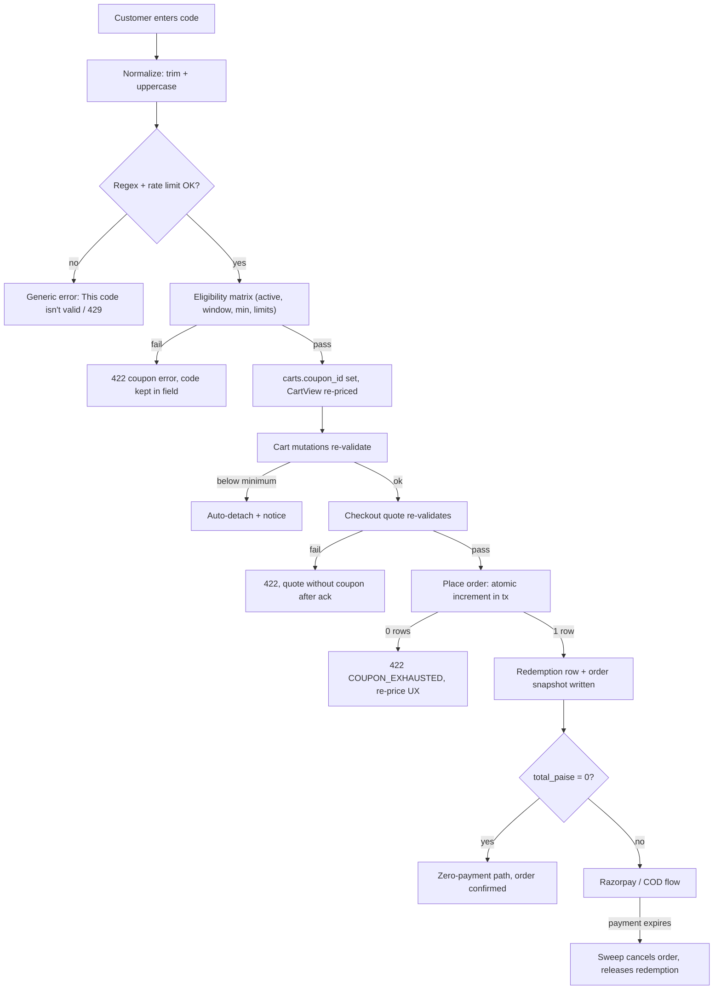
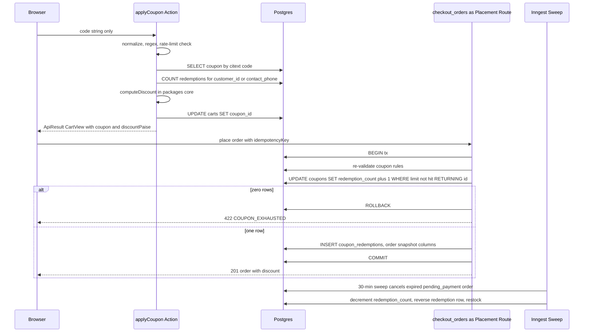
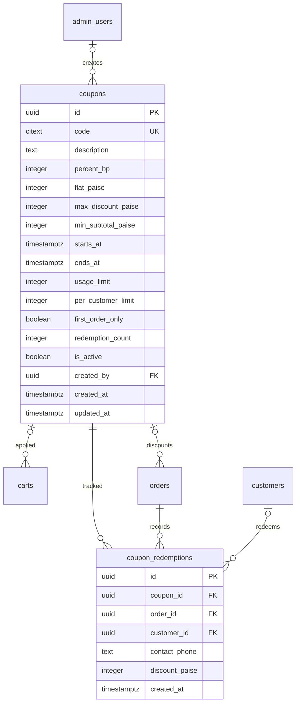
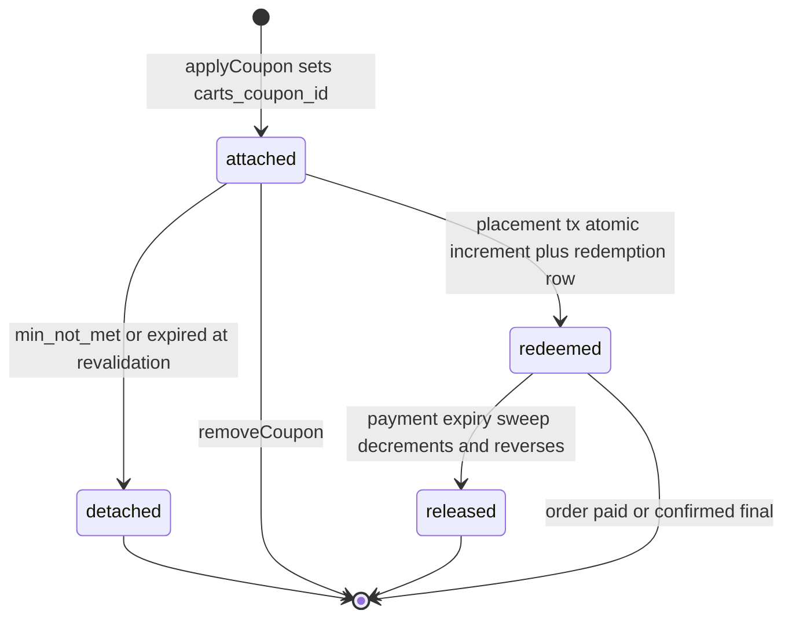

# Module Spec — Coupons & Discounts (Phase 2)

> Source of truth: PROJECT_PLAN.md §3.9, Contract §3.0 (§1.12, §1.13, §1.28.2, §2.1), docs/DATABASE_ERD.md §3.12–3.13, risk-engineering.md Module 5.
> Owners: Dev C (redemption path + allocation engine in `packages/core`), Dev D (admin CRUD, owner-gated). Money-math PRs require Dev C + one of B/E review.

---

## 1. Field-Level Specification

### 1.1 Storefront — `applyCoupon({ code })` (Server Action)

| Field | Type | Required | Max length | Format / Validation rule | User-facing error message |
|---|---|---|---|---|---|
| `code` | string | yes | 24 | Trim, uppercase, then match `^[A-Z0-9-]{3,24}$`. Lookup via `citext` equality on `coupons.code`. Anything failing the regex is rejected **without a DB lookup** (same error as not-found — no oracle). | "This code isn't valid" |

Post-format eligibility matrix (evaluated in this exact order, all server-side; the public UI collapses the first two rows into one message — see §6 enumeration defense):

| Check | Logic (server, UTC storage / IST evaluation) | Error code | User-facing message |
|---|---|---|---|
| Exists + active | row found AND `is_active = true` | `COUPON_INVALID` | "This code isn't valid" |
| Window | `now() >= starts_at AND (ends_at IS NULL OR now() <= ends_at)`. Admin enters IST dates; "valid till 30 June" is stored as `2026-06-30T23:59:59.999+05:30` converted to UTC via `istDayToUtcRange()` | `COUPON_EXPIRED` | "This code isn't valid" (public) |
| Min subtotal | `cart_item_subtotal_paise >= min_subtotal_paise` where the base **excludes gift-wrap fees, shipping, and COD fee** | `COUPON_MIN_NOT_MET` | "Add ₹{shortfall} more to use this code" (`details.shortfallPaise`) |
| Global limit | `usage_limit IS NULL OR redemption_count < usage_limit` (advisory at apply; **atomic at placement**, §1.28.2) | `COUPON_EXHAUSTED` | "This code has been fully redeemed" |
| Per-customer limit | `COUNT(coupon_redemptions WHERE coupon_id = $1 AND (customer_id = $me OR contact_phone = $myPhone)) < per_customer_limit`. Phone is the normalized `+91XXXXXXXXXX` used on prior orders; checked at apply if known, always re-checked at placement against the checkout contact phone | `COUPON_LIMIT_REACHED` | "You've already used this code" |
| First order only | `first_order_only = false OR` no prior non-cancelled order for `customer_id` / `contact_phone` | `COUPON_LIMIT_REACHED` | "You've already used this code" |

Discount computation (never client-supplied):
- `percent_bp` set: `discount = floor(base_paise * percent_bp / 10000)`, then `discount = min(discount, max_discount_paise)` when the cap is set, then `discount = min(discount, base_paise)`.
- `flat_paise` set: `discount = min(flat_paise, base_paise)`.
- Exactly one of `percent_bp` / `flat_paise` is non-null (`CHECK (num_nonnulls(percent_bp, flat_paise) = 1)`).
- `base_paise` = sum of tax-inclusive line subtotals, **excluding** gift-wrap fees.

### 1.2 Admin — `POST /api/admin/coupons` (owner)

| Field | Type | Required | Constraint / Validation (zod `.strict()`) | Error message (fieldErrors) |
|---|---|---|---|---|
| `code` | string | yes | `^[A-Z0-9-]{3,24}$` after uppercase-trim; alphabet bans lookalike-ambiguous generation (no lowercase `o`/`0` mixing at source) | "Code must be 3–24 characters, A–Z, 0–9, and hyphens only" |
| `description` | string | no (default `''`) | ≤ 500 chars | "Description too long (max 500)" |
| `percentBp` | integer | XOR with flatPaise | `1 ≤ percentBp ≤ 10000` | "Percent must be between 0.01% and 100%" |
| `flatPaise` | integer | XOR with percentBp | `> 0` | "Flat discount must be greater than ₹0" |
| — XOR rule | — | — | exactly one of `percentBp` / `flatPaise` present | "Choose either a percent or a flat discount, not both" |
| `maxDiscountPaise` | integer | no | `> 0`; only meaningful with `percentBp`; UI warns if absent on a percent coupon | "Cap must be greater than ₹0" |
| `minSubtotalPaise` | integer | no (default 0) | `≥ 0` | "Minimum order value cannot be negative" |
| `startsAt` | ISO 8601 string | no (default now) | IST picker → UTC; must be valid timestamptz | "Invalid start date" |
| `endsAt` | ISO 8601 string \| null | no | `startsAt < endsAt` when both set | "End date must be after start date" |
| `usageLimit` | integer \| null | no | `> 0` | "Usage limit must be at least 1" |
| `perCustomerLimit` | integer | no (default 1) | `≥ 1` | "Per-customer limit must be at least 1" |
| `firstOrderOnly` | boolean | no (default false) | — | — |
| `isActive` | boolean | no (default true) | — | — |

High-value flag (audit only, not a block since all CRUD is owner): `percentBp > 5000` OR `flatPaise > 100000` → audit-log entry tagged `high_value: true`.

---

## 2. Workflow / User Flow

1. Customer expands "Have a coupon?" on the cart page or drawer and submits a code.
2. `applyCoupon` normalizes (trim + uppercase), checks rate limits (10/min/session, 30/hour/IP), and runs the §1.1 eligibility matrix.
3. **Failure** → `ApiErr` with one of the five 422-class coupon codes; UI shows the mapped message inline (generic for INVALID/EXPIRED), keeps the typed code in the field.
4. **Success** → `carts.coupon_id` is set; server recomputes `CartView` totals with `coupon: { code, discountPaise }`; UI renders the applied chip and discount row.
5. Any cart mutation (line add/remove/qty) recomputes totals: if the cart drops below `min_subtotal_paise` (or the window lapses), the coupon **auto-detaches** with a non-blocking notice: "Coupon {CODE} removed — order below ₹X minimum".
6. `POST /api/checkout/quote` re-validates every rule live; failure returns the specific 422 code and the quote proceeds without the coupon after the client acknowledges.
7. `POST /api/checkout/orders` (idempotent) re-validates once more inside the placement transaction and runs the atomic increment: `UPDATE coupons SET redemption_count = redemption_count + 1 WHERE id = $1 AND is_active AND (usage_limit IS NULL OR redemption_count < usage_limit) RETURNING id`.
   - Zero rows → 422 `COUPON_EXHAUSTED`, transaction aborts, checkout UI re-prices with explicit acknowledgment before allowing full-price placement.
   - One row → `coupon_redemptions` row inserted in the same tx; `orders.coupon_id`, `coupon_code` (text snapshot), `discount_paise` written.
8. If the resulting `total_paise = 0` (100%-off), the order skips Razorpay and transitions directly to `confirmed` via the explicit zero-payment path (logged, alerted).
9. If a prepaid order expires unpaid, the 30-minute stuck-payment sweep cancels it **and releases the redemption**: `redemption_count` decremented and the redemption row reversed, alongside inventory restock.
10. `removeCoupon()` at any time clears `carts.coupon_id` and returns re-priced `CartView`.



---

## 3. System Design



**External service dependencies:**

| Dependency | Role here | Behavior when down / timing out |
|---|---|---|
| Postgres (Supabase Mumbai) | All validation + atomic redemption | Module is inoperable — apply returns 500 `INTERNAL`; placement fails whole; no coupon-specific degradation needed |
| Razorpay | Consumes discounted `total_paise` only | Not called by this module. Zero-total path exists precisely because Razorpay cannot create a ₹0 order; when Razorpay is down (502 `UPSTREAM_ERROR` from Payments), the redemption remains held with the pending order and is released by the expiry sweep if payment never completes |
| Inngest | Release-on-payment-expiry sweep | If Inngest is delayed, redemptions stay held past the 30-min window — coupons appear more exhausted than they are; self-heals when the sweep resumes (idempotent decrement keyed on the cancelled order id). Alert if sweep lag > 15 min |
| Rate limiter store | Enumeration defense buckets | Fail-closed on the apply-specific bucket: if the limiter store is unreachable, apply returns 429 `RATE_LIMITED` rather than opening an unmetered enumeration oracle |

**Caching:** none. Coupon rules are money-bearing and mutate under an atomic counter; every read is a live Drizzle query inside the request/transaction. The only "cache" is `carts.coupon_id` as a pre-checkout attachment, and it is by design revalidated at every totals computation, quote, and placement — never trusted stale. Admin list pages are `dynamic` (no ISR).

---

## 4. Database Schema

Verbatim from docs/DATABASE_ERD.md §3.12–3.13 (Contract §1.12–1.13).

### `coupons`

| Column | Type | Constraints | Notes |
|---|---|---|---|
| `id` | `uuid` | `PRIMARY KEY DEFAULT gen_random_uuid()` | |
| `code` | `citext` | `NOT NULL UNIQUE CHECK (char_length(code) BETWEEN 3 AND 24)` | |
| `description` | `text` | `NOT NULL DEFAULT ''` | |
| `percent_bp` | `integer` | `CHECK (percent_bp BETWEEN 1 AND 10000)` | `1000` = 10% |
| `flat_paise` | `integer` | `CHECK (flat_paise > 0)` | |
| `max_discount_paise` | `integer` | `CHECK (max_discount_paise > 0)` | cap for percent coupons |
| `min_subtotal_paise` | `integer` | `NOT NULL DEFAULT 0` | |
| `starts_at` | `timestamptz` | `NOT NULL DEFAULT now()` | |
| `ends_at` | `timestamptz` | | |
| `usage_limit` | `integer` | `CHECK (usage_limit > 0)` | global |
| `per_customer_limit` | `integer` | `NOT NULL DEFAULT 1` | |
| `first_order_only` | `boolean` | `NOT NULL DEFAULT false` | |
| `redemption_count` | `integer` | `NOT NULL DEFAULT 0` | atomic exhaustion counter |
| `is_active` | `boolean` | `NOT NULL DEFAULT true` | soft delete |
| `created_by` | `uuid` | `REFERENCES admin_users(id) ON DELETE SET NULL` | |
| `created_at` | `timestamptz` | `NOT NULL DEFAULT now()` | |
| `updated_at` | `timestamptz` | `NOT NULL DEFAULT now()` | |

```sql
CHECK (num_nonnulls(percent_bp, flat_paise) = 1)
```

### `coupon_redemptions`

| Column | Type | Constraints | Notes |
|---|---|---|---|
| `id` | `uuid` | `PRIMARY KEY DEFAULT gen_random_uuid()` | |
| `coupon_id` | `uuid` | `NOT NULL REFERENCES coupons(id) ON DELETE RESTRICT` | |
| `order_id` | `uuid` | `NOT NULL REFERENCES orders(id) ON DELETE CASCADE` | |
| `customer_id` | `uuid` | `REFERENCES customers(id) ON DELETE SET NULL` | |
| `contact_phone` | `text` | `NOT NULL` | guest limit tracking |
| `discount_paise` | `integer` | `NOT NULL CHECK (discount_paise >= 0)` | |
| `created_at` | `timestamptz` | `NOT NULL DEFAULT now()` | |

```sql
UNIQUE (coupon_id, order_id)
CREATE INDEX coupon_redemptions_phone_idx ON coupon_redemptions (coupon_id, contact_phone);
```

**Cross-module touchpoints (owned elsewhere, referenced here):** `carts.coupon_id uuid REFERENCES coupons(id) ON DELETE SET NULL` (pre-checkout attachment); `orders.coupon_id` (`ON DELETE SET NULL`), `orders.coupon_code text` (snapshot, survives edits/deletes), `orders.discount_paise` (participates in the `total_paise` CHECK).



---

## 5. API Design

### 5.1 Storefront Server Actions (Dev C) — rate class B baseline, apply-specific tighter bucket

**`applyCoupon({ code: string })`** — auth: public (cart cookie) / customer.
- Request: `{ code: string }` (zod `.strict()`; trim + uppercase then `^[A-Z0-9-]{3,24}$`).
- Response: `ApiResult<CartView>` with `coupon: { code: string, discountPaise: number }` and re-priced totals.
- Errors (Server Actions return `ApiErr`, never throw; HTTP column applies to Route Handler equivalents):

| Error code | HTTP-equivalent | When |
|---|---|---|
| `VALIDATION_ERROR` | 400 | malformed payload / regex fail (surfaced publicly as the generic invalid message) |
| `COUPON_INVALID` | 422 | not found or `is_active = false` |
| `COUPON_EXPIRED` | 422 | outside `starts_at`/`ends_at` window |
| `COUPON_MIN_NOT_MET` | 422 | subtotal base below `min_subtotal_paise`; `details: { shortfallPaise }` |
| `COUPON_EXHAUSTED` | 422 | `redemption_count >= usage_limit` (advisory pre-check) |
| `COUPON_LIMIT_REACHED` | 422 | per-customer limit hit (customer_id or contact_phone match) or `first_order_only` violated |
| `CART_EXPIRED` | 410 | cart TTL lapsed |
| `RATE_LIMITED` | 429 | enumeration bucket exceeded; `Retry-After` sent |

**`removeCoupon()`** — auth: public (cart cookie) / customer. No payload. Response: `ApiResult<CartView>` with `coupon: null`. Naturally idempotent (clearing an already-null `coupon_id` still returns 200-equivalent). No endpoint-specific errors.

### 5.2 Checkout integration (Dev C) — rate class D (10/min per session)

- `POST /api/checkout/quote` — accepts `couponCode?`; returns `{ quote: CheckoutQuote }` incl. `coupon` + `discountPaise` and per-line allocation. Re-validates every rule live. Coupon errors: the five 422 codes above.
- `POST /api/checkout/orders` — idempotent via `idempotencyKey UNIQUE`. Re-validates the coupon and runs the §1.28.2 atomic increment inside the placement tx; `coupon_redemptions` insert in the same tx. Replay → 409 `DUPLICATE_REQUEST` with the original 201 body — **cannot double-redeem**. Mid-checkout exhaustion → 422 `COUPON_EXHAUSTED` with a clean re-priced quote path, never a 500.

### 5.3 Admin Route Handlers (Dev D) — rate class E (600/min per admin session)

| Method / route | Auth | Request → Response | Errors |
|---|---|---|---|
| `GET /api/admin/coupons?q=&active=&page=` | admin:owner (staff read-only list allowed per §3.9 admin reqs) | → `{ coupons: CouponAdmin[] }` with `redemption_count`, window, limits; `meta.page/pageSize/total` | — |
| `POST /api/admin/coupons` | admin:owner | §1.2 schema → `{ coupon: CouponAdmin }` (201) | 409 `CONFLICT` (code taken); 400 `VALIDATION_ERROR` |
| `PATCH /api/admin/coupons/[id]` | admin:owner | partial §1.2 schema; placed orders unaffected (snapshot) | 404 `NOT_FOUND`; 409 `CONFLICT` (code collision) |
| `DELETE /api/admin/coupons/[id]` | admin:owner | soft delete → `is_active = false`; never 409 | 404 `NOT_FOUND` |

Staff hitting any mutation route → 403 `FORBIDDEN`. Every mutation writes `admin_audit_log` (`coupon.create/update/deactivate`, before/after).

### 5.4 Core exports (`packages/core`)

- `computeDiscount(coupon, lines): Paise` — pure; enforces percent-cap and base exclusions.
- `allocateDiscount(discountPaise, lines): PaisePerLine[]` — largest-remainder allocation (see §7 #3); consumed by quote, placement, and line-level refunds (Payments module).

---

## 6. Security Standards

- **Rate limits (Contract §2.1 classes):** `applyCoupon` runs under class B (60/min per session/cart-token) **plus** the enumeration-specific bucket: **10 attempts/min/session + 30/hour/IP**. Checkout quote/place: class D (10/min per session). Admin routes: class E (600/min per admin session). All limited responses carry `X-RateLimit-Limit`, `X-RateLimit-Remaining`, `X-RateLimit-Reset`; 429 adds `Retry-After` and body code `RATE_LIMITED`.
- **Enumeration defense (the module's signature OWASP concern — broken access control / info disclosure):** the public path renders one identical message ("This code isn't valid") for not-exists, expired, and not-eligible-for-you; distinct error codes exist only for structured logging and for legitimately-attached coupons detaching. Regex-failing input is rejected before any DB read. Alert fires on apply-endpoint miss-rate spike.
- **Input sanitization:** single zod `.strict()` schema; code normalized (trim + uppercase) then `^[A-Z0-9-]{3,24}$`; all queries Drizzle-parameterized (SQLi). Coupon codes are user-echoed input — output-encoded everywhere they render (storefront chip, admin list, order detail) against stored/reflected XSS.
- **Authz:** all four CRUD routes owner-gated at route-level middleware **and** per-action assertion (UI hiding is cosmetic); staff mutation attempts return 403 `FORBIDDEN` and are covered by the exhaustive admin authz checklist test. Redemption needs no auth beyond cart/session scope, but per-customer limits key off the **verified phone at placement**, not client claims.
- **Money integrity:** client sends a code string only — never amounts. Every paisa is computed server-side; `orders.total_paise` CHECK plus the allocation sum invariant make tampering structurally detectable. Zero-total orders are individually alerted (free-order abuse vector) and rate-limited by the same checkout class D.
- **Encryption at rest:** Supabase disk encryption suffices; no column-level encryption needed. `contact_phone` in `coupon_redemptions` is PII — masked to last 4 digits in admin UI.
- **Never log:** raw spray payloads (log `code_hash` + ip + session instead), full customer phone numbers in coupon logs (mask), admin session cookies.
- **Concurrency abuse:** exhaustion is enforced by the atomic conditional UPDATE inside the placement tx (never count-then-insert); idempotency-key replay cannot double-redeem; `UNIQUE (coupon_id, order_id)` is the backstop.

---

## 7. Edge Cases

1. **Last-redemption race.** `usage_limit = 100`, two checkouts race the 100th slot. The conditional `UPDATE ... WHERE redemption_count < usage_limit RETURNING id` inside the placement tx guarantees exactly one winner; the loser gets 422 `COUPON_EXHAUSTED` and a re-priced review step. Rollback on placement failure releases the count automatically.
2. **Per-customer limit bypass via guest checkout.** Redeem logged-in, retry as guest with the same phone: limits are checked against `coupon_redemptions.contact_phone` (index `(coupon_id, contact_phone)`) as well as `customer_id`, so they survive account-less checkouts. Different-phone multi-identity abuse is accepted risk, logged for pattern review.
3. **Rounding paisa allocation.** 10% off ₹1,111.00 (111,100 paise) = 11,110 paise, allocated across lines proportionally by line subtotal via **largest-remainder method, remainder paise to the largest line** (deterministic). Gift-wrap fees excluded from the base. Property-tested invariant: `sum(line_discounts) == orders.discount_paise` exactly, always. Line-level refunds consume this allocation.
4. **Min-subtotal + line removal.** ₹500-min coupon applied; user drops the cart to ₹450 → coupon auto-detaches with a notice at the next totals computation and is re-validated at placement (client cannot pin a stale coupon). Never a checkout-time 500.
5. **IST expiry boundary.** "Valid till 30 June" = 23:59:59.999 IST, evaluated server-side. Applied 11:58 PM IST, placed 12:02 AM: validity is checked at apply AND placement — **placement is authoritative**. Boundary tests at ±1 second in IST.
6. **Case/whitespace/lookalike codes.** ` welcome10 ` → `WELCOME10` (citext + uppercase-trim); creation alphabet `[A-Z0-9-]` prevents ambiguous O/0 generation; `WELCOME1O` simply fails as not-found with the generic message. Failed attempts logged as `{code_hash, ip, session}`.
7. **100%-off → ₹0 payable.** Razorpay cannot create a 0-amount order; zero-total orders skip payment and transition directly to `confirmed` via the explicit zero-payment path — deliberate, logged, admin-visible, alerted per occurrence, rate-limited.
8. **Release on payment expiry.** Prepaid order with a redeemed coupon expires unpaid → the 30-min stuck-payment sweep cancels it, decrements `redemption_count`, and reverses the redemption row alongside inventory restock — the coupon slot returns to the pool.
9. **Coupon edited/deactivated after orders placed.** `orders.coupon_code` + `discount_paise` are snapshots (Contract §1.29); admin edits never rewrite placed orders, invoices, or refund math. Deactivation takes effect at the next cart revalidation — no "detach from carts" tooling needed.
10. **Partial refund below minimum.** Refunding one line refunds that line's allocated discount share; if the retained order value drops below `min_subtotal_paise`, policy is **allow — no clawback** (decided, documented, tested).
11. **Stacking.** One coupon per order at launch — structurally enforced by `carts.coupon_id` being a single column. Future exclusion rules (sale items, fee applicability) land as data flags, not code branches.
12. **Idempotent replay.** Network retry of placement with the same `idempotencyKey` → 409 `DUPLICATE_REQUEST` with the original 201 body; `redemption_count` incremented exactly once; `UNIQUE (coupon_id, order_id)` backstops.

---

## 8. State Machine

**Not applicable (coupon entity).** Coupons carry no state machine — eligibility is derived from `is_active` + the `starts_at`/`ends_at` window + counters; deletes are soft (`is_active = false`). The redemption *lifecycle*, however, has three effective states worth diagramming:



Triggers: `attached` (applyCoupon success) · `detached` (any totals recomputation failing eligibility) · `redeemed` (placement tx commit) · `released` (Inngest stuck-payment sweep cancelling a `pending_payment` order).

---

## 9. Testing Requirements

**Unit (`packages/core`, ≥ 95% coverage on eligibility + allocation files, CI-gated):**
- `allocateDiscount` property tests: sum invariant `Σ line_discounts == discount_paise`; no negative line discount; deterministic remainder placement (largest line); input-order independence. Fixture tests with hand-computed paise incl. 1-paisa remainders across 3+ lines and gift-wrap-excluded bases.
- `computeDiscount`: percent floor + `max_discount_paise` cap; flat clamp to base; XOR percent/flat enforcement.
- Eligibility matrix: min subtotal, IST window boundary ±1s, per-customer limit, `first_order_only`, exhaustion pre-check.
- Code normalization: case, whitespace, alphabet rejection (`WELCOME1O` with letter O, unicode homoglyphs).

**Integration (ephemeral Postgres, migrations from zero — runs on EVERY PR):**
- Concurrent last-redemption: two parallel transactions race `usage_limit`; exactly one `coupon_redemptions` row and one discounted order.
- Redemption release on payment expiry: sweep cancels a `pending_payment` order → `redemption_count` decremented, redemption reversed, alongside restock.
- Guest/account per-customer enforcement: redeem as account, retry as guest with same phone → `COUPON_LIMIT_REACHED`.
- Apply → remove-line → auto-detach; placement re-validation rejects a stale pinned coupon.
- Idempotent placement replay does not double-increment `redemption_count`.
- Admin authz: staff mutation attempts on all four CRUD routes → 403 (part of the exhaustive authz checklist test file).
- Zero-total order path: 100%-off coupon → order `confirmed` without a Razorpay order, logged.

**E2E (Playwright, named):**
1. *Coupon + wrap rounding:* apply a 10% coupon to a 3-line cart with gift wrap on one line; assert on-screen totals == Razorpay charged amount == DB `orders.discount_paise`/`total_paise` to the paisa.
2. *Expired coupon UX:* apply a valid coupon, fast-forward validity via test fixture, attempt placement; assert clean re-price with notice, order proceeds without discount only after explicit confirmation.
3. *Last redemption race:* two browser contexts race the final slot; exactly one order carries the discount, the other sees "This code has been fully redeemed" and re-priced totals.

---

## 10. Definition of Done

- [ ] `allocateDiscount` property-tested with the sum invariant; ≥ 95% coverage on eligibility + allocation files, CI-gated
- [ ] Concurrent last-redemption integration test green (exactly one winner) on every PR
- [ ] Redemption release wired into the stuck-payment sweep and tested (count decrement + row reversal + restock in one sweep)
- [ ] IST expiry boundary tests (±1s) green; placement-time validation authoritative over apply-time
- [ ] Enumeration limits live (10/min/session + 30/hour/IP) with identical public error copy for INVALID/EXPIRED/not-eligible; miss-rate alert configured
- [ ] Per-customer limits enforced across guest + account via `contact_phone`, tested
- [ ] Refund integration: line-level refund math (Payments module) consumes `allocateDiscount` with a shared hand-computed fixture
- [ ] Admin CRUD owner-gated; staff-403 negative tests for all four routes in the authz checklist; `admin_audit_log` rows (before/after) on every mutation, high-value coupons flagged
- [ ] `orders.coupon_code`/`discount_paise` snapshot verified: edit/deactivate coupon post-placement → order, invoice, refund math unchanged
- [ ] Zero-total order path implemented, logged, per-occurrence alert, rate-limited under class D
- [ ] Idempotent replay cannot double-redeem (`DUPLICATE_REQUEST` returns original body; `UNIQUE (coupon_id, order_id)` in place)
- [ ] Coupon codes output-encoded at every render surface (storefront chip, admin list, order detail)
- [ ] Structured logs live: `coupon.applied/detached/redeemed/released {code, order_id, discount_paise, allocation}`; failed applies as `{code_hash, ip, session}`; phone masked in admin views
- [ ] Alerts live: single-code redemption-velocity spike, apply miss-rate spike, zero-total order creation
- [ ] All 3 named E2E scenarios green in CI
