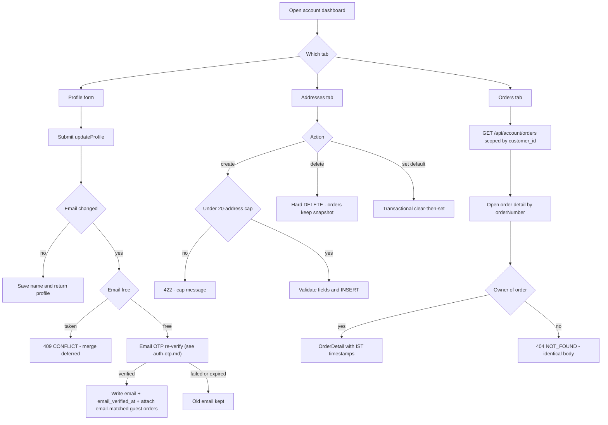
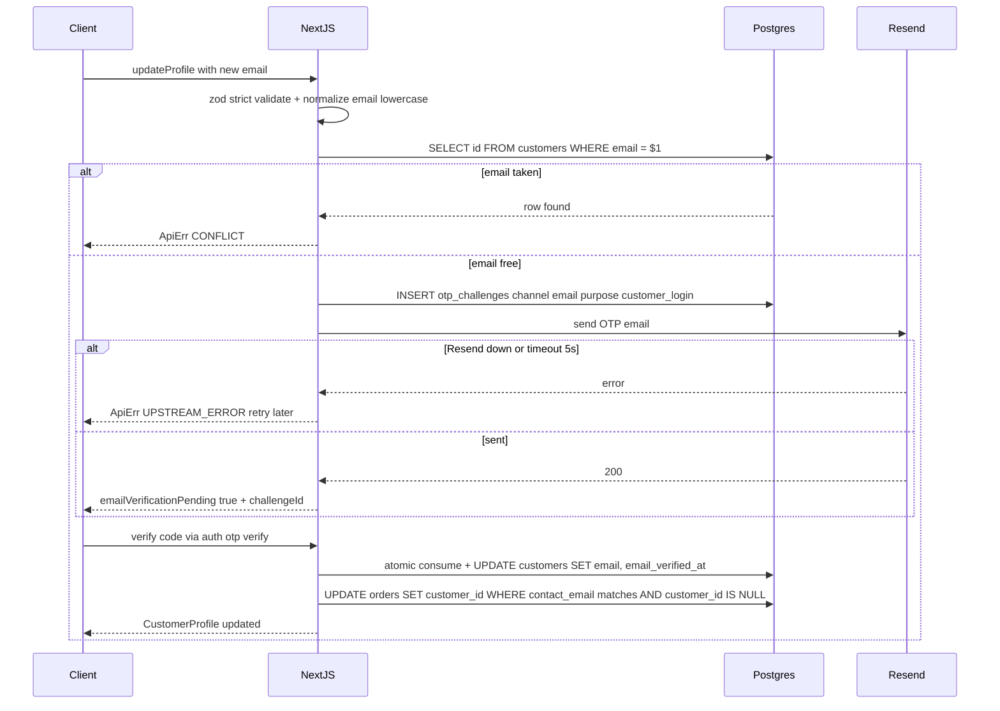
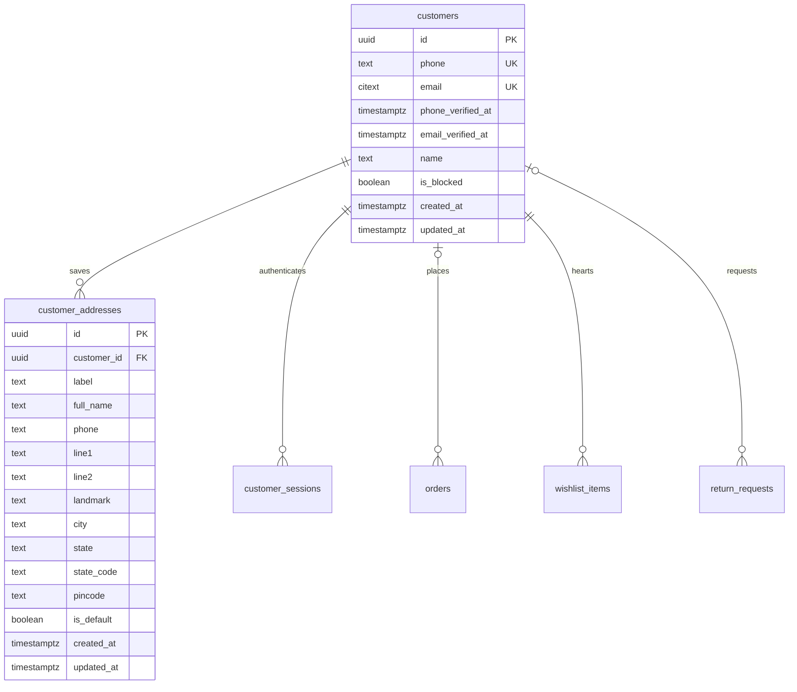
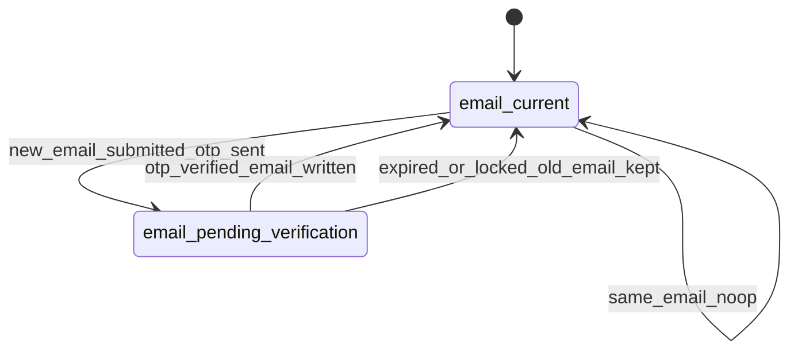

# Module Spec — Customer Accounts: Profile, Addresses, Order History (Phase 1–2)

> Source of truth: PROJECT_PLAN.md §3.5 (Customer Auth & Accounts) and Contract §2.4; schema per docs/DATABASE_ERD.md §3.6, §3.9 (reads §3.14, §3.24, §3.25). OTP issuance/verification, sessions, and cart merge are specified in [auth-otp.md](auth-otp.md) — this doc covers everything a **logged-in customer** does after that: profile, address book, and account reads (orders, order detail, returns, wishlist). Owner: Dev B (backend) + Dev A (account UI shells). Phase 1 delivers sessions consumed here; the full account dashboard lands Phase 2 (W6–8).

---

## 1. Field-Level Specification

### 1.1 `updateProfile` (Server Action)

| Field | Type | Required | Max length | Format / validation | Error message on failure |
|---|---|---|---|---|---|
| `name` | string | no | 100 | Trimmed; 2–100 chars after trim; any Unicode letters, spaces, `.`, `'`, `-` allowed (Indian names include apostrophes/dots). Logic: `name.trim().length >= 2 && name.trim().length <= 100` | "Please enter your name (2–100 characters)." |
| `email` | string | no | 254 | Lowercased, trimmed; zod `.email()` plus `^[^\s@]+@[^\s@]+\.[^\s@]{2,}$`; stored as `citext` | "Please enter a valid email address." |

- Passing `email` **different from the current verified email** does NOT write `customers.email` directly — it triggers the email-OTP re-verify flow ([auth-otp.md](auth-otp.md), purpose `customer_login` on channel `email`): response returns `{ emailVerificationPending: true, challengeId }`; `customers.email` + `email_verified_at` update only inside the successful verify. Until then the old email stays active.
- `email` already on another `customers` row (citext-unique) → `CONFLICT` (409): **"This email is already linked to another account. Contact support to merge accounts."** (merge path explicitly deferred post-launch, occurrence logged).
- Unknown keys rejected (`zod .strict()`) → `VALIDATION_ERROR`: "Something went wrong with this request. Please refresh and try again."

### 1.2 `AddressInput` (createAddress / updateAddress)

| Field | Type | Required | Max length | Format / validation (exact) | Error message on failure |
|---|---|---|---|---|---|
| `label` | string | no (default `'Home'`) | 30 | 1–30 chars trimmed; free text | "Label must be 30 characters or fewer." |
| `full_name` | string | yes | 100 | 2–100 chars after trim | "Please enter the recipient's full name." |
| `phone` | string | yes | 13 (normalized) | Normalize first: strip spaces/dashes, strip leading `0`, prefix `+91` if 10 digits; then must match `^\+91[6-9]\d{9}$` | "Enter a valid 10-digit Indian mobile number starting with 6–9." |
| `line1` | string | yes | 120 | 3–120 chars after trim; `#`, `/`, commas, floor numbers all legal | "Address line 1 is required (3–120 characters)." |
| `line2` | string | no | 120 | ≤120 chars | "Address line 2 must be 120 characters or fewer." |
| `landmark` | string | no | 80 | ≤80 chars | "Landmark must be 80 characters or fewer." |
| `city` | string | yes | 60 | 2–60 chars after trim | "Please enter your city." |
| `state` | string | yes | 60 | Must equal a value from the canonical Indian state/UT list in `packages/core/src/india/states.ts` (36 entries) | "Please select a valid state." |
| `state_code` | string | yes | 2 | `^\d{2}$` AND must be the GST state code paired to `state` in the canonical list (e.g. Maharashtra ⇒ `27`); server derives-and-verifies, never trusts the pair independently | "State and state code don't match. Please reselect your state." |
| `pincode` | string | yes | 6 | `^[1-9]\d{5}$` (000000-class values rejected by the leading `[1-9]`); Phase 2+: warn-only lookup against the pincode dataset used by serviceability | "Enter a valid 6-digit PIN code." |
| `is_default` | boolean | no (default `false`) | — | boolean | — |

Cross-field rules:
- **20-address cap**: `createAddress` counts rows for the session's `customer_id`; count ≥ 20 → `VALIDATION_ERROR` (422 semantics in the action result): **"You've reached the limit of 20 saved addresses. Delete one to add a new address."**
- `updateAddress` / `deleteAddress` / `setDefaultAddress` `id` must be a UUID owned by the session customer → otherwise `NOT_FOUND`: **"Address not found."** (never 403 — no cross-account existence oracle).

### 1.3 Account GET query params

| Field | Type | Required | Validation | Error message |
|---|---|---|---|---|
| `page` (orders list) | integer | no (default 1) | `^\d+$`, 1 ≤ page ≤ 1000 | "Invalid page number." |
| `orderNumber` (order detail path) | string | yes | `^KK-\d{5,}$` | "Order not found." (404, same body as not-owned) |

---

## 2. Workflow / User Flow

### 2.1 Update profile with email change

1. Customer opens `/account` → Profile tab; form pre-filled from `GET /api/auth/me`.
2. Submits `updateProfile({ name, email })`.
3. Server validates (§1.1). Failure → `fieldErrors` rendered under inputs; stop.
4. `email` unchanged or absent → write `name`, return updated `CustomerProfile`. Done.
5. `email` new: check citext uniqueness. Collision → 409 `CONFLICT` banner; stop.
6. No collision → issue email OTP challenge (Class C limits, [auth-otp.md](auth-otp.md)); UI shows 6-digit entry with masked email; profile keeps old email meanwhile.
7. Verify success → `customers.email` + `email_verified_at = now()` written in one UPDATE; **email-matched guest orders now attach** (verified-identifier rule); toast "Email verified".
8. Verify failure/expiry → old email untouched; user may re-request after cooldown.

### 2.2 Address CRUD + default swap

1. Addresses tab lists via `listAddresses()` (default first, then `created_at DESC`).
2. Create: validate §1.2 → cap check → INSERT; if `is_default: true`, transactional clear-then-set (§8 note).
3. Edit: ownership check by `(id, customer_id)` → partial update → `updated_at = now()`.
4. Delete: confirm dialog notes **"Orders already placed with this address are not affected."** → hard DELETE (safe: orders hold jsonb snapshots, never FKs).
5. Set default: single transaction `UPDATE ... SET is_default = false WHERE customer_id = $1 AND is_default` then `SET is_default = true WHERE id = $2 AND customer_id = $1`; partial unique index is the backstop; last write wins across tabs.



## 3. System Design



**External dependencies & failure behavior**

| Service | Used for | When down / timeout (exact behavior) |
|---|---|---|
| Resend (email) | Email-change OTP | 5s timeout → challenge row kept but response is 502-equivalent `UPSTREAM_ERROR`; UI: "Couldn't send the verification email — try again shortly." Profile email unchanged; retry allowed after the 60s cooldown. |
| MSG91 (SMS) | Not called by this module directly (login OTP lives in auth-otp.md) | n/a here |
| Postgres (Supabase Mumbai) | Everything | Any query error → 500 `INTERNAL` with `requestId`; no partial writes (all multi-statement flows are single transactions). |

**Caching:** none on account routes — every response is per-customer PII and must reflect writes immediately (`Cache-Control: private, no-store` on all `/api/account/*` and `/api/auth/me`). The only cached data this module touches is the static state/GST-code list, shipped as a compile-time constant (no TTL, changes require deploy — GST state codes change ~never).

## 4. Database Schema

Owned tables, DDL verbatim from docs/DATABASE_ERD.md.

### `customers` (ERD §3.6, Contract §1.6)

| Column | Type | Constraints | Notes |
|---|---|---|---|
| `id` | `uuid` | `PRIMARY KEY DEFAULT gen_random_uuid()` | |
| `phone` | `text` | `UNIQUE CHECK (phone ~ '^\+91[6-9][0-9]{9}$')` | |
| `email` | `citext` | `UNIQUE` | |
| `phone_verified_at` | `timestamptz` | | |
| `email_verified_at` | `timestamptz` | | |
| `name` | `text` | | |
| `is_blocked` | `boolean` | `NOT NULL DEFAULT false` | serial-RTO abusers |
| `created_at` | `timestamptz` | `NOT NULL DEFAULT now()` | |
| `updated_at` | `timestamptz` | `NOT NULL DEFAULT now()` | |

```sql
CHECK (phone IS NOT NULL OR email IS NOT NULL)
```

### `customer_addresses` (ERD §3.9, Contract §1.9)

| Column | Type | Constraints | Notes |
|---|---|---|---|
| `id` | `uuid` | `PRIMARY KEY DEFAULT gen_random_uuid()` | |
| `customer_id` | `uuid` | `NOT NULL REFERENCES customers(id) ON DELETE CASCADE` | |
| `label` | `text` | `NOT NULL DEFAULT 'Home'` | |
| `full_name` | `text` | `NOT NULL` | |
| `phone` | `text` | `NOT NULL CHECK (phone ~ '^\+91[6-9][0-9]{9}$')` | |
| `line1` | `text` | `NOT NULL` | |
| `line2` | `text` | | |
| `landmark` | `text` | | |
| `city` | `text` | `NOT NULL` | |
| `state` | `text` | `NOT NULL` | |
| `state_code` | `char(2)` | `NOT NULL` | GST state code, e.g. `'27'` |
| `pincode` | `char(6)` | `NOT NULL CHECK (pincode ~ '^[1-9][0-9]{5}$')` | |
| `is_default` | `boolean` | `NOT NULL DEFAULT false` | |
| `created_at` | `timestamptz` | `NOT NULL DEFAULT now()` | |
| `updated_at` | `timestamptz` | `NOT NULL DEFAULT now()` | |

```sql
CREATE UNIQUE INDEX customer_addresses_one_default_idx
  ON customer_addresses (customer_id) WHERE is_default;
```

**Read-only dependencies (owned elsewhere):** `orders` via `orders_customer_idx (customer_id, placed_at DESC)` and `orders_phone_idx` (guest-order attach); `order_items` for detail lines; `return_requests` for the returns tab; `wishlist_items` (composite `PRIMARY KEY (customer_id, product_id)`); `customer_sessions` (auth-otp.md). **Snapshot guarantee:** `orders.shipping_address` / `orders.billing_address` are `jsonb` copies made at placement — no FK to `customer_addresses`, so address edits/deletes never mutate a placed order.



## 5. API Design

Envelope: Contract §2.1 `ApiResult<T>`. Common codes apply everywhere and are not repeated: 400 `VALIDATION_ERROR`, 401 `UNAUTHORIZED`, 429 `RATE_LIMITED`, 500 `INTERNAL`. Auth tier for ALL of the below: `customer` (httpOnly `kakoa_session` → live row in `customer_sessions`).

### Route Handlers (GETs, no cache)

| Method & route | Rate class | Request | Response | Endpoint-specific errors |
|---|---|---|---|---|
| `GET /api/auth/me` | — | cookie only | `{ customer: CustomerProfile }` where `CustomerProfile = { id, name, phone, email, emailVerified: boolean, createdAt }` | 401 `UNAUTHORIZED` if no/expired/revoked session |
| `GET /api/account/orders?page=` | — | `page` int ≥1 | `{ orders: OrderSummary[] }`, `meta: { page, pageSize: 10, total }`; sorted `placed_at DESC` via `orders_customer_idx`; scoped `WHERE customer_id = session.customer_id` | — |
| `GET /api/account/orders/[orderNumber]` | — | path `^KK-\d{5,}$` | `{ order: OrderDetail }` — snapshot lines (`product_name`, `sku`, `unit_price_paise`, GST split), status, `order_status_history` timeline, shipping/billing address snapshots, all `*_paise` integers | 404 `NOT_FOUND` if absent **or not owned** — identical body, never 403 (no existence oracle) |
| `GET /api/account/returns` | — | — | `{ returns: ReturnRequestView[] }` scoped by owner via order join | — |
| `GET /api/account/wishlist` | — | — | `{ items: ProductCard[] }`; archived products included with unavailable state, never dropped | — |

### Server Actions (return `ApiErr`, never throw for expected failures)

| Action | Rate class | Request schema | Response | Errors |
|---|---|---|---|---|
| `updateProfile` | **B (60/min/session)** | `{ name?: string; email?: string }` `.strict()` | `ApiResult<CustomerProfile>` or `{ emailVerificationPending: true, challengeId }` when email changed | 409 `CONFLICT` (email on another account); 502 `UPSTREAM_ERROR` (Resend down) |
| `listAddresses` | — | `{}` | `ApiResult<{ addresses: Address[] }>` | — |
| `createAddress` | **B** | `AddressInput` (§1.2) `.strict()` | `ApiResult<Address>` | 400 `VALIDATION_ERROR` incl. 20-cap `fieldErrors` |
| `updateAddress` | **B** | `{ id: uuid } & Partial<AddressInput>` | `ApiResult<Address>` | 404 `NOT_FOUND` (not owner's) |
| `deleteAddress` | **B** | `{ id: uuid }` | `ApiResult<{}>` — always safe, orders snapshot | 404 `NOT_FOUND` |
| `setDefaultAddress` | **B** | `{ id: uuid }` | `ApiResult<{ addresses: Address[] }>` — transactional clear-then-set | 404 `NOT_FOUND` |
| `toggleWishlist` | **B** | `{ productId: uuid }` | `ApiResult<{ wished: boolean }>` — idempotent via composite PK | 404 `NOT_FOUND` (inactive product) |

**Idempotency:** all GETs trivially; `deleteAddress` on an already-deleted id returns `NOT_FOUND` (acceptable — client treats as success after confirm); `setDefaultAddress` re-run is a no-op; `toggleWishlist` double-tap converges (INSERT `ON CONFLICT DO NOTHING` / DELETE). Guest-order attach (run inside OTP verify per auth-otp.md, and on email verify here) is idempotent: `UPDATE orders SET customer_id = $1 WHERE customer_id IS NULL AND contact_phone = $2` — re-runs match zero rows. **Attach fires only for verified identifiers**: phone at OTP login (phone_verified_at set), email only after email-OTP re-verify — never on an unverified profile email.

## 6. Security Standards

- **Rate limits (Contract classes):** Class **B — 60/min per session** on every mutation above (`updateProfile`, all address actions, `toggleWishlist`). Email-change OTP issuance rides Class **C — 1/60s + 3/10min + 10/day per destination; 20/hr per IP** (enforced authoritatively by counting `otp_challenges` rows). Account GETs sit behind session auth; standard `X-RateLimit-Limit/Remaining/Reset` + `Retry-After` on 429.
- **Authz:** every query filters by `session.customer_id` at the SQL level — `id` params are looked up as `(id, customer_id)` pairs, never bare. Cross-customer probes return 404 with a body identical to true-absence. Forged-ID negative tests across addresses/orders/wishlist/returns are a CI checklist test.
- **Input sanitization:** zod `.strict()` on every action input (`packages/core/src/contracts/auth.ts`); Drizzle parameterized queries only (no string SQL); names/labels/address lines are stored raw and **output-encoded on every render — including the admin panel and packing slips** (stored-XSS-via-name targets the admin's browser).
- **Encryption at rest:** Supabase disk encryption covers PII columns; no additional field-level crypto in Phase 1–2 (documented). Session cookie `HttpOnly; Secure; SameSite=Lax`.
- **Never logged:** raw phone numbers, raw emails, full address lines, session tokens, OTP codes. Logs carry `identifier_hash` (SHA-256) + `customer_id` only; CI grep-lint fails builds that log `phone`/`email` fields raw. Sentry PII scrubbing rules active before launch.
- **OWASP specifics:** A01 Broken Access Control → ownership-scoped queries + 404-not-403 + negative tests; A03 Injection → Drizzle parameterization; A07 Identification failures → email change gated on OTP re-verify, 409 on collision (no silent identity linking); enumeration → identical 404 bodies on order detail, identical 200s on OTP request (auth-otp.md); CSRF → Server Actions with Next.js origin checks + SameSite=Lax.

## 7. Edge Cases

1. **Address deleted while referenced by an in-flight order** — safe by design: `orders.shipping_address` is a jsonb snapshot with no FK; explicit integration test deletes the address mid-fulfillment and asserts the order row is byte-identical.
2. **Two tabs set different default addresses concurrently** — each runs the transactional clear-then-set; last-write-wins; the partial unique index `customer_addresses_one_default_idx` guarantees at most one default even under interleaving.
3. **21st address** — cap check inside the create transaction (count + insert same tx) so two parallel creates at 19 addresses cannot both land past 20; the loser gets the cap `VALIDATION_ERROR`.
4. **Email change to an email owned by another account** — 409 `CONFLICT`, merge deferred post-launch, occurrence logged; identities are never silently linked.
5. **Email OTP verified but customer row changed meanwhile** (e.g. second device changed email first) — verify UPDATE is conditional on the challenge's stored target email in `context`; mismatch → 410 `OTP_EXPIRED`, user restarts.
6. **Guest orders attaching on later signup** — only **verified** identifiers attach: phone-matched orders on OTP login, email-matched orders only after email verification. Unverified-email attach would be an enumerate-and-claim attack on others' order history — negative test required.
7. **Phone number recycling (real in India)** — telco reassigns a number; new owner OTPs in and would see prior owner's orders/addresses. Mitigation: >18 months inactivity flag → re-verification with masked history until email co-verification if on file; documented residual risk.
8. **Order-history enumeration** — `GET /api/account/orders/[orderNumber]` returns 404 for any order not owned by the session customer; forged sequential `KK-#####` probes yield indistinguishable 404s; pagination `page` clamped at 1000.
9. **Pincode passes regex but is fake** — `^[1-9]\d{5}$` rejects `000000` but not `999999`; address save is warn-only against the pincode dataset — hard serviceability blocking happens at checkout, not in the address book (a saved address may legitimately be outside courier coverage today).
10. **Wishlist item's product archived** — account wishlist renders it greyed "No longer available"; never vanishes, never 500s; `toggleWishlist` on an inactive product returns 404 for *adds* only.
11. **Landline / malformed phone in address** — normalization strips `+91`/`0`/spaces/dashes first; a landline (leading 2–5 after normalization) fails `^\+91[6-9]\d{9}$` with the mobile-specific message.
12. **`updateProfile` with the same email as current** — no-op: no OTP issued, no challenge row, returns current profile (prevents cooldown burn and SMS/email cost via pointless re-verify loops).

## 8. State Machine

The only stateful flow owned here is the **email-change verification** (addresses are plain CRUD; order states belong to Checkout §3.6).

| State | Meaning | Transitions out | Trigger |
|---|---|---|---|
| `email_current` | Profile shows verified (or absent) email | → `email_pending_verification` | `updateProfile` with new, non-colliding email; OTP sent |
| `email_pending_verification` | Challenge open; old email still active | → `email_current` (new email written) | correct code, atomic consume wins |
| | | → `email_current` (old email kept) | 5 failed attempts, 10-min expiry, or user abandons |



Default-address handling is an invariant (≤1 `is_default` per customer, enforced by partial unique index + single transaction), not a state machine.

## 9. Testing Requirements

- **Unit (`packages/core`, ≥90% on these):** address zod schema matrix — pincode `^[1-9]\d{5}$` (accept `560001`, reject `000000`, `05600`, `5600011`); phone normalization (`098765 43210`, `+91-98765-43210`, `9876543210` → `+919876543210`; landline rejected); state ↔ `state_code` pairing (Maharashtra=27, mismatch rejected); name trim/length bounds; 20-cap logic; email lowercase/citext normalization.
- **Integration (ephemeral Postgres, migrations applied):** address-snapshot independence — place order, delete/edit the source address, assert `orders.shipping_address` unchanged; concurrent `setDefaultAddress` from two connections → exactly one default survives (partial index proof); concurrent 20th/21st create → one wins; email-change 409 on collision; email attach fires **only after** email verification (negative test with unverified email); **forged user-ID checklist** — customer B requests customer A's address/order/return/wishlist ids → all 404, bodies identical to true-absence; order list strictly scoped by `customer_id`.
- **E2E (Playwright, named):**
  1. *Full auth journey* (shared with auth-otp.md): guest checkout → signup with same phone via OTP (test-mode fixed code) → order history shows the guest order → adds address → reorders with the saved address.
  2. *Address book lifecycle:* create 2 addresses → set second default → edit first → delete default → remaining address behavior verified → checkout picker reflects the book instantly.
  3. *Email change round-trip:* profile email change → OTP email (test fake provider) → wrong code twice ("attempts left" copy) → correct code → profile shows new email → old email no longer accepted for login lookup.

## 10. Definition of Done

- [ ] All §1 validation rules implemented in `packages/core/src/contracts/auth.ts` with `.strict()`; exact user-facing messages match this spec
- [ ] Address snapshot independence test green (delete/edit never touches placed orders)
- [ ] Single-default invariant enforced transactionally with `customer_addresses_one_default_idx` as backstop; concurrent-default test green
- [ ] 20-address cap enforced inside the create transaction; race test green
- [ ] Email change gated on email-OTP re-verify; 409 `CONFLICT` on collision; merge deferral logged
- [ ] Guest-order attach on **verified identifiers only** (phone at login, email at email-verify), idempotent, with unverified-email negative test
- [ ] Forged-ID negative tests green across addresses, orders, order detail, returns, wishlist (all 404, identical bodies)
- [ ] Class B rate limits + `X-RateLimit-*`/`Retry-After` headers live on all mutations; Class C on email-change OTP issuance
- [ ] `Cache-Control: private, no-store` on all `/api/account/*` and `/api/auth/me`
- [ ] PII-hashed structured logging; CI grep-lint proves zero raw phone/email/address in logs
- [ ] Customer-authored strings output-encoded on storefront, admin panel, and packing slips
- [ ] All money in responses as integer `*_paise`; all timestamps UTC `timestamptz` displayed via `formatIST()`
- [ ] E2E scenarios 1–3 green in CI; error-code → UI mapping uses only registry codes (`packages/ui/src/error-display.ts`)
