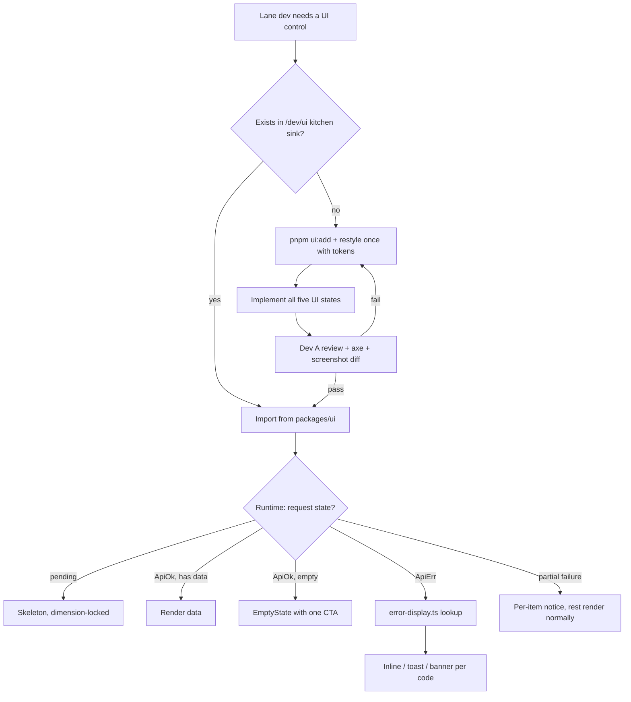
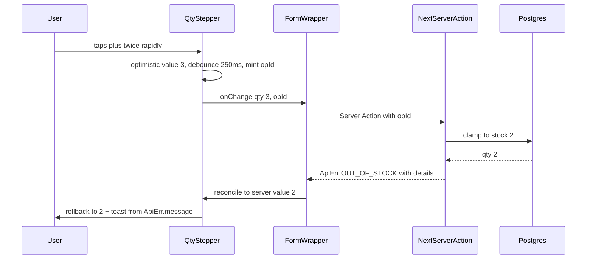

# Module Spec — Design System & UI Foundation (`packages/ui`)

> **Phase 0 (Weeks 1–2) · Owner: Dev A (Storefront & SEO) · Source: PROJECT_PLAN.md §3.1, Contract §2.1, risk-engineering.md**
>
> The shared component library and design-token layer every lane builds screens from. `packages/ui` is presentational-only: it may import `packages/core` (enums, `formatPaise()`, `formatIST()`, `ApiResult` types) and **nothing app-side, nothing from `db`**. Zero data-fetching code.
>
> **Surface boundary (decision 2026-07-02):** `@kakoa/ui` serves the **storefront**. The **admin** surface (`/admin`) uses **shadcn/ui (new-york, CLI v4) + TanStack Table**, installed as owned source in `apps/web/src/components/ui/` via `npx shadcn@latest init -d` + `components.json`, themed by mapping shadcn CSS variables to the KAKOA tokens below. Rules per surface: storefront imports only `@kakoa/ui`; admin imports only its shadcn components; the token layer is the single shared piece; destructive admin confirmations use `AlertDialog`, never `Dialog`. See PROJECT_PLAN §4.4 and the admin-*.md specs.

---

## 1. Field-Level Specification

This module has no user-input forms of its own; its "fields" are **component prop contracts**. Every prop below is type-enforced at `tsc` time; runtime validation (dev-mode `console.error` via prop assertion) applies where marked. "User-facing error" here means what the component renders when given failure-shaped props — components never invent copy for registry codes; copy comes from `ApiErr.message`.

### 1.1 Design tokens (`packages/ui/src/tokens.css` — the only file allowed to contain raw hex)

| Token | Value | Rule |
|---|---|---|
| `--color-ink` | `#2A1D12` | Primary text |
| `--color-cocoa` | `#4A2E1C` | Headings, primary button bg |
| `--color-espresso` | `#8A5A34` | Secondary emphasis |
| `--color-cream` | `#FBF6EF` | Page background (`--color-bg` alias) |
| `--color-card` | `#F3E7D5` | Card surfaces |
| `--color-line` | `#EADBC6` | Borders, dividers |
| `--color-gold` | `#C69A4C` | Accent, StarRating fill |
| `--color-caramel` | `#CE8A3E` | Accent |
| `--color-raspberry` | `#C25B5B` | `--color-danger` alias — error text/borders |
| `--color-pistachio` | `#7C8A4E` | `--color-success` alias |
| `--color-plum` | `#8A5A78` | Accent (Signature category placeholder) |

Semantic aliases (`--color-bg`, `--color-danger`, `--color-success`) are what components consume — **no component references a brand hex or literal color directly**. Lint rule: any hex literal outside `tokens.css` fails CI.

**Typography (via `next/font`, self-hosted, `display: swap`, subset `latin`, `adjustFontFallback: true`):**

| Font | CSS variable | Role | Rules |
|---|---|---|---|
| DM Serif Display | `--font-serif` | Headlines, placeholder product titles | Never for body copy |
| Hanken Grotesque | `--font-sans` | Body, UI controls | Default |
| DM Mono | `--font-mono` | Eyebrow labels | Always uppercase, `letter-spacing: 0.14em`, fixed line-height reserving eyebrow height (edge case #10 in §7) |

Fonts are loaded in `apps/web/app/layout.tsx` and exported as CSS variables; `packages/ui` consumes variables only (it cannot import `next/font` itself — that would be app-side code).

**Spacing / radius scales:** spacing on a 4-px base (`--space-1: 4px` … `--space-12: 48px`); radii `--radius-sm: 8px`, `--radius-md: 12px`, `--radius-lg: 16px` (cards), `--radius-pill: 999px` (buttons, chips). Buttons and Chips are **always pill** (`999px`) — a non-pill button is a lint failure.

**Breakpoints (mobile-first, authored at 360px):** `sm: 640px`, `lg: 1024px`, `xl: 1280px`. The Lighthouse device profile (mid-tier Android, slow 4G) is the design target.

### 1.2 Primitive prop contracts

| Component | Prop | Type | Required | Validation / exact rule | Failure behavior (user-facing) |
|---|---|---|---|---|---|
| `Button` | `variant` | `'primary' \| 'secondary' \| 'ghost' \| 'destructive'` | yes | Union-exhaustive; default none — must be explicit | `tsc` error |
| `Button` | `loading` | `boolean` | no (default `false`) | While `true`: inline spinner, `disabled`, `aria-busy="true"`, **width locked to pre-loading width** (no layout shift) | — |
| `Button` | `disabledReason` | `string` | no | If set, button renders disabled + tooltip with this string. Copy must never exceed permission-neutral phrasing — canonical string: `"Owner permission required"` | Tooltip on hover/focus |
| `Input` / `Textarea` | `fieldErrors` | `string[]` | no | Rendered verbatim under the field, Raspberry (`--color-danger`) text + border, `aria-describedby` wired, `aria-invalid="true"` | First error string shown; all listed |
| `Textarea` | `maxGraphemes` | `number` | no | Counter counts **grapheme clusters via `Intl.Segmenter('en', { granularity: 'grapheme' })`** — identical logic to `packages/core` zod length rule. Emoji/ZWJ sequences count as 1 | Counter turns Raspberry at 0 remaining: `"0 characters left"`; submit not blocked client-side (server is authority) |
| `Select` | `options` | `{ value: string; label: string }[]` | yes | Empty array → renders disabled with placeholder | Placeholder `"No options available"` |
| `QtyStepper` | `value` | `number` | yes | Clamped to `[min, max]`; out-of-range prop clamps silently + dev-mode warn | — |
| `QtyStepper` | `min` / `max` | `number` | yes | `1 ≤ min ≤ max`; contract default cart range is 1–10 | — |
| `QtyStepper` | `onChange` | `(qty: number, opId: string) => void` | yes | Every mutation emits a client op ID (uuid v4); component owns debounce (250ms trailing) and reconcile-to-server rollback | On server rejection: value rolls back, toast `"Only {n} left in stock — quantity updated"` |
| `Toast` | `error` | `{ code: ErrorCode; message: string }` | one of `error`/`success` | Renders `message` only — **never `details`**. `RATE_LIMITED` variant reads `retryAfterSec` and renders a live countdown on the retry button; retry disabled until 0 | `message` verbatim |
| `Toast` (queue) | — | — | — | Max 3 visible, FIFO eviction; identical messages within 2s coalesce with a count suffix: `"Added to cart ×3"`. Auto-dismiss 5s; `aria-live="polite"` | — |
| `Modal` / `Drawer` | `open`, `onClose` | `boolean`, `() => void` | yes | Focus-trapped; ESC and scrim click close; focus restored to trigger on close; body scroll locked while open and **always unlocked on unmount** (edge case #11). Drawer has mobile bottom-sheet variant | — |
| `StarRating` | `value` | `number` | yes | Range `0–5`, step `0.1`. Partial fill via SVG `clipPath`: fill width = `(value / 5) * 100`% of the 5-star strip — 4.3 renders a 30%-filled fourth star, **never rounds to 4.5** | Out-of-range clamps + dev warn |
| `StarRating` | `interactive` | `boolean` | no | Interactive variant: integer 1–5 only, keyboard arrows + Enter, `role="radiogroup"` | — |
| `Badge` | `status` | union of `core` enum values | yes | Variant map is `satisfies Record<OrderStatus, BadgeVariant>` (and per-enum equivalents) — **exhaustive: a new enum value without a mapping fails `tsc`** | `tsc` error, never a blank chip |
| `Skeleton` | `for` | component-variant token | yes | Dimension-locked to the component it replaces (card grid → card-shaped, totals → line-shaped); CLS contribution must be 0 | — |
| `EmptyState` | `title`, `cta` | `string`, `{ label: string; href: string }` | yes | Illustrated; exactly one CTA. Canonical copies: empty cart → `"Your cart is empty"` / CTA `"Explore the collection"` → `/shop`; no search results → trending chips | Never a bare "No data" |
| `UserText` | `text` | `string` | yes | Output-encoded plain text; C0/C1 control chars stripped; **never `dangerouslySetInnerHTML`**. Used for gift messages, review bodies, customer names on web AND admin | Renders sanitized text |
| `ProductImage` | `category`, `title`, `aspect` | enum, `string`, `string` | yes | Placeholder gradient deterministic by category: Bars → Cocoa/Caramel, Pralines → Espresso/Gold, Signature → Plum/Gold, Gifts → Raspberry/Cream; title set in DM Serif; aspect ratio identical to final photography (zero CLS on swap) | — |
| `Table` (admin) | `pagination` | `{ page: number; pageSize: number; total: number }` | yes | Bound to envelope `meta` shape verbatim | — |
| `ConfirmDialog` | `destructive` | `boolean` | no | Confirm button uses `destructive` Button variant; requires explicit click (no Enter-to-confirm on destructive) | — |
| Money display (all) | `*_paise` | `integer` | yes | Rendered exclusively via `formatPaise()` from `packages/core/src/money.ts`; components **never accept pre-formatted price strings for totals, never do float math** | `tsc` error (props typed `number` paise) |
| Date display (all) | timestamp | `string` (ISO UTC) | yes | Rendered via `formatIST()` from `core/datetime.ts`; no component calls `Date.now()` for display logic | — |

### 1.3 Error-code → UI mapping (`packages/ui/src/error-display.ts`)

Exhaustive over the Contract §2.1 ErrorCode registry — a registry code without a presentation fails the exhaustiveness test:

| Code(s) | Presentation |
|---|---|
| `VALIDATION_ERROR` | `fieldErrors` (zod `flatten()`) under matching `<Input>`/`<Textarea>` |
| `OUT_OF_STOCK`, `PRICE_CHANGED` | Inline line-item notice + resolve action (partial-failure pattern) |
| `RATE_LIMITED` | Toast with `Retry-After` countdown; never auto-retry |
| `UPSTREAM_ERROR`, `INTERNAL` | Full-width banner with Retry button |
| `UNAUTHORIZED`, `TOKEN_EXPIRED`, `OTP_EXPIRED`, `GONE`, `CART_EXPIRED` | Full-state redirect prompt (re-auth / restart flow) |
| `FORBIDDEN` | Disabled-with-tooltip pattern (`disabledReason`) |
| `NOT_FOUND` | Section-level empty/error card |
| `CONFLICT`, `ALREADY_PROCESSED`, `DUPLICATE_REQUEST`, `INVALID_TRANSITION` | Toast + surface refresh to server state |
| `OTP_INCORRECT`, `SIGNATURE_INVALID` | Inline field error on the OTP input |
| `COUPON_*` (5 codes) | Inline notice on the coupon field |
| `PINCODE_UNSERVICEABLE`, `COD_UNAVAILABLE` | Inline notice on the pincode/payment-method control |
| `RETURN_WINDOW_CLOSED`, `REFUND_EXCEEDS_PAID` | Inline form-level notice |

---

## 2. Workflow / User Flow

The module's "flow" is how a feature lane consumes it and how a stateful surface moves through the five required UI states.

1. Lane dev needs a control → checks kitchen-sink route `/dev/ui` (the living catalog; no Storybook).
2. Primitive exists → import from `packages/ui`; **local re-styling is forbidden** (grep gate in CI). Done.
3. Primitive missing → `pnpm ui:add` (documented shadcn workflow) → restyle once with tokens → add all **five states** (loading / empty / error / success / partial-failure) to kitchen sink → Dev A reviews PR → merged for all lanes.
4. At runtime, every stateful surface: renders `Skeleton` (dimension-locked) while pending → on `ApiOk` renders data (or `EmptyState` if empty) → on `ApiErr` routes through `error-display.ts` → on list partial-failure renders per-item outcome, never blanking the surface.
5. Failure branch — component given a registry code with no mapping: impossible at runtime because the exhaustiveness test and `satisfies` maps fail CI first.

---

## 3. System Design

`packages/ui` has no server side; the core action worth sequencing is the **optimistic mutation + reconcile** loop the `QtyStepper`/`Form` primitives own (client half of Cart #6 and checkout double-submit defense).

**External service dependencies:**

| Dependency | When down / times out |
|---|---|
| Google Fonts CDN | **Never hit at runtime** — fonts are self-hosted via `next/font`. Build-time fetch failure fails the build, not the user. |
| Sentry (browser) | Fire-and-forget; SDK failure is silent, UI unaffected. |
| JavaScript itself / IntersectionObserver | **Never-hide rule:** base CSS renders everything fully visible; the observer only *adds* animation classes. JS blocked, IO unsupported, or `prefers-reduced-motion: reduce` → content is simply there, no animation. No `opacity: 0` in base styles, ever. |

**Caching strategy:** none at this layer, by design — `packages/ui` fetches nothing. Static assets (font files, CSS) get Next.js immutable content-hashed caching for free; the kitchen-sink route is excluded from the prod build so it caches nothing in prod.

---

## 4. Database Schema

**None — and that is a design constraint, not an omission** (PROJECT_PLAN §3.1.2). `packages/ui` owns no tables, runs no migrations, and issues no queries; the import-boundary lint blocks any import from `packages/db`. erDiagram: **Not applicable** (no tables to diagram).

What it *does* own is the rendering side of contract data:

- Money renders exclusively through `formatPaise()` (`packages/core/src/money.ts`) — no float math, no pre-formatted price strings for totals.
- Status chips key off the `as const` enum tuples in `packages/core/src/enums.ts` (`ORDER_STATUSES`, `PAYMENT_STATUSES`, …); Badge maps are exhaustive so an enum addition without a color fails `tsc`.
- Order-line components render **snapshot columns** (`title_snapshot`, `unit_price_paise`, GST fields per Contract §1.15/§1.29) passed as props — the UI never "freshens" a historical price from catalog data.
- Dates render via `formatIST()`; timestamps arrive as timestamptz UTC and display IST.

---

## 5. API Design

**No endpoints, no Server Actions** (PROJECT_PLAN §3.1.3). Contractual obligations to API consumers instead:

| Obligation | Exact rule |
|---|---|
| Envelope-shaped props | Every stateful component accepts `ApiResult<T>`-derived discriminated unions (Contract §2.1). `<Toast>` takes `{ code: ErrorCode; message: string }` from `ApiErr` and renders `message` (contract-guaranteed safe), never raw `details`. |
| `error-display.ts` | Full registry coverage per §1.3; consumers may not invent local copy for registry codes. |
| `<Form>` wrapper | Standardizes `useActionState` wiring (Server Actions return `ApiErr`, never throw). Ships the pending-disable pattern: submit button disabled + spinner while pending — the client half of checkout's double-submit defense (the idempotency key is Lane C's server-side guarantee). |
| Pagination | Admin `Table` binds to `meta.{page,pageSize,total}` from `ApiOk` verbatim. |
| 429 handling | `RATE_LIMITED` presentation reads `Retry-After` and counts down; components **never auto-retry into a 429** (Class A–E agnostic). |
| Auth tier | n/a — components render permission state (`disabledReason`) but never decide it; server-side authz is the guarantee. |
| Idempotency | Client op IDs on optimistic mutations (Stepper-owned); `<Form>` pending-disable; both are UX only — server idempotency keys and unique constraints are the real guard. |

---

## 6. Security Standards

- **Rate limits:** none owned (no endpoints). UI honors all classes' 429 responses: countdown from `Retry-After`, no auto-retry. Class table for reference: A 120/min/IP, B 60/min/session, C OTP (1/60s + 3/10min + 10/day per destination; 20/hr/IP; 5 verify attempts then 410), D 10/min/session, E 600/min/admin-session.
- **Input sanitization / stored XSS:** all user-generated content (gift messages, review bodies/titles, customer names) renders through `<UserText>` — output-encoded plain text, control characters stripped, `dangerouslySetInnerHTML` banned for user fields (lint rule). The admin moderation UI is itself a stored-XSS target (Reviews #3 / Admin authz notes) — the launch XSS fixture corpus runs directly against `<UserText>` and the moderation table cells.
- **Authz:** `packages/ui` never decides permissions. `disabledReason` tooltips must not leak role internals — canonical copy `"Owner permission required"`, nothing more (e.g. never "requires owner because refund > ₹5,000 threshold").
- **Encryption at rest:** n/a — no stored data.
- **Never logged / never rendered:** `ApiErr.details` is never shown to end users (machine data only); Sentry breadcrumbs from `ui` components must not capture input values (PII: phone, addresses, gift messages) — Sentry `beforeBreadcrumb` strips `input`/`keypress` targets.
- **OWASP risks specific to this module:**
  - *A03 Injection (XSS):* mitigated by `<UserText>` + React default encoding + `dangerouslySetInnerHTML` lint ban + fixture corpus in CI.
  - *A01 Broken Access Control (client-side "enforcement"):* disabled UI is cosmetic (edge case #8); every disabled action still handles the server's `INVALID_TRANSITION`/`ALREADY_PROCESSED`/`FORBIDDEN` rejection gracefully.
  - *A04 Insecure Design (error leakage):* only `ApiErr.message` (contract-safe) reaches the DOM; `details` and stack traces never do.
  - *Clickjacking on Modal/ConfirmDialog:* destructive confirms require explicit pointer/keyboard activation of the confirm Button; no Enter-to-confirm default on destructive dialogs.

---

## 7. Edge Cases

(Sourced from PROJECT_PLAN §3.1.6 and risk-engineering.md; numbering preserved where cross-referenced.)

1. **Reduced-motion / JS-failure blanking.** Fade-up sections starting at `opacity: 0` vanish forever if the observer never fires (Safari quirk, extension-blocked JS, `prefers-reduced-motion`). Base styles render visible; animation class is additive-only. Tested with JS disabled.
2. **Optimistic-UI divergence (Cart #6).** Stepper shows 3, server clamps to stock 2: client op ID per mutation, server response reconciles, rejected line rolls back with a toast. Double-tap "+" race converges to server state — the Stepper owns debounce + reconcile, not each consumer.
3. **Price-changed acknowledgment (Cart #5).** `current != price_at_add` → inline "price changed from X to Y" notice; checkout CTA blocked until acknowledged. Ships as a shared `ui` pattern so cart page and cart drawer behave identically.
4. **Partial star fill precision.** 4.3 renders a true 30% fourth star via SVG `clipPath` — rounding to 4.5 contradicts the JSON-LD `aggregateRating` value (SEO #3) and is a Google rich-results mismatch.
5. **Skeleton/CLS mismatch.** Skeleton dimensions differing from loaded content blow the CLS ≤ 0.1 budget. Skeletons are dimension-locked variants; `<ProductImage>` placeholders share the exact aspect ratio of final photography.
6. **Grapheme-cluster counters.** Gift message (250) and review (2,000) counters count grapheme clusters via `Intl.Segmenter`, not UTF-16 units — emoji-heavy text otherwise shows "23 left" client-side then fails server zod. Same logic as `packages/core` validation, fixture-tested for parity.
7. **User-content XSS at render (Reviews #3).** `<UserText>` output-encodes on web and admin; XSS fixture corpus runs against these components directly in CI.
8. **Disabled UI is cosmetic (Admin #6).** Modal/ConfirmDialog disable illegal actions per live state (e.g. cancel during webhook processing) but always handle server `INVALID_TRANSITION`/`ALREADY_PROCESSED` gracefully — the state machine is the guarantee.
9. **Toast queue overflow.** Rapid add-to-cart coalesces ("Added ×3") or caps visible stack at 3 with FIFO eviction — an unbounded toast column on a 360px screen covers the checkout CTA.
10. **Font-loading flash.** DM Serif Display swap on slow 4G reflows headlines; `next/font` with `adjustFontFallback` + size-matched fallback metrics keeps CLS in budget; DM Mono eyebrows reserve fixed height.
11. **Focus trapping in Drawer/Modal on mobile.** Cart drawer traps focus, restores it on close, and never locks body scroll permanently when a toast interrupts a close animation — screen-reader users hit a stuck scrim first.
12. **Enum exhaustiveness drift.** A new `order_status` added in `core` without a Badge mapping fails `tsc` (`satisfies Record<OrderStatus, …>`), never renders a blank chip in the admin COD queue.

---

## 8. State Machine

**Not applicable** — `packages/ui` owns no domain entities and no persisted state; the only state machine it touches is *rendering* the order/payment/shipment enums via exhaustive Badge maps, and those machines are owned by Checkout/Payments/Fulfillment (Contract §1.27).

---

## 9. Testing Requirements

**Unit / component (Vitest + Testing Library; no Storybook — `/dev/ui` kitchen sink is the living catalog):**
- Every primitive: render, all variants, disabled/loading, keyboard interaction (Stepper arrows, Modal ESC/Tab-trap, Select), controlled/uncontrolled prop contracts.
- StarRating fill math table-tested across 0.1 increments (4.3 → clip at exactly 86% of the 5-star strip width).
- Grapheme counter parity: shared fixture corpus (emoji, ZWJ sequences, Devanagari) asserts client counter === `packages/core` zod length rule.
- Motion: with `prefers-reduced-motion: reduce` mocked → no animation classes AND full visibility; with IntersectionObserver absent → content visible (never-hide).
- `error-display.ts`: exhaustive test that every ErrorCode in the Contract §2.1 registry has a defined presentation; enum-badge maps at 100% by exhaustiveness.
- Toast queue: coalescing, 3-visible cap, FIFO eviction, 5s auto-dismiss, `aria-live` announcement.
- `<UserText>`: XSS fixture corpus (script tags, `onerror` handlers, control chars, RTL overrides) renders inert.
- Coverage gate: `packages/ui` ≥ 85% (CI stage 3 standard).

**Integration (visual/a11y):**
- Kitchen-sink route `/dev/ui` (noindex, excluded from prod build) deployed on every preview.
- Playwright screenshot diff of the primitive sheet at 360/768/1280 catches unintended restyling.
- axe-core scan of the sheet gates merge — zero serious/critical violations.
- Lighthouse (mid-tier Android, slow 4G): LCP ≤ 2.5s, CLS ≤ 0.1 on Home + PDP; advisory W3–4, blocking from W5. `packages/ui` owns font strategy, skeleton dimensions, zero layout-shifting animations, tree-shakeable exports (no barrel-file whole-library import).

**Named E2E scenarios** (owned by Cart/Checkout suites; acceptance tests for these primitives):
1. *Optimistic rollback:* admin sets variant stock to 1 → rapid-click "+" to 3 → UI settles at 1 with visible notice (Cart E2E #2).
2. *Price-changed acknowledgment:* cart line with drifted price blocks the checkout CTA until the inline notice is acknowledged.
3. *Reduced-motion smoke:* Playwright with `reducedMotion: 'reduce'` asserts all Home sections visible without scrolling or animation.

---

## 10. Definition of Done

Verified at end of Phase 0, before the Contract gate lets Phase 1 lanes build screens:

- [ ] Tokens, fonts (`next/font` self-hosted with `adjustFontFallback`), Tailwind preset merged; **no raw hex or font-family literals outside `tokens.css`** (lint-enforced)
- [ ] All 12 primitives (Button, Card, Chip, Input/Textarea, Select, QtyStepper, Toast, Modal/Drawer, StarRating, Badge, Skeleton, + Table for admin) merged, each demonstrating all five UI states (loading/empty/error/success/partial-failure) on `/dev/ui`
- [ ] **Every primitive consumed by ≥ 2 lanes without local re-styling** — grep gate: no `packages/ui` class overrides or wrapper re-styles in `(storefront)`, `checkout`, or `(admin)` route groups
- [ ] Motion layer merged: fade-up (24px translate, 400ms ease-out, 60ms stagger) with reduced-motion + never-hide fallback tests green; JS-disabled render verified manually once
- [ ] `error-display.ts` covers the full ErrorCode registry; enum-badge maps exhaustive over `core` enums (tsc-enforced)
- [ ] Image placeholder system live with photography-matching aspect ratios; swap path documented for when real photography lands
- [ ] axe-core clean on kitchen sink; visible focus rings contrast-checked against `#FBF6EF` and `#F3E7D5`; all interactive primitives keyboard-operable; touch targets ≥ 44px at 360px viewport
- [ ] Screenshot baseline recorded at 3 viewports (360/768/1280); Lighthouse wiring live (advisory) on preview deploys
- [ ] Import-boundary check green: `ui` imports only `core`; nothing in `ui` imports `db` or app code
- [ ] Sentry browser reporting wired with component-name tags; section-level error boundaries render the shared error card (one broken component degrades a section, never white-screens)
- [ ] README in `packages/ui`: `pnpm ui:add` shadcn workflow, token usage rules, "do not re-style locally" policy, and the five-states requirement for any new component
