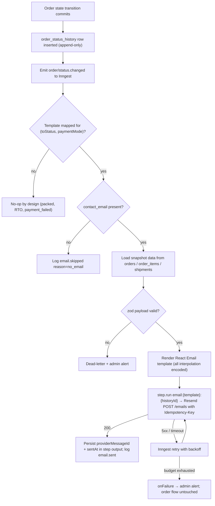
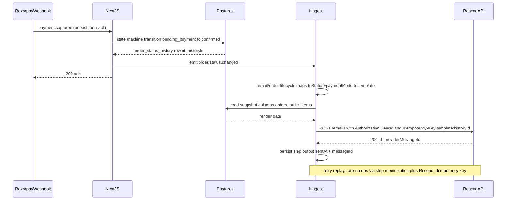
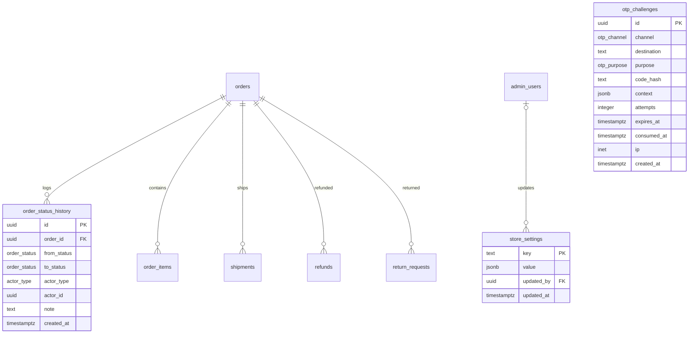

# Module Spec — Transactional Emails & Notifications (Resend)

> **Phase 2 (Weeks 6–8)** · Owner: Dev D (`packages/integrations/src/resend/**`, notification Inngest jobs) · Dev C reviews payment/refund-triggered emails · Dev E owns Mailpit/capture harness. OTP email templates pulled forward to Phase 1 for Dev B's auth.
> Sources of truth: PROJECT_PLAN.md §3.0 (Contract v1.0.0), §3.13; docs/DATABASE_ERD.md; risk-engineering design doc.
> **Vendor facts verified 2026-07-02 against resend.com/docs:** send endpoint `POST https://api.resend.com/emails`; auth `Authorization: Bearer re_...`; `Idempotency-Key` header (max 256 chars, keys expire after 24h); body fields `from`, `to` (max 50 recipients), `subject`, `html`, `text`, `reply_to`, `headers`, `tags`, `scheduled_at`, `attachments`; domain verification via SPF TXT + bounce MX + DKIM TXT, DMARC params in dashboard Records tab; Resend recommends a sending subdomain to isolate reputation. Anything not listed here is marked "verify at integration".

Two non-negotiable invariants (PROJECT_PLAN §3.13):

1. **Email never blocks money.** Order placement, payment confirmation, and state transitions commit first; email is always an async Inngest side effect. Sole exception: the synchronous OTP send inside `POST /api/auth/otp/request` (and its order-lookup/admin siblings) — the user is actively waiting for a code, so provider failure returns 502 `UPSTREAM_ERROR`.
2. **Email is an XSS/injection sink.** Gift messages, customer names, and addresses are attacker-controlled input rendered into HTML delivered to inboxes. Every interpolation is entity-encoded; no template ever concatenates raw strings into HTML.

---

## 1. Field-Level Specification

This module has no customer-facing HTML forms. Its "fields" are (a) template data payloads validated with zod before render, and (b) owner-editable `store_settings` keys. A malformed payload **dead-letters with an admin alert instead of sending a half-rendered email**.

### 1a. Template data payload fields (zod schemas in `packages/core/src/contracts/email.ts`)

| Field | Type | Required | Max length | Format / validation rule | On failure (internal, never user-facing) |
|---|---|---|---|---|---|
| `to` | string | yes | 254 | RFC 5322 addressable, pragmatic check `^[^\s@]+@[^\s@]+\.[^\s@]{2,}$` after citext-style lowercasing + trim; single recipient only for customer emails | zod fail → `email.skipped {reason:'invalid_recipient'}` structured log + dead-letter; NEVER call Resend with empty/invalid `to` |
| `template` | enum | yes | — | One of the 17 template IDs in §2 matrix, exact string match | Unknown template → dead-letter + admin alert `email.unknown_template` |
| `orderNumber` | string | order templates | 12 | `^KK-\d{5,}$` (matches `orders.order_number`) | dead-letter |
| `orderStatusHistoryId` | uuid | lifecycle templates | 36 | `^[0-9a-f]{8}-[0-9a-f]{4}-[0-9a-f]{4}-[0-9a-f]{4}-[0-9a-f]{12}$` — the idempotency anchor | dead-letter (no anchor = no send) |
| `customerName` | string | no | 120 | Free text; control chars `[\x00-\x1F\x7F]` stripped; **entity-encoded at render** (XSS sink) | Fallback greeting "Hi there," when absent |
| `giftMessage` | string | no | 300 | Stored raw per `order_items.gift_message CHECK (char_length <= 300)`; control chars stripped; **entity-encoded at render**; ZWJ emoji / Hindi / Bengali / RTL must round-trip UTF-8 | Omit the quoted gift block entirely when null/empty |
| `*_paise` money fields | integer | per template | — | `Number.isSafeInteger(v) && v >= 0`; rendered ONLY via `formatPaise()` — no float math, no arithmetic in templates | dead-letter (money must match order snapshots byte-for-byte) |
| `awbCode` | string | shipped/OFD | 40 | `^[A-Za-z0-9-]+$` from `shipments.awb_code` | dead-letter for shipped template (an AWB-less shipped email is a bug) |
| `courierName` | string | shipped/OFD | 80 | Free text, entity-encoded | Render "your courier" fallback |
| `expectedDeliveryAt` | timestamptz | no | — | ISO 8601 UTC; rendered via `formatIST()` only | **Omit the date line — never render "Expected: Invalid Date"** |
| `trackingUrl` | string | shipped/OFD/delivered | 2048 | Must start with the canonical storefront origin + `/track`; guest confirmation links may carry `access_token` (valid ≤ 24h) only | dead-letter (never interpolate arbitrary URLs into email CTAs) |
| `otpCode` | string | OTP templates | 6 | `^\d{6}$` | dead-letter; **never logged** |
| `refundAmountPaise` | integer | refund templates | — | Safe int > 0, equals `refunds.amount_paise` exactly | dead-letter |
| `payoutReference` | string | refund-processed (COD manual) | 60 | `^[A-Za-z0-9/-]+$` (UTR/UPI ref), entity-encoded | Omit reference line when null |
| `decisionNote` | string | return-rejected | 1000 | Free text from `return_requests.decision_note`, control chars stripped, entity-encoded | Omit note block when null |

### 1b. Owner-editable configuration (`store_settings`, writes owner-only, audited)

| Key | Type | Required | Validation rule | Exact admin-facing error message |
|---|---|---|---|---|
| `support_email` | string | yes | Email regex above, lowercased | "Enter a valid email address (e.g. care@kakoa.in)." |
| `support_phone` | string | yes | `^\+91[6-9]\d{9}$` | "Enter a valid Indian phone number starting with +91." |
| `notification_recipients` | string[] | yes (≥1) | JSON array, 1–10 entries, each passes the email regex, deduplicated case-insensitively | "Add at least 1 and at most 10 valid email addresses. Remove duplicates." |
| `new_order_notification_enabled` | boolean | yes | `true` / `false` only | "Value must be on or off." |

Invalid `store_settings` writes return 400 `VALIDATION_ERROR` with `fieldErrors` (zod `flatten()`), per Contract §2.1.

### 1c. Storefront-visible copy this module owns (OTP email channel UI states)

| State | Exact user-facing copy |
|---|---|
| Sending | "Sending code to y•••@gmail.com" (button spinner, resend disabled) |
| Sent | "Code sent — check your inbox (and spam)" + 60s countdown from `resendAfterSec` |
| 502 `UPSTREAM_ERROR` | "We couldn't send the email right now" + offer SMS channel where a phone exists |
| 429 `RATE_LIMITED` | Countdown from `Retry-After` header, e.g. "Try again in 4:32" |
| Email-less guest confirmation page | "Save this page — we couldn't email you a copy" banner with order number prominent |

---

## 2. Workflow / User Flow

### Full email matrix (trigger → template → recipient → data)

| # | Trigger | Template ID | Recipient | Key data |
|---|---|---|---|---|
| 1 | `order/status.changed` → `confirmed` + `payment_mode='prepaid'` | `order-confirmation-prepaid` | `orders.contact_email` | Line items (snapshots), money rows, gift message (encoded), ETA, tracking CTA (`access_token` ≤ 24h) |
| 2 | order created into `cod_pending_confirmation` | `order-cod-placed` | contact_email | "We'll call to confirm" + order summary |
| 3 | `cod_pending_confirmation → confirmed` | `order-cod-confirmed` | contact_email | Confirmation + summary |
| 4 | `→ shipped` | `order-shipped` | contact_email | `awb_code`, `courier_name`, `expected_delivery_at` (omit if NULL), tracking CTA |
| 5 | `→ out_for_delivery` | `order-out-for-delivery` | contact_email | Repeat-safe copy ("out for delivery today") — may legitimately fire twice on NDR reattempt |
| 6 | `→ delivered` + `customer_id IS NOT NULL` | `order-delivered-review-ask` | contact_email | Delivery confirmation + review CTA to account |
| 7 | `→ delivered` + guest | `order-delivered-guest` | contact_email | Delivery confirmation + return-window note ("7 days for damaged/quality issues"), **no review CTA** |
| 8 | `→ cancelled` | `order-cancelled` (4 copy variants by `from_status`: payment-expiry / customer / COD-declined / admin) | contact_email | Reason; for prepaid captured orders: "your refund of ₹X has been initiated automatically" |
| 9 | `refund/created` | `refund-initiated` | contact_email | "Approved, processing — 5–7 business days", `amount_paise` |
| 10 | `refund/processed` (webhook-driven only) | `refund-processed` | contact_email | Amount, destination, `payout_reference` (manual COD) |
| 11 | `return/decided` = approved | `return-approved` | contact_email | Next steps |
| 12 | `return/decided` = rejected | `return-rejected` | contact_email | `decision_note` (encoded) |
| 13 | `return/received` | `return-received` | contact_email | Receipt confirmation |
| 14 | `return/refunded` | `return-refunded` | contact_email | Hands off to refund templates for money copy |
| 15 | OTP request, `channel='email'` (purposes `customer_login`, `order_lookup`; `admin_login` always email) | `otp-{purpose}` (3 templates) | request destination | 6-digit code, "valid for 10 minutes" copy, purpose-specific subject |
| 16 | Admin ops events | `admin-alert` (generic ops layout) | `store_settings.notification_recipients` | New order (toggleable), COD queue depth > 25 or oldest > 24h, low-stock **daily digest**, orphan payment, `webhook_events` `failed_permanent`, refund failed |
| 17 | `refund.failed` | — no customer email — | admins only via #16 | Customer keeps seeing "processing" until resolved |

Unmapped transitions send nothing to the customer **by design**: `pending_payment`, `payment_failed`, `packed`, `rto_initiated`, `rto_delivered`.

### Numbered flow (lifecycle send)

1. A state transition commits: exactly one append-only `order_status_history` row inserts; the same code path emits `order/status.changed { orderId, historyId, fromStatus, toStatus }` to Inngest. **Transaction is already committed — email cannot roll it back.**
2. `email/order-lifecycle` receives the event; maps `(toStatus, payment_mode)` → template.
   - No mapping → function ends (no-op, by design).
3. Loads render data from **snapshot columns only** (`orders`, `order_items`, `shipments`) — never re-joins live catalog/settings.
4. `contact_email IS NULL` → structured log `email.skipped {reason:'no_email'}`, end. (Success branch for guests without email.)
5. zod-validates the template payload. Invalid → dead-letter + admin alert, end.
6. Renders React Email template → HTML + plain-text parts; all interpolations entity-encoded.
7. Single `step.run` with step ID `email:{template}:{historyId}` calls `EmailProvider.send()`, passing Resend `Idempotency-Key: {template}:{historyId}` (≤ 256 chars; Resend keys expire after 24h — within our retry window).
   - Success → step output persists `{ providerMessageId, sentAt }`; log `email.sent`.
   - Retryable failure (5xx/timeout) → Inngest retries with backoff; step memoization + the Resend idempotency key together guarantee at-most-one delivered email.
   - Retry budget exhausted → `onFailure` → admin alert. Customer flow unaffected; the order page is the receipt of record.



---

## 3. System Design



**External dependencies and exact down/timeout behavior:**

| Dependency | When down / timing out |
|---|---|
| **Resend** (`api.resend.com`, timeout 10s per call) | *Lifecycle/refund/return/admin emails:* Inngest retries with exponential backoff; order flow completely untouched; retry budget exhausted → `onFailure` → admin alert. *Synchronous OTP email:* caller returns **502 `UPSTREAM_ERROR`**; the `otp_challenges` row is still created, so the Class C 60s cooldown still applies (no free retry storm). **No email path can ever roll back or delay an order transaction.** Resend rate-limit 429 → treated as retryable (verify exact per-key limits at integration; our Inngest concurrency cap ≤ 10 keeps us under them). |
| **Inngest** (event ingestion) | Event emit failure after commit → transition stands; the reconciliation sweep and Inngest's own delivery guarantees are the safety net; emit is fire-and-forget with local error log + Sentry, never a thrown error in the order path. |
| **Postgres** | If the render-data read fails inside the function, the step throws → normal Inngest retry. |
| **DNS / deliverability** | SPF + bounce MX + DKIM TXT records verified in Resend dashboard on day one of Phase 2; DMARC `p=none` with `rua` reporting at setup, tightened post-launch. Staging sends from a separate subdomain identity (Resend's own recommendation) so staging traffic never poisons prod reputation. Domain status other than `verified` blocks the deploy checklist, not runtime. |

**Environment routing:** `EmailProvider` implementations — `resend` (prod/staging), `capture` (Mailpit locally, provider sandbox on previews). **Preview/CI never sends real email**; `packages/config` env validation makes a preview build with a live Resend key **fail at boot**.

**Caching strategy: none.** Every email renders from immutable snapshot columns at send time; caching rendered HTML would risk staleness against zero read pressure (sends are low-volume, write-once). `store_settings` footer values are read per-send (single-row PK lookups).

---

## 4. Database Schema

**This module owns no tables** (PROJECT_PLAN §3.13.2 — deliberate: idempotency rides on `order_status_history` row identity + Inngest step memoization; `sent_at` and the Resend message ID live in step output. A `notifications` audit table is an additive migration if ops ever needs it). DDL below is reproduced verbatim from docs/DATABASE_ERD.md for the tables this module reads.

### `order_status_history` (ERD §3.16) — the trigger source

| Column | Type | Constraints | Notes |
|---|---|---|---|
| `id` | `uuid` | `PRIMARY KEY DEFAULT gen_random_uuid()` | |
| `order_id` | `uuid` | `NOT NULL REFERENCES orders(id) ON DELETE CASCADE` | |
| `from_status` | `order_status` | | NULL for creation |
| `to_status` | `order_status` | `NOT NULL` | |
| `actor_type` | `actor_type` | `NOT NULL` | |
| `actor_id` | `uuid` | | `admin_users.id` / `customers.id` / NULL |
| `note` | `text` | | |
| `created_at` | `timestamptz` | `NOT NULL DEFAULT now()` | |

```sql
CREATE INDEX osh_order_idx ON order_status_history (order_id, created_at);
```

### `otp_challenges` (ERD §3.8) — email OTP channel; rate-limit authority

| Column | Type | Constraints | Notes |
|---|---|---|---|
| `id` | `uuid` | `PRIMARY KEY DEFAULT gen_random_uuid()` | |
| `channel` | `otp_channel` | `NOT NULL` | |
| `destination` | `text` | `NOT NULL` | E.164 phone or lowercased email |
| `purpose` | `otp_purpose` | `NOT NULL` | |
| `code_hash` | `text` | `NOT NULL` | `sha256(code || pepper)` |
| `context` | `jsonb` | | e.g. `{"order_number":"KK-48210"}` for order_lookup |
| `attempts` | `integer` | `NOT NULL DEFAULT 0 CHECK (attempts <= 5)` | |
| `expires_at` | `timestamptz` | `NOT NULL` | |
| `consumed_at` | `timestamptz` | | |
| `created_at` | `timestamptz` | `NOT NULL DEFAULT now()` | |
| `ip` | `inet` | | |

```sql
CREATE INDEX otp_open_idx ON otp_challenges (destination, purpose, created_at DESC)
  WHERE consumed_at IS NULL;
CREATE INDEX otp_rate_idx ON otp_challenges (destination, created_at);
```

### `store_settings` (ERD §3.1) — footer/legal/recipient config

| Column | Type | Constraints |
|---|---|---|
| `key` | `text` | `PRIMARY KEY` |
| `value` | `jsonb` | `NOT NULL` |
| `updated_by` | `uuid` | `REFERENCES admin_users(id) ON DELETE SET NULL` |
| `updated_at` | `timestamptz` | `NOT NULL DEFAULT now()` |

**Read-only render sources** (columns per ERD, not repeated in full): `orders` (`order_number`, `contact_email` citext nullable, `contact_phone`, `access_token`, `payment_mode`, `status`, `total_paise` + fee/discount/GST snapshot columns, `shipping_address` jsonb, `coupon_code`), `order_items` (`product_name`, `variant_name`, `unit_price_paise`, `quantity`, `gift_wrap`, `gift_wrap_fee_paise`, `gift_message CHECK (char_length(gift_message) <= 300)`), `shipments` (`awb_code UNIQUE`, `courier_name`, `expected_delivery_at`), `refunds` (`status refund_status DEFAULT 'initiated'`, `amount_paise CHECK (> 0)`, `destination`, `payout_reference`), `return_requests` (`status return_status`, `decision_note`).



(`otp_challenges` deliberately has no FKs — challenges are keyed by `destination` + `purpose`, per ERD note.)

---

## 5. API Design

**No public HTTP endpoints owned.** Surface = (a) the `EmailProvider` interface, (b) Inngest functions, (c) participation in existing endpoints' error contracts.

### 5a. `EmailProvider` interface (fixed in Phase 0, `packages/integrations`)

```ts
send({ to, template, data, idempotencyKey }): Promise<{ providerMessageId: string }>
// throws typed EmailProviderError { retryable: boolean }
// Inngest retries retryable errors, dead-letters the rest
```

Resend implementation call (verified against Resend docs 2026-07-02):

```
POST https://api.resend.com/emails
Authorization: Bearer re_xxxxxxxxx
Idempotency-Key: {template}:{historyId}        // ≤ 256 chars; Resend expires keys after 24h
Content-Type: application/json

{ "from": "KAKOA <orders@updates.kakoa.in>",   // sending subdomain per Resend recommendation
  "to": "customer@example.com",                 // single recipient for customer mail
  "subject": "...",
  "html": "<rendered React Email>",
  "text": "<plain-text part — every template>",
  "reply_to": "<store_settings.support_email>",
  "tags": [{ "name": "template", "value": "order-shipped" }] }
→ 200 { "id": "<providerMessageId>" }
```

Retryable: network timeout, 429, 5xx. Non-retryable: 4xx validation (dead-letter + alert). Exact Resend error body shape: **verify at integration**.

### 5b. Inngest functions (all event-triggered, all idempotent)

| Function | Trigger event | Idempotency key | Behavior |
|---|---|---|---|
| `email/order-lifecycle` | `order/status.changed` | step `email:{template}:{orderStatusHistoryId}` | Matrix rows 1–8; skips silently (logged) on null `contact_email`; unmapped transitions no-op |
| `email/refund-lifecycle` | `refund/created`, `refund/processed` | `email:{template}:{refundId}:{status}` | Rows 9–10; "processed" **only** from the `refund.processed` webhook processor; `refund.failed` → admin alert only |
| `email/return-decision` | `return/decided`, `return/received`, `return/refunded` | `email:{template}:{returnRequestId}:{status}` | Rows 11–14; `decision_note` encoded |
| `email/admin-alerts` | ops events | alert key, throttled | Row 16; identical alert key suppressed 4h; low-stock is a daily digest, never per-event; recipients from `store_settings.notification_recipients` |

Concurrency cap ≤ 10 concurrent sends per function (respects Resend API limits).

### 5c. Synchronous participation in existing endpoints (Contract §2.4)

| Endpoint | Auth tier | Rate limit | This module's role | Errors involving this module |
|---|---|---|---|---|
| `POST /api/auth/otp/request` (`channel:'email'`) | public | **Class C** (1/60s + 3/10min + 10/day per destination; 20/hr per IP) | `sendOtpEmail` called synchronously after challenge row insert | 502 `UPSTREAM_ERROR` (provider down; challenge row persists → cooldown holds); 429 `RATE_LIMITED`. **Always 200 whether or not the customer exists — no enumeration.** Response `{ challengeId, resendAfterSec: 60 }` |
| `POST /api/orders/lookup/request-otp` | public | Class C | Same, purpose `order_lookup` | Same |
| `POST /api/admin/auth/otp/request` | public | Class C | Always email; sends only for active `admin_users`, **generic 200 otherwise** | Same |
| `store_settings` writes (via `/api/admin/settings`) | `admin:owner` | Class E (600/min/session) | Validates keys in §1b | 400 `VALIDATION_ERROR`, 401 `UNAUTHORIZED`, 403 `FORBIDDEN` (staff) |

Async sends surface **no** API errors anywhere: failures live in Inngest retries → `onFailure` → admin alert.

**Explicitly not built at launch:** customer email preferences, marketing/newsletter campaigns, a "resend email" admin endpoint (operational resend = Inngest dashboard replay, documented in the runbook).

---

## 6. Security Standards

- **Rate limits (Contract classes):** OTP email = **Class C**: 1/60s + 3/10min + 10/day per destination; 20/hr per IP — enforced authoritatively by counting `otp_challenges` rows (DB is the authority, not middleware buckets alone). Settings writes = **Class E** (600/min per admin session). Admin alerts throttled 4h per identical alert key. Inngest send concurrency ≤ 10. Rate-limited responses carry `X-RateLimit-Limit/-Remaining/-Reset` + `Retry-After` on 429.
- **Input sanitization / XSS (the module's #1 OWASP risk — A03 Injection into an email sink):** React Email components only; `dangerouslySetInnerHTML` **banned in `templates/`** (lint rule); every interpolation entity-encoded by React's default escaping; control characters stripped pre-render; the XSS fixture corpus (gift messages, names, addresses) runs against **rendered email HTML** in CI. Subject lines with non-Latin names MIME-encode via the library, fixture-asserted. No user input ever forms part of a URL except the vetted tracking path.
- **Authz:** no public surface; `store_settings` notification keys owner-only, every change audited in `admin_audit_log`; Inngest endpoint signing-key-verified; Resend API key server-only env var, validated at boot, never shipped to client bundles.
- **Enumeration resistance:** OTP endpoints return generic 200 regardless of account existence; template + subject identical for new vs existing identities; admin OTP sends only for active admins but the response is indistinguishable.
- **Encryption at rest:** none additional — Supabase disk encryption covers snapshot PII; OTP codes exist only as `sha256(code || pepper)` in `otp_challenges`; no email bodies persisted by us (Resend's retention: default provider behavior, review in DPDP data map — verify at integration).
- **NEVER log:** raw recipient addresses (hash identifiers: `email.sent {template, order_id?, resend_message_id, latency_ms}` with hashed recipient), OTP codes, `access_token` values, full `shipping_address`, Resend API key. Request ID propagated from the originating transition for cross-system tracing.
- **DPDP classification:** all sends in this module are **transactional** (order/service communications) — no consent checkbox required under DPDP; newsletter/marketing is explicitly out of scope and would require separate consent. Emails render only snapshot PII the customer supplied for the order; the one-page DPDP data map lists Resend as a processor of `contact_email` + order snapshot fields.
- **Deliverability as security:** SPF + DKIM + DMARC (`p=none` → tighten post-launch) prevent domain spoofing/phishing against our customers; staging isolated on a separate subdomain identity; DMARC `rua` reports reviewed weekly.
- **Abuse economics:** OTP email spray costs money and reputation — Class C caps + per-IP cap + daily send-volume anomaly alert (10× baseline = template loop bug or abuse).

---

## 7. Edge Cases

1. **Gift-message XSS into the inbox.** `` in a gift message must render inert in Gmail/Outlook. No `dangerouslySetInnerHTML` anywhere in `templates/`; XSS fixture corpus runs against rendered email HTML in CI — launch-gate item "XSS fixtures passing on web, **email**, packing slip, and admin surfaces."
2. **Resend down / 5xx.** Lifecycle: Inngest backoff retries, order flow untouched; budget exhausted → `onFailure` → admin alert; the confirmation page (not the email) is the receipt of record. OTP: synchronous 502 `UPSTREAM_ERROR`, challenge row still created so Class C cooldowns hold.
3. **Inngest retry after Resend accepted.** Step crashed post-send, pre-persist → retry would re-send. Resend `Idempotency-Key = {template}:{historyId}` makes the second call a no-op (key window 24h > retry window); the send lives in one `step.run` whose output persists the message ID.
4. **Webhook replay / poll+webhook double transition.** Duplicate `payment.captured` or Shiprocket events are `skipped` by the state machine and write **no** history row ⇒ no event ⇒ no email. Email idempotency is inherited from transition idempotency — test the pair together, not separately.
5. **Courier skips the OFD scan** (`shipped → delivered` is a legal transition). The delivered email must not depend on the OFD email having been sent; each template renders self-contained from current order state. Conversely `rto_initiated → out_for_delivery` (NDR reattempt) may fire OFD **twice** legitimately — distinct history rows, distinct sends, correct behavior; copy written to be repeat-safe.
6. **Guest with no email.** `orders.contact_email` is nullable. Every lifecycle function checks and skips with `email.skipped {reason:'no_email'}` — never a crash, never a Resend call with an empty recipient. Confirmation page shows the "Save this page" banner.
7. **"Refund processed" before money moved.** The processed email is driven only by the `refund.processed` webhook/poll outcome, never by refund-row creation; `refund.failed` re-notifies admins, not the customer, whose copy stays "approved, processing" through any retry loop.
8. **Stale-payment capture after cancellation email.** Customer got the cancellation email, then completes the still-open Razorpay modal. The auto-refund path sends "refund initiated"; the lifecycle map has **no template for transitions into an already-terminal state** because the state machine forbids them — a second order confirmation is structurally impossible.
9. **OTP email enumeration.** Generic 200 for all identities; identical template/subject new-vs-existing; admin endpoint sends only for active `admin_users` while returning generic 200 — the template can't leak what the API hides.
10. **Emoji / Hindi / RTL gift messages and names.** UTF-8 end to end; grapheme fixtures (ZWJ emoji, Bengali + emoji mix) rendered into email HTML; non-Latin subject lines MIME-encode correctly (library-handled, fixture-asserted).
11. **Deliverability cold start.** SPF/DKIM/DMARC on day one of Phase 2 (DNS propagation needs lead time — Week 6 task, not launch-week); staging on a separate subdomain; launch checklist includes domain warm-up + one real-inbox render check per template (Gmail + Outlook).
12. **Alert-storm self-inflicted DoS.** Flash-sale burst or poison webhook loop could generate hundreds of admin alerts. Alert keys throttled (4h suppression), low-stock is a daily digest, Inngest concurrency cap bounds blast radius.
13. **Snapshot fidelity.** A price/fee change between placement and the shipped email must not alter any figure in any email — all money renders from `orders`/`order_items` snapshot columns; a test mutates variant price post-placement and asserts the confirmation email total equals `orders.total_paise` byte-for-byte.
14. **`expected_delivery_at IS NULL`** (courier gave no ETD): the shipped email omits the date line entirely — never "Expected: Invalid Date".

---

## 8. State Machine

**Not applicable.** This module owns no stateful entity — it is a pure fan-out consumer of other modules' state machines (`order_status`, `refund_status`, `return_status`); send-level idempotency is handled by Inngest step memoization + the Resend `Idempotency-Key`, not by a persisted email state.

---

## 9. Testing Requirements

**Unit (≥ 90% on this module's pure code):**
- `(toStatus, paymentMode) → template` map: table-driven over all 11 `order_status` values × both `payment_mode` values, asserting mapped/unmapped exactly per the §2 matrix.
- Render snapshot tests for every template using canonical fixture orders (one per order status, `packages/core/src/fixtures`) — catches copy/markup regressions.
- **XSS fixture corpus through every customer-facing template:** payloads appear entity-encoded in output HTML, zero active content; grapheme/emoji/Hindi fixtures round-trip.
- Lint-level check: no template imports `Date.prototype.toLocaleString` directly or does arithmetic on money (`formatPaise`/`formatIST` only); `dangerouslySetInnerHTML` banned in `templates/`.
- Missing-data branches: null `contact_email` (skip), null `expected_delivery_at` (line omitted), guest vs customer delivered variant, null gift message (block omitted).
- Recipient/`store_settings` validators: every regex in §1 with pass/fail vectors.

**Integration (ephemeral Postgres + capture provider + Inngest test harness):**
- `pending_payment → confirmed` → exactly one confirmation email captured; **replay the same `payment.captured` webhook fixture** → still exactly one (idempotency inherited end-to-end).
- Crash injection: fail the step after the capture provider accepted → Inngest retry → idempotency key produced one logical send.
- `refund.processed` fixture → processed email; `refund.failed` fixture → admin alert and **no** customer email.
- OTP email path: provider-down mock → 502 `UPSTREAM_ERROR`, challenge row exists, cooldown enforced on immediate retry.
- Admin-alert throttle: same alert key 5× in a minute → one email.
- Post-placement price mutation → confirmation email total still equals `orders.total_paise`.

**E2E (named scenarios, capture provider):**
1. **Golden-path email trail** — guest prepaid order via Razorpay test mode → Mailpit shows order confirmation with correct paise totals and encoded gift message → admin advances `packed → shipped` (mock Shiprocket) → shipped email with AWB → mock emits delivered → delivered email present, review-ask **absent** (guest).
2. **Partial-refund email** — admin refunds 1 of 2 lines → "refund initiated" for the exact line amount incl. coupon share → simulated `refund.processed` → "refund processed" email; assert no processed email existed before the webhook fixture fired.
3. **COD lifecycle emails** — COD order placed (COD-placed email) → staff confirms in the COD queue (COD-confirmed email) → staff declines a second seeded order (cancellation email with COD-declined copy).

---

## 10. Definition of Done

- [ ] SPF + DKIM + DMARC verified on the sending domain in the Resend dashboard (`verified` status); staging isolated on a subdomain identity; DMARC `p=none` with `rua` reporting live
- [ ] One real-inbox render check per template (Gmail + Outlook); plain-text part present on every template
- [ ] All templates render from snapshot columns only — post-placement price-change test green
- [ ] XSS fixture corpus green against every customer-facing template's rendered HTML (launch-gate checklist item); `dangerouslySetInnerHTML` lint ban enforced
- [ ] Status→template map table-tested over all 11 statuses × 2 payment modes; unmapped statuses provably send nothing
- [ ] Webhook-replay-produces-one-email integration test green; crash-injection idempotency test green (step memoization + Resend `Idempotency-Key` both exercised)
- [ ] Provider-down behavior proven: lifecycle async (order flow unaffected, retry + alert), OTP synchronous 502 `UPSTREAM_ERROR` with Class C cooldown intact
- [ ] Null-email guest skip path and guest/customer delivered-variant logic tested; null `expected_delivery_at` omits the date line
- [ ] Refund emails gated on `refund.processed`; `refund.failed` alerts admins only (customer copy unchanged)
- [ ] Admin alert throttle (4h/key) + low-stock daily digest live; recipients owner-configurable via `store_settings` with `admin_audit_log` rows
- [ ] PII-hashed structured logging (`email.sent/skipped/failed`, recipients hashed, OTP codes never logged) + request-ID propagation
- [ ] Alerts wired: Resend failure rate > 10% over 15 min; any send function `failed_permanent`; OTP-email delivery success < 90% over 1h; daily send volume 10× baseline anomaly
- [ ] Capture provider hard-forced outside prod/staging (`packages/config` boot failure on a preview build with a live Resend key); preview/CI never sends real email
- [ ] Inngest concurrency cap ≤ 10 on send functions; `EXTERNAL_CALLS.md` registry entry for email dedupe keys reviewed
- [ ] The 3 named E2E scenarios green in CI against the capture provider
- [ ] Runbook documents operational resend via Inngest dashboard replay; DPDP data map lists Resend as processor
