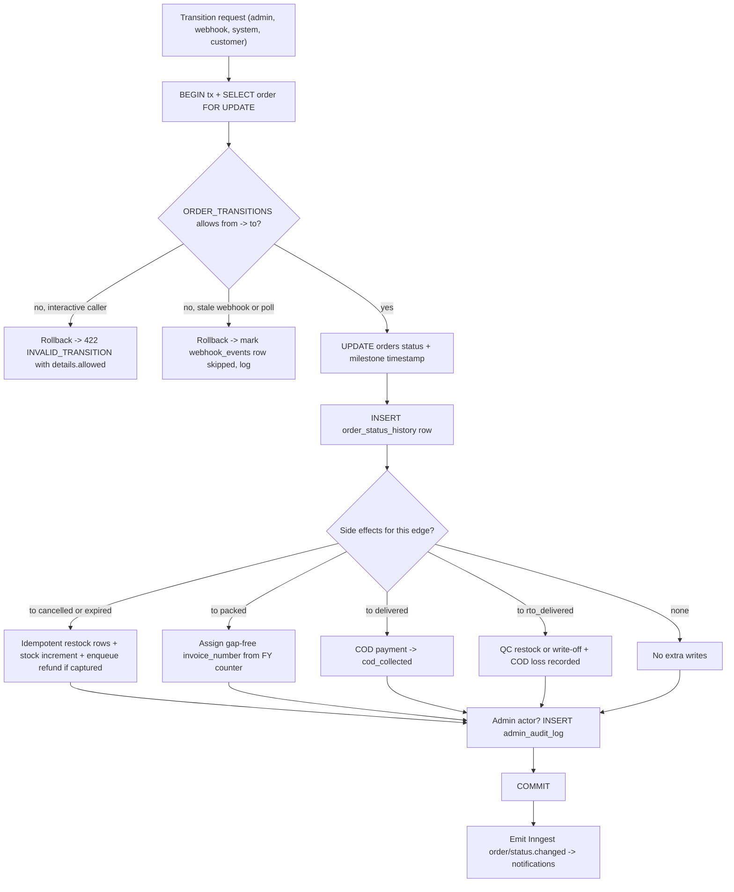
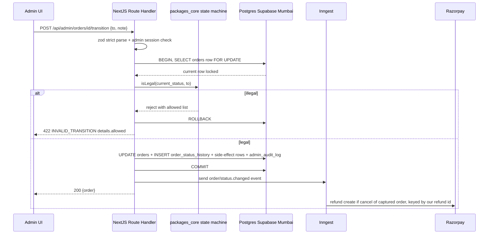
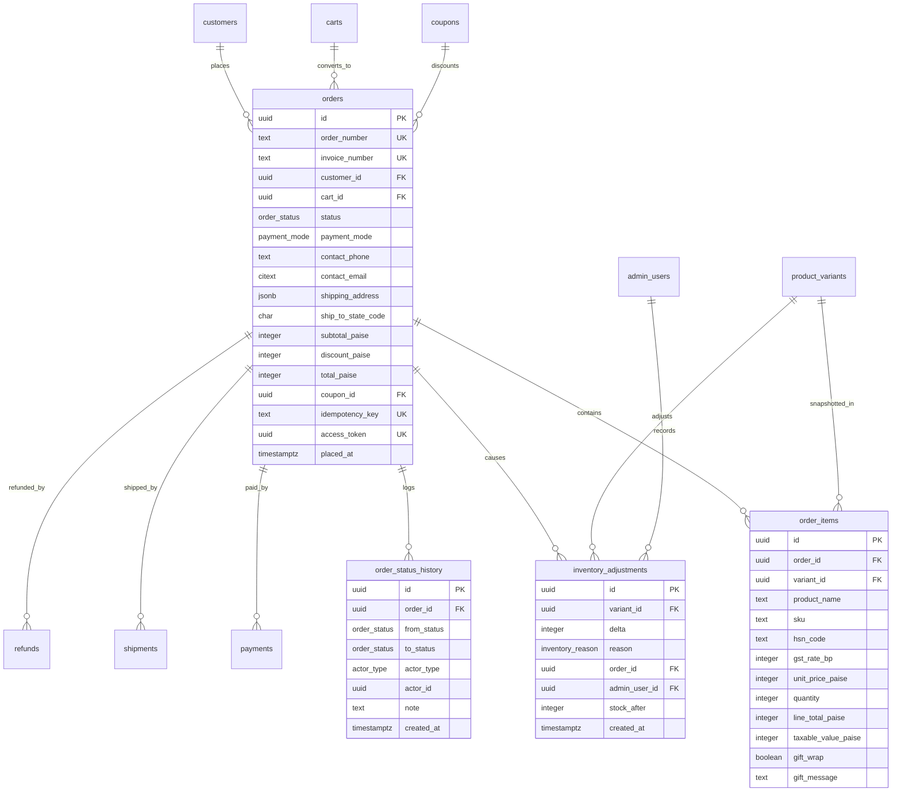
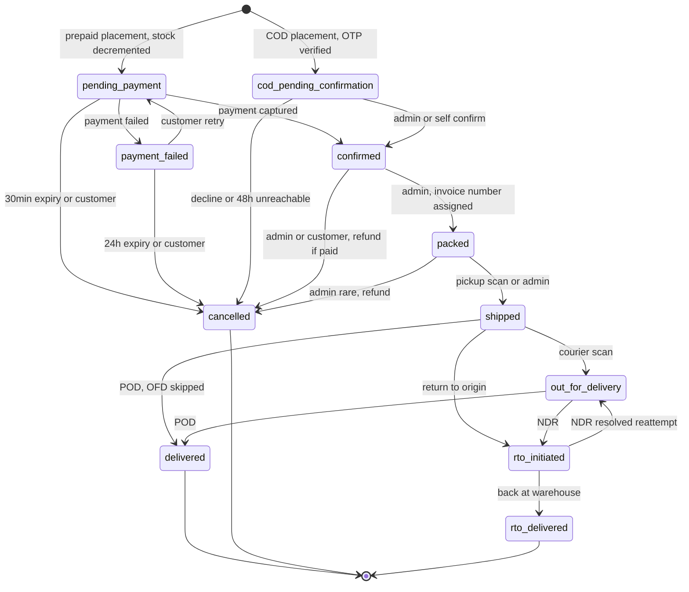

# Module Spec — Order Management & State Machine (Phase 2)

> **Module owner:** Dev C (Payments & Checkout) with Dev B co-owning `packages/core/src/order-state-machine.ts` and Dev D owning the admin ops surface. State-machine PRs require B + C + D approval (PROJECT_PLAN §2.2, §3.6).
> **Sources of truth:** Contract §1.14–1.16, §1.22, §1.27–1.29 (PROJECT_PLAN §3.0), PROJECT_PLAN §3.6 / §3.14, docs/DATABASE_ERD.md §3.14–3.16, §3.22, risk-engineering Modules 3, 6, 10.
> This doc covers the order lifecycle AFTER placement (placement itself is the Checkout module spec). All money is integer paise; all timestamps `timestamptz` UTC, rendered IST via `formatIST()`.

---

## 1. Field-Level Specification

Inputs across the admin transition/cancel/confirm-COD endpoints, customer cancel, and the list-filter GETs.

| Field | Endpoint(s) | Type | Required | Max len | Format / validation rule (exact) | Error message on failure (user-facing) |
|---|---|---|---|---|---|---|
| `to` | `POST /api/admin/orders/[id]/transition` | string enum | yes | — | Must be one of the 11 `order_status` values: `^(pending_payment\|payment_failed\|cod_pending_confirmation\|confirmed\|packed\|shipped\|out_for_delivery\|delivered\|cancelled\|rto_initiated\|rto_delivered)$`; then validated against `ORDER_TRANSITIONS[currentStatus]` | Unknown value: `"Invalid status value."` (400 `VALIDATION_ERROR`). Off-map: `"This order is now {currentStatus}. Allowed next steps: {allowed}."` (422 `INVALID_TRANSITION`, `details.allowed: OrderStatus[]`) |
| `note` | transition, confirm-cod | string | no | 500 | `.trim()`, 0–500 chars, ASCII control characters (U+0000–U+001F except newline) stripped | `"Note must be 500 characters or fewer."` |
| `outcome` | `POST /api/admin/orders/[id]/confirm-cod` | string enum | yes | — | `^(confirmed\|cancelled)$` | `"Outcome must be 'confirmed' or 'cancelled'."` |
| `reason` | `POST /api/admin/orders/[id]/cancel`, `POST /api/orders/[orderNumber]/cancel` | string | yes | 500 | `.trim()`, 1–500 chars after trim | Empty: `"Please provide a cancellation reason."` Too long: `"Reason must be 500 characters or fewer."` |
| `status` (filter) | `GET /api/admin/orders` | string enum | no | — | Same 11-value `order_status` regex as `to` | `"Invalid status filter."` (400) |
| `paymentMode` (filter) | `GET /api/admin/orders` | string enum | no | — | `^(prepaid\|cod)$` | `"Invalid payment mode filter."` (400) |
| `q` (search) | `GET /api/admin/orders` | string | no | 100 | `.trim()`, 1–100 chars; matched against `order_number` (exact/prefix), `contact_phone`, `contact_email` — always parameterized, never interpolated | `"Search term too long (max 100 characters)."` |
| `from`, `to` (dates) | `GET /api/admin/orders`, metrics | string | no | 10 | **IST calendar date** `^\d{4}-\d{2}-\d{2}$`, must be a real date; `from <= to`; converted server-side via `istDayToUtcRange()` (IST 00:00:00.000 → 23:59:59.999 mapped to UTC) | `"Invalid date. Use YYYY-MM-DD."` / `"'From' date must be on or before 'To' date."` |
| `page` | all list GETs | integer | no | — | `^[1-9]\d{0,4}$` (1–99999); default 1; page size fixed at 20 | `"Invalid page number."` |
| `orderNumber` (path) | account GET, tracking, cancel, lookup | string | yes | 9 | `^KK-\d{5}$` (e.g. `KK-48210`) | `"Order not found."` (404 `NOT_FOUND` — format failures return the same 404 as missing orders; no format oracle) |
| `accessToken` (query) | `GET /api/orders/[orderNumber]/tracking?accessToken=` | uuid | conditional | 36 | `^[0-9a-f]{8}-[0-9a-f]{4}-[0-9a-f]{4}-[0-9a-f]{4}-[0-9a-f]{12}$`; must equal `orders.access_token` AND `now() - placed_at <= 24h` | Bad/mismatched: `"You don't have access to this order."` (401 `UNAUTHORIZED`). Older than 24h: `"This link has expired. Track your order via OTP lookup."` (410 `TOKEN_EXPIRED`) |
| `trackingToken` (Bearer) | tracking GET, customer cancel | JWT | conditional | — | HS256 JWT from `/api/orders/lookup/verify`; claims `{orderId, scope:'tracking'}`, 30-min expiry; `orderId` must match the order resolved from the path | Invalid/expired: `"Session expired — verify again to continue."` (410 `TOKEN_EXPIRED`); wrong-order token: 404 `NOT_FOUND` (no cross-order oracle) |

Notes:
- `invoice_number` and `order_number` are **never inputs** — they are server-assigned (`'KK-' || lpad(nextval('order_number_seq'),5,'0')` at placement; GST serial `'KK/25-26/00042'` at `packed`, §5 below).
- All request bodies are zod `.strict()` — unknown keys → 400 `VALIDATION_ERROR` with `fieldErrors` (zod `flatten()`).

---

## 2. Workflow / User Flow

Core workflow: an order moves from placement to a terminal state; every move is one guarded transaction.

1. Order exists post-placement in `pending_payment` (prepaid) or `cod_pending_confirmation` (COD). Stock already decremented (`inventory_adjustments` reason `order_placed`, one row per variant, same tx as placement).
2. A **transition request** arrives from one of four actor types: `system` (Inngest sweeps: 30-min payment expiry, 24h retry expiry, 48h COD-unreachable), `webhook` (Razorpay `payment.captured`/`payment.failed`; Shiprocket tracking events), `admin` (ops buttons), `customer` (cancel, retry-payment, COD self-confirm).
3. Server opens a transaction: `SELECT ... FOR UPDATE` on the single `orders` row (Contract §1.28.3).
4. Validate `(current_status, requested_status)` against `ORDER_TRANSITIONS` (pure data map in `packages/core/src/order-state-machine.ts`).
   - **Failure branch:** off-map → rollback → 422 `INVALID_TRANSITION` with `details.allowed`. For stale webhook/poll events (e.g. `out_for_delivery` arriving after `delivered`), the processor logs and marks the `webhook_events` row `skipped` — no error surfaced.
5. On success, within the SAME transaction: `UPDATE orders SET status = $to, {milestone}_at = now(), updated_at = now()` + `INSERT order_status_history (order_id, from_status, to_status, actor_type, actor_id, note)`.
6. Side effects, same transaction where transactional, async where external:
   - `→ cancelled` / system `payment_expired`: idempotent restock rows (reason `order_cancelled` / `payment_expired`) + conditional `UPDATE product_variants SET stock_quantity = stock_quantity + qty`; prepaid captured → enqueue auto-refund (Inngest, Razorpay refund keyed by our refund id).
   - `→ confirmed` (COD path): payment row → `cod_pending_collection`.
   - `→ packed`: assign gap-free GST `invoice_number` (see §5 Invoice serial).
   - `→ delivered`: COD payment → `cod_collected`; set `delivered_at`.
   - `→ rto_delivered`: QC disposition — restock (reason `rto_restock`, idempotent) or write-off (`damage_writeoff`) per heat-sensitivity policy; COD payment → `failed`; COD loss recorded.
   - Admin-actor transitions additionally write `admin_audit_log` (`action='order.transition'`, before/after) in the same tx.
7. Commit → emit Inngest event (`order/status.changed`) → transactional email/SMS fan-out (Emails module).
8. Customer/admin reads (`GET /api/account/orders*`, `GET /api/admin/orders*`, tracking) render `order_status_history` as the timeline — the ledger is the UI.



---

## 3. System Design

Core action: admin transitions an order (webhook and sweep paths reuse the identical arbiter).



**External dependencies and exact down/timeout behavior:**

| Dependency | Used for | Behavior when down / timing out |
|---|---|---|
| Postgres (Supabase Mumbai) | everything | Transition fails, tx never partially applies (single tx). 500 `INTERNAL`. No retry loop in-request; admin retries manually; sweeps retry on next Inngest run. |
| Razorpay | auto-refund on cancel of a captured prepaid order | **Never blocks the transition.** Cancel commits first; the refund is an Inngest job (idempotent — keyed by our `refunds.id` as Razorpay reference). Razorpay 5xx → Inngest retries with backoff; stuck > 4h → refund appears in admin exceptions with 502 `UPSTREAM_ERROR` surfaced on manual retry. |
| Shiprocket | inbound tracking that *drives* shipping-leg transitions | Webhooks are best-effort; the 30-min poller is the correctness path (risk Module 6 #4). Shiprocket down → orders sit at last known state; poller alerts after a shipment is stuck non-terminal > 48h without events. Customer timeline shows last verified scan — never fabricated states. |
| Inngest | sweeps (payment expiry, COD 48h auto-cancel), notification fan-out, refund jobs | Event emit failure after commit → transition already durable in `order_status_history`; a reconciliation cron re-derives pending notifications/refunds from DB state (history rows are the outbox). |
| MSG91 / Resend | status notifications | Fully async; failure never affects order state. Retried by Inngest; logged. |

**Caching strategy: none for order data.** Orders are money truth and transition concurrently via webhooks/sweeps — every read (admin detail, account history, tracking) hits Postgres. Admin list queries lean on `orders_open_ops_idx` / `orders_status_idx` instead of caches. The only adjacent cache is pincode serviceability (24h TTL, Checkout module — not this doc).

---

## 4. Database Schema

DDL verbatim from docs/DATABASE_ERD.md §3.14–3.16, §3.22 (Contract §1.14–1.16, §1.22).

```sql
CREATE TABLE orders (
  id             uuid PRIMARY KEY DEFAULT gen_random_uuid(),
  order_number   text NOT NULL UNIQUE,        -- 'KK-48210'; 'KK-' || lpad(nextval('order_number_seq'),5,'0')
  invoice_number text UNIQUE,                 -- GST invoice serial 'KK/25-26/00042'; assigned at 'packed'
  customer_id    uuid REFERENCES customers(id) ON DELETE SET NULL,   -- NULL = guest
  cart_id        uuid REFERENCES carts(id) ON DELETE SET NULL,
  status         order_status NOT NULL,
  payment_mode   payment_mode NOT NULL,
  currency       char(3) NOT NULL DEFAULT 'INR',

  contact_phone  text NOT NULL CHECK (contact_phone ~ '^\+91[6-9][0-9]{9}$'),
  contact_email  citext,
  cod_phone_verified_at timestamptz,          -- set when COD OTP passed at placement

  shipping_address jsonb NOT NULL,            -- SNAPSHOT {fullName,phone,line1,line2,landmark,city,state,stateCode,pincode}
  billing_address  jsonb,                     -- NULL = same as shipping
  ship_to_state_code char(2) NOT NULL,        -- drives CGST/SGST vs IGST split
  delivery_opt   delivery_option NOT NULL,

  subtotal_paise        integer NOT NULL CHECK (subtotal_paise >= 0),      -- sum of line totals (GST-incl)
  discount_paise        integer NOT NULL DEFAULT 0 CHECK (discount_paise >= 0),
  shipping_fee_paise    integer NOT NULL DEFAULT 0 CHECK (shipping_fee_paise >= 0),  -- SNAPSHOT of settings
  cod_fee_paise         integer NOT NULL DEFAULT 0 CHECK (cod_fee_paise >= 0),       -- SNAPSHOT
  gift_wrap_total_paise integer NOT NULL DEFAULT 0 CHECK (gift_wrap_total_paise >= 0),
  total_paise           integer NOT NULL CHECK (total_paise >= 0),
  cgst_paise integer NOT NULL DEFAULT 0,      -- informational extraction from inclusive prices
  sgst_paise integer NOT NULL DEFAULT 0,
  igst_paise integer NOT NULL DEFAULT 0,

  coupon_id     uuid REFERENCES coupons(id) ON DELETE SET NULL,
  coupon_code   text,                          -- SNAPSHOT: survives coupon edits/deletes

  idempotency_key text UNIQUE,                 -- client-generated per placement attempt
  access_token  uuid NOT NULL UNIQUE DEFAULT gen_random_uuid(),  -- guest success-page auth, 24h honored
  customer_note text,
  cancel_reason text,
  placed_at     timestamptz NOT NULL DEFAULT now(),
  confirmed_at  timestamptz, packed_at timestamptz, shipped_at timestamptz,
  delivered_at  timestamptz, cancelled_at timestamptz, rto_delivered_at timestamptz,
  created_at    timestamptz NOT NULL DEFAULT now(),
  updated_at    timestamptz NOT NULL DEFAULT now(),
  CHECK (total_paise = subtotal_paise - discount_paise + shipping_fee_paise
                      + cod_fee_paise + gift_wrap_total_paise)
);
CREATE INDEX orders_customer_idx ON orders (customer_id, placed_at DESC) WHERE customer_id IS NOT NULL;
CREATE INDEX orders_status_idx   ON orders (status, placed_at DESC);
CREATE INDEX orders_open_ops_idx ON orders (placed_at)                   -- admin ops queue: partial, tiny & hot
  WHERE status IN ('cod_pending_confirmation','confirmed','packed');
CREATE INDEX orders_phone_idx    ON orders (contact_phone);              -- guest lookup + COD abuse checks
CREATE INDEX orders_pending_expiry_idx ON orders (placed_at) WHERE status = 'pending_payment';  -- expiry sweep

CREATE TABLE order_items (
  id            uuid PRIMARY KEY DEFAULT gen_random_uuid(),
  order_id      uuid NOT NULL REFERENCES orders(id) ON DELETE CASCADE,
  variant_id    uuid NOT NULL REFERENCES product_variants(id) ON DELETE RESTRICT,
  product_name  text NOT NULL,                -- SNAPSHOT
  variant_name  text NOT NULL,                -- SNAPSHOT
  sku           text NOT NULL,                -- SNAPSHOT
  image_url     text,                         -- SNAPSHOT
  hsn_code      text NOT NULL,                -- SNAPSHOT
  gst_rate_bp   integer NOT NULL,             -- SNAPSHOT
  unit_price_paise integer NOT NULL CHECK (unit_price_paise > 0),  -- SNAPSHOT (GST-inclusive)
  quantity      integer NOT NULL CHECK (quantity > 0),
  line_total_paise integer NOT NULL,          -- unit*qty + gift_wrap_fee
  taxable_value_paise integer NOT NULL,       -- extracted: line_total - line tax
  cgst_paise integer NOT NULL DEFAULT 0, sgst_paise integer NOT NULL DEFAULT 0, igst_paise integer NOT NULL DEFAULT 0,
  gift_wrap     boolean NOT NULL DEFAULT false,
  gift_wrap_fee_paise integer NOT NULL DEFAULT 0,   -- SNAPSHOT of settings at placement
  gift_message  text CHECK (char_length(gift_message) <= 300),
  created_at    timestamptz NOT NULL DEFAULT now()
);
CREATE INDEX order_items_order_idx   ON order_items (order_id);
CREATE INDEX order_items_variant_idx ON order_items (variant_id);   -- "customers also bought" + sales-by-SKU

CREATE TABLE order_status_history (
  id          uuid PRIMARY KEY DEFAULT gen_random_uuid(),
  order_id    uuid NOT NULL REFERENCES orders(id) ON DELETE CASCADE,
  from_status order_status,                   -- NULL for creation
  to_status   order_status NOT NULL,
  actor_type  actor_type NOT NULL,
  actor_id    uuid,                           -- admin_users.id / customers.id / NULL
  note        text,
  created_at  timestamptz NOT NULL DEFAULT now()
);
CREATE INDEX osh_order_idx ON order_status_history (order_id, created_at);

CREATE TABLE inventory_adjustments (
  id            uuid PRIMARY KEY DEFAULT gen_random_uuid(),
  variant_id    uuid NOT NULL REFERENCES product_variants(id) ON DELETE RESTRICT,
  delta         integer NOT NULL CHECK (delta <> 0),
  reason        inventory_reason NOT NULL,
  order_id      uuid REFERENCES orders(id) ON DELETE SET NULL,
  admin_user_id uuid REFERENCES admin_users(id) ON DELETE SET NULL,
  note          text,
  stock_after   integer NOT NULL CHECK (stock_after >= 0),
  created_at    timestamptz NOT NULL DEFAULT now()
);
CREATE INDEX inv_adj_variant_idx ON inventory_adjustments (variant_id, created_at DESC);
CREATE UNIQUE INDEX inv_adj_once_per_cause_idx ON inventory_adjustments (order_id, variant_id, reason)
  WHERE reason IN ('order_placed','order_cancelled','payment_expired','rto_restock','return_restock');
```

**Snapshot columns (Contract §1.29, normative):** `order_items.product_name/variant_name/sku/image_url/hsn_code/gst_rate_bp/unit_price_paise` + tax splits, `orders.shipping_address/billing_address/coupon_code/shipping_fee_paise/cod_fee_paise/gift_wrap_total_paise`, `order_items.gift_wrap_fee_paise` — catalog, coupon, address-book, and fee edits NEVER mutate a placed order.



---

## 5. API Design

Envelope per Contract §2.1 (`ApiOk`/`ApiErr`). Common errors (400 `VALIDATION_ERROR`, 401 `UNAUTHORIZED`, 403 `FORBIDDEN`, 429 `RATE_LIMITED`, 500 `INTERNAL`) apply everywhere and are not repeated. Admin routes require `kakoa_admin` cookie → live `admin_sessions` check; every admin mutation writes `admin_audit_log`.

| # | Method + Route | Auth | Rate class | Request | Success response | Endpoint-specific errors |
|---|---|---|---|---|---|---|
| 1 | `GET /api/admin/orders?status=&paymentMode=&q=&from=&to=&page=` | admin:staff | E (600/min per admin session) | query per §1; `from/to` IST calendar dates via `istDayToUtcRange()` | `{ orders: AdminOrderRow[] }` + `meta {page, pageSize, total}` | — |
| 2 | `GET /api/admin/orders/[id]` | admin:staff | E | — | `{ order: AdminOrderDetail }` — items, payments, refunds, shipments+events, full `order_status_history`, return requests | 404 `NOT_FOUND` |
| 3 | `POST /api/admin/orders/[id]/transition` | admin:staff | E | `{ to: OrderStatus, note?: string }` | `{ order }` (fresh state) | 404 `NOT_FOUND`; 422 `INVALID_TRANSITION` with `details: { allowed: OrderStatus[] }` |
| 4 | `POST /api/admin/orders/[id]/confirm-cod` | admin:staff | E | `{ outcome: 'confirmed'\|'cancelled', note?: string }` | `{ order }`. Confirm: order → `confirmed`, payment → `cod_pending_collection`. Cancel: restock + close. **Idempotent:** replay of the same outcome returns current state 200. | 404; 422 `INVALID_TRANSITION` (order not in `cod_pending_confirmation`) |
| 5 | `POST /api/admin/orders/[id]/cancel` | admin:staff | E | `{ reason: string }` | `{ order }` — restock (idempotent ledger rows) + auto-refund enqueued if a captured payment exists | 404; 422 `INVALID_TRANSITION` (already shipped/terminal — cancel is only legal from `pending_payment`, `payment_failed`, `cod_pending_confirmation`, `confirmed`, `packed`) |
| 6 | `GET /api/account/orders?page=` | customer | — (authenticated read; no dedicated class per §3.5) | — | `{ orders: OrderSummary[] }` paginated via `meta`; scoped `WHERE customer_id = session.customer_id`, uses `orders_customer_idx` | — |
| 7 | `GET /api/account/orders/[orderNumber]` | customer | — | — | `{ order: OrderDetail }` — items, payments, timeline from `order_status_history` | 404 `NOT_FOUND` if not owner's (**never 403** — no existence oracle) |
| 8 | `GET /api/orders/[orderNumber]/tracking` | customer-owner \| Bearer trackingToken (30-min JWT, `scope:'tracking'`) \| `?accessToken=` (`orders.access_token`, ≤24h post-placement) | A (120/min per IP) | — | `{ order, timeline: TimelineStep[], shipment: { awb, courierName, expectedDeliveryAt } \| null }` | 401 `UNAUTHORIZED`; 404 `NOT_FOUND`; 410 `TOKEN_EXPIRED` |
| 9 | `POST /api/orders/[orderNumber]/cancel` | customer-owner \| Bearer trackingToken | D (10/min per session) | `{ reason: string }` | `{ order }` — same state-machine arbiter; restock + auto-refund if captured | 401; 404; 422 `INVALID_TRANSITION` (already packed/shipped: message `"This order is already being prepared and can no longer be cancelled online. Contact support."`) |

**Idempotency handling:**
- Transitions are naturally idempotent at the arbiter: a replayed `confirmed → confirmed` request is off-map → for webhooks/sweeps it is logged + `skipped`; for `confirm-cod` a same-outcome replay returns 200 with current state (contract-specified); for admin `transition` the UI receives 422 with `details.allowed` and re-syncs.
- Restocks can never double-apply: `inv_adj_once_per_cause_idx` (partial UNIQUE on `(order_id, variant_id, reason)`) makes the ledger insert the idempotency gate — the stock increment runs only when the ledger insert succeeds (`ON CONFLICT DO NOTHING` → zero rows → skip increment). A replayed cancel webhook or double-fired sweep restocks exactly once.
- Auto-refunds are keyed by our `refunds.id` as the Razorpay idempotency reference.

**Invoice serial (gap-free, normative):** on the `packed` transition, inside the same FOR-UPDATE transaction, the per-financial-year invoice counter (a `store_settings` row, e.g. key `invoice_counter_2025_26`, locked `FOR UPDATE`) is incremented and formatted as `'KK/' || fy_short || '/' || lpad(counter, 5, '0')` → `KK/25-26/00042`, written to `orders.invoice_number` (UNIQUE). Because the counter increment commits or rolls back atomically with the transition, the GST serial is **gap-free per financial year** (a plain `nextval` sequence is forbidden here — sequences leak gaps on rollback). FY boundary = April 1 **IST**. `order_number_seq` (order numbers `KK-NNNNN`) is a plain sequence — gaps there are acceptable and expected.

---

## 6. Security Standards

- **Rate limits (Contract §2.1 classes):** admin routes Class E — 600/min per admin session; tracking GET Class A — 120/min per IP; customer cancel Class D — 10/min per session; guest lookup OTP (Checkout module) Class C — 1/60s + 3/10min + 10/day per destination, 20/hr per IP, 5 verify attempts then 410. All limited responses carry `X-RateLimit-Limit`, `X-RateLimit-Remaining`, `X-RateLimit-Reset`; 429 adds `Retry-After` + body code `RATE_LIMITED`.
- **AuthZ matrix:** order readable ONLY by (a) owning customer session, (b) valid 30-min trackingToken whose `orderId` claim matches, (c) `access_token` query param within 24h of `placed_at`, or (d) admin session. Cross-tenant reads return 404 (never 403 — no existence oracle). Refund initiation is `admin:owner` only (staff blocked server-side, not just UI; >₹5,000 refunds owner-gated per risk Module 4). Forged-ID negative tests are release-blocking.
- **Input sanitization:** zod `.strict()` on every body; Drizzle parameterized queries throughout (admin `q` search included); `note`/`reason`/`gift_message` stored raw and **output-encoded at every render** — admin panel, emails, packing-slip PDF (admin renders customer-authored content: risk Module 10). CSV exports formula-injection guarded (prefix `'` on cells starting `=`, `+`, `-`, `@`), owner-only, 5/hour, audited.
- **Enumeration resistance:** guest lookup always returns generic 200; `order_number` alone grants nothing — always paired with phone + OTP or a scoped token. `orders.access_token` is an unguessable uuid4, honored ≤24h.
- **Encryption at rest:** Supabase disk encryption covers PII (`contact_phone`, `contact_email`, `shipping_address` jsonb). No card data exists anywhere (Razorpay-hosted). `access_token` and session tokens are opaque randoms; admin session tokens stored as SHA-256 `token_hash` only.
- **NEVER logged:** raw `contact_phone`/`contact_email` (hash in logs), full address jsonb, `access_token`, trackingToken JWTs, OTP codes, Razorpay secrets. Structured logs use `order_id`/`order_number` + hashed contact.
- **Append-only guarantees:** app DB role has no UPDATE/DELETE grants on `order_status_history`, `inventory_adjustments`, `admin_audit_log`.
- **OWASP specifics:** A01 Broken Access Control → per-route role middleware + the exhaustive authz checklist test (every admin route × staff × owner × unauthenticated); A04 Insecure Design → server-side state machine is the single arbiter (UI enablement is cosmetic); A08 Integrity → webhook-driven transitions only after signature verification over raw bytes (Payments module) and dedupe via `webhook_events UNIQUE (provider, event_id)`; A09 Logging Failures → every transition persisted with actor; alert on `INVALID_TRANSITION` spikes (probing or state-drift signal).

---

## 7. Edge Cases

1. **Illegal transitions probed or raced** — `delivered → cancelled`, double-cancel, `cancelled → shipped`: pure function in `packages/core` rejects anything off-map → 422 `INVALID_TRANSITION`; every attempt considered for alerting; every legal move writes `order_status_history` (risk Module 3 #5).
2. **Admin cancel races the `payment.captured` webhook:** both take `SELECT ... FOR UPDATE` on the same row — strictly serialized. If capture wins, cancel then runs from `confirmed` (still legal → auto-refund path). If cancel wins, the capture processor finds a terminal order → auto-refund + log, **never resurrects the cancelled order** (stock may be resold) (risk Module 4 #13, Module 10 #6).
3. **Courier skips the OFD scan:** `shipped → delivered` is an explicit legal edge (couriers frequently omit `out_for_delivery`). Timeline renders honestly from history; the delivered email must not depend on an OFD email having fired (PROJECT_PLAN §3.13 #5).
4. **NDR reattempt loop:** `rto_initiated → out_for_delivery` (NDR resolved) can then legally return to `rto_initiated` on another failed attempt — the cycle produces multiple legitimate OFD history rows and repeat notifications; copy is written repeat-safe. 3 failed attempts → auto-RTO (risk Module 6 #6).
5. **Webhook replay tries to restock twice on RTO/cancel:** `inv_adj_once_per_cause_idx` makes the ledger row the gate — second insert conflicts, increment skipped, stock correct. Same guard covers the payment-expiry sweep double-firing (`payment_expired`) and return receipt (`return_restock`).
6. **`rto_delivered` for melted chocolate:** QC disposition is per-product heat-sensitivity policy — restock (`rto_restock`, idempotent) or destroy (`damage_writeoff` with note); COD payment flips to `failed`, order excluded from remittance-overdue alerting; repeat-RTO phone feeds COD eligibility via `orders_phone_idx` (risk Module 6 #7).
7. **11:30 PM IST order in "today's orders":** storage UTC; admin `from/to` filters and dashboard metrics convert IST calendar days server-side (`istDayToUtcRange()`). The 23:30 IST order = 18:00 UTC same day must appear in the IST day the customer experienced — mandatory boundary test (risk Module 3 #10).
8. **Invoice serial must survive a rolled-back packed transition:** counter increment lives inside the transition tx — a failed `confirmed → packed` rolls the counter back; no gap, no duplicate (UNIQUE on `invoice_number` is the backstop). A plain sequence would leak gaps → GST audit exposure.
9. **Guest `access_token` shared or leaked after 24h:** token is honored ≤24h from `placed_at`, then 410 `TOKEN_EXPIRED` pushes to the OTP lookup flow; token grants read-only success/tracking view, never cancel (cancel needs customer session or trackingToken).
10. **Stale Shiprocket poll event after delivery:** poller reports `out_for_delivery` for an order already `delivered` — off-map → processor marks event `skipped`, state never regresses (monotonicity via the map, risk Module 6 #4).
11. **Staff deactivated mid-shift with claimed COD rows:** sessions revoked (store checked per request, effective within one request), COD claims auto-release, audit rows keep `actor_id` via `ON DELETE SET NULL` (risk Module 10 #9).
12. **Variant deleted while historical orders reference it:** impossible — `order_items.variant_id` is `ON DELETE RESTRICT`; variants archive (`is_active=false`), never delete. Order history and invoices render entirely from snapshot columns regardless.

---

## 8. State Machine

The normative Contract §1.27 machine — 11 states, transition map is data (`ORDER_TRANSITIONS` in `packages/core/src/order-state-machine.ts`, 100% branch coverage CI-enforced). Anything not listed → 422 `INVALID_TRANSITION`.

| From | To | Trigger / actor |
|---|---|---|
| `pending_payment` | `confirmed` | `payment.captured` webhook or `/checkout/verify` (system/webhook) |
| `pending_payment` | `payment_failed` | `payment.failed` webhook |
| `pending_payment` | `cancelled` | 30-min expiry Inngest job; customer cancel |
| `payment_failed` | `pending_payment` | customer retry-payment |
| `payment_failed` | `cancelled` | 24h expiry job; customer |
| `cod_pending_confirmation` | `confirmed` | admin confirm-COD action; customer self-confirm link |
| `cod_pending_confirmation` | `cancelled` | admin decline; customer cancel; 48h-unreachable job |
| `confirmed` | `packed` | admin |
| `confirmed` | `cancelled` | admin/customer (auto-refund if prepaid) |
| `packed` | `shipped` | Shiprocket pickup webhook/poll; admin |
| `packed` | `cancelled` | admin (rare; auto-refund) |
| `shipped` | `out_for_delivery` | webhook/poll |
| `shipped` | `delivered` | webhook/poll (couriers sometimes skip OFD scan) |
| `shipped` | `rto_initiated` | webhook/poll |
| `out_for_delivery` | `delivered` | webhook/poll |
| `out_for_delivery` | `rto_initiated` | webhook/poll (failed attempts/NDR) |
| `rto_initiated` | `out_for_delivery` | webhook/poll (NDR resolved, re-attempt) |
| `rto_initiated` | `rto_delivered` | webhook/poll; admin |

Terminal: `delivered` (returns flow through `return_requests`, not order transitions), `cancelled`, `rto_delivered`. Milestone timestamps set on entry: `confirmed_at`, `packed_at`, `shipped_at`, `delivered_at`, `cancelled_at`, `rto_delivered_at`.

**Execution pattern (Contract §1.28.3, normative):** `BEGIN` → `SELECT * FROM orders WHERE id = $1 FOR UPDATE` → validate against map → `UPDATE orders` + `INSERT order_status_history` + side effects (restock ledger, refund enqueue, payment status, invoice serial) → `COMMIT`. Single row, short transaction; serializes webhook vs admin vs poller vs sweep.



---

## 9. Testing Requirements

**Unit (`packages/core`) — highest-priority suite in the repo:**
- Full transition matrix, table-driven: every state × every target (11×11 = 121 pairs), legal and illegal — **100% branch coverage on `order-state-machine.ts`, CI-enforced; ≥95% on money/GST math, CI fails below**.
- GST extraction from inclusive paise (`tax = round(gross * rate_bp / (10000 + rate_bp))`) against hand-computed fixtures including rounding boundaries.
- Orders total CHECK invariant (`total = subtotal − discount + shipping + cod_fee + gift_wrap`) property-tested.
- Invoice serial formatting `KK/{fy}/{NNNNN}` incl. FY rollover at April 1 IST; order number `KK-NNNNN` zero-padding.
- `istDayToUtcRange()` boundary math (23:30 IST, 00:15 IST, DST-free assertions).

**Integration (ephemeral Postgres, migrations applied):**
- Concurrent transitions: admin cancel vs simulated `payment.captured` in parallel transactions — assert serialization and exactly one coherent history sequence, no lost update.
- Restock idempotency: fire the cancel restock twice (replayed job) → exactly one `inventory_adjustments` row per `(order_id, variant_id, reason)`, stock incremented once (`inv_adj_once_per_cause_idx` conflict path).
- Gap-free invoice serial: transition N orders to `packed` concurrently, roll one back mid-tx → serials are contiguous, no gap, no duplicate.
- Illegal transition rejected at API layer with `details.allowed`; stale poll event marked `skipped` without state regression.
- Authz: forged order-ID reads on `GET /api/account/orders/[orderNumber]` → 404; trackingToken for order A cannot read order B; `access_token` rejected at 24h+1s with 410.
- Admin mutation meta-test: every `/api/admin/orders/*` mutation writes both `order_status_history` and `admin_audit_log` in-tx (any route mutating without an audit row fails the suite).
- IST filter test: order placed 23:30 IST appears under that IST date in `GET /api/admin/orders?from=&to=`.

**E2E (Playwright, named):**
1. **Full lifecycle golden path:** prepaid order → webhook confirms → admin packs (invoice number appears in detail, format `KK/25-26/NNNNN`) → mocked Shiprocket pickup → transit events drive `shipped → out_for_delivery → delivered` → customer timeline shows every step with IST timestamps.
2. **COD decline restock:** COD order lands in the queue → staff claims → declines with note → order `cancelled`, stock back on PDP, ledger shows one `order_cancelled` row, second decline attempt returns current state (no double restock).
3. **Illegal-action UI guarantee:** admin opens an order detail while a webhook moves it to `shipped` in the background → admin clicks the now-stale Cancel → 422 rendered with "this order is now shipped; allowed: …" and the detail re-fetches live state.

---

## 10. Definition of Done

- [ ] `ORDER_TRANSITIONS` map in `packages/core` is the single arbiter for API, admin UI button enablement, webhooks, and sweeps; **100% branch coverage in CI**
- [ ] Every transition executes as `SELECT ... FOR UPDATE` → validate → `UPDATE orders` + `INSERT order_status_history` + side effects in ONE transaction; concurrency test (admin vs webhook) green in CI
- [ ] `order_status_history` written on every transition with correct `actor_type`/`actor_id`; app role has no UPDATE/DELETE grants (append-only verified)
- [ ] Restocks idempotent via `inv_adj_once_per_cause_idx` — replay test proves single ledger row + single increment for `order_cancelled`, `payment_expired`, `rto_restock`, `return_restock`
- [ ] Stock decremented at placement with `order_placed` ledger rows; every ledger row carries `stock_after`
- [ ] Snapshot columns populated on every order/line (names, SKU, HSN, `gst_rate_bp`, prices, tax splits, address jsonb, fees, coupon_code); catalog/fee/coupon edits proven non-retroactive by test
- [ ] `invoice_number` gap-free per FY, assigned only on the `packed` transition inside the tx; rollback-no-gap test green; format `KK/{fy}/{NNNNN}`, UNIQUE
- [ ] `order_number` format `KK-NNNNN` from `order_number_seq`, UNIQUE, never exposed as a serial int elsewhere
- [ ] Admin endpoints (list/detail/transition/confirm-cod/cancel) live at Class E limits with `X-RateLimit-*` headers; 422 `INVALID_TRANSITION` always includes `details.allowed`
- [ ] Account GETs strictly owner-scoped (404 not 403); tracking auth honors all three tiers (customer, trackingToken, ≤24h `access_token`) with negative tests for each
- [ ] Every admin order mutation writes `admin_audit_log` in the same tx (meta-test enforced); refunds owner-only with staff-blocked negative test
- [ ] IST day-boundary test green for admin filters and dashboard metrics (`istDayToUtcRange()`)
- [ ] Stale/out-of-order webhook and poll events are `skipped`, never regress state; unknown-event alerting wired
- [ ] Alerts live: orders stuck `pending_payment` > 30 min; COD queue oldest-unconfirmed > 24h; `INVALID_TRANSITION` spike; shipment stuck non-terminal > 48h
- [ ] Logs hash phone/email, never raw PII, never tokens; structured transition log `{order_id, from, to, actor_type}` on every move
- [ ] 3 named E2E scenarios green in CI
