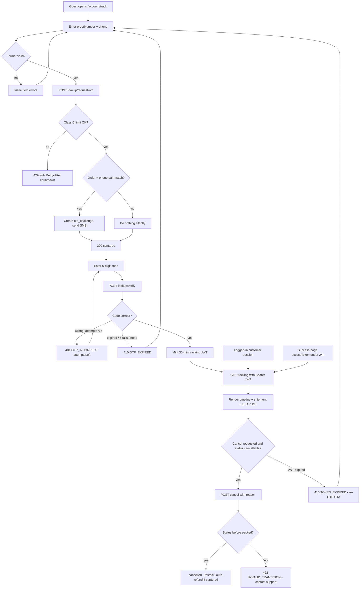
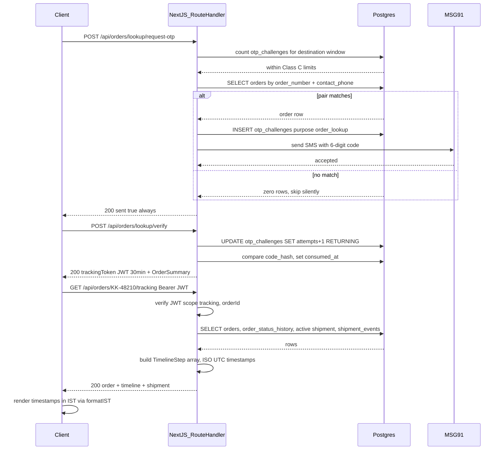
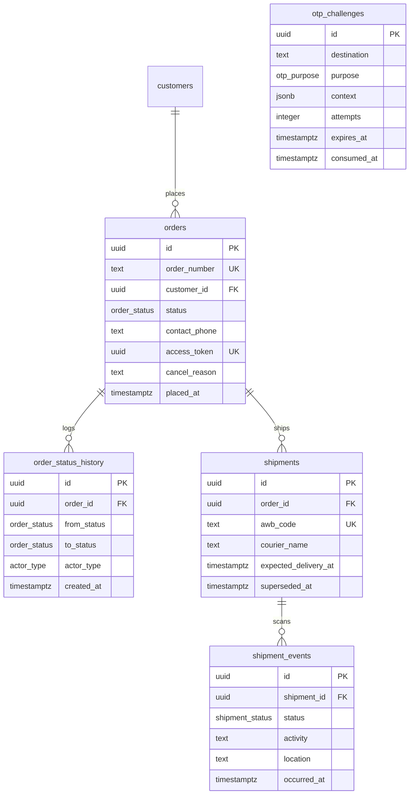

# Module Spec — Order Tracking (Customer-Facing)

**Phase:** 2 (Weeks 6–8) · **Owning lanes:** Dev C (lookup/cancel backend, PROJECT_PLAN §3.6) + Dev D (tracking data feed, §3.10) + Dev A (tracking page UI)
**Contract anchors:** PROJECT_PLAN §3.0 Contract §2.7 (order tracking & cancellation), §1.27 (order state machine), §1.8 (`otp_challenges`), §1.14/§1.16/§1.19/§1.20 (tables)
**Cross-links:** [order-management.md](order-management.md) owns the order state machine and admin-side transitions; [shipping-fulfillment.md](shipping-fulfillment.md) owns `shipments`/`shipment_events` ingestion (webhook + 30-min poller) that this module reads. This is a **light doc**: it specifies the customer-facing read/lookup/cancel surface only — nothing here mutates shipments, and the only order transition it may perform is `→ cancelled` pre-dispatch.

Purpose: any customer — guest or logged-in — can answer "where is my chocolate?" without calling support, and can cancel before dispatch. Three access paths to the same tracking read: (a) logged-in customer-owner session, (b) 30-minute tracking JWT minted via guest OTP lookup, (c) the order's `access_token` for ≤24h after placement (success-page continuity). None of the paths permit enumeration of other people's orders.

---

## 1. Field-Level Specification

### 1.1 `POST /api/orders/lookup/request-otp`

| Field | Type | Required | Max len | Format / Validation | Error message on failure |
|---|---|---|---|---|---|
| `orderNumber` | string | yes | 9 | Trim, uppercase. Regex `^KK-\d{5}$` | "Enter a valid order number like KK-48210." |
| `phone` | string | yes | 13 | Strip spaces/dashes; accept `9876543210`, `09876543210`, `+919876543210`; after normalization must match `^\+91[6-9]\d{9}$` (10-digit core regex `^[6-9]\d{9}$`) | "Enter the 10-digit mobile number used on the order." |

Validation failure → 400 `VALIDATION_ERROR` with `fieldErrors`. If both fields are *format-valid*, the endpoint ALWAYS returns 200 `{ sent: true }` — whether or not an order with that `(order_number, contact_phone)` pair exists (no enumeration; see §6).

### 1.2 `POST /api/orders/lookup/verify`

| Field | Type | Required | Max len | Format / Validation | Error message on failure |
|---|---|---|---|---|---|
| `orderNumber` | string | yes | 9 | `^KK-\d{5}$` (same normalization as 1.1) | "Enter a valid order number like KK-48210." |
| `phone` | string | yes | 13 | Same normalization → `^\+91[6-9]\d{9}$` | "Enter the 10-digit mobile number used on the order." |
| `code` | string | yes | 6 | `^\d{6}$`; compared as `sha256(code || pepper)` against the open `otp_challenges` row (`purpose='order_lookup'`, `context->>'order_number'` = orderNumber, `consumed_at IS NULL`, `expires_at > now()`) | Wrong code: "Incorrect code. {attemptsLeft} attempts left." · Expired/5 fails/consumed: "This code has expired. Request a new one." |

### 1.3 `GET /api/orders/[orderNumber]/tracking`

| Field | Type | Required | Format / Validation | Error message on failure |
|---|---|---|---|---|
| `orderNumber` (path) | string | yes | `^KK-\d{5}$` after uppercase | 404 body message: "We couldn't find that order." |
| `Authorization: Bearer <trackingToken>` (header) | string | one of the three auth inputs | JWT, HS256, claims `{ orderId: uuid, scope: 'tracking', exp }`; `exp` ≤ 30 min from mint; `scope` must equal `'tracking'`; `orderId` must resolve to this `orderNumber` | Expired: "Your tracking link expired. Verify again with OTP." · Wrong order / bad signature: "We couldn't find that order." |
| `accessToken` (query) | string (uuid) | one of the three | `^[0-9a-f]{8}-[0-9a-f]{4}-[0-9a-f]{4}-[0-9a-f]{4}-[0-9a-f]{12}$`; must equal `orders.access_token` AND `now() - orders.placed_at <= interval '24 hours'` | >24h: "This link has expired. Track with OTP instead." (410 `TOKEN_EXPIRED`) |
| `kakoa_session` cookie | httpOnly cookie | one of the three | Valid `customer_sessions` row AND `orders.customer_id` = session customer | Not owner: 404 (indistinguishable from nonexistent) |

### 1.4 `POST /api/orders/[orderNumber]/cancel`

| Field | Type | Required | Max len | Format / Validation | Error message on failure |
|---|---|---|---|---|---|
| `orderNumber` (path) | string | yes | 9 | `^KK-\d{5}$` | "We couldn't find that order." |
| `reason` | string | yes | 500 | Trim; 3–500 chars measured in grapheme clusters; control characters (U+0000–U+001F except \n) stripped; stored raw in `orders.cancel_reason`, output-encoded at every render | "Please tell us why you're cancelling (3–500 characters)." |
| auth (session or Bearer trackingToken) | — | yes | Same rules as 1.3 — note `accessToken` is **NOT** accepted for cancel (mutation requires OTP-proven or session-proven identity) | "Sign in or verify with OTP to cancel this order." |

---

## 2. Workflow / User Flow

### Guest lookup → tracking → (optional) cancel

1. Guest opens `/account/track`, enters `orderNumber` + `phone`. Client-side regex validation inline.
2. Client `POST /api/orders/lookup/request-otp`. Server validates format → 400 on failure.
3. Server checks Class C limits by counting `otp_challenges` rows (destination = normalized phone). Over limit → 429 `RATE_LIMITED` with `Retry-After`; UI shows countdown.
4. Server looks up `orders WHERE order_number = $1 AND contact_phone = $2` (via `orders_phone_idx`). **Match:** insert `otp_challenges` row (`purpose='order_lookup'`, `context={"order_number":"KK-XXXXX"}`, 6-digit code, TTL 10 min) and send SMS via MSG91. **No match:** do nothing. **Either way:** respond 200 `{ sent: true }` after a constant-time floor (see §6).
5. MSG91 down on a real match → 502 `UPSTREAM_ERROR`; UI: "We couldn't send the code. Try again in a minute."
6. Guest enters the 6-digit code → `POST /api/orders/lookup/verify`. Atomic consume: `UPDATE otp_challenges SET attempts = attempts + 1 ... RETURNING` then hash-compare; on match set `consumed_at`.
   - Wrong code → 401 `OTP_INCORRECT`, `details: { attemptsLeft }`.
   - 5th failure / expired / already consumed / no challenge exists (order never matched) → 410 `OTP_EXPIRED`.
7. Success → server mints tracking JWT (30 min, `{ orderId, scope: 'tracking' }`) → client stores in memory (never localStorage) → redirects to tracking view.
8. Tracking view calls `GET /api/orders/[orderNumber]/tracking` with `Authorization: Bearer <jwt>` → renders timeline + shipment block.
9. If order status is cancellable, "Cancel order" button shows → dialog collects `reason` → `POST .../cancel`.
   - Allowed (`pending_payment`, `payment_failed`, `cod_pending_confirmation`, `confirmed`) → 200 with updated order; timeline re-renders with `cancelled` step.
   - `packed` or later → 422 `INVALID_TRANSITION`; UI: "This order is already packed and can't be cancelled online. Contact support."
10. JWT expires mid-session → next GET returns 410 `TOKEN_EXPIRED` → UI swaps to "link expired" state with re-OTP CTA (back to step 2, prefilled).

Parallel paths: logged-in customer lands on `/account/orders/[orderNumber]` — session cookie is the credential, steps 1–7 skipped. Guest fresh from checkout success page follows the "Track order" link carrying `?accessToken=` — valid ≤24h from `placed_at`, read-only.



---

## 3. System Design



**External dependencies and failure behavior:**

| Dependency | Used by | When down / timing out |
|---|---|---|
| MSG91 (SMS) | request-otp only | 502 `UPSTREAM_ERROR` on a real match (challenge row already inserted — resend after 60s cooldown reuses limits). UI: "We couldn't send the code." No-match path never touches MSG91, so the 502 itself must not become an oracle: the send is fired via a fire-and-forget Inngest event when latency-masking is enabled, or the constant-time floor covers the gap. |
| Shiprocket | **never called synchronously by this module.** Tracking reads only local `shipments` / `shipment_events` rows maintained by shipping-fulfillment.md's webhook + 30-min poller. | Zero impact on this module's endpoints. Stale data renders as "Last updated {time} IST" (§7.3) — never invented progress. |
| Postgres (Supabase Mumbai) | everything | 500 `INTERNAL`; tracking page shows retry state. |

**Caching:** none on all four endpoints, deliberately. Tracking responses are per-order and credential-gated (`Cache-Control: private, no-store`) — a shared cache entry would be a cross-customer leak; freshness matters more than the trivial read cost (3 indexed lookups). OTP endpoints are mutations. The only cache adjacent to this module is the 24h serviceability cache, owned by shipping-fulfillment.md.

**TimelineStep derivation (normative):**

```ts
type TimelineStep = { key: 'placed'|'confirmed'|'packed'|'shipped'|'out_for_delivery'|'delivered'
                          |'cancelled'|'rto_initiated'|'rto_delivered';
  label: string; state: 'done'|'active'|'future'; at: string | null; expected: string | null };  // ISO UTC; UI renders IST
```

1. Base rail is the happy path: `placed → confirmed → packed → shipped → out_for_delivery → delivered`.
2. `at` for each key = `created_at` of the **latest** `order_status_history` row with that `to_status` (via `osh_order_idx`); `placed.at = orders.placed_at`. `pending_payment`/`payment_failed`/`cod_pending_confirmation` all collapse into the `placed` step (internal payment states are not customer timeline steps; the order card shows payment status separately).
3. `state`: steps with `at != null` → `done`, except the latest one → `active`; the rest → `future`.
4. `expected`: on the `delivered` step only, from the active shipment's `expected_delivery_at` (`shipments` row `WHERE superseded_at IS NULL`), else `null`. UI renders "Expected {4 Jul}" in IST.
5. Branch rails replace the tail: order in `cancelled` → rail is `placed → cancelled` (plus any steps already done before it). Order in `rto_initiated`/`rto_delivered` → delivery steps after `shipped` are replaced with `rto_initiated` ("Returning to seller") and `rto_delivered`.
6. Scan-level detail rows (activity + location from `shipment_events`, ordered by `occurred_at`) ship in the same payload for the collapsible "All updates" section.

---

## 4. Database Schema

This module **owns no tables**. It reads `orders`, `order_status_history`, `otp_challenges`, `shipments`, `shipment_events`, and writes only: `otp_challenges` inserts/consumes (purpose `order_lookup`), and — via the shared state-machine executor in `packages/core` — the `orders` UPDATE + `order_status_history` INSERT for a customer cancel. Full DDL for `orders`/`order_items` lives in [order-management.md](order-management.md) §4 and DATABASE_ERD.md §3.14–3.16; `shipments`/`shipment_events` in [shipping-fulfillment.md](shipping-fulfillment.md) §4 and ERD §3.19–3.20. Reproduced verbatim here: only the two tables whose specific columns this module's correctness hangs on.

`otp_challenges` (ERD §3.8) — codes 6 digits, TTL 10 min, hashed with server pepper, attempts capped at 5; rate limits enforced by counting rows here (DB is the authority, not Redis):

| Column | Type | Constraints | Notes |
|---|---|---|---|
| `id` | `uuid` | `PRIMARY KEY DEFAULT gen_random_uuid()` | |
| `channel` | `otp_channel` | `NOT NULL` | |
| `destination` | `text` | `NOT NULL` | E.164 phone or lowercased email |
| `purpose` | `otp_purpose` | `NOT NULL` | |
| `code_hash` | `text` | `NOT NULL` | `sha256(code || pepper)` |
| `context` | `jsonb` | | e.g. `{"order_number":"KK-48210"}` for order_lookup |
| `attempts` | `integer` | `NOT NULL DEFAULT 0 CHECK (attempts <= 5)` | |
| `expires_at` | `timestamptz` | `NOT NULL` | |
| `consumed_at` | `timestamptz` | | |
| `created_at` | `timestamptz` | `NOT NULL DEFAULT now()` | |
| `ip` | `inet` | | |

```sql
CREATE INDEX otp_open_idx ON otp_challenges (destination, purpose, created_at DESC)
  WHERE consumed_at IS NULL;                 -- partial: hot path only scans open challenges
CREATE INDEX otp_rate_idx ON otp_challenges (destination, created_at);  -- send-rate window counts
```

`order_status_history` (ERD §3.16) — append-only transition log; renders this module's timeline:

| Column | Type | Constraints | Notes |
|---|---|---|---|
| `id` | `uuid` | `PRIMARY KEY DEFAULT gen_random_uuid()` | |
| `order_id` | `uuid` | `NOT NULL REFERENCES orders(id) ON DELETE CASCADE` | |
| `from_status` | `order_status` | | NULL for creation |
| `to_status` | `order_status` | `NOT NULL` | |
| `actor_type` | `actor_type` | `NOT NULL` | |
| `actor_id` | `uuid` | | `admin_users.id` / `customers.id` / NULL |
| `note` | `text` | | |
| `created_at` | `timestamptz` | `NOT NULL DEFAULT now()` | |

```sql
CREATE INDEX osh_order_idx ON order_status_history (order_id, created_at);
```

Columns this module depends on from `orders` (ERD §3.14): `order_number` (UNIQUE, `'KK-' || lpad(nextval,5,'0')`), `contact_phone` (`CHECK (contact_phone ~ '^\+91[6-9][0-9]{9}$')`, served by `orders_phone_idx`), `access_token uuid NOT NULL UNIQUE`, `customer_id` (nullable = guest), `status`, `cancel_reason`, `placed_at`, `cancelled_at`.



(`otp_challenges` has no FK to `orders` by design — correlation is via `context->>'order_number'`, so an unmatched lookup never creates a row referencing anything.)

---

## 5. API Design

All four are Route Handlers (Contract rule: OTP endpoints and tracking are called by non-React contexts and need uniform curl-ability). Envelope per Contract §2.1 (`ApiOk`/`ApiErr` with `requestId`). Common errors (400 `VALIDATION_ERROR`, 429 `RATE_LIMITED`, 500 `INTERNAL`) apply everywhere and are not repeated.

### 5.1 `POST /api/orders/lookup/request-otp` — public, **Class C**

Request: `{ orderNumber: string, phone: string }`
Response 200 (always, when format-valid): `{ ok: true, data: { sent: true }, ... }` — identical body whether or not the pair matched an order; a `resendAfterSec: 60` field tells the UI when the resend button re-enables.

| Status | Code | When |
|---|---|---|
| 429 | `RATE_LIMITED` | Class C: >1/60s or >3/10min or >10/day per destination, or >20/hr per IP (counted from `otp_challenges` rows; `Retry-After` header) |
| 502 | `UPSTREAM_ERROR` | MSG91 send failed on a real match |

Idempotency: re-request within the 60s cooldown → 429; after cooldown a new challenge row supersedes (old one still consumable until TTL — latest-open-challenge wins on verify).

### 5.2 `POST /api/orders/lookup/verify` — public, **Class C verify: 5 attempts per challenge then 410**

Request: `{ orderNumber: string, phone: string, code: string }`
Response 200: `{ trackingToken: string /* JWT 30 min: {orderId, scope:'tracking'} */, order: OrderSummary }`

| Status | Code | When |
|---|---|---|
| 401 | `OTP_INCORRECT` | Wrong code; `details: { attemptsLeft }` |
| 410 | `OTP_EXPIRED` | TTL passed, 5th failure, already consumed, or **no challenge exists** (unmatched pair — indistinguishable from expired, no oracle) |

Attempt increment is atomic (`UPDATE ... SET attempts = attempts + 1 WHERE consumed_at IS NULL AND attempts < 5 RETURNING`); two parallel verifies of the same correct code produce exactly one consume winner.

### 5.3 `GET /api/orders/[orderNumber]/tracking` — customer-owner | Bearer trackingToken | `?accessToken=` (≤24h), **Class A** (120/min/IP)

Response 200: `{ order: OrderSummary, timeline: TimelineStep[], shipment: { awb: string, courierName: string, expectedDeliveryAt: string | null } | null }` — `shipment` is `null` pre-AWB. `Cache-Control: private, no-store`.

| Status | Code | When |
|---|---|---|
| 401 | `UNAUTHORIZED` | No credential at all |
| 404 | `NOT_FOUND` | Order doesn't exist, OR credential valid but for a different order, OR session customer isn't the owner — all three identical |
| 410 | `TOKEN_EXPIRED` | trackingToken `exp` passed, or `accessToken` presented after `placed_at + 24h` |

### 5.4 `POST /api/orders/[orderNumber]/cancel` — customer-owner | Bearer trackingToken (accessToken NOT accepted), **Class D** (10/min/session)

Request: `{ reason: string }`
Response 200: `{ order: OrderSummary }` with `status: 'cancelled'`.

| Status | Code | When |
|---|---|---|
| 401 | `UNAUTHORIZED` | No/expired credential, or only an accessToken |
| 404 | `NOT_FOUND` | Not owner / nonexistent (identical) |
| 422 | `INVALID_TRANSITION` | Status is `packed` or later, or already terminal; `details: { currentStatus }` (already-`cancelled` → same 422, effectively idempotent for the UI) |

Customer-cancellable set (policy subset of Contract §1.27): `pending_payment`, `payment_failed`, `cod_pending_confirmation`, `confirmed`. From `packed` the GST `invoice_number` is assigned — `packed → cancelled` stays admin-only (order-management.md). Execution goes through the shared executor: `SELECT ... FOR UPDATE` on the order row → validate against `ORDER_TRANSITIONS` → `UPDATE orders` (+`cancelled_at`, `cancel_reason`) + `INSERT order_status_history` (`actor_type='customer'`, `actor_id` = customer id or NULL for guest-via-JWT) + side effects (restock via `inventory_adjustments` reason `order_cancelled`, auto-refund initiation if a payment is `captured` — see payments module) in one transaction.

---

## 6. Security Standards

- **Rate limits (Contract classes, exact):** request-otp Class **C** — 1/60s + 3/10min + 10/day per destination, 20/hr per IP, enforced authoritatively by counting `otp_challenges` rows; verify — 5 attempts per challenge then 410. Tracking GET Class **A** — 120/min per IP. Cancel Class **D** — 10/min per session/token. All rate-limited responses carry `X-RateLimit-Limit`, `X-RateLimit-Remaining`, `X-RateLimit-Reset`; 429 adds `Retry-After`.
- **No enumeration (the module's defining property):** request-otp returns byte-identical 200 for match and no-match, with a constant-time response floor (~250ms jitter-padded) so DB-hit vs no-hit timing doesn't leak; verify returns the same 410 `OTP_EXPIRED` for "never matched" as for "expired"; tracking/cancel return the same 404 for "doesn't exist" and "not yours". `order_number` is short but the phone pairing + OTP + Class C limits make walking KK-00001…KK-99999 useless (risk-engineering Module 3 #11 / Module 7 #11: the forged-ID negative test is mandatory).
- **Token hygiene:** tracking JWT is HS256 with a dedicated secret (not the session secret), 30-min `exp`, `scope: 'tracking'` checked on every use — a login-session JWT can never pass, and the tracking token grants nothing outside these two order-scoped endpoints. Held in client memory only; never in localStorage, never in a cookie, never in a URL. `access_token` appears in the success-page URL by design — which is exactly why it is read-only, 24h-capped, and not accepted for cancel.
- **Input sanitization:** zod `.strict()` schemas from `packages/core/src/contracts/tracking.ts`; Drizzle parameterized queries throughout (no string SQL); `reason` control-chars stripped, stored raw, output-encoded on web and in the admin panel (it is user-echoed input rendered to staff — stored-XSS-into-admin is the concrete risk).
- **Authz checks:** every path resolves the credential to a specific `orders.id` **before** any data is read; the customer-owner path compares `orders.customer_id` to the session's customer id, never trusts the URL.
- **Encryption at rest:** Supabase disk encryption suffices; OTP codes are never stored (only `sha256(code || pepper)`); no additional column-level encryption needed here.
- **NEVER log:** OTP codes (raw or hashed), tracking JWTs, `access_token` values, raw phone numbers (hash for correlation: `phone_hash`), full shipping addresses. Log `order_id`, `requestId`, credential *type* used (`session|jwt|access_token`), and outcome.
- **OWASP mapping:** A01 Broken Access Control → three-path authz matrix + forged-ID negative tests; A04 Insecure Design → enumeration-proof responses; A05 → `no-store` on tracking (shared-cache leak); A07 Identification failures → attempt caps + atomic consume (no OTP brute-force, no replay); A09 → structured logs without PII per above.

---

## 7. Edge Cases

1. **Order-ID walking via lookup** (risk Module 3 #11): attacker scripts request-otp across KK-00001…KK-99999 with their own phone. Every response is an identical 200; no SMS fires unless the phone matches; Class C per-IP (20/hr) and per-destination limits throttle the walk; a spike of no-match lookups (>50/hr) raises the `lookup.enumeration_suspected` alert.
2. **Verify without a matching challenge:** attacker skips request-otp and posts codes directly. No open challenge row exists → 410 `OTP_EXPIRED` — the same response an honest user with a stale code gets. No oracle distinguishing "wrong order/phone" from "expired code".
3. **Tracking token for order A replayed against order B:** JWT `orderId` ≠ order B's id → 404 (not 401 — a 401 would confirm order B exists). The token-scope integration test (§9) is the regression guard.
4. **`accessToken` shared in a WhatsApp group:** guest forwards their success-page URL. Damage is capped: read-only, expires 24h after `placed_at` (410 `TOKEN_EXPIRED` afterwards), cannot cancel, exposes only that order's snapshot. UI on the success page avoids rendering the full address for accessToken-tier viewers (name + pincode only).
5. **Cancel races dispatch:** customer's cancel and admin's `confirmed → packed` transition land simultaneously. Both take `SELECT ... FOR UPDATE` on the order row (Contract §1.28.3); the loser re-validates and the late cancel gets 422 `INVALID_TRANSITION` with `details.currentStatus='packed'` — never a cancelled-but-shipped order. Double-tap of the cancel button: second request finds `cancelled`, returns the same 422; UI treats it as settled.
6. **Timeline with zero shipment rows** (paid, awaiting fulfillment): `shipment: null`, steps after `confirmed` are `future`, copy "Preparing shipment" — never a fake "shipped" (risk Module 6 #9). Conversely a **stale shipment** (poller behind, `last_synced_at` old): render last known status + "Last updated {time} IST"; never invent progress.
7. **Out-of-order / RTO timelines:** `shipment_events` may contain a late `out_for_delivery` scan after `delivered` (monotonicity is enforced upstream — order status never regressed, per shipping-fulfillment.md). Timeline builds from `order_status_history`, not raw scans, so it inherits monotonicity; the scan appears only in the collapsible detail log. RTO branch: `rto_initiated` replaces the delivery tail with "Returning to seller" — honest copy, no dead "out for delivery" step lingering as `active`.
8. **Reshipped order (superseded shipment):** after RTO + reship, two `shipments` rows exist. The tracking response uses only the active one (`superseded_at IS NULL`, enforced unique by `shipments_one_active_idx`); the old AWB disappears from the customer view rather than showing two couriers.
9. **IST boundary rendering** (risk Module 3 #10): an order placed 23:30 IST on 1 Jul is `placed_at` 18:00 UTC 1 Jul; `formatIST()` must show "1 Jul, 11:30 PM" and the expected-delivery date must not drift a day. All `at`/`expected` values ship as ISO UTC; conversion is exclusively client-side via the shared formatter — mandatory boundary test.
10. **Guest order later attached to an account:** guest orders attach on OTP-verified login of the same phone (checkout.md Edge Case 12). Post-attach, the session path works and the OTP-lookup path *still* works (contact_phone unchanged) — both must resolve to the same order without conflict.
11. **Order cancelled between verify and tracking GET:** token minted at verify, admin cancels 10 seconds later. Tracking GET reflects live state — timeline shows `cancelled` with the admin transition's timestamp; the 30-min token stays valid for viewing (it grants read, not state).
12. **Two open lookup challenges** (user re-requested after 60s cooldown): verify targets the latest open challenge per `otp_open_idx` ordering; the older code answers 401 `OTP_INCORRECT` against the newest challenge — matching the auth-otp.md convention (latest-challenge-wins), tested to prevent drift between the two OTP surfaces.

---

## 8. State Machine

**Not applicable.** This module renders and consumes the 11-state order machine but does not own it — the canonical machine (states, transition table, `ORDER_TRANSITIONS` data, FOR-UPDATE executor, mermaid diagram) lives in [order-management.md](order-management.md) §8 per Contract §1.27; the shipment status machine lives in [shipping-fulfillment.md](shipping-fulfillment.md). The only transition this module triggers is customer `→ cancelled` from `{pending_payment, payment_failed, cod_pending_confirmation, confirmed}`, executed by the shared executor.

---

## 9. Testing Requirements

**Unit (`packages/core`):**
- TimelineStep builder: every `order_status` → expected rail (happy, cancelled-at-each-cancellable-point, RTO branch); `done`/`active`/`future` assignment; payment sub-states collapsing into `placed`; `expected` populated only on `delivered` and only from the active shipment.
- Zod schemas: `orderNumber` regex accepts `kk-48210` (normalized) / rejects `KK-482100`, `KK48210`; phone normalization matrix (`98765 43210`, `09876543210`, `+91-9876543210` → `+919876543210`; rejects `5876543210`); `code` `^\d{6}$`; `reason` grapheme-cluster bounds incl. ZWJ emoji.
- JWT verify: expired → `TOKEN_EXPIRED`; `scope:'login'` rejected; tampered signature rejected; `orderId` mismatch → not-found semantics.
- `formatIST()` boundary: 18:30+ UTC rolls the IST date.

**Integration (ephemeral Postgres):**
- No-enumeration byte-equality: request-otp for (real order, wrong phone), (fake order, real phone), (real pair) → identical status + body for all; SMS side-effect only on the real pair; response-time delta under threshold.
- Verify races: two parallel correct-code verifies → exactly one consume; 5 wrong attempts → 410 even with the correct 6th code.
- **Token scope (Contract §3.6 DoD, non-negotiable):** trackingToken for order A against order B's tracking and cancel → 404 both; accessToken at `placed_at + 23:59` → 200, at `+24:01` → 410; accessToken on cancel → 401; forged random uuid accessToken → 404.
- Cancel matrix: from each of the 4 cancellable states → 200 + `order_status_history` row (`actor_type='customer'`) + restock ledger row; from `packed`/`shipped`/`delivered`/`cancelled` → 422; concurrent cancel-vs-pack FOR-UPDATE race → one winner, loser 422.
- Class C limits enforced from `otp_challenges` row counts (11th request of the day → 429).

**E2E (Playwright, named):**
1. *Guest tracks and cancels:* place COD order as guest → `/account/track` → OTP (mock MSG91) → timeline shows `placed` done, "We'll call to confirm" → cancel with reason → timeline shows `cancelled`, admin order detail shows the customer-actor history row and restock.
2. *Fulfillment happy path, customer view* (shared with shipping-fulfillment.md E2E 1): paid order pushed to mocked Shiprocket → tracking page shows courier + AWB + "Expected {date}" in IST → mock emits transit events → timeline advances through `delivered` without reload lying about state.
3. *Token expiry and re-OTP:* verify → view tracking → advance clock 31 min → next fetch 410 → "link expired" state → re-OTP inline → timeline restored; then attempt cancel on the now-`packed` order → blocking "already packed" dialog with support CTA.

---

## 10. Definition of Done

- [ ] All four endpoints live behind zod `.strict()` schemas with the §1 field rules and exact error messages
- [ ] No-enumeration proven: byte-identical request-otp responses + constant-time floor test green; verify's unified 410 tested
- [ ] Guest lookup rate-limited Class C from `otp_challenges` row counts (not just middleware), with `X-RateLimit-*` headers and `Retry-After` on 429
- [ ] Tracking JWT: 30-min expiry, `scope:'tracking'` enforced, dedicated secret, memory-only client storage; scope-isolation integration tests green (order A token vs order B)
- [ ] `access_token` path: read-only, 24h-from-`placed_at` cutoff → 410 `TOKEN_EXPIRED`, rejected on cancel — all negative-tested
- [ ] TimelineStep builder unit-tested across every `order_status` including cancelled and RTO rails; timestamps ISO UTC end-to-end with IST rendering only in `formatIST()`; IST boundary test green
- [ ] Cancel restricted to `{pending_payment, payment_failed, cod_pending_confirmation, confirmed}`; `packed`+ → 422 `INVALID_TRANSITION`; executed via the shared FOR-UPDATE executor writing `order_status_history` (`actor_type='customer'`) with restock and auto-refund side effects verified
- [ ] Tracking page UI states implemented per §3.10: skeleton, pre-AWB "Preparing shipment", stale-data "Last updated {time} IST", 410 re-OTP CTA, generic 404, RTO honest copy
- [ ] `Cache-Control: private, no-store` on tracking; no OTP codes, tokens, or raw phone numbers in any log line (phone hashed)
- [ ] `lookup.enumeration_suspected` (>50 no-match lookups/hr) and MSG91 send-failure-rate alerts wired
- [ ] E2E scenarios 1–3 green in CI; cross-links to order-management.md and shipping-fulfillment.md verified non-contradictory in the consistency pass
