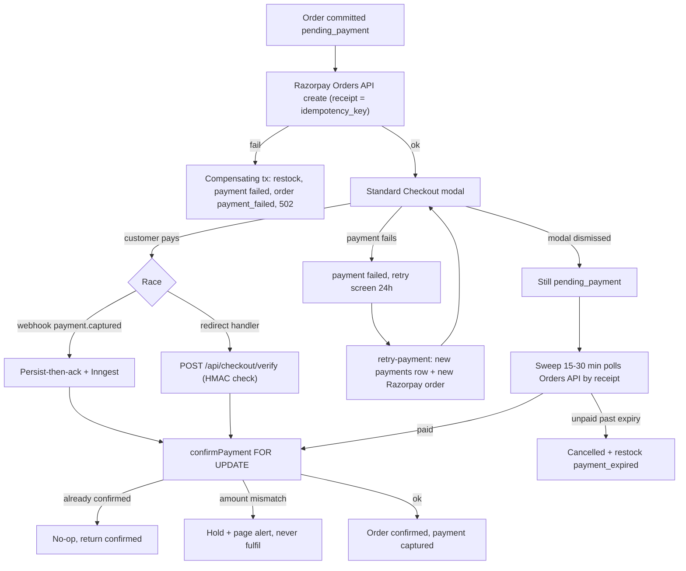
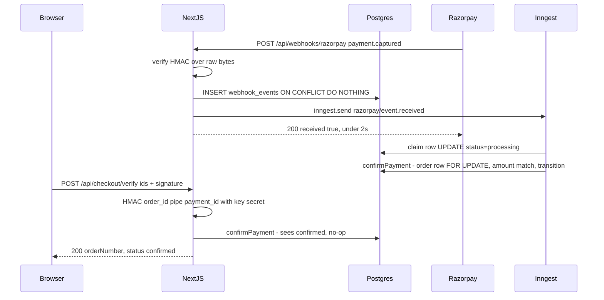
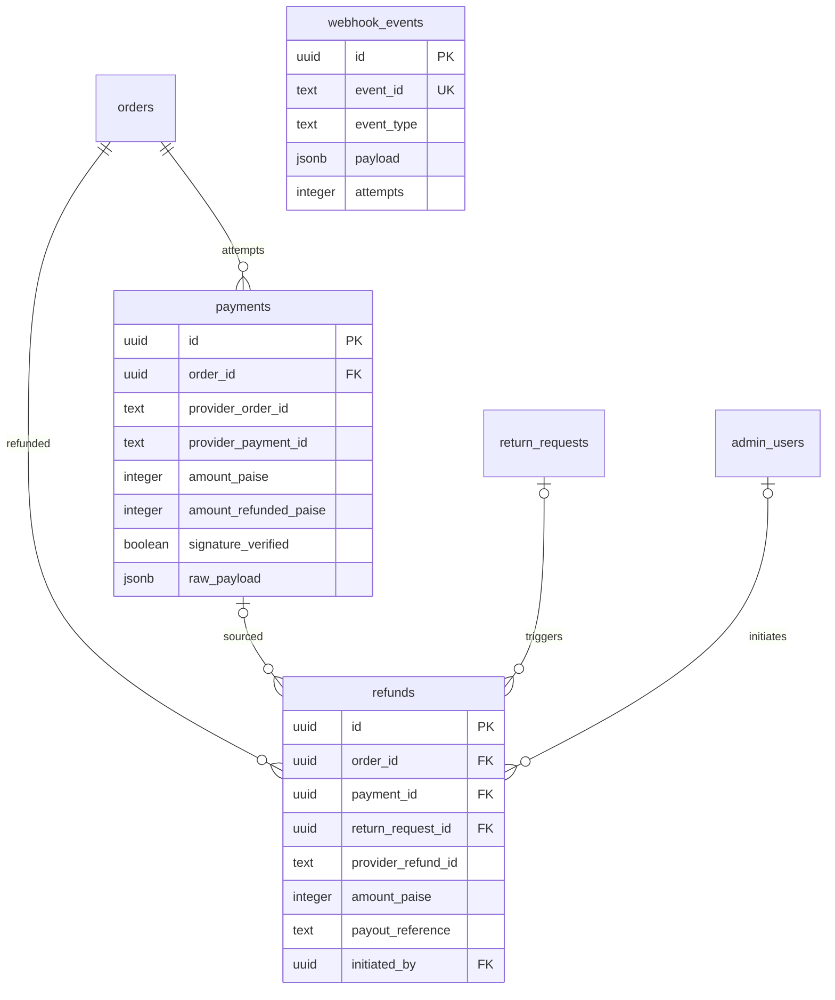
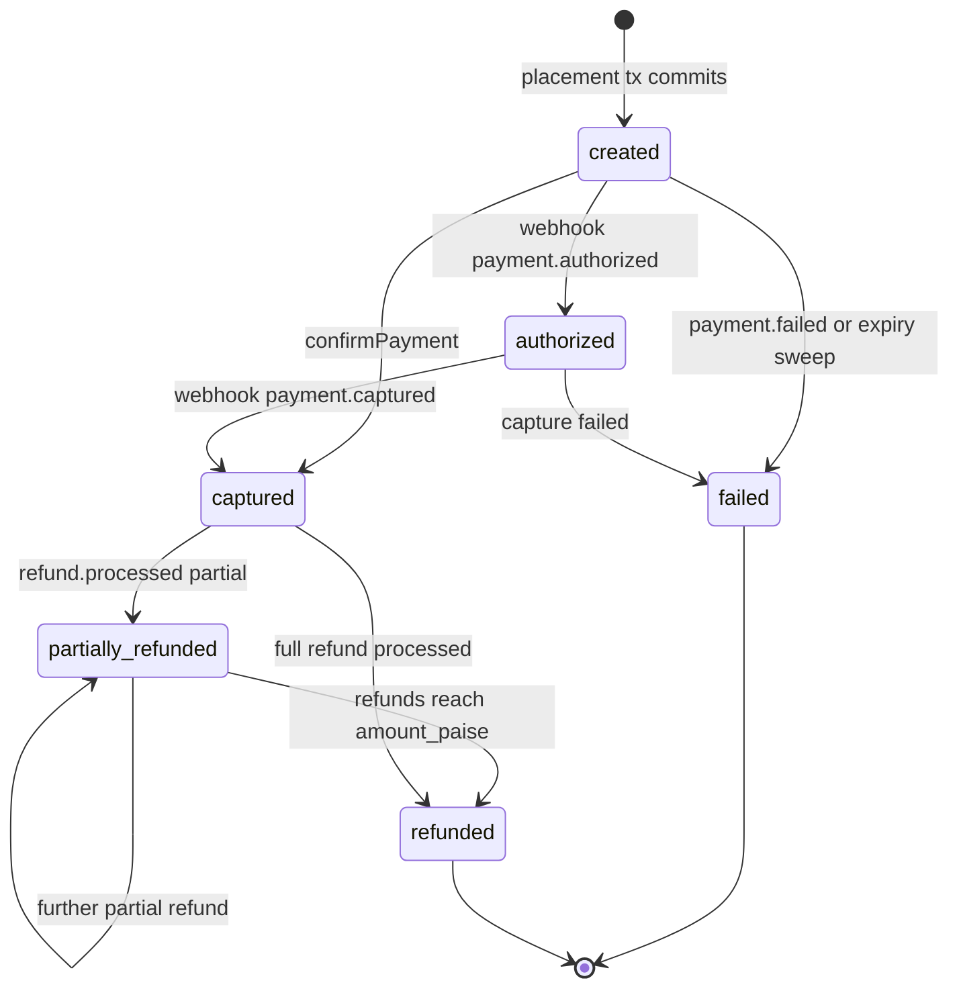

# Module Spec — Payments: Razorpay Prepaid & Refunds (Phase 2)

> Source of truth: `docs/DATABASE_ERD.md` (§3.17 `payments`, §3.18 `refunds`, §3.21 `webhook_events`), `PROJECT_PLAN.md` §1 · §3.0 Contract · §3.8, `risk-engineering.md` Module 4.
> Owner: **Dev C** (Razorpay client `packages/integrations/src/razorpay/**`, `/api/webhooks/razorpay`, `/api/checkout/verify`, retry-payment, refunds, reconciliation crons). Dev E is second reviewer of record on all webhook code; bus-factor rule: every PR needs Dev C + one of Dev B/Dev E.
> Phase 2 (Weeks 6–8). Build order: payment webhooks → refunds → reconciliation crons. COD lifecycle (confirmation queue, collection, remittance) is specified in the COD module doc; this doc covers **prepaid Razorpay + all refunds**.
>
> **Vendor facts verified 2026-07 against razorpay.com/docs:** Orders API `POST https://api.razorpay.com/v1/orders` (Basic auth `key_id:key_secret`; fields `amount`, `currency`, `receipt` max 40 chars unique, `notes` max 15 pairs); webhook headers `X-Razorpay-Signature` (HMAC-SHA256 of raw body with webhook secret) and `x-razorpay-event-id` (unique per event); webhook envelope `{entity:"event", account_id, event, contains[], payload, created_at}` with payment at `payload.payment.entity`; Refunds API `POST /v1/payments/:id/refund` (`amount` optional = full, `speed`, `notes`, `receipt`), refund status values `pending | processed | failed`. Checkout handler signature = `HMAC_SHA256(razorpay_order_id + "|" + razorpay_payment_id, key_secret)` per Standard Checkout docs. Razorpay entity-id suffix length is not contractually documented — validate prefix + charset only (**verify exact length at integration**).

---

## 1. Field-Level Specification

### 1.1 `POST /api/checkout/verify` (Razorpay JS success handler body)

| Field | Type | Required | Max len | Format / validation rule | Error message on failure |
|---|---|---|---|---|---|
| `razorpayOrderId` | string | yes | 64 | `^order_[A-Za-z0-9]+$` (prefix + alphanumeric; length verify at integration) | "Payment reference is invalid. If money was deducted it will be confirmed or refunded automatically." |
| `razorpayPaymentId` | string | yes | 64 | `^pay_[A-Za-z0-9]+$` | same as above |
| `razorpaySignature` | string | yes | 128 | `^[a-f0-9]{64}$` (lowercase hex HMAC-SHA256) | "We couldn't verify this payment. It will be confirmed automatically within 30 minutes or refunded." |

Zod schema is `.strict()` — unknown keys → 400 `VALIDATION_ERROR`. Signature is then cryptographically checked: `HMAC_SHA256(razorpayOrderId + "|" + razorpayPaymentId, RAZORPAY_KEY_SECRET) === razorpaySignature` using constant-time compare (`crypto.timingSafeEqual`). Mismatch → 401 `SIGNATURE_INVALID` (message above), logged with IP.

### 1.2 `POST /api/webhooks/razorpay`

| Field | Type | Required | Validation rule | Failure behavior |
|---|---|---|---|---|
| header `x-razorpay-signature` | string | yes | HMAC-SHA256 of **raw body bytes** with `RAZORPAY_WEBHOOK_SECRET`, constant-time compare | 401 `SIGNATURE_INVALID`, body `{"ok":false,"error":{"code":"SIGNATURE_INVALID","message":"Invalid webhook signature."}}`, **nothing persisted** |
| header `x-razorpay-event-id` | string | yes | `^evt_[A-Za-z0-9]+$`, ≤64 chars; becomes `webhook_events.event_id` | missing → treat as unsigned garbage: 401 `SIGNATURE_INVALID` |
| body (raw) | JSON | yes | ≤512 KB; parsed **only after** signature passes; envelope zod: `{entity:'event', event: string, contains: string[], payload: object, created_at: number}` | signed-but-malformed → row persisted, worker marks `failed` terminal (dead-letter), never a crash loop |
| `body.event` | string | yes | one of `payment.captured`, `payment.failed`, `payment.authorized`, `refund.processed`, `refund.failed`, `order.paid`; anything else | unknown type → persist row, mark `skipped`, ack 200 |

### 1.3 `POST /api/checkout/orders/[orderId]/retry-payment`

| Field | Type | Required | Validation rule | Error message |
|---|---|---|---|---|
| path `orderId` | uuid | yes | `^[0-9a-f]{8}-[0-9a-f]{4}-[0-9a-f]{4}-[0-9a-f]{4}-[0-9a-f]{12}$`; order must belong to caller (guest-token scope or customer session) | "Order not found." (404 — no existence oracle across owners) |
| (no body) | — | — | order must be `payment_failed` and placed < 24h ago | "This order can no longer be paid. Please place a new order." (410) |

### 1.4 `POST /api/admin/orders/[id]/refunds` (admin:owner)

| Field | Type | Required | Max len | Validation rule | Error message |
|---|---|---|---|---|---|
| `amountPaise` | integer | yes | — | `int`, `>= 100` (₹1 Razorpay minimum), `<= refundablePaise` where `refundablePaise = payments.amount_paise − payments.amount_refunded_paise` on the captured payment, computed line-level (cancelled lines' tax-inclusive totals − proportional coupon allocation via `allocateDiscount`) | "Refund exceeds refundable balance of ₹{refundablePaise/100}." (422 `REFUND_EXCEEDS_PAID`, `details:{refundablePaise}`) |
| `reason` | string | yes | 500 | trimmed length 3–500 | "Reason must be 3–500 characters." |
| `destination` | enum | yes | — | `original_method` \| `bank_transfer` \| `upi` (enum `refund_destination`); `original_method` requires a captured Razorpay payment on the order | "Choose a valid refund destination." / "No captured online payment on this order — use bank transfer or UPI." |
| `payoutReference` | string | conditional | 64 | required iff `destination != 'original_method'`; `^[A-Za-z0-9\-/]{6,64}$` (UTR/UPI ref) | "Enter the UTR or UPI reference for the manual payout." |
| `returnRequestId` | uuid | no | — | uuid regex as §1.3; must reference a `return_requests` row of the same order | "Return request does not belong to this order." (400 `VALIDATION_ERROR`) |

Amounts are **never** accepted as rupees/floats — integer paise only; any non-integer → 400 `VALIDATION_ERROR` "Amount must be an integer number of paise."

---

## 2. Workflow / User Flow

### Prepaid payment (place → pay → confirm)

1. Place-order transaction commits (`orders.status='pending_payment'`, `payments` row `status='created'`, stock decremented) — see Checkout module. Server then calls Razorpay `POST /v1/orders` with `receipt = orders.idempotency_key`.
   - **Failure branch:** Razorpay create fails/timeouts → compensating tx (restock, payment `failed`, order `payment_failed`) → 502 `UPSTREAM_ERROR`; client may retry with a new idempotency key.
2. Client opens Razorpay Standard Checkout with `{key, order_id, amount, currency:'INR', prefill:{contact, email}}`.
3. Customer pays. Two racing paths begin:
   - **Path A (webhook, usually first):** Razorpay POSTs `payment.captured` → persist-then-ack → Inngest worker → `confirmPayment()`.
   - **Path B (redirect):** Checkout `handler` fires with `{razorpay_payment_id, razorpay_order_id, razorpay_signature}` → client POSTs `/api/checkout/verify` → server verifies HMAC → `confirmPayment()`.
4. `confirmPayment(order, payment)` — the single convergence point: `SELECT ... FOR UPDATE` on the order row → already `confirmed`? no-op, return current state → else assert `payment.amount == orders.total_paise` AND `currency == 'INR'` → transition `pending_payment → confirmed`, payment → `captured`, `signature_verified=true` (verify path), write `order_status_history` (`actor_type='webhook'` or `'system'`) → commit. First writer wins.
   - **Amount-mismatch branch:** hold (do NOT confirm), alert page-level, manual review. Never fulfil.
5. Client polls order status behind a "Confirming your payment…" interstitial; renders success only on server-confirmed state.
   - **Failure branch:** `payment.failed` webhook → payment `failed`, order stays `pending_payment` until retry or expiry; UI shows retry screen (24h window, step 6).
6. Retry: `POST .../retry-payment` → new `payments` row (`created`) + fresh Razorpay order → back to step 2. Old attempt rows are never mutated.
7. Nobody pays: stuck-payment sweep (every 15–30 min) polls Razorpay Orders API by `receipt`; still unpaid past 30-min expiry → order `cancelled`, restock (`payment_expired`), coupon released.

### Refund (admin-initiated)

1. Owner submits §1.4 form → validate refundable balance → insert `refunds` row (`status='initiated'`).
2. `destination='original_method'`: call Razorpay `POST /v1/payments/{provider_payment_id}/refund` with `{amount: amountPaise, speed:'normal', receipt: refunds.id}` — our refund row id in `receipt` is the reconciliation/idempotency key. Store returned `rfnd_xxx` in `provider_refund_id`.
   - **Failure branch:** Razorpay 5xx/timeout → row stays `initiated`, 502 `UPSTREAM_ERROR`; retry job first `GET /v1/payments/{id}/refunds` and matches by `receipt` before creating anew (no double refund).
3. `refund.processed` webhook (or nightly poll fallback) → refund `processed`, `processed_at` set, `payments.amount_refunded_paise += amount_paise`, payment → `partially_refunded` (or `refunded` when fully refunded), customer email fired.
   - `refund.failed` → refund `failed`, alert; customer-facing status stays "approved, processing" — never re-notified until resolved.
4. Manual destinations (`bank_transfer`/`upi`, COD orders): row recorded with `payout_reference`; operator marks processed; no Razorpay call.



---

## 3. System Design



**External dependencies & failure behavior**

| Dependency | Used for | When down / timing out (exact behavior) |
|---|---|---|
| Razorpay Orders API (`POST /v1/orders`, Basic auth, 8s timeout, 1 retry after querying by `receipt`) | order create at placement, retry-payment, sweep polling | Placement: compensating tx → 502 `UPSTREAM_ERROR`, order `payment_failed`, stock released. Sweep: skip cycle, healthchecks.io dead-man ping withheld → alert. Never guess payment state — no API answer means no transition. |
| Razorpay Refunds API (`POST /v1/payments/:id/refund`, 8s timeout) | prepaid refunds | Refund row stays `initiated`, 502 to admin; retry lists existing refunds and matches by `receipt` before re-creating. |
| Razorpay webhooks (inbound) | acceleration of truth | Absence is tolerated by design: sweep polls Orders API for `pending_payment > 45 min`; nightly job diffs captured payments vs orders. Webhook = accelerator, polling = guarantee. |
| Inngest | async webhook processing, crons | Events persist in `webhook_events` (`received`); on recovery workers drain via `webhook_events_pending_idx`. Ack to Razorpay is unaffected (ack happens before Inngest send result matters). |
| Postgres (Supabase Mumbai, pooled 6543) | everything | Webhook insert fails → **500** (the only 500 path) so Razorpay's ~24h redelivery becomes the recovery mechanism. |

**Caching: none.** Every read in this module is money truth and must be authoritative (order/payment state, refundable balance). The only cached value is the public `RAZORPAY_KEY_ID` shipped in the client bundle (build-time env, not runtime cache).

---

## 4. Database Schema

DDL per `docs/DATABASE_ERD.md` §3.17 / §3.18 / §3.21 (verbatim names/types/constraints):

```sql
CREATE TABLE payments (
  id                    uuid PRIMARY KEY DEFAULT gen_random_uuid(),
  order_id              uuid NOT NULL REFERENCES orders(id) ON DELETE CASCADE,
  provider              payment_provider NOT NULL,
  provider_order_id     text,                         -- razorpay_order_id ('order_xxx')
  provider_payment_id   text,                         -- razorpay_payment_id ('pay_xxx')
  method                payment_method NOT NULL DEFAULT 'unknown',
  status                payment_status NOT NULL DEFAULT 'created',
  amount_paise          integer NOT NULL CHECK (amount_paise > 0),
  amount_refunded_paise integer NOT NULL DEFAULT 0 CHECK (amount_refunded_paise <= amount_paise),
  signature_verified    boolean NOT NULL DEFAULT false,
  failure_code          text,
  failure_reason        text,
  cod_remitted_at       timestamptz,
  cod_remittance_ref    text,
  raw_payload           jsonb,                        -- last provider payload for debugging
  created_at            timestamptz NOT NULL DEFAULT now(),
  updated_at            timestamptz NOT NULL DEFAULT now()
);
CREATE UNIQUE INDEX payments_provider_payment_idx ON payments (provider, provider_payment_id)
  WHERE provider_payment_id IS NOT NULL;
CREATE UNIQUE INDEX payments_provider_order_idx ON payments (provider, provider_order_id)
  WHERE provider_order_id IS NOT NULL;
CREATE INDEX payments_order_idx ON payments (order_id);
CREATE INDEX payments_cod_remit_idx ON payments (status) WHERE status IN ('cod_collected','cod_pending_remittance');

CREATE TABLE refunds (
  id                 uuid PRIMARY KEY DEFAULT gen_random_uuid(),
  order_id           uuid NOT NULL REFERENCES orders(id) ON DELETE CASCADE,
  payment_id         uuid REFERENCES payments(id) ON DELETE SET NULL,
  return_request_id  uuid REFERENCES return_requests(id) ON DELETE SET NULL,
  provider_refund_id text,                            -- 'rfnd_xxx'
  destination        refund_destination NOT NULL,
  amount_paise       integer NOT NULL CHECK (amount_paise > 0),
  status             refund_status NOT NULL DEFAULT 'initiated',
  reason             text NOT NULL,
  payout_reference   text,                            -- UTR / UPI ref for manual COD refunds
  initiated_by       uuid REFERENCES admin_users(id) ON DELETE SET NULL,
  processed_at       timestamptz,
  created_at         timestamptz NOT NULL DEFAULT now(),
  updated_at         timestamptz NOT NULL DEFAULT now()
);
CREATE UNIQUE INDEX refunds_provider_idx ON refunds (provider_refund_id) WHERE provider_refund_id IS NOT NULL;
CREATE INDEX refunds_order_idx ON refunds (order_id);

CREATE TABLE webhook_events (                          -- razorpay rows in scope here
  id           uuid PRIMARY KEY DEFAULT gen_random_uuid(),
  provider     webhook_provider NOT NULL,
  event_id     text NOT NULL,                          -- Razorpay = x-razorpay-event-id header
  event_type   text NOT NULL,                          -- 'payment.captured' etc.
  payload      jsonb NOT NULL,                         -- raw body, verbatim
  headers      jsonb,
  status       webhook_status NOT NULL DEFAULT 'received',
  error        text,
  attempts     integer NOT NULL DEFAULT 0,
  received_at  timestamptz NOT NULL DEFAULT now(),
  processed_at timestamptz,
  UNIQUE (provider, event_id)
);
CREATE INDEX webhook_events_pending_idx ON webhook_events (received_at)
  WHERE status IN ('received','failed');
```

Enums (Contract §1.0): `payment_provider ('razorpay','cod')`, `payment_status ('created','authorized','captured','failed','partially_refunded','refunded','cod_pending_collection','cod_collected','cod_pending_remittance','cod_remitted')`, `payment_method ('card','upi','netbanking','wallet','emi','cod','unknown')`, `refund_status ('initiated','processed','failed')`, `refund_destination ('original_method','bank_transfer','upi')`, `webhook_provider`, `webhook_status`. `webhook_events` deliberately has **no FKs** — correlation is by payload lookup on `provider_payment_id`/`provider_order_id`.



---

## 5. API Design

Common failures on all endpoints (not repeated): 400 `VALIDATION_ERROR`, 401 `UNAUTHORIZED`, 403 `FORBIDDEN`, 429 `RATE_LIMITED`, 500 `INTERNAL`. Envelope: `ApiResult<T>` per Contract §2.1.

### 5.1 `POST /api/checkout/verify` — public · Class D (10/min/session)

Request: `{ razorpayOrderId: string, razorpayPaymentId: string, razorpaySignature: string }` (§1.1).
Response 200: `{ ok: true, data: { orderNumber: string, status: 'confirmed' }, meta?: { duplicate: true } }` — `meta.duplicate` set when `confirmPayment` found the order already confirmed (idempotent success, NOT an error).
Errors: 401 `SIGNATURE_INVALID` (HMAC mismatch); 404 `NOT_FOUND` (no payment row matches `provider_order_id`); 409 `ALREADY_PROCESSED` reserved for a terminal-state conflict where the order is `cancelled` (payment against dead order → auto-refund path, §7.8); 502 `UPSTREAM_ERROR` (DB-side confirm blocked by an in-flight Razorpay recheck).
Idempotency: by construction — `confirmPayment` under `FOR UPDATE`; repeat calls return the same confirmed body.

### 5.2 `POST /api/checkout/orders/[orderId]/retry-payment` — guest-token | customer · Class D

Request: empty body.
Response 200: `{ ok: true, data: { razorpay: { orderId: string, keyId: string, amountPaise: number, currency: 'INR', prefill: { contact: string, email?: string } } } }` — new `payments` row (`created`) + fresh Razorpay order (`receipt = orders.idempotency_key + ':r' + attemptNumber`, ≤40 chars).
Errors: 404 `NOT_FOUND`; 409 `CONFLICT` (already paid); 410 `GONE` (cancelled or >24h since placement); 502 `UPSTREAM_ERROR` (Razorpay create failed — no new attempt row persisted beyond `failed`).

### 5.3 `POST /api/webhooks/razorpay` — webhook (signature-gated) · unlimited, per-IP flood guard

Persist-then-ack (Contract §2.6): raw body → HMAC verify → `INSERT webhook_events (provider='razorpay', event_id = x-razorpay-event-id) ON CONFLICT DO NOTHING` → `inngest.send('razorpay/event.received', { webhookEventId })` → 200 `{ ok: true, data: { received: true } }` in <2s (hard budget 5s — Razorpay counts slower as failed and redelivers).
Conflict → 200 `{ ok: true, data: { duplicate: true } }`. Bad signature → 401 `SIGNATURE_INVALID`, nothing persisted. **500 only if the insert itself fails.**
Handled events: `payment.captured`, `payment.failed`, `payment.authorized`, `refund.processed`, `refund.failed`, `order.paid` (entity at `payload.payment.entity` / `payload.refund.entity`; `order.paid` treated as a corroborating signal for `confirmPayment`, not a distinct transition). Unknown/stale → `skipped`.

### 5.4 `POST /api/admin/orders/[id]/refunds` — **admin:owner** · Class E (600/min/admin session)

Request: `{ amountPaise: number, reason: string, destination: 'original_method'|'bank_transfer'|'upi', payoutReference?: string, returnRequestId?: string }` (§1.4).
Response 201: `{ ok: true, data: { refund: { id, orderId, paymentId, providerRefundId, destination, amountPaise, status: 'initiated', reason, createdAt } } }`.
Errors: 404 `NOT_FOUND`; 422 `REFUND_EXCEEDS_PAID` with `details: { refundablePaise }`; 409 `CONFLICT` (a refund for this order is already `initiated` — one in flight at a time); 502 `UPSTREAM_ERROR` (Razorpay refund create failed; row remains `initiated` for retry).
Idempotency: refund row inserted before the external call; Razorpay call carries `receipt = refunds.id`; the retry path lists `GET /v1/payments/:id/refunds` and adopts an existing `rfnd_` matching our receipt instead of creating a second one. Double-click on Approve cannot double-refund (proven by test).

### 5.5 Inngest jobs (no HTTP surface)

| Job | Schedule | Behavior |
|---|---|---|
| `payments/confirm` | on `razorpay/event.received` | claim `webhook_events` row (`UPDATE ... WHERE status IN ('received','failed')`), zod-validate payload, dispatch per `event.type`, converge via `confirmPayment` |
| `reconcile/stuck-payments` | every 15–30 min | orders `pending_payment` > 45 min → poll Razorpay Orders API by `receipt`; `paid` ⇒ `confirmPayment`; unpaid past expiry ⇒ `cancelled` + restock (`payment_expired`) + coupon release; captured-with-no-order ⇒ **orphan alert** |
| `reconcile/razorpay-nightly` | daily 02:00 IST | list captured payments (24h window, 7d weekly deep pass) vs orders by receipt; orphans → page-level alert; auto-refund after 24h unmatched (config-gated, **manual-only first month**); amount mismatches flagged; findings deduped by `(order_id, anomaly_type)` |

Every cron pings its healthchecks.io dead-man switch.

---

## 6. Security Standards

- **Rate limits:** `/api/checkout/verify` + `retry-payment`: **Class D — 10/min per session**. Card-testing overlay (both, plus place-order): **5 payment attempts/hour per IP AND per phone/email identity**; breach → 429 `RATE_LIMITED` + CAPTCHA escalation on subsequent attempts. Admin refunds: **Class E — 600/min per admin session**. Webhook: unlimited, signature-gated, per-IP flood guard (drop >100 req/min/IP pre-handler; optionally allowlist Razorpay's published source IPs). Headers `X-RateLimit-Limit/Remaining/Reset` + `Retry-After` on 429.
- **Input sanitization:** zod `.strict()` on every body; Razorpay ids validated by prefix regexes before any DB lookup; Drizzle-parameterized queries only; `raw_payload`/`payload` jsonb stored verbatim but rendered in admin through a JSON viewer with output encoding (no `dangerouslySetInnerHTML`); webhook payload zod-validated **after** signature check with dead-letter on failure.
- **Authz:** refunds endpoint = `admin:owner` (route middleware + per-action assertion; staff → 403 `FORBIDDEN`, covered by the exhaustive authz checklist test). Refunds > ₹5,000 (config `store_settings`) additionally re-asserted owner. Staff cannot approve refunds for flagged serial-refund identities. Webhook route authenticated by signature **only** — excluded from session middleware, never cached, CSRF-exempt (no cookies read). `verify` is public but proves possession of a valid Razorpay signature; `retry-payment` requires order ownership (guest token or session).
- **Crypto:** both HMACs (webhook secret over raw bytes; key secret over `order_id|payment_id`) use `crypto.timingSafeEqual`. `RAZORPAY_KEY_SECRET` and `RAZORPAY_WEBHOOK_SECRET` live in Vercel env (encrypted at rest), never in the client bundle; only `RAZORPAY_KEY_ID` is public.
- **Encryption at rest:** Supabase-managed (AES-256). No card data ever touches our servers (Razorpay Checkout is the PCI boundary — SAQ-A posture). `refunds.payout_reference` is not a bank secret (a UTR) but access is admin-only and audited.
- **NEVER logged:** card numbers/networks/last4, CVV, full contact phone/email (hash identifiers: `sha256(phone)` truncated), secrets, full `razorpaySignature` values, raw webhook bodies at info level. Structured logs: `{provider, event_id, event_type, order_id, amount, outcome: processed|duplicate|stale|sig_failed}`.
- **OWASP specifics:** A01 broken access control → owner-tier + ownership checks above; A02 crypto failures → constant-time HMAC, raw-body verification (re-serialized bodies rejected); A04 insecure design → webhook trust is signature + amount-match + state machine, never payload trust; A05 misconfig → webhook route excluded from caching/middleware, negative test asserts no `Set-Cookie`; A07 auth failures → card-testing limits + failure-rate alert (>30%/15 min); A08 integrity → `webhook_events` dedupe gate defeats replay; SSRF n/a (no user-supplied URLs).

---

## 7. Edge Cases

1. **Webhook beats redirect.** Both converge on idempotent `confirmPayment`; first writer transitions, second no-ops and renders success. Proven by the order-independence integration test.
2. **Redirect arrives, webhook never does.** Client confirmation is provisional truth; the 15–30 min sweep polls the Razorpay Orders API for anything still `pending_payment` and settles from the API. Webhook = accelerator, sweep = guarantee (staging missed-webhook drill exercises this exact path).
3. **Duplicate webhook delivery** (at-least-once, ~24h redelivery). `UNIQUE (provider, event_id)` insert is the gate; conflict → ack 200 `{duplicate:true}` immediately; handler must answer in <5s or Razorpay counts it failed and redelivers.
4. **Signature failure vs replay vs stale — three distinct outcomes:** (a) bad HMAC over raw bytes (`req.text()` before any `JSON.parse`) → 401, log `webhook.signature_failed` with source IP, alert at >10/hour; (b) valid sig + seen `event_id` → benign 200; (c) valid sig, old event for a terminal-state order → `skipped`, log `webhook.stale_event`, no-op.
5. **Orphan payment** — captured at Razorpay, no confirmed order (tx failure or permanent processing crash). Reconciliation matches captured payments to orders by `receipt`; unmatched → **page-level alert**; auto-refund after 24h unmatched (config-gated, manual-only for month one).
6. **Vercel timeout mid-Razorpay-order-create.** We called Razorpay, died before persisting `order_xxx`. Because `receipt = idempotency_key` is always sent, the retry/sweep queries Razorpay by receipt before creating anew — limbo rows are always resolvable, never duplicated.
7. **Amount mismatch** — webhook says ₹499 captured, `orders.total_paise` is ₹549 (stale Razorpay order or attacker paying a mutated quote). `confirmPayment` MUST assert `payment.amount == total_paise` and `currency == 'INR'`; mismatch → hold + alert + manual review, never fulfil.
8. **User pays a stale Razorpay order after cancelling.** Terminal-state order + captured payment → auto-refund path + log; never resurrect the cancelled order (stock may already be gone).
9. **Partial refund of a partially shipped order.** Refund is line-level: cancelled lines' tax-inclusive totals minus proportional coupon-discount share (consumes `allocateDiscount` from Coupons), never `total − shipped_guess`; validated against `REFUND_EXCEEDS_PAID` with `details.refundablePaise`.
10. **Refund after a GST rate change.** Refund/credit note uses the **order-snapshot** `gst_rate_bp` from `order_items`, never the live rate (order placed at 5%, rate later 12% → refund still mirrors 5% breakdown). Tested explicitly.
11. **Razorpay refund fails after "approved" was shown.** `refund.failed` webhook/poll → refund `failed`, admin alert; customer-facing status stays "approved, processing" until money actually moves — never says "refunded" early, never re-notifies until resolved.
12. **Card-testing fraud (day-one threat).** Bursts of small prepaid attempts: Razorpay fraud settings ON; 5 attempts/hour per IP and per phone/email atop Class D; alert on payment-failure rate >30% over 15 min; CAPTCHA escalation; failed attempts logged with IP/UA-hash fingerprints.
13. **Malformed-but-signed webhook payload.** Zod runs after signature verification; failures dead-letter the row as terminal `failed` with `error` set — a poison message can never crash-loop the worker.

---

## 8. State Machine

**Payment (prepaid slice of `payment_status`; COD states belong to the COD module):**
`created → authorized → captured`; `created → captured` (auto-capture skips visible `authorized`); `created|authorized → failed`; `captured → partially_refunded → refunded`; `captured → refunded` (single full refund). `failed` and `refunded` are terminal. Retries create a NEW `payments` row — a `failed` row is never revived. Machine lives in `packages/core` beside `order-state-machine.ts`; illegal transitions throw; full matrix table-tested.

**Refund:** `initiated → processed | failed`. Both terminal (`failed` is retried by creating the Razorpay call again against the same row only via the adopt-by-receipt path; a new instruction = new row).



---

## 9. Testing Requirements

**Unit (`packages/core`, ≥95% coverage — CI-gated):**
- HMAC verification over exact raw bytes: fixture with known key/body/signature; negative cases for mutated body, re-serialized JSON, whitespace-shifted body, uppercase-hex signature.
- Checkout signature: `HMAC(order_id|payment_id, key_secret)` positive + swapped-ids negative + timing-safe compare used.
- Payment state machine full matrix (every pair legal/illegal, table-driven), refund machine matrix.
- Refund amount computation: line-level partials with coupon allocation (largest-remainder shares) and snapshot GST; `refundablePaise` math (`captured − already refunded`, per line); ₹1 minimum.
- Amount-match assertion (paise-exact, currency INR).
- Zod: `.strict()` rejection, Razorpay id regexes, malformed-but-signed payload → dead-letter classification.

**Integration (ephemeral Postgres + recorded webhook replay fixtures):**
- Replay a `payment.captured` fixture twice → exactly one state change, one `order_status_history` row.
- Webhook before simulated redirect AND after → identical terminal state (order-independence proof).
- Orphan-payment reconciliation against a seeded Razorpay-API mock (captured payment, no order → alert record).
- Amount-mismatch fixture → hold state, no `confirmed`.
- Concurrent sweep + webhook on one order → single winner via order-row lock, no deadlock (lock ordering: order → payment).
- Refund double-submit (parallel POSTs) → one `refunds` row, one Razorpay create; retry after 502 adopts existing `rfnd_` by receipt.
- Staff POST to refunds route → 403.

**E2E (Playwright, Razorpay test mode):**
1. **Prepaid happy path with webhook race** — order reaches `confirmed` exactly once whether webhook or redirect lands first (run twice with an artificial redirect-delay toggle).
2. **Failed-then-retry payment** — Razorpay test failure card then success card on the same order: one order, two `payments` rows, one `captured`, no duplicate stock decrement.
3. **Partial refund** — admin refunds 1 of 2 lines on a captured order; Razorpay test refund equals the exact line amount incl. coupon share; payment → `partially_refunded`; customer email fired.

Plus staging-bake drills owned here: webhook duplicate/out-of-order replay; missed-webhook reconciliation drill (kill webhook delivery, verify the sweep repairs state).

---

## 10. Definition of Done

- [ ] Raw-body HMAC verification with negative tests (mutated, re-serialized, whitespace-shifted bodies); constant-time compares on both HMAC paths
- [ ] Persist-then-ack handler responds <5s (target <2s); 500 only on `webhook_events` insert failure; no cookies/session middleware on the webhook route
- [ ] Dedup proven by the double-replay integration test (`UNIQUE (provider, event_id)`)
- [ ] `confirmPayment` convergence proven by the webhook-vs-redirect order-independence test; amount-match + INR assertion enforced with hold-and-alert on mismatch
- [ ] Stuck-payment sweep (15–30 min) + nightly Razorpay reconciliation implemented AND alert-wired; every cron pings healthchecks.io
- [ ] Orphan-payment handling decided and coded (page-level alert; auto-refund config-gated, manual-only month one)
- [ ] Line-level refunds with coupon allocation + snapshot GST; `REFUND_EXCEEDS_PAID` enforced with `details.refundablePaise`; refund idempotency (receipt = our refund id, adopt-by-receipt retry) proven by double-click test
- [ ] Razorpay order create always carries `receipt = idempotency_key` (≤40 chars); retry queries by receipt before creating
- [ ] Card-testing limits (5/hr per IP and per identity) + payment-failure-rate alert (>30%/15 min) live **before launch**
- [ ] Refunds route owner-tier with ₹5,000 config threshold; staff negative tests green; all refund actions in `admin_audit_log`
- [ ] Structured logging per §6 with PII hashing; alerting: stuck `pending_payment` >30 min, ANY orphan (page-level), sig-failure spike >10/hr, refund `failed`, webhook lag >10 min
- [ ] Payment + refund state machines in `packages/core`, full-matrix table tests, ≥95% coverage CI gate
- [ ] Vendor fields re-verified at integration: Razorpay entity-id suffix lengths, `order.paid` payload shape, refund `speed` default behavior
- [ ] 3 E2E scenarios green in CI; staging-bake webhook and reconciliation drills passing; bus-factor review rule enforced on every PR
