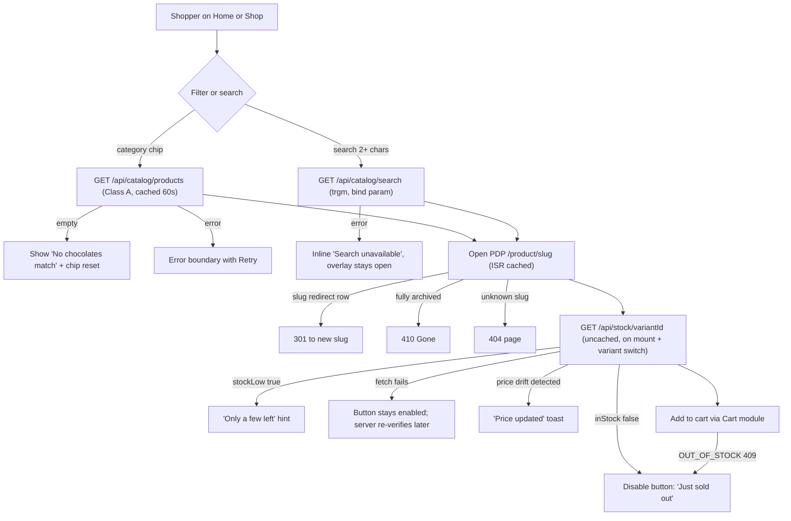
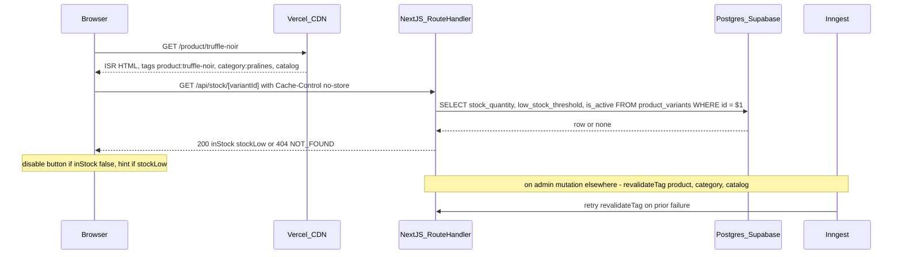
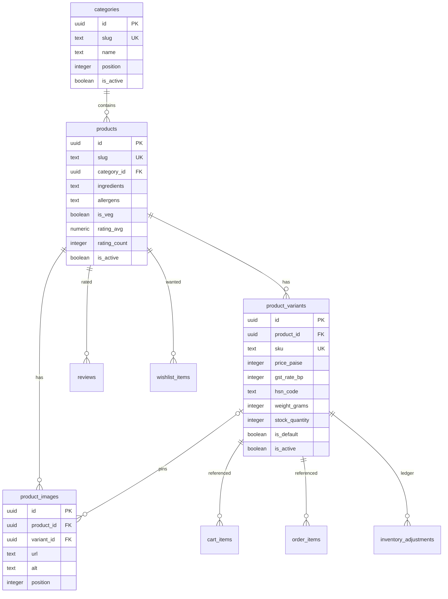
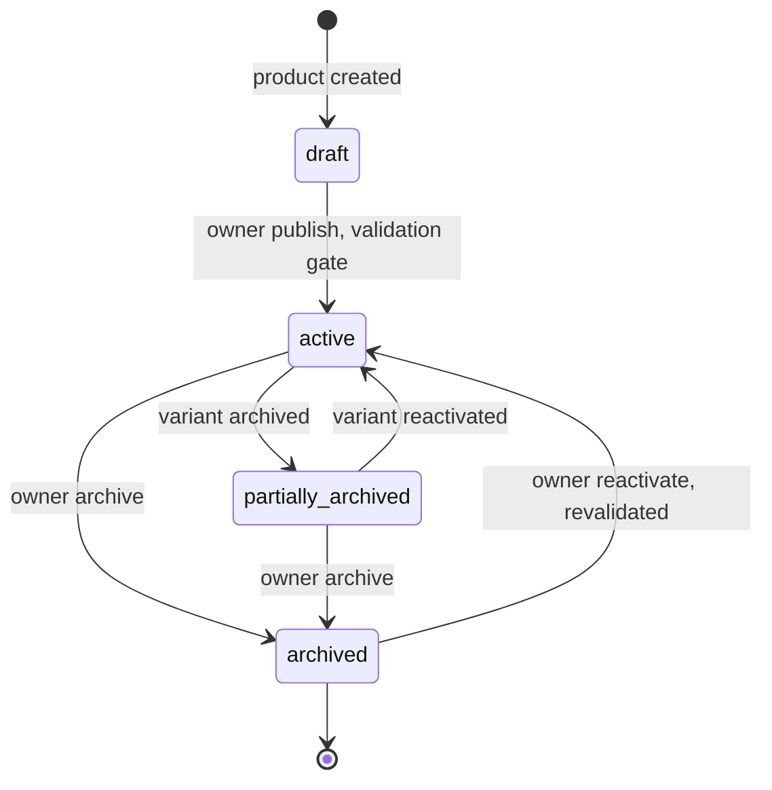

# Module Spec — Product Catalog incl. Search (Phase 1)

> **Scope:** Storefront catalog — categories, products, variants, images; public `/api/catalog/*` route handlers incl. `pg_trgm` search; live-stock check on PDP; ISR + `revalidateTag` strategy; slug rules + redirects; publish validation; FSSAI / Legal-Metrology display fields.
> **Out of scope (cross-link, do not duplicate):** admin CRUD for products/variants/images/inventory lives in [`admin-catalog-inventory.md`](./admin-catalog-inventory.md); cart consumption in [`cart.md`](./cart.md); order snapshotting in [`checkout-orders.md`](./checkout-orders.md); reviews aggregates in [`reviews.md`](./reviews.md); sitemap/JSON-LD generation in [`content-seo.md`](./content-seo.md).
> **Sources of truth:** `docs/DATABASE_ERD.md` §3.2–3.5 · `PROJECT_PLAN.md` §3.0 Contract + §3.3 · risk-engineering Module 1.
> **Conventions:** money = INR integer paise; timestamps = `timestamptz` UTC, IST at display; error codes only from the Contract registry; rate limits by class letter.

---

## 1. Field-Level Specification

Public catalog endpoints are read-only; the "input fields" are query/path parameters. All are validated with zod `.strict()` schemas in `packages/core/src/contracts/catalog.ts`. Admin write-side field specs live in `admin-catalog-inventory.md`.

### 1.1 `GET /api/catalog/products` query parameters

| Field | Type | Required | Max length | Format / Validation rule | Error message on failure |
|---|---|---|---|---|---|
| `category` | string | no | 60 | `^[a-z0-9-]{1,60}$` (category slug). Unknown-but-valid-format slug ⇒ empty list, **not** 404. | `"Invalid category filter."` (400 `VALIDATION_ERROR`) |
| `sort` | string | no | 10 | Enum: `featured \| price_asc \| price_desc \| rating`. Default `featured`. | `"Sort must be one of: featured, price_asc, price_desc, rating."` |
| `page` | integer | no | — | Coerced int, `>= 1`, `<= 500`. Default `1`. | `"Page must be a whole number between 1 and 500."` |
| `pageSize` | integer | no | — | Coerced int, `>= 1`, `<= 48`. Default `24`. | `"Page size must be between 1 and 48."` |
| `q` | string | no | 80 | Trimmed; NFC-normalized; control chars (`[\x00-\x1F\x7F]`) stripped; length after trim 0–80. Passed to trgm as a **bind parameter only**. Empty after trim ⇒ ignored. | `"Search text is too long (max 80 characters)."` |

### 1.2 `GET /api/catalog/products/[slug]` path parameter

| Field | Type | Required | Max length | Validation rule | Error message |
|---|---|---|---|---|---|
| `slug` | string | yes | 120 | `^[a-z0-9-]{1,120}$` — matches the DB CHECK `slug ~ '^[a-z0-9-]+$'`. Format failure ⇒ 404 (do not reveal validation internals on public paths). | 404 body: `"Product not found."` (`NOT_FOUND`) |

### 1.3 `GET /api/catalog/products/[slug]/reviews` query parameters

| Field | Type | Required | Validation rule | Error message |
|---|---|---|---|---|
| `page` | integer | no | Coerced int `>= 1`, default `1` | `"Page must be a whole number of 1 or more."` |
| `pageSize` | integer | no | Coerced int `1–20`, default `10` | `"Page size must be between 1 and 20."` |

### 1.4 `GET /api/catalog/search` query parameters

| Field | Type | Required | Max length | Validation rule | Error message |
|---|---|---|---|---|---|
| `q` | string | yes* | 80 | Same sanitization as §1.1 `q`. *Empty/missing `q` is not an error — returns `{ results: [] }` (Contract §2.2). Min effective length for a trgm hit: 2 chars (below that, return `[]` without querying). | `"Search text is too long (max 80 characters)."` (only >80) |
| `limit` | integer | no | — | Coerced int `1–20`, default `8`. | `"Limit must be between 1 and 20."` |

### 1.5 `GET /api/stock/[variantId]` path parameter

| Field | Type | Required | Validation rule | Error message |
|---|---|---|---|---|
| `variantId` | string (uuid) | yes | RFC-4122 UUID: `^[0-9a-f]{8}-[0-9a-f]{4}-[0-9a-f]{4}-[0-9a-f]{4}-[0-9a-f]{12}$` (case-insensitive). Malformed ⇒ 404, same body as unknown id (no oracle). | 404 body: `"Variant not found."` (`NOT_FOUND`) |

### 1.6 Catalog data fields with display/compliance rules (read path)

These are stored fields (DDL in §4) with normative render rules; write-side validation is in `admin-catalog-inventory.md`.

| Field | Rule on the storefront |
|---|---|
| `products.slug` / `categories.slug` | `^[a-z0-9-]+$` (DB CHECK). Slug generation: lowercase, NFD-transliterate diacritics (Café → cafe), non-alphanumerics → `-`, collapse repeats, trim `-`; collisions get a deterministic `-2`, `-3` suffix; renames create a redirect row (old → new, 301) via the shared slug-redirect infra (owned by Content/SEO — see `content-seo.md`). |
| `product_variants.price_paise`, `compare_at_price_paise` | Integer paise, GST-inclusive MRP. Rendered via `formatPaise()` only — never float math. `compare_at_price_paise` renders strikethrough only when `> price_paise` (DB CHECK guarantees). |
| `product_variants.weight_grams` | Legal Metrology **net quantity** — must render on PDP next to the variant name ("70 g"). |
| `products.ingredients`, `allergens`, `is_veg` | FSSAI block on PDP: full ingredient list, allergen statement, green (veg) / brown (non-veg) mark from `is_veg`. |
| `store_settings.fssai_license_number` | Rendered as `fssaiLicense` in `ProductDetail`, plus footer + invoices. Catalog reads it; never writes. |
| `products.rating_avg`, `rating_count` | Denormalized; catalog **reads only** — Reviews module recomputes on moderation. |
| `products.badge` | One of `'Best seller' \| 'New' \| 'Limited' \| 'Vegan' \| 'Seasonal'` or null; renders as a pill on cards. |

---

## 2. Workflow / User Flow

Primary flow: **browse → PDP → live-stock hydration → add to cart** (cart mutation itself belongs to the Cart module).

1. Shopper lands on Home / Shop (ISR-cached pages, tags `catalog`, `category:{slug}`).
2. Shopper filters by category chip or sorts → client fetches `GET /api/catalog/products?...` (Class A, CDN-cached 60 s). Failure → route-level error boundary with Retry (never a blank grid). Empty result → "No chocolates match" + one-tap chip reset.
3. Shopper opens search overlay, types ≥ 2 chars → debounced `GET /api/catalog/search?q=...&limit=8`. Failure → inline "Search is unavailable, try again", overlay stays open. No hits → "No results for 'x'" + popular products.
4. Shopper clicks a card → PDP `/product/[slug]` served from ISR cache (tag `product:{slug}`, 15-min time fallback).
   - Unknown/inactive slug → 404 page; fully archived product → **410 Gone**; stale slug with a redirect row → **301** to the new slug.
5. On mount and on every variant switch, the PDP calls `GET /api/stock/[variantId]` (uncached).
   - `inStock: false` → add-to-cart disables with "Just sold out" (even if the cached payload said in-stock).
   - `stockLow: true` → "Only a few left" hint.
   - Stock call fails → button **stays enabled** (server re-verifies at add-to-cart and placement; server is authoritative).
6. Hydration compares cached price with live variant price; drift → "price updated" toast (checkout later re-verifies with 409 `PRICE_CHANGED`). Never a silent higher charge.
7. Shopper adds to cart → Cart module server action takes over (`OUT_OF_STOCK` handling there).
8. Related / frequently-bought-together sections render if their queries succeed; on failure the sections are simply omitted (partial-failure tolerant).



---

## 3. System Design

Core action: PDP render + live-stock hydration.



**External service dependencies and down/timeout behavior**

| Dependency | Used for | When down / timing out |
|---|---|---|
| Postgres (Supabase, Mumbai; transaction-mode pooler) | All catalog reads, stock check, trgm search | Route handler returns 500 `INTERNAL`; storefront shows the error boundary with Retry. ISR-cached pages keep serving stale HTML (`stale-while-revalidate`), so browse survives short DB outages; only live stock + search degrade. Stock-check failure never blocks the UI (button stays enabled; checkout re-verifies). |
| Vercel revalidation API (`revalidateTag`) | Cache purge after admin mutations | Failure logged as `catalog.revalidate_failed {tag, error}` and **retried via an Inngest job**; the 15-min time-based fallback revalidate bounds staleness even if all retries fail. Stock is never trusted from the ISR payload, so a stale page cannot oversell. |
| Supabase Storage (public image URLs) | Product image delivery | Images are direct client→Storage fetches; outage degrades to `alt` text + tone-colored placeholder blocks. No server dependency at read time. |
| Inngest | Revalidation retry, nightly HSN integrity check, image orphan GC | Down ⇒ retries/GC queue up and run when it recovers; user-facing reads are unaffected. |

Razorpay / Shiprocket / MSG91 / Resend: **not used** by this module.

**Caching strategy**

| Layer | What | TTL | Invalidation trigger |
|---|---|---|---|
| ISR pages (`/`, `/shop`, `/product/[slug]`) | Full HTML | 15-min time-based fallback revalidate | `revalidateTag('product:{slug}')`, `revalidateTag('category:{slug}')`, `revalidateTag('catalog')` on every admin catalog mutation (with Inngest retry on failure) |
| CDN on `/api/catalog/*` GETs | JSON responses | `Cache-Control: s-maxage=60, stale-while-revalidate=300` | Time-based only (60 s window is the accepted staleness for lists/search) |
| `GET /api/stock/[variantId]` | **none** — `Cache-Control: no-store` | — | n/a; this endpoint exists precisely because stock must never be cached |

---

## 4. Database Schema

DDL reproduced verbatim from `docs/DATABASE_ERD.md` §3.2–3.5. This module **reads** `store_settings` (§3.1) and the Admin module writes `inventory_adjustments` (§3.22) — both owned elsewhere; see `admin-catalog-inventory.md`. Requires the `pg_trgm` extension.

### 4.1 `categories` (Contract §1.2)

Table, not enum: admin adds seasonal collections without a migration. Seeds: Bars, Pralines, Signature, Gifts.

| Column | Type | Constraints | Notes |
|---|---|---|---|
| `id` | `uuid` | `PRIMARY KEY DEFAULT gen_random_uuid()` | |
| `slug` | `text` | `NOT NULL UNIQUE CHECK (slug ~ '^[a-z0-9-]+$')` | |
| `name` | `text` | `NOT NULL` | |
| `description` | `text` | | |
| `position` | `integer` | `NOT NULL DEFAULT 0` | display order |
| `is_active` | `boolean` | `NOT NULL DEFAULT true` | soft delete |
| `created_at` | `timestamptz` | `NOT NULL DEFAULT now()` | |
| `updated_at` | `timestamptz` | `NOT NULL DEFAULT now()` | |

### 4.2 `products` (Contract §1.3)

| Column | Type | Constraints | Notes |
|---|---|---|---|
| `id` | `uuid` | `PRIMARY KEY DEFAULT gen_random_uuid()` | |
| `slug` | `text` | `NOT NULL UNIQUE CHECK (slug ~ '^[a-z0-9-]+$')` | |
| `name` | `text` | `NOT NULL` | |
| `category_id` | `uuid` | `NOT NULL REFERENCES categories(id) ON DELETE RESTRICT` | |
| `blurb` | `text` | `NOT NULL DEFAULT ''` | card one-liner |
| `description` | `text` | `NOT NULL DEFAULT ''` | PDP "Description" tab (markdown) |
| `tasting_notes` | `text[]` | `NOT NULL DEFAULT '{}'` | `['Cocoa','Caramel',...]` |
| `ingredients` | `text` | `NOT NULL DEFAULT ''` | FSSAI: full ingredient list |
| `allergens` | `text` | `NOT NULL DEFAULT ''` | FSSAI: "Contains milk, soy. May contain nuts." |
| `nutrition_facts` | `jsonb` | | per-100g table |
| `shelf_life_days` | `integer` | `CHECK (shelf_life_days > 0)` | |
| `storage_instructions` | `text` | | |
| `is_veg` | `boolean` | `NOT NULL DEFAULT true` | FSSAI green/brown dot mark |
| `badge` | `text` | | `'Best seller'` \| `'New'` \| `'Limited'` \| `'Vegan'` \| `'Seasonal'` |
| `tone` | `text` | `NOT NULL DEFAULT 'dark'` | design-system placeholder tone |
| `rating_avg` | `numeric(3,2)` | `NOT NULL DEFAULT 0` | DENORMALIZED: recomputed on review approve/reject |
| `rating_count` | `integer` | `NOT NULL DEFAULT 0` | DENORMALIZED |
| `is_active` | `boolean` | `NOT NULL DEFAULT true` | soft delete |
| `created_at` | `timestamptz` | `NOT NULL DEFAULT now()` | |
| `updated_at` | `timestamptz` | `NOT NULL DEFAULT now()` | |

```sql
CREATE INDEX products_category_active_idx ON products (category_id) WHERE is_active;
CREATE INDEX products_search_idx ON products USING gin ((name || ' ' || blurb) gin_trgm_ops);
```

### 4.3 `product_variants` (Contract §1.4)

| Column | Type | Constraints | Notes |
|---|---|---|---|
| `id` | `uuid` | `PRIMARY KEY DEFAULT gen_random_uuid()` | |
| `product_id` | `uuid` | `NOT NULL REFERENCES products(id) ON DELETE CASCADE` | |
| `sku` | `text` | `NOT NULL UNIQUE` | `'KK-TRN-16PC'` |
| `name` | `text` | `NOT NULL` | `'16-piece box'`, `'70g bar'` |
| `price_paise` | `integer` | `NOT NULL CHECK (price_paise > 0)` | MRP, GST-inclusive |
| `compare_at_price_paise` | `integer` | `CHECK (compare_at_price_paise > price_paise)` | |
| `gst_rate_bp` | `integer` | `NOT NULL DEFAULT 500 CHECK (gst_rate_bp BETWEEN 0 AND 2800)` | |
| `hsn_code` | `text` | `NOT NULL DEFAULT '1806'` | |
| `weight_grams` | `integer` | `NOT NULL CHECK (weight_grams > 0)` | net quantity (Legal Metrology) |
| `ship_weight_grams` | `integer` | `NOT NULL` | packed weight for courier rating |
| `length_cm` | `numeric(6,2)` | | |
| `breadth_cm` | `numeric(6,2)` | | |
| `height_cm` | `numeric(6,2)` | | |
| `stock_quantity` | `integer` | `NOT NULL DEFAULT 0 CHECK (stock_quantity >= 0)` | authoritative on-hand |
| `low_stock_threshold` | `integer` | `NOT NULL DEFAULT 10` | |
| `position` | `integer` | `NOT NULL DEFAULT 0` | |
| `is_default` | `boolean` | `NOT NULL DEFAULT false` | |
| `is_active` | `boolean` | `NOT NULL DEFAULT true` | soft delete |
| `created_at` | `timestamptz` | `NOT NULL DEFAULT now()` | |
| `updated_at` | `timestamptz` | `NOT NULL DEFAULT now()` | |

```sql
CREATE INDEX product_variants_product_idx ON product_variants (product_id);
CREATE UNIQUE INDEX product_variants_one_default_idx
  ON product_variants (product_id) WHERE is_default;             -- exactly one default per product
CREATE INDEX product_variants_low_stock_idx
  ON product_variants (stock_quantity) WHERE is_active AND stock_quantity <= 10;  -- admin low-stock list
```

### 4.4 `product_images` (Contract §1.5)

| Column | Type | Constraints | Notes |
|---|---|---|---|
| `id` | `uuid` | `PRIMARY KEY DEFAULT gen_random_uuid()` | |
| `product_id` | `uuid` | `NOT NULL REFERENCES products(id) ON DELETE CASCADE` | |
| `variant_id` | `uuid` | `REFERENCES product_variants(id) ON DELETE SET NULL` | optional pin |
| `url` | `text` | `NOT NULL` | |
| `alt` | `text` | `NOT NULL DEFAULT ''` | |
| `position` | `integer` | `NOT NULL DEFAULT 0` | |
| `created_at` | `timestamptz` | `NOT NULL DEFAULT now()` | |

```sql
CREATE INDEX product_images_product_pos_idx ON product_images (product_id, position);
```



---

## 5. API Design

All storefront catalog routes are public **Route Handlers**, **Class A (120/min/IP)**; every GET sends `Cache-Control: s-maxage=60, stale-while-revalidate=300` except the stock endpoint (`no-store`). Envelope is the Contract `ApiResult<T>`; common errors (400 `VALIDATION_ERROR`, 429 `RATE_LIMITED`, 500 `INTERNAL`) apply everywhere and are listed only where behavior is specific. All GETs are trivially idempotent. Admin `/api/admin/*` catalog routes (Class E, `admin:staff`/`admin:owner`) are specified in `admin-catalog-inventory.md`.

### 5.1 `GET /api/catalog/categories` — public, Class A

Response `200`: `{ categories: Category[] }` — active only, ordered by `position` ASC. `Category = { id, slug, name, description, position }`. Errors: none endpoint-specific.

### 5.2 `GET /api/catalog/products` — public, Class A

Request: query per §1.1. Response `200`:

```ts
{ products: ProductCard[] }         // meta.total in envelope meta for pagination
type ProductCard = { id: string; slug: string; name: string; blurb: string; badge: string | null;
  categorySlug: string; ratingAvg: number; ratingCount: number; imageUrl: string | null;
  fromPricePaise: number; compareAtPricePaise: number | null; inStock: boolean };
```

Semantics: active products with ≥ 1 active variant only; `fromPricePaise` = min active-variant price; `inStock` = any active variant with `stock_quantity > 0`; `sort=featured` = curated `position`/badge ordering; unknown `category` ⇒ empty list + `meta.total: 0` (not 404). Errors: 400 `VALIDATION_ERROR` (bad sort/page/pageSize), 429, 500.

### 5.3 `GET /api/catalog/products/[slug]` — public, Class A

Response `200`:

```ts
{ product: ProductDetail }
type ProductDetail = ProductCard & {
  description: string; tastingNotes: string[]; ingredients: string; allergens: string;
  nutritionFacts: Record<string, string> | null; shelfLifeDays: number | null; storageInstructions: string | null;
  isVeg: boolean; fssaiLicense: string;          // from store_settings — Legal Metrology/FSSAI display
  images: { id: string; url: string; alt: string; variantId: string | null }[];
  variants: { id: string; sku: string; name: string; pricePaise: number; compareAtPricePaise: number | null;
              weightGrams: number; inStock: boolean; stockLow: boolean; isDefault: boolean }[];
  related: ProductCard[];                        // same category, top-rated, excl. self
  frequentlyBoughtTogether: ProductCard[] };     // co-occurrence in order_items, fallback best sellers
```

Errors: **404 `NOT_FOUND`** `"Product not found."` (missing or `is_active = false`); **410 `GONE`** at the page layer for a fully archived product (all variants inactive) that once existed; **301** at the page layer when a slug-redirect row matches. `related`/`frequentlyBoughtTogether` failures degrade to `[]` — never fail the whole response.

### 5.4 `GET /api/catalog/products/[slug]/reviews` — public, Class A

Request: query per §1.3. Response `200`: `{ reviews: ReviewPublic[]; summary: { avg: number; count: number; histogram: Record<1|2|3|4|5, number> } }` — approved reviews only. Errors: 404 `NOT_FOUND` (unknown/inactive product). Review shape owned by `reviews.md`.

### 5.5 `GET /api/catalog/search` — public, Class A + tighter 30/min/IP bucket

Request: query per §1.4. Response `200`: `{ results: SearchHit[] }` where `SearchHit = { id, slug, name, blurb, imageUrl, fromPricePaise, categorySlug }`.

Implementation (normative): `pg_trgm` similarity over `(name || ' ' || blurb)` using `products_search_idx`; **`q` is always a bind parameter, never interpolated**; the query filters `products.is_active AND EXISTS (active variant)` **in the WHERE clause** — never relies on index or cache timing (draft/archived leak = unlaunched-SKU exposure). Empty/1-char `q` ⇒ `{ results: [] }` with no DB query. Errors: 400 (q > 80 chars), 429, 500.

### 5.6 `GET /api/stock/[variantId]` — public, Class A + 60/min/IP cap, **uncached**

Response `200`: `{ variantId: string; inStock: boolean; stockLow: boolean }` where `inStock = stock_quantity > 0 AND is_active` and `stockLow = inStock AND stock_quantity <= low_stock_threshold`. Header: `Cache-Control: no-store`. Exact quantity is **never** returned (competitive/scraping surface). Errors: **404 `NOT_FOUND`** `"Variant not found."` (unknown, malformed, or inactive variant — identical body for all three), 429, 500.

### 5.7 Admin surface (cross-link)

`GET/POST/PATCH/DELETE /api/admin/products*`, `/api/admin/variants/*`, `/api/admin/products/[id]/images*`, `/api/admin/inventory*` — Class E, optimistic `updated_at` version checks (409 `CONFLICT`), publish validation, signed-URL image flow, delta-only inventory adjustments. Full spec: [`admin-catalog-inventory.md`](./admin-catalog-inventory.md). Every admin mutation triggers `revalidateTag` for `product:{slug}` + `category:{slug}` + `catalog` (§3 caching).

---

## 6. Security Standards

- **Rate limits (Contract §2.1):** Class **A — 120/min/IP** on all `/api/catalog/*`; **search additionally capped at 30/min/IP** (scraping/DoS vector); **`/api/stock/[variantId]` additionally capped at 60/min/IP**. Admin routes Class **E — 600/min/admin session** (spec in admin doc). Every limited response carries `X-RateLimit-Limit`, `X-RateLimit-Remaining`, `X-RateLimit-Reset`; 429 adds `Retry-After` and body code `RATE_LIMITED`.
- **Input sanitization:** zod `.strict()` on every query/path schema — unknown keys rejected with 400 `VALIDATION_ERROR` + `fieldErrors`. Search `q`: trim, NFC-normalize, strip control chars, cap at 80, then **bind-parameter only** into the trgm query. Slugs validated against `^[a-z0-9-]+$` before touching the DB.
- **SQLi:** Drizzle parameterized everywhere; no string-built SQL; the trgm expression is a static prepared statement.
- **XSS:** `products.description` is admin-authored markdown sanitized with an allowlist (no `<script>`, no event handlers, no `javascript:` URLs) **at save time** AND React-encoded at render. `alt`, `name`, `blurb` render as text nodes only. JSON-LD output JSON-encodes all catalog strings.
- **Authz:** all §5.1–5.6 endpoints are public reads — no session required, and no non-public data may appear in them: queries filter `is_active` on product AND variant in-query. All catalog **mutations** live behind `admin:staff`; activate/archive (publish) and price/`gst_rate_bp` changes on live products are `admin:owner`-only, enforced server-side per route (UI hiding is cosmetic) — see admin doc.
- **Enumeration/oracle hardening:** stock endpoint returns booleans only, never quantities; malformed and unknown ids return identical 404 bodies; product 404s do not distinguish "never existed" from "draft".
- **Encryption at rest:** none beyond Supabase default disk encryption — catalog holds no PII, no secrets.
- **Never log:** nothing sensitive originates here, but request logs must not include full search-history-per-IP retention beyond the standard log window (behavioral profiling risk); admin audit logging (before/after values) is the admin module's concern.
- **OWASP risks specific to this module:** A03 Injection → bind params + Drizzle (above); A01 Broken Access Control → in-query `is_active` filters so drafts never leak through search/list/PDP; A05 Security Misconfiguration → `no-store` on the stock endpoint verified by an integration test (a CDN-cached stock response is an oversell bug); A04 Insecure Design → prices are integers end-to-end, `formatPaise()` is the only render path (no float drift); SSRF n/a (no outbound fetches from user input).

---

## 7. Edge Cases

(From risk-engineering Module 1 + PROJECT_PLAN §3.3.6, Contract naming.)

1. **Stale ISR shows "in stock" after sellout.** `revalidateTag` fails (Vercel API hiccup) or tag unregistered. Mitigation: stock never trusted from ISR payload — add-to-cart hydrates from uncached `GET /api/stock/[variantId]`; revalidation failures logged (`catalog.revalidate_failed`) + retried via Inngest; 15-min time fallback bounds worst-case staleness.
2. **Variant archived while sitting in carts and in Google's index.** Archive is soft (`is_active = false`); PDP returns **410** for a fully-archived product, redirects to the product if other variants live; cart line resolution flags the line `unavailable` instead of 500ing (Cart module owns that render); sitemap drops it on regeneration.
3. **Staff edits product while owner archives it concurrently.** Save must not resurrect the archived row: optimistic `updated_at` check in the UPDATE WHERE clause; mismatch → 409 `CONFLICT` with a "changed since you loaded it" field diff (admin doc owns the UX).
4. **Price change while PDP is cached.** Cached page shows ₹499, server prices ₹549. Server price is authoritative at add-to-cart, re-verified at placement (409 `PRICE_CHANGED` with fresh quote); hydration drift shows a "price updated" toast — never silently charge more than displayed.
5. **Short-dated stock vs delivery window.** Stock with best-before inside `transit_days + safety_buffer` is on hand but not sellable. v1: owner `damage_writeoff` ledger adjustments guided by `shelf_life_days`; the sellable-stock cutoff is a unit-tested pure function so batch tracking can slot in later without API change.
6. **Summer melt / seasonal gating.** Heat-sensitive products may be month/pincode-gated (no non-metro shipping May–June without cold pack) — modeled as product data so the PDP shows "unavailable in your region right now" instead of a checkout-time surprise; checkout evaluates whole-cart shippability against the same data (block with explanation, no auto-split at launch).
7. **HSN/GST integrity.** `gst_rate_bp` + `hsn_code` are resolved at order-snapshot time only, never joined live. A product activated with missing/blank HSN must fail publish validation loudly (HSN present, price > 0, ≥ 1 image, `weight_grams` present) — never silently tax at 0%. Nightly Inngest integrity check alerts on any active variant with a bad HSN/GST mapping.
8. **Search leaks archived/draft products.** The trgm query filters `is_active` on both product and variant **in the query**, never relying on index rebuild timing. A draft SKU in search results = data exposure of unlaunched products. Covered by an integration test and E2E #3.
9. **Image upload orphans.** Storage PUT succeeds but DB insert fails (or vice versa). Order enforced: DB row first (`pending`), then signed-URL upload, then flip ready; nightly Inngest job garbage-collects `pending > 24h` blobs; alert if one run deletes > 100 blobs (upload-bug signal).
10. **Category deletion with assigned products.** Blocked by `ON DELETE RESTRICT` on `products.category_id`; admin UI requires explicit reassignment; a deactivated category's slug 301s to `/shop` to preserve SEO; a category with zero active products disappears from nav entirely.
11. **Duplicate slugs after transliteration.** "Café Mocha" and "Cafe Mocha" both slugify to `cafe-mocha`. UNIQUE constraint is the backstop; generator appends `-2` deterministically; slug changes create a redirect row (old → new, 301) in the shared redirect infra.
12. **Live-stock endpoint fails on PDP.** Button stays enabled (fail-open for UX); add-to-cart and placement re-verify server-side (fail-closed for money) — the guarded `UPDATE ... WHERE stock_quantity >= $qty` is the last line of defense, so this can never oversell.

---

## 8. State Machine

Catalog entities carry a small visibility lifecycle (no status enum column — states are derived from `is_active` on product/variant plus publish validation):

| State | Meaning | Entry condition |
|---|---|---|
| `draft` | `products.is_active = false`, never activated | product created |
| `active` | `products.is_active = true` and ≥ 1 active variant | publish validation passed (HSN present, ≥ 1 image, price > 0, `weight_grams` present) |
| `partially_archived` | product active, ≥ 1 variant `is_active = false` | variant archive |
| `archived` | product `is_active = false` after having been active (or all variants inactive) | owner archive → storefront 410 |

Transitions: `draft → active` (owner publish, validation-gated); `active → partially_archived` (staff/owner variant archive); `partially_archived → active` (variant re-activate); `active|partially_archived → archived` (owner archive); `archived → active` (owner re-activate, re-runs publish validation). Every transition writes `admin_audit_log` and fires `revalidateTag`.



---

## 9. Testing Requirements

**Unit (`packages/core`, ≥ 90% line coverage on these pure functions):**
- Sellable-stock computation: best-before cutoff (`shelf_life_days` vs transit + safety buffer), `inStock`/`stockLow` threshold flags.
- Slug generation: transliteration (Café Mocha → cafe-mocha), collision suffixing determinism (`-2`, `-3`), pattern conformance to `^[a-z0-9-]+$`.
- Publish validation: HSN present, price > 0, ≥ 1 image, `weight_grams` present — each failure produces its exact field error.
- GST rate resolution by HSN + date (rate-as-data, snapshot semantics).
- `formatPaise()` on every catalog price display path (incl. compare-at strikethrough gating).
- Search input sanitizer: trim/NFC/control-strip/80-cap; 0–1 char short-circuit.

**Integration (ephemeral Postgres, migrations + `pg_trgm` applied):**
- Search query excludes inactive products AND inactive-only-variant products in-query; `q` is bound, not interpolated (assert via query log).
- Archive-while-editing 409 path (`updated_at` optimistic check).
- Category delete blocked by `ON DELETE RESTRICT`; slug redirect row created on rename; old slug 301s.
- `product_variants_one_default_idx` rejects a second default per product.
- Stock endpoint: `no-store` header present; inactive variant → 404; boolean-only body (no quantity leak).
- `revalidateTag` invoked with `product:{slug}`, `category:{slug}`, `catalog` on each mutation; failure enqueues the Inngest retry.
- Guarded stock `UPDATE ... WHERE stock_quantity >= $qty` under concurrency with the checkout decrement (never negative, no lost updates — shared with admin/checkout suites).

**E2E (Playwright, Vercel preview + Supabase preview branch):**
1. **Sellout freshness:** buy the last unit of a variant via API, load the PDP, assert add-to-cart disables immediately via the live stock check even while ISR is stale, and within one revalidation cycle for the cached payload.
2. **Archive flow:** admin archives a variant → PDP shows remaining variants; fully-archived product returns 410; sitemap no longer lists it after regeneration.
3. **Search integrity:** create an inactive product, assert absent from storefront search; activate it, assert present.

---

## 10. Definition of Done

- [ ] zod `.strict()` schemas live for all catalog query/path inputs (and all admin catalog inputs, per admin doc); responses parsed through core schemas in dev/CI
- [ ] All six public endpoints implemented with Contract envelope, Class A limits + the 30/min search and 60/min stock sub-buckets, and `X-RateLimit-*`/`Retry-After` headers verified
- [ ] `Cache-Control: s-maxage=60, stale-while-revalidate=300` on catalog GETs; `no-store` on `/api/stock/[variantId]` asserted by test
- [ ] Live stock check wired on PDP (mount + variant switch, uncached); "Just sold out" disable path demonstrated
- [ ] ISR tags (`product:{slug}`, `category:{slug}`, `catalog`) registered on all catalog pages; `revalidateTag` fired on every admin mutation with Inngest retry on failure; 15-min time fallback configured
- [ ] Slug redirects working (old slug 301s), duplicate-slug suffixing deterministic, deactivated category slug 301s to `/shop`
- [ ] Search excludes non-active in-query; trgm input parameterized; draft-leak integration test green
- [ ] Publish validation (HSN, image, price, weight) enforced server-side and unit-tested; nightly HSN/GST integrity check + alert wired
- [ ] FSSAI/Legal-Metrology block renders on PDP: ingredients, allergens, veg mark, net quantity (`weight_grams`), `fssaiLicense` from `store_settings`
- [ ] Sellable-stock function unit-tested including best-before cutoff
- [ ] Optimistic version-conflict (409 `CONFLICT` + diff) live on product/variant edits (verified via admin doc suite)
- [ ] Markdown description sanitizer (allowlist) applied at save AND React-encoded at render; XSS test vector suite green
- [ ] Structured logging: publish/archive/price-change events `{actor_id, product_id, variant_id, field, old_value, new_value}`; `catalog.revalidate_failed {tag, error}` on every failed purge
- [ ] Alerts wired: revalidation failure rate > 5% over 15 min; HSN integrity; image GC > 100 blobs/run
- [ ] CLS budget ≤ 0.1 on Shop/PDP skeletons passing as a blocking CI gate (from W5)
- [ ] The 3 E2E scenarios green in CI (merge queue)
