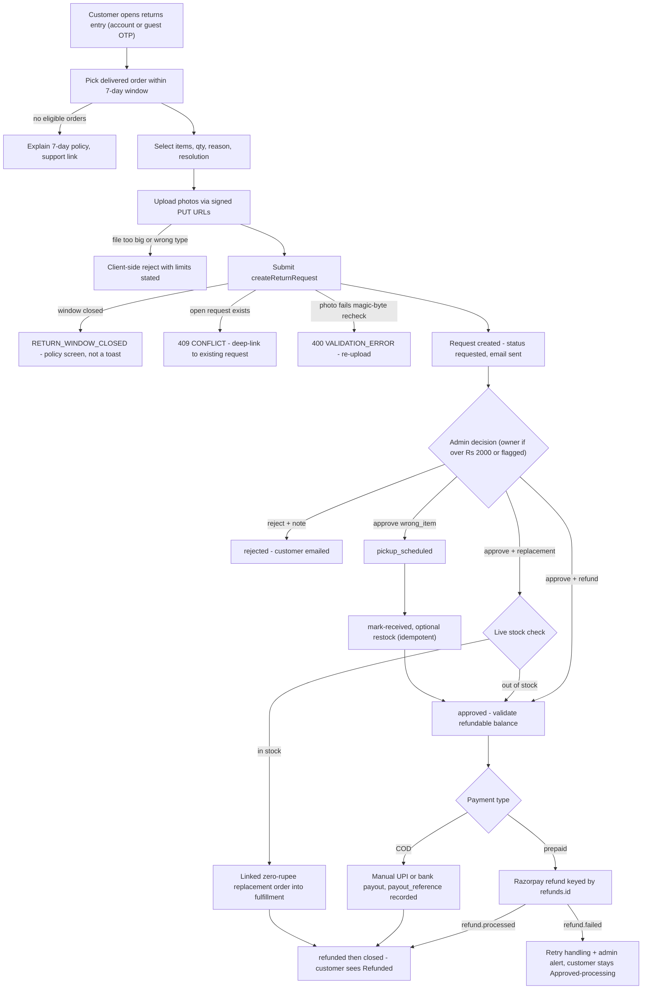
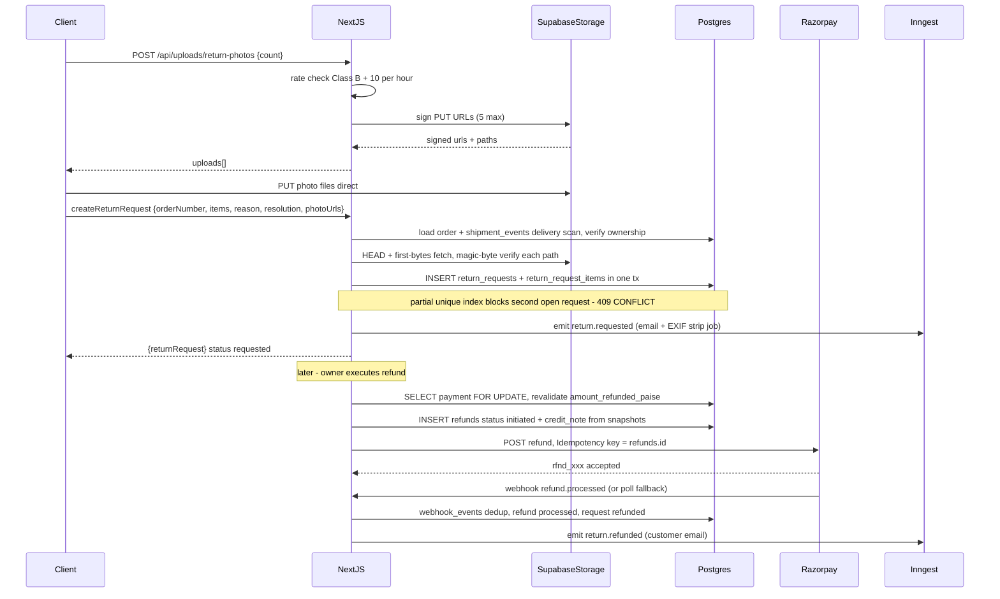
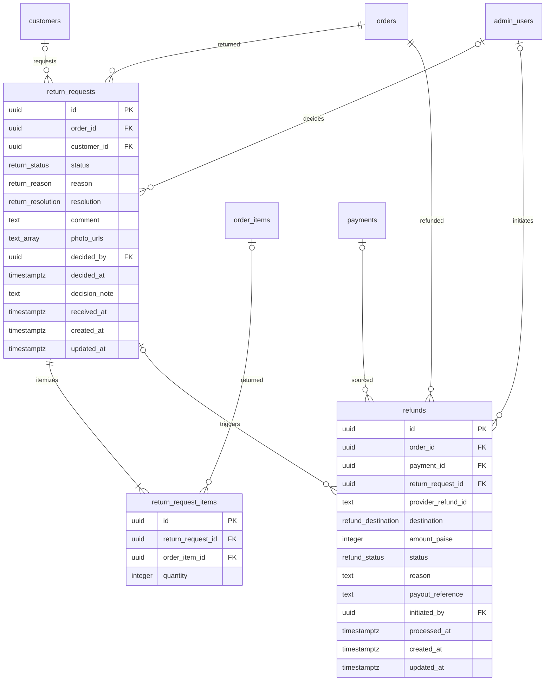
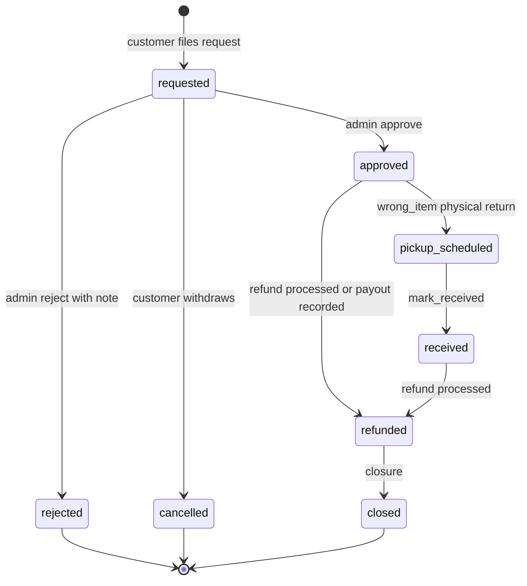

# Module Spec — Returns & Refund Requests (Phase 2)

> Phase 2 (W6–8) · Dev D (request flow, admin decisioning) + Dev C (refund execution) · PROJECT_PLAN §3.12 · Contract §1.18, §1.25, §2.8, §2.9 · Risk Module 9
>
> Post-delivery remediation for a perishable product. Customers (logged-in or guest via OTP tracking token) file item-level return requests with photo evidence; admins approve/reject; approved requests resolve to a Razorpay refund, a manual bank/UPI payout (COD), or a replacement (linked ₹0 order). **Launch policy is perishable-first: refund/replace on photo evidence with NO physical return for quality issues** (`damaged_or_melted`, `quality_issue`). Physical return + mark-received + restock exists only for `wrong_item`.

---

## 1. Field-Level Specification

### 1.1 Return request form (`createReturnRequest` / `POST /api/returns`)

| Field | Type | Required | Max | Format / Validation rule | User-facing error message |
|---|---|---|---|---|---|
| `orderNumber` | string | Yes | 20 | `^KK-\d{4,10}$` (order number format); must resolve to an order owned by the session customer or scoped to the guest tracking token; order status must be `delivered` | "We couldn't find that order." (`NOT_FOUND`) / "Returns open once your order is delivered." (`INVALID_TRANSITION`) |
| `items` | array | Yes | 20 items | Non-empty array; each `orderItemId` must be a UUID (`^[0-9a-f]{8}-[0-9a-f]{4}-[0-9a-f]{4}-[0-9a-f]{4}-[0-9a-f]{12}$`) belonging to that order; no duplicate `orderItemId` in one request | "Select at least one item to return." / "That item isn't part of this order." (`NOT_FOUND`) |
| `items[].qty` | integer | Yes | — | `Number.isInteger(qty) && qty >= 1 && qty <= orderItem.quantity` (ordered quantity from `order_items` snapshot) | "Quantity can't exceed the {n} you ordered." |
| `reason` | enum | Yes | — | One of `return_reason`: `damaged_or_melted` \| `wrong_item` \| `quality_issue` \| `changed_mind` \| `other` (zod enum, exact strings) | "Please choose a reason for your return." |
| `resolution` | enum | Yes | — | `refund` \| `replacement` (`return_resolution`); defaults to `refund` if omitted | "Please choose refund or replacement." |
| `comment` | string | No | 1000 chars | `comment.length <= 1000` after trim (mirrors DB `CHECK (char_length(comment) <= 1000)`); stored raw, encoded at render (stored-XSS target) | "Comment is too long — 1,000 characters max." |
| `photoUrls` | string[] | Conditional | 5 paths | Each entry must be a storage path previously issued by `POST /api/uploads/return-photos` for THIS identity (prefix match `returns/{identityId}/`); server re-verifies each object exists and passes magic-byte check at submission. **Required (≥1) when `reason ∈ {damaged_or_melted, quality_issue}`** — evidence-based policy | "Please add at least one photo of the issue." / "One of your photos couldn't be verified — please re-upload it." |

### 1.2 Photo upload signing (`POST /api/uploads/return-photos`)

| Field | Type | Required | Validation rule | Error message |
|---|---|---|---|---|
| `count` | integer | Yes | `Number.isInteger(count) && count >= 1 && count <= 5` | "You can upload up to 5 photos." |

Per-file constraints (enforced client-side pre-upload AND server-side at request submission):
- Size ≤ 5 MB (5,242,880 bytes) → "Each photo must be under 5 MB."
- Type: images only, verified by **magic bytes, never extension or Content-Type header**: JPEG `FF D8 FF`, PNG `89 50 4E 47 0D 0A 1A 0A`, WebP `52 49 46 46 ....57 45 42 50`, HEIC `ftypheic`/`ftypheix` box → "Only photos (JPG, PNG, WebP, HEIC) are accepted."
- EXIF metadata stripped server-side before any admin display (customer GPS = privacy leak).

### 1.3 Admin decision (`POST /api/admin/returns/[id]/decision`)

| Field | Type | Required | Validation rule | Error message |
|---|---|---|---|---|
| `action` | enum | Yes | `approve` \| `reject` | "Action must be approve or reject." |
| `note` | string | Conditional | ≤ 1000 chars; **required when `action = 'reject'`** (mandatory reject note) | "A note is required when rejecting a request." |

### 1.4 Refund execution (`POST /api/admin/orders/[id]/refunds`, owner-only)

| Field | Type | Required | Validation rule | Error message |
|---|---|---|---|---|
| `amountPaise` | integer | Yes | `Number.isInteger(amountPaise) && amountPaise > 0 && amountPaise <= refundablePaise` (revalidated inside the tx against `payments.amount_refunded_paise`) | "Amount exceeds the refundable balance of ₹{x}." (`REFUND_EXCEEDS_PAID`) |
| `reason` | string | Yes | 1–500 chars after trim | "A refund reason is required." |
| `destination` | enum | Yes | `original_method` \| `bank_transfer` \| `upi` (`refund_destination`); `original_method` only valid when a captured Razorpay payment exists; COD orders must use `bank_transfer`/`upi` | "COD orders must be refunded by bank transfer or UPI." |
| `payoutReference` | string | Conditional | Required to close a manual COD payout: UTR `^[A-Z0-9]{12,22}$` or UPI ref `^\d{12}$` | "Enter the UTR / UPI reference for this payout." |
| `returnRequestId` | uuid | No | Must reference an `approved` return request on this order | "Return request not found or not approved." |

### 1.5 COD payout details (captured from customer at approval, encrypted at rest)

| Field | Type | Required | Validation rule | Error message |
|---|---|---|---|---|
| `upiId` | string | One of UPI / bank | `^[a-zA-Z0-9._-]{2,256}@[a-zA-Z]{2,64}$` | "That doesn't look like a valid UPI ID (e.g. name@bank)." |
| `accountNumber` | string | With IFSC | `^\d{9,18}$` | "Account number must be 9–18 digits." |
| `ifsc` | string | With account | `^[A-Z]{4}0[A-Z0-9]{6}$` | "IFSC must be 11 characters, e.g. HDFC0001234." |
| `accountHolderName` | string | With account | 2–100 chars, `^[a-zA-Z][a-zA-Z .'-]{1,99}$` | "Please enter the account holder's name." |

### 1.6 Mark received (`POST /api/admin/returns/[id]/mark-received`)

| Field | Type | Required | Validation rule | Error message |
|---|---|---|---|---|
| `restock` | boolean | Yes | strict boolean | "Restock must be true or false." |

---

## 2. Workflow / User Flow

1. Customer opens `/account/returns` → "Start a return" (or guest: order tracking page post-OTP → "Report a problem"). Order picker lists only orders `delivered` within the last 7 days (IST); an empty list explains WHY ("returns are available for 7 days after delivery").
2. Customer selects items + quantities, picks `reason`, picks `resolution` (refund/replacement), uploads photos (required for quality reasons), adds optional comment.
3. Client requests signed PUT URLs (`POST /api/uploads/return-photos`), uploads directly to Supabase Storage with per-file progress. Failed tile → inline retry; form submits with successful uploads only after explicit user choice.
4. Submit → `createReturnRequest` (or guest `POST /api/returns`). Server validates: ownership, order `delivered`, 7-day window from delivery scan (IST, missing-scan fallback), quantities vs ordered, photo re-verification (existence + magic bytes), open-request uniqueness, ≤3 open requests/user.
   - Failure `RETURN_WINDOW_CLOSED` → clean policy explanation + support contact path (NOT an error toast).
   - Failure `CONFLICT` → deep-link to the existing open request (returned in `details`).
5. Success: request created in `requested`; confirmation with request ID + review SLA + status timeline; email fired; serial-refunder counter evaluated (≥3 quality-claim refunds per identity → flag; staff sees locked "requires owner").
6. Admin reviews in `/admin/returns` queue (oldest-first). Detail view: EXIF-stripped photos (attachment-served), per-line refundable balance, payment history, prior return count, flagged badge.
7. Decision (staff ≤ ₹2,000 unflagged; otherwise owner):
   - **Reject** → mandatory note → status `rejected` → customer email.
   - **Approve + refund** → validates refundable balance first → status `approved` → owner executes refund (#8 endpoint): prepaid via Razorpay (idempotent by `refunds.id`), COD via manual UPI/bank payout with `payout_reference`.
   - **Approve + replacement** → live stock check inline; in stock → linked ₹0 order through normal fulfillment; out of stock → refund fallback offered in the same dialog.
   - **Approve, `wrong_item`** → `pickup_scheduled` → physical return → `mark-received` (+ optional restock, idempotent) → then refund.
8. Refund lifecycle: `refund.processed` webhook (or reconciliation poll) → refund `processed`, request `refunded` → `closed`; customer status flips to "Refunded" + email. `refund.failed` → retry handling + admin alert; customer stays at "Approved — refund processing".



---

## 3. System Design



**External dependencies and failure behavior**

| Dependency | Used for | When down / timeout |
|---|---|---|
| Supabase Storage | signed PUT URLs, evidence storage, attachment serving | Signing fails → 502 `UPSTREAM_ERROR`, form keeps state, retry button. Verification fetch at submit fails → 400 `VALIDATION_ERROR` ("photo couldn't be verified"), request not created. Admin photo view degrades to "evidence temporarily unavailable" placeholder. |
| Razorpay (refund API) | prepaid refund execution | Create call timeout/5xx → 502 `UPSTREAM_ERROR`; `refunds` row stays `initiated`; retry re-sends with the SAME `refunds.id` idempotency key (never a new key). `refund.failed` webhook → retry state + admin alert. Webhook silence → reconciliation poll fallback resolves status. |
| Inngest | email jobs, EXIF-strip job, refund-stuck sweeps | Request creation still succeeds (event emission is fire-and-forget after commit); events replayed from outbox on recovery. EXIF-strip pending → admin UI blocks inline photo display until stripped flag set. |
| Shiprocket (indirect) | delivery-scan timestamp anchoring the window; replacement fulfillment | Missing delivered event (poll gap) → fall back to last `shipment_events` timestamp + flag request for manual review — never block the customer on our data gap. Replacement push failure follows Fulfillment module retry (order exists regardless). |
| Resend | customer notification emails | Email failure never rolls back state transitions; queued retry via Inngest. |

**Caching:** none. All reads are per-identity, low-volume, and money-adjacent (refundable balance must always be live from the ledger). Admin queue reads hit `return_requests_queue_idx` directly. The only cached artifact is the signed URL itself (TTL 15 min, single-use by convention).

---

## 4. Database Schema

DDL reproduced verbatim from `docs/DATABASE_ERD.md` §3.25, §3.26, §3.18.

### `return_requests` (Contract §1.25)

| Column | Type | Constraints | Notes |
|---|---|---|---|
| `id` | `uuid` | `PRIMARY KEY DEFAULT gen_random_uuid()` | |
| `order_id` | `uuid` | `NOT NULL REFERENCES orders(id) ON DELETE CASCADE` | |
| `customer_id` | `uuid` | `REFERENCES customers(id) ON DELETE SET NULL` | NULL = guest via OTP token |
| `status` | `return_status` | `NOT NULL DEFAULT 'requested'` | |
| `reason` | `return_reason` | `NOT NULL` | |
| `resolution` | `return_resolution` | `NOT NULL DEFAULT 'refund'` | |
| `comment` | `text` | `CHECK (char_length(comment) <= 1000)` | |
| `photo_urls` | `text[]` | `NOT NULL DEFAULT '{}'` | |
| `decided_by` | `uuid` | `REFERENCES admin_users(id) ON DELETE SET NULL` | |
| `decided_at` | `timestamptz` | | |
| `decision_note` | `text` | | |
| `received_at` | `timestamptz` | | |
| `created_at` | `timestamptz` | `NOT NULL DEFAULT now()` | |
| `updated_at` | `timestamptz` | `NOT NULL DEFAULT now()` | |

```sql
CREATE UNIQUE INDEX return_requests_one_open_idx ON return_requests (order_id)
  WHERE status IN ('requested','approved','pickup_scheduled');
CREATE INDEX return_requests_queue_idx ON return_requests (created_at) WHERE status = 'requested';
```

### `return_request_items` (Contract §1.25)

| Column | Type | Constraints | Notes |
|---|---|---|---|
| `id` | `uuid` | `PRIMARY KEY DEFAULT gen_random_uuid()` | |
| `return_request_id` | `uuid` | `NOT NULL REFERENCES return_requests(id) ON DELETE CASCADE` | |
| `order_item_id` | `uuid` | `NOT NULL REFERENCES order_items(id) ON DELETE CASCADE` | |
| `quantity` | `integer` | `NOT NULL CHECK (quantity > 0)` | |

```sql
UNIQUE (return_request_id, order_item_id)
```

### `refunds` (Contract §1.18) — execution owned by Dev C; cross-links the Payments module doc

| Column | Type | Constraints | Notes |
|---|---|---|---|
| `id` | `uuid` | `PRIMARY KEY DEFAULT gen_random_uuid()` | |
| `order_id` | `uuid` | `NOT NULL REFERENCES orders(id) ON DELETE CASCADE` | |
| `payment_id` | `uuid` | `REFERENCES payments(id) ON DELETE SET NULL` | |
| `return_request_id` | `uuid` | `REFERENCES return_requests(id) ON DELETE SET NULL` | |
| `provider_refund_id` | `text` | | `'rfnd_xxx'` |
| `destination` | `refund_destination` | `NOT NULL` | |
| `amount_paise` | `integer` | `NOT NULL CHECK (amount_paise > 0)` | |
| `status` | `refund_status` | `NOT NULL DEFAULT 'initiated'` | |
| `reason` | `text` | `NOT NULL` | |
| `payout_reference` | `text` | | UTR / UPI ref for manual COD refunds |
| `initiated_by` | `uuid` | `REFERENCES admin_users(id) ON DELETE SET NULL` | |
| `processed_at` | `timestamptz` | | |
| `created_at` | `timestamptz` | `NOT NULL DEFAULT now()` | |
| `updated_at` | `timestamptz` | `NOT NULL DEFAULT now()` | |

```sql
CREATE UNIQUE INDEX refunds_provider_idx ON refunds (provider_refund_id) WHERE provider_refund_id IS NOT NULL;
CREATE INDEX refunds_order_idx ON refunds (order_id);
```

**Enums** (verbatim): `return_status` = `'requested','approved','rejected','pickup_scheduled','received','refunded','closed','cancelled'` · `return_reason` = `'damaged_or_melted','wrong_item','quality_issue','changed_mind','other'` · `return_resolution` = `'refund','replacement'` · `refund_status` = `'initiated','processed','failed'` · `refund_destination` = `'original_method','bank_transfer','upi'`.



---

## 5. API Design

Common failures on every endpoint per Contract §2.1 (not repeated below): 400 `VALIDATION_ERROR` (zod, with `fieldErrors`), 401 `UNAUTHORIZED`, 403 `FORBIDDEN`, 429 `RATE_LIMITED`, 500 `INTERNAL`. Server Actions return `ApiErr` (never throw for expected failures).

### 5.1 `createReturnRequest` — Server Action · auth `customer` · rate Class B (60/min/session) + max 3 open requests/user

```ts
Request:  { orderNumber: string; items: { orderItemId: string; qty: number }[];
            reason: ReturnReason; resolution: 'refund'|'replacement';
            comment?: string; photoUrls: string[] }
Response: ApiResult<{ returnRequest: ReturnRequestView }>
// ReturnRequestView: { id, orderNumber, status, reason, resolution, items, customerStatusLabel, createdAt }
```
Errors: 422 `RETURN_WINDOW_CLOSED` (>7 days post-delivery-scan; `details: { deliveredAt, windowClosedAt }`) · 409 `CONFLICT` (open request exists; `details: { existingRequestId }`) · 404 `NOT_FOUND` (not your order/item) · 422 `INVALID_TRANSITION` (order not `delivered`) · 429 `RATE_LIMITED` (also when 3 open requests already exist).

### 5.2 `POST /api/returns` — Route Handler · auth `guest-token` (Bearer trackingToken from OTP order lookup) · rate Class B

Guest variant of 5.1, identical request/response shape and error codes. `customer_id` stays NULL. Token scope checked per order: a token for order A filing against order B → 404 `NOT_FOUND` (no existence leak).

### 5.3 `POST /api/uploads/return-photos` — Route Handler · auth `customer` | `guest-token` · rate Class B + 10 uploads/hour/user

```ts
Request:  { count: number }            // 1..5
Response: { uploads: { url: string; path: string }[] }   // signed Supabase Storage PUT URLs, 15-min TTL
```
Errors: 400 `VALIDATION_ERROR` (count > 5 or < 1) · 502 `UPSTREAM_ERROR` (storage signing failed). Server re-verifies magic bytes at request submission, not just at signing.

### 5.4 `GET /api/account/returns` — auth `customer` · rate Class A (120/min/IP)

```ts
Response: { returns: ReturnRequestView[] }   // own requests only, newest first
```

### 5.5 `GET /api/admin/returns?status=&page=` — auth `admin:staff` · rate Class E (600/min/admin session)

```ts
Response: { returns: AdminReturnRow[] }
// AdminReturnRow: { id, orderNumber, customerName, reason, resolution, itemCount,
//                   amountAtStakePaise, ageHours, flaggedIdentity: boolean, status }
```
Queue sorted oldest-first for `requested` (uses `return_requests_queue_idx`).

### 5.6 `POST /api/admin/returns/[id]/decision` — auth `admin:staff`; **`admin:owner` required if amount > ₹2,000 (200000 paise) or flagged identity** · rate Class E

```ts
Request:  { action: 'approve'|'reject'; note?: string }   // note required on reject
Response: { returnRequest: ReturnRequestView }
```
Errors: 422 `INVALID_TRANSITION` (not in `requested`; `details: { current }`) · 409 `CONFLICT` (concurrent decision — second writer loses via `SELECT ... FOR UPDATE`) · 403 `FORBIDDEN` (staff on >₹2,000 or flagged) · 422 `REFUND_EXCEEDS_PAID` (approve validates refundable balance BEFORE transitioning). Audit-logged.

### 5.7 `POST /api/admin/returns/[id]/mark-received` — auth `admin:staff` · rate Class E

```ts
Request:  { restock: boolean }
Response: { returnRequest: ReturnRequestView }
```
Errors: 422 `INVALID_TRANSITION` (not `pickup_scheduled`). `restock: true` inserts `inventory_adjustments` reason `return_restock`, idempotent via `inv_adj_once_per_cause_idx` — double-click never restocks twice.

### 5.8 `POST /api/admin/orders/[id]/refunds` — auth **`admin:owner`** · rate Class E · Contract §2.9, executed by Dev C (full lifecycle in the Payments module doc)

```ts
Request:  { amountPaise: number; reason: string; destination: 'original_method'|'bank_transfer'|'upi';
            payoutReference?: string; returnRequestId?: string }
Response: 201 { refund: RefundView }
```
Errors: 422 `REFUND_EXCEEDS_PAID` (`details: { refundablePaise }`) · 409 `CONFLICT` (refund already in flight for this request) · 502 `UPSTREAM_ERROR` (Razorpay down/timeout). **Idempotency:** Razorpay refund keyed by our `refunds.id` — approve double-click never double-refunds. Refund status transitions (`initiated → processed|failed`) are driven by `refund.processed`/`refund.failed` webhooks via the §2.10 pipeline (persist-then-ack, `webhook_events` dedup) plus the reconciliation poll fallback — not by the admin response.

---

## 6. Security Standards

- **Rate limits (Contract classes):** creation Class B (60/min/session) + hard cap 3 open requests/user (counted from `return_requests` rows, not the bucket); photo signing Class B + 10/hour/user; account reads Class A (120/min/IP); all `/api/admin/*` Class E (600/min/admin session). Every limited response carries `X-RateLimit-Limit`, `X-RateLimit-Remaining`, `X-RateLimit-Reset`; 429 adds `Retry-After` and body code `RATE_LIMITED`.
- **Input sanitization:** zod on every input (enums exact, quantities vs ordered, comment ≤1000). `comment` and `decision_note` are stored raw and **encoded at render** — they are stored-XSS targets on the admin UI; test that surface with hostile fixtures. Photo validation by magic bytes server-side (§1.2), never extension or client Content-Type.
- **Authorization:** requests by order owner only (customer session or guest tracking token scoped to that exact order — cross-order returns 404, not 403, to avoid enumeration). Decisions = admin; refund execution = **owner-only**; decisions > ₹2,000 or on flagged serial-refunder identities = owner (staff lockout enforced server-side, not just UI). Photo evidence access = admin-only, every view audited. Every decision, mark-received, and refund initiation lands in `admin_audit_log` with actor.
- **Encryption at rest:** COD payout details (UPI ID, account number, IFSC, holder name) encrypted at rest (app-layer AES-256-GCM before insert); admin access to decrypted values audited. Postgres disk encryption (Supabase default) is not sufficient alone for these fields.
- **NEVER logged:** payout account numbers, UPI IDs, IFSC, card data, full customer contact PII, signed URLs, guest tracking tokens, photo bytes. Allowed log shapes: `return.requested/approved/rejected/received {request_id, order_id, reason, resolution, amount_paise, actor}`; `refund.initiated/processed/failed {refund_id, order_id, destination, amount_paise, provider_refund_id, initiated_by}`.
- **File-serving hardening (OWASP A05/A08):** evidence served with `Content-Disposition: attachment` from the storage domain — never inline from app origin (kills stored-HTML/SVG XSS via uploads); EXIF stripped before admin display; request IDs are UUIDs (no sequential enumeration).
- **OWASP risks specific to this module:** IDOR on request/photo paths → UUID ids + ownership check on every read; broken access control on owner gates → negative tests (staff hitting owner endpoints → 403 `FORBIDDEN`); unrestricted file upload → magic bytes + size + count + off-origin attachment serving; race-condition abuse (double refund) → `SELECT ... FOR UPDATE` + Razorpay idempotency key = `refunds.id` + partial unique index; business-logic abuse (serial refunders) → ≥3 quality-claim refunds per identity (phone/email) auto-flags for owner review, feeding the same risk store as COD RTO history.

---

## 7. Edge Cases

1. **Perishable return reality.** Melted/damaged chocolate is not restockable: refund/replace on photo evidence, NO physical return for quality issues (`damaged_or_melted`, `quality_issue`). No reverse-pickup flow for quality claims; replacement creates a **linked ₹0 order** through normal fulfillment (stock decrement, AWB, tracking included).
2. **Return window boundary.** 7-day window computed from the **delivery scan timestamp** (`shipment_events`), not order date; boundary evaluated in IST (a scan at 23:50 IST starts the window that calendar day; expiry at scan+7d compared in IST). Delivered-timestamp missing (poll gap) → fall back to last event timestamp + flag for manual review — never block the customer on our data gap.
3. **Photo evidence abuse.** Type/size by **magic bytes, not extension** (≤5 files, ≤5 MB, images); EXIF stripped before admin display (customer GPS = privacy leak); files served `Content-Disposition: attachment` from a separate storage domain, never inline. Malicious file passing signing but failing submission re-check → request rejected, object garbage-collected.
4. **Refund request on a COD order.** No captured payment to refund against — resolution is bank-transfer/UPI (owner-executed manual payout recorded in `refunds` with `destination: bank_transfer|upi` + mandatory `payout_reference` UTR/UPI ref before close) or replacement. Payout fields format-validated (§1.5), encrypted at rest, admin access audited.
5. **Duplicate/concurrent requests.** `return_requests_one_open_idx` partial unique blocks the second insert at the DB (two parallel transactions → exactly one wins); the API maps the unique violation to 409 `CONFLICT` with the existing request in `details` so the UI deep-links to it.
6. **Request on a partially refunded line.** Refundable = line total − already refunded, **coupon-allocation-aware** (largest-remainder allocation from Coupons #3, consumed from `order_items` snapshot columns); approval revalidates against `payments.amount_refunded_paise` (ledger ceiling `CHECK amount_refunded_paise <= amount_paise`) inside the tx — 422 `REFUND_EXCEEDS_PAID` otherwise.
7. **GST credit-note correctness.** Refund approval emits a credit-note record mirroring the order's **snapshot** tax breakdown (`{hsn, gst_rate_bps, tax_amount_paise, taxable_value_paise}` at placement — a rate change from 5% between order and refund must not alter the note), with **gap-free sequential numbering per financial year via a DB sequence** (GST compliance; nightly integrity check alerts on gaps).
8. **Razorpay refund fails after "approved".** `refund.failed` webhook/poll → refund-failed-retry handling, admin alert fires, customer is NOT re-notified until resolved; customer-facing status stays "Approved — refund processing" until `refund.processed` — never promise money that hasn't moved.
9. **Replacement out of stock.** Replacement path checks live stock at approval; if gone, refund fallback is offered in the same dialog — no dangling awaiting-replacement state without an escape transition.
10. **Serial refunders.** Refund-request rate tracked per identity (phone/email); ≥3 quality-claim refunds auto-flags for owner review — staff cannot approve flagged requests (server-enforced 403, UI shows locked "requires owner"). Feeds the same risk store as COD RTO history.
11. **Guest request ownership.** Guest requests authenticate via OTP-issued tracking token only; `customer_id` NULL rows must still be enumerable-safe (UUID request IDs, no sequential lookup, token scope checked per order — wrong order → 404).
12. **Mark-received double-submit.** `restock: true` clicked twice → second insert blocked by `inv_adj_once_per_cause_idx`; stock never restocked twice, endpoint returns the already-received request idempotently.

---

## 8. State Machine

`return_status` — transitions enforced by `SELECT ... FOR UPDATE → validate → UPDATE + side effects in one tx` (same pattern as orders §1.28); anything not listed → 422 `INVALID_TRANSITION`.

| From | To | Trigger |
|---|---|---|
| `requested` | `approved` | admin decision `approve` (balance pre-validated; owner gate if >₹2,000/flagged) |
| `requested` | `rejected` | admin decision `reject` (mandatory note) |
| `requested` | `cancelled` | customer withdraws before decision |
| `approved` | `pickup_scheduled` | `wrong_item` only — physical return arranged |
| `approved` | `refunded` | evidence-based path: `refund.processed` webhook/poll confirms money moved (or COD `payout_reference` recorded) |
| `pickup_scheduled` | `received` | admin `mark-received` (optional idempotent restock) |
| `received` | `refunded` | refund executed and processed after physical receipt |
| `refunded` | `closed` | closure job / admin close after notification |

Terminal: `rejected`, `cancelled`, `closed`. Replacement resolution: request rides `approved → refunded → closed` semantics with the linked ₹0 order carrying fulfillment; a failed Razorpay refund does NOT transition the request — it stays `approved` under retry handling.



Related machine (Payments doc owns it): `refund_status` `initiated → processed | failed`, driven by webhooks + poll, never by the admin HTTP response.

---

## 9. Testing Requirements

**Unit (`packages/core`; coverage gate ≥90%, state machine 100% branch):**
- Window computation: delivery-scan anchor, 7-day IST boundary (scan 23:59 IST vs 00:01 IST cases), missing-timestamp fallback to last event + manual-review flag.
- Refundable-balance math: partial refunds + coupon allocation (largest-remainder), **property-tested** against the invariant `sum(line_refunds) ≤ captured − already_refunded`.
- Credit-note breakdown from snapshot columns, including the explicit GST rate-change case (rate changes post-order must not alter the note).
- Return state machine: full transition matrix (`requested → approved/rejected/cancelled → pickup_scheduled → received → refunded → closed`), every illegal transition rejected.
- Validators: UPI/IFSC/UTR regexes (positive + hostile fixtures), magic-byte detector per format, qty-vs-ordered logic.

**Integration (real Postgres):**
- Double-request blocked by `return_requests_one_open_idx` under two parallel transactions — exactly one insert wins, loser maps to 409 `CONFLICT`.
- Refund exceeding balance rejected with `REFUND_EXCEEDS_PAID` inside the tx.
- `refund.failed` webhook fixture drives retry state + alert; duplicate webhook deduped via `webhook_events`.
- Replacement order creation decrements stock and enters normal fulfillment.
- EXIF verified stripped on stored evidence.
- `mark-received` restock idempotent under double-submit (`inv_adj_once_per_cause_idx`).
- Guest token scoping: token for order A filing against order B → 404.
- Refund double-click: two concurrent executes with same `refunds.id` → one Razorpay call.

**E2E (Playwright, named):**
1. *Quality refund with photo* — delivered order → "melted on arrival" + 2 photos → admin reviews evidence → approves → Razorpay test refund → customer status "Refunded" + email.
2. *Replacement flow* — damage claim → replacement → linked ₹0 order visible in admin → mocked Shiprocket push → customer sees new tracking.
3. *Out-of-window rejection* — request 5 days past the window → clean "window expired" UX (policy screen, not an error toast) → support-contact path shown.

---

## 10. Definition of Done

- [ ] `return_requests` / `return_request_items` / `refunds` migrated with partial unique + queue indexes, DDL matching Contract §1.18/§1.25 verbatim; migration reviewed by Dev B; refund path carries two approvals (C + one of B/E) per the bus-factor rule
- [ ] Window enforcement from delivery scan with IST boundary + missing-timestamp fallback, unit-tested
- [ ] Photo pipeline complete: signed PUT URLs (≤5 files, ≤5 MB), magic-byte re-verification at submission, EXIF stripping, `Content-Disposition: attachment` off-origin serving — all tested
- [ ] Refundable-balance validation against `payments.amount_refunded_paise` inside the tx; `REFUND_EXCEEDS_PAID` negative test green; coupon-allocation-aware math property-tested
- [ ] Refund idempotency proven by double-click test (Razorpay key = `refunds.id`); `refund.failed` retry path + admin alert wired; poll fallback covers webhook silence
- [ ] Credit notes emitted from order snapshot columns with gap-free FY sequence (DB sequence); GST rate-change test explicit; nightly sequence-gap integrity check alert-wired
- [ ] COD manual payout flow: UPI/IFSC/UTR format validation, payout details encrypted at rest with audited access, mandatory `payout_reference` before close
- [ ] Replacement path creates linked ₹0 order with live stock check + refund fallback in the same dialog; no dangling awaiting-replacement state
- [ ] Serial-refunder flagging live (≥3 quality-claim refunds per identity); staff lockout on flagged requests enforced server-side; staff attempting owner actions → 403 `FORBIDDEN` (negative tests)
- [ ] All admin actions in `admin_audit_log` with actor; logs contain no payout account numbers, card data, or full contact PII
- [ ] Rate limits live: Class B + 3-open-requests cap, 10/hour photo signing, Class E admin; `X-RateLimit-*` + `Retry-After` headers verified
- [ ] Customer-facing status vocabulary verified: "Approved — refund processing" until `refund.processed`, only then "Refunded"
- [ ] Alerting live: queue depth > 15 or oldest `requested` > 48h; any `refund.failed`; refund stuck `initiated` > 24h; flagged-identity request created; credit-note sequence gap
- [ ] 3 E2E scenarios green in CI; concurrent double-request integration test green; state-machine unit coverage 100% branch
