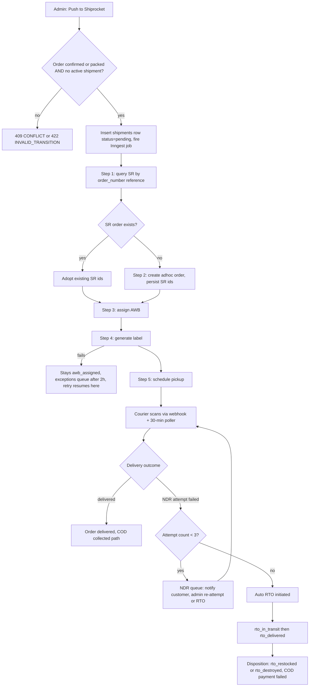
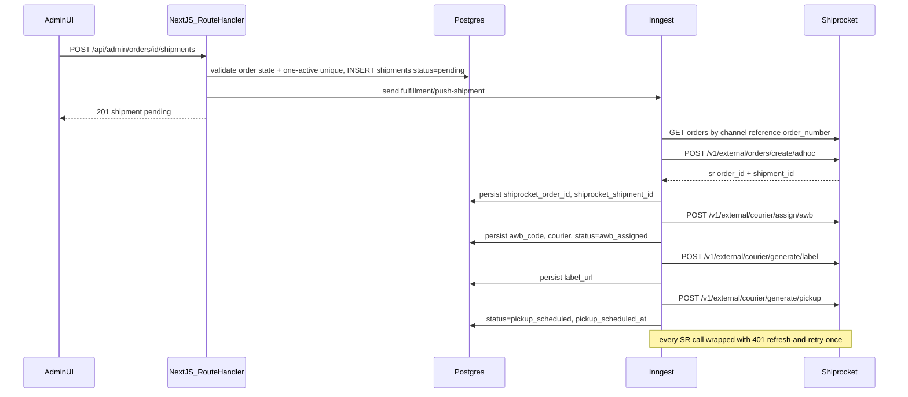
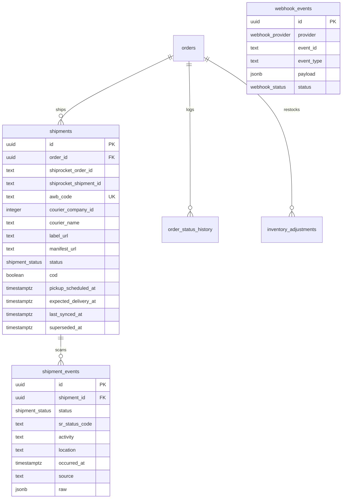
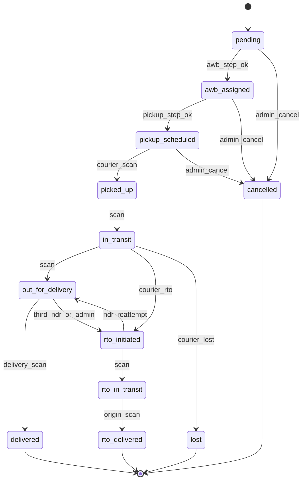

# Module Spec — Shipping & Fulfillment (Shiprocket) — Phase 2–3

> Owner lane: Dev D (Fulfillment & Admin). Phase 2 (W6–8) against the in-repo mock; Phase 3 (W9) flips the flag to the real Shiprocket client. Sources: PROJECT_PLAN §3.10, Contract §1.19–§1.21/§2.5–§2.7/§2.9, DATABASE_ERD §3.19–§3.21, risk-engineering Module 6.
>
> **Vendor facts (verified 2026-07 against apidocs.shiprocket.in / SR Postman workspace):** base `https://apiv2.shiprocket.in`; auth `POST /v1/external/auth/login` `{ email, password }` → `{ token }` valid **240 hours**, sent as `Authorization: Bearer <token>`; create adhoc order `POST /v1/external/orders/create/adhoc`; assign AWB `POST /v1/external/courier/assign/awb` `{ shipment_id, courier_id? }`; generate label `POST /v1/external/courier/generate/label` `{ shipment_id: [...] }`; pickup `POST /v1/external/courier/generate/pickup` `{ shipment_id: [...] }`; serviceability `GET /v1/external/courier/serviceability/?pickup_postcode=&delivery_postcode=&weight=&cod=`; track `GET /v1/external/courier/track/awb/{awb}`; webhook = POST to our URL with header `x-api-key` (shared secret configured in SR panel — **no HMAC signature exists**), payload carries `awb`, `current_status`, `current_status_id`, `shipment_status`, `shipment_status_id`, `current_timestamp`, `scans[]`, `sr_order_id`, `courier_name`. Shiprocket has **no sandbox**. Exact response envelope shapes and the complete status-id list: **verify at integration** (real-API drill, §7 #11) — zod at the client boundary is the guard, not memory.

---

## 1. Field-Level Specification

### 1.1 `POST /api/admin/orders/[id]/shipments` (create shipment)

| Field | Type | Required | Max | Format / Validation | Error message on failure |
|---|---|---|---|---|---|
| `id` (path) | uuid | yes | 36 | `^[0-9a-f]{8}-[0-9a-f]{4}-[0-9a-f]{4}-[0-9a-f]{4}-[0-9a-f]{12}$` | "Order not found." (404 `NOT_FOUND` — no uuid-shape leak) |
| `courierCompanyId` | integer | no | — | int ≥ 1; omit ⇒ SR-recommended courier | "Choose a valid courier or leave blank for the recommended one." (400 `VALIDATION_ERROR`) |

Pre-flight logic (server, before any SR call): order `status ∈ {confirmed, packed}` else 422 `INVALID_TRANSITION` "Order must be confirmed or packed before shipping."; no active shipment (`superseded_at IS NULL`) else 409 `CONFLICT` "This order already has an active shipment."; push payload built **only** from `orders.shipping_address` jsonb snapshot + `product_variants.ship_weight_grams`/`length_cm`/`breadth_cm`/`height_cm` — validated: weight > 0, all dims > 0, address has `name`, `line1`, `city`, `state`, `pincode` matching `^[1-9][0-9]{5}$`, `phone` matching `^[6-9]\d{9}$`. Any payload validation failure ⇒ 400 `VALIDATION_ERROR` "Shipment data incomplete: {field}." and the order lands in the fulfillment-exceptions queue — never a half-sent SR call.

### 1.2 `POST /api/admin/shipments/[id]/pickup`

| Field | Type | Required | Max | Format / Validation | Error message |
|---|---|---|---|---|---|
| `date` | string | no | 10 | `^\d{4}-\d{2}-\d{2}$`, IST calendar date, ≥ today (IST), ≤ today+7 | "Pickup date must be within the next 7 days." (400 `VALIDATION_ERROR`) |

### 1.3 `GET /api/shipping/serviceability`

| Field | Type | Required | Max | Format / Validation | Error message |
|---|---|---|---|---|---|
| `pincode` | string | yes | 6 | `^[1-9][0-9]{5}$` | "Enter a valid 6-digit pincode." (400 `VALIDATION_ERROR`) |
| `cod` | string | no | 5 | `^(true|false)$`, default `false` | "Invalid COD flag." (400 `VALIDATION_ERROR`) |

Serviceable pincode but no couriers ⇒ 422 `PINCODE_UNSERVICEABLE` "We can't deliver to this pincode yet."

### 1.4 `POST /api/webhooks/shiprocket` (inbound, machine-facing — errors are codes, not copy)

| Field | Type | Required | Validation | Failure behavior |
|---|---|---|---|---|
| header `x-api-key` | string | yes | constant-time compare vs `SHIPROCKET_WEBHOOK_SECRET` | 401 `SIGNATURE_INVALID`; **nothing persisted** |
| `awb` | string | yes | non-empty, ≤ 32 chars, `^[A-Za-z0-9-]+$` | persisted to `webhook_events`, ack 200, processor marks `skipped` + logs `tracking.unknown_awb` |
| `current_status` | string | yes | non-empty ≤ 64 | same skip path |
| `shipment_status_id` / `current_status_id` | integer | no | mapped via §3.4 table; unknown ⇒ event logged, no transition | processor logs `tracking.unknown_sr_code`, marks `skipped` |
| `current_timestamp` | string | yes | parseable datetime (SR sends IST — convert to UTC on ingest) | unparseable ⇒ fall back to `received_at`, flag in `raw` |
| `scans` | array | no | each `{ date, activity, location }`; individually zod-parsed, bad entries dropped not fatal | — |

### 1.5 Admin RTO disposition form (per order line, on `rto_delivered`)

| Field | Type | Required | Validation | Error message |
|---|---|---|---|---|
| `disposition` | enum | yes | `^(rto_restocked|rto_destroyed)$` per line; default from product heat-sensitivity flag (heat-sensitive ⇒ `rto_destroyed`) | "Pick restock or destroy for every line." (400 `VALIDATION_ERROR`) |
| `note` | string | no | ≤ 500 chars, control chars stripped | "Note too long (max 500 characters)." (400 `VALIDATION_ERROR`) |

### 1.6 Weight-dispute record (admin, per shipment)

| Field | Type | Required | Validation | Error message |
|---|---|---|---|---|
| `chargedWeightGrams` | integer | yes | int > 0, ≤ 50000 | "Charged weight must be a positive number of grams." (400 `VALIDATION_ERROR`) |
| `chargedAmountPaise` | integer | yes | int ≥ 0 (paise) | "Amount must be in paise (integer)." (400 `VALIDATION_ERROR`) |

---

## 2. Workflow / User Flow

Admin fulfillment flow (the core action):

1. Admin opens order (status `confirmed`/`packed`) → clicks **Push to Shiprocket** (optional courier pick).
2. Server validates transition + one-active-shipment; inserts `shipments` row `status='pending'`; emits `fulfillment/push-shipment` Inngest event; responds 201 immediately.
3. Inngest step `check-existing`: query SR by channel reference = our `order_number`. Found ⇒ adopt IDs, skip create.
4. Step `create-sr-order`: `POST /orders/create/adhoc`; persist `shiprocket_order_id` + `shiprocket_shipment_id` in step output **and** on the row. Failure ⇒ Inngest retry resumes here, never re-creates (step 3 re-checks).
5. Step `assign-awb`: `POST /courier/assign/awb`; persist `awb_code`, `courier_company_id`, `courier_name`; shipment → `awb_assigned`.
6. Step `generate-label`: `POST /courier/generate/label`; persist `label_url`. Failure ⇒ shipment stays `awb_assigned`; > 2h ⇒ exceptions queue; admin Retry resumes at this step only.
7. Step `schedule-pickup`: `POST /courier/generate/pickup`; persist `pickup_scheduled_at`; shipment → `pickup_scheduled`.
8. Courier scans arrive (webhook accelerates, 30-min poller guarantees): `picked_up` → order transition `packed→shipped` (row-locked) → `in_transit` → `out_for_delivery` → `delivered` (order `delivered`, COD payment → `cod_collected` path).
9. Failure branch — NDR: undelivered scan ⇒ NDR queue, customer SMS; ≤ 2 failed attempts ⇒ admin may re-attempt; 3rd failed attempt ⇒ auto-RTO (`rto_initiated`).
10. RTO branch: `rto_initiated → rto_in_transit → rto_delivered` ⇒ disposition form (§1.5) ⇒ idempotent inventory ledger rows; COD payment → `failed`.



---

## 3. System Design

### 3.1 Core sequence — push pipeline



### 3.2 External dependencies & down-behavior

| Dependency | Used for | When down / timing out (all SR calls: 15s timeout, 2 retries with jittered backoff inside the step) |
|---|---|---|
| Shiprocket API | push, AWB, label, pickup, tracking, serviceability, cancel | Push steps: Inngest retries with backoff; shipment parked at last completed step; > 2h ⇒ exceptions queue. Serviceability: serve 24h cache if present, else 502 `UPSTREAM_ERROR` and checkout shows "standard only, verified at dispatch". Tracking page: **never calls SR live** — renders DB state with "Last updated {time IST}". Poller: skips run, alert after 2 consecutive failures (dead-man switch). |
| Shiprocket auth (`/auth/login`) | 240h token | Refresh fails ⇒ existing token keeps working until expiry; token age > 9 days ⇒ **page-level alert** (everything downstream dies at 10 days). 401 mid-call ⇒ refresh-and-retry-once; second 401 ⇒ step failure, normal retry path. |
| Inngest | step orchestration, poller cron | Events buffered by Inngest; if unreachable at emit time, the shipment row is `pending` with no job — the 30-min sweep re-emits for `pending` rows older than 15 min. |
| MSG91 (via Notifications module) | NDR customer SMS | Fire-and-forget through the notifications queue; SMS failure never blocks the NDR state change. |

### 3.3 Caching

| What | Store | TTL | Invalidation |
|---|---|---|---|
| Serviceability per `(pincode, cod)` | Postgres table-less cache (`store_settings`-adjacent KV) or Vercel KV — key `svc:{pincode}:{cod}` | **24h** | TTL only; `origin_pincode` change in `store_settings` flushes prefix |
| SR bearer token | `store_settings` row `shiprocket_token` `{ token, token_expires_at }` | 240h from issue; scheduled refresh at ~9 days | Refresh job or 401-triggered refresh; concurrent refresh serialized via `UPDATE ... WHERE token_expires_at < $threshold` guard |
| Tracking page data | none — reads DB directly | — | Poller/webhook writes are the freshness mechanism; caching here would show stale money-adjacent state |

### 3.4 SR status-code → `shipment_status` mapping (rate-as-data table in `packages/integrations/src/shiprocket/status-map.ts`)

Monotonic rank enforced (higher rank never regresses; RTO branch is a separate ascending track). Codes below are the commonly published SR `shipment_status_id` values — **the full list must be re-verified at integration** against the live account; unknown codes are logged + skipped, never guessed.

| SR id | SR label | `shipment_status` | rank |
|---|---|---|---|
| 11 | PENDING | `pending` | 0 |
| 1 | AWB ASSIGNED | `awb_assigned` | 10 |
| 2 / 5 | LABEL GENERATED / MANIFEST GENERATED | `awb_assigned` | 10 |
| 3 / 4 / 19 | PICKUP SCHEDULED / QUEUED / OUT FOR PICKUP | `pickup_scheduled` | 20 |
| 42 | PICKED UP | `picked_up` | 30 |
| 6 / 18 / 38 | SHIPPED / IN TRANSIT / REACHED DESTINATION HUB | `in_transit` | 40 |
| 17 | OUT FOR DELIVERY | `out_for_delivery` | 50 |
| 21 | UNDELIVERED (NDR) | *no status change* — NDR counter + queue | — |
| 7 | DELIVERED | `delivered` | 60 (terminal) |
| 9 / 14 / 40 | RTO INITIATED / ACKNOWLEDGED / RTO NDR | `rto_initiated` | 51 |
| 41 / 46 | RTO OFD / RTO IN TRANSIT | `rto_in_transit` | 52 |
| 10 | RTO DELIVERED | `rto_delivered` | 60 (terminal) |
| 8 / 16 / 45 | CANCELED variants | `cancelled` | 60 (terminal) |
| 12 | LOST | `lost` | 60 (terminal) |

Poller is **primary**: cron every 30 min scans `shipments_stale_poll_idx` for rows with `last_synced_at` older than 6h (nightly sweep: all non-terminal regardless of watermark), calls `GET /courier/track/awb/{awb}`, upserts events keyed `(shipment_id, status, occurred_at)`, advances state through the same monotonic mapper, then sets `last_synced_at = now()`. Webhooks are best-effort accelerators only.

---

## 4. Database Schema

DDL reproduced verbatim from `docs/DATABASE_ERD.md` §3.19–§3.20 (shared `webhook_events` §3.21 is owned by Payments; this module writes `provider='shiprocket'` rows).

### `shipments`

| Column | Type | Constraints | Notes |
|---|---|---|---|
| `id` | `uuid` | `PRIMARY KEY DEFAULT gen_random_uuid()` | |
| `order_id` | `uuid` | `NOT NULL REFERENCES orders(id) ON DELETE CASCADE` | |
| `shiprocket_order_id` | `text` | | |
| `shiprocket_shipment_id` | `text` | | |
| `awb_code` | `text` | `UNIQUE` | courier tracking number; webhook correlation key |
| `courier_company_id` | `integer` | | |
| `courier_name` | `text` | | |
| `label_url` | `text` | | |
| `manifest_url` | `text` | | |
| `status` | `shipment_status` | `NOT NULL DEFAULT 'pending'` | |
| `cod` | `boolean` | `NOT NULL DEFAULT false` | |
| `pickup_scheduled_at` | `timestamptz` | | |
| `expected_delivery_at` | `timestamptz` | | courier ETD; feeds "Expected Jul 4" in timeline |
| `last_synced_at` | `timestamptz` | | polling reconciliation watermark |
| `superseded_at` | `timestamptz` | | |
| `created_at` | `timestamptz` | `NOT NULL DEFAULT now()` | |
| `updated_at` | `timestamptz` | `NOT NULL DEFAULT now()` | |

```sql
CREATE UNIQUE INDEX shipments_one_active_idx ON shipments (order_id) WHERE superseded_at IS NULL;
CREATE INDEX shipments_stale_poll_idx ON shipments (last_synced_at)  -- Inngest 30-min reconciliation cron scans this
  WHERE superseded_at IS NULL
    AND status IN ('awb_assigned','pickup_scheduled','picked_up','in_transit','out_for_delivery','rto_initiated','rto_in_transit');
```

### `shipment_events`

| Column | Type | Constraints | Notes |
|---|---|---|---|
| `id` | `uuid` | `PRIMARY KEY DEFAULT gen_random_uuid()` | |
| `shipment_id` | `uuid` | `NOT NULL REFERENCES shipments(id) ON DELETE CASCADE` | |
| `status` | `shipment_status` | `NOT NULL` | mapped from SR status code |
| `sr_status_code` | `text` | | raw Shiprocket code, e.g. `'17'` |
| `activity` | `text` | | |
| `location` | `text` | | |
| `occurred_at` | `timestamptz` | `NOT NULL` | |
| `source` | `text` | `NOT NULL CHECK (source IN ('webhook','poll','manual'))` | |
| `raw` | `jsonb` | | |
| `created_at` | `timestamptz` | `NOT NULL DEFAULT now()` | |

```sql
UNIQUE (shipment_id, status, occurred_at)
CREATE INDEX shipment_events_shipment_idx ON shipment_events (shipment_id, occurred_at);
```

Enum (Contract §1.0): `shipment_status` = `'pending','awb_assigned','pickup_scheduled','picked_up','in_transit','out_for_delivery','delivered','rto_initiated','rto_in_transit','rto_delivered','cancelled','lost'`.



(`webhook_events` deliberately has no FK — correlation to shipments is via `awb_code` payload lookup.)

---

## 5. API Design

Common failures apply everywhere and are not repeated: 400 `VALIDATION_ERROR`, 401 `UNAUTHORIZED`, 403 `FORBIDDEN`, 429 `RATE_LIMITED`, 500 `INTERNAL`. All responses use the `ApiResult` envelope with `requestId`.

| # | Method & route | Auth | Rate | Request → Response | Endpoint-specific errors |
|---|---|---|---|---|---|
| 1 | `POST /api/admin/orders/[id]/shipments` | `admin:staff` | E (600/min/admin session) | `{ courierCompanyId?: number }` → `201 { shipment }` (status `pending`; pipeline runs async) | 404 `NOT_FOUND`; 409 `CONFLICT` (active shipment exists); 422 `INVALID_TRANSITION` (order not confirmed/packed); 502 `UPSTREAM_ERROR` (SR error passthrough in `details`) |
| 2 | `GET /api/admin/shipments/[id]/label` | `admin:staff` | E | → `{ labelUrl }` (regenerates via SR if stale) | 404 `NOT_FOUND`; 502 `UPSTREAM_ERROR` |
| 3 | `POST /api/admin/shipments/[id]/pickup` | `admin:staff` | E | `{ date?: 'YYYY-MM-DD' }` → `{ shipment }` with `pickup_scheduled_at` | 404 `NOT_FOUND`; 502 `UPSTREAM_ERROR` |
| 4 | `POST /api/admin/shipments/[id]/cancel` | `admin:staff` | E | → `{ shipment }` — sets `superseded_at`, cancels SR-side, order returns to `packed` for reship | 404 `NOT_FOUND`; 422 `INVALID_TRANSITION` (already picked up); 502 `UPSTREAM_ERROR` |
| 5 | `POST /api/admin/shipments/[id]/rto-disposition` | `admin:staff` | E | `{ lines: [{ orderItemId, disposition: 'rto_restocked'\|'rto_destroyed' }], note? }` → `{ shipment, adjustments }` | 422 `INVALID_TRANSITION` (shipment not `rto_delivered`); 409 `ALREADY_PROCESSED` (disposition already recorded — idempotent replay returns prior result) |
| 6 | `POST /api/admin/shipments/[id]/weight-dispute` | `admin:staff` | E | `{ chargedWeightGrams, chargedAmountPaise }` → `{ dispute }` (declared values read from variant physicals) | 404 `NOT_FOUND` |
| 7 | `POST /api/webhooks/shiprocket` | `webhook` (`x-api-key` shared secret) | unlimited, secret-gated | raw SR payload → `200 {}` or `200 { duplicate: true }` in < 2s. Persist-then-ack: verify secret → synthetic `event_id = sha256(awb \|\| '\|' \|\| current_status \|\| '\|' \|\| current_timestamp)` → `INSERT ... ON CONFLICT (provider, event_id) DO NOTHING` → `inngest.send('shiprocket/event.received')` | 401 `SIGNATURE_INVALID` (bad/missing `x-api-key`, nothing persisted); 500 only if the insert itself fails |
| 8 | `GET /api/shipping/serviceability?pincode=&cod=` | `public` | A (120/min/IP) | → `{ serviceable, codAvailable, options: [{ option, feePaise, etaDaysMin, etaDaysMax }] }`; 24h cache per `(pincode, cod)` | 400 `VALIDATION_ERROR`; 422 `PINCODE_UNSERVICEABLE`; 502 `UPSTREAM_ERROR` (UI falls back to "standard only, verified at dispatch") |
| 9 | `GET /api/orders/[orderNumber]/tracking` | `customer`-owner \| Bearer `trackingToken` (30-min JWT) \| `?accessToken=` ≤24h post-placement | A | → `{ order, timeline: TimelineStep[], shipment: { awb, courierName, expectedDeliveryAt } \| null }` | 401 `UNAUTHORIZED`; 404 `NOT_FOUND`; 410 `TOKEN_EXPIRED` |

**Idempotency.** #1: creation is guarded by `shipments_one_active_idx` (double-click ⇒ 409) and the SR-side create is keyed by `order_number` channel reference with a pre-create existence check inside one `step.run` — Inngest retries resume post-create. #5: ledger rows guarded by `inv_adj_once_per_cause_idx` partial unique on `(order_id, variant_id, reason)` — replay writes nothing twice. #7: `UNIQUE (provider, event_id)` with the synthetic id. Event inserts everywhere: `ON CONFLICT (shipment_id, status, occurred_at) DO NOTHING`.

**Inngest functions (module contract, not HTTP):** `fulfillment/push-shipment` (5 resumable steps, per-step persisted state, concurrency ≤ 5); `shiprocket/event.received` processor (claims `webhook_events` via `UPDATE ... SET status='processing' WHERE id=$1 AND status IN ('received','failed')`); `shiprocket/poll-tracking` cron `*/30 * * * *` + nightly full sweep (pings healthchecks.io dead-man switch); `shiprocket/token-refresh` cron at ~9-day cadence; weekly contract-check job (post-launch) diffing real read-only responses vs fixture schemas.

---

## 6. Security Standards

- **Rate limits:** serviceability Class A (120/min/IP); tracking read Class A; all `/api/admin/*` Class E (600/min/admin session); webhook unlimited but secret-gated. Headers `X-RateLimit-Limit/Remaining/Reset` + `Retry-After` on 429. Poller self-throttles against SR limits (batching, backoff on SR 429).
- **Input sanitization:** zod `.strict()` on every admin body; zod on **all SR responses at the client boundary** — parse failure lands the shipment in the exceptions queue, never crashes deep in a job; webhook `raw` stored verbatim as jsonb but rendered output-encoded in admin UI (scan `activity`/`location` are attacker-influenceable text — stored-XSS surface); pincode strictly `^[1-9][0-9]{5}$`.
- **Authz:** all mutations `admin:staff` via per-route middleware; every mutation writes `admin_audit_log`. Tracking endpoint requires customer session, `trackingToken`, or ≤24h `access_token` — **never a bare-AWB lookup** (AWBs are sequential-ish; enumeration would leak names/addresses). Webhook route excluded from session middleware, never cached, POST only.
- **Secrets & encryption:** SR email/password + webhook secret only in server env vars (Vercel, per-environment); the 240h token lives in `store_settings` — DB is encrypted at rest (Supabase default), acceptable for a 10-day bearer credential; rotate SR password quarterly per the rotation calendar.
- **Never log:** SR account password, bearer token value (log expiry timestamps only), webhook `x-api-key`, full customer address/phone from push payloads (log `order_id` + pincode only).
- **OWASP specifics:** SSRF — `label_url`/`manifest_url` from SR are rendered as download links, never server-side fetched except via allowlisted `*.shiprocket.in`/S3 hosts; injection — Drizzle parameterized everywhere, synthetic event id built from hashed concatenation not string-interpolated SQL; broken auth on webhook — constant-time secret compare, 401 without persistence so attackers can't fill the ledger; logging/monitoring failures — unknown-AWB and signature-failure spikes both alert.

---

## 7. Edge Cases

1. **Inngest retry duplicates SR order creation.** Job dies after SR accepted but before we persisted their ID. Guard: channel reference = `order_number`, pre-create existence query, create as a single `step.run` whose output persists the external ID — retries resume post-create. Idempotency keys on ALL external calls; the runner retrying is the norm.
2. **AWB assigned, label generation fails mid-sequence.** Discrete steps with per-step persisted state on the shipment row; resume from last completed step; stuck > 2h in any intermediate state ⇒ exceptions queue. Never restart from step 1.
3. **Tracking event for an unknown AWB.** Persist to `webhook_events`, ack 200, log `tracking.unknown_awb`, alert if > 5/day. Never 500 — that trains undocumented SR retry behavior we can't reason about.
4. **SR webhook retries are undocumented ⇒ poller is primary.** 30-min poller over `shipments_stale_poll_idx` + nightly full sweep is the correctness guarantee. Monotonic: a late `out_for_delivery` after `delivered` is recorded in `shipment_events` but never regresses shipment or order state (`skipped`).
5. **240h token expiry mid-flight.** DB-cached token, scheduled refresh ~9 days, dead-man page alert on age > 9 days; every SR call wrapped 401 → refresh-and-retry-once; concurrent refreshes serialized by `UPDATE ... WHERE token_expires_at < $x`.
6. **NDR → 3 attempts → RTO.** Undelivered scan (SR id 21) increments the per-shipment NDR counter (counted from `shipment_events` rows, not a mutable field), surfaces in the NDR queue with courier reason, triggers customer SMS; attempts ≥ 3 ⇒ auto `rto_initiated`. Every NDR event persisted.
7. **RTO disposition (20–30% of COD).** On `rto_delivered`: heat-sensitive products default `rto_destroyed` (ledger reason `damage_writeoff`), others `rto_restocked` (reason `rto_restock`) — per-product flag decides; `inv_adj_once_per_cause_idx` makes replay a no-op; COD payment closes `failed`, excluded from remittance-overdue alerts; repeat-RTO phone feeds COD eligibility.
8. **Weight/dimension dispute.** SR bills volumetric; courier reweighs upward. Declared (from variant physicals) vs charged persisted per shipment; weekly discrepancy report — real margin leakage on chocolate boxes.
9. **Pickup scheduled, courier never arrives.** No `picked_up` scan within 24–48h SLA: auto-reschedule once, then exceptions queue. Customer sees honest "Preparing shipment", never a fake "shipped".
10. **Pincode serviceable at checkout, delisted at fulfillment.** 24h cache said yes; push fails days later. Exceptions queue with options (alternate courier / refund / hold); the checkout serviceability snapshot (courier, ETD, check timestamp) stored on the order supports the dispute.
11. **No sandbox ⇒ mock drift.** In-repo mock + replay fixtures recorded from real traffic, dated + versioned. Real-API drill: staging with `SHIPROCKET_LIVE=1` places a small number of real bookings against the live account and **cancels immediately** (documented procedure), diffing behavior vs mock. Post-launch weekly contract-check hits real read-only endpoints and diffs shapes vs fixture schemas.
12. **Reship after RTO/cancel.** New shipment allowed only after the old row gets `superseded_at` — the partial unique enforces exactly one active shipment; superseded shipments keep their event history for the admin timeline.
13. **Multi-warehouse readiness.** Launch is single pickup location, but the shipment model carries `pickup_location_id` from day one — retrofitting later touches every fulfillment query.
14. **Webhook and poller race on the same scan.** Both resolve to the same `(shipment_id, status, occurred_at)` natural key ⇒ one row; order transitions take `SELECT ... FOR UPDATE` on the order row, serializing webhook vs poller vs admin.

---

## 8. State Machine

`shipment_status` — monotonic ranks per §3.4; stale/out-of-order events are recorded but never transition backwards. Terminals: `delivered`, `rto_delivered`, `cancelled`, `lost`.

| From | To | Trigger |
|---|---|---|
| `pending` | `awb_assigned` | AWB step success |
| `pending` / `awb_assigned` | `cancelled` | admin cancel (pre-pickup) |
| `awb_assigned` | `pickup_scheduled` | pickup step success |
| `pickup_scheduled` | `picked_up` | courier scan |
| `pickup_scheduled` | `cancelled` | admin cancel (pre-pickup) |
| `picked_up` | `in_transit` | scan |
| `in_transit` | `out_for_delivery` | scan |
| `out_for_delivery` | `delivered` | delivery scan (terminal) |
| `out_for_delivery` | `out_for_delivery` | NDR failed attempt (event only; counter++) |
| `picked_up`/`in_transit`/`out_for_delivery` | `rto_initiated` | 3rd NDR, courier RTO, or admin RTO action |
| `rto_initiated` | `out_for_delivery` | NDR re-attempt accepted (the one sanctioned "backward" hop; order mirror per §1.27) |
| `rto_initiated` | `rto_in_transit` | scan |
| `rto_in_transit` | `rto_delivered` | returned-to-origin scan (terminal) |
| any non-terminal | `lost` | courier declares lost (terminal; manual insurance path) |



Order-side mirror (owned by §1.27, driven here): `packed→shipped` on `picked_up`; `shipped→out_for_delivery→delivered`; `shipped|out_for_delivery→rto_initiated`; `rto_initiated→out_for_delivery`; `rto_initiated→rto_delivered`.

---

## 9. Testing Requirements

**Unit (`packages/core` + `packages/integrations`):**
- Shipment state machine: full transition table + monotonicity (table-driven out-of-order event sequences, e.g. `delivered` then late `out_for_delivery` ⇒ event stored, state unchanged); 100% branch coverage gate.
- SR status-code → `shipment_status` mapper: every code in §3.4; unknown code ⇒ logged + skipped, never thrown.
- NDR escalation counter: 1st/2nd attempt ⇒ queue only, 3rd ⇒ auto-RTO; counter derived from events (replay-safe).
- RTO disposition policy by heat-sensitivity flag; volumetric weight calc; token expiry/refresh decision logic (age thresholds, concurrent-refresh guard predicate).
- Synthetic `event_id` hash determinism; pincode + pickup-date validators.

**Integration (in-repo Shiprocket mock + ephemeral Postgres):**
- Full push sequence with injected failure at **each** of the 5 steps, asserting resume-not-duplicate per step (mock call log proves single create).
- Duplicate-create prevention: mock returns "already exists" for a repeated channel reference.
- **Webhook-silence test** — poller alone drives a shipment `pickup_scheduled → delivered` with zero webhooks (the core correctness path, tested as such), advancing `last_synced_at`.
- Replay fixtures: out-of-order, unknown-AWB, duplicate payload (same body twice ⇒ one `webhook_events` row, one `shipment_events` row), unparseable timestamp.
- 401-mid-call auto-refresh-retry-once; concurrent refresh race writes one token.
- RTO restock idempotency vs `inv_adj_once_per_cause_idx`; disposition replay ⇒ 409 `ALREADY_PROCESSED`.
- Serviceability cache: hit within 24h, miss after; SR-down path serves cache or 502.

**E2E (Playwright, named):**
1. *Fulfillment happy path* — paid order → admin "Push to Shiprocket" (mock) → AWB + label URL appear → customer tracking page shows courier + AWB → mock emits transit events → page updates through `delivered`.
2. *Label failure recovery* — mock fails the label step; shipment sits `awb_assigned` in exceptions queue; admin retries; label appears; mock call log shows no duplicate SR order.
3. *NDR to RTO* — mock emits NDR ×3; order auto-flips `rto_initiated`; COD order closes at `rto_delivered` with payment `failed`; destroy-disposition ledger row recorded.

---

## 10. Definition of Done

- [ ] Step-wise idempotent push pipeline (create → AWB → label → pickup) with failure-injection tests green for every step; resume never duplicates the SR order
- [ ] Poller-as-primary proven by the webhook-silence integration test; 30-min cron + nightly sweep ping healthchecks.io dead-man switches
- [ ] Monotonic status enforcement with out-of-order table tests; unknown SR codes logged + skipped
- [ ] Persist-then-ack webhook with synthetic `event_id` dedupe; < 2s ack; unknown-AWB path never 500s
- [ ] Token refresh job + 401-retry-once wrapper tested; **token age > 9 days page-level alert live**
- [ ] NDR queue + customer SMS + auto-RTO after 3 attempts; RTO disposition (`rto_restocked`/`rto_destroyed` by heat-sensitivity) writing idempotent ledger rows; COD closes `failed`, excluded from remittance alerts
- [ ] Weight-dispute capture + weekly discrepancy report
- [ ] Serviceability cached 24h per `(pincode, cod)`; checkout serviceability snapshot persisted on the order for dispute forensics
- [ ] Tracking page token-protected (customer / trackingToken / ≤24h accessToken); no bare-AWB enumeration path exists
- [ ] zod on all SR responses at the client boundary; parse failures route to the exceptions queue
- [ ] In-repo mock + replay fixtures dated/versioned; weekly contract-check job specced; **real-Shiprocket staging drill executed** (live bookings placed and cancelled under `SHIPROCKET_LIVE=1`, mock divergence fixed, procedure documented)
- [ ] Alerts wired: stuck non-terminal > 48h, poller failure ×2, unknown-AWB > 5/day, exceptions queue depth > 10, SR 5xx rate, webhook lag > 10 min
- [ ] Structured logs on every SR call `{ endpoint, our_order_id, sr_order_id, awb, status_code, latency_ms }`; no token/secret/full-address values in logs
- [ ] All 3 E2E scenarios green in CI; admin actions audit-logged
