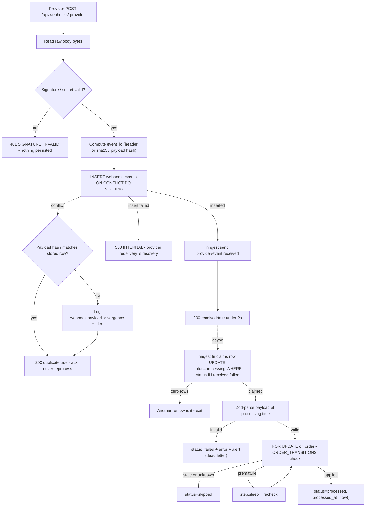
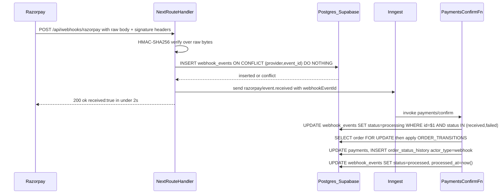
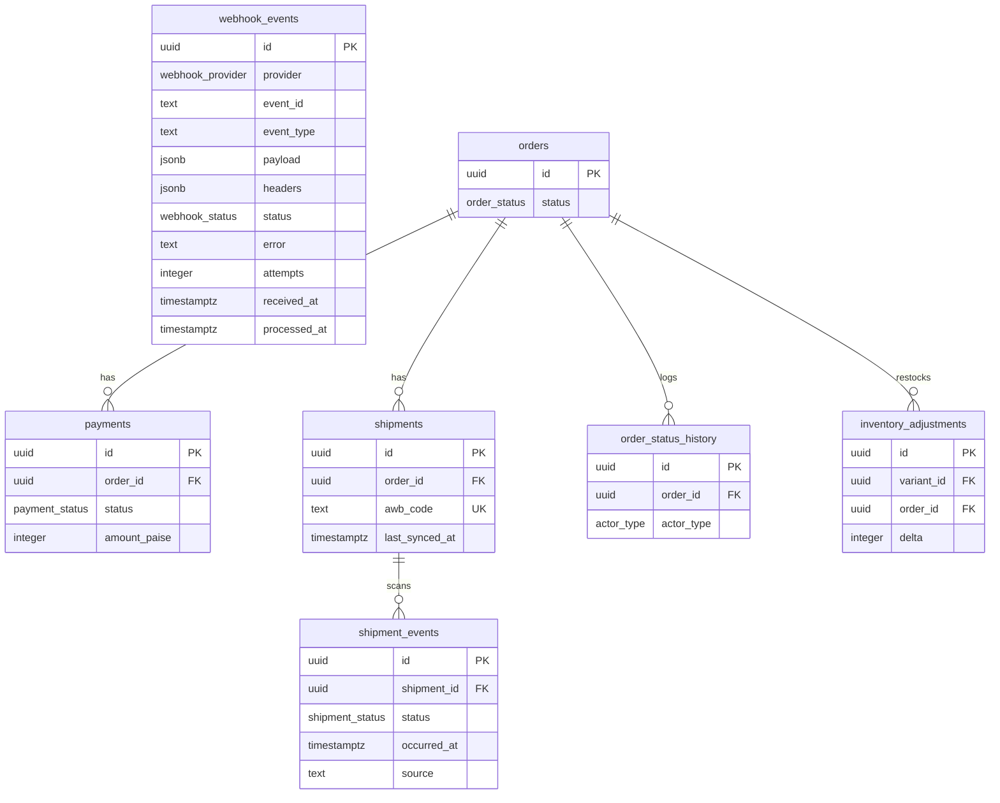
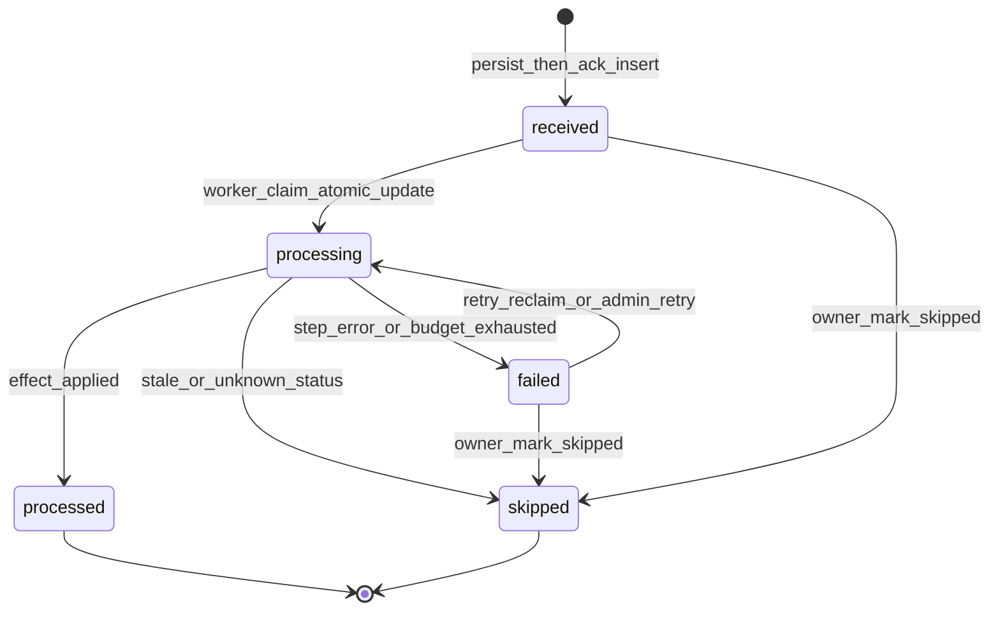

# Module Spec — Webhooks & Jobs Infrastructure (Phase 0)

> The async backbone of KAKOA: inbound webhook intake (Razorpay + Shiprocket), Inngest durable jobs, and the reconciliation crons that make the system *eventually correct even when every webhook is lost*. Webhooks are accelerators; **polling reconciliation is the primary correctness path** (PROJECT_PLAN §1). Everything here is idempotent by construction or it does not merge.
>
> Sources of truth: PROJECT_PLAN §3.0 Contract §§1.21, 2.6 and §3.2 (Module 11); docs/DATABASE_ERD.md §3.21. Owners: Dev B (infra), Dev C (Razorpay processors + payment crons), Dev D (Shiprocket processors + poller), Dev E second reviewer on all webhook handlers.

---

## 1. Field-Level Specification

This module has no customer-facing forms. Its "inputs" are webhook HTTP requests (headers + raw body) and two admin actions. Every field below is validated exactly as stated; webhook error responses use the standard `ApiErr` envelope.

### 1.1 `POST /api/webhooks/razorpay` — inbound request fields

| Field | Location | Type | Required | Max len | Validation rule (exact) | Failure → response |
|---|---|---|---|---|---|---|
| `x-razorpay-signature` | header | string | yes | 128 | Hex string `^[0-9a-f]{64}$`; must equal `HMAC-SHA256(rawBody, RAZORPAY_WEBHOOK_SECRET)` compared with `crypto.timingSafeEqual` over the **raw request bytes** — never a re-serialized body | 401 `SIGNATURE_INVALID` — body `message`: `"Webhook signature verification failed."` Nothing persisted. |
| `x-razorpay-event-id` | header | string | yes | 64 | Non-empty after `trim()`; `^evt_[A-Za-z0-9]{14,}$` OR any non-empty token (Razorpay format may evolve — accept non-empty, log if pattern miss). Missing/empty → treat as validation failure. | 401 `SIGNATURE_INVALID` — `message`: `"Webhook signature verification failed."` (deliberately indistinct; no oracle for attackers) |
| raw body | body | bytes | yes | 1 MB | Read via `await req.text()` **before** any JSON parse. `> 1_048_576` bytes → reject. Must JSON-parse *after* signature passes (parse failure after valid sig is impossible in practice; if it happens, persist anyway with `event_type = 'unknown'` and let the processor dead-letter it). | 400 `VALIDATION_ERROR` — `message`: `"Payload too large."` (size only; parse errors never 4xx post-signature) |
| `event` (payload) | body JSON | string | yes | 64 | One of the handled set `payment.captured`, `payment.failed`, `payment.authorized`, `refund.processed`, `refund.failed`, `order.paid` — unhandled types are still persisted and acked 200, then marked `skipped` by the processor. Stored verbatim into `event_type`. | never an HTTP error (ack-everything policy) |

### 1.2 `POST /api/webhooks/shiprocket` — inbound request fields

| Field | Location | Type | Required | Max len | Validation rule (exact) | Failure → response |
|---|---|---|---|---|---|---|
| `x-api-key` | header | string | yes | 128 | `crypto.timingSafeEqual` against `SHIPROCKET_WEBHOOK_SECRET` (shared secret configured in the SR panel). Length mismatch handled by hashing both sides first. | 401 `SIGNATURE_INVALID` — `message`: `"Webhook signature verification failed."` Nothing persisted. |
| raw body | body | bytes | yes | 1 MB | Same raw-read + size rule as Razorpay. | 400 `VALIDATION_ERROR` — `"Payload too large."` |
| `awb` | body JSON | string | yes* | 32 | `^[A-Za-z0-9-]{6,32}$` after trim. *Missing/empty → still persist + ack (edge case #12: unknown/absent AWB is an ops problem, not the provider's); `event_id` falls back to `sha256(entire raw body)` and processor marks `skipped` with `error = 'missing_awb'`. | never an HTTP error |
| `current_status` | body JSON | string | yes* | 64 | Non-empty after trim; uppercased for the status map. Unknown label → persisted, acked, processor marks `skipped` with `error = 'unknown_status:<label>'`, logs `tracking.unknown_status`. | never an HTTP error |
| `current_timestamp` | body JSON | string | yes* | 40 | Parseable as a date (`ISO 8601` or SR's `dd-mm-yyyy hh:mm` — both attempted); unparseable → use raw string verbatim in the hash (hash input is the *raw field string*, not the parsed date, so hashing never fails). | never an HTTP error |
| synthetic `event_id` | derived | string | — | 64 | `event_id = sha256(awb + '|' + current_status + '|' + current_timestamp)` — lowercase hex, exact ERD §3.21 formula, computed from raw payload field strings. | — |

### 1.3 Admin actions (webhook events view, PROJECT_PLAN §3.2.5)

| Field | Endpoint | Type | Required | Max len | Validation rule (exact) | Error message (user-facing) |
|---|---|---|---|---|---|---|
| `id` (path) | retry / skip | uuid | yes | 36 | `^[0-9a-f]{8}-[0-9a-f]{4}-[0-9a-f]{4}-[0-9a-f]{4}-[0-9a-f]{12}$`; row must exist | `"Webhook event not found."` (404 `NOT_FOUND`) |
| retry precondition | retry | — | — | — | Row `status` must be `'failed'` | `"Only failed events can be retried."` (409 `CONFLICT`) |
| `note` | skip | string | yes | 500 | `trim().length >= 10` — mandatory reason, written to `admin_audit_log` | `"A note of at least 10 characters is required to skip an event."` (400 `VALIDATION_ERROR`) |
| skip precondition | skip | — | — | — | Row `status IN ('received','failed')`; caller role = `owner` | `"Only pending or failed events can be skipped."` (409 `CONFLICT`) / `"Owner role required."` (403 `FORBIDDEN`) |

### 1.4 Environment configuration (zod-validated at boot by `packages/config`)

| Var | Rule | Boot failure behavior |
|---|---|---|
| `RAZORPAY_WEBHOOK_SECRET` | `z.string().min(16)` | process refuses to start |
| `SHIPROCKET_WEBHOOK_SECRET` | `z.string().min(16)` | process refuses to start |
| `INNGEST_SIGNING_KEY` / `INNGEST_EVENT_KEY` | `z.string().min(1)` | process refuses to start |
| `HEALTHCHECKS_PING_URL_*` (one per registered cron, 6 total) | `z.string().url()` | process refuses to start |
| `DATABASE_URL` | must point at Supabase transaction pooler **port 6543**; boot check asserts `prepare: false` in the postgres-js client (`packages/db/src/client.ts`) | process refuses to start with `"DATABASE_URL must use the transaction pooler (:6543) and prepare:false"` |

---

## 2. Workflow / User Flow

### 2.1 Persist-then-ack (Contract §2.6 — verbatim, nothing else runs inline)

1. Read the **raw** request body (no framework JSON parsing before the signature check).
2. Verify signature/secret. **Fail → 401 `SIGNATURE_INVALID`, nothing persisted.** Success → continue.
3. Compute `event_id`: Razorpay = `x-razorpay-event-id` header; Shiprocket = `sha256(awb|current_status|current_timestamp)` from the payload.
4. `INSERT INTO webhook_events ... ON CONFLICT (provider, event_id) DO NOTHING`. **Conflict → 200 `{ ok: true, data: { duplicate: true } }`** — ack, never reprocess. Before acking a conflict, compare `sha256(payload)` of the incoming body with the stored row; if it differs, log `webhook.payload_divergence` + alert (never overwrite the original).
5. `inngest.send('{provider}/event.received', { webhookEventId })`.
6. Return **200 `{ ok: true, data: { received: true } }`** — target **< 2s** (< 5s hard ceiling per launch gate), always before any business logic.
7. **500 only if the insert itself fails** (DB down) — provider retry is the recovery path. Processing errors live in Inngest (retries with backoff) and never surface to the provider.

### 2.2 Async processing (Inngest function, per event)

8. Function fires on `{provider}/event.received`; first step **claims the row**: `UPDATE webhook_events SET status='processing', attempts = attempts + 1 WHERE id = $1 AND status IN ('received','failed')`. Zero rows updated → another run owns it → exit cleanly.
9. Zod-parse `payload` **now** (processing time, not ack time). Parse failure → mark `failed`, set `error`, alert — dead-letter, no crash loop.
10. Apply business effect through the order state machine: `SELECT ... FOR UPDATE` on the order row, validate against `ORDER_TRANSITIONS` (Contract §1.27). Stale/out-of-order status → mark row `skipped` (success-shaped outcome, not an error). Premature event (e.g. `refund.processed` before `payment.captured`) → `step.sleep` + recheck, not failure.
11. Success → `status='processed'`, `processed_at = now()`. Retry budget exhausted → `onFailure` marks `failed` (terminal), alerts, and the nightly sweep is the backstop for the affected order.



---

## 3. System Design

### 3.1 Core sequence — Razorpay `payment.captured`



### 3.2 External service dependencies — exact behavior when down or timing out

| Dependency | Used for | When down / timing out |
|---|---|---|
| **Postgres (Supabase, Mumbai)** | the persist step; all processing | Insert fails → route returns **500 `INTERNAL`** with no half-writes; Razorpay redelivers (~24h window), Shiprocket redelivery is undocumented so the **Shiprocket poller (30 min) and nightly sweep are the recovery path**. This is the design, documented — never buffer in memory. |
| **Inngest** | async processing + all crons | `inngest.send` failure after a successful insert → still ack 200 (the row is persisted with `status='received'`); a **janitor sweep inside the stuck-payment cron re-emits events for any `webhook_events` row `status IN ('received','failed')` older than 10 min** via `webhook_events_pending_idx`. Cron scheduling down → healthchecks.io dead-man switches page within one missed cadence. |
| **Razorpay APIs** (Orders/Payments list) | stuck-payment sweep, nightly sweep | Timeout 10s per call; sweep logs `UPSTREAM_ERROR`, skips the run's remainder, does **not** ping its healthcheck (so a persistent outage pages), retries next cadence. Never marks orders failed on API outage. |
| **Shiprocket APIs** (`track/awb`, remittance report) | poller, COD remittance matcher | Batch with backoff on 429 (poller self-throttles ≤ 5 concurrent per Inngest cap); timeout 10s; failed batch items keep their `last_synced_at` watermark so the next run retries them; run without any success does not ping healthcheck. |
| **healthchecks.io** | dead-man switches | Ping is fire-and-forget with 3s timeout; ping failure logs a warning but never fails the job (monitoring must not break the monitored). |
| **MSG91 / Resend** | downstream job side effects (not called by this module's skeleton) | governed by the external-call registry: per-message dedupe key; failures retry inside their own Inngest step budget. |

### 3.3 Caching strategy

**None.** Webhook routes send `Cache-Control: no-store`; every request is a unique, signed, state-changing event — caching any part of intake or processing would violate the idempotency ledger's role as the single source of truth. Admin webhook views read live via `webhook_events_pending_idx` (small partial index; no cache needed).

---

## 4. Database Schema

Owned table — DDL verbatim from docs/DATABASE_ERD.md §3.21 (Contract §1.21). `webhook_events` deliberately has **no foreign keys** — webhooks are correlated to orders/shipments via payload lookup (`awb_code`, `provider_payment_id`), per ERD §2 note.

```sql
CREATE TYPE webhook_provider AS ENUM ('razorpay','shiprocket');
CREATE TYPE webhook_status   AS ENUM ('received','processing','processed','failed','skipped');

CREATE TABLE webhook_events (
  id           uuid PRIMARY KEY DEFAULT gen_random_uuid(),
  provider     webhook_provider NOT NULL,
  event_id     text NOT NULL,
  event_type   text NOT NULL,                 -- 'payment.captured' / SR status label
  payload      jsonb NOT NULL,                -- raw body, verbatim
  headers      jsonb,
  status       webhook_status NOT NULL DEFAULT 'received',
  error        text,
  attempts     integer NOT NULL DEFAULT 0,
  received_at  timestamptz NOT NULL DEFAULT now(),
  processed_at timestamptz,
  UNIQUE (provider, event_id)
);
CREATE INDEX webhook_events_pending_idx ON webhook_events (received_at)
  WHERE status IN ('received','failed');      -- partial: worker + ops dashboard only see unfinished
```

Tables **used** (owned by Payments/Fulfillment/Checkout modules, not reproduced here): `orders` (§1.14 — `orders_pending_expiry_idx` feeds the stuck-payment sweep), `payments` (§1.17 — `payments_cod_remit_idx` feeds the remittance matcher), `shipments` (§1.19 — `shipments_stale_poll_idx` feeds the poller), `shipment_events` (§1.20 — `UNIQUE (shipment_id, status, occurred_at)` natural-key dedupe), `order_status_history` (§1.16 — `actor_type = 'webhook' | 'system'`), `inventory_adjustments` (§1.22 — `inv_adj_once_per_cause_idx` makes restocks replay-proof).



*(`webhook_events` intentionally floats — correlation is by payload lookup, not FK.)*

---

## 5. API Design

All webhook routes are Route Handlers requiring the raw body; auth tier `webhook` (signature/shared secret only), exempt from session middleware, `Cache-Control: no-store`. Rate class: **unlimited, signature-gated, with a per-IP flood guard** (Contract §2.1).

### 5.1 `POST /api/webhooks/razorpay`

- **Auth:** HMAC SHA256 of raw body with `RAZORPAY_WEBHOOK_SECRET`, header `x-razorpay-signature`. Idempotency: `UNIQUE (provider, event_id)` with `event_id` = `x-razorpay-event-id` header.
- **Request:** Razorpay event JSON (raw). **Responses:**
  - `200` `{ ok: true, data: { received: true }, meta: { requestId } }` — persisted + emitted
  - `200` `{ ok: true, data: { duplicate: true }, meta: { requestId } }` — conflict on `(provider, event_id)`
- **Errors:**
  | Case | HTTP | Code |
  |---|---|---|
  | Signature invalid / header missing | 401 | `SIGNATURE_INVALID` |
  | Body > 1 MB | 400 | `VALIDATION_ERROR` |
  | `webhook_events` insert fails (DB down) | 500 | `INTERNAL` |
  | Flood guard tripped (per-IP) | 429 | `RATE_LIMITED` |

### 5.2 `POST /api/webhooks/shiprocket`

- **Auth:** shared secret header `x-api-key` (constant-time compare). Idempotency: synthetic `event_id = sha256(awb|current_status|current_timestamp)`.
- **Request:** SR tracking push JSON (raw). **Responses & errors:** identical shapes and table to §5.1.

### 5.3 `POST /api/webhooks/inngest`

- Inngest serve endpoint hosting all functions; signing-key verification and error handling framework-managed. Never called by our code or UI directly.

### 5.4 Admin surface (`/api/admin/*`, Class E — 600/min per admin session; every mutation writes `admin_audit_log`)

| Method + Route | Auth | Request → Response | Errors |
|---|---|---|---|
| `GET /api/admin/webhook-events` | `admin:staff` | `?provider=razorpay\|shiprocket&status=received\|processing\|processed\|failed\|skipped&page=1&pageSize=50` → `{ events: WebhookEventRow[] }` + `meta.total` (pending filter backed by `webhook_events_pending_idx`) | — |
| `GET /api/admin/webhook-events/[id]` | `admin:staff` | → `{ event }` incl. pretty `payload`, `error`, `attempts`, timestamps (IST display) | 404 `NOT_FOUND` |
| `POST /api/admin/webhook-events/[id]/retry` | `admin:staff` | `{}` → `{ event }` — re-emits `{provider}/event.received` for a `failed` row (safe: processors idempotent) | 404 `NOT_FOUND`; 409 `CONFLICT` (not `failed`) |
| `POST /api/admin/webhook-events/[id]/skip` | `admin:owner` | `{ note: string }` (≥ 10 chars) → `{ event }` — poison event marked `skipped`, note → `admin_audit_log` | 400 `VALIDATION_ERROR`; 403 `FORBIDDEN`; 404 `NOT_FOUND`; 409 `CONFLICT` |
| `GET /api/admin/jobs/health` | `admin:staff` | → `{ crons: { name, lastSuccessAt, overdue }[], inngestFailures24h, oldestPendingEventAgeSec }` — dashboard job-health strip | — |

### 5.5 Scheduled jobs (Inngest crons — no HTTP surface; owned actions)

| Cron | Cadence | Behavior (exact) | Dead-man switch |
|---|---|---|---|
| `reconcile/stuck-payments` | every 15–30 min | orders `pending_payment` > 45 min (scan `orders_pending_expiry_idx`, compare in-DB against `now()`) → poll Razorpay Orders API (`receipt` = our idempotency key); captured ⇒ idempotent `confirmPayment` (same path as webhook, `FOR UPDATE`); unpaid past expiry ⇒ `cancelled` + restock via `inv_adj_once_per_cause_idx`; orphan captured payments with no matching order ⇒ alert. Also re-emits Inngest events for `webhook_events` rows pending > 10 min. | yes |
| `shipping/poll-tracking` | every 30 min | scan `shipments_stale_poll_idx` for active shipments with `last_synced_at > 6h`; poll SR `track/awb` batched with backoff on 429; upsert `shipment_events` (`source='poll'`, natural-key dedupe); drive monotonic order transitions; update `last_synced_at` watermark | yes |
| `reconcile/nightly` | daily 02:00 IST | full Razorpay payments-list vs orders diff (orphans, `amount_paise` mismatches, stuck states) + full SR re-sync of non-terminal shipments; findings deduped by `(order_id, anomaly_type)` open/resolved; only flags anomalies older than 2× sweep interval; alerts on NEW findings only | yes |
| `reconcile/cod-remittance` | daily | match SR COD remittance report lines (AWB → order) → payments `cod_collected → cod_pending_remittance → cod_remitted` with `cod_remittance_ref` (scan `payments_cod_remit_idx`); `delivered + 14d` unremitted ⇒ `cod_remittance_overdue` alert | yes |
| `ops/housekeeping` | nightly | purge expired `otp_challenges`; mark abandoned carts (`carts_abandoned_sweep_idx`); orphan-image GC | yes |
| `shipping/token-refresh` | per SR token TTL | refresh Shiprocket auth token (owned by Fulfillment; switch registered here) | yes |

**Inngest function conventions (enforced at review):** one function per event type/cron, named `{domain}/{verb}` (`payments/confirm`, `shipping/poll-tracking`, `reconcile/stuck-payments`); first step claims the `webhook_events` row atomically; any external API call is a **single `step.run` whose output persists the external ID**, preceded by an existence check keyed by our idempotency key; step outputs zod-validated on read; `onFailure` marks rows `failed` terminal + alerts. **Concurrency caps:** Shiprocket-calling functions ≤ 5 concurrent (their rate limits); Razorpay processors ≤ 10; per-provider caps in Inngest config, queueing absorbs bursts. **Idempotent external-call registry:** `packages/jobs/EXTERNAL_CALLS.md` lists every outbound call and its idempotency mechanism — Razorpay order create → `receipt = idempotencyKey`; refund create → our refund id; Shiprocket order create → our order number as channel reference; SMS/email → per-message dedupe key — reviewed on every PR that adds an external call.

---

## 6. Security Standards

- **Rate limits (Contract §2.1):** webhook routes = unlimited class, signature-gated, with a per-IP flood guard (burst ceiling 1000/min/IP → 429 `RATE_LIMITED`; Razorpay source-IP allowlist optional in prod). Admin views/actions = **Class E, 600/min per admin session**. Poller self-throttles against Shiprocket limits (batch + backoff on 429). Rate-limited responses carry `X-RateLimit-Limit`, `X-RateLimit-Remaining`, `X-RateLimit-Reset`, and 429 adds `Retry-After`.
- **Input handling:** signature verified over **raw bytes before any parse** (re-serialized JSON must fail verification — tested); constant-time comparisons for both providers; payloads stored verbatim as jsonb and **zod-parsed only at processing time** so malformed-but-signed events dead-letter instead of crash-looping; admin `note` sanitized (plain text, length-capped 500); all DB access via Drizzle bind parameters — no interpolation.
- **Authz:** webhook routes exempt from session middleware, signature-only, `Cache-Control: no-store`; Inngest serve endpoint verifies the signing key; admin: view/retry = `staff`, skip (money-adjacent poison handling) = `owner`; every admin action writes `admin_audit_log`.
- **Encryption at rest:** Supabase disk encryption suffices; webhook payloads contain customer name/phone/address fragments (PII) — no additional column crypto, but payload access is admin-gated and payloads are excluded from log output.
- **NEVER logged:** webhook secrets, `x-razorpay-signature` values, Inngest keys, full payload bodies (log `{provider, event_id, event_type, outcome, processing_lag_ms}` only), card data (never present — Razorpay tokenizes), customer phone/email from payloads.
- **OWASP risks specific to this module:**
  | Risk | Mitigation |
  |---|---|
  | Forged webhooks (A07 auth failures) | HMAC over raw body / shared secret, constant-time compare, 401 with no persistence, signature-failure spike alert (> 10/hour = attack or secret-rotation mismatch) |
  | Replay attacks | `UNIQUE (provider, event_id)` dedupe gate; duplicates acked but never reprocessed; payload-divergence alert catches tampered replays |
  | DoS via webhook flood (A04) | per-IP flood guard; persist-then-ack keeps handler O(1); Inngest concurrency caps + queueing; transaction pooler absorbs fan-out |
  | SSRF/injection via payload (A03) | payload treated as data only — never used to build URLs or queries directly; AWB/status values validated before correlation lookups |
  | Secret leakage (A02) | secrets only in env (zod-validated), never in code, logs, or `headers` jsonb (signature headers are redacted before persist) |

---

## 7. Edge Cases

(From risk-engineering Module 11; numbering preserved.)

1. **Persist-then-ack violated by slow persist.** Razorpay expects fast 2xx; a slow `webhook_events` insert ⇒ timeout ⇒ redelivery storm. Handler does exactly: verify sig (raw body) → single INSERT → 200 → Inngest emit. Nothing else inline. Postgres down ⇒ return 500 and *rely* on redelivery — that's the design, documented.
2. **Duplicate event, different payload bytes.** Same `(provider, event_id)`, differing payloads (provider bug or tampering that passed sig on both). UNIQUE gate keeps the first; on conflict with differing payload hash, log `webhook.payload_divergence` + alert — never overwrite the original.
3. **Inngest retry re-fires an external side effect.** Any step calling an external API must be a single `step.run` persisting the external ID, preceded by an existence check keyed by our idempotency key; `packages/jobs/EXTERNAL_CALLS.md` is reviewed at PR time.
4. **Poison event / permanent failure.** Malformed-but-signed event crashes its processor every retry. Retry budget exhausts → `onFailure` marks the row `failed` terminal, alerts; the nightly sweep is the backstop for the affected order. No infinite crash loops, no lost money-truth.
5. **Ordering hazards.** `refund.processed` processed before `payment.captured` (async fan-out, no ordering guarantee). Processors are order-independent: each reads current order state and applies the monotonic state machine; premature events park via `step.sleep` + recheck, not failure.
6. **Sweep and webhook race on the same order.** Both funnel through the same idempotent `confirmPayment` with `SELECT ... FOR UPDATE` on the order — single winner, no double transition, no deadlock (lock ordering: **order → payment**, always).
7. **Cron didn't run — the silent killer.** Deploy broke the schedule or Inngest misconfig. Every scheduled job pings healthchecks.io on completion; missed ping = page. **Absence of success, not presence of failure, is the alert condition.**
8. **Reconciliation self-noise.** Nightly job flags orders the sweep is mid-fixing. Only flag anomalies older than 2× sweep interval; dedupe findings by `(order_id, anomaly_type)` with open/resolved state; alert on NEW findings only.
9. **Clock skew across Vercel/Inngest/DB.** Every "is it expired/stuck" comparison uses DB `now()` or stored timestamps compared in-DB — never mixed wall-clocks (OTP expiry, stock holds, token expiry all inherit this rule).
10. **Deploy racing in-flight jobs.** Vercel swaps code mid-multi-step run; step 3 runs new code against step-1 output shape. Step outputs are zod-validated on read; breaking payload changes ship as a new function version while the old one drains.
11. **Event storm backpressure.** Flash-sale burst: thousands of webhooks + jobs. Per-function Inngest concurrency caps (Shiprocket ≤ 5 concurrent) with queueing; the Supabase transaction-mode pooler (port 6543, `prepare: false`) absorbs Vercel + Inngest serverless fan-out — this WILL bite at the first traffic spike if unconfigured.
12. **Unknown-AWB tracking event.** Persist to `webhook_events`, ack 200, log `tracking.unknown_awb`, alert > 5/day — never 500 (a 500 trains undocumented Shiprocket retry behavior we can't reason about).

---

## 8. State Machine

`webhook_status` enum (ERD §1.0): `received → processing → processed | failed | skipped`.

| From | To | Trigger |
|---|---|---|
| *(new row)* | `received` | persist-then-ack INSERT (default) |
| `received` | `processing` | Inngest fn claim: `UPDATE ... SET status='processing' WHERE id=$1 AND status IN ('received','failed')` (zero rows = someone else owns it) |
| `received` | `skipped` | owner "mark skipped" (poison, mandatory note → `admin_audit_log`) |
| `processing` | `processed` | business effect applied (or no-op duplicate effect confirmed); sets `processed_at = now()` |
| `processing` | `skipped` | stale/unknown status vs the monotonic state machine — success-shaped, never errored |
| `processing` | `failed` | step error with retries remaining (row released for re-claim) **or** retry budget exhausted → `onFailure` marks terminal + alerts |
| `failed` | `processing` | Inngest retry re-claim, or admin **retry** re-emitting the event (staff; safe — processors idempotent) |
| `failed` | `skipped` | owner "mark skipped" with note |
| `processed`, `skipped` | — | terminal; no transitions out |



---

## 9. Testing Requirements

### Unit (`packages/core` / `packages/jobs`)

- Signature verification as a shared util with per-provider fixtures: known key/body/signature positive case **plus** mutated-raw-body negatives — whitespace-shifted and re-serialized JSON **must fail**.
- Shiprocket synthetic `event_id` derivation: `sha256(awb|current_status|current_timestamp)` — fixture vectors incl. missing-awb fallback (`sha256(raw body)`).
- Dedup decision incl. the payload-hash-divergence branch (same key + different bytes → keep original, emit divergence log).
- Reconciliation anomaly matchers as pure functions: given payments list + orders list → expected findings; table-driven fixtures for orphans, `amount_paise` mismatches, stuck orders, remittance-overdue.
- `packages/config` env schema: each missing/invalid var fails boot.

### Integration (ephemeral Postgres + webhook replay fixtures, on every PR)

- Persist-then-ack handler latency **< 1s p99** in test.
- Duplicate insert conflict → 200 `duplicate:true`, exactly one state change.
- Poison event exhausts retries → `failed` terminal + nightly backstop finds the affected order.
- **Sweep vs. webhook concurrency test:** both fire on one order; `FOR UPDATE` yields exactly one transition.
- DB-down handler returns 5xx cleanly with no half-writes.
- Worker claim UPDATE excludes rows already `processing`.
- `shipment_events` natural-key dedupe: webhook + poll overlap inserts once.

### E2E (named scenarios)

1. **Late-webhook resilience:** complete a Razorpay test payment with webhook delivery disabled to the preview; assert the stuck-payment sweep confirms the order within one interval; re-enable and replay the webhook; assert no-op (`duplicate:true`, no second transition).
2. **Job failure visibility:** force a Shiprocket-push failure (mock 500 × past retry budget); assert Inngest shows the failure, the alert fires, and the order appears in the admin exceptions queue.
3. **Dead-man check:** deploy with a cron disabled in a test env; assert the healthchecks.io alert path fires (scripted staging drill — also run during the Week 10 bake).

---

## 10. Definition of Done

- [ ] Persist-then-ack skeleton shared across both providers, exact Contract §2.6 flow, ack measured < 2s (< 5s hard ceiling per launch gate)
- [ ] Dedup via `UNIQUE (provider, event_id)` + payload-divergence detection with alert
- [ ] Order-independent processors; all transitions through `ORDER_TRANSITIONS` with `FOR UPDATE` — convergence proven by the sweep-vs-webhook concurrency test
- [ ] All five crons live: stuck-payment sweep (15–30 min), Shiprocket poller (30 min), nightly full sweep, COD remittance matcher, housekeeping
- [ ] healthchecks.io dead-man switch registered for every cron (incl. Shiprocket token refresh — 6 total); one deliberately tripped as a staging drill
- [ ] DB pooling configured for serverless — Supabase transaction-mode pooler port 6543, Drizzle + postgres-js `prepare: false`, boot-asserted — and load-smoked in Phase 3
- [ ] External-call idempotency registry (`packages/jobs/EXTERNAL_CALLS.md`) exists, complete, and enforced in review
- [ ] Poison-event dead-letter path (`failed` terminal + alert) + admin retry (staff) / skip-with-note (owner) UI live, all actions in `admin_audit_log`
- [ ] Payload zod-parsing at processing time (never ack time); Inngest step outputs schema'd; env vars zod-validated at boot
- [ ] Logging per event `{provider, event_id, type, outcome, processing_lag_ms}` and per run `{function, run_id, step, duration, outcome}`; `request_id` propagated into Inngest events; no secrets, card data, or raw PII in logs
- [ ] Alerts wired: signature-failure spike (> 10/hour), processing lag p95 > 10 min, ANY terminal `failed` row (page-level), Inngest failure rate, `webhook.payload_divergence`, unknown-AWB spike (> 5/day), healthchecks.io misses, orphan payment, COD remittance overdue
- [ ] Missed-webhook reconciliation drill passes in the Week 10 staging bake (launch gate §2.5 gate 4)
- [ ] The 3 named E2E scenarios green in CI
