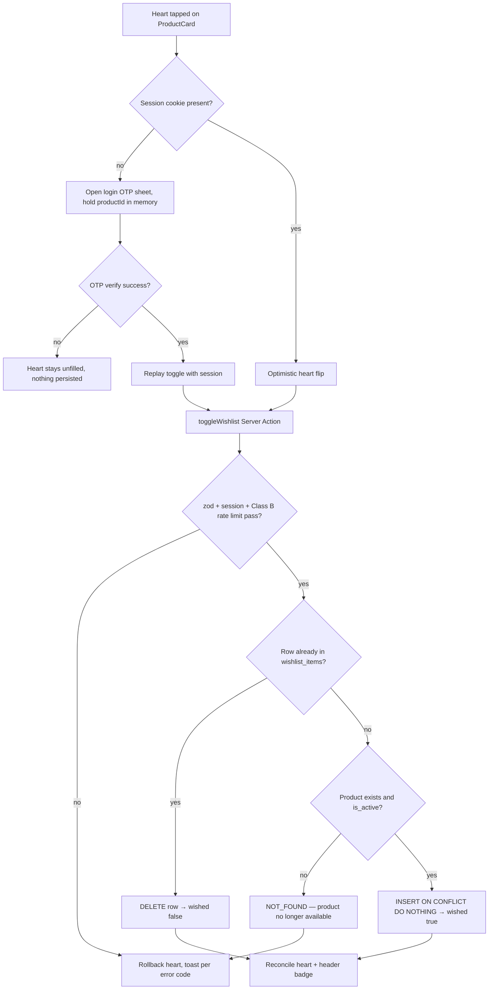
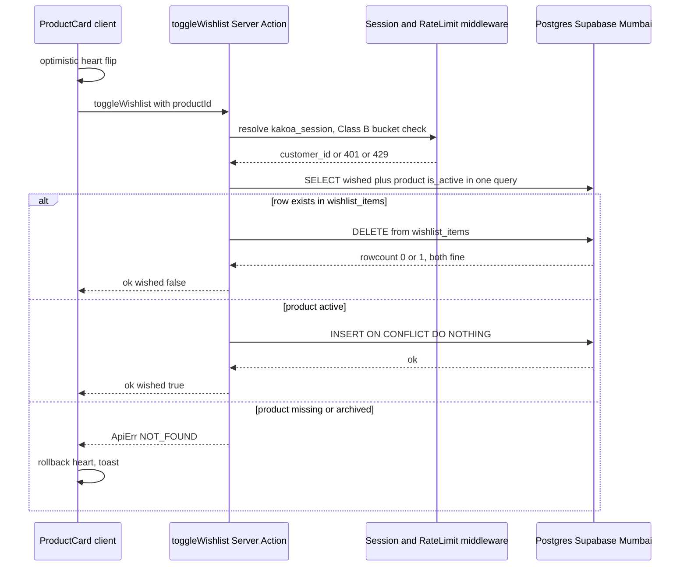
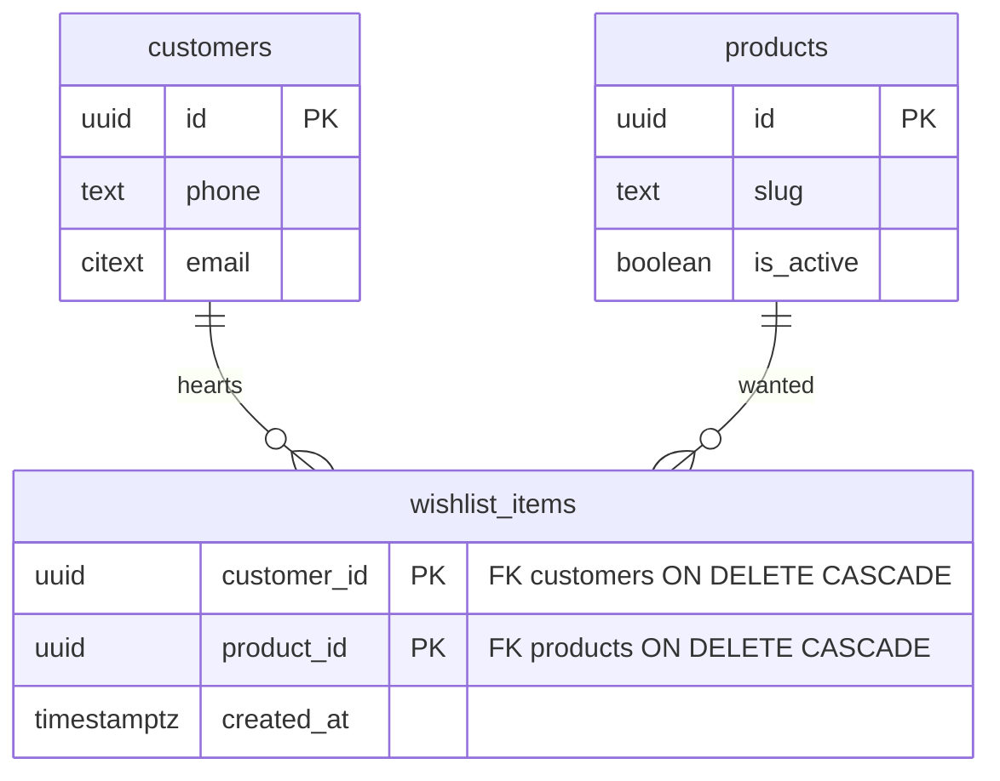

# Module Spec — Wishlist (Phase 2)

> **Source of truth:** PROJECT_PLAN.md §3.0 (Contract v1.0.0), §3.5 (Customer Auth & Accounts — wishlist backend), docs/DATABASE_ERD.md §3.24, risk-engineering.md Module 7 (#10). Owner: **Dev B** (backend), **Dev A** (wishlist/account UI). Phase 2 (W6–8); `/account/wishlist` page is cuttable per §2.5, backend is not.
>
> Scope: product-level hearts (matches prototype). One table (`wishlist_items`, composite PK = idempotent double-tap), one Server Action (`toggleWishlist`), one Route Handler (`GET /api/account/wishlist`). Guests get a login prompt on heart-tap — **no anonymous wishlist persistence in v1**. Back-in-stock notification is designed-in as a hook (the data to drive it exists); the notify feature itself is deferred.

---

## 1. Field-Level Specification

The module has exactly one client-supplied input field.

| Field | Where | Type | Required | Max length | Format | Validation rule | User-facing error message |
|---|---|---|---|---|---|---|---|
| `productId` | `toggleWishlist({ productId })` Server Action | `string` (uuid) | Yes | 36 | UUID v4 | zod: `z.object({ productId: z.string().uuid() }).strict()` — regex equivalent `^[0-9a-f]{8}-[0-9a-f]{4}-4[0-9a-f]{3}-[89ab][0-9a-f]{3}-[0-9a-f]{12}$` (case-insensitive). Unknown keys rejected by `.strict()`. | "Something went wrong — please refresh and try again." (a malformed UUID is never user-typed; it indicates a client bug or tampering → generic message, `VALIDATION_ERROR` under the hood) |

Server-side derived values (never client-supplied — any client attempt to pass these is rejected by `.strict()`):

| Value | Source | Rule | Failure behavior |
|---|---|---|---|
| `customer_id` | `kakoa_session` httpOnly cookie → `customer_sessions` lookup (`revoked_at IS NULL AND expires_at > now()`) | Must resolve to an active session | 401 `UNAUTHORIZED` — UI shows the login/OTP sheet with message "Log in to save items to your wishlist" |
| product existence | `products` row for `productId` | Row must exist. **On add:** `is_active = true` required — hearting an archived product returns `NOT_FOUND` with message "This product is no longer available." **On remove (row already in wishlist):** allowed regardless of `is_active`, so customers can always un-heart archived items. | `NOT_FOUND` |

Validation order (fail-fast): 1) zod shape → `VALIDATION_ERROR`; 2) session → `UNAUTHORIZED`; 3) rate limit (Class B) → `RATE_LIMITED`; 4) product lookup → `NOT_FOUND`; 5) toggle.

`GET /api/account/wishlist` takes **no** query parameters in v1 (wishlists are small; no pagination — hard-capped read of 200 rows ordered by `created_at DESC`, documented below).

---

## 2. Workflow / User Flow

### Toggle (heart tap)

1. Customer taps the heart on a `ProductCard` (Shop grid, PDP, search results) or in `/account/wishlist`.
2. **Guest branch:** no `kakoa_session` cookie client-side → the login/OTP sheet opens with the message "Log in to save items to your wishlist"; the intended `productId` is held in client memory and the toggle is replayed after successful OTP verify. Nothing is persisted anonymously. (Server enforces the same: action without a session → 401.)
3. **Logged-in branch:** UI flips the heart **optimistically** and fires `toggleWishlist({ productId })`.
4. Server validates (order per §1), then in one statement decides add vs remove:
   - Not in wishlist + product active → `INSERT ... ON CONFLICT (customer_id, product_id) DO NOTHING` → `{ wished: true }`.
   - Already in wishlist → `DELETE WHERE customer_id = $1 AND product_id = $2` → `{ wished: false }`.
5. **Success:** response `{ ok: true, data: { wished } }`; UI reconciles heart state to `wished` (normally a no-op), header wishlist-count badge updates.
6. **Failure:** `ApiErr` → optimistic heart rolls back; toast per error code (`NOT_FOUND` → "This product is no longer available."; `RATE_LIMITED` → "Too many requests — slow down a moment."; `INTERNAL` → "Couldn't update your wishlist — try again.").
7. **Double-tap:** two rapid taps produce two actions; composite PK + `ON CONFLICT DO NOTHING` + idempotent DELETE guarantee the end state matches the last tap and no duplicate row ever exists.

### View wishlist

1. Customer opens `/account` → wishlist tab (`/account/wishlist`). Server component calls `GET /api/account/wishlist` semantics (session-scoped query).
2. **Empty:** heart illustration + "Browse the shop" CTA.
3. **Non-empty:** `ProductCard` grid, newest hearts first. Active products render normally with price and add-to-cart. **Archived products (`is_active = false`) are included**, greyed, labeled "No longer available", heart still removable, add-to-cart hidden — never omitted, never a 500 (Risk M7 #10).
4. **All variants of a product out of stock:** card renders with "Out of stock" state and exposes the back-in-stock hook point (§3) — v1 shows no notify button.



---

## 3. System Design



**External service dependencies:** none. This module talks only to Postgres. No Razorpay, Shiprocket, MSG91, Resend, or Inngest calls in v1. If **Postgres** is down or times out (>5s statement timeout): the action returns `ApiErr INTERNAL`, the optimistic heart rolls back, and the wishlist page renders its inline-retry error state (never a blank page). The dependency on the **auth module** (session resolution) is in-process — if session lookup fails the request is treated as 401, indistinguishable from logged-out.

**Back-in-stock hook (designed-in, notify deferred):** `wishlist_items(product_id)` — served by the reverse-lookup index below — is the canonical "who wants this" set. When Inventory (Module §3.3) flips a product's aggregate availability from 0 to >0, it emits the Inngest event `catalog/product.back_in_stock { productId }` (that emission ships with inventory in Phase 2). The deferred notify feature is a future Inngest function subscribing to that event and joining `wishlist_items → customers` for channel/consent. **v1 ships the index and the event name reservation only** — no consumer, no UI opt-in.

**Caching:** none, by design. Wishlist reads are per-customer, low-QPS, dynamic-rendered (`/account/*` is dynamic per §5 route table); a query on a ≤200-row PK-indexed set is cheaper than cache invalidation on every toggle. Header wishlist count is client state hydrated from the same query, refreshed on navigation — no separate cache. Catalog `Cache-Control: s-maxage=60` does **not** apply to `/api/account/wishlist` (auth-tier `customer`; response sent with `Cache-Control: private, no-store`).

---

## 4. Database Schema

Verbatim from docs/DATABASE_ERD.md §3.24 / Contract §1.24 — do not alter:

```sql
CREATE TABLE wishlist_items (
  customer_id uuid NOT NULL REFERENCES customers(id) ON DELETE CASCADE,
  product_id  uuid NOT NULL REFERENCES products(id) ON DELETE CASCADE,
  created_at  timestamptz NOT NULL DEFAULT now(),
  PRIMARY KEY (customer_id, product_id)
);
```

Notes (all from the Contract — none invented):

- **Product-level**, not variant-level — matches the prototype's hearts. No surrogate `id`; the composite PK **is** the idempotency mechanism (double-tap cannot create duplicates by construction).
- `ON DELETE CASCADE` both ways: deleting a customer (rare, support-driven) or hard-deleting a product removes hearts silently. Catalog products are **soft-deleted** (`is_active = false`) in normal operation, so cascade on `product_id` fires only in genuine data-repair scenarios; archived products intentionally remain in wishlists for the "no longer available" rendering.
- `wishlist_items` is one of the four tables where hard deletes are permitted (Contract conventions: `cart_items`, `wishlist_items`, `customer_addresses`, expired `otp_challenges`). Un-hearting is a plain `DELETE`.
- The composite PK gives the `(customer_id, …)` read path for free. The back-in-stock reverse lookup adds one module-owned index (a migration in this module, not a Contract change — it is an index, not a column):

```sql
CREATE INDEX wishlist_items_product_idx ON wishlist_items (product_id);
```

- Timestamps `timestamptz` UTC; any admin-facing display uses `formatIST()`.



---

## 5. API Design

### 5.1 `toggleWishlist` — Server Action

Per the Contract rule, first-party session-bound UI mutations are Server Actions. Returns `ApiResult`, never throws for expected failures.

- **Auth tier:** `customer` (httpOnly cookie `kakoa_session`).
- **Rate class:** **B** — 60/min per session. Headers `X-RateLimit-Limit`, `X-RateLimit-Remaining`, `X-RateLimit-Reset`; on limit, `Retry-After` + code `RATE_LIMITED`.
- **Request:** `{ productId: string /* uuid */ }` — zod `.strict()`.
- **Response (success):** `{ ok: true, data: { wished: boolean }, meta: { requestId } }` — `wished` is the **post-toggle** state.
- **Idempotency:** structural. Add = `INSERT ... ON CONFLICT (customer_id, product_id) DO NOTHING`; remove = `DELETE` (rowcount 0 is success). Replaying either request converges to the same row state. No idempotency key needed.

| Error case | Code (registry) | HTTP-equivalent | When |
|---|---|---|---|
| Malformed/missing `productId`, unknown keys | `VALIDATION_ERROR` | 400 | zod parse fails |
| No/expired/revoked session | `UNAUTHORIZED` | 401 | session lookup miss |
| Class B bucket exhausted | `RATE_LIMITED` | 429 | >60 mutations/min/session |
| Product does not exist, or `is_active = false` **on add** | `NOT_FOUND` | 404 | never leaks archived-vs-nonexistent distinction |
| DB failure/timeout | `INTERNAL` | 500 | generic message, `requestId` for support |

### 5.2 `GET /api/account/wishlist` — Route Handler

- **Auth tier:** `customer`.
- **Rate class:** none beyond global (per §3.5 API table — authenticated dynamic read, not class A/B).
- **Request:** no params, no body. Query: session's `customer_id` join `wishlist_items → products` (+ variant price range/stock aggregate for the card), `ORDER BY wishlist_items.created_at DESC LIMIT 200`.
- **Response:** `{ ok: true, data: { items: ProductCard[] }, meta: { requestId } }` — `ProductCard` is the shared catalog card contract (`packages/core/src/contracts/catalog.ts`): slug, name, hero image, price range in `*_paise` integers, availability flags, plus wishlist-specific `wishedAt` (ISO-8601 UTC) and `isAvailable: boolean` (false when `is_active = false` **or** every variant is out of stock — drives the greyed "No longer available" / "Out of stock" render).
- **Archived products are included** with `isAvailable: false` — the API never filters them out (Risk M7 #10).
- **Cache headers:** `Cache-Control: private, no-store`.

| Error case | Status | Code |
|---|---|---|
| No/expired session | 401 | `UNAUTHORIZED` |
| DB failure | 500 | `INTERNAL` |

Empty wishlist is `200` with `items: []` — not an error.

### 5.3 Explicit non-endpoints (v1)

- No `POST /api/wishlist` for guests — heart-tap on a guest session is a pure client-side login prompt; no anonymous persistence, no cookie-scoped wishlist, no merge-on-login machinery (unlike the cart). The E2E "guest hearts 2 products → logs in → wishlist retained" scenario works because the hearts are replayed **after** login (client holds pending `productId`s), not because a guest wishlist was stored.
- No back-in-stock subscribe endpoint — deferred; hook is the event + index only.
- No bulk clear, no move-to-cart action (add-to-cart from the card is the existing cart module action).

---

## 6. Security Standards

- **Rate limits:** Class **B — 60/min per session** on `toggleWishlist` (shared bucket with cart/address/review mutations per the Contract). Standard `X-RateLimit-*` headers; 429 → `Retry-After` + `RATE_LIMITED`. GET endpoint uncapped beyond platform defaults (cheap, authenticated, PK-indexed).
- **Input sanitization:** single UUID input through zod `.strict()`; Drizzle parameterized queries throughout — no string interpolation, SQLi surface is nil. No customer-authored text enters this module. Product names rendered on wishlist cards are catalog-owned but still output-encoded by React by default (defense in depth against a catalog-side stored-XSS reaching the account area).
- **Authorization:** every query is scoped by the session's `customer_id` — `customer_id` is **never** accepted from the client. Forged-ID negative test mandatory (per §3.5 integration checklist): a request crafted with another customer's product associations must be impossible by construction (there is no ID parameter that references another customer's row; the composite key's customer half always comes from the session).
- **IDOR surface:** minimal — `productId` is public catalog data, so "guessing" product UUIDs reveals nothing. The `NOT_FOUND` response is identical for nonexistent and archived products (no catalog-state oracle for unpublished products).
- **Encryption at rest:** Supabase default disk encryption suffices; `wishlist_items` holds no PII beyond the customer↔product association. No additional column encryption.
- **Never log:** raw session tokens (only hashes exist anywhere per Contract), customer phone/email (this module never touches them — keep it that way). Structured log line: `wishlist.toggled { customer_id, product_id, wished, requestId }` — customer UUID is fine, identifiers are not.
- **OWASP mapping:** A01 Broken Access Control → session-derived `customer_id` only + forged-ID negative tests; A03 Injection → zod + Drizzle parameterization; A04 Insecure Design → idempotency via composite PK removes duplicate-row and race classes entirely; A07 Auth Failures → delegated wholly to the session module (revocable opaque tokens, not JWT-only). CSRF: Server Actions are protected by Next.js's origin checking + `SameSite=Lax` cookie.

---

## 7. Edge Cases

1. **Double-tap heart (rapid toggle).** Two in-flight `toggleWishlist` calls for the same product: composite PK + `ON CONFLICT DO NOTHING` / idempotent DELETE guarantee no duplicate row and a deterministic final state; UI reconciles to the last response's `wished`. (Risk M7 #10, §3.5 idempotency note.)
2. **Product archived while in wishlist.** `is_active` flips false after hearting: `GET /api/account/wishlist` still returns it with `isAvailable: false`; card renders greyed "No longer available" — never vanishes, never 500s. Un-hearting it still works (remove path skips the `is_active` check). E2E scenario #3 in §3.5 covers this end to end.
3. **Hearting an archived or nonexistent product directly** (stale tab, crafted request): add path returns `NOT_FOUND` "This product is no longer available." — identical body for both cases, no existence oracle.
4. **Guest taps a heart.** No session → login/OTP sheet, `productId` held client-side, toggle replayed post-verify. A page refresh before login loses the pending heart — accepted v1 behavior (no anonymous persistence), documented so support isn't surprised.
5. **Product hard-deleted (data repair) while hearted.** FK `ON DELETE CASCADE` removes the wishlist row; the next GET simply omits it. No orphan, no error.
6. **Customer account deleted.** `ON DELETE CASCADE` on `customer_id` purges all hearts atomically with the customer row — no cleanup job needed.
7. **Optimistic UI vs server rejection.** Heart flips instantly; on `ApiErr` (rate limit, archived product, 500) it rolls back with a toast — asserted in component tests so a failed toggle can never leave a phantom filled heart.
8. **All variants out of stock (product still active).** Card shows "Out of stock" (distinct from archived), add-to-cart disabled, heart active. This is the back-in-stock hook's trigger condition — the state must be distinguishable in `ProductCard` data (`isAvailable: false` + `is_active: true` upstream) even before notify ships.
9. **Wishlist grows unbounded.** Read is `LIMIT 200` newest-first; the toggle path enforces no cap in v1 (hearting is Class-B-limited to 60/min anyway). If a customer exceeds 200, oldest hearts stop rendering — logged as a known v1 constraint; no data loss (rows remain).
10. **Session expires mid-browse.** Toggle returns `UNAUTHORIZED` → optimistic rollback + login sheet (same path as guest), with the pending-replay behavior; no partial writes possible since the action is a single statement.
11. **Same customer, two devices.** Device A hearts, device B un-hearts: last write wins per row; no lost-update hazard because the operations are absolute (insert/delete), not read-modify-write.
12. **Forged access attempt.** There is no route that takes a wishlist row identifier, so cross-customer access requires forging the session itself — covered by the auth module; the §3.5 forged-user-ID checklist test still runs against `GET /api/account/wishlist` (returns only the session customer's rows, 401 without session).

---

## 8. State Machine

**Not applicable.** A wishlist entry is binary — the row exists (wished) or it doesn't (not wished); there are no intermediate states, no lifecycle, and no transitions beyond insert/delete, so a state machine would add nothing (the composite PK already makes both operations idempotent).

---

## 9. Testing Requirements

**Unit (`packages/core` / action logic):**
- zod schema: valid UUID passes; malformed UUID, empty string, missing key, extra keys (`.strict()`) all → `VALIDATION_ERROR`.
- Toggle decision logic: (row exists → delete → `wished:false`), (no row + active product → insert → `wished:true`), (no row + archived → `NOT_FOUND`), (row exists + archived → delete succeeds).
- `ProductCard.isAvailable` derivation: archived → false; active + all variants out of stock → false; active + any stock → true.

**Integration (ephemeral Postgres, migrations applied):**
- Composite-PK idempotency: two concurrent adds for the same `(customer_id, product_id)` → exactly one row, both calls return `ok`.
- Concurrent add + remove → final state deterministic, no error, no duplicate.
- Archived product: seeded `is_active=false` product in wishlist → GET returns it with `isAvailable:false`; direct add on it → `NOT_FOUND`; remove on it → succeeds.
- Cascade: delete product row → wishlist row gone; delete customer → all their rows gone.
- Authz: request without session → 401; session A never sees session B's rows (forged-ID checklist item per §3.5).
- Class B rate limit: 61st mutation in a minute → `RATE_LIMITED` with `Retry-After`.
- Ordering + cap: 201 seeded rows → GET returns 200 newest by `created_at DESC`.

**E2E (Playwright, named):**
1. **Wishlist persistence with archival** (§3.5 scenario #3, verbatim): guest hearts 2 products → logs in via OTP (test-mode fixed code) → wishlist shows both → admin archives one product → wishlist shows it as "No longer available" without error; the archived card's heart still removes it.
2. **Guest heart prompts login:** logged-out user taps a heart on the Shop grid → login sheet opens → completes OTP → heart is filled and the product appears in `/account/wishlist`; a second tap removes it and the header badge decrements.
3. **Optimistic rollback:** with the network intercepted to force a 500 on `toggleWishlist`, tapping a heart flips it, then rolls back with an error toast — no phantom wishlist entry on reload.

---

## 10. Definition of Done

- [ ] `wishlist_items` migration applied exactly as Contract §1.24 (composite PK, both CASCADEs) + `wishlist_items_product_idx` reverse-lookup index for the back-in-stock hook
- [ ] `toggleWishlist` Server Action: zod `.strict()` validation, session-derived `customer_id`, `ON CONFLICT DO NOTHING` add / idempotent delete, returns `ApiResult<{ wished: boolean }>` — never throws for expected failures
- [ ] Archived-product rules enforced: add → `NOT_FOUND`, remove → allowed, GET → included with `isAvailable:false`
- [ ] `GET /api/account/wishlist` session-scoped, `private, no-store`, newest-first, 200-row cap, empty list = 200
- [ ] Class B rate limit (60/min/session) live with `X-RateLimit-*` + `Retry-After` headers, tested
- [ ] Guest heart-tap opens the login sheet and replays the pending toggle post-OTP-verify; zero anonymous persistence confirmed (no wishlist writes without a session in integration tests)
- [ ] Wishlist UI states shipped: empty (illustration + browse CTA), grid, greyed "No longer available", "Out of stock", optimistic toggle with rollback + toast
- [ ] Header wishlist-count indicator consistent after toggle, login, and navigation
- [ ] Back-in-stock hook documented and reserved: Inngest event name `catalog/product.back_in_stock` agreed with the Catalog/Inventory owner; no consumer shipped (notify explicitly deferred)
- [ ] Structured logging `wishlist.toggled { customer_id, product_id, wished, requestId }` — no raw phone/email anywhere in this module's logs (covered by the CI grep check from §3.5)
- [ ] Forged-ID / no-session negative tests green as part of the §3.5 account-resources checklist test
- [ ] All integration cases in §9 green in CI; the 3 named E2E scenarios green in CI
